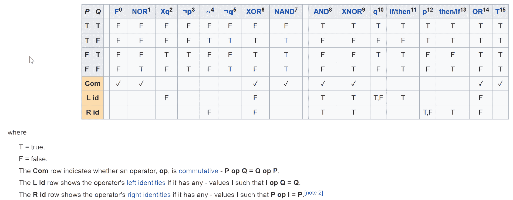
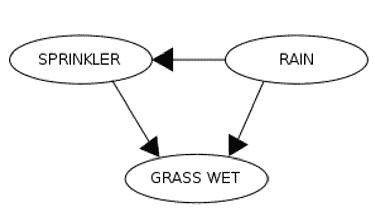

# 贝叶斯直觉 – 解决肇事逃逸之谜和进行数据分析


注意到本章的开头是一个直接面对算法吗？我想确保你看到的第一件事就是这个公式。这强调了它在你机器学习生涯中的重要性。把它写下来，把它贴在你的显示器上的便利贴上，或者把它记在心里！

在本章中，我们将：

+   将著名的贝叶斯定理应用于解决计算机科学中一个非常著名的问题

+   展示你如何使用贝叶斯定理和朴素贝叶斯来绘制数据，从真值表中发现异常，等等

# 概述贝叶斯定理

说实话，贝叶斯定理的解释和关于它的书籍一样多。前面展示的是我们将要讨论的主要解释。我也鼓励你参考[`brilliant.org/wiki/bayes-theorem/`](https://brilliant.org/wiki/bayes-theorem/)进行进一步阅读。

为了使这个内容更具体和正式，让我们从一点直觉和正式性开始；这将帮助我们为即将到来的内容做好准备。

当我们使用贝叶斯定理时，我们是在衡量某件事的信念程度，即事件发生的可能性。现在就让我们保持这个简单的理解：


前面的公式表示在 B 的条件下 A 的概率。

概率通常被量化为一个介于 0 和 1 之间的数，包括 0 和 1；0 表示不可能性，1 表示绝对确定性。概率越高，确定性就越大。掷骰子得到 6 和抛硬币得到正面的概率是你无疑非常熟悉的概率例子。还有一个你熟悉且每天都会遇到的例子：垃圾邮件。

我们中的大多数人通常都会全天（有些人甚至整夜）打开电子邮件，就放在我们身边！随着我们期待收到的邮件，也伴随着那些我们不期待且不希望收到的邮件。我们都讨厌处理垃圾邮件，那种与任何事物都无关，只与伟哥有关的讨厌的电子邮件；然而，我们似乎总是能收到它。我每天收到的那些邮件中，任何一封是垃圾邮件的概率是多少？我关心它的内容的概率是多少？我们如何才能知道呢？

所以，让我们简单谈谈垃圾邮件过滤器是如何工作的，因为，你看，这可能是我们能用到的最好的概率例子！为了更精确和更正式，我们正在处理**条件概率**，即在事件 B 发生的情况下事件 A 的概率。

大多数垃圾邮件过滤器的工作方式，至少在非常基本层面上，是通过定义一个单词列表，这些单词用来指示我们不希望或未请求收到的电子邮件。如果电子邮件包含这些单词，它就被认为是垃圾邮件，我们相应地处理它。因此，使用贝叶斯定理，我们寻找给定一组单词的电子邮件是垃圾邮件的概率，这在公式化视角下看起来是这样的：


**给定一组单词的电子邮件是垃圾邮件的概率**：维基百科的用户 Qniemiec 有一个令人难以置信的视觉图解，它全面解释了概率视角的每一种组合，这由两个事件树的叠加表示。如果你像我一样是一个视觉型的人，这里是对贝叶斯定理的完整可视化，由两个事件树图叠加表示：


现在，让我们转向一个非常著名的问题。它被许多人称为不同的名字，但基本问题就是众所周知的**出租车问题**。这是我们的场景，我们将尝试使用概率和贝叶斯定理来解决这个问题。

一名优步司机卷入了一起肇事逃逸事故。著名的黄色出租车和优步司机是这座城市中运营的两家公司，随处可见。我们得到了以下数据：

+   这座城市中 85%的出租车是黄色的，15%是优步。

+   一名目击者指认了肇事逃逸事故中涉及的车辆，并表示该车上有优步标志。话虽如此，我们知道目击者证词的可靠性，因此法院决定测试用户并确定其可靠性。使用事故当晚相同的情况，法院得出结论，目击者 80%的时间正确地识别了这两辆车中的每一辆，但 20%的时间失败了。这一点很重要，所以请跟我一起继续看下去！

**我们的困境**：事故中涉及的车辆是优步司机还是黄色出租车的概率是多少？

从数学上讲，我们是这样得到我们需要的答案的：

+   正确识别的优步司机总数为：

*15 * 0.8 = 12*

+   目击者 20%的时间是错误的，所以错误识别的车辆总数为：

*85 * 0.2 = 17*

+   因此，目击者总共识别的车辆数为 *12 + 17 = 29*。因此，他们正确识别优步司机的概率是：

*12/29 = @41.3%*

现在，让我们看看我们是否可以开发一个简单的程序来帮助我们得到这个数字，以证明我们的解决方案是可行的。为了完成这个任务，我们将深入我们的第一个开源工具包：**Encog**。Encog 被设计来处理正好像这样的问题。

Encog 框架是一个完整的机器学习框架，由杰夫·希顿先生开发。希顿先生还出版了关于 Encog 框架以及其他主题的几本书，如果您计划广泛使用此框架，我鼓励您去寻找它们。我个人拥有它们的所有，并将它们视为开创性的作品。

让我们看看解决我们问题所需的代码。正如您将注意到的，数学、统计学、概率……这些都从您那里抽象出来。Encog 可以使您专注于您试图解决的商业问题。

完整的执行块看起来像以下代码。我们将在稍后开始分析它。

```py
public void Execute(IExampleInterface app)
{
            // Create a Bayesian network
            BayesianNetwork network = new BayesianNetwork();
            // Create the Uber driver event
            BayesianEvent UberDriver = network.CreateEvent("uber_driver");
            // create the witness event
            BayesianEvent WitnessSawUberDriver = network.CreateEvent("saw_uber_driver");
            // Attach the two
            network.CreateDependency(UberDriver, WitnessSawUberDriver);
            network.FinalizeStructure();
            // build the truth tables
            UberDriver?.Table?.AddLine(0.85, true);
            WitnessSawUberDriver?.Table?.AddLine(0.80, true, true);
            WitnessSawUberDriver?.Table?.AddLine(0.20, true, false);
            network.Validate();
            Console.WriteLine(network.ToString());
            Console.WriteLine($"Parameter count: {network.CalculateParameterCount()}");
            EnumerationQuery query = new EnumerationQuery(network);
            // The evidence is that someone saw the Uber driver hit the car
            query.DefineEventType(WitnessSawUberDriver, EventType.Evidence);
            // The result was the Uber driver did it
            query.DefineEventType(UberDriver, EventType.Outcome);
            query.SetEventValue(WitnessSawUberDriver, false);
            query.SetEventValue(UberDriver, false);
            query.Execute();
            Console.WriteLine(query.ToString());
}
```

好的，让我们将其分解成更易于消化的部分。我们首先要做的是创建一个贝叶斯网络。这个对象将是解决我们谜题的中心。`BayesianNetwork`对象是一个概率和分类引擎的包装器。

贝叶斯网络由一个或多个`BayesianEvents`组成。一个事件将是三种不同类型之一——`Evidence`、`Outcome`或`Hidden`——并且通常对应于训练数据中的一个数字。`Event`总是离散的，但如果存在并且需要，连续值可以映射到一系列离散值。

在创建初始网络对象之后，我们为声称看到司机卷入追尾逃逸事件的 Uber 司机以及目击者创建一个事件。我们将创建 Uber 司机和目击者之间的依赖关系，然后最终确定我们网络的结构：

```py
public void Execute(IExampleInterface app)
         {
             // Create a Bayesian network
             BayesianNetwork network = new BayesianNetwork();
             // Create the Uber driver event
             BayesianEvent UberDriver = network.CreateEvent("uber_driver");
             // create the witness event
             BayesianEvent WitnessSawUberDriver = network.CreateEvent("saw_uber_driver");
             // Attach the two
             network.CreateDependency(UberDriver, WitnessSawUberDriver);
             network.FinalizeStructure();

             // build the truth tables
             UberDriver?.Table?.AddLine(0.85, true);
             WitnessSawUberDriver?.Table?.AddLine(0.80, true, true);
             WitnessSawUberDriver?.Table?.AddLine(0.20, true, false);
             network.Validate();

             Console.WriteLine(network.ToString());
             Console.WriteLine($"Parameter count: {network.CalculateParameterCount()}");

             EnumerationQuery query = new EnumerationQuery(network);

             // The evidence is that someone saw the Uber driver hit the car
             query.DefineEventType(WitnessSawUberDriver, EventType.Evidence);
             // The result was the Uber driver did it
             query.DefineEventType(UberDriver, EventType.Outcome);
             query.SetEventValue(WitnessSawUberDriver, false);
             query.SetEventValue(UberDriver, false);
             query.Execute();
             Console.WriteLine(query.ToString());
         }
```

接下来，我们需要构建实际的真值表。真值表是一个函数可以具有的所有可能值的列表。有一行或多行，其复杂性逐渐增加，最后一行是最终函数值。如果您记得逻辑理论，您基本上可以有三个操作：`NOT`、`AND`和`OR`。0 通常代表`false`，而 1 通常代表`true`。

如果我们再深入一点，我们会看到以下规则：

**如果 A = 0，则-A = 1**；**如果 A = 1，则-A = 0**；**A+B = 1，除非 A 和 B = 0**；**如果 A 和 B = 0，则 A+B = 0**；**A*B = 0，除非 A 和 B = 1**；**如果 A 和 B = 1，则 A*B = 1**

现在，回到我们的代码。

要构建真值表，我们需要知道概率和结果值。在我们的问题中，Uber 司机卷入事故的概率是 85%。至于目击者，有 80%的可能性他们在说真话，有 20%的可能性他们犯了错误。我们将使用真值表的`AddLine`函数来添加这些信息：

```py
// build the truth tables
UberDriver?.Table?.AddLine(0.85, true);
WitnessSawUberDriver?.Table?.AddLine(0.80, true, true);
WitnessSawUberDriver?.Table?.AddLine(0.20, true, false);
network.Validate();
```

让我们再谈谈真值表。这里是一个扩展的真值表，显示了两个变量*P*和*Q*的所有可能的真值函数。



如果我们要更广泛地编程我们的真值表，以下是一个例子：

```py
a?.Table?.AddLine(0.5, true); // P(A) = 0.5
x1?.Table?.AddLine(0.2, true, true); // p(x1|a) = 0.2
x1?.Table?.AddLine(0.6, true, false);// p(x1|~a) = 0.6
x2?.Table?.AddLine(0.2, true, true); // p(x2|a) = 0.2
x2?.Table?.AddLine(0.6, true, false);// p(x2|~a) = 0.6
x3?.Table?.AddLine(0.2, true, true); // p(x3|a) = 0.2
x3?.Table?.AddLine(0.6, true, false);// p(x3|~a) = 0.6
```

现在我们已经构建了网络和真值表，是时候定义一些事件了。正如我们之前提到的，事件可以是`证据`、`隐藏`或`结果`中的任何一个。`隐藏`事件，既不是`证据`也不是`结果`，但它仍然涉及到贝叶斯图本身。我们不会使用`隐藏`，但我希望你知道它确实存在。

为了解决我们的谜团，我们必须积累证据。在我们的例子中，我们有的证据是目击者报告说看到一名优步司机参与了追尾逃逸。我们将定义一个`证据`类型的事件并将其分配给目击者报告的内容。结果是，它是一名优步司机，因此我们将分配一个结果类型的事件。

最后，我们必须考虑到，至少在某些时候，目击者报告看到优步司机参与追尾逃逸是不正确的。因此，我们必须为两种概率创建事件值——目击者没有看到优步司机，以及优步司机没有参与：

```py
EnumerationQuery query = new EnumerationQuery(network);

// The evidence is that someone saw the Uber driver hit the car
query.DefineEventType(WitnessSawUberDriver, EventType.Evidence);
// The result was the Uber driver did it
query.DefineEventType(UberDriver, EventType.Outcome);
query.SetEventValue(WitnessSawUberDriver, false);
query.SetEventValue(UberDriver, false);
query.Execute();
```

注意，我们将要执行的是一个`枚举查询`。这个对象允许对贝叶斯网络进行概率查询。这是通过计算隐藏节点的所有组合并使用总概率来找到结果来实现的。如果我们的贝叶斯网络很大，性能可能会较弱，但幸运的是，对我们来说，它并不大。

最后，我们对贝叶斯网络定义执行查询并打印结果：


结果，正如我们所希望的，是 41%。

作为一项练习，看看你现在是否可以使用 Encog 解决另一个非常著名的例子。在这个例子中，我们早上醒来发现草地是湿的。是下雨了，还是洒水器打开了，或者两者都有？这是我们用笔和纸上的真值表：



下雨的概率：


完整的真值表：


# 概述朴素贝叶斯和绘制数据

尽管我们讨论了贝叶斯定理，如果我们不讨论朴素贝叶斯，那将是对你极大的不公。朴素贝叶斯无处不在，并且有很好的理由。它几乎总是工作得很好（因此得名，朴素），你肯定会在你的机器学习生涯中接触到它。它是一种基于这样一个前提的简单技术：任何单个特征的价值完全独立于任何其他特征的价值。例如，一个橙子是圆的，颜色是橙色的，皮不是光滑的，直径在 10-20 厘米之间。朴素贝叶斯分类器将考虑之前描述的每个特征独立地贡献，认为这是一个橙子而不是苹果、柠檬等等，即使其特征之间有一些数据关系。

如前所述，朴素贝叶斯在解决复杂情况时出奇地高效。尽管在某些情况下它可能无法超越其他算法，但它可以是一个很好的初次尝试算法，适用于你的问题。与许多其他模型相比，我们只需要非常少量的训练数据。

# 数据绘图

在我们的下一个应用中，我们将使用出色的 Accord.NET 机器学习框架为你提供一个工具，你可以用它输入数据，观察数据被绘制，并了解假阳性和假阴性。我们将能够为存在于我们的数据空间中的对象输入数据，并将它们分类为绿色或蓝色。我们将能够更改这些数据，并看到它们是如何被分类的，更重要的是，如何被直观地表示。我们的目标是学习新案例属于哪个集合；它们要么是绿色，要么是蓝色。此外，我们还想跟踪假阳性和假阴性。朴素贝叶斯将根据我们数据空间中的数据为我们完成这项工作。记住，在我们训练朴素贝叶斯分类器之后，最终目标是它能从它以前从未见过的数据中识别出新对象。如果它不能，那么我们需要回到训练阶段。

我们简要地讨论了真值表，现在是我们回到并在这个定义上增加一些正式性的时候了。更具体地说，让我们用**混淆矩阵**来讨论。在机器学习中，混淆矩阵（错误矩阵或匹配矩阵）是一个表格布局，它让你能够可视化算法的性能。每一行代表预测的类实例，每一列代表实际的类实例。它被称为混淆矩阵，因为这种可视化使得很容易看出你是否混淆了这两个。

真值表的抽象视图可能看起来像这样：

|  | **X 存在** | **X 不存在** |  |
| --- | --- | --- | --- |
| 测试结果为正 | 真阳性 | 假阳性 | 总正数 |
| 测试结果为负 | 假阴性 | 真阴性 | 总负数 |
|  | 带有 X 的总数 | 没有 X 的总数 | 总计 |

对于相同的真值表，一个更直观的视图可能看起来像这样：


真值表的直观视图

最后，一个更正式的真混淆矩阵的视图：


在机器学习的领域，真值表/混淆矩阵允许你直观地评估算法的性能。正如你将在我们接下来的应用中看到的那样，每次你添加或更改数据时，你都将能够看到是否发生了任何这些错误或负面的条件。

目前，我们将开始使用的测试数据在绿色和蓝色物体之间均匀分配，因此没有合理的概率表明任何新案例更有可能是其中之一而不是另一个。这种合理的概率，有时被称为 **信念**，更正式地称为 **先验概率**（这个词又出现了！）。先验概率是基于我们对数据的先前经验，在许多情况下，这些信息被用来预测事件发生之前的结果。给定先验概率或信念，我们将制定一个结论，然后这成为我们的 **后验信念**。

在我们的情况下，我们正在查看：

+   绿色物体的先验概率是绿色物体的总数/我们数据空间中物体的总数

+   蓝色物体的先验概率是蓝色物体的总数/我们数据空间中物体的总数

让我们进一步了解一下发生了什么。

你可以在下面的屏幕截图中看到我们的数据看起来是什么样子。*X* 和 *Y* 列表示数据空间中沿 *x* 和 *y* 轴的坐标，而 *G* 列表示物体是否为绿色的标签。记住，监督学习应该给我们我们试图达到的客观结果，朴素贝叶斯应该使我们能够轻松地看到这是否为真。


如果我们取前面的数据并创建其散点图，它将看起来像下面的屏幕截图。正如你所看到的，我们数据空间中的所有点都被绘制出来，其中 *G* 列值为 0 的点被绘制为蓝色，而值为 1 的点被绘制为绿色。

每个数据点都绘制在我们数据空间中的 *X*/*Y* 位置上，由 *x*/*y* 轴表示：


但当我们向数据空间添加朴素贝叶斯分类器无法正确分类的新物体时会发生什么？我们最终得到的是所谓的假阴性和假阳性，如下所示：


由于我们只有两种数据类别（绿色和蓝色），我们需要确定这些新数据对象将如何被正确分类。正如你所看到的，我们有 14 个新的数据点，着色显示它们与 *x* 和 *y* 轴的对齐情况。

现在，让我们以完整的形式查看我们的应用程序。以下是我们主屏幕的屏幕截图。在屏幕左侧的“数据样本”选项卡下，我们可以看到我们已经加载了数据空间。在屏幕右侧，我们可以看到一个散点图视觉图，它帮助我们可视化数据空间。正如你所看到的，所有数据点都已正确绘制并着色：


如果我们查看概率的分类和绘制方式，你可以看到数据几乎呈现为两个封闭但重叠的簇：


当我们空间中的一个数据点与不同颜色的不同数据点重叠时，那就是我们需要朴素贝叶斯为我们做工作的地方。

如果我们切换到我们的模型测试标签页，我们可以看到我们添加的新数据点。


接下来，让我们修改一些我们添加的数据点，以展示任何一个数据点如何变成误报或漏报。请注意，我们从这个练习开始有七个误报和七个漏报。


我们之前所做的数据修改导致以下图表。如您所见，我们现在有额外的误报：


我将把实验数据并继续你的朴素贝叶斯学习留给你去尝试！

# 摘要

在本章中，我们学习了概率论、贝叶斯定理、朴素贝叶斯，以及如何将其应用于现实世界的问题。我们还学习了如何开发一个工具，帮助我们测试我们的分类器，看看我们的数据是否包含任何误报或漏报。

在下一章中，我们将更深入地探讨机器学习的世界，并讨论强化学习。

# 参考文献

+   Creative Commons Attribution—ShareAlike License

+   Heaton, J. (2015). *Encog: Library of Interchangeable Machine Learning Models for Java and C#*, *Journal of Machine Learning Research*, 16, 1243-1247

+   版权所有 2008-2014，Heaton Research，Inc

+   版权所有（c）2009-2017，Accord.NET 作者 authors@accord-framework.net

+   *案例研究：重新审视基础率谬误*（Koehler，1996）
