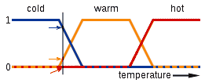
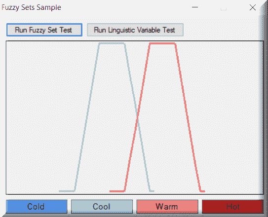
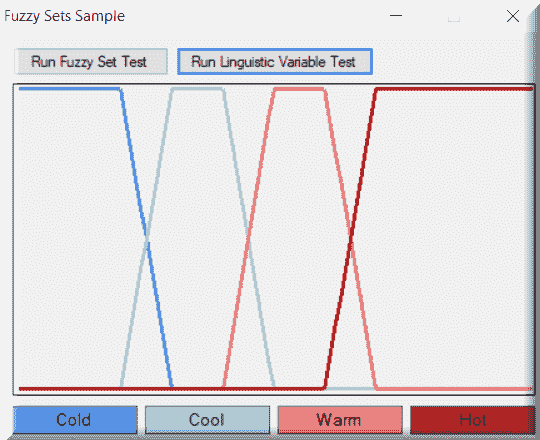
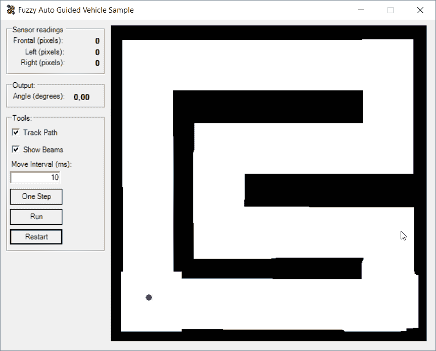
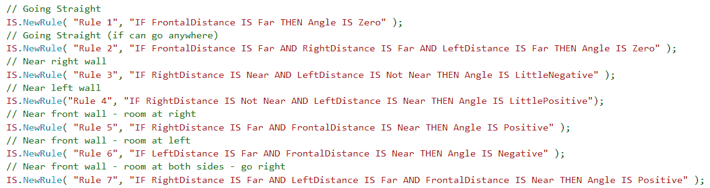
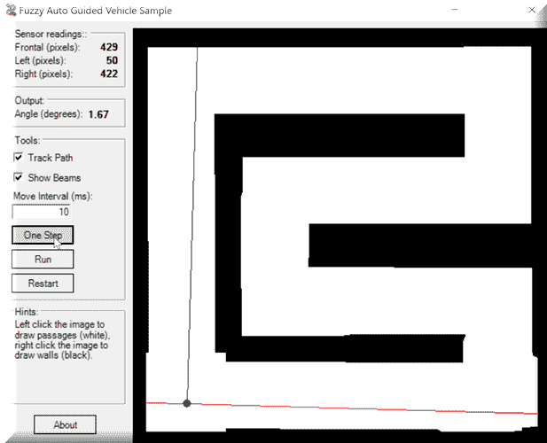
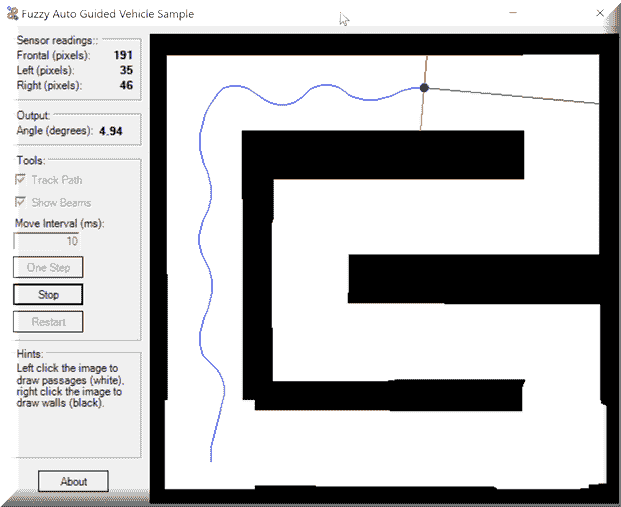
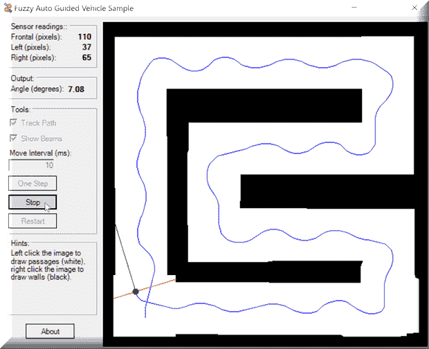
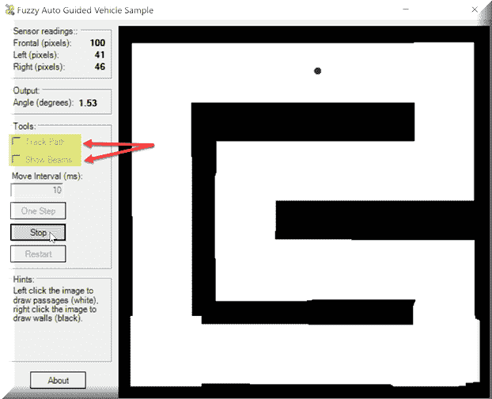
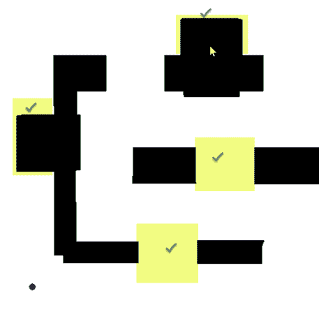

# 模糊逻辑 – 在障碍赛道中导航

**模糊逻辑**。这是那些你经常听到的 buzzword-compliant 术语之一。但它究竟意味着什么，它是否意味着不止一件事？我们马上就要找出答案了。我们将使用模糊逻辑来帮助引导自动驾驶车辆绕过障碍赛道，如果我们做得正确，我们将避免途中的障碍。我们的**自动导引车**（**AGV**）将绕过障碍赛道导航，感知其路径上的障碍。它将使用推理系统来帮助引导。作为用户，你将能够创建障碍或通道，AGV 要么必须避开，要么可以利用。你可以观看追踪光束的工作，以及跟踪 AGV 在其路径上的行进。AGV 每迈出的一步都会在用户界面上更新，这样你就可以看到发生了什么。

在布尔逻辑中，事物要么是真的，要么是假的，要么是开，要么是关，要么是黑，要么是白。许多人不知道的是，还有一种被称为**多值逻辑**的逻辑，其中真值介于 1 和 0 之间。模糊逻辑是多值逻辑的概念实现，它处理部分真值。许多人也不知道的是，你将在我们关于激活函数的章节中听到的著名 sigmoid 函数，实际上是一种模糊化方法。

维基百科有一个很好的视觉表示，如下所示：



根据维基百科：

"在这张图中，冷、暖和热这些表达的含义是通过映射温度尺度的函数来表示的。该尺度上的一个点有三个“真值”——每个函数对应一个。图中的垂直线代表三个箭头（真值）所测量的特定温度。由于红色箭头指向零，这个温度可以解释为“不热”。橙色箭头（指向 0.2）可能描述它为“略微温暖”，而蓝色箭头（指向 0.8）则“相当冷”。"

这个图表和描述非常准确地代表了我们将要深入探讨的内容。我们为什么要展示这个？因为我们的第一个例子将正好展示这一点。为了说明模糊逻辑，我们将使用 AForge.NET 开源机器学习框架。对于用户来说，这是一个展示如何轻松使用推理引擎来完成任务的优秀框架。

在本章中，我们将涵盖：

+   模糊逻辑

+   自主导引车辆

+   障碍物避让和识别

# 模糊逻辑

我们的应用程序将有两个简单的按钮，一个用于运行模糊集测试，另一个用于运行语言变量测试。以下是我们示例应用程序的快速快照：



创建此示例的代码相对较小且简单。当我们点击运行模糊集测试按钮时，它看起来是这样的。我们将创建两个模糊集（一个用于凉爽，一个用于温暖），为每个添加一些隶属度数据值，然后绘制它们：

```py
TrapezoidalFunction function1 = new TrapezoidalFunction( 13, 18, 23, 28 );
             FuzzySet fsCool = new FuzzySet( "Cool", function1 );
             TrapezoidalFunction function2 = new TrapezoidalFunction( 23, 28, 33, 38 );
             FuzzySet fsWarm = new FuzzySet( "Warm", function2 );

             double[,] coolValues = new double[20, 2];
             for ( int i = 10; i < 30; i++ )
             {
                 coolValues[i - 10, 0] = i;
                 coolValues[i - 10, 1] = fsCool.GetMembership( i );
             }

             double[,] warmValues = new double[20, 2];
             for ( int i = 20; i < 40; i++ )
             {
                 warmValues[i - 20, 0] = i;
                 warmValues[i - 20, 1] = fsWarm.GetMembership( i );
             }

             chart?.UpdateDataSeries( "COOL", coolValues );
             chart?.UpdateDataSeries( "WARM", warmValues );
```

运行语言变量测试的代码如下。同样，我们创建模糊集，但这次我们创建了四个而不是两个。就像我们的第一个测试一样，我们添加隶属度数据然后绘制：

```py
LinguisticVariable lvTemperature = new LinguisticVariable( "Temperature", 0, 80 );
             TrapezoidalFunction function1 = new TrapezoidalFunction( 10, 15, TrapezoidalFunction.EdgeType.Right );
             FuzzySet fsCold = new FuzzySet( "Cold", function1 );
             TrapezoidalFunction function2 = new TrapezoidalFunction( 10, 15, 20, 25 );
             FuzzySet fsCool = new FuzzySet( "Cool", function2 );
             TrapezoidalFunction function3 = new TrapezoidalFunction( 20, 25, 30, 35 );
             FuzzySet fsWarm = new FuzzySet( "Warm", function3 );
             TrapezoidalFunction function4 = new TrapezoidalFunction( 30, 35, TrapezoidalFunction.EdgeType.Left );
             FuzzySet fsHot = new FuzzySet( "Hot", function4 );

             lvTemperature.AddLabel( fsCold );
             lvTemperature.AddLabel( fsCool );
             lvTemperature.AddLabel( fsWarm );
             lvTemperature.AddLabel( fsHot );

             double[][,] chartValues = new double[4][,];
             for ( int i = 0; i < 4; i++ )
                 chartValues[i] = new double[160, 2];
```

最后，我们绘制这些值：

```py
int j = 0;
             for ( float x = 0; x < 80; x += 0.5f, j++ )
             {
                 double y1 = lvTemperature.GetLabelMembership( "Cold", x );
                 double y2 = lvTemperature.GetLabelMembership( "Cool", x );
                 double y3 = lvTemperature.GetLabelMembership( "Warm", x );
                 double y4 = lvTemperature.GetLabelMembership( "Hot", x );

                 chartValues[0][j, 0] = x;
                 chartValues[0][j, 1] = y1;
                 chartValues[1][j, 0] = x;
                 chartValues[1][j, 1] = y2;
                 chartValues[2][j, 0] = x;
                 chartValues[2][j, 1] = y3;
                 chartValues[3][j, 0] = x;
                 chartValues[3][j, 1] = y4;
             }

             chart.UpdateDataSeries( "COLD", chartValues[0] );
             chart.UpdateDataSeries( "COOL", chartValues[1] );
             chart.UpdateDataSeries( "WARM", chartValues[2] );
             chart.UpdateDataSeries( "HOT", chartValues[3] );
```

语言变量形状：



如您所见，我们能够轻松地展示出维基百科定义所呈现的精确视觉定义和清晰度。

# 模糊 AGV

在这个例子中，我们将比我们第一个例子更深入地探讨。在我们继续之前，让我先向您展示我们的应用程序将是什么样子，然后简要解释一下推理引擎：



虽然 AForge.NET 使我们创建`InferenceSystem`对象变得非常简单和透明，但我们可能首先应该向您简要介绍一下这样一个系统是什么。模糊推理系统是一个能够执行模糊计算的模型。这是通过使用数据库、语言变量和规则库来实现的，所有这些都可以在内存中。模糊推理系统的典型操作如下：

+   获取数值输入

+   利用包含语言变量的数据库来获取每个数值输入的语言意义

+   验证哪些规则从规则库中被激活

+   将激活的规则的结果组合起来以获得模糊输出

对于我们来说，大部分工作将在初始化我们的模糊逻辑系统中完成。让我们将其分解为我们之前概述的各个步骤。

首先，我们准备构成我们将拥有的距离的语言标签（模糊集），它们是`近`、`中`和`远`：

```py
            FuzzySet fsNear = new FuzzySet( "Near", new TrapezoidalFunction( 15, 50, TrapezoidalFunction.EdgeType.Right ) );
             FuzzySet fsMedium = new FuzzySet( "Medium", new TrapezoidalFunction( 15, 50, 60, 100 ) );
             FuzzySet fsFar = new FuzzySet( "Far", new TrapezoidalFunction( 60, 100, TrapezoidalFunction.EdgeType.Left ) );
```

接下来，我们初始化我们将需要的语言变量。第一个，`lvRight`，将是一个用于右侧距离测量的输入变量：

```py
            LinguisticVariable lvRight = new LinguisticVariable( "RightDistance", 0, 120 );
             lvRight.AddLabel( fsNear );
             lvRight.AddLabel( fsMedium );
             lvRight.AddLabel( fsFar );
```

现在，我们对左侧距离输入测量也做同样的处理：

```py
            LinguisticVariable lvLeft = new LinguisticVariable( "LeftDistance", 0, 120 );
             lvLeft.AddLabel( fsNear );
             lvLeft.AddLabel( fsMedium );
             lvLeft.AddLabel( fsFar );
```

我们最后一个语言变量将用于前距离测量：

```py
            LinguisticVariable lvFront = new LinguisticVariable( "FrontalDistance", 0, 120 );
             lvFront.AddLabel( fsNear );
             lvFront.AddLabel( fsMedium );
             lvFront.AddLabel( fsFar );
```

现在，我们专注于构成角度的语言标签（模糊集）。我们需要执行这一步骤，以便我们可以创建我们的最终语言变量：

```py
            FuzzySet fsVN = new FuzzySet( "VeryNegative", new TrapezoidalFunction( -40, -35, TrapezoidalFunction.EdgeType.Right));
             FuzzySet fsN = new FuzzySet( "Negative", new TrapezoidalFunction( -40, -35, -25, -20 ) );
             FuzzySet fsLN = new FuzzySet( "LittleNegative", new TrapezoidalFunction( -25, -20, -10, -5 ) );
             FuzzySet fsZero = new FuzzySet( "Zero", new TrapezoidalFunction( -10, 5, 5, 10 ) );
             FuzzySet fsLP = new FuzzySet( "LittlePositive", new TrapezoidalFunction( 5, 10, 20, 25 ) );
             FuzzySet fsP = new FuzzySet( "Positive", new TrapezoidalFunction( 20, 25, 35, 40 ) );
             FuzzySet fsVP = new FuzzySet( "VeryPositive", new TrapezoidalFunction( 35, 40, TrapezoidalFunction.EdgeType.Left));
```

现在，我们可以创建我们的最终语言变量，用于角度：

```py
            LinguisticVariable lvAngle = new LinguisticVariable( "Angle", -50, 50 );
             lvAngle.AddLabel( fsVN );
             lvAngle.AddLabel( fsN );
             lvAngle.AddLabel( fsLN );
             lvAngle.AddLabel( fsZero );
             lvAngle.AddLabel( fsLP );
             lvAngle.AddLabel( fsP );
             lvAngle.AddLabel( fsVP );
```

现在，我们可以继续创建我们的模糊数据库。对于我们的应用程序，这是一个内存中的语言变量字典，但如果你愿意，没有理由你不能将其实现为一个 SQL、NoSQL 或任何其他类型的具体数据库：

```py
            Database fuzzyDB = new Database( );
             fuzzyDB.AddVariable( lvFront );
             fuzzyDB.AddVariable( lvLeft );
             fuzzyDB.AddVariable( lvRight );
             fuzzyDB.AddVariable( lvAngle );
```

接下来，我们将创建主要推理引擎。接下来这一行代码最有趣的地方是 `CentroidDifuzzifier`。在我们推理过程的末尾，我们需要一个数值来控制过程的其它部分。为了获得这个数值，执行去模糊化方法。让我解释一下。

我们模糊推理系统的输出是一组具有大于零的激发强度的规则。这种激发强度对规则的后续模糊集施加约束。当我们把所有这些模糊集放在一起时，它们的结果是一个形状，表示语言输出意义。质心法将计算我们形状区域的中心，以获得输出的数值表示。它使用数值近似，因此将选择几个区间。随着区间数量的增加，我们输出的精度也增加：

```py
IS = new InferenceSystem(fuzzyDB, new CentroidDefuzzifier(1000));
```

接下来，我们可以开始向我们的推理系统添加规则：



在所有这些工作之后，我们的推理系统准备就绪！

我们应用程序的主要代码循环将看起来像这样。我们将详细描述每个函数：

```py
if (FirstInference)
                 GetMeasures();

             try
             {
                 DoInference();
                 MoveAGV();
                 GetMeasures();
             }
             catch (Exception ex)
             {
                 Debug.WriteLine(ex);
             }
```

让我们快速看一下 `GetMeasures` 函数。

在获取当前位图以及我们的 AGV 位置后，我们调用 `HandleAGVOnWall` 函数，该函数处理我们的 AGV 靠墙且无处可移动的情况。之后，`DrawAGV` 处理在地图中绘制我们的 AGV。最后，`RefreshTerrain` 函数正是其名称所暗示的：

```py
        private void GetMeasures()
         {
             // Getting AGV's position
             pbTerrain.Image = CopyImage(OriginalMap);
             Bitmap b = (Bitmap) pbTerrain.Image;
             Point pPos = new Point(pbRobot.Left - pbTerrain.Left + 5, pbRobot.Top - pbTerrain.Top + 5);

             // AGV on the wall
             HandleAGVOnWall(b, pPos);

             DrawAGV(pPos, b);

             RefreshTerrain();
         }
```

`DrawAGV` 获取我们面前、左侧和右侧的任何障碍物。如果你选中了“显示光束”复选框，你将看到前、左和右光束避障检测器显示：

```py
private void DrawAGV(Point pPos, Bitmap b)
         {
             Point pFrontObstacle = GetObstacle(pPos, b, -1, 0);
             Point pLeftObstacle = GetObstacle(pPos, b, 1, 90);
             Point pRightObstacle = GetObstacle(pPos, b, 1, -90);

             // Showing beams
             Graphics g = Graphics.FromImage(b);
             if (cbLasers.Checked)
             {
                 g.DrawLine(new Pen(Color.Red, 1), pFrontObstacle, pPos);
                 g.DrawLine(new Pen(Color.Red, 1), pLeftObstacle, pPos);
                 g.DrawLine(new Pen(Color.Red, 1), pRightObstacle, pPos);
             }

             // Drawing AGV
             if (btnRun.Text != RunLabel)
             {
                 g.FillEllipse(new SolidBrush(Color.Blue), pPos.X - 5, pPos.Y - 5, 10, 10);
             }

             g.DrawImage(b, 0, 0);
             g.Dispose();

             // Updating distances texts
             txtFront.Text = GetDistance(pPos, pFrontObstacle).ToString();
             txtLeft.Text = GetDistance(pPos, pLeftObstacle).ToString();
             txtRight.Text = GetDistance(pPos, pRightObstacle).ToString();
         }
```

`DoInference` 函数运行我们模糊推理系统的一个纪元（实例、生成等）。最终，它负责确定我们 AGV 的下一个角度。

```py
 private void DoInference()
         {
             // Setting inputs
             IS?.SetInput("RightDistance", Convert.ToSingle(txtRight.Text));
             IS?.SetInput("LeftDistance", Convert.ToSingle(txtLeft.Text));
             IS?.SetInput("FrontalDistance", Convert.ToSingle(txtFront.Text));

             // Setting outputs
             try
             {
                 double NewAngle = IS.Evaluate("Angle");
                 txtAngle.Text = NewAngle.ToString("##0.#0");
                 Angle += NewAngle;
             }
             catch (Exception)
             {
             }
         }
```

`MoveAGV` 函数负责将我们的 AGV 移动一步。大约 50% 的代码在这个函数中是专门用于绘制你的 AGV 的历史轨迹，如果你勾选了“跟踪路径”：

```py
 private void MoveAGV()
         {
             double rad = ((Angle + 90) * Math.PI) / 180;
             int Offset = 0;
             int Inc = -4;

             Offset += Inc;
             int IncX = Convert.ToInt32(Offset * Math.Cos(rad));
             int IncY = Convert.ToInt32(Offset * Math.Sin(rad));

             // Leaving the track
             if (cbTrajeto.Checked)
             {
                 Graphics g = Graphics.FromImage(OriginalMap);
                 Point p1 = new Point(pbRobot.Left - pbTerrain.Left + pbRobot.Width / 2, pbRobot.Top - pbTerrain.Top + pbRobot.Height / 2);
                 Point p2 = new Point(p1.X + IncX, p1.Y + IncY);
                 g.DrawLine(new Pen(new SolidBrush( Color.Green)), p1, p2);
                 g.DrawImage(OriginalMap, 0, 0);
                 g.Dispose();
             }

             pbRobot.Top = pbRobot.Top + IncY;
             pbRobot.Left = pbRobot.Left + IncX;
         }
```

选择“显示光束”的主要应用：



在我们的应用程序运行时，AGV 成功地导航障碍物，路径和光束都显示出来。角度是 AGV 当前面对的角度，传感器读数与显示的前、左、右光束传感器相关：



我们的 AGV 正在成功完成障碍课程并通过：



可以分别选择“跟踪路径”和“显示光束”：



这显示了如何使用左右鼠标按钮添加障碍物和通道，分别阻止和允许 AGV 通过：



# 摘要

在本章中，我们学习了各种模糊逻辑的实现方式，并亲眼见证了使用 AForge.NET 将这种逻辑添加到我们的应用程序是多么简单。在下一章中，我们将深入探索自组织图，将我们的机器学习技能提升到新的水平。如果你还记得你小学时的美术课，那么这一章一定会唤起你的回忆！

# 参考文献

AForge.NET: 版权所有 © AForge.NET, 2006-2013
