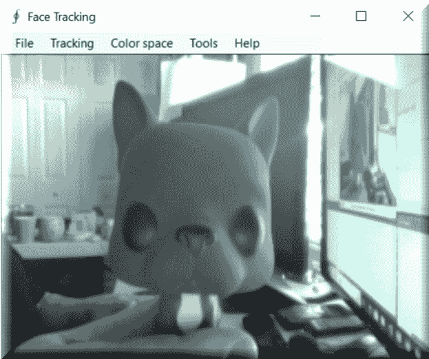

# 面部检测和运动检测 – 图像过滤器

您无处不在都见过和听说过它。面部识别，运动检测。我们家里的安全系统中就有运动传感器。每个人都正在进行面部识别——我们的街道、机场，甚至可能在我们家里都有安全摄像头。如果我们考虑自动驾驶汽车必须完成的所有事情，哇！在写作的时候，有一个关于面部识别技术如何在 5 万名面孔的群众中识别出嫌疑人的链接。[`www.digitaltrends.com/cool-tech/facial-recognition-china-50000/`](https://www.digitaltrends.com/cool-tech/facial-recognition-china-50000/)

但这究竟意味着什么？它是如何做到这一点的？幕后发生了什么？我如何在应用程序中使用它？在本章中，我们将展示两个独立的示例，一个用于面部检测，另一个用于运动检测。我们将向您展示具体发生了什么，以及您如何快速将这些功能添加到您的应用程序中。

在本章中，我们将涵盖：

+   面部检测

+   运动检测

    +   将检测添加到您的应用程序

# 面部检测

让我们从面部检测开始。在我们的例子中，我将使用我那友好的小法国斗牛犬 Frenchie 作为我们的助手。我曾试图让我的美丽妻子来完成这个任务，但化妆、发型；嗯，我相信您知道那个故事！然而，Frenchie 这只斗牛犬却没有怨言。

在我开始之前，请重新阅读章节标题。无论您读多少次，您可能都会错过这里的关键点，它非常重要。注意它说的是**面部检测**而不是**面部识别**。这一点非常重要，以至于我需要停下来再次强调。我们不是试图识别乔、鲍勃或萨莉。我们试图识别的是，通过我们的摄像头看到的所有事物中，我们可以检测到一张脸。我们并不关心这是谁的脸，只是它是一张脸！这一点非常重要，在我们继续之前我们必须理解这一点！否则，您的期望可能会被错误地偏向（另一个清单上的时髦词）而让您自己感到困惑和沮丧，我们不希望这样！

面部检测，就像我稍后会再次强调的那样，是面部识别的第一部分，这是一个更加复杂的生物。如果您不能从屏幕上的所有事物中识别出一张或更多张脸，那么您将永远无法识别那是谁的脸！

让我们先快速看一下我们的应用程序：



如您所见，我们有一个非常简单的屏幕。在我们的案例中，笔记本电脑的摄像头是我们的视频捕获设备。Frenchie 友好地站在摄像头前，享受着生活。但是，当我们启用面部追踪时，看看会发生什么：


Frenchie 的面部特征现在正在被追踪。你所看到围绕 Frenchie 的追踪容器（白色方框），它们告诉我们我们知道有一个面部以及它的位置，还有我们的角度检测器（红色线条），它为我们面部水平方向提供了一些洞察。

当我们移动 Frenchie 时，追踪容器和角度检测器会追踪他。这很好，但是如果我们在一个真实的人脸上启用面部追踪会发生什么呢？正如你所看到的，追踪容器和角度正在追踪我们客座者的面部特征，就像它们追踪 Frenchie 一样：


当我们的模特从一侧移动到另一侧时，相机会追踪这个动作，你可以看到角度检测器正在调整以适应它所识别的面部水平角度。在这种情况下，你会注意到色彩空间是黑白而非彩色。这是一个直方图反向投影，这是一个你可以更改的选项：


即使当我们远离相机，其他物体进入视野时，面部检测器也能在噪声中追踪我们的面部，如下面的截图所示。这正是电影中你看到的面部识别系统的工作方式，尽管更高级；而且，使用我们很快就会展示的代码和示例，你也能在几分钟内启动自己的面部识别应用！我们将提供检测；你提供识别：


现在我们已经看到了我们的应用从外部看起来是什么样子，让我们来看看引擎盖下正在发生的事情。

让我们先问问自己，我们在这里试图解决什么问题。正如我们在前面的章节中提到的，我们试图检测（再次提醒，我没有说是识别）面部图像。虽然这对人类来说很容易，但计算机需要非常详细的指令集来完成这个壮举。

幸运的是，有一个非常著名的算法叫做 Viola-Jones 算法，它将为我们完成繁重的工作。我们为什么选择这个算法？

1.  它具有非常高的检测率和非常低的误报率。

1.  它非常擅长实时处理。

1.  它非常擅长从非面部检测面部。检测面部是面部识别的第一步！

这个算法要求相机有一个完整的正面、垂直的面部视图。为了被检测到，面部需要直视相机，不能倾斜，也不能向上或向下看。再次提醒；目前，我们只对面部检测感兴趣！

要深入了解技术方面，我们的算法需要四个阶段来完成其任务。它们是：

+   Haar 特征选择

+   创建一个积分图像

+   AdaBoost 训练

+   级联分类器

让我们思考一下面部检测实际上完成了什么。无论是人类、动物还是其他生物，所有面部都具备一些相似的特征。例如，眼睛比上脸颊要暗，鼻梁比眼睛要亮，而你的额头可能比脸部其他部分要亮。我们的算法通过使用所谓的**Haar 特征**来匹配这些直觉。我们可以通过观察眼睛、嘴巴、鼻梁等部位的位置和大小来得出可匹配的面部特征。然而，我们确实面临一个障碍。

在一个 24x24 像素的窗口中，总共有 162,336 个可能的特征。显然，如果试图评估它们所有，无论是时间还是计算成本都会非常高昂，而且如果真的能工作的话。因此，我们将使用一种称为**自适应提升**的技术，或者更常见的是，**AdaBoost**。这是你 buzzword-compliant 列表中的另一个。如果你已经深入研究或研究过机器学习，我敢肯定你已经听说过一种称为**提升**的技术。这正是 AdaBoost。我们的学习算法将使用 AdaBoost 来选择最佳特征，并训练分类器来使用它们。

AdaBoost 可以与许多类型的机器学习算法一起使用，并且被认为是许多需要提升的任务中最好的现成算法。你通常不会注意到它有多好、有多快，直到你切换到另一个算法并对其进行基准测试。我已经做了无数次这样的测试，我可以告诉你，这种差异是非常明显的。

在我们继续之前，让我们先对提升（boosting）的概念进行更详细的定义。

**提升**算法将其他**弱学习**算法的输出与一个加权求和结合起来，这个加权求和是提升分类器的最终输出。AdaBoost 的自适应部分来自于后续的学习者被调整以有利于那些被先前分类器错误分类的实例。然而，我们必须小心我们的数据准备，因为 AdaBoost 对噪声数据和异常值（记得我们在第一章，*机器学习基础*中强调的那些）很敏感。该算法比其他算法更容易对数据进行过度拟合，这就是为什么在我们早期的章节中，我们强调了缺失数据和异常值的数据准备。最终，如果弱学习算法比随机猜测更好，AdaBoost 可以成为我们流程中的一个宝贵补充。

在有了这个简短的描述之后，让我们揭开面纱，看看背后发生了什么。在这个例子中，我们再次使用**Accord 框架**，并且我们将与视觉面部跟踪样本一起工作。

我们首先创建一个 `FaceHaarCascade` 对象。此对象包含一组类似 Haar 特征的弱分类阶段。将提供许多阶段，每个阶段都包含一组用于决策过程的分类树。我们现在实际上是在处理一个决策树。Accord 框架的美丽之处在于 `FaceHaarCascade` 会自动为我们创建所有这些阶段和树，而不暴露给我们细节。

让我们看看特定阶段可能的样子：

```py
List<HaarCascadeStage> stages = new List<HaarCascadeStage>();
 List<HaarFeatureNode[]> nodes;
 HaarCascadeStage stage;
 stage = new HaarCascadeStage(0.822689414024353);
 nodes = new List<HaarFeatureNode[]>();
 nodes.Add(new[] { new HaarFeatureNode(0.004014195874333382, 
   0.0337941907346249, 0.8378106951713562, 
   new int[] { 3, 7, 14, 4, -1 },
   new int[] { 3, 9, 14, 2, 2 }) });
 nodes.Add(new[] { new HaarFeatureNode(0.0151513395830989,
   0.1514132022857666, 0.7488812208175659, 
   new int[] { 1, 2, 18, 4, -1 }, 
   new int[] { 7, 2, 6, 4, 3 }) });
 nodes.Add(new[] { new HaarFeatureNode(0.004210993181914091,
   0.0900492817163467, 0.6374819874763489, 
   new int[] { 1, 7, 15, 9, -1 }, 
   new int[] { 1, 10, 15, 3, 3 })
  });
 stage.Trees = nodes.ToArray(); stages.Add(stage);
```

现在不要被吓到。正如你所见，我们通过为每个阶段的节点提供每个特征的数值，在底层构建了一个决策树。

一旦创建，我们可以使用我们的 cascade 对象来创建我们的 `HaarObjectDetector`，这是我们用于检测的工具。它需要：

1.  我们的 facial cascade 对象

1.  搜索对象时使用的最小窗口大小

1.  我们的搜索模式，鉴于我们正在搜索单个对象

1.  在搜索过程中重新调整搜索窗口时使用的缩放因子

```py
HaarCascade cascade = new FaceHaarCascade();
detector = new HaarObjectDetector(cascade, 25, 
  ObjectDetectorSearchMode.Single, 1.2f,
  ObjectDetectorScalingMode.GreaterToSmaller);
```

现在我们已经准备好处理视频收藏源的话题。在我们的例子中，我们将简单地使用本地摄像头来捕捉所有图像。然而，Accord.NET 框架使得使用其他图像捕获源变得容易，例如 `.avi` 文件、动画的 `.jpg` 文件等等。

我们连接到摄像头，选择分辨率，然后就可以开始了：

```py
VideoCaptureDevice videoSource = new 
  VideoCaptureDevice(form.VideoDevice);
foreach (var cap in device.VideoCapabilities)
{

  if (cap.FrameSize.Height == 240)
  return cap;
  if (cap.FrameSize.Width == 320)
  return cap;
}
return device.VideoCapabilities.Last();
```

现在应用程序正在运行，并且我们已选择了视频源，我们的应用程序将看起来像这样。再次，请输入法尼奇牛头犬！请原谅这儿的混乱；法尼奇不是一个整洁的助手，他甚至把他的空咖啡杯留在了我的桌子上！


在这个演示中，你会注意到法尼奇正对着摄像头，在背景中，我们还有两个 55 英寸的显示器以及许多我妻子喜欢称之为垃圾的其他物品。我自己更喜欢把它看作是随机噪声！这是为了展示人脸检测算法如何在其他所有东西中区分法尼奇的脸。如果我们的检测器无法处理这种情况，它就会在噪声中迷失方向，对我们几乎没有用处。

现在我们已经有了视频源输入，我们需要在接收到新帧时得到通知，以便我们可以处理它，应用我们的标记等等。我们通过附加到视频源播放器的 `NewFrameReceived` 事件处理器来完成此操作。作为一个 C#开发者，我假设你熟悉此类事件：

```py
this.videoSourcePlayer.NewFrameReceived += new
  Accord.Video.NewFrameEventHandler
  (this.videoSourcePlayer_NewFrame);
```

现在我们已经有了视频源和视频输入，让我们看看每次我们收到通知说有新的视频帧可用时会发生什么。

我们首先需要做的是 `downsample` 图像，使其更容易处理：

```py
ResizeNearestNeighbor resize = new ResizeNearestNeighbor(160, 120);
UnmanagedImage downsample = resize.Apply(im);
```

在将图像大小调整为更易于管理后，我们将处理帧。如果我们没有找到面部区域，我们将保持在跟踪模式中等待一个具有可检测面部的帧。一旦我们找到了面部区域，我们将重置我们的跟踪器，定位面部，减小其尺寸以清除任何背景噪声，初始化跟踪器，并将标记窗口应用于图像。所有这些操作都通过以下代码完成：

```py
Rectangle[] regions = detector?.ProcessFrame(downsample);
if (regions != null && regions.Length > 0)
{
  tracker?.Reset();
  // Will track the first face found
  Rectangle face = regions[0];
  // Reduce the face size to avoid tracking background
  Rectangle window = new Rectangle(
    (int)((regions[0].X + regions[0].Width / 2f) * xscale),
    (int)((regions[0].Y + regions[0].Height / 2f) * 
    yscale), 1, 1);
  window.Inflate((int)(0.2f * regions[0].Width * xscale),
    (int)(0.4f * regions[0].Height * yscale));
  // Initialize tracker
  if (tracker != null)
  {
    tracker.SearchWindow = window;
    tracker.ProcessFrame(im);
  }
marker = new RectanglesMarker(window);
marker.ApplyInPlace(im);
args.Frame = im.ToManagedImage();
tracking = true;
}
  else
  {
    detecting = true;
  }
```

一旦检测到面部，我们的图像帧看起来像这样：


如果法式倾斜他的头，我们的图像现在看起来像这样：


# 运动检测

你已经可以看到，我们不仅在进行面部检测，还在进行运动检测。所以让我们将注意力扩大到更广泛的范围，检测任何运动，而不仅仅是面部。同样，我们将使用 Accord.NET 来此，并使用运动检测示例。就像面部检测一样，你将看到如何简单地将此功能添加到您的应用程序中，并立即成为工作中的英雄！

使用运动检测，我们将用红色突出显示屏幕上移动的任何东西。运动的量由任何区域中红色的厚度表示。所以，使用以下图像，你可以看到手指在移动，但其他一切都没有运动：


随着手部运动的增加，你可以看到整个手部的运动增加：


一旦整个手开始移动，你不仅能看到更多的红色，还能看到相对于移动的红色总量增加：


如果我们不希望处理整个屏幕区域进行运动检测，我们可以定义运动区域；运动检测将仅在这些区域内发生。在以下图像中，你可以看到我已经定义了一个运动区域。你将在接下来的图像中注意到，这是唯一一个将处理运动的区域：


现在，如果我们为相机创建一些运动（手指移动），我们将看到只有我们定义区域内的运动被处理：


你还可以看到，在定义了运动区域并且彼得这个冥想的哥布林在区域前面时，我们仍然能够检测到他后面的运动，同时过滤掉不感兴趣的项目；但他的面部不是识别的一部分。当然，你可以结合这两个过程，以获得两者的最佳效果：


我们还可以使用的另一个选项是网格运动高亮。这将在定义的网格中用红色方块突出显示检测到的运动区域。基本上，运动区域现在是一个红色框，正如你所看到的那样：


# 将检测添加到您的应用程序中

下面是一个简单示例，展示了你需要在应用程序中添加视频识别所需的所有操作。正如你所见，这简直不能再简单了！

```py
// create motion detector
MotionDetector detector = new MotionDetector(
  new SimpleBackgroundModelingDetector(),
  new MotionAreaHighlighting());
// continuously feed video frames to motion detector
while ()
{
  // process new video frame and check motion level
  if (detector.ProcessFrame(videoFrame) > 0.02)
  {
   // ring alarm or do somethng else
  }
}
Opening our video source
videoSourcePlayer.VideoSource = new AsyncVideoSource(source);
```

当我们接收到一个新的视频帧时，所有的魔法就开始了。以下是使处理新视频帧成功所需的全部代码：

```py
private void videoSourcePlayer_NewFrame(object sender,  
  NewFrameEventArgs args)
{
  lock (this)
{
  if (detector != null)
{
  float motionLevel = detector.ProcessFrame(args.Frame);
  if (motionLevel > motionAlarmLevel)
  {
    // flash for 2 seconds
    flash = (int)(2 * (1000 / alarmTimer.Interval));
  }
// check objects' count
if (detector.MotionProcessingAlgorithm is BlobCountingObjectsProcessing)
{
  BlobCountingObjectsProcessing countingDetector = 
    (BlobCountingObjectsProcessing)
    detector.MotionProcessingAlgorithm;
  detectedObjectsCount = countingDetector.ObjectsCount;
}
else
{
detectedObjectsCount = -1;
}
// accumulate history
motionHistory.Add(motionLevel);
if (motionHistory.Count > 300)
{
  motionHistory.RemoveAt(0);
}
if (showMotionHistoryToolStripMenuItem.Checked)
  DrawMotionHistory(args.Frame);
}
}
```

关键在于检测帧中发生的运动量，这可以通过以下代码完成。对于这个例子，我们使用的是运动警报级别`2`，但你可以使用你喜欢的任何值。一旦这个阈值被超过，你可以实现你想要的逻辑，例如发送警报电子邮件、短信，以及开始视频捕获等等：

```py
float motionLevel = detector.ProcessFrame(args.Frame);
if (motionLevel > motionAlarmLevel)
{
// flash for 2 seconds
flash = (int)(2 * (1000 / alarmTimer.Interval));
}

```

# 摘要

在本章中，我们学习了面部和动作检测。我们发现了你可以在当前环境中使用，以便轻松将此功能集成到你的应用程序中的各种算法。我们还展示了一些简单且易于使用的代码，你可以用它们快速添加这些功能。在下一章中，我们将步入人工神经网络的世界，解决一些非常激动人心的问题！
