# 第八章：百科全书和神经元 – 旅行商问题

在本章中，我们将解决机器学习者面临的最著名的问题之一。我们还将进入图论的世界（只是稍微了解一下）以及神经网络神经元。让我们先从解释旅行商问题开始，怎么样？

在本章中，我们将涵盖：

+   旅行商问题

+   学习率参数

# 旅行商问题

我们有一个必须旅行于*n*个城市之间的旅行商。他不在乎这个顺序是怎样的，也不在乎他首先或最后访问哪个城市。他唯一关心的是他只访问每个城市一次，并最终回到起点。

每个城市是一个节点，每个节点通过边与其他相邻节点相连（想象它就像一条路、飞机、火车、汽车等等）。

现在，每个这些连接都关联着一个或多个权重，我们将称之为**成本**。

成本描述了沿着该连接旅行的难度，例如飞机票的成本、汽车所需的汽油量等等。

我们的旅行商有一个老板，就像我们在第一章“机器学习基础”中遇到的那样，所以他的命令是尽可能降低成本和旅行距离。

你可能会问：“这对我现实生活中有什么用？”这个问题实际上在现实生活中有几种应用，例如

+   为您的计算机设计电路板。由于有数百万个晶体管，电路板需要精确地钻孔和制造。

+   它也出现在 DNA 测序的子问题中，这已经成为许多人机器学习的一部分。

对于那些已经学习过或熟悉图论的人来说，你希望记得无向加权图。这正是我们在这里处理的内容。城市是顶点，路径是边，路径距离是边权重。你没想到会再次使用这些知识，对吧？本质上，我们有一个最小化问题，即在访问过每个其他顶点一次后，从特定的顶点开始并结束。实际上，我们可能最终得到一个完全图，其中每对顶点都通过边相连。

接下来，我们必须谈谈不对称性和对称性，因为这个问题可能最终会变成其中之一。我们究竟是什么意思呢？嗯，我们可能有一个不对称的旅行商问题或一个对称的旅行商问题。这完全取决于两个城市之间的距离。如果每个方向上的距离都相同，我们就有一个对称的旅行商问题，对称性有助于我们找到可能的解决方案。如果路径在两个方向上都不存在，或者距离不同，我们就有一个有向图。下面是一个展示上述描述的图表：


旅行商问题可以是对称的也可以是不对称的。在本章中，我们将带您进入遗传算法的奇妙领域。让我们从一个极其简化的描述开始，看看将要发生什么。

在生物学领域，当我们想要创建一个新的基因型时，我们会从父母**A**那里拿一点，从父母**B**那里拿剩下的。如果你正在更新你的时髦词汇清单，这被称为交叉变异！在这个发生之后，这些基因型会受到干扰，或者轻微地改变。这被称为**变异**（再次更新你的时髦词汇清单），这就是如何创造遗传物质的。

接下来，我们删除原始一代，用新一代替换，并对每个基因型进行测试。新的基因型，作为它们先前成分的较好部分，现在将偏向于更高的适应度；平均而言，这一代应该比前一代得分更高。

这个过程会持续很多代，随着时间的推移，种群的平均适应度将演变并增加。这并不总是有效，就像现实生活中一样，但一般来说，它是有效的。

在遗传算法编程研讨会之后，让我们深入我们的应用。

这里是我们的示例应用的样子。它基于 Accord.NET 框架。在我们定义了需要访问的房屋数量之后，我们只需点击生成按钮：

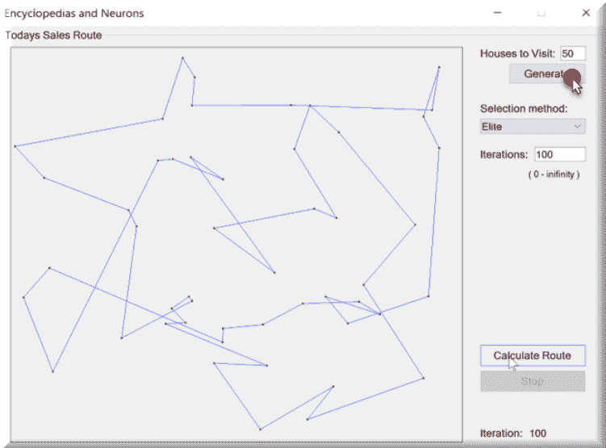

在我们的测试应用中，我们可以非常容易地更改我们想要访问的房屋数量，如高亮区域所示。

我们可能有一个非常简单的问题空间，或者一个更复杂的问题空间。这里是一个非常简单的问题空间的例子：

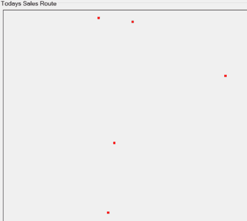

这里是一个更复杂的问题空间的例子：

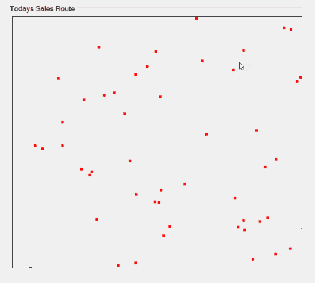

我们还有三种不同的选择方法供我们的算法使用，即精英、排名和轮盘赌：

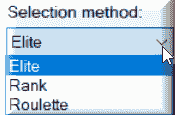

+   精英：指定下一代中要工作的最佳染色体的数量。

+   轮盘赌：根据染色体的排名（适应度值）选择染色体。

+   排名：根据染色体的排名（适应度值）选择染色体。这与轮盘赌选择方法不同，因为在计算中轮盘和扇区的大小不同。

最后，我们选择算法要使用的总迭代次数。我们选择计算路线按钮，如果一切顺利，我们最终会得到一个与这个类似的地图：

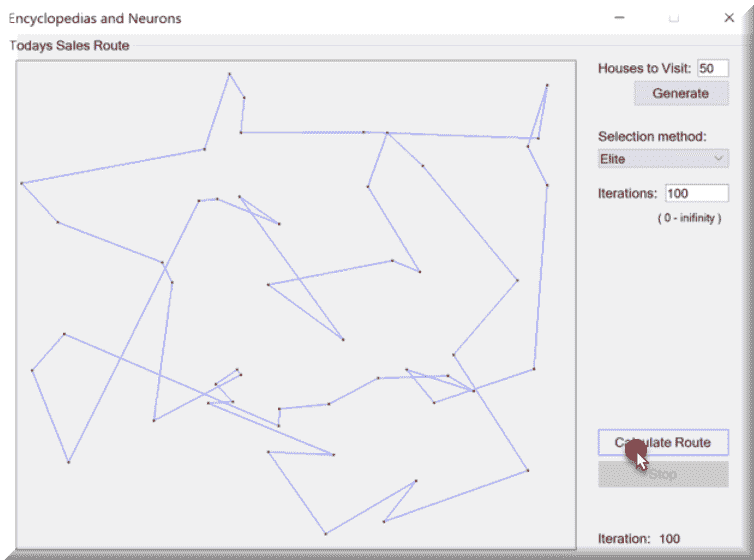

让我们看看当我们选择我们想要的城市的数量然后点击生成按钮时会发生什么：

```py
        private void GenerateMap( )
         {
             Random rand = new Random( (int) DateTime.Now.Ticks );

             // create coordinates array
             map = new double[citiesCount, 2];

             for ( int i = 0; i < citiesCount; i++ )
             {
                 map[i, 0] = rand.Next( 1001 );
                 map[i, 1] = rand.Next( 1001 );
             }

             // set the map
             mapControl.UpdateDataSeries( "map", map );
             // erase path if it is
             mapControl.UpdateDataSeries( "path", null );
         }
```

我们首先做的事情是初始化我们的随机数生成器并对其进行播种。接下来，我们获取用户指定的城市总数，然后根据这个创建一个新的数组。最后，我们绘制每个点并更新我们的地图。这个地图是来自 Accord.NET 的图表控件，将为我们处理大量的视觉绘图。

完成这些后，我们就准备好计算我们的路线，并（希望）解决这个问题。

接下来，让我们看看我们的主要搜索解决方案是什么样子：

```py
            Neuron.RandRange = new Range( 0, 1000 );
             DistanceNetwork network = new DistanceNetwork( 2, neurons );
             ElasticNetworkLearning    trainer = new ElasticNetworkLearning(
 network );
             double    fixedLearningRate = learningRate / 20;
             double    driftingLearningRate = fixedLearningRate * 19;
             double[,] path = new double[neurons + 1, 2];
             double[] input = new double[2];
             int i = 0;

             while ( !needToStop )
             {
                 trainer.LearningRate = driftingLearningRate * ( iterations - i ) / iterations + fixedLearningRate;
                 trainer.LearningRadius = learningRadius * ( iterations - i ) / iterations;

                 int currentCity = rand.Next( citiesCount );
                 input[0] = map[currentCity, 0];
                 input[1] = map[currentCity, 1];

                 trainer.Run( input );

                 for ( int j = 0; j < neurons; j++ )
                 {
                     path[j, 0] = network.Layers[0].Neurons[j].Weights[0];
                     path[j, 1] = network.Layers[0].Neurons[j].Weights[1];
                 }
                 path[neurons, 0] = network.Layers[0].Neurons[0].Weights[0];
                 path[neurons, 1] = network.Layers[0].Neurons[0].Weights[1];

                 chart?.UpdateDataSeries( "path", path );
                 i++;

                 SetText( currentIterationBox, i.ToString( ) );

                 if ( i >= iterations )
                     break;
            }
```

让我们尝试将所有这些分解成更可用的块供你使用。我们首先确定我们将使用什么选择方法来排名我们的染色体：

```py
// create fitness function
 TSPFitnessFunction fitnessFunction = new TSPFitnessFunction( map );
 // create population
 Population population = new Population( populationSize,
     ( greedyCrossover ) ? new TSPChromosome( map ) : new PermutationChromosome( citiesCount ),
     fitnessFunction,
     ( selectionMethod == 0 ) ? (ISelectionMethod) new EliteSelection( ) :
     ( selectionMethod == 1 ) ? (ISelectionMethod) new RankSelection( ) :
     (ISelectionMethod) new RouletteWheelSelection( ));
```

我想借此机会指出你在这里看到的`TSPChromosome`。这个对象基于一个短数组染色体（一个范围从 2 到 65,536 的无符号短整数值的数组）。有两个特定的特性：

+   所有基因在染色体中都是唯一的，这意味着没有两个基因具有相同的值

+   每个基因的最大值等于染色体长度减 1

接下来，我们必须为我们创建一个路径变量来填充我们的数据点：

```py
double[,] path = new double[citiesCount + 1, 2];
```

完成此步骤后，我们可以进入我们的`while`循环并开始处理。为此，我们将通过运行一个 epoch 来处理单个生成。你可以把 epoch 看作是一个迭代：

```py
                // run one epoch of genetic algorithm
                 RILogManager.Default?.SendDebug("Running Epoch " + i);
                 population.RunEpoch( );
```

我们然后从那个努力中获得最佳值：

```py
ushort[] bestValue = ((PermutationChromosome) population.BestChromosome).Value;
```

我们在每座城市之间更新和创建我们的路径：

```py
for ( int j = 0; j < citiesCount; j++ )
                 {
                     path[j, 0] = map[bestValue[j], 0];
                     path[j, 1] = map[bestValue[j], 1];
                 }
                 path[citiesCount, 0] = map[bestValue[0], 0];
                 path[citiesCount, 1] = map[bestValue[0], 1];
```

然后将该值提供给我们的图表控件：

```py
mapControl.UpdateDataSeries( "path", path );
```

让我们看看根据我们选择的排名方法，我们的路线可能是什么样子的一些例子。

精英选择：

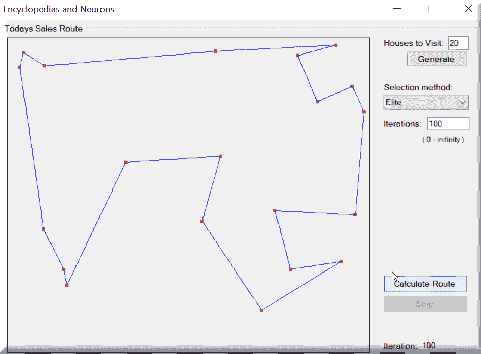

排名选择：

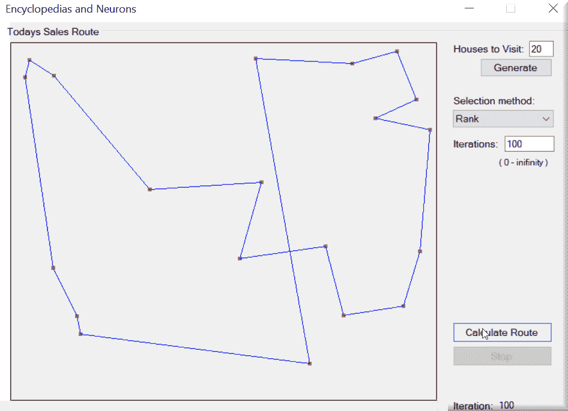

这与轮盘赌选择方法的区别在于轮盘和其扇区大小计算方法。轮盘的大小等于*size * (size +1) / 2*，其中*size*是当前种群的大小。最差的染色体其扇区大小等于 1，下一个大小为 2，以此类推。

轮盘赌选择：

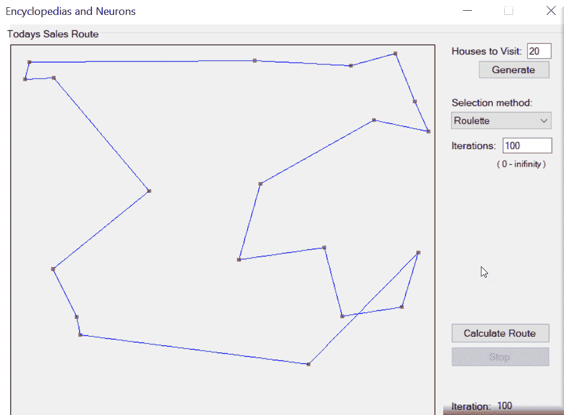

这个算法根据它们的适应度值选择新一代的染色体。值越高，成为新一代成员的机会就越大。

当你生成你的路线时，你会注意到精英方法立即找到了它的解决方案。排名方法在整个迭代过程中持续优化其路线，而轮盘赌方法则进一步优化其路线。

为了说明我的意思，定义一个巨大的销售员今天的负载。比如说他今天要访问 200 座房子，因为我们需要今天卖很多百科全书。这就是我们算法之美的所在。如果我们处理的是五座房子，很容易创建最优的地图和路线。但如果我们处理的是 200 座房子，那就大不相同了！

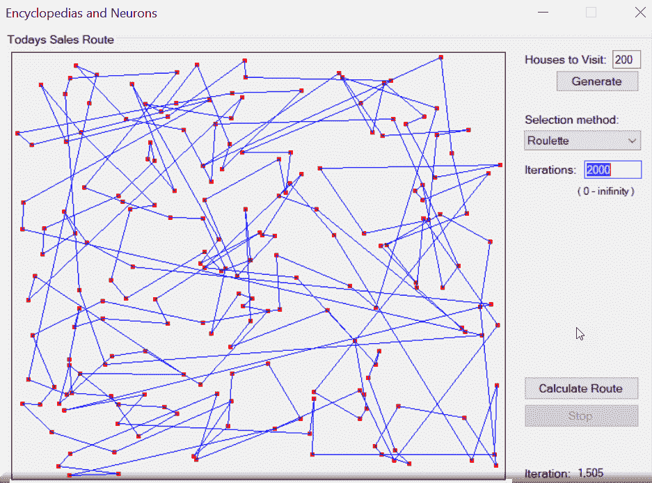

现在我们已经解决了这个问题，让我们看看我们能否将我们从之前章节中学到的关于**自组织映射**（**SOM**）的知识应用到这个问题上，从不同的角度来解决这个问题。如果你还记得，在第六章，“颜色混合 - 自组织映射和弹性神经网络”中，我们讨论了 SOM 的一般情况。所以我们将避免在这里发生学术讨论！我们将使用一种称为弹性网络训练的技术，这是一种针对我们这里的问题的非常好的无监督方法。

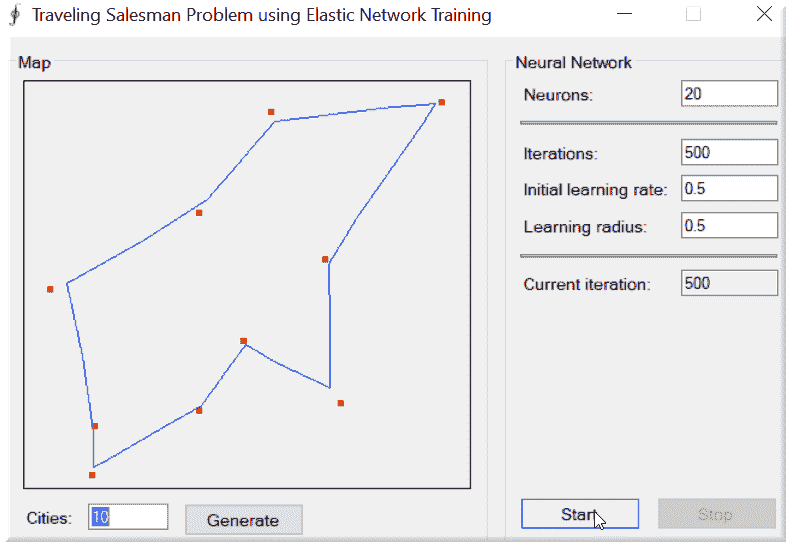

让我们先简要地谈谈什么是**弹性地图**。弹性地图提供了一种创建非线性降维的工具。它们是我们数据空间中弹性弹簧的系统，近似于低维流形。有了这种能力，我们可以从完全无结构的聚类（无弹性）到更接近线性主成分分析流形，弹簧有高弯曲/低拉伸。当你使用我们的示例应用程序时，你会发现线条并不一定像我们之前的解决方案那样僵硬。在许多情况下，它们甚至可能不会进入我们访问的城市中心（线条从中心生成）但仅接近城市边缘，就像前面的例子一样！

再次强调，我们将处理神经元，这是我所有最爱之一。这次我们将有更多的控制权，因为我们能够指定我们的学习率和半径。就像我们之前的例子一样，我们将能够指定我们的旅行商今天必须访问的总城市数。不过这次我们对他宽容一些吧！

首先，我们将访问 50 个城市，并使用学习率`0.3`和半径`0.75`。最后，我们将运行 50,000 次迭代（别担心；这会很快完成）。我们的输出将看起来像这样：

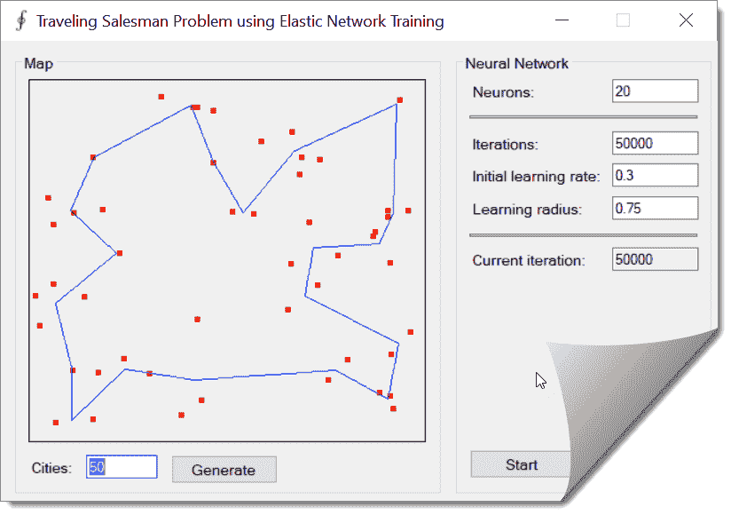

现在，如果我们把半径改为不同的值，比如 0.25，会发生什么呢？注意一些城市之间的角度变得更为明显：

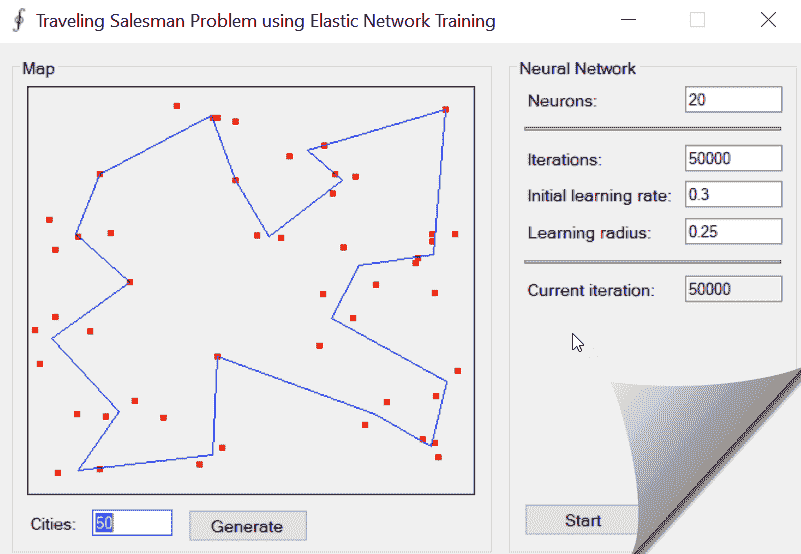

接下来，让我们将学习率从 0.3 改为 0.75：

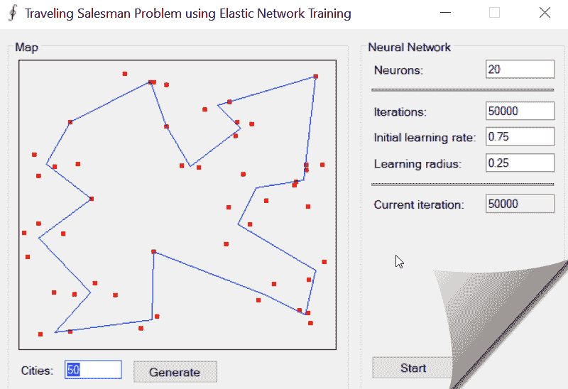

尽管我们的路线最终看起来非常相似，但有一个重要的区别。在上一个例子中，我们的旅行商的路线图是在所有迭代完成后才绘制的。通过提高学习率，路线图会在完美的路线完成之前绘制几次。以下是一些显示进度的图片：

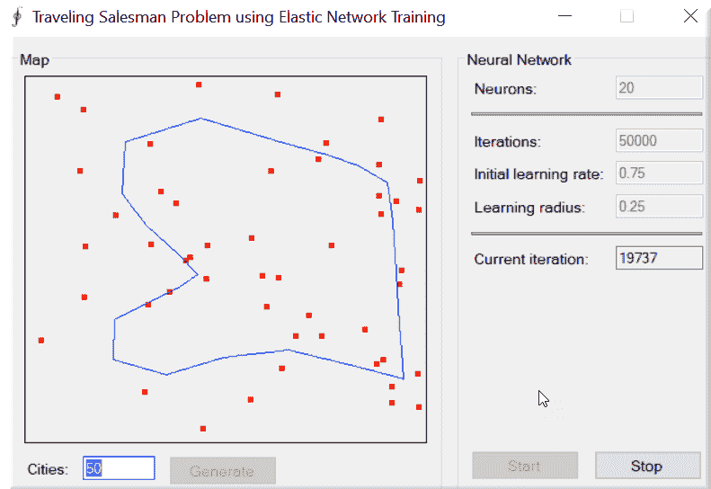

我们现在处于我们的解决方案的第 5777 次迭代：

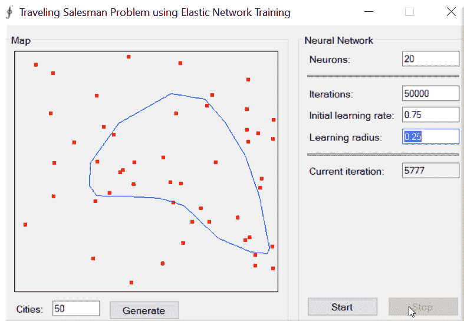

这显示了我们的解决方案在第 44636 次迭代时的样子。

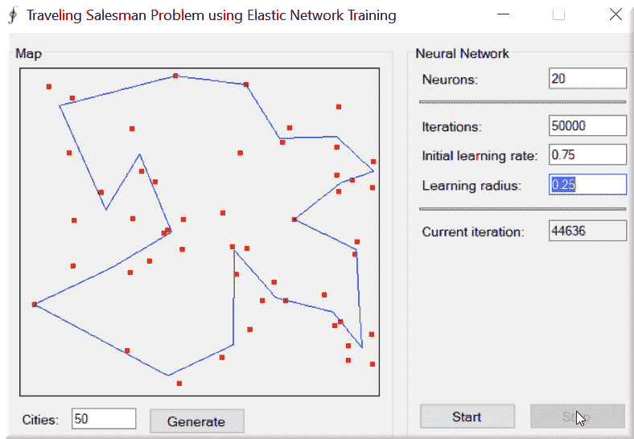

这一张显示了我们的解决方案在第 34299 次迭代时的样子：

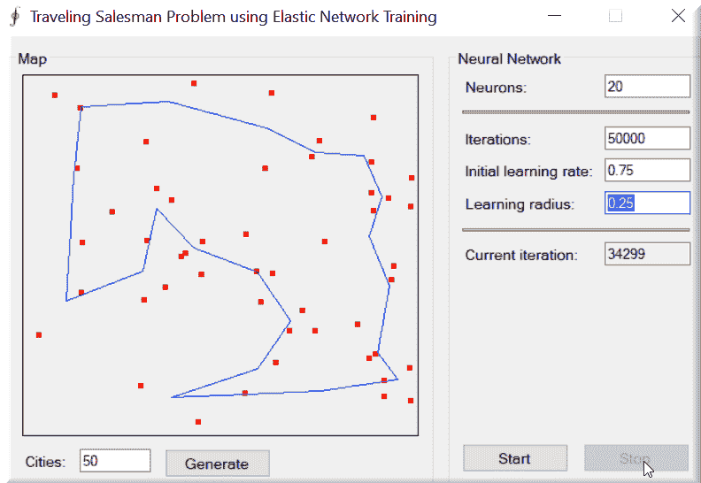

现在，让我们看看一小段代码，看看我们的搜索解决方案这次有何不同：

```py
            // create fitness function
             TSPFitnessFunction fitnessFunction = new TSPFitnessFunction( map );
             // create population
             Population population = new Population( populationSize,
                 ( greedyCrossover ) ? new TSPChromosome( map ) : new PermutationChromosome( citiesCount ),
                 fitnessFunction, ( selectionMethod == 0 ) ? new EliteSelection( )
                 : ( selectionMethod == 1 ) ? new RankSelection( ) :
                 (ISelectionMethod) new RouletteWheelSelection( ));
             // iterations
             int i = 1;

             // path
             double[,] path = new double[citiesCount + 1, 2];

             // loop
             while ( !needToStop )
             {
                 // run one epoch of genetic algorithm
                 RILogManager.Default?.SendDebug("Running Epoch " + i);
                 population.RunEpoch( );

                 // display current path
                 ushort[] bestValue = ((PermutationChromosome) population.BestChromosome).Value;

                 for ( int j = 0; j < citiesCount; j++ )
                 {
                     path[j, 0] = map[bestValue[j], 0];
                     path[j, 1] = map[bestValue[j], 1];
                 }
                 path[citiesCount, 0] = map[bestValue[0], 0];
                 path[citiesCount, 1] = map[bestValue[0], 1];

                 mapControl.UpdateDataSeries( "path", path );

```

```py
                 // set current iteration's info
                 SetText( currentIterationBox, i.ToString( ) );
                 SetText( pathLengthBox, fitnessFunction.PathLength( population.BestChromosome ).ToString( ) );

                 // increase current iteration
                 i++;

                 //
                 if ( ( iterations != 0 ) && ( i > iterations ) )
                     break;
             }
```

您首先看到我们做的事情是创建一个`DistanceNetwork`对象。这个对象只包含一个`DistanceLayer`，即一个距离神经元层。距离神经元通过计算其权重和输入之间的距离来输出其输出——权重值和输入值之间绝对差异的总和。所有这些共同构成了我们的 SOM（自组织映射）和，更重要的是，我们的弹性网络。

接下来，我们必须用一些随机权重初始化我们的网络。我们将通过为每个神经元创建**均匀连续分布**来完成此操作。均匀连续分布，或矩形分布，是一种对称的概率分布，对于该家族的每个成员，分布支持上相同长度的所有区间都有相同的概率。您通常会看到它写成 U(*a*, *b*)，其中参数*a*和*b*分别是最小值和最大值。

```py
foreach (var neuron in network.Layers.SelectMany(layer => layer?.Neurons).Where(neuron => neuron != null))
 {
                 neuron.RandGenerator = new UniformContinuousDistribution(new Range(0, 1000));
 }
```

接下来，我们创建我们的弹性学习器对象，它允许我们训练我们的距离网络：

```py
            ElasticNetworkLearning trainer = new ElasticNetworkLearning(network);
```

这是`ElasticNetworkLearning`构造函数的内部样子：

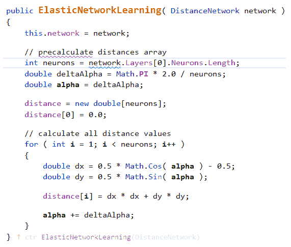

现在我们计算我们的学习率和半径：

```py
            double fixedLearningRate = learningRate / 20;
             double driftingLearningRate = fixedLearningRate * 19;
```

最后，我们进入了我们的中央处理循环，我们将一直保持在这里，直到被告知停止：

```py
while (!needToStop)
             {
                 // update learning speed & radius
                 trainer.LearningRate = driftingLearningRate * (iterations - i) / iterations + fixedLearningRate;
                 trainer.LearningRadius = learningRadius * (iterations - i) / iterations;

                 // set network input
                 int currentCity = rand.Next(citiesCount);
                 input[0] = map[currentCity, 0];
                 input[1] = map[currentCity, 1];

                 // run one training iteration
                 trainer.Run(input);

                 // show current path
                 for (int j = 0; j < neurons; j++)
                 {
                     path[j, 0] = network.Layers[0].Neurons[j].Weights[0];
                     path[j, 1] = network.Layers[0].Neurons[j].Weights[1];
                 }
                 path[neurons, 0] = network.Layers[0].Neurons[0].Weights[0];
                 path[neurons, 1] = network.Layers[0].Neurons[0].Weights[1];

                 chart.UpdateDataSeries("path", path);

                 i++;

                 SetText(currentIterationBox, i.ToString());

                 if (i >= iterations)
                     break;
             }
```

在前面的循环中，训练器在每个循环增量中运行一个 epoch（迭代）。以下是`trainer.Run`函数的样子，这样您可以看到发生了什么。基本上，该方法找到获胜神经元（其权重值最接近指定输入向量的神经元）。然后它更新其权重以及邻近神经元的权重：

```py
public double Run( double[] input )
         {
             double error = 0.0;

             // compute the network
             network.Compute( input );
             int winner = network.GetWinner( );

             // get layer of the network
             Layer layer = network.Layers[0];

             // walk through all neurons of the layer
             for ( int j = 0; j < layer.Neurons.Length; j++ )
             {
                 Neuron neuron = layer.Neurons[j];

                 // update factor
                 double factor = Math.Exp( -distance[Math.Abs( j - winner )] / squaredRadius2 );

                 // update weights of the neuron
                 for ( int i = 0; i < neuron.Weights.Length; i++ )
                 {
                     // calculate the error
                     double e = ( input[i] - neuron.Weights[i] ) * factor;
                     error += Math.Abs( e );
                     // update weight
                     neuron.Weights[i] += e * learningRate;
                 }
             }
             return error;
         }
```

我们将要深入了解的这种方法的主要两个功能是计算网络和获取获胜者（高亮显示的项目）。

我们如何计算网络？基本上，我们通过距离层逐层向下工作，进入每个神经元，以正确更新权重，类似于您在这里看到的情况：

```py
public virtual double[] Compute( double[] input )
         {
             // local variable to avoid mutlithread conflicts
             double[] output = input;

             // compute each layer
             for ( int i = 0; i < layers.Length; i++ )
             {
                 output = layers[i].Compute( output );
             }

             // assign output property as well (works correctly for single threaded usage)
             this.output = output;

             return output;
         }
```

最后，我们需要计算获胜者，即权重最小、距离最小的神经元：

```py
public int GetWinner( )
         {
             // find the MIN value
             double min = output[0];
             int    minIndex = 0;

             for ( int i = 1; i < output.Length; i++ )
             {
                 if ( output[i] < min )
                 {
                     // found new MIN value
                     min = output[i];
                     minIndex = i;
                 }
             }

             return minIndex;
         }
```

让我们简要谈谈您可以在屏幕上输入的参数。

# 学习率参数

学习率是一个决定学习速度的参数。更正式地说，它决定了我们根据损失梯度调整网络权重的程度。如果它太低，我们在斜坡上移动的速度会变慢。尽管我们希望学习率低，但这可能意味着我们将花费很长时间才能达到收敛。学习率还会影响我们的模型多快能收敛到局部最小值（最佳精度）。

当处理神经元时，它决定了用于训练的权重神经元的获取时间（学习新经验所需的时间）。

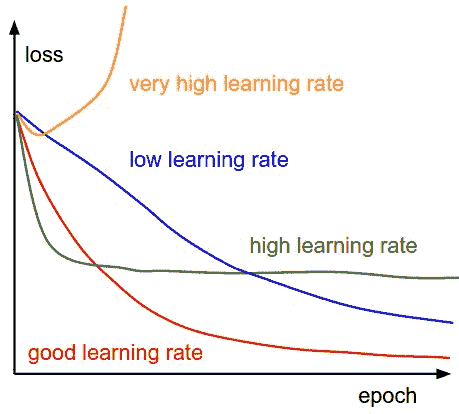

各种学习率对收敛的影响（图片来源：[cs231n](http://cs231n.github.io/neural-networks-3/))

# 学习半径

学习半径决定了围绕获胜神经元需要更新的神经元数量。在学习过程中，任何位于半径圆内的神经元都将被更新。神经元越靠近，更新的次数越多；距离越远，更新的次数越少。

# 摘要

在本章中，我们学习了神经元，这是一个非常迷人的研究领域，多年来一直备受关注。我们还学习了著名的旅行商问题，它是什么，以及我们如何用计算机来解决它。这个小小的例子在现实世界中有着广泛的应用。在我们下一章中，我们将把我们所获得的所有神经知识应用到**受限玻尔兹曼机**（**RBM**）和**深度信念网络**（**DBN**）上。这一章肯定会为你的术语清单增添许多术语！在下一章中，我们将回答我们作为开发者都面临的问题：*我应该接受这份工作吗？*
