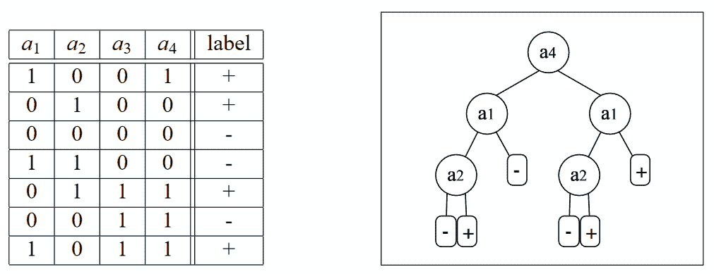
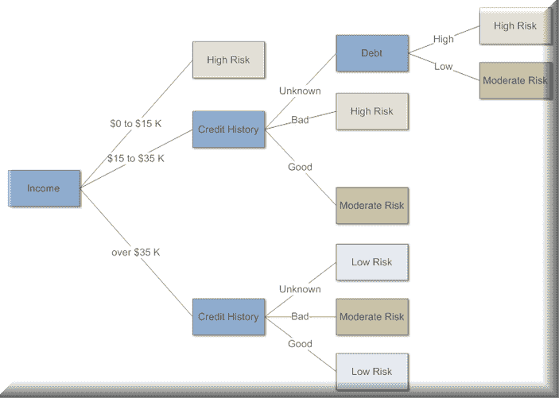
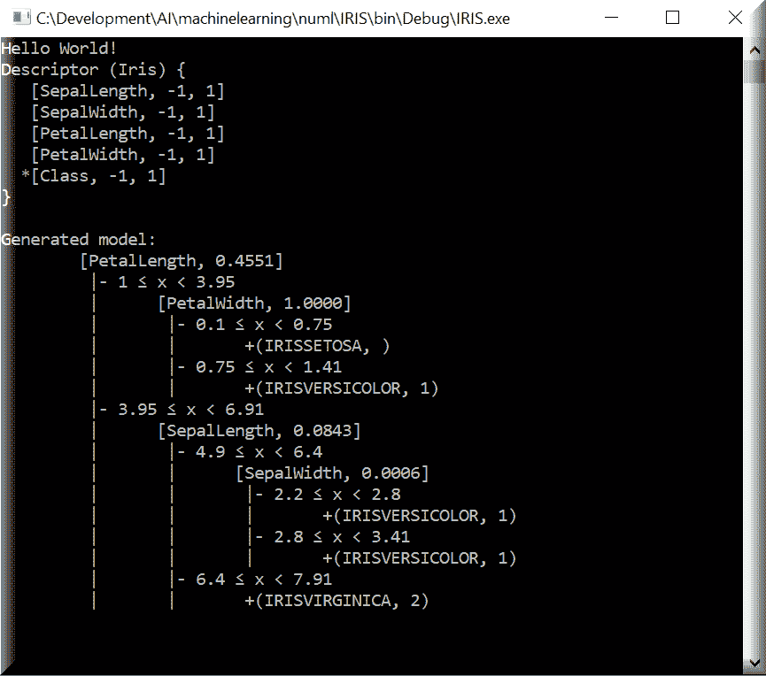
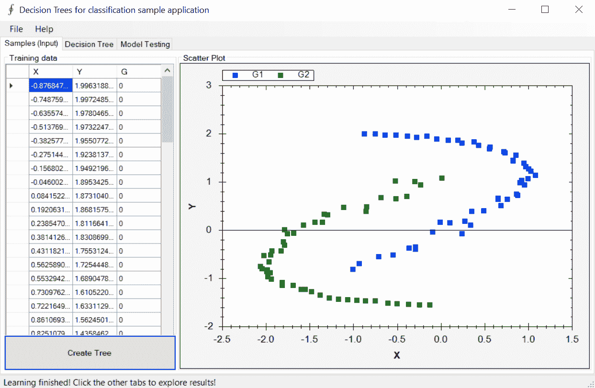
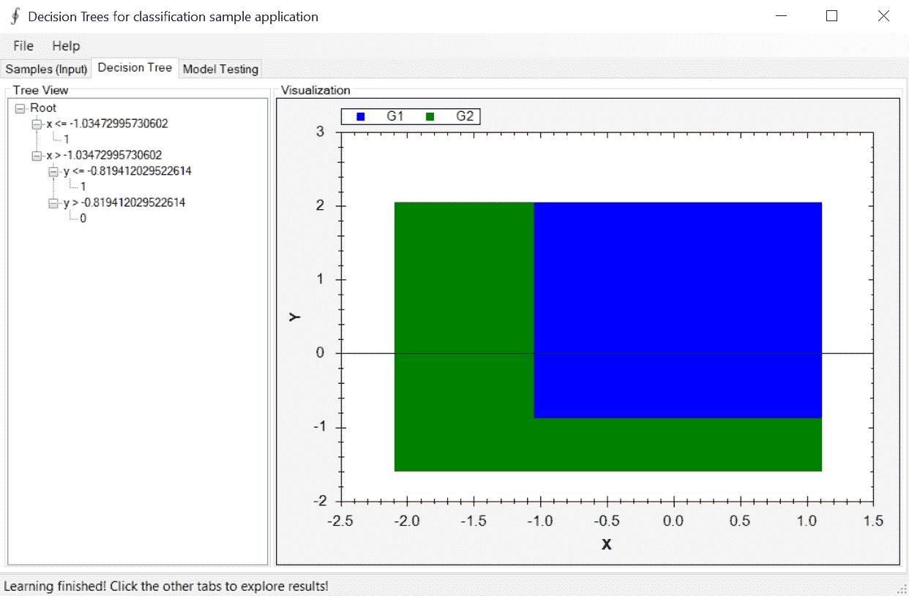
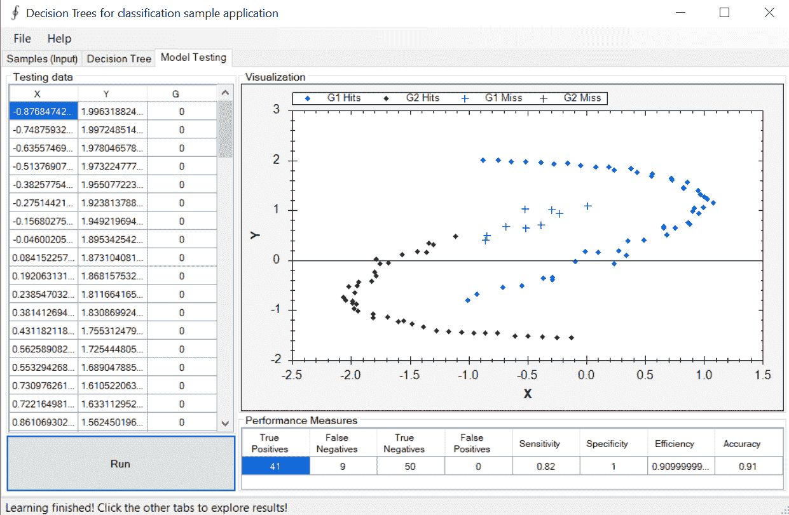
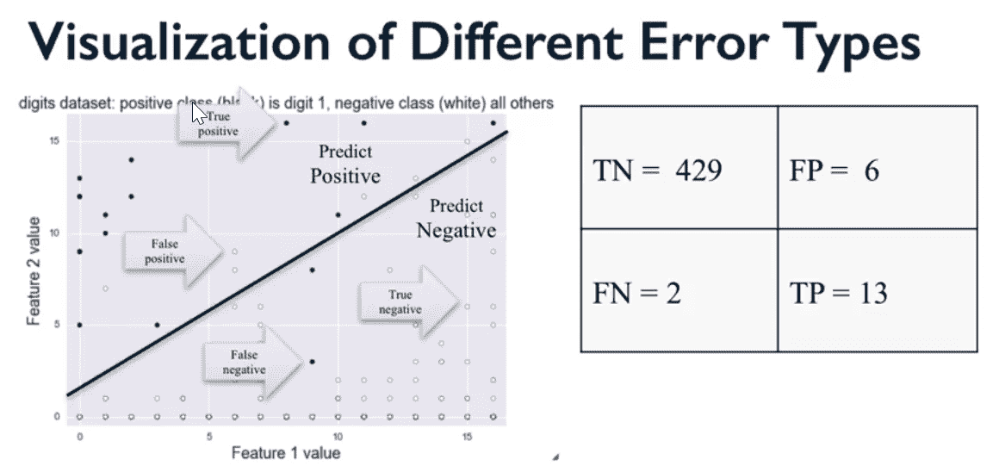
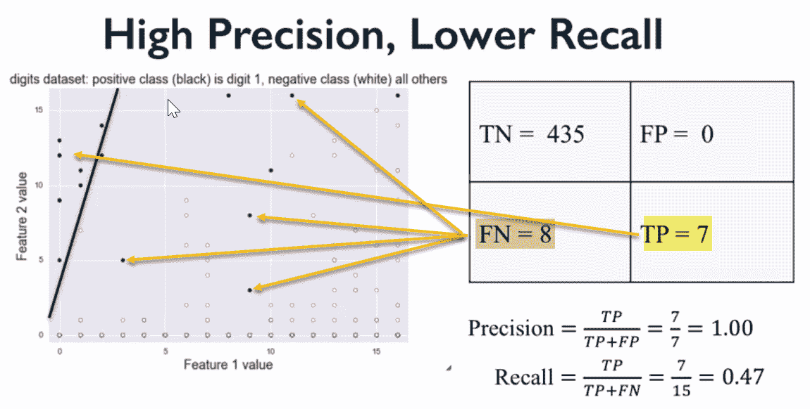
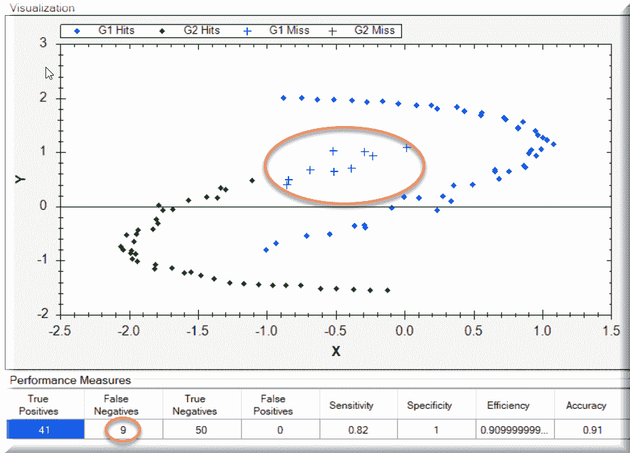

# 我应该接受这份工作吗——决策树的实际应用

本章将重点关注：

+   决策树

+   如何为您的应用程序创建决策树

+   理解真值表

+   关于假阴性和假阳性的视觉直觉

在我们深入探讨之前，让我们获取一些对我们有帮助的背景信息。

为了使决策树完整且有效，它必须包含所有可能性，这意味着每个进入和离开的路径。事件序列也必须提供，并且是互斥的，这意味着如果一个事件发生，另一个事件就不能发生。

决策树是一种**监督式机器学习**的形式，这意味着我们必须解释输入和输出应该是什么。决策树中有决策节点和叶子节点。叶子节点是决策点，无论是最终决策还是非最终决策，而节点是决策分支发生的地方。

虽然有许多算法可供我们使用，但我们将使用**迭代二分器 3**（**ID3**）算法。在每次递归步骤中，根据一个标准（信息增益、增益率等）选择最佳分类我们正在处理的输入集的属性。必须指出的是，无论我们使用哪种算法，都没有保证能够产生可能的最小树。这直接影响了我们算法的性能。记住，在决策树中，学习仅基于启发式，而不是真正的优化标准。让我们用一个例子来进一步解释这一点。

以下例子来自[`jmlr.csail.mit.edu/papers/volume8/esmeir07a/esmeir07a.pdf`](http://jmlr.csail.mit.edu/papers/volume8/esmeir07a/esmeir07a.pdf)，它说明了 XOR 学习概念，这是我们所有开发者（或应该熟悉）的。你将在后面的例子中看到这一点，但现在，**a[3]**和**a[4]**对我们试图解决的问题完全无关。它们对我们的答案没有影响。话虽如此，ID3 算法将选择其中之一属于树，实际上，它将使用**a[4]**作为根！记住，这是算法的启发式学习，而不是优化发现：



希望这个视觉图能更容易地理解我们的意思。这里的目的是不要深入决策树的机械和理论。在所有这些之后，你可能会问为什么我们还在谈论决策树。尽管它们可能存在任何问题，决策树仍然是许多算法的基础，特别是那些需要人类描述结果的算法。它们也是我们在前一章中使用过的 Viola & Jones（2001）实时面部检测算法的基础。作为一个更好的例子，微软 Xbox 360 的**Kinect**也使用了决策树。

我们将再次转向 Accord.NET 开源框架来阐述我们的概念。在我们的示例中，我们将处理以下决策树对象，因此最好提前讨论它们。

# 决策树

这是我们的主要类。

# 决策节点

这是我们的决策树中的一个节点。每个节点可能或可能没有与之关联的子节点。

# 决策变量

这个对象定义了树和节点可以处理的每个决策变量的性质。这些值可以是范围、连续或离散的。

# 决策分支节点集合

这个集合包含了一组决策节点，以及关于它们决策变量的额外信息，以便进行比较。

这里是一个用于确定财务风险的决策树的示例。通过简单地导航节点，决定走哪条路，直到得到最终答案，它非常容易跟随。在这种情况下，有人正在申请信贷，我们需要对其信用度做出决定。决策树是解决这个问题的绝佳方法：



在我们有了这个简单的视觉图之后，让我们来看看我们试图解决的问题。这是我们所有开发者（希望如此）时不时都会遇到的问题。

# 我是否应该接受这份工作？

你刚刚得到了一份新的工作，你需要决定是否接受这份工作。有一些事情对你来说很重要，所以我们将使用这些作为决策树的输入变量或特征。以下是你认为重要的因素：薪酬、福利、公司文化和当然，*我能否在家工作？*

我们将不会从磁盘存储加载数据，而是将创建一个内存数据库，并通过这种方式添加我们的特征。我们将创建`DataTable`并创建`Columns`作为特征，如下所示：

```py
DataTable data = new DataTable("Should I Go To Work For Company
  X");
data.Columns.Add("Scenario");
data.Columns.Add("Pay");
data.Columns.Add("Benefits");
data.Columns.Add("Culture");
data.Columns.Add("WorkFromHome");
data.Columns.Add("ShouldITakeJob");
```

在此之后，我们将加载几行数据，每行都有不同的特征集，以及我们的最后一列`ShouldITakeJob`，它可以是`是`或`否`，作为我们的最终决定：

```py
data.Rows.Add("D1", "Good", "Good", "Mean", "Yes", "Yes");
data.Rows.Add("D2", "Good", "Good", "Mean", "No", "Yes");
data.Rows.Add("D3", "Average", "Good", "Good", "Yes", "Yes");
data.Rows.Add("D4", "Average", "Good", "Good", "No", "Yes");
data.Rows.Add("D5", "Bad", "Good", "Good", "Yes", "No");
data.Rows.Add("D6", "Bad", "Good", "Good", "No", "No");
data.Rows.Add("D7", "Good", "Average", "Mean", "Yes", "Yes");
data.Rows.Add("D8", "Good", "Average", "Mean", "No", "Yes");
data.Rows.Add("D9", "Average", "Average", "Good", "Yes", "No");
data.Rows.Add("D10", "Average", "Average", "Good", "No", "No");
data.Rows.Add("D11", "Bad", "Average", "Good", "Yes", "No");
data.Rows.Add("D12", "Bad", "Average", "Good", "No", "No");
data.Rows.Add("D13", "Good", "Bad", "Mean", "Yes", "Yes");
data.Rows.Add("D14", "Good", "Bad", "Mean", "No", "Yes");
data.Rows.Add("D15", "Average", "Bad", "Good", "Yes", "No");
data.Rows.Add("D16", "Average", "Bad", "Good", "No", "No");
data.Rows.Add("D17", "Bad", "Bad", "Good", "Yes", "No");
data.Rows.Add("D18", "Bad", "Bad", "Good", "No", "No");
data.Rows.Add("D19", "Good", "Good", "Good", "Yes", "Yes"); data.Rows.Add("D20", "Good", "Good", "Good", "No", "Yes");
```

一旦所有数据都创建并放入我们的表中，我们需要将我们之前的功能以计算机可以理解的形式表示出来。由于所有我们的特征都是类别，如果我们保持一致，那么我们如何表示它们并不重要。由于数字更容易处理，我们将通过称为`编码`的过程将我们的特征（类别）转换为代码簿。这个`代码簿`有效地将每个值转换为一个整数。请注意，我们将我们的`data`类别作为输入传递：

```py
Codification codebook = new Codification(data);
```

接下来，我们需要为我们的决策树创建决策变量。树将试图帮助我们确定是否应该接受我们的新工作邀请。对于这个决定，将有几个输入类别，我们将它们指定在我们的决策变量数组中，以及两个可能的决策，`是`或`否`。

`DecisionVariable`数组将保存每个类别的名称以及该类别可能属性的总量。例如，`Pay`类别有三个可能的值，`Good`、`Average`或`Poor`。因此，我们指定类别名称和数字`3`。然后我们对所有其他类别重复此操作，除了最后一个，即我们的决策：

```py
DecisionVariable[] attributes =
{
  new DecisionVariable("Pay", 3),
  new DecisionVariable("Benefits", 3),
  new DecisionVariable("Culture", 3),
  new DecisionVariable("WorkFromHome", 2)
};
int outputValues = 2; // 2 possible output values: yes or no
DecisionTree tree = new DecisionTree(attributes, outputValues);
```

现在我们已经创建了决策树，我们必须教会它我们要解决的问题。在这个阶段，它实际上什么也不知道。为了做到这一点，我们必须为树创建一个学习算法。在我们的例子中，那将是之前讨论过的 ID3 算法。由于这个样本只有分类值，ID3 算法是最简单的选择。请随意将其替换为 C4.5、C5.0 或您想尝试的任何其他算法：

```py
ID3Learning id3 = new ID3Learning(tree);
Now, with our tree fully created and ready to go, we 
  are ready to classify new samples.
// Translate our training data into integer symbols using our codebook:
DataTable symbols = codebook.Apply(data);
int[][] inputs = symbols.ToArray<int>("Pay", "Benefits", "Culture",
  "WorkFromHome");
int[] outputs = symbols.ToIntArray("ShouldITakeJob").GetColumn(0);
// Learn the training instances!
id3.Run(inputs, outputs);
```

一旦运行了学习算法，它就被训练好并准备好使用。我们只需向算法提供一个样本数据集，它就能给我们一个答案。在这种情况下，工资好，公司文化好，福利好，我可以在家工作。如果决策树训练得当，答案将是响亮的`Yes`：

```py
int[] query = codebook.Translate("Good", "Good", "Good", "Yes");
int output = tree.Compute(query);
string answer = codebook.Translate("ShouldITakeJob", output); 
// answer   will be "Yes".
```

接下来，我们将关注使用`numl`开源机器学习包来向您展示另一个训练和使用决策树的示例。

# numl

`numl`是一个非常著名的开源机器学习工具包。与大多数机器学习框架一样，它也使用`Iris`数据集的许多示例，包括我们将用于决策树的示例。

这里是`numl`输出的一个示例：



让我们看看那个示例背后的代码：

```py
static void Main(string[] args)
{
Console.WriteLine("Hello World!");
var description = Descriptor.Create<Iris>();
Console.WriteLine(description);
var generator = new DecisionTreeGenerator();
var data = Iris.Load();
var model = generator.Generate(description, data);
Console.WriteLine("Generated model:");
Console.WriteLine(model);
Console.ReadKey();
}
```

这绝对不是最复杂的函数，对吧？这就是在您的应用程序中使用`numl`的美丽之处；它极其容易使用和集成。

上述代码创建了一个描述符和`DecisionTreeGenerator`，加载了`Iris`数据集，然后生成了一个模型。这里只是加载的数据的一个样本：

```py
public static Iris[] Load()
{
return new Iris[]
{
new Iris { SepalLength = 5.1m, SepalWidth = 3.5m, PetalLength =
  1.4m, PetalWidth = 0.2m, Class = "Iris-setosa" },
new Iris { SepalLength = 4.9m, SepalWidth = 3m, PetalLength = 
  1.4m, PetalWidth = 0.2m, Class = "Iris-setosa" },
new Iris { SepalLength = 4.7m, SepalWidth = 3.2m, PetalLength =
  1.3m, PetalWidth = 0.2m, Class = "Iris-setosa" },
new Iris { SepalLength = 4.6m, SepalWidth = 3.1m, PetalLength = 
  1.5m, PetalWidth = 0.2m, Class = "Iris-setosa" },
new Iris { SepalLength = 5m, SepalWidth = 3.6m, PetalLength = 
  1.4m, PetalWidth = 0.2m, Class = "Iris-setosa" },
new Iris { SepalLength = 5.4m, SepalWidth = 3.9m, PetalLength = 
  1.7m, PetalWidth = 0.4m, Class = "Iris-setosa" },
```

等等...

# Accord.NET 决策树

Accord.NET 框架也有自己的决策树示例，我们应该指出这一点。它采用不同的、更图形化的方法来处理决策树，但选择权在您手中，您可以选择您喜欢和感觉最舒适的方法。

一旦数据加载完毕，您就可以创建决策树并为其学习做好准备。您将看到类似于这里的数据图，使用两个类别 X 和 Y：



下一个标签页将让您查看树节点、叶子和决策。在右侧还有一个树的从上到下的图形视图。最有用的信息位于左侧的树视图中，您可以在这里看到节点、它们的值和所做的决策：



最后，最后一个标签页将允许您执行模型测试：



# 学习代码

以下是一些学习代码：

```py
// Specify the input variables
DecisionVariable[] variables =
{
new DecisionVariable("x", DecisionVariableKind.Continuous),
new DecisionVariable("y", DecisionVariableKind.Continuous),
};
// Create the C4.5 learning algorithm
var c45 = new C45Learning(variables);
// Learn the decision tree using C4.5
tree = c45.Learn(inputs, outputs);
// Show the learned tree in the view
decisionTreeView1.TreeSource = tree;
// Get the ranges for each variable (X and Y)
DoubleRange[] ranges = table.GetRange(0);
// Generate a Cartesian coordinate system
double[][] map = Matrix.Mesh(ranges[0], 
  200, ranges[1], 200);
// Classify each point in the Cartesian coordinate system
double[,] surface = map.ToMatrix().
  InsertColumn(tree.Decide(map));
CreateScatterplot(zedGraphControl2, surface);
//Testing
// Creates a matrix from the entire source data table
double[][] table = (dgvLearningSource.DataSource as
  DataTable).ToJagged(out columnNames);
// Get only the input vector values (first two columns)
double[][] inputs = table.GetColumns(0, 1);
// Get the expected output labels (last column)
int[] expected = table.GetColumn(2).ToInt32();
// Compute the actual tree outputs and turn 
  a Boolean into a 0 or 1
int[] actual = tree.Decide(inputs);
// Use confusion matrix to compute some statistics.
ConfusionMatrix confusionMatrix = 
  new ConfusionMatrix(actual, expected, 1, 0);
dgvPerformance.DataSource = new [] { confusionMatrix };
// Create performance scatter plot
CreateResultScatterplot(zedGraphControl1,
  inputs, expected.ToDouble(), actual.ToDouble());
// As you can see above, the tree is making 
  the decision via the code line
int[] actual = tree.Decide(inputs);
```

这个值随后被输入到`ConfusionMatrix`中。对于那些不熟悉这个的人来说，让我简要解释一下。

# 混淆矩阵

**混淆矩阵**是一个用于描述分类模型性能的表格。它在一个已知真实值的测试数据集上运行。这就是我们得到如下内容的方式。

# 真阳性

这是一个我们预测会发生，而且事实确实发生了的情况。

# 真阴性

这是一个我们预测不会发生，而且事实确实发生了的情况。

# 假阳性

这是一个我们预测会发生的但事实并非如此的情况。你有时可能会看到这种情况被称为**I 型**错误。

# 假阴性

这是一个我们预测不会发生但事实确实发生了的情况。你有时可能会看到这种情况被称为**II 型**错误。

现在，说到这里，我们需要讨论另外两个重要的术语，**精确度**和**召回率**。

让我们这样描述它们。在过去的一周里，每天都下雨。那就是 7 天中的 7 天。很简单。一周后，你被问及*上周下雨的频率是多少？*

# 召回率

这是你在那一周内正确回忆起下雨的天数与总正确事件的数量的比率。如果你说下了 7 天雨，那就是 100%。如果你说下了 4 天雨，那么那就是 57%的召回率。在这种情况下，这意味着你的回忆并不那么精确，所以我们有精确度来识别。

# 精确度

这是你在那一周内正确回忆起将要下雨的次数与那一周总天数的比率。

对于我们来说，如果我们的机器学习算法在召回率方面做得好，这并不意味着它在精确度方面也做得好。这说得通吗？这让我们进入了其他事物，比如 F1 分数，我们将在另一天讨论。

# 错误类型可视化

这里有一些可能有助于理解的可视化：



真阳性与假阴性的识别：



在使用混淆矩阵计算统计数据后，会创建散点图，并识别所有内容：



# 摘要

在本章中，我们投入了大量时间来介绍决策树；它们是什么，我们如何使用它们，以及它们如何在我们应用中带来好处。在下一章中，我们将进入**深度信念网络**（**DBNs**）的世界，了解它们是什么，以及我们如何使用它们。我们甚至还会谈谈计算机做梦时的情况！

# 参考文献

+   Bishop, C. M., 2007\. *模式识别与机器学习（信息科学和统计学).* 第 1 版，2006 年校对第 2 次印刷版。s.l.: Springer.

+   Fayyad, U. M. & Irani, K. B., 1992\. [`deepblue.lib.umich.edu/bitstream/2027.42/46964/1/10994_2004_Article_422458.pdf`](http://deepblue.lib.umich.edu/bitstream/2027.42/46964/1/10994_2004_Article_422458.pdf). *机器学习，* 1 月，8(1)，第 87-102 页。

+   Quinlan, J. R., 1986\. [`www.dmi.unict.it/~apulvirenti/agd/Qui86.pdf`](http://www.dmi.unict.it/~apulvirenti/agd/Qui86.pdf). *Machine Learning,* 第 1 卷, 第 1 期, 第 81-106 页.

+   Quinlan, J. R., 1993\. *C4.5: 机器学习程序 (Morgan Kaufmann 机器学习系列).* 第 1 版. s.l.: Morgan Kaufmann.

+   Shotton, J. 等人, 2011\. [`research.microsoft.com/apps/pubs/default.aspx?id=145347`](http://research.microsoft.com/apps/pubs/default.aspx?id=145347)*.* s.l., s.n.

+   Viola, P. & Jones, M., 2001\. *鲁棒实时目标检测.* s.l., s.n.

+   Mitchell, T. M., 1997\. 决策树学习. In:: *机器学习 (McGraw-Hill 计算机科学系列).* s.l.: McGraw Hill.

+   Mitchell, T. M., 1997\. *机器学习 (McGraw-Hill 计算机科学系列).* 波士顿 (MA): WCB/McGraw-Hill.

+   Esmeir, S. & Markovitch, S., 2007\. [`jmlr.csail.mit.edu/papers/volume8/esmeir07a/esmeir07a.pdf`](http://jmlr.csail.mit.edu/papers/volume8/esmeir07a/esmeir07a.pdf). *J. Mach. Learn. Res.,* 五月, 第 8 卷, 第 891-933 页.

+   Hyafil, L. & Rivest, R. L., 1976\. 构建最优二叉决策树是 NP 完全的. *信息处理快报,* 第 5 卷, 第 1 期, 第 15-17 页.

+   [`en.wikipedia.org/wiki/Ross_Quinlan`](https://en.wikipedia.org/wiki/Ross_Quinlan).
