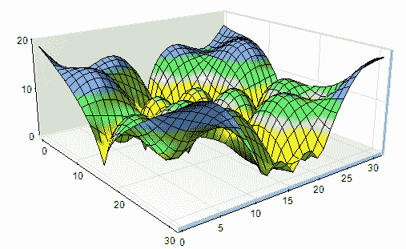
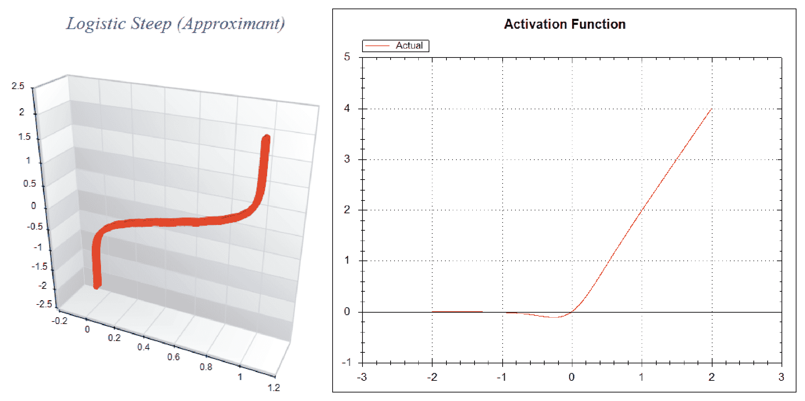
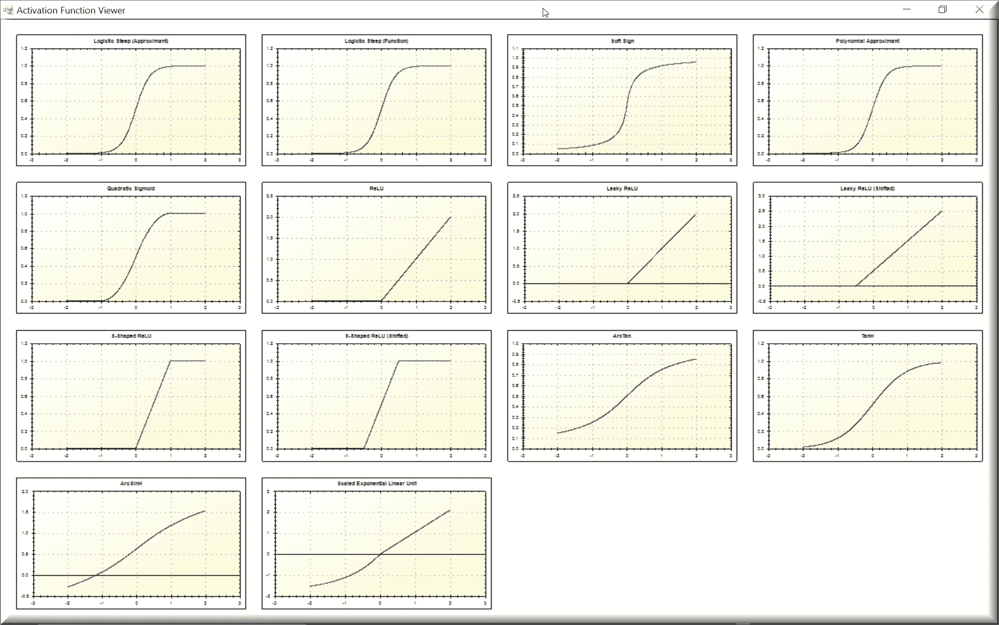
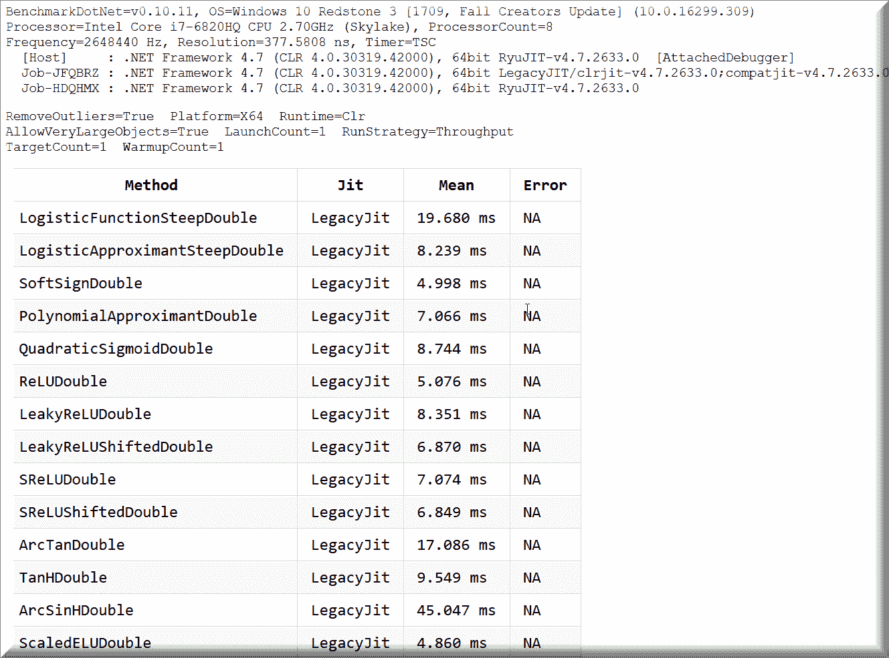
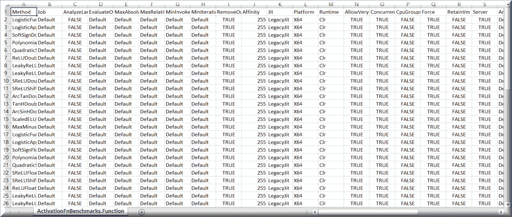
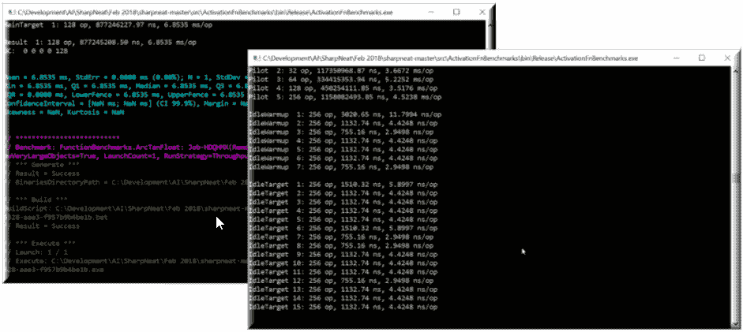
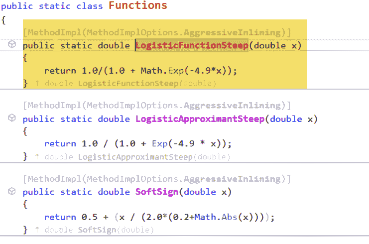
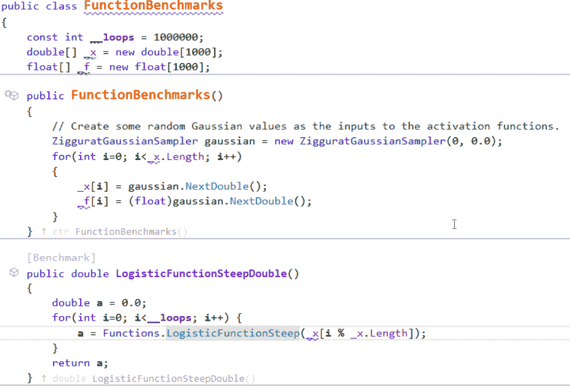

# 微基准测试和激活函数

在本章中，我们将学习以下内容：

+   什么是微基准测试

+   如何将其应用到您的代码中

+   激活函数是什么

+   如何绘制和基准测试激活函数

每个开发者都需要一个良好的基准测试工具在手。定性基准测试无处不在；你每天都会听到，“我们减少了 10%，增加了 25%”。记住那句古老的谚语，“当你听到一个数字被抛出来时，98.4%的情况下那个数字是假的”？顺便说一句，那个数字也是我随便编的。当你听到这样的引用时，要求那个人证明它，你得到的是什么？任务管理器吗？作为数据科学家，我们不需要定性结果；我们需要可以证明并一致复制的定量结果。可复现的结果非常重要，不仅因为一致性，还因为可信度和准确性。这正是微基准测试发挥作用的地方。

我们将使用无可替代的`BenchmarkDotNet`库，您可以在以下链接找到它：[`github.com/dotnet/BenchmarkDotNet`](https://github.com/dotnet/BenchmarkDotNet).

如果您还没有使用这个库，您需要立即放下手头的工作并安装它。我认为这是您可以使用的最无可替代的框架之一，并且我认为它在重要性上与单元测试和集成测试并列。

为了展示这个工具的价值，我们将绘制几个激活函数并比较它们的运行时间。作为其中的一部分，我们将考虑**预热**、**遗留**和**RyuJIT**、**冷启动**以及程序执行的更多方面。最后，我们将得到一组定量结果，证明我们函数的确切测量值。如果，比如说在 2.0 版本中，我们发现某些东西运行得更慢，我们可以重新运行基准测试并比较。

我强烈建议将此集成到您的持续集成/持续构建过程中，以便在每次发布时，您都有基准数字进行比较。这不仅仅是我们自己的代码。我创建了一个庞大的 CI/CD 系统，涵盖了大量的程序、微服务、环境和构建及部署步骤。我们还会定期基准测试我们经常使用的某些.NET 库函数，以验证；在.NET 框架版本之间，没有任何变化。

在本章中，我们将展示两个示例。第一个是一个激活函数查看器；它将绘制每个激活函数，以便您可以查看其外观。您可以在我认为最有价值的开源程序之一，由科林·格林先生开发的**SharpNEAT**中找到它。这个包绝对令人难以置信，我几乎每天都在使用它。我还在此基础上创建了新的用户界面以及满足我需求的先进版本，这是一个非常灵活的工具。我每天都在研究将镜像神经元和规范神经元集成到可扩展基板中的工作，像 SharpNEAT 这样的工具是不可思议的。未来的高级书籍将更多地突出 SharpNEAT，所以现在就熟悉它吧！这个第一个示例应用程序包含在最新的 SharpNEAT 包中，您可以在[`github.com/colgreen/sharpneat`](https://github.com/colgreen/sharpneat)找到它。

# 可视化激活函数绘制

这是 SharpNEAT 自定义版本绘制的局部和全局最小值的图。在这个领域，您可以用这个产品做很多事情，真是太令人惊叹了！



正如我提到的，我们将绘制并基准测试几个激活函数。我们到处都在听到这个术语“激活函数”，但我们真的知道它是什么意思吗？让我们先快速解释一下，以防您不熟悉。

激活函数用于决定神经元是否被激活。有些人喜欢用“**激活**”这个词来替换“**触发**”。无论哪种方式，它最终决定了某物是开启还是关闭，是否触发，是否激活。

让我们从向您展示单个激活函数的图开始：



当单独绘制时，这是**Logistic Steep**近似和**Swish 激活**函数的外观，因为存在许多类型的激活函数，所以当它们一起绘制时，这就是我们所有的激活函数将看起来像什么：



在这一点上，您可能想知道，“我们为什么甚至关心这些图看起来像什么？”这是一个很好的问题。我们关心，因为一旦您进入神经网络等领域，您将大量使用这些函数。知道您的激活函数是否会将神经元的值置于开启或关闭状态，以及它将保持或需要的值范围是非常有用的。毫无疑问，您作为机器学习开发者将在职业生涯中遇到并/或使用激活函数，了解`TanH`和`LeakyReLU`激活函数之间的区别非常重要。

# 绘制所有函数

所有激活函数的绘制都是在单个函数中完成的，这个函数令人惊讶地被命名为`PlotAllFunctions`：

```py
private void PlotAllFunctions()
{
// First, clear out any old GraphPane's from the MasterPane
collection MasterPane master = zed.MasterPane;
master.PaneList.Clear();
// Display the MasterPane Title, and set the 
  outer margin to 10 points
master.Title.IsVisible = true;
master.Margin.All = 10;
// Plot multiple functions arranged on a master pane.
PlotOnMasterPane(Functions.LogisticApproximantSteep,
  "Logistic Steep (Approximant)");
PlotOnMasterPane(Functions.LogisticFunctionSteep,
  "Logistic Steep (Function)");
PlotOnMasterPane(Functions.SoftSign, "Soft Sign");
PlotOnMasterPane(Functions.PolynomialApproximant,
  "Polynomial Approximant");
PlotOnMasterPane(Functions.QuadraticSigmoid,
  "Quadratic Sigmoid");
PlotOnMasterPane(Functions.ReLU, "ReLU");
PlotOnMasterPane(Functions.LeakyReLU, "Leaky ReLU");
PlotOnMasterPane(Functions.LeakyReLUShifted,
  "Leaky ReLU (Shifted)");
PlotOnMasterPane(Functions.SReLU, "S-Shaped ReLU");
PlotOnMasterPane(Functions.SReLUShifted,
  "S-Shaped ReLU (Shifted)");
PlotOnMasterPane(Functions.ArcTan, "ArcTan");
PlotOnMasterPane(Functions.TanH, "TanH");
PlotOnMasterPane(Functions.ArcSinH, "ArcSinH");
PlotOnMasterPane(Functions.ScaledELU, 
  "Scaled Exponential Linear Unit");
// Refigure the axis ranges for the GraphPanes.
  zed.AxisChange();
// Layout the GraphPanes using a default Pane Layout.
using (Graphics g = this.CreateGraphics()) {
  master.SetLayout(g, PaneLayout.SquareColPreferred);
}
```

# 主要的绘图函数

在幕后，`Plot`函数负责执行和绘制每个函数：

```py
private void Plot(Func<double, double> fn, string fnName, 
  Color graphColor, GraphPane gpane = null)
{
  const double xmin = -2.0;
  const double xmax = 2.0;
  const int resolution = 2000;
  zed.IsShowPointValues = true;
  zed.PointValueFormat = "e";
  var pane = gpane ?? zed.GraphPane;
  pane.XAxis.MajorGrid.IsVisible = true;
  pane.YAxis.MajorGrid.IsVisible = true;
  pane.Title.Text = fnName;
  pane.YAxis.Title.Text = string.Empty;
  pane.XAxis.Title.Text = string.Empty;
  double[] xarr = new double[resolution];
  double[] yarr = new double[resolution];
  double incr = (xmax - xmin) / resolution;
  double x = xmin;
for(int i=0; i < resolution; i++, x+=incr)
{
  xarr[i] = x;
  yarr[i] = fn(x);
}
PointPairList list1 = new PointPairList(xarr, yarr);
LineItem li = pane.AddCurve(string.Empty, list1, graphColor,
  SymbolType.None);
li.Symbol.Fill = new Fill(Color.White);
pane.Chart.Fill = new Fill(Color.White, 
  Color.LightGoldenrodYellow, 45.0F);
}
```

在此代码中，值得关注的主要部分用黄色突出显示。这是执行我们传递的激活函数并使用其值作为*Y*轴绘图值的地方。著名的**ZedGraph**开源绘图包用于所有图形绘制。每个函数执行后，相应的绘图将被制作。

# 基准测试

`BenchmarkDotNet`生成多个报告，其中之一是类似于您在这里看到的 HTML 报告：



Excel 报告提供了运行程序所使用的每个参数的详细信息，这是您最全面的信息来源。在许多情况下，这些参数的大部分将使用默认值，并且可能比您需要的更多，但至少您将有机会移除不需要的部分：



在下一节中，当我们回顾创建您所看到内容的源代码时，我们将描述一些这些参数：

```py
static void Main(string[] args)
{
var config = ManualConfig.Create(DefaultConfig.Instance);
// Set up an results exporter.
// Note. By default results files will be located in 
  .BenchmarkDotNet.Artifactsresults directory.
config.Add(new CsvExporter(CsvSeparator.CurrentCulture,
  new BenchmarkDotNet.Reports.SummaryStyle
{
  PrintUnitsInHeader = true,
  PrintUnitsInContent = false,
  TimeUnit = TimeUnit.Microsecond,
  SizeUnit = BenchmarkDotNet.Columns.SizeUnit.KB
}));
// Legacy JITter tests.
config.Add(new Job(EnvMode.LegacyJitX64, 
  EnvMode.Clr, RunMode.Short)
{
  Env = { Runtime = Runtime.Clr, Platform = Platform.X64 },
    Run = { LaunchCount = 1, WarmupCount = 1, 
    TargetCount = 1, RunStrategy =
    BenchmarkDotNet.Engines.RunStrategy.Throughput },
  Accuracy = { RemoveOutliers = true }
}.WithGcAllowVeryLargeObjects(true));
// RyuJIT tests.
config.Add(new Job(EnvMode.RyuJitX64, EnvMode.Clr,
  RunMode.Short)
{
  Env = { Runtime = Runtime.Clr, Platform = Platform.X64 },
    Run = { LaunchCount = 1, WarmupCount = 1, 
    TargetCount = 1, RunStrategy = 
    BenchmarkDotNet.Engines.RunStrategy.Throughput }, 
  Accuracy = { RemoveOutliers = true }
}.WithGcAllowVeryLargeObjects(true));
// Uncomment to allow benchmarking of non-optimized assemblies.
//config.Add(JitOptimizationsValidator.DontFailOnError);
// Run benchmarks.
var summary = BenchmarkRunner.Run<FunctionBenchmarks>(config);
}
```

让我们更深入地分析这段代码。

首先，我们将创建一个手动配置对象，用于保存我们用于基准测试的配置参数：

```py
var config = ManualConfig.Create(DefaultConfig.Instance);
```

接下来，我们将设置一个导出器来保存我们将用于导出结果的参数。我们将使用微秒作为时间单位和千字节作为大小来将结果导出到`.csv`文件：

```py
config.Add(new CsvExporter(CsvSeparator.CurrentCulture,
  new BenchmarkDotNet.Reports.SummaryStyle
{
  PrintUnitsInHeader = true,
  PrintUnitsInContent = false,
  TimeUnit = TimeUnit.Microsecond,
  SizeUnit = BenchmarkDotNet.Columns.SizeUnit.KB
}));
```

接下来，我们将创建一个基准作业，用于处理`LegacyJitX64`在 x64 架构上的测量。您可以随意更改此参数或其他任何参数以进行实验，或包括您测试场景中需要或想要的任何结果。在我们的案例中，我们将使用 x64 平台；`LaunchCount`、`WarmupCount`和`TargetCount`均为`1`；以及`RunStrategy`为`Throughput`。我们也将对 RyuJIT 做同样的处理，但在此不展示代码：

```py
config.Add(new Job(EnvMode.LegacyJitX64, EnvMode.Clr,
 RunMode.Short)
{
  Env = { Runtime = Runtime.Clr, Platform = Platform.X64 },
    Run = { LaunchCount = 1, WarmupCount = 1, TargetCount = 1,
    RunStrategy = Throughput },
    Accuracy = { RemoveOutliers = true }
}.WithGcAllowVeryLargeObjects(true));
```

最后，我们将运行`BenchmarkRunner`以执行我们的测试：

```py
// Run benchmarks.
var summary = BenchmarkRunner.Run<FunctionBenchmarks>(config);
```

`BenchmarkDotNet`将以 DOS 命令行应用程序的形式运行，以下是一个执行先前代码的示例：



让我们来看一个激活函数绘制的例子：

```py
[Benchmark]
public double LogisticFunctionSteepDouble()
{
  double a = 0.0;
  for(int i=0; i<__loops; i++)
  {
 a = Functions.LogisticFunctionSteep(_x[i % _x.Length]);
  }
  return a;
}
```

您会注意到使用了`[Benchmark]`属性。这表示对于`BenchmarkDotNet`来说，这将是一个需要基准测试的测试。内部，它调用以下函数：



对于`LogisticFunctionSteep`函数，其实现方式，就像大多数激活函数一样，很简单（假设你知道公式）。在这种情况下，我们不是在绘制激活函数，而是在对其进行基准测试。你会注意到该函数接收并返回`double`类型。我们还通过使用和返回`float`变量对相同的函数进行了基准测试，因此我们正在基准测试使用`double`和`float`之间的差异。因此，人们可以看到，有时性能影响可能比他们想象的要大：



# 摘要

在本章中，我们学习了如何将微基准测试应用于你的代码。我们还看到了如何绘制和基准测试激活函数，以及如何使用微基准测试进行这些操作。你现在拥有了一个非常强大的基准测试库，你可以将其添加到所有代码中。在下一章中，我们将深入探讨直观深度学习，并展示一个针对 C#开发者可用的最强大的机器学习测试框架之一。
