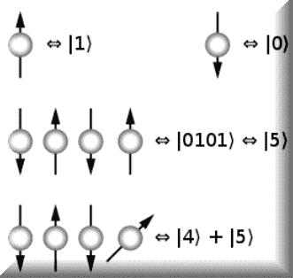

# 量子计算 – 未来

我们将以另一个话题的开始来结束这个系列，**量子计算**。量子计算是未来，它正在到来，它是真实的。它使用量子力学现象，如叠加和纠缠，其计算基于称为**量子比特**（**qubits**）的东西。普通计算机是基于晶体管，并使用著名的 0 和 1，而量子计算使用量子比特，它们可以处于状态的叠加，而不仅仅是开或关。

在撰写本文时，量子计算仍处于起步阶段，但正在取得进展。因此，这一章将会很短，但我们希望让你了解未来，以便你有所了解。

在本章中，我们将涵盖：

+   叠加

+   传送

正在进行许多实验，微软发布了其量子计算**软件开发工具包**（**SDK**）。微软和 IBM 都在开发他们自己的量子计算机版本。但在我们到达那里之前，让我们回顾一下你需要了解的一些术语。这些将进入你的超级术语清单！

这里有一个**布洛赫球面**，它是**希尔伯特空间**中量子比特的表示，它是量子计算最基本的部分：


一个经典计算机的内存由比特组成——1 和 0。然而，量子计算机由一系列量子比特组成。单个量子比特可以代表一个 1、一个 0，或者这两个量子比特状态的任何量子叠加。单个量子比特可以处于两种状态中的任何一种。一对量子比特可以处于两种状态的任何叠加，三个量子比特可以处于八种状态的任何叠加。因此，量子计算机可以处于许多不同状态的叠加，而传统计算机在任何给定时刻只能处于这些状态中的任何一个。

量子计算机通过量子门和量子逻辑门（类似于传统计算机的逻辑门）运行，它试图解决的问题是通过设置量子比特的初始值来编码的，就像传统计算机一样。量子算法被认为是大多数概率性的，即在已知概率下提供正确解决方案：



量子比特由受控粒子和控制手段（例如，捕获粒子并将它们从一个状态切换到另一个状态的设备）组成。

# 叠加

维基百科将**叠加**定义为：

"...量子力学的一个基本原理。它指出，与经典物理学中的波类似，任何两个（或更多）量子状态可以相加（“叠加”），其结果将是另一个有效的量子状态；反之，每个量子状态都可以表示为两个或更多其他不同状态的和。在数学上，它指的是薛定谔方程解的性质；由于薛定谔方程是线性的，任何解的线性组合也将是解。"

这实际上意味着，当量子系统没有被观察时，它可以同时处于多个状态。它们可以同时存在于所有可能的状态中。想象一下风大的日子里池塘上有很多波浪。毫无疑问，你看到它们在某些时候是重叠的。这就是量子叠加的简单粗暴的解释。

# 超光速

在量子计算中，**超光速**指的是将量子状态从一个位置移动到另一个位置的方法，而不需要移动任何物理粒子。这个过程通常伴随着发送和接收位置之间的**纠缠**。量子状态的传输使用量子纠缠现象（我们下一个话题）作为手段。当两个或更多粒子纠缠在一起时，它们的量子状态是相互依赖的，无论它们相隔多远。实际上，它们作为一个单一的量子对象起作用。

# 量子纠缠

量子纠缠是一种物理现象，当成对或成组的粒子以某种方式生成或相互作用，使得每个粒子的状态不能独立于其他粒子的状态来描述，即使粒子之间相隔很远——相反，必须为整个系统描述一个量子状态。

或许需要一个更直观的例子。假设你有一份今天的报纸，它有 100 页长。如果你阅读了 10 页，你就知道了 10%的内容。如果你再阅读另外 10 页，你现在就知道了 20%的内容，以此类推。然而，如果报纸非常复杂，如果你阅读了 10 页，你几乎什么也不知道。为什么？因为信息分布在那些页面之间，而不是在页面上。所以你必须想出一个方法一次性阅读所有页面。

现在我们已经描述了这些术语，让我们向您展示一个来自微软量子计算 SDK 的快速示例。正如我们提到的，在撰写本文时，量子计算还处于起步阶段，所以我们能做的最好的就是向您展示它的方向。我们将用一个非常简短的例子来做到这一点，然后如果您愿意，您可以继续学习。

那么，量子计算程序看起来是什么样子呢？就像这样：

```py
class Program
{
static void Main(string[] args)
{
using (var sim = new QuantumSimulator())
{
var rand = new System.Random();
foreach (var idxRun in Enumerable.Range(0, 8))
{
var sent = rand.Next(2) == 0;
var received = TeleportClassicalMessage.Run(sim, sent).Result;
System.Console.WriteLine($"Round {idxRun}:tSent {sent},tgot
  {received}.");
System.Console.WriteLine(sent == received ? "Teleportation
  successful!!n" : "n");
}
}
System.Console.WriteLine("nnPress Enter to continue...nn");
System.Console.ReadLine();
}
}
```

嗯，就是这样！好吧，差不多。你看，使用微软量子 SDK 的量子计算程序由两部分组成。第一部分是你在这里看到的 C#组件。实际上，前端可以是 C#、Python 以及几种其他语言。后端，我们稍后会看到，是量子部分，用 Q#编写；这是微软的新量子计算语言。每个 Q#操作都会生成一个同名的 C#类，该类将有一个`Run`方法。这个方法是异步的，因为操作将在量子计算机上异步运行。

根据微软关于 Q#的文档：

"Q#（Q-Sharp）是一种用于表达量子算法的领域特定编程语言。它用于编写在经典主机程序和计算机控制下运行的子程序，在辅助量子处理器上执行。

Q#提供了一组原始类型，以及两种创建新结构类型的方式（数组和解包）。它支持一个基本的程序模型来编写程序，包括循环和 if/then 语句。Q#中的顶级构造是用户定义的类型、操作和函数。

那么，让我们来谈谈我们的 C#代码做了什么。它只是通过量子传输（现在你知道我们为什么从术语开始！）发送一条消息。让我们看看后端，看看发生了什么：

```py
operation Teleport(msg : Qubit, there : Qubit) : ()
{
body
{
using (register = Qubit[1])
{
// Ask for an auxillary qubit that we can use to prepare
// for teleportation.
let here = register[0];
// Create some entanglement that we can use to send our message.\
H(here);
CNOT(here, there);
// Move our message into the entangled pair.
CNOT(msg, here);
H(msg);
// Measure out the entanglement.
if (M(msg) == One) { Z(there); }
if (M(here) == One) { X(there); }
// Reset our "here" qubit before releasing it.
Reset(here);
}
}
}
```

现在许多想法在你的脑海中涌现。问题比答案多，对吧？别担心；这确实是一种更技术性的软件编写方法，但我们会给你一点启示，让你明白这一切。

`H`、`CNOT`、`M`，发生了什么？这些都是 Q#定义的函数，并将存在于你的项目中的 Q#组件文件中。让我们看看其中一个，并解释一下发生了什么。

# CNOT

这将`CNOT`门（一个受控非门）应用于一个量子比特。CNOT 门是经典门的“量子化”，可以用来纠缠和解纠缠 EPR 状态。对于那些对 EPR 感兴趣的人，我建议阅读一下爱因斯坦-波多尔斯基-罗森佯谬（EPR）。

`CNOT`门是一组行和列的集合，类似于这样：


# H

这个函数将**哈达玛**变换应用于单个量子比特。它基本上会翻转量子比特的一半，而不是全部。哈达玛变换用于数据加密，以及 JPEG XR 和 MPEG-4 音频视频编解码器等信号处理算法。在视频压缩中，它通常用于绝对变换差分的总和。哈达玛变换还用于质谱学、晶体学等科学方法中。

目前，哈达玛函数定义为：


# M

这测量单个量子比特在**泡利 Z**基下的状态，输出结果由分布给出。`M`操作定义为：

```py
Pr(Zero||ψ
 ⟩
 )=
 ⟨
 ψ|0
 ⟩⟨
 0|ψ
 ⟩
```

Q#语言与 C#有何不同？以下是一些要点。

`using`语句与 C#中的不同。它用于为处理分配量子比特数组。与 C#中的`using`语句类似，量子比特在`using`语句结束时被释放。在整个应用程序的生命周期中，没有量子比特被使用。

Q#有一个不同的`for`循环，用于遍历范围。没有 C# `for`循环的直接等效。

默认情况下，Q#中的所有变量都是不可变的，这意味着一旦它们被分配，就不能更改。有一个`let`关键字可以用来绑定变量。操作参数始终是不可变的。尽管如此，(在撰写本文时)有声明变量并使用`set`语句稍后设置其值的能力。

# 摘要

好吧，我希望你们阅读这本书的乐趣和我写作时的乐趣一样。记住，还有很多东西要介绍，而且每天都有新的发展和变化！在系列书的下一本书中，我计划深入探索深度学习的世界，并真正探索一些有趣事物的内部。

现在，我希望你们已经找到了一种方法来接受这些宝贵的开源项目，并将它们融入到你们的日常生活中。无论你是机器学习开发者、数据科学家，还是对上述所有内容都感兴趣的普通 C#开发者，这本书中都有适合每个人的内容。探索开源项目、它们的示例和测试用例；构建一个框架，允许你将它们整合到你的日常生活中。

现在，非常感谢您阅读这本书，并祝您在未来的机器学习努力中一切顺利！我想感谢所有参与创建这本书并将其推向市场的人。Packt 团队非常乐于助人且礼貌，使整个过程变得简单而有趣。对所有校对者，非常感谢您的时间和努力。您的评论帮助使这本书变得更好。
