# Google Compute Engine

**Google Cloud Platform**（**GCP**）的核心服务是**Google Compute Engine**（**GCE**）。GCE 允许您根据您的需求启动具有正确操作系统、大小、RAM 以及适当数量的 CPU 或 GPU 的虚拟机（**VMs**）。它与 AWS EC2 相当。使用 GCE，我们深入 GCP 的核心。

在本章中，您将学习如何：

+   在 GCE 上创建适合您项目的 VM 实例。

+   使用谷歌的命令行工具管理您的 VM。

+   在 GCE 虚拟机上设置一个使用`conda`和`scikit-learn`的 Python 数据科学堆栈。

+   通过密码保护的 Jupyter Notebook 访问您的 VM。我们还将涵盖与镜像、快照、预占 VM、启动脚本和 IPs 相关的更多高级主题。

到本章结束时，您将能够通过在线控制台和命令行工具创建和管理您的 VM，以及实现数据科学工作流程和 Jupyter Notebook 工作空间。

# Google Compute Engine

简而言之，GCE 是一种允许您在谷歌基础设施上创建和运行 VM 的服务。GCE 允许您根据您的需求启动具有正确操作系统、大小、RAM 以及适当数量的 CPU 或 GPU 的 VM。它与 AWS EC2 相当。

GCE 于 2012 年 6 月 28 日在 Google I/O 2012 上宣布，并于 2013 年 5 月 15 日对公众开放。与 AWS EC2 等类似产品相比，GCE 是一个相对较新的服务：

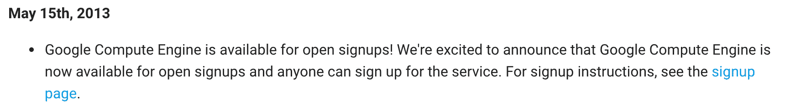

以下是从发布时间线中摘录的内容，展示了 GCE 服务从简单的竞争者到云计算领域全面参与者的快速演变：

+   2013 年 5 月 15 日：GCE 对所有用户开放。

+   2013 年 8 月 6 日：GCE 推出负载均衡。

+   2013 年 12 月 3 日：GCE 被宣布为生产就绪。*用户现在可以放心使用 Compute Engine 来支持关键任务工作负载，提供 24/7 的支持和 99.95%的月度服务级别协议*。

+   2014 年 6 月 25 日：**固态硬盘**（**SSD**）持久磁盘现在普遍可用，对所有用户和项目开放。

+   2015 年 9 月 8 日：可预占实例现在对所有用户和项目普遍可用。

+   2016 年 3 月 30 日：大于 10 TB 的持久磁盘现在普遍可用。

+   2016 年 7 月 1 日：关机脚本现在普遍可用，可用于计算引擎实例。

+   2017 年 9 月 21 日：NVIDIA® Tesla® K80 GPU 现在普遍可用。

+   2017 年 9 月 26 日：GCE 虚拟机实例的计费增量从每分钟增量减少到每秒增量。

+   在撰写本文时最新的消息是推出了惊人的 96-vCPU 机器类型。

在过去的四年里，谷歌通过以下方式稳步提高和快速发展其 GCE 服务：

+   扩展区域

+   添加更强大的机器和英特尔 CPU 平台

+   添加角色和功能

+   持续推出针对 Windows、Suse、CentOS、Debian、Ubuntu、RHEL 或 CoreOS 的新公共镜像

如时间线所示，GCE 服务是一个年轻且动态的服务，它拥抱其客户需求的变化，并以大胆的新产品来预见它们。它反映了谷歌成为云计算业务领导者的动力，并有可能抵消亚马逊在云计算中的领先地位。

在我们启动第一个 GCE 虚拟机之前，让我们先了解一些重要概念。

# 虚拟机、磁盘、镜像和快照

虚拟机是一个按需虚拟服务器，您可以根据需要启动它。它位于谷歌数据中心的一个地理位置，但您只需选择区域和区域，而不是确切的位置。尽管您与其他用户共享一些基础设施资源，但这种共享对您来说是透明的。

虚拟机需要一个持久磁盘来运行，以及一个操作系统，如 Windows 或 Linux 发行版来启动。尽管在云计算环境中非常抽象，但 GCE 磁盘将指的是计算机可以启动的物理驱动器。

一个镜像位于持久磁盘之上，并包含启动实例所需的操作系统。镜像的一个典型用途是允许在许多不同的虚拟机之间共享虚拟机设置。镜像由操作系统和引导加载程序组成，可以用来启动实例。

**快照**是虚拟机在特定时间点的内容的反映。快照主要用于即时备份。快照作为相对于前一个快照的差异存储，而镜像则不是。

镜像和快照非常相似。可以使用快照或镜像激活实例。

当您启动一个新实例时，GCE 首先会将一个持久磁盘附加到您的虚拟机上。这提供了磁盘空间，并为实例提供了启动所需的根文件系统。磁盘使用您选择的镜像，并安装与该镜像关联的操作系统。公共镜像由谷歌提供，具有特定的操作系统，而私有镜像则是您自己的镜像。

通过对镜像进行快照，您可以将现有持久磁盘中的数据复制到新的持久磁盘。快照旨在创建即时备份。

从 Google Shell，您可以访问和管理您所有的资源和文件。

例如，让我们通过输入以下命令来列出所有现有的实例：

```py
$ gcloud compute instances list
```

我们看到了我们新创建的麻雀实例。

# 创建虚拟机

现在我们将使用网络控制台创建我们的第一个虚拟机实例。

前往 GCE 控制台，[`console.cloud.google.com/`](https://console.cloud.google.com/)。选择我们在上一章中创建的项目（或者如果您还没有，可以创建一个），然后在左侧菜单中点击 Compute Engine。由于您还没有虚拟机，您将看到以下消息。点击创建，如图所示：

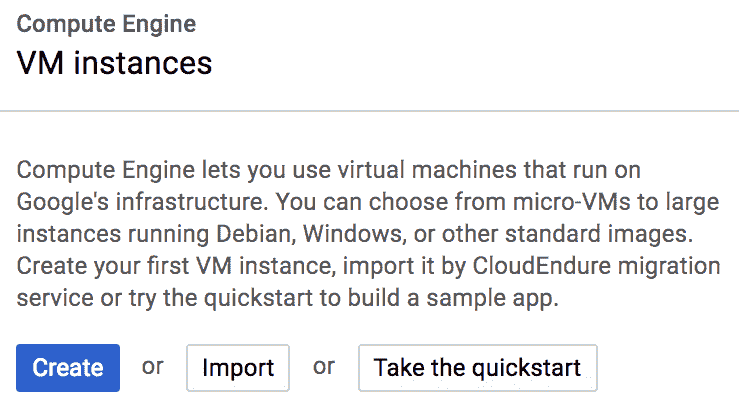

对于这个第一个虚拟机，我们将选择一个小的，并在进行过程中调整其大小。

在此阶段，您需要做出几个决定：

+   您实例的名称。我将称我的为**麻雀**。这个名称不需要在 GCP 中是唯一的。请随意命名您的。

+   地区和区域。通常最好选择离您最近的地域以减少延迟。然而，GCP 服务通常首先在美国开放，在其他地区的可用性要晚一些。不同地域也可能有不同的规则和法规。例如，欧洲提供比美国更强的数据相关隐私法律。根据您的需要选择区域。您总是可以在以后更改区域。

+   选择正确的机器类型很重要。在撰写本书时，不同的机器被分为小型、标准、高 CPU 和高 RAM 等类别：

    +   **小型**：共享 CPU 和有限的 RAM

    +   **标准虚拟机**：3.75 GB 的 RAM

    +   **高内存虚拟机**：13 GB RAM

    +   **高 CPU 虚拟机**：1.8 GB

小型类别非常适合入门并在此平台上积累一些实践经验。对于更复杂的项目，您可能需要更多的计算能力或更多的内存。

注意，免费试用账户的 CPU 数量限制为八个。

您也可以通过设置您想要的每个 CPU 的 CPU 数量或内存来定制您需要的机器。这也是您选择机器上 GPU 数量的地方，如下面的截图所示：

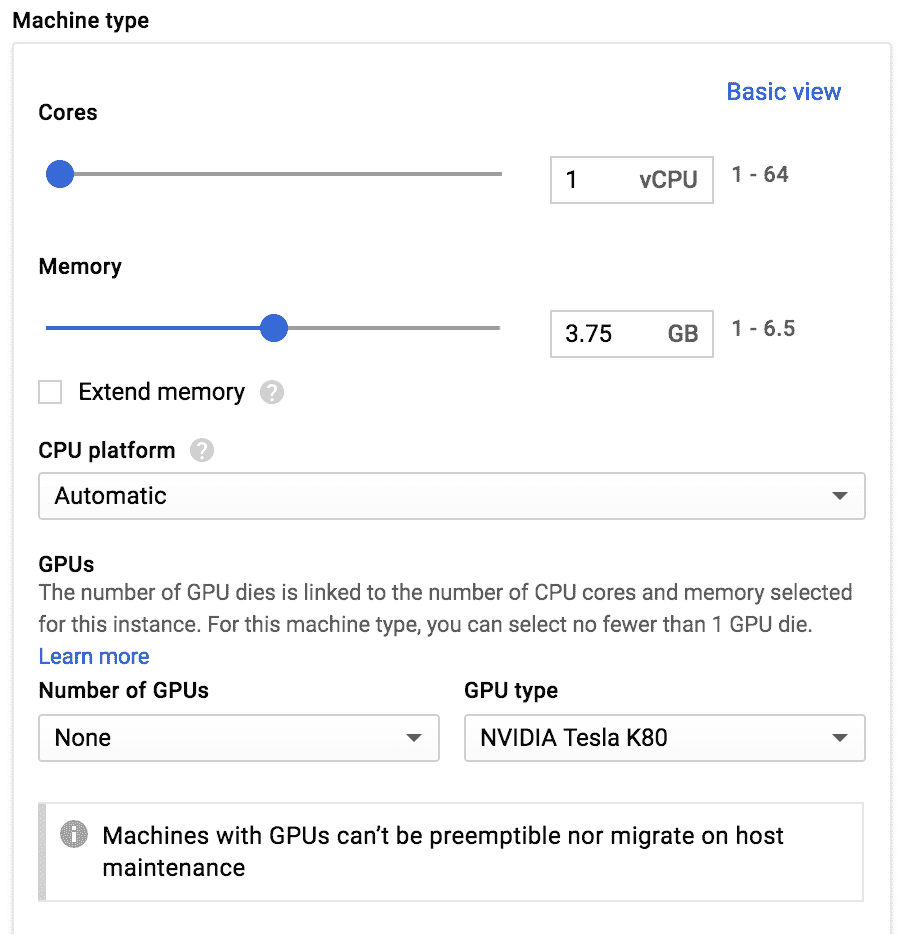

+   最后，您需要为您的虚拟机选择操作系统。默认情况下提供的是 Debian Linux 发行版。您可以在几个操作系统中进行选择：Windows、CentOS、Suse、CoreOS 和 Ubuntu。尽管 Ubuntu 通常是最受欢迎的选择，但实际上 Debian 和 Ubuntu 之间几乎没有区别，我们将使用默认的 Debian 发行版。如果您更熟悉 Ubuntu 发行版，请选择它。这在本章中不应引起任何问题。

Ubuntu 还是 Debian？Debian 是第一个在 1996 年发布第一个稳定版本的 Linux 发行版。Ubuntu 于 2004 年开始作为 Debian 的分支，即 Debian 的衍生版本。这两个发行版非常相似，Ubuntu 更易于用户使用，并且具有更好的桌面/UI 体验。Debian 通常用于服务器，拥有庞大的软件包库，重点在于稳定性和开源软件。Debian 的稳定版本大约每两年发布一次。Ubuntu 的发布周期为六个月。Ubuntu 从 Debian 的不稳定分支中提取，特别在 UI 方面进行定制，然后发布。对于我们的工作，这两个发行版之间应该几乎没有区别，我们将使用 Debian 作为我们的虚拟机。

将所有其他参数保留为默认选择。我们将在几页后回到 HTTPS 流量、磁盘、网络和 `ssh` 密钥。

在网页控制台中，有一个非常有用的功能可以降低掌握 GCP 的学习曲线，那就是在虚拟机创建页面底部的两个链接，即“等效 REST”或“命令行”，如下图中所示：


命令行链接存在于网页控制台的多个页面中。这是一个非常有用的功能，可以快速学习 GCP 命令行工具的正确语法和参数。

我们的虚拟机现在已经创建完成，正在运行中！

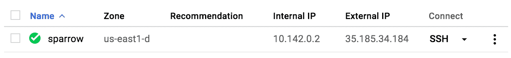

现在我们有一个全新的闪亮的虚拟机，我们该如何访问它？这很自然地引出了 Google Shell。

# Google Shell

Google Shell 是 Google 在浏览器中为你提供一个独立终端的智能方式，以便访问和管理你的资源。

你可以通过点击控制台页面右上角的 >_ 图标来激活 Google Shell：


浏览器窗口分为两部分，现在下半部分是一个 shell 终端：

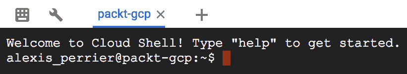

这个终端运行在具有 Debian 操作系统的 f1-micro GCE VM 上。它是根据每个用户和每个会话创建的。当你的 Cloud Shell 会话处于活动状态时，它会持续存在，在 20 分钟的无操作后会被删除。该实例运行在具有 5GB 存储空间的持久磁盘上。磁盘和镜像都是免费的。尽管实例不会跨会话持久，但与其关联的磁盘是跨会话持久的。你通过 Google Shell 创建的所有内容都将按照你下次会话开始时的状态可用。这包括你存储的所有文件、你安装的软件以及你编辑的配置文件（例如`.bashrc`和`.vimrc`）。这个磁盘是私有的，其他用户无法访问。最后，Google Shell 实例预装了 Google Cloud SDK 和其他流行的开发者工具，如 VIM。

你通过网页控制台运行的某些命令将被保存在你的 Google Shell VM 中。例如，你在 Google SQL 实例上运行的 SQL 查询，将出现在你用户目录的`$HOME`文件夹中的`.mysql_history`文件中。关于 Google Shell 的更多信息可以在你`$HOME`文件夹中的`README-cloudshell.txt`文件中找到。

从 Google Shell，你可以访问和管理所有你的资源和文件。例如，让我们通过输入以下命令来列出所有现有的实例：

```py
$ gcloud compute instances list
```

我们可以看到我们新创建的麻雀实例：

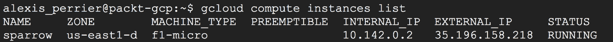

要访问你刚刚创建的虚拟机，请输入：

```py
$ gcloud compute ssh sparrow
```

这将运行必要的`ssh`密钥的创建过程。现在你已经不在 Google 的 Cloud Shell VM 实例上了，而是在麻雀 VM 上了。为了检查我们在麻雀实例上运行的是哪个操作系统和版本，我们运行：

```py
$ lsb_release -d
```

在麻雀机器上，我安装的是 Debian GNU/Linux 9（stretch），而在 Google Shell VM 上，则是 Debian GNU/Linux 8（jessie）。这告诉我 Google Shell 尚未升级到 Debian 发行版的最新版本。当然，您可能会看到不同的结果。

# Google Cloud Platform SDK

GCP 提供了几个独立的**命令行界面（CLIs**）来管理和与您的 GCP 资源交互，其中`gcloud`是主要的。所有次要命令行工具都是通过`gcloud`安装的。在撰写本文时，命令行工具有：

+   `gcloud`：管理您的 GCP 资源和项目的核心命令行界面：身份验证、本地配置、开发者工作流程以及与 GCP API 的交互。以下服务可以通过`gcloud`命令行界面处理：应用引擎、身份验证、计算引擎、容器、DataFlow、Dataproc、机器学习、SQL 数据库以及 Cloud 资源的部署、Iam 设置、与 Stackdriver 和 Web 资源（如 DNS、域或 Firebase）的日志记录。

Gcloud 还负责其他命令行工具：

+   `gsutil`：这是 Google Storage 的命令行界面。您使用`gsutil`创建和删除存储桶、上传、下载和移动文件、设置权限等。

+   `bq`：这是与 BigQuery 交互的命令行界面。

+   `datalab`：Datalab 命令行界面。

所有这些命令行工具都是 Python 脚本，需要在您的系统上安装 Python 2.7。

要安装`gcloud`，最佳方式是遵循 Cloud DSK 页面上的说明[`cloud.google.com/sdk/downloads`](https://cloud.google.com/sdk/downloads)。下载正确的包，并运行适合您机器的相应命令。安装过程将引导您创建`ssh`密钥。它将在您的`~/.ssh`文件夹中安装三个文件。您的公钥和私钥（即`google_compute_engine.pub`和`google_compute_engine`）以及已知主机列表（`google_compute_known_hosts`）。

您可以通过在终端中运行`gcloud version`来验证`gcloud`是否正确安装。您的输出将类似于：

```py
Google Cloud SDK 173.0.0
core 2017.09.25
gsutil 4.27
```

如我们所见，`gcloud`不是一个万能工具。`gcloud`内置了组件。这些组件可以是其他独立的 CLIs，如`gsutils`、`bq`、`datalab`，或者是`gcloud`扩展（如`app-engine-python`），以及 Alpha 和 Beta 发布级别。要查看您的`gcloud`中安装了哪些组件，请在终端中运行以下命令：

```py
$ gcloud components list
```

您将获得以下结果：

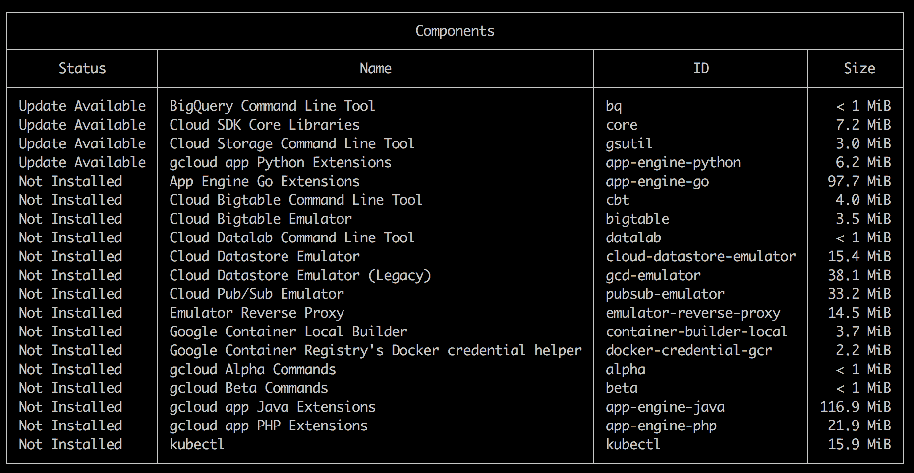

要在当前 SDK 版本（173.0.0）中安装或删除组件，请使用以下命令：

```py
$ gcloud components install COMPONENT_ID 
$ gcloud components remove COMPONENT_ID
```

要将 SDK 安装更新到最新版本（175.0.0），请运行：

```py
$ gcloud components update
```

# Gcloud

让我们通过几个命令来了解`gcloud`命令行界面的语法：

+   要列出所有项目，请使用以下命令：

```py
$ gcloud projects list
```

+   要列出`packt-gcp`项目中的所有实例，请使用以下命令：

```py
$ gcloud compute instances list --project packt-gcp
```

`gcloud`的全局通用语法也适用于其他 CLI 工具：

```py
$ gcloud GROUP | COMMAND parameters
```

其中 `GROUP` 是服务或账户元素，`COMMAND` 是要发送到 `GROUP` 的命令。例如，在 `gcloud projects list` 中，`projects` 是 `GROUP`，您的账户的一个元素，而 `list` 是 `COMMAND`。在 `gcloud compute instances list --project packt-gcp` 中，`GROUP` 是 `compute`，后面跟着子组 `instances`，而 `list` 是 `COMMAND`，`--project packt-gcp` 是必需的参数。

gcloud 参数包括账户设置（例如实例的密钥和区域）、CLI 设置（详细程度、格式或特定配置）以及命令所需的参数。例如，要启动我们的实例，我们需要指定两个参数——区域和实例 ID：

```py
$ gcloud compute instances start sparrow  --project packt-gcp --zone us-east1-d
```

# Gcloud 配置

为了避免在 `config` 中指定区域或其他参数，您可以在其中设置它们：

```py
$ gcloud config set compute/zone us-east1-d
```

要在 `config` 中取消设置它们，您可以使用以下命令：

```py
$ gcloud config unset compute/zone
```

要列出 `config` 中所有可用的设置，请运行 `gcloud config set --help`。

区域和区域也可以存储在环境变量 `CLOUDSDK_COMPUTE_ZONE` 和 `CLOUDSDK_COMPUTE_REGION` 中。环境变量会覆盖您使用 `gcloud` `config` 命令设置的默认属性，但不会覆盖像 `--zone` 或 `--region` 这样的显式标志。

要设置环境变量 `CLOUDSDK_COMPUTE_ZONE`，请在您的 `.bashrc` 文件中运行或添加以下行：

```py
$ export CLOUDSDK_COMPUTE_ZONE=us-east1-c
```

更多详情，请参阅 [`cloud.google.com/compute/docs/gcloud-compute/#set_default_zone_and_region_in_your_local_client`](https://cloud.google.com/compute/docs/gcloud-compute/#set_default_zone_and_region_in_your_local_client)。

# 使用 gcloud 访问您的实例

从一开始，您想要做的有两件重要的事情：

+   访问实例

+   在您的实例和另一台机器之间移动文件。要使用 `ssh` 连接到您的实例，请运行：

```py
$ gcloud compute ssh <instance_name>
```

在我们的案例中：

```py
$ gcloud compute ssh sparrow
```

第一次从您的本地系统访问您的实例时，平台将传播您的密钥到实例，这可能需要几分钟。一旦连接，您可以通过检查您的本地公钥（`cat ~/.ssh/google_compute_engine.pub`）是否包含在实例的 `authorized_keys` 列表中（`cat ~/.ssh/authorized_keys`）来验证。

# 使用 gcloud 传输文件

通过 Gcloud 的 `.csp` 命令版本在您的机器（或任何其他位置）和实例之间来回传输文件完成：

+   要将本地文件发送到您的实例 `$HOME` 文件夹：

```py
$ gcloud compute scp ~/LOCAL-FILE :~/
```

+   例如，要将名为 `hello_world.txt` 的文件发送到 sparrow，您将运行以下命令：

```py
$ gcloud compute scp ~/hello_world.txt  sparrow:~/
```

+   类似地，要从实例下载文件到您的本地机器 `$HOME` 文件夹：

```py
$ gcloud compute scp  <instance-name>:~/REMOTE-FILE ~/
```

我们将在下一章中探讨 `gsutil` 和 `bq` 命令行工具，在第四章中探讨 Datalab CLI（*使用 BigQuery 查询您的数据*）。

# 管理虚拟机

当你开始使用 Google Compute 上的虚拟机时，你将想要执行几个操作，例如启动实例、停止实例、调整磁盘大小和修改磁盘、以及创建快照。我们将介绍其中最重要的：

1.  启动和关闭虚拟机：

```py
$ gcloud compute instances start sparrow --project packt-gcp 
$ gcloud compute instances stop sparrow --project packt-gcp
```

1.  检查虚拟机状态：

```py
$ gcloud compute instances list --project packt-gcp
```

我们开始时使用的实例是一个 f1-micro，对于实际的数据科学项目来说，CPU、RAM 或磁盘空间都不够。我们想更改底层机器并增加其磁盘空间。但在那之前，我们应该对我们的当前机器进行快照作为备份。如果出了问题，我们能够从快照中恢复实例：

1.  对虚拟机进行快照：

```py
$ gcloud compute disks snapshot [DISK_NAME]
```

1.  在我们的例子中，让我们在运行时将我们的磁盘命名为 `sparrow-backup`：

```py
$ gcloud compute disks snapshot sparrow-backup --project packt-gcp
```

1.  更改机器类型时，你首先需要停止你的实例，使用命令 `$ gcloud compute instances stop sparrow --project packt-gcp`。一旦完成，就可以使用通用命令更改机器类型：

```py
$ gcloud compute instances set-machine-type INSTANCE --machine-type MACHINE-TYPE
```

1.  在我们的例子中，如果我们想将类型更改为 `n1-standard-1`（3.75 GB 内存和 1 个 vCPU），我们应该运行以下命令：

```py
$ gcloud compute instances set-machine-type sparrow --machine-type n1-standard-1
```

1.  当我们处理这些时，我们还想将底层磁盘从 10 GB 调整到 100 GB：

```py
$ gcloud compute disks resize sparrow --size 100
```

1.  另一个重要的设置是确保在删除实例时不会删除磁盘：

```py
$ gcloud compute instances set-disk-auto-delete
```

这是一个重要的参数，也可以在计算引擎控制台中设置，通过在创建或编辑实例时取消选择“实例删除时删除启动磁盘”：

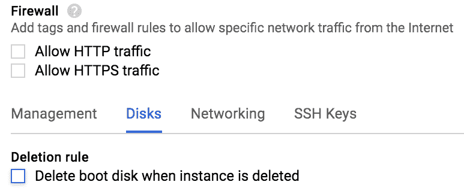

1.  实例配置：整个实例配置可以通过 `$ gcloud` compute instances describe sparrow 获取。

1.  从头创建正确的虚拟机：在这个例子中，当你从头创建虚拟机时，所有这些参数都是可用的。运行以下命令将在 `europe-west1-c` 区域创建一个新的 `n1-standard-1` 实例，名为 `hummingbird`，在 Ubuntu 17.04 上运行，带有 100 GB 的磁盘，也命名为 `hummingbird`。请注意，这个实例是可抢占的（`--preemptible`），并且磁盘在实例删除后将持续存在（`--no-boot-disk-auto-delete`）：

```py
$ gcloud compute --project packt-gcp instances create hummingbird \
--zone europe-west1-c --machine-type n1-standard-1 \
--image ubuntu-1704-zesty-v20171011 --image-project ubuntu-os-cloud \
--boot-disk-size 100  --boot-disk-type "pd-standard"  \
--boot-disk-device-name hummingbird \
--preemptible --no-boot-disk-auto-delete
```

我们可以验证，现在我们的项目中已经有了两个实例：

为了控制我们的资源，我们应该使用以下命令删除这个新实例：

```py
$ gcloud compute instances stop hummingbird --zone europe-west1-c  --project packt-gcp
```

注意，如果你在 `config` 设置或作为环境变量中设置了不同的默认区域，在删除实例之前，你需要指定实例的区域；否则，将生成一个 `资源未找到` 的错误信息。

# IP 地址

您一定注意到了与我们的 VM 关联的内部和外部 IP 的存在。每个 GCP 项目都附带一个**虚拟专用云**（**VPC**）网络，该网络与项目自动创建。VPC 基本上是一个私有和隔离的虚拟网络分区，它使您的资源能够在给定项目内相互通信，同时允许控制对 VPC 的外部访问。创建时，每个实例都会分配一个内部 IP 地址，以便项目 VPC 内的其他资源能够与实例通信。要与 VPC 之外的对象通信，包括与互联网的连接，实例需要外部 IP 地址。

IP 地址，无论是内部还是外部，可以是短暂的或静态的。短暂的 IP 地址仅在实例运行期间与实例关联。当实例停止或被终止时，IP 地址将在全局 GCP IP 地址池中释放。为了使实例有一个稳定的 IP 地址，IP 地址需要变为静态。静态地址会产生额外的费用。

将 IP 地址的性质从短暂更改为静态可以通过控制台完成。停止 VM 并编辑它。在网络接口部分，选择 VM 的内部和外部 IP 地址的正确类型：

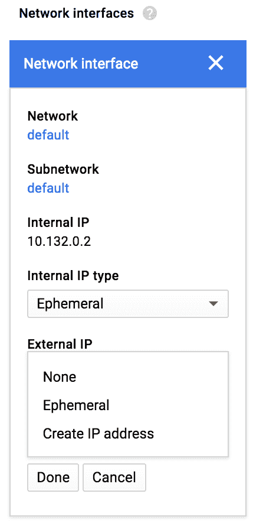

可以从[VPC 网络控制台](https://console.cloud.google.com/networking/networks/list)访问 IP 地址和 VPC 的管理。

您可以直接从外部 IP 地址页面创建一个新的静态 IP 地址并将其附加到您的实例：

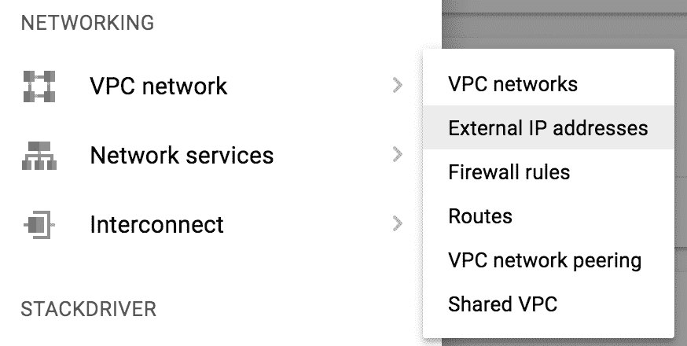

点击“预留静态地址”，选择区域类型为“区域”，设置区域为您的实例所在区域，并将其附加到您的麻雀实例：

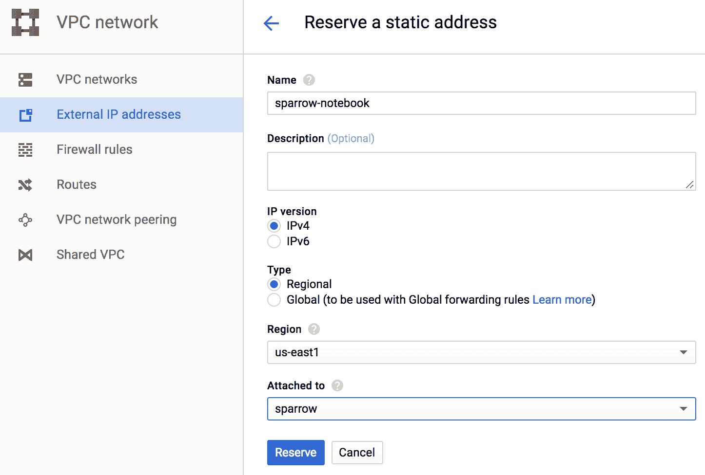

创建静态 IP 并将其添加到实例的命令行等效操作是：

```py
$ gcloud compute --project=packt-gcp addresses create sparrow-notebook --region=us-east1
$ gcloud compute --project=packt-gcp instances add-access-config sparrow --zone=us-east1-d --address=IP_OF_THE_NEWLY_CREATED_STATIC_ADDRESS
```

由于静态 IP 地址即使在未使用时也会计费，因此在不需用时释放它们是很重要的。

# 在 VM 上设置数据科学栈

因此，现在我们有一个正在运行的虚拟机，我们可以向它发送文件，连接到它，并修改它。一切准备就绪，我们可以为数据科学设置它！

我们将从 continuum 安装 Python Miniconda 栈，它比完整的 Conda 发行版小得多。通过 SSH 连接到您的实例。

1.  使用以下命令安装 mini `sudo apt-get update sudo apt-get install bzip2 wget` from [`repo.continuum.io/miniconda/Miniconda2-latest-Linux-x86_64.sh`](https://repo.continuum.io/miniconda/Miniconda2-latest-Linux-x86_64.sh)：

```py
bash Miniconda2-latest-Linux-x86_64.sh
```

1.  然后使用`conda`安装 Python 栈：

```py
$ conda install scikit-learn pandas jupyter ipython
```

不要忘记做这件事：

```py
$ source .bashrc
```

# 将 ipython 控制台框起来

要在您的实例中启动 Jupyter Notebook 并通过 Web 访问它，您需要将默认提供的虚拟机的短暂外部 IP 地址提升为静态外部 IP。

您还需要确保您的实例正在接受 HTTP 和 HTTPS 流量。为此，前往您的虚拟机页面，编辑它，并检查以下复选框：

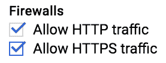

由于您的 Jupyter Notebook 对网络上的所有流量都是开放的，您需要通过密码保护它：

1.  生成配置：

```py
$ jupyter notebook --generate-config
```

1.  使用以下方式添加密码：

```py
$ jupyter notebook password
```

更多关于如何保护您的公共 Notebook 的信息，包括使用 `ssh` 密钥和添加加密，可在[`jupyter-notebook.readthedocs.io/en/latest/public_server.html`](http://jupyter-notebook.readthedocs.io/en/latest/public_server.html)找到。

1.  使用以下命令启动 Jupyter Notebook：

```py
$ jupyter notebook --ip=0.0.0.0 --port=8888 --no-browser &
```

这将生成一个令牌和以下消息：

```py
The Jupyter Notebook is running at: http://0.0.0.0:8888/?token=7b1deb1b1467a3b3c9c23946e2f2efa12d9dc2c258353660
and access it in your browser via http://104.196.129.173:8888/?token=7b1deb1b1467a3b3c9c23946e2f2efa12d9dc2c258353660
```

# 故障排除

如果您在访问 Notebook 时遇到问题，有一个替代解决方案。想法是使用 IP `0.0.0.0` 启动 Jupyter Notebook，而无需先设置静态 IP：

```py
jupyter notebook --ip=0.0.0.0 --port=8888 --no-browser
```

这将生成一个令牌。然后在另一个终端中 SSH 进入，添加以下标志 `--ssh-flag="-L" --ssh-flag="2222:localhost:8888"`：

```py
$ gcloud compute ssh sparrow --ssh-flag="-L" --ssh-flag="2222:localhost:8888"
```

这就是如何将 URL `localhost:2222` 与 Jupyter Notebook URL `localhost:8888` 关联起来。然后您可以在 `http://localhost:2222` 访问您的 Notebook。您还需要输入刚才给出的令牌。

这个替代方案是由 Jeff Delaney 在以下博客文章的评论中给出的，*在 Google Cloud Engine 上运行 Python Jupyter Notebook*：[`jeffdelaney.me/blog/running-jupyter-notebook-google-cloud-platform/`](https://jeffdelaney.me/blog/running-jupyter-notebook-google-cloud-platform/)。

# 将 GPU 添加到实例

检查并请求增加您的 GPU 配额：

+   搜索 GPU。如果您分配的配额中为 0，请选择 GPU 类型和区域，然后点击编辑配额。填写请求表单([`console.cloud.google.com/iam-admin/quotas?project=packt-gcp`](https://console.cloud.google.com/iam-admin/quotas?project=packt-gcp))。

在 Google Compute 上使用 GPU 时有一些限制。GPU 不可用于共享或可抢占的机器。GPU 实例会在常规（每周）维护事件中终止。有关限制的最新信息，请参阅[`cloud.google.com/compute/docs/gpus/`](https://cloud.google.com/compute/docs/gpus/)。有关根据您所需的 GPU 数量了解可用机器类型的信息，请参阅[`cloud.google.com/compute/docs/gpus#introduction`](https://cloud.google.com/compute/docs/gpus#introduction)。

从控制台创建带有 GPU 的虚拟机：

1.  前往虚拟机控制台，点击创建实例

1.  选择一个兼容 GPU 的区域

1.  点击自定义机器类型，然后再次点击 GPU 链接

1.  选择所需的 GPU 数量和关联的类型：

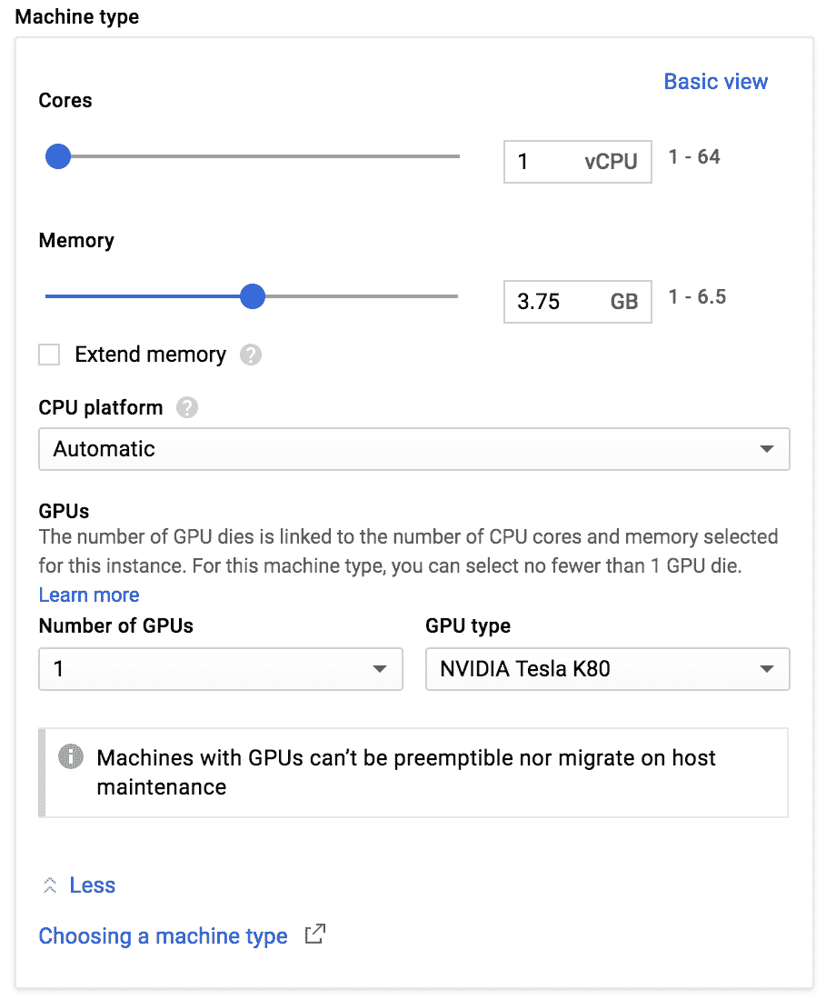

类似地，您可以使用以下命令使用 `gcloud` 创建启用 GPU 的实例：

```py
$ gcloud compute instances create [INSTANCE_NAME] \
--machine-type [MACHINE_TYPE] --zone [ZONE] \
--accelerator type=[ACCELERATOR_TYPE],count=[ACCELERATOR_COUNT] \
--image-family [IMAGE_FAMILY] --image-project [IMAGE_PROJECT] \
--maintenance-policy TERMINATE --restart-on-failure \
--metadata startup-script='[STARTUP_SCRIPT]'
```

其中 `--accelerator type=` 指定 GPU 类型，`count=` 指定 GPU 数量。

例如，此命令将在`us-east1-d`区域创建一个带有 NVIDIA® Tesla® K80 GPU 和两个 vCPU 的 Ubuntu 1604 实例。启动脚本元数据指示实例安装 CUDA 工具包及其推荐的驱动程序版本：

```py
$ gcloud compute instances create gpu-instance-1 \
--machine-type n1-standard-2 --zone us-east1-d \
--accelerator type=nvidia-tesla-k80,count=1 \
--image-family ubuntu-1604-lts --image-project ubuntu-os-cloud \
--maintenance-policy TERMINATE --restart-on-failure \
--metadata startup-script='#!/bin/bash
echo "Checking for CUDA and installing."
# Check for CUDA and try to install.if ! dpkg-query -W cud
a-8-0; then
  curl -O http://developer.download.nvidia.com/compute/cuda/repos/ubuntu1604/x86_64/cuda-repo-ubuntu1604_8.0.61-1_amd64.deb
  dpkg -i ./cuda-repo-ubuntu1604_8.0.61-1_amd64.deb
  apt-get update
  apt-get install cuda-8-0 -y
fi'
```

启动脚本为 Ubuntu 安装正确的 CUDA 驱动程序。对于其他驱动程序和操作系统，请按照[`developer.nvidia.com/cuda-downloads`](https://developer.nvidia.com/cuda-downloads)上的说明操作。

一旦驱动程序安装完成，您可以验证它是否已正确安装：

1.  通过`ssh`连接到您的实例

1.  输入`nvidia-smi`以查看您的驱动程序版本以及您有多少 GPU 内存

命令`nvcc --version`显示当前的 CUDA 版本。

# 启动脚本和停止脚本

启动脚本允许您在启动或创建实例时运行脚本。例如，要始终在创建新实例时安装`miniconda`和相关数据科学包，只需在您的本地机器上的文件中编写以下脚本：

```py
#! /bin/bash
apt-get install bzip2
wget https://repo.continuum.io/miniconda/Miniconda2-latest-Linux-x86_64.sh
sudo bash Miniconda2-latest-Linux-x86_64.sh
conda install scikit-learn
conda install pandas
conda install jupyter
conda install ipython
```

然后在启动新实例时，提供`--metadata-from-file`标志，后跟`startup-script=PATH/TO/FILE`，其中`PATH/TO/FILE`是启动脚本相对于当前目录的路径：

```py
$ gcloud compute instances create example-instance --metadata-from-file startup-script=examples/scripts/install.sh
```

您也可以在命令行或从存储在 Google 存储中的文件中使用扩展启动脚本。有关启动脚本更多信息，请访问[`cloud.google.com/compute/docs/startupscript`](https://cloud.google.com/compute/docs/startupscript)。

停止脚本是在实例终止或重启时自动运行的脚本。与启动脚本类似，您可以在创建实例时通过添加`--metadata-from-file`标志，后跟`shutdown-script=PATH/TO/FILE`来关联一个停止脚本：

```py
$ gcloud compute instances create example-instance --metadata-from-file shutdown-script=examples/scripts/shutdown.sh
```

# 资源和进一步阅读

以下是一些关于在 GCE 上设置 TensorFlow 的有趣文章：

+   **在 Compute Engine 上运行分布式 TensorFlow**：[`cloud.google.com/solutions/running-distributed-tensorflow-on-compute-engine`](https://cloud.google.com/solutions/running-distributed-tensorflow-on-compute-engine)

+   **Jupyter + TensorFlow + Nvidia GPU + Docker + GCE**：[`medium.com/google-cloud/jupyter-tensorflow-nvidia-gpu-docker-google-compute-engine-4a146f085f17`](https://medium.com/google-cloud/jupyter-tensorflow-nvidia-gpu-docker-google-compute-engine-4a146f085f17)

+   **在 GCP 上使用 GPU 和 TensorFlow**：[`medium.com/google-cloud/using-a-gpu-tensorflow-on-google-cloud-platform-1a2458f42b0`](https://medium.com/google-cloud/using-a-gpu-tensorflow-on-google-cloud-platform-1a2458f42b0)

+   **在 Google Cloud 上运行 GPU 上的 Jupyter Notebook**：[`medium.com/google-cloud/running-jupyter-notebooks-on-gpu-on-google-cloud-d44f57d22dbd`](https://medium.com/google-cloud/running-jupyter-notebooks-on-gpu-on-google-cloud-d44f57d22dbd)

一些与 Docker 相关的资源：

+   **在 GCE 上创建机器的 Docker 配置**：[`docs.docker.com/machine/drivers/gce/`](https://docs.docker.com/machine/drivers/gce/)

+   **使用 stackdriver 进行日志记录**：[`medium.com/google-cloud/how-to-log-your-application-on-google-compute-engine-6600d81e70e3`](https://medium.com/google-cloud/how-to-log-your-application-on-google-compute-engine-6600d81e70e3)

# 摘要

GCE 是 GCP 的核心服务，提供基于不同操作系统的各种可扩展虚拟机。可用的操作系统种类繁多，机器的 CPU、GPU 范围，从小到巨大的磁盘空间和 RAM，使 GCE 成为一个强大的云环境，适用于各种项目和场景。

在本章中，你学习了：

+   如何创建、启动、备份、修改和访问多个虚拟机 (VM)

+   与虚拟机 (VM) 相关的不同参数和变量

+   如何访问和使用 Google Shell

+   如何使用 `gcloud` CLI 在 GCP 中执行相同的操作

+   如何安装数据科学 Python 栈

+   如何启动 Jupyter Notebook

GCE 提供了更多由其强大和灵活的特性能带来的可能性，我们尚未涉及。希望到本章结束时，你应该能够在一个以数据为中心的背景下，舒适地使用适合你项目的实例。

在下一章中，我们将学习如何使用 Google Storage 和 Google SQL 在 GCP 上存储数据。
