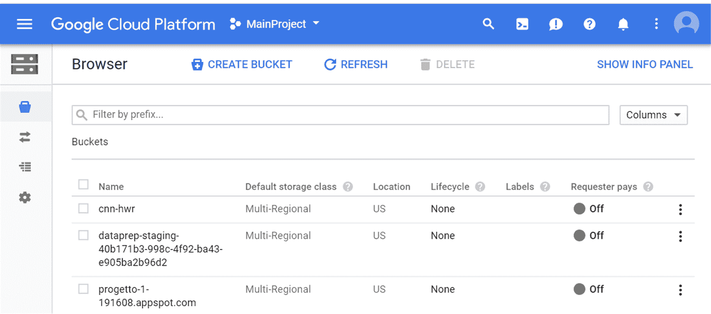
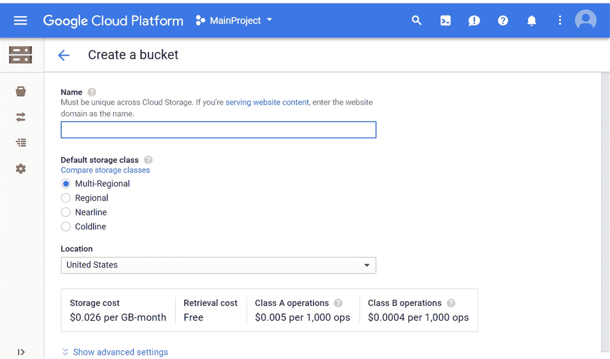
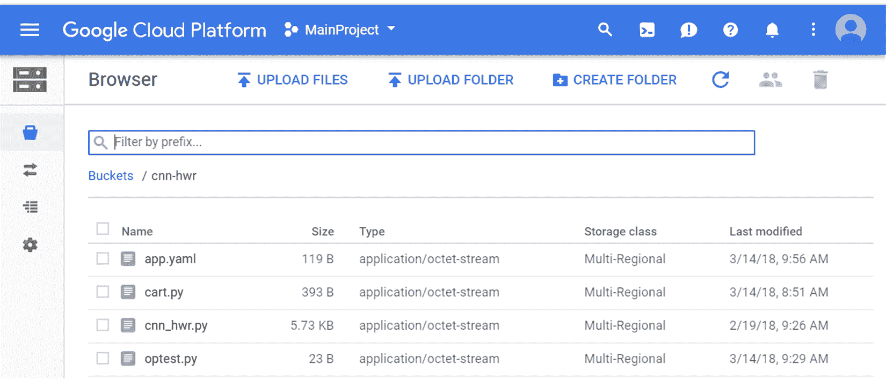
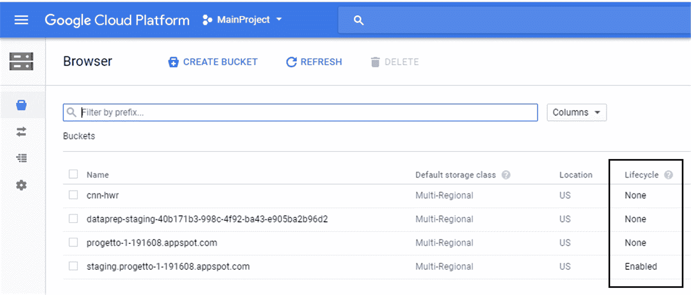
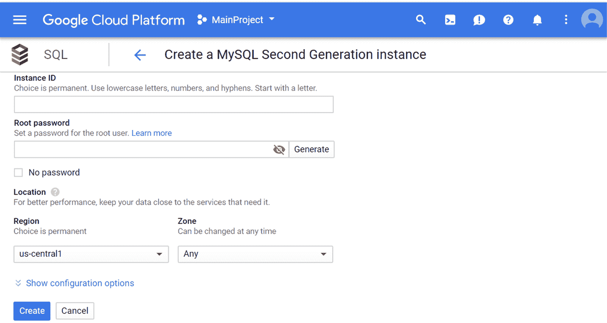

# 第三章：Google Cloud Storage

在本章中，我们将探讨来自 Google Cloud 平台的两项数据存储服务：用于文件的 Google Storage 和用于结构化数据的 Google SQL。Google Storage 是一种文件托管服务，允许您在云端存储文件。非常简单直接，它与 Amazon S3 服务非常相似。为了超越基本使用，我们将探讨一些高级主题，例如签名 URL、协作存储桶设置、优化上传速度以及传输大型数据集。

Google SQL 是 Google 的简单 SQL 数据库服务。在 SQL 类型方面，目前不如 Amazon SQL 服务发达。它提供 MySQL 作为主要数据库。PostgreSQL 的 beta 版本也可用。我们将探讨两者在各自功能方面的差异。

在使用基于云的解决方案进行数据科学项目时，让服务相互通信，或者更确切地说，允许不同数据存储和数据消费者之间的数据传输，通常是困难所在。

诸如容量、延迟和吞吐量等问题可能会影响您脚本的运行速度和您工作的效率。设置适当的权限级别，以便您的数据可以在项目环境中访问，同时仍然受到外部访问的保护，这也是关键。

本章中，您将学习：

+   如何使用 gsutil 在 Google 存储上存储文件

+   如何在 Google SQL 上创建数据库并使用数据填充它们

+   如何访问您的 Google 存储文件和您的 Google SQL 数据库

在本章结束时，您将能够使用 Google Cloud 平台提供的服务上传数据并管理它，并了解 Google Cloud SQL 在创建关系型数据库管理系统方面的潜力。

# Google Cloud Storage

云存储是一种在网络上可用的计算机上存储数据的模型，其中数据存储在多个服务器上，真实或虚拟，通常托管在第三方设施或专用服务器上。通过这种模型，无论身在何处，使用任何合适的设备，都可以访问个人或商业信息，无论是视频、音乐、照片、数据库还是文件，而无需知道数据的物理位置。这种方法的优势众多：内存空间无限，只需支付实际使用的内存量，文件可以从世界任何地方访问，维护成本大幅降低，安全性更高，因为文件受到盗窃、火灾或本地计算机可能发生的损坏的保护。

Google Cloud Storage 是 Google 提出的云存储方案：它是由 Google 提供的一项开发者服务，允许您直接在 Google 的基础设施上保存和操作数据。更详细地说，Google Cloud Storage 提供了一个编程接口，它使用简单的 HTTP 请求在其基础设施上执行操作。使用 Google Cloud Storage，您可以执行以下操作：上传文件、下载文件、删除文件、获取文件列表或获取给定文件的大小。每个这些 HTTP 请求都包含有关使用的方法和请求的资源的信息。因此，可以创建一个应用程序，通过这些 HTTP 请求提供一项服务，在该服务中，应用程序可以远程保存数据，通常通过第三方服务器。

Google 存储平台是一个企业存储解决方案，提供三种不同访问需求和相关定价的存储级别：

+   标准存储用于快速访问大量数据。在$0.026/GB 的价格下，它提供了对请求的高响应速度。

+   **持久性降低可用性**（**DRA**）适用于长期数据存储和偶尔访问。它的价格较低，为$0.02/GB。

+   最后，近线存储适用于更不频繁的访问。它是该服务的最便宜版本，响应时间更长。它是目前价格最低的选项，目前价格为$0.01/GB。

# 盒式存储与驱动器

Google Drive 用于存储个人文件。在所有不同的个人服务（如电子邮件、照片等）中，它提供高达 15 GB 的免费存储空间。它还提供每月付费的额外数据存储量（例如，每月 9.99 美元用于 1 TB）。但是，与 Google Storage 相比，没有数据压缩或数据加密。它不是由 Google 作为具有相关功能、支持和可靠性的企业平台提供的。没有高级管理功能，如元数据，也没有通过存储桶进行的数据组织管理。也没有高级存储层（冷数据与热数据）。

Google Drive 服务的特点如下：

+   没有基于层的数据存储

+   它不是一个商业解决方案

+   它不支持高级数据管理功能

+   存储计划限制在 30 TB

要了解 Google Cloud Storage 提供的潜力，请参阅以下内容：

+   它提供无限空间

+   由于使用了 OAuth，它比 Google Drive 具有更高的安全性

+   它提供高级存储级别

+   它为高级企业服务和应用程序的集成提供 REST API 支持

+   它在出错后有可能恢复数据传输

通过分析 Google Cloud Storage 提供的一些功能，其优越性显而易见，这证明了其成本是合理的。

# 访问控制列表

文档中说得最好，**访问控制列表**（**ACLs**）允许您控制谁可以读取和写入您的数据，以及谁可以读取和写入 ACLs 本身。

如果在对象上传时未指定（例如，通过`gsutil cp -a`选项），

对象将使用存储桶上设置的默认对象 ACL 创建（参见`gsutil help`

`defacl` [`cloud.Google.com/storage/docs/gsutil/commands/defacl`](https://cloud.Google.com/storage/docs/gsutil/commands/defacl)]。你可以

使用`gsutil acl set`命令替换对象或存储桶的访问控制列表（ACL），或使用`gsutil acl ch`命令修改现有的 ACL（参见`gsutil help acl`：[https://](https://cloud.google.com/storage/docs/gsutil/commands/acl)[cloud.Google.com/storage/docs/gsutil/commands/acl](https://cloud.google.com/storage/docs/gsutil/commands/acl))）。

ACL 分配给对象（文件）或存储桶。默认情况下，存储桶中的所有文件都具有相同的

与它们所在的存储桶相同的 ACL。

有几点需要注意：

+   对象没有写访问权限；尝试设置带有写

    权限将导致错误

+   对象 ACL 决定了独立于存储桶 ACL 读取设置的读取访问权限。（文件夹权限不覆盖文件访问。）

可用几个预设。可用的预定义 ACL 有：

+   **项目私有**：根据其角色给予项目团队权限。

    团队中的任何人都拥有读取权限，以及项目所有者和

    项目编辑者拥有所有者权限。这是新创建

    存储桶。这也是新创建对象的默认 ACL，除非默认

    该存储桶的对象 ACL 已更改。有关更多详细信息，请参阅 gsutil 帮助

    项目。

+   **私有**：给予请求者（以及只有请求者）对对象的拥有者权限

    存储桶或对象。

+   **公共读取**：给予所有用户（无论是否登录或匿名）读取权限。

    当你将此应用于对象时，互联网上的任何人都可以读取该对象

    无需认证即可访问。

+   **公共读写**：给予所有用户读写权限。此 ACL 适用于

    仅限于存储桶。将存储桶设置为公共读写将允许互联网上的任何人

    互联网上传任何内容到您的存储桶。您将对此负责

    内容。还有其他设置，请查看文档。

# 通过 Web 控制台进行访问和管理

在前面的章节中，我们介绍了 GCP 提供的服务。现在，让我们看看如何访问该服务以及如何管理它。为此，Google 创建了一个基于 Web 的界面，用于完全在线服务管理，以及 gsutil，这是一个命令行工具，允许你在服务上执行所有需要的操作。

# gsutil

`gsutil` 是命令行工具，是 `gcloud` 脚本子集的一部分，允许您管理 Google Storage 上的存储桶和对象（文件）。通过 `gsutil` 可用的操作从创建存储桶和移动文件等简单直接命令，到管理设置、存储类和权限的管理命令。更高级的命令包括通过 ACL 设置访问控制、定义生命周期规则（1 年后删除所有文件）、日志记录、创建通知和通过 perfdiag 进行故障排除。

让我们从简单的命令开始。我们将创建一个名为 `packt-gcp` 的存储桶，上传一些文件，获取这些文件的信息，移动它们，并更改存储类。

# gsutil 快速参考

以下是我们可以通过 gsutil 发出的最常用命令列表：

+   创建名为 `packt-gcp` 的存储桶：

    +   `gsutil mb gs://packt-gcp`

+   将文件上传到存储桶：

    +   `gsutil cp gs://packt-gcp/`

+   在存储桶中创建子目录：

    +   `gsutil cp your-file gs://packt-gcp/`

+   列出文件夹：

    +   `gsutil ls gs://packt-gcp/`

+   获取 gsutil 命令的帮助：

    +   `gsutil help`

+   我们使用了多少存储空间（`-h` 使其可读）：

    +   `gsutil du -h gs://packt-gcp/`

+   将整个文件夹复制到存储桶中：

    +   `gsutil cp -r gs://packt-gcp/`

例如，我有一个包含一些图片的本地 `./img` 目录。我可以使用以下命令复制整个目录并同时在存储桶中创建子目录：

```py
gsutil cp -r ./img gs://packt-gcp/
```

让我们分析一个特别有用的选项：我指的是 `-m` 标志。如果您正在执行一系列 `gsutil` 操作，那么如果您使用 `gsutil -m -o`（这意味着并行运行），它可能会运行得更快。如果您在合理快速的网络连接上对大量文件执行操作，这可以显著提高性能，但如果您使用较慢的网络，可能会降低性能。

`-m` 标志特别适合以下命令：`ls`、`mb`、`mv`、`rb` 和 `du`。

# 高级 gsutil

之前，我们看到了一些简单的基本命令，我们可以使用 `gsutil` 导入。但使用这个工具，我们还可以做其他事情：

+   `gsutil` 支持通配符（和 ?）并将通配符限制在文件上。要包括文件夹在通配符目标中，请将符号加倍：`gsutil ll gs:///**.txt` 将列出子目录中的所有文本文件。

+   `gsutil` 需要使用 UTF-8 字符编码。对于 Windows：要使用 Unicode 字符，您需要在第一次在该命令壳中使用 `gsutil` 之前运行此命令：`chcp 65001`。

+   您本地机器用户路径中的 `.boto` 文件是 gsutil CLI 的配置文件。您可以直接编辑它或通过 `gsutil config` 命令进行编辑。`.boto` 文件中的一些有趣参数如下：

    +   `parallel_composite_upload_threshold`：此参数用于指定单个流中要上传的文件的最大大小。大于此阈值的文件将并行上传。`parallel_composite_upload_threshold`参数目前默认禁用。

    +   `check_hashes`：此参数用于在下载数据时执行完整性检查，始终、从不或条件性。

    +   `prefer_api`：此参数值是 JSON 或 XML。

    +   `aws_access_key_id`：此参数用于与 S3 的互操作性。

    +   `aws_secret_access_key`：此参数用于与 S3 的互操作性。

# 签名 URL

签名 URL 是用于桶和对象的查询字符串认证机制。签名 URL 提供了一种方式，无论持有人是否有 Google 账户，都可以给予时间有限的读取或写入访问权限。

为什么使用签名 URL？有时，需要控制没有 Google 账户的用户访问权限。为了授予这些用户访问 Google Cloud Storage 的权限，我们可以向他们提供签名 URL，这允许用户在有限的时间内对该资源进行读取、写入或删除访问。在 URL 过期之前，资源访问权限允许给 URL 的所有者。

创建签名 URL 有两种方式：

+   使用`gsutil`创建签名 URL

+   使用程序创建签名 URL。

创建签名 URL 最简单的方法是使用`gsutil signurl`命令。为此，您首先需要生成一个私钥或使用现有的私钥。要创建私钥，您首先需要为服务账户创建一个 OAuth 客户端 ID。

要创建新的私钥，请访问：[`console.cloud.Google.com/apis/credentials?project=packt-gcp`](https://console.cloud.google.com/apis/credentials?project=packt-gcp)

按照说明操作并下载文件。有两种格式可供选择：

+   **JSON**：在生产环境中使用应用默认凭证且不在 Google Cloud 平台之外时，此参数是必需的。

+   **PKCS12**：被许多不同的编程语言和库支持。

要限制可以访问 GCP 的角色：将 JSON 文件下载到您的计算机上。

您现在可以使用以下命令使用`gsutil`为您的文件之一创建签名 URL：

```py
gsutil signurl -d 10m -m GET Desktop/privatekey1.json gs://packt-gcp/file1.csv
```

请记住，签名 URL 在目录上不工作。如果您想给多个文件提供访问权限，可以使用通配符，如下所示：

```py
gsutil signurl -d 10m -m GET Desktop/privatekey1.json gs://packt-gcp/img/.png
```

但这将为`img/`文件夹中的每个`.png`文件生成一个签名 URL。

签名 URL 也可以用于上传文件（`-m PUT` 和 `POST`），并使用 `-c text/plain` 或 `-c image/jpg` 指定内容类型。

# 在 Google Cloud Storage 中创建存储桶

正如我们之前所说的，存储桶是一个容器，用于存放您的数据。在 Google Storage 中保存的所有内容都必须包含在存储桶中，对应于文件夹。您可以使用它们来组织和控制对数据的访问，但与文件夹不同，您不能创建子存储桶。在 Google Storage 中，单个数据以对象的形式保存。这样的对象可以是任何类型、扩展和尺寸的文件；使用 BigQuery 创建的表也被视为对象，正如我们将在第四章中看到的，*使用 BigQuery 查询您的数据*。与单个作业相关的所有对象都必须包含在存储桶中。

对象是不可变的，因此不能直接在 Google Storage 中编辑对象。重要的是要说明，不可能对对象的任何内容进行任何更改；如果您想修改存储在 Google Storage 中的对象，它只能被替换。如果您不想删除它并重新加载它，您可以通过覆盖它来执行相同的操作，只需一个操作即可。

# Google Storage 命名空间

Google Storage 使用分层结构来存储存储桶和对象。所有的存储桶都位于这个单一的环境中，而所有的对象也都在某个存储桶内的层次结构中。基于这种分层结构，存储桶名称在整个现有的 Google Storage 存储桶中必须是唯一的。每个存储桶名称在整个云存储命名空间中都必须是唯一的。

给存储桶命名时，我们不能使用已被其他用户选中的名称。虽然对象必须在给定的存储桶内具有唯一名称，但因此我们可以有多个存储桶，这些存储桶始终包含具有相同名称的对象。

# 存储桶命名

给存储桶命名时，我们必须遵循由事实强加的一些规则；正如我们预期的，所有的存储桶都位于唯一的 Google Storage 命名空间中。存储桶名称必须遵守以下规则：

+   它们的长度必须是 3 到 63 个字符

+   它们必须以数字或字母开头和结尾

+   它们必须只包含小写字母、数字、点和破折号

+   它们不能表示为点分十进制格式的 IP 地址

+   它们不能以 GOOG 前缀开头

+   它们不能包含两个相邻的点或点前后的破折号

最后，应该注意的是，一旦您创建了存储桶的名称，您就不能更改它。要更改它，您应该创建一个新的存储桶，并使用所需的名称，然后将旧存储桶的内容移动到新存储桶中。

# 对象命名

在 Google Storage 中，单个数据以对象的形式保存。对象名称必须遵守以下规则：

+   它们可以包含任何有效的 Unicode 字符序列，当以 UTF-8 编码时，长度为 1-1,024 字节

+   它们不能包含回车或换行符

+   它们不能以知名/acme-challenge 开头

为了消除扁平层次结构带来的限制，我们可以在对象名称中使用斜杠（`/`）字符。例如，如果我们必须为两个不同的对象使用相同的名称，我们可以将一个对象命名为 `/NewYork/Stadium.jpg`，另一个命名为 `/Boston/Stadium.jpg`。这样就可以像在目录内一样组织对象，并按此方式管理它们。实际上，Google Storage 将对象视为独立的对象，它们之间没有层次关系。

# 创建存储桶

要在 Google Cloud Storage 中操作，我们可以使用两个工具：控制台和 gsutil。第一个工具使用典型的图形界面，而第二个使用命令行窗口。

# Google Cloud Storage 控制台

首先，我们将了解如何使用 Google Cloud Storage 控制台创建存储桶。首先，当我们访问它时，我们可以通过在主 Google Cloud Platform 的资源部分左侧点击进入 Cloud Storage，从而进入该控制台。以下窗口将会打开：



在打开的窗口中，所有与账户相关的存储桶都会列出。对于每一个，都有以下特性：

+   **名称**：存储桶名称。

+   **默认存储类**：默认分配给存储桶中添加的对象的存储类。

+   **位置**：数据存储的位置。

+   **生命周期**：允许您设置自动删除对象或降低其存储类别的规则。

+   **标签**：帮助组织您的存储桶。标签也会包含在您的账单中，因此您可以看到标签间成本分布。

+   **请求者付费**：如果开启，对存储桶数据的请求将计费到请求者的项目中。

要创建一个新的存储桶，只需在 Google Cloud Storage 浏览器顶部点击 CREATE BUCKET 按钮。随后会打开以下页面：



在打开的页面上，您需要指定以下信息：

+   **名称**：记住，它必须在 Cloud Storage 中是唯一的

+   **默认存储类**：有四种选项可供选择：多区域、区域、近线和冷线

+   **位置**：此下拉菜单允许我们选择位置

在做出这些选择后，只需点击 CREATE 按钮，就会在 Google Cloud Storage 浏览器中添加一个新的存储桶。

现在我们有了容器，是时候用内容来丰富它了。为此，我们首先需要通过点击其名称来访问简单的存储桶。以下页面将会打开：



在打开的页面上，所有存储桶的内容都会列出。对于每个对象，都会提供一系列信息：

+   **名称**：对象名称

+   **大小**：对象尺寸

+   **类型**：对象类型

+   **存储类**：分配给存储桶中添加的对象的存储类

+   **最后修改**：对象的最后修改日期

要将另一个对象添加到存储桶中：

1.  简单地单击 Google Cloud Storage 浏览器顶部的“上传文件”按钮。将打开一个对话框窗口。

1.  在对话框窗口中，选择您想要上传到存储桶的文件或文件夹。

1.  点击打开。

如果我们使用 Chrome 作为浏览器，则可以进行文件夹上传。这样，我们可以将整个文件夹的内容加载到存储桶中。否则，我们可以首先使用“创建文件夹”按钮创建一个文件夹，然后单独上传所有对象。

要重命名、复制和移动对象，只需单击与对象关联的更多选项按钮（三个垂直点）。将打开一个上下文菜单。在其中我们可以执行以下操作：

+   编辑权限

+   编辑元数据

+   复制

+   移动

+   重命名

对于每个选项，都会打开一个相对窗口，它将指导我们进行操作。

# Google Cloud Storage gsutil

我们已经看到，使用 Google Cloud Storage 浏览器简单直观。但在某些情况下，有必要通过命令窗口进行操作。在这种情况下，正如我们在前面的章节中看到的，我们可以使用`gsutil`。之前，我们已经通过`gsutil`看到了一系列命令。

要使用`gsutil`创建存储桶，请使用`mb`命令。例如，使用以下命令：

```py
gsutil mb gs://NameBucket1
```

这将创建一个名为`NameBucket1`的存储桶。重要的是要记住，存储桶名称必须在整个 Google Storage 命名空间内是唯一的。如果其他用户已经创建了一个我们想要使用的名称的存储桶，我们必须选择另一个名称。

一旦创建了存储桶，我们就可以导入其中的对象。使用`cp`命令，我们可以将文件从我们的计算机复制到 Google Storage：

```py
gsutil cp figure.jpg gs://NameBucket1/fig.jpg
```

这将把图像`figure.jpg`从我们在 shell 中定位的文件夹复制到`NameBucket1`存储桶中，并将对象重命名为`fig.jpg`。

要列出我们的存储桶或其中包含的对象，您必须使用`ls`命令。

`ls`命令在类 Unix 操作系统中用于显示有关文件和目录的信息。如果我们打开一个终端并输入`ls`，我们将得到当前目录中文件和目录的列表。

以下命令列出了我们创建的所有存储桶：

```py
gsutil ls
```

当此命令列出`NameBucket1`中包含的对象时：

```py
gsutil ls gs: // NameBucket1
```

您还可以使用`ls`命令的`-L`选项来获取有关对象和存储桶的更多信息。以下命令提供了关于对象大小、最后修改日期、数据类型以及`NameBucket1`存储桶中包含的所有对象的**访问控制列表（ACL**）的信息：

```py
gsutil ls -L gs: // NameBucket1
```

而以下命令提供了关于我们的存储桶的信息，例如包含的对象数量、总大小以及所有存储桶的 ACL：

```py
gsutil ls -L
```

最后，要将对象从一个存储桶转移到另一个存储桶，请使用`mv`命令，此命令也可以用于重命名对象。例如，以下命令将图像`figure.png`从`NameBucket1`存储桶转移到`NameBucket2`存储桶：

```py
gsutil mv gs://NameBucket1/figure.png gs:// NameBucket2/
```

当此命令将图像`figure.png`重命名为`fig.png`时：

```py
gsutil mv gs://NameBucket1/figure.png gs://NameBucket1/fig.png
```

# 生命周期管理

使用 Google Cloud Storage，对象的生命周期管理变得简单直接。对象的生命周期是从对象创建到其被销毁的时间。对象持续时间的规则在编程平台之间差异很大。在归档对象的情况下，我们指的是对象存储在其分配空间中的时间。

桶的生命周期可以通过其配置进行管理。配置包含一组应用于桶中所有对象的规则。当对象满足某个规则的准则时，就会执行对象上指定的操作。

要使用 Google Cloud Console 为桶启用生命周期：

1.  前往打开 Google Cloud Platform 控制台，并点击云存储浏览器；以下窗口将打开：



1.  在此窗口中，检查**生命周期**列，选择桶，并点击条目**无**；将打开一个新页面。

1.  在此窗口中，点击添加规则。

1.  在打开的页面中，我们可以通过选择条件和操作来指定配置。

1.  最后，点击保存按钮。

可以执行类似的程序来检查在桶上设置的生命周期配置，以及禁用桶的生命周期管理。

# Google Cloud SQL

Google Cloud SQL 是 Google Cloud Platform 的一个数据库服务，允许在云中为应用程序创建、管理和管理关系数据库。该服务得益于数据库将托管在其上的 Google 基础设施，保证了卓越的性能和可扩展性。与平台上的每个服务一样，使用的简便性是基础：无需安装任何软件，手动进行更新，或处理数据库的备份和复制。Google 平台将负责所有这些，并确保 99.95%的可用性。数据在保存到数据库和备份之前被加密，以保证基础设施的安全性。

您还可以为每个数据库实例设置网络防火墙，以直接调节对实例的访问。该服务可以与任何兼容 MySQL 或 PostgreSQL 的基于云的应用程序或网站一起使用，实例可以通过应用引擎、计算引擎和平台工作站轻松访问。

服务的费用不需要任何初始支付，而是按分钟计算整个使用期间的费用，并且只对实际分配的资源收费。在 MySQL 数据库的情况下，Cloud SQL 实例的标准价格范围是每小时$0.0150 – $4.0240（最高可达 208 GB 的 RAM），而对于存储空间，备份的价格为每 GB/月$0.08，HDD 存储的价格为每 GB/月$0.09，SSD 存储的价格为每 GB/月$0.17。此外，还需要加上通过计算引擎管理网络的成本。

# 支持的数据库

使用 Google Cloud SQL，可以创建两种类型的数据库：

+   MySQL

+   PostgreSQL

MySQL 是一个开源的**关系型数据库管理系统**（**RDBMS**），可以通过**结构化查询语言**（**SQL**）免费使用。SQL 是用于在数据库中添加、访问和管理内容的最流行语言。它以其快速处理、可靠的可靠性、易用性和使用灵活性而闻名。MySQL 几乎是所有开源 PHP 应用程序的必要组成部分。

PostgreSQL 是一个具有悠久历史的先进数据库系统。它在广泛的平台上可用，既用于微小的嵌入式系统，也用于巨大的多 TB 系统。多年来，PostgreSQL 凭借其创新功能、数据完整性、安全性和可靠性赢得了卓越的声誉。

PostgreSQL 支持目前仍处于测试阶段，因此复制或高可用性等特性不可用。它们支持的云平台实例支持 MySQL 5.7 或 PostgreSQL 9.6 数据库，并允许最高达到 208 GB 的 RAM、32 个 CPU 和 10 TB 的存储。数据在 Google 网络上以及表和备份中加密，可以通过通过应用引擎（用 Java、Python、PHP、Node.js、Go 或 Ruby 编写）创建的应用程序访问，通过 MySQL/PostgreSQL 客户端使用标准协议，甚至可以通过外部应用程序访问，并可以使用如 SSL 等安全连接协议。

通常，标准 MySQL/PostgreSQL 实例在本地提供的功能与 Cloud SQL 实例提供的功能之间没有明显的差异。特别是，我们提醒您，使用`CREATE FUNCTION`语句在 MySQL 中创建新功能是不可能的，并且缺少`SUPER`（MySQL）和`SUPERUSER`（PostgreSQL）权限。

# Google Cloud SQL 性能和可扩展性

Cloud SQL 提供卓越的性能和可扩展性。如前所述，最大存储容量为 10 TB（将在 HDD 和 SSD 之间分配），而可选择的最高 RAM 为 208 GB，最大 CPU 数量为 32。Google 还保证最大 IOPS（每秒输入/输出操作）为 25,000，即每秒可以进行 25,000 次输入/输出操作。因此，选择这样的资源使我们能够使用 Cloud SQL 来满足各种类型的应用需求，从负载较低的应用到需要强大性能的应用。**每秒查询数**（QPS）没有限制，但有关连接有一些限制。实际上，在第二代 MySQL 实例的情况下，最多可以支持 4,000 个并发连接，而其他情况下的限制则更为严格。

对于第一代 MySQL 数据库，只有在建立连接之前，传入请求会短暂排队，此时同时存在的排队连接数限制为 100。数据库也易于垂直扩展，增加或减少可用资源（存储空间、CPU 和 RAM），以及水平扩展同时工作的服务器和实例数量。一旦创建了实例，您可以直接从控制台更改为其分配的资源。通常，更改会立即生效，但实例的重启将关闭现有连接，并需要几秒钟（在第一代 MySQL 的情况下）或几分钟（在第二代的情况下）才能重新上线。

# Google Cloud SQL 的安全性和架构

关于安全性，Cloud SQL 上的数据在表中、临时文件中、备份副本中以及在 Google 基础设施内从一台服务器到另一台服务器使用安全网络协议移动时都进行了加密。因此，平台基础设施旨在确保在信息管理的每个阶段都保证其数据的安全性。用户无需采取任何行动：平台通过计算引擎自动加密数据，因此它提供的所有服务都将符合这些要求。

从设计角度来看，全球范围内的基础设施安全性是按照分层架构组织的。这种架构允许安全地使用服务、数据和用户、管理员之间的通信。

从最底层开始，即硬件层面，我们拥有谷歌自主设计和建设的数据中心，仅对少数员工开放，并由金属探测器、摄像头或生物识别技术等设备进行监控。单个数据中心由多个连接到单个本地网络的服务器组成：始终由谷歌负责验证其自行设计和供应商提供的组件是否符合公司的安全标准。单个服务器机器，通过数字签名在各个低级组件上进行单独标识，以便易于追踪，并在每次启动时进行验证。

转到软件层面，每个编写并用于在平台上运行的应用程序都会在多台机器上以多个副本运行，以使用每个工作负载所需的资源量。软件架构是多租户的，其中软件的单个实例运行在服务器上，并为多个租户（即共享实例访问权限的用户）提供服务。应用程序的任务是为每个租户提供实例的专用部分。这一概念与多实例架构截然相反，在多实例架构中，有多个软件实例，每个实例都专门为单个客户端服务。

# 创建 Google Cloud SQL 实例

Google Cloud SQL 实例是一组管理数据库文件的记忆结构。实例管理其关联的数据并为数据库用户提供服务。每个运行的 Google Cloud SQL 数据库都至少关联到一个数据库实例。

Cloud SQL 实例是完全管理的，关系型 MySQL 和 PostgreSQL 数据库。谷歌负责复制、补丁管理和数据库管理，以确保可用性和性能。创建实例时，请选择适合您应用程序的大小和计费计划。

要创建 Google Cloud SQL 实例：

1.  请访问以下网址查看 Google Cloud SQL 实例页面：[`console.cloud.google.com/sql/instances`](https://console.cloud.google.com/sql/instances).

1.  点击页面中间的创建实例按钮。一个引导序列将引导我们创建实例。

1.  选择数据库类型；有两个选项可供选择：MySQL 和 PostgreSQL（MySQL 是默认选择）。做出选择后，点击下一步按钮。

1.  选择 MySQL 实例类型；有两个选项可供选择：MySQL 第二代（推荐）和 MySQL 第一代。MySQL 第二代提供高性能、高存储容量和低成本。MySQL 第一代是 Cloud SQL 的较旧版本，提供基本性能和存储容量。要做出选择，请点击选择第二/第一代按钮。

1.  新页面被打开。在这个页面上，必须做出一系列选择，如下面的截图所示：



首先的选择涉及实例的名称。这是一个从外部可见的名称，因此建议不要在该名称中包含敏感或个人信息。此外，在实例名称中包含项目 ID 也不是必要的；如果需要，它将自动添加。

1.  设置`'root'@'%'`用户的密码。

1.  设置区域。

1.  设置配置选项。

1.  最后，点击“创建”按钮。

这样，一个新的实例就已经创建好了。

# 摘要

在本章中，我们发现了 Google Cloud Platform 提供的两项额外服务：Google Cloud Storage 和 Google Cloud SQL。Google Cloud Storage 是一个文件托管服务，允许您在云端存储文件。我们看到了如何存储视频、音乐、照片、数据库或文件，而无需知道数据的物理位置，无论在世界上的任何地方，使用任何合适的设备。我们通过浏览器或命令行执行了文件上传操作。

之后，我们了解了 Google Cloud SQL 在创建关系型数据库管理系统方面的潜力。使用 Google Cloud SQL，您可以创建、管理和管理关系型数据库。最初我们发现了该服务的特点，后来通过一个实际示例学习了如何创建新的数据库实例。
