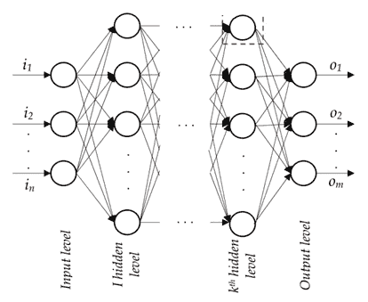

# 机器学习基础知识

到目前为止，在之前的章节中，我们介绍了 GCP 中可用的各种 ETL 流程。在本章中，我们将通过以下主题开始我们的机器学习和深度学习之旅：

+   机器学习应用

+   监督学习和无监督学习

+   主要机器学习技术的概述

+   数据拆分

+   测量模型的准确性

+   机器学习和深度学习之间的区别

+   深度学习应用

# 机器学习应用

机器学习涵盖了一系列从历史数据中学习的技巧。基于从历史数据中学习到的模式，机器学习技术预测未来数据集中事件发生的概率。鉴于机器学习的工作方式，这一系列技巧有多个应用。以下几节中，我们将探讨其中的一些。

# 金融服务业

在金融领域的某些应用如下：

+   识别贷款/信用卡申请人的风险程度

+   估计给定客户的信用额度

+   预测卡交易是否为欺诈交易

+   识别需要针对活动进行定位的客户细分市场

+   预测客户在接下来的几个月内可能违约的可能性

+   推荐客户应该购买的正确金融产品

# 零售行业

以下是一些机器学习不同技巧在零售行业中的应用：

+   预测客户可能购买的下一种产品

+   估计给定产品的最佳价格点

+   预测产品随时间推移将销售的单元数量

+   通过捆绑产品进行促销以定位客户

+   估计客户终身价值

# 电信行业

以下是机器学习在电信行业中的几个应用：

+   预测在通话开始前通话掉话的可能性

+   预测客户在接下来的几个月内可能流失的可能性

+   识别可以出售给客户的附加月度使用量

+   识别不太可能为后付费服务付款的客户

+   为现场销售人员优化劳动力

# 监督学习和无监督学习

监督学习构成了旨在构建一个近似函数的模型的一组技巧。该函数接受一组输入变量，这些变量也被称为独立变量，并试图将输入变量映射到输出变量，这些变量也被称为依赖变量或标签。

由于我们知道我们正在尝试预测的标签（或值），对于一组输入变量，该技术变成了一个监督学习问题。

以类似的方式，在无监督学习问题中，我们没有必须预测的输出变量。然而，在无监督学习中，我们试图将数据点分组，以便它们形成逻辑组。

可以通过以下图示获得监督学习和无监督学习的高层次区别：

在前面的图中，监督学习方法可以区分两个类别，如下所示：

在监督学习中，有两个主要目标可以实现：

+   预测事件发生的概率——分类

+   估计连续因变量的值——回归

帮助分类的主要方法如下：

+   逻辑回归

+   决策树

+   随机森林

+   梯度提升

+   神经网络

除了逻辑回归之外，线性回归也有助于估计连续变量（回归）。

虽然这些技术有助于估计连续变量或预测事件发生的概率（离散变量预测），但无监督学习有助于分组。分组可以是行（这是一种典型的聚类技术）或列（一种降维技术）。行分组的主要方法包括：

+   K-means 聚类

+   层次聚类

+   基于密度的聚类

列分组的主要方法包括：

+   主成分分析

+   **t-Distributed Stochastic Neighbor Embedding** (**t-SNE**)

列分组可以识别出数据集中存在的客户（观测值）的段。

列分组可以减少列的数量。当独立变量的数量很高时，这一点很有用。通常情况下，如果出现这种情况，构建模型可能会遇到问题，因为需要估计的权重数量可能很高。此外，在解释模型时也可能出现问题，因为一些独立变量之间可能高度相关。在这种情况下，主成分分析或 t-SNE 很有用，因为我们可以在不丢失太多数据集中现有信息的情况下减少独立变量的数量。

在下一节中，我们将概述所有主要的机器学习算法。

# 机器学习技术概述

在了解主要机器学习技术概述之前，让我们先看看在回归技术或分类技术中我们想要优化的函数。

# 回归中的目标函数

在回归练习中，我们估计连续变量的值。在这种情况下，我们的预测可能低于实际值或高于实际值；也就是说，误差值可以是正的也可以是负的。在这种情况下，目标函数转化为最小化数据集中每个观测值实际值和预测值之间差异的平方和。

用数学术语来说，前面的内容可以写成如下形式：

在给定的方程中：

+   *SSE* 代表**平方误差和**

+   *y* 指的是因变量的实际值

+   *y'* 指的是因变量的估计值

+   ∑ 表示数据集中所有观测值的平方误差之和

给定目标函数，让我们从高层次了解线性回归是如何工作的。

# 线性回归

在线性回归中，我们假设自变量和因变量之间存在线性关系。线性回归表示如下：

在给定的方程中：

+   *Y* 是因变量

+   *W* 是与自变量 *X* 相关的权重

+   *b* 是截距值

如果有多个自变量（比如说两个自变量，*x1* 和 *x2*），方程如下：

在给定的方程中：

+   *w1* 是与变量 *x1* 相关的权重

+   *w2* 是与变量 *x2* 相关的权重

典型的线性回归看起来如下，其中 *x* 轴是自变量，*y* 轴是因变量：

直线（具有特定的斜率和截距）是线性回归的方程。

注意图中线是使整体平方误差最小的线。

# 决策树

决策树是一种帮助我们从数据中推导规则的技巧。基于规则的技巧在解释模型如何估计因变量值时非常有帮助。

典型的决策树如下所示：

以下图示解释如下：

+   **根节点**：这代表整个总体或样本，并进一步分割成两个或更多的节点。

+   **分割**：根据一定规则将节点分割成两个或更多子节点的过程。

+   **决策节点**：当一个子节点进一步分割成子节点时，它被称为**决策节点**。

+   **叶节点/终端节点**：决策树中的最后一个节点是叶节点或终端节点。

+   **剪枝**：当我们移除决策节点的子节点时，这个过程称为**剪枝**。可以说它是分割过程的相反过程。

+   **分支/子树**：整个树的子部分称为**分支**或**子树**。

+   **父节点和子节点**：被分割成子节点的节点称为子节点的**父节点**，而子节点是父节点的子节点。

给定一个因变量和一个自变量值，我们将通过以下数据集了解决策树是如何工作的：

| **var2** | **response** |
| --- | --- |
| `0.1` | `1996` |
| `0.3` | `839` |
| `0.44` | `2229` |
| `0.51` | `2309` |
| `0.75` | `815` |
| `0.78` | `2295` |
| `0.84` | `1590` |

在前面的数据集中，变量 `var2` 是输入变量，而 `response` 变量是因变量。

在决策树的第一个步骤中，我们将输入变量从低到高排序，并逐一测试多个规则。

在第一种情况下，所有`var2`值小于`0.3`的观测值属于决策树的左节点，其他观测值属于决策树的右节点。

在回归练习中，左节点的预测值是所有属于左节点的观测值的`response`变量的平均值。同样，右节点的预测值是所有属于右节点的观测值的`response`的平均值。

给定左节点的预测值和属于右节点的观测值的不同的预测值，可以计算每个左节点和右节点的平方误差。一个可能规则的总体误差是左右节点平方误差的总和。

实施的决策规则是在所有可能的规则中具有最小平方误差的规则。

# 随机森林

随机森林是决策树的扩展。它是一个森林，因为它是由多个树组合而成的，并且是随机的，因为我们为每个决策树随机采样不同的观测值。

随机森林通过平均每个决策树的预测值（这些决策树在原始数据集的样本上工作）来工作。

通常，随机森林比单个决策树表现更好，因为在其中异常值的影响被减少了（因为在某些样本中，异常值可能没有出现），而在决策树中，异常值肯定会出现（如果原始数据集中包含异常值）。

# 梯度提升

当随机森林在一个构建多个并行树的框架中工作时，梯度提升采取了一种不同的方法——构建一个深度框架。

梯度提升中的梯度指的是实际值和预测值之间的差异，而提升指的是改进，即在不同迭代中改进误差。

梯度提升也利用了决策树工作的以下方式：

+   构建决策树以估计因变量

+   计算误差，即实际值和预测值之间的差异

+   构建另一个预测误差的决策树

+   通过考虑前一个决策树的预测误差来更新预测

这样，梯度提升持续构建一个预测前一个决策树误差的决策树，从而在梯度提升中构建了一个基于深度的框架。

# 神经网络

神经网络提供了一种近似非线性函数的方法。通过在加权输入变量的和上应用激活函数来实现非线性。

神经网络看起来是这样的：

输入层包含输入，隐藏层包含加权输入值的总和，其中每个连接都与一个权重相关。

非线性应用于隐藏层。典型的非线性激活函数可以是 sigmoid、tanh 或修正线性单元。

输出层与每个隐藏单元相关的权重之和有关。通过调整权重以使总的平方误差值最小化，获得每个连接相关的权重的最优值。关于神经网络如何工作的更多细节将在后面的章节中提供。

# 逻辑回归

如前所述，逻辑回归用于根据输入数据集将预测分类为一类或另一类。逻辑回归使用 sigmoid 函数来获得事件发生的概率。

Sigmoid 曲线看起来是这样的：

注意，当 *x* 轴的值大于 3 时，输出是一个高概率，而当 *x* 轴的值小于 3 时，输出是一个非常低的概率。

逻辑回归与线性回归的不同之处在于激活函数的使用。线性回归方程将是 *Y = a + b * X*，而逻辑回归方程将是：

# 分类中的目标函数

在回归技术中，我们最小化总的平方误差。然而，在分类技术中，我们最小化总的交叉熵误差。

二元交叉熵误差如下：

在给定的方程中：

+   y 是实际的因变量

+   *p* 是事件发生的概率

对于分类练习，所有前面的算法都适用；只是目标函数变为交叉熵误差最小化，而不是平方误差。

在决策树的情况下，属于根节点的变量是与其他所有独立变量相比提供最高信息增益的变量。信息增益定义为当树被给定变量分割时，整体熵的改善与未分割时相比。

# 数据分割

在处理任何机器学习模型时，需要解决的一个关键问题是：*一旦在未来的数据集上实施，这个模型能达到多高的准确度？*

无法立即回答这个问题。然而，从最终从模型构建中受益的商业团队那里获得认可非常重要。在这种情况下，将数据集分为训练集和测试集非常有用。

训练数据集是用于构建模型的数据。测试数据集是模型未见过的数据集；也就是说，数据点没有被用于构建模型。本质上，可以将测试数据集视为未来可能出现的数据集。因此，我们在测试数据集上看到的准确率可能是模型在未来数据集上的准确率。

通常，在回归中，我们处理的是泛化/过拟合的问题。当模型变得如此复杂以至于它完美地拟合所有数据点时，过拟合问题就会出现——从而产生最小的可能错误率。一个典型的过拟合数据集的例子如下所示：

从图数据集中，我们可以观察到黑色曲线并不完美地拟合所有数据点，而蓝色曲线完美地拟合了这些点，因此它在训练数据点上的错误率最小。

然而，与新的数据集上的曲线相比，直线有更大的可能性具有更好的泛化能力。因此，在实践中，回归/分类是在模型的泛化能力和复杂性之间的一种权衡。

模型的泛化能力越低，未见数据点的错误率就越高。

这种现象可以在以下图表中观察到。随着模型复杂性的增加，未见数据点的错误率持续降低，直到达到一个点，之后又开始增加：

蓝色曲线表示训练数据集上的错误率，红色曲线表示测试数据集上的错误率。

验证数据集用于获取模型的最佳超参数。例如，在随机森林或 GBM 等技术中，构建所需的树的数量或树的深度是一个超参数。随着我们不断改变超参数，未见数据集上的准确率也会发生变化。

然而，我们不能继续改变超参数直到测试数据集的准确率最高，因为在这样的情况下，我们已经看到了实际上的未来数据集（测试数据集）。

在这种情况下，验证数据集非常有用，我们不断在训练数据集上改变超参数，直到我们看到验证数据集上的准确率最高。这样就会形成模型的最佳超参数组合。

# 测量模型的准确度

评估模型准确性的方法在监督学习和无监督学习之间有所不同。

在典型的线性回归（预测连续值的情况下），有几种方法可以衡量模型的误差。通常，误差是在验证集和测试集上测量的，因为在一个训练集（用于构建模型的集合）上测量误差是有误导性的。因此，误差总是在未用于构建模型的集合上测量的。

# 绝对误差

绝对误差定义为预测值与实际值之间差异的绝对值。让我们想象以下场景：

|  | **实际值** | **预测值** | **误差** | **绝对误差** |
| --- | --- | --- | --- | --- |
| **数据点 1** | 100 | 120 | 20 | 20 |
| **数据点 2** | 100 | 80 | -20 | 20 |
| **总体** | 200 | 200 | 0 | 40 |

在先前的场景中，我们看到总体误差是 0（因为一个误差是+20，另一个是-20）。如果我们假设模型的总体误差为 0，我们就会忽略模型在个别数据点上表现不佳的事实。

因此，为了避免正误差和负误差相互抵消从而产生最小误差的问题，我们考虑模型的绝对误差，在这种情况下是 40；并且绝对误差率是 40/200 = 20%。

# 均方根误差

解决误差符号不一致问题的另一种方法是平方误差（负数的平方是正数）。之前讨论的场景可以翻译如下：

|  | **实际值** | **预测值** | **误差** | **平方误差** |
| --- | --- | --- | --- | --- |
| **数据点 1** | 100 | 120 | 20 | 400 |
| **数据点 2** | 100 | 80 | -20 | 400 |
| **总体** | 200 | 200 | 0 | 800 |

在这种情况下，总体平方误差是 800，均方根误差是（800/2）的平方根，即 20。

在分类练习的情况下，准确度如下测量：绝对误差和 RMSE 适用于预测连续变量。然而，预测具有离散结果的事件的流程是不同的。离散事件预测以概率的形式发生；也就是说，模型的结果是某个事件发生的概率。在这种情况下，尽管绝对误差和 RMSE 在理论上可以使用，但还有其他相关的指标。

混淆矩阵计算模型预测事件结果的数量，并将其与实际值进行比较，如下所示：

|  | **预测欺诈** | **预测非欺诈** |
| --- | --- | --- |
| **实际欺诈** | **真阳性**（**TP**） | **假阴性**（**FN**） |
| **实际非欺诈** | **误报**（**FP**） | **真阴性**（**TN**） |

*灵敏度或 TP 率或召回率 = TP/（总正数）= TP/（TP+FN）* 特异性或 TN 率 = TN/（总负数）= TP/(FP + TN)*精确度或正预测值 = TP/(TP + FP)*准确度 = (TP + TN)/(TP + FN + FP + TN)*F1 分数 = 2TP/（2TP + FP + FN）*

**接收者操作特征**（**ROC**）曲线给出了各种截止点的真正例率和假正例率之间的关系。假设模型预测值大于 0.8。我们假设我们应该将预测分类为阳性。这里的 0.8 是截止点。在这里，截止点变得重要，因为模型的预测始终是一个概率数——一个介于 0 和 1 之间的值。因此，分析师需要将自己的判断纳入确定最佳截止点。

ROC 曲线是一个曲线，其中（1-特异性）位于 *x* 轴上，敏感性位于 *y* 轴上。曲线是通过改变截止点（决定预测值应该是 1 还是 0）来生成敏感性（1-特异性）的各种组合而绘制的。

在一个理想场景中，数据可以清楚地分割，准确率为 100%，存在一个概率的截止点，在此之后预测值属于一个类别；低于截止点的值属于另一个类别。在这种情况下，对于某些截止点的值，ROC 曲线将仅在 *y* 轴上，即特异性=1。对于其余长度，曲线将与 *x* 轴平行。

一个典型的 ROC 曲线看起来是这样的：

ROC 曲线是衡量模型性能相对于随机猜测有多好的一个指标。随机猜测是在 5% 的客户流失的情况下，随机猜测者猜测在每二十个客户中，将有一个被标记为潜在流失者。在这种情况下，随机猜测将在随机标记 20% 的所有客户后捕获 20% 的所有流失者。

模型的预测能力在于尽可能接近 100% 的准确性，即尽可能远离随机猜测。

**曲线下的面积**（**AUC**）是模型曲线与随机猜测曲线之间面积的一个度量。AUC 越高，模型的预测准确性就越高。

# 机器学习和深度学习之间的区别

到目前为止，我们已经从高层次上了解了各种机器学习算法是如何工作的。在本节中，我们将了解深度学习与机器学习的区别。

机器学习任务的一个关键属性是输入由分析师或数据科学家提供。通常，特征工程在提高模型准确性方面起着关键作用。此外，如果输入数据集是非结构化的，特征工程就会变得非常复杂。往往，这归结为个人在推导相关特征以构建更准确模型方面的知识。

例如，让我们想象一个场景，在这个场景中，给定一个句子中的单词集合，我们试图预测下一个单词。在这种情况下，传统的机器学习算法工作如下：

+   对句子中的每个单词进行独热编码

+   使用 one-hot 编码向量表示单词的输入序列

+   使用 one-hot 编码向量表示输出单词

+   通过优化相关损失函数来构建一个模型，以预测给定输入单词集的输出单词向量

虽然上述方法有效，但在构建模型时我们面临三个主要挑战：

+   One-hot 编码向量的维度：

    +   一段文本可能包含数百或数千个独特的单词

    +   高维数据可能会引起多个问题——例如多重共线性以及构建模型所需的时间

+   输入数据集中缺少单词的顺序

+   两个单词之间的距离相同，无论这两个单词是否相似：

    +   例如，在一个 one-hot 编码的向量场景中，king 和 prince 之间的距离将与 king 和 cheese 之间的距离相同

在这种情况下，深度学习非常有用。通过使用深度学习中的某些技术（例如 Word2vec），我们能够解决刚才列出的问题中的以下问题：

+   以一种方式在低维空间中表示每个单词，使得相似的单词具有相似的单词向量，而不相似的单词不具有相似的向量

+   此外，通过在低维空间（比如说 100 维）中表示一个单词，我们就解决了数据高维的问题

Word2vec 技术有多种变体，例如连续词袋模型和连续跳字模型。

CBOW 模型的架构如下：

注意，输入向量是 one-hot 编码版本（正如我们在典型的机器学习模型中会使用的那样）。隐藏层神经元确保我们将 10,000 维的输入向量表示为 300 维的单词向量。

输出层中的实际值代表周围单词（构成上下文）的 one-hot 编码版本。

深度学习中另一种有助于解决上述问题的技术是 **循环神经网络**（**RNN**）。RNN 致力于解决传统机器学习在之前场景中面临的单词序列问题。

RNN 提供每个单词向量以预测序列中的下一个单词。关于 RNN 如何工作的更多细节将在另一章中提供。RNN 技术的流行变体包括 **长短期记忆**（**LSTM**）和 **门控循环单元**（**GRU**）：

上述图表示了一个典型的循环神经网络（RNN），其中 *x[(t-1)]*、*x[(t)]* 和 *x[(t+1)]* 代表每个时间段的单词，*W* 是用于预测下一个单词的前一个单词的权重，而 *O[(t)]* 是时间 *t* 的输出。

当需要与序列中很久以前出现的单词相关联的权重很高时，LSTM 非常有用。

Word2vec 和 RNN 的组合，它们是神经网络的不同变体，有助于避免在给定的文本数据中特征工程带来的挑战。

为了巩固我们对机器学习和深度学习之间差异的理解，让我们通过另一个示例：预测图像的标签。

我们将使用一个经典示例——MNIST 数据集（我们将在未来的章节中更多地使用 MNIST）。

MNIST 数据集包含从零到九的各种数字的图像。每个图像的大小为 28 x 28 像素。任务是通过对各种像素值进行分析来预测图像的标签。MNIST 数据集中的一个示例图像如下所示：

传统机器学习解决前面问题的方式如下：

+   将每个像素视为一个单独的变量；也就是说，我们总共有 784 个变量

+   对标签列进行 one-hot 编码

+   预测标签发生的概率

解决前面问题的挑战如下：

+   模型不会考虑像素的相邻关系

+   模型不会考虑图像的平移或旋转

例如，当图像被适当地移动时，一个零可能看起来像六，反之亦然。同样，如果所有图像都是使用一个数据集进行训练，该数据集中的所有数字都集中在图像中，但测试数据集有一个图像稍微向右或向左移动，预测很可能是准确的。这是因为模型会给每个像素分配权重。

为了解决前面的问题，一种名为**卷积神经网络**（**CNN**）的深度学习技术非常有用。CNN 的工作方式是它在区域级别而不是像素级别分配权重。本质上，这形成了卷积神经网络中的卷积部分。通过这种方式，使用深度学习考虑了像素的相邻关系。

同样，图像的平移是通过在 CNN 中使用的一种称为**最大池化**的技术来考虑的。

CNN 的典型架构如下，其更多细节将在后面的章节中解释：

在前面的图中，输入是我们考虑的图像。**conv1**是应用卷积于滤波器和输入时的输出。鉴于我们应用了多个滤波器，我们将有多个卷积，**pool1**是应用池化于卷积输出时的输出。卷积和池化的过程会反复应用，直到我们获得最终的完全连接单元，然后将其连接到输出。

# 深度学习的应用

在上一节中，我们了解了为什么在某些应用中深度学习比机器学习更出色。让我们来看看深度学习的一些应用：

+   从一种语言翻译到另一种语言

+   语音转文本转换

+   多个行业中的图像分析

+   识别图像中的文本

+   图像和音频合成

+   个性化预测用户可能观看/购买的下部电影/产品

+   时间序列分析

+   检测罕见事件

# 摘要

在本章中，我们了解了监督学习和无监督学习之间的主要区别，并对主要的机器学习算法有了概述。我们还通过文本和图像分析的例子，了解了深度学习算法在哪些领域比传统的机器学习算法更出色。
