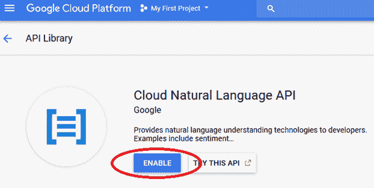
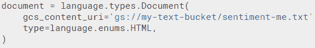

# Google 机器学习 API

如前一章所示，机器学习被广泛应用于各种应用中。然而，一些应用容易构建，而一些则非常难以构建，尤其是对于不太熟悉机器学习的用户。我们将在本章讨论的一些应用属于难以构建的类别，因为这些应用的机器学习模型构建过程数据密集、资源密集，并且需要该领域的大量知识。

在本章中，我们将介绍谷歌（截至 2018 年 3 月）提供的五个机器学习 API。这些 API 旨在作为 RESTful API 直接使用。对于以下提到的每个服务，我们将展示哪些类型的应用程序可以从中受益，以及如何解释返回的结果：

+   视觉具有标签检测、OCR、面部检测、情感、标志和地标

+   语音意味着语音转文本

+   NLP 有实体、情感和 POS

+   翻译

+   视频智能

# 视觉 API

视觉 API 允许我们构建许多与视觉相关的应用程序：

+   在图像中检测标签

+   在图像中检测文本

+   面部检测

+   情感检测

+   标志检测

+   地标检测

在我们深入构建应用程序之前，让我们快速了解它们可能如何构建，以面部情感检测为例。

情感检测的过程包括：

1.  收集大量图像

1.  使用图像中可能表示的情感人工标记图像

1.  训练一个**卷积神经网络**（**CNN**）（将在未来章节中讨论）来根据图像输入分类情感

虽然前述步骤资源消耗很大（因为我们需要很多人来收集和人工标记图像），但还有多种其他方式可以获得面部情感检测。我们不确定谷歌是如何收集和标记图像的，但我们现在将考虑谷歌为我们构建的 API，这样，如果我们想将图像分类为它们所代表的情感，我们可以利用该 API。

# 启用 API

在我们开始构建应用程序之前，我们首先必须启用 API，如下所示：

1.  搜索 Google Cloud Vision API：


1.  启用 Google Cloud Vision API：


1.  一旦点击 ENABLE，API 将为项目（即我的第一个项目）启用，如前一张截图所示。

1.  获取 API 凭据：


1.  点击创建凭据后点击服务帐户密钥：


1.  点击新建服务帐户：


1.  输入服务帐户名称（在我的情况下，`kish-gcp`）并选择项目所有者角色：


1.  点击创建以保存密钥的 JSON 文件。

# 打开实例

为了打开一个实例，点击 VM 实例，如下面的截图所示，然后点击激活 Google Cloud Shell 图标：


# 使用 Cloud Shell 创建实例

点击云壳图标后，我们创建了一个如下所示的实例：

1.  通过指定以下代码创建一个实例：

```py
datalab create --no-create-repository <instance name>
```

1.  在 Cloud Shell 中，前面的代码如下所示：


1.  一旦你为所有提示输入了响应，你需要将端口更改为`8081`以访问 Datalab，操作如下：


1.  点击更改端口后，你会看到一个如下所示的窗口。输入`8081`并点击“更改并预览”以打开 Datalab：


1.  这将打开 Datalab，它具有使我们能够编写所有类型命令的功能：`bash`、`bigquery`、`python`等等。

现在需求已经设置好，让我们获取/安装 API 的需求：

1.  在上一节中访问 API 密钥，我们已经下载了所需的密钥。现在，让我们通过点击上传按钮将`.json`文件上传到 Datalab：


1.  一旦`.json`文件上传，你应该能够从这里通过 Datalab 访问它：


1.  打开一个笔记本；你可以在 Datalab 中通过点击笔记本标签来打开一个笔记本，如下所示：


1.  要安装`google-cloud`，一旦你打开笔记本，将内核从 python2 更改为 python3：


1.  按照以下方式安装`google-cloud`包：

```py
%bash
pip install google-cloud
```

1.  一旦安装了`google-cloud`，确保之前上传的`.json`文件在当前 Python 环境中可访问，如下所示：

```py
import os
os.environ["GOOGLE_APPLICATION_CREDENTIALS"] = "/content/datalab/google-
api.json"
```

1.  为了上传感兴趣的画面，我们将查看从本地机器到存储桶，以及从存储桶到 Datalab 的文件传输。

1.  在 Google Cloud 中搜索`bucket`：


1.  现在，命名存储桶并创建它：


1.  点击上传**文件**将相关文件从本地机器上传到存储桶。


1.  一旦文件上传到存储桶，按照以下方式从 Datalab 获取它：


1.  现在，你应该注意到`11.jpg`在 Datalab 中可访问。

现在要分析的画面在 Datalab 中可访问，让我们了解如何利用 Cloud Vision API 更好地理解图像：

1.  导入相关包：

```py
from google.cloud import vision
```

前面的代码片段确保了 Vision 中可用的方法在当前会话中可访问。

1.  调用在客户端图像上执行 Google Cloud Vision API 检测任务（如人脸、地标、标志、标签和文本检测）的服务 - `ImageAnnotator`：

```py
client = vision.ImageAnnotatorClient()
```

1.  确认图像已按预期上传：

```py
import matplotlib.pyplot as plt
import matplotlib.image as mpimg
%matplotlib inline
img=mpimg.imread('/content/datalab/11.jpg')
plt.axis('off')
plt.imshow(img)
```


1.  调用`face_detection`方法以获取图像的相关详细信息，如下所示：

```py
response = client.face_detection({'source' : {'image_uri': "gs://kish-
bucket/11.jpg"},})
```

1.  图像注释的响应如下：


1.  现在我们已经运行了我们的方法来检测图像中的面部，让我们看看输出 - `response`。`response`的输出是一组属性，如前所述：

```py
response
```


以下是一些详细解释的额外点：

+   **边界多边形**：边界多边形围绕人脸。边界框的坐标以原始图像的比例为单位，如`ImageParams`中返回的。边界框是根据人类预期计算出来的，以框定人脸。它基于人脸标记器的结果。注意，如果图像中只出现部分人脸，则`BoundingPoly`中可能不会生成一个或多个*x*和/或*y*坐标（多边形将是不封闭的）。

+   **人脸检测边界多边形**：`fd_bounding_poly`边界多边形比`BoundingPoly`更紧密，仅包围人脸的皮肤部分。通常，它用于从任何检测图像中可见皮肤数量的图像分析中消除人脸。

+   **地标**：检测到的人脸关键点。

在以下要点中解释了几个更多术语：

+   `roll_angle`：翻滚角，表示人脸相对于图像的顺时针/逆时针旋转量。范围是[-180,180]。

+   `pan_angle`：偏航角，表示人脸相对于垂直于图像的平面的左/右角度。范围是[-180,180]。

+   `tilt_angle`：俯仰角，表示人脸相对于图像水平平面的向上/向下角度。范围是[-180,180]。

+   `detection_confidence`：与检测相关的置信度。

+   `landmarking_confidence`：与标记相关的置信度。

+   `joy_likelihood`：与快乐相关的似然性。

+   `sorrow_likelihood`：与悲伤相关的似然性。

+   `anger_likelihood`：与愤怒相关的似然性。

+   `surprise_likelihood`：与惊讶相关的似然性。

+   `under_exposed_likelihood`：与曝光相关的似然性。

+   `blurred_likelihood`：与模糊相关的似然性。

+   `headwear_likelihood`：与头部佩戴物相关的似然性。

人脸关键点将进一步提供眼睛、鼻子、嘴唇、耳朵等位置。

我们应该能够围绕识别出的人脸绘制一个边界框。

`face_annotations`的输出如下：


从前面的代码中，我们应该能够理解边框的坐标。在接下来的代码中，我们计算边框的起始点，以及边框的相应宽度和高度。一旦计算完成，我们就在原始图像上叠加矩形：

```py
import matplotlib.patches as patches
import numpy as np
fig,ax = plt.subplots(1)

# Display the image
ax.imshow(img)

# Create a Rectangle patch
x_width = np.abs(response.face_annotations[0].bounding_poly.vertices[1].x-
  response.face_annotations[0].bounding_poly.vertices[0].x)
y_height = np.abs(response.face_annotations[0].bounding_poly.vertices[1].y-
  response.face_annotations[0].bounding_poly.vertices[3].y)

rect =
 patches.Rectangle((response.face_annotations[0].bounding_poly.vertices[0].x,
 response.face_annotations[0].bounding_poly.vertices[0].y),
                         x_width,y_height,linewidth=5,edgecolor='y',facecolor='none')

# Add the patch to the Axes
ax.add_patch(rect)
plt.axis('off')
plt.show()
```

前述代码的输出是带有面部边框的图像，如下所示：


# 标签检测

在前面的代码片段中，我们使用了`face_detection`方法来获取各种坐标。

为了理解图像的标签，我们将使用`label_detection`方法代替`face_detection`，如下所示：

```py
response_label = client.label_detection({'source' : {'image_uri': "gs://kish-
bucket/11.jpg"},})
```


标签检测的输出是一系列标签，以及与每个标签相关的分数。

# 文本检测

可以通过使用`text_detection`方法来识别图像中的文本，如下所示：

```py
response_text = client.text_detection({'source' : {'image_uri': "gs://kish-
bucket/11.jpg"},})
```

`response_text`的输出如下：


注意，`text_detection`方法的输出是图像中存在的各种文本的边框。

此外，请注意，`text_annotations`的描述提供了图像中检测到的文本。

# 标志检测

视觉服务还使我们能够通过使用`logo_detection`方法来识别图像中的标志。

在下面的代码中，你可以看到我们能够通过传递图像位置的 URL 来检测`wikipedia`的标志，如下所示：

```py
response = client.logo_detection({'source' : {'image_uri':
"https://upload.wikimedia.org/wikipedia/commons/thumb/b/b3/Wikipedia-logo-v2-
en.svg/135px-Wikipedia-logo-v2-en.svg.png"},})
```

`logo_detection`方法的输出如下：


# 地标检测

注意，在前面的代码行中，我们在`logo_detection`方法中指定了图像位置的 URL，这导致了预测的标志描述，以及与其相关的置信度分数。

同样，任何位于图像中的地标都可以通过使用`landmark_detection`方法进行检测，如下所示：

```py
response = client.landmark_detection({'source' : {'image_uri': 
 "https://upload.wikimedia.org/wikipedia/commons/thumb/1/1d/
  Taj_Mahal_%28Edited%29.jpeg/250px-Taj_Mahal_%28Edited%29.jpeg"},})
```

`landmark_detection`方法的输出如下：


# 云翻译 API

云翻译 API 提供了一个简单、程序化的接口，用于将任意字符串翻译成任何支持的语言，使用最先进的神经机器翻译。翻译 API 响应速度快，因此网站和应用程序可以集成翻译 API，以实现从源语言到目标语言的快速、动态翻译（例如，从法语翻译成英语）。对于源语言未知的情况，也提供了语言检测功能。

# 启用 API

为了我们能够使用 Google 云翻译服务，我们需要启用，这可以通过以下步骤完成：

1.  为了启用 Google Cloud Translation API，在控制台中搜索该 API：


1.  启用 Google Cloud Translation API：


1.  一旦启用翻译 API，下一步就是创建访问 API 的凭证。然而，请注意，如果您已经为某个 API 创建了凭证，则它们可以用于任何其他 API。让我们继续使用 Cloud Shell 初始化我们的实例：


1.  一旦实例启动，我们将打开端口`8081`上的 Datalab。我们提供以下路径到`api-key`文件的位置：

```py
import os
os.environ["GOOGLE_APPLICATION_CREDENTIALS"] = "/content/datalab/google-api.json"
```

1.  使用以下语句导入`translate`的各种方法：

```py
from google.cloud import translate
```

1.  创建一个`client`对象，用于连接到云翻译服务，如下所示：

```py
client = translate.Client()
```

Google Cloud 翻译 API 有三个支持的方法，分别是`get_languages()`、`detect_language()`和`translate()`：

+   `client.get_languages()`方法为我们提供了一个所有可用语言的列表，以及它们的缩写符号，如下所示：


+   `client.detect_language()`方法检测文本所使用的语言：


注意，在上述方法中，我们提供了两个文本——一个是西班牙语，另一个是英语。上述输出表示文本的语言，以及与语言检测相关的置信度。

+   `client.translate()`方法检测源语言并将文本翻译成英语（默认），如下所示：


+   `client.translate()`方法还提供了指定需要翻译成哪种目标语言的选项，如下所示：


# 自然语言 API

Google Cloud 自然语言 API 通过提供易于使用的 REST API 中的强大机器学习模型来揭示文本的结构和含义。您可以使用它从文本文档、新闻文章或博客文章中提取有关人物、地点、事件等信息，还可以用它来了解社交媒体上对您产品的看法，或从呼叫中心或消息应用中的客户对话中解析意图。您还可以分析请求中上传的文本，或将其与 Google Cloud 存储上的文档存储集成。

您可以通过在控制台中搜索它来找到云自然语言 API，如下所示：


云自然语言 API 已在生成的页面中启用：



与翻译 API 类似，如果至少已启用了一个 API，则无需为该 API 创建凭证。

自然语言处理在提取与各种文本相关的情感方面可能很有用。

情感分析检查给定的文本，并识别文本中的主导情感意见，以确定作者的立场是积极、消极还是中立。情感分析是通过 `analyzeSentiment` 方法进行的。

在以下示例中，让我们了解如何识别语句的情感：

1.  导入相关包：

```py
from google.cloud import language
```

1.  初始化与语言服务对应的类：

```py
client = language.LanguageServiceClient()
```

Google 自然语言 API 有以下支持的方法：

+   `analyzeEntities`

+   `analyzeSentiment`

+   `analyzeEntitySentiment`

+   `annotateText`

+   `classifyText`

每个方法都使用 `Document` 来表示文本。以下示例中，让我们探索 `analyzeSentiment` 方法：

```py
text="this is a good text"
from google.cloud.language_v1 import types
document = types.Document(
        content=text,
        type='PLAIN_TEXT')
sentiment = client.analyze_sentiment(document).document_sentiment
sentiment.score
```

注意，我们已经将输入文本转换为 `Document` 类型，然后分析了文档的情感。

情感得分的输出反映了文本为正面的概率；得分越接近一，陈述就越积极。

类似地，可以传递一个 HTML 文件，如下所示：


存储在 Google Cloud 存储桶中的文件也可以通过将内容更改为 `gcs_content_uri` 来引用，如下所示：



`analyze_entities()` 方法在文本中找到命名实体（即专有名称）。此方法返回 `AnalyzeEntitiesResponse`：

```py
document = language.types.Document(content='Michelangelo Caravaggio, Italian    painter, is known for "The Calling of Saint Matthew".'
                                   ,type='PLAIN_TEXT') 
response = client.analyze_entities(document=document)

for entity in response.entities:
  print('name: {0}'.format(entity.name)) 
```

上述循环的输出是文档内容中存在的命名实体，如下所示：


我们还可以通过使用 `analyze_syntax` 方法提取给定文本中每个单词的词性，如下所示：

1.  将文档标记化成构成文本的相应单词：

```py
tokens = client.analyze_syntax(document).tokens
tokens[0].text.content
# The preceding output is u'Michelangelo'
```

1.  然后，可以提取 `token` 的词性，如下所示：

```py
pos_tag = ('UNKNOWN', 'ADJ', 'ADP', 'ADV', 'CONJ', 'DET', 'NOUN', 'NUM','PRON', 'PRT', 'PUNCT', 'VERB', 'X', 'AFFIX')
for token in tokens:print(u'{}: {}'.format(pos_tag[token.part_of_speech.tag],
                               token.text.content))
```

上述代码的输出如下：


注意，大多数单词都被正确地分类为词性。

# 语音转文本 API

Google Cloud Speech API 允许开发者通过应用易于使用的 API 中的强大神经网络模型将音频转换为文本。该 API 识别超过 110 种语言和变体。可以将用户对应用程序麦克风的语音指令转录成文本，通过语音实现命令和控制，或者转录音频文件，等等。

为了启用语音转文本 API，在控制台中搜索它，如下所示：


在生成的网页中，启用 API，如下所示：


与前几节中提到的 API 类似，为其中一个 API 获得的凭证可以复制用于其他 Google API。因此，我们不需要为语音转文本 API 分别创建凭证。

一旦启用 API，让我们启动 Cloud Shell 和 Datalab，就像前几节中做的那样。

在以下代码中，我们将一个小音频文件转录成文本：

1.  导入相关包和 API 密钥：

```py
from google.cloud import speech
import os
os.environ["GOOGLE_APPLICATION_CREDENTIALS"] = "/content/datalab/google-api.json"
from google.cloud.speech import enums
from google.cloud.speech import types
```

1.  按照以下步骤调用语音服务：

```py
client = speech.SpeechClient()
```

1.  按以下方式指定我们想要转换的音频：

```py
audio = types.RecognitionAudio(uri='gs://kish-bucket/how_are_you.flac')
```

注意**无损音频编解码器**（**FLAC**）。

可以使用位于[`audio.online-convert.com/convert-to-flac`](https://audio.online-convert.com/convert-to-flac)的转换器将音频文件（`.wav`）转换为`.flac`文件。

文件位于我们之前创建的存储桶中。我们指定音频配置，如下所示：

```py
config = types.RecognitionConfig(
encoding=enums.RecognitionConfig.AudioEncoding.FLAC,
sample_rate_hertz=16000,
language_code='en-US')
```

通过传递`audio`内容和指定的配置来获得响应：

```py
response = client.recognize(config, audio)
```

现在可以按照以下方式访问结果：

```py
for result in response.results: 
  print(result)
```

这的输出如下：


当输入音频文件是短（<1 分钟）持续时间音频时，`recognize`方法才会工作。

如果`音频`文件持续时间更长，则应使用`long_running_recognize`方法：

```py
operation = client.long_running_recognize(config, audio)
```

可以通过指定以下内容来访问`result`：

```py
response = operation.result(timeout=90)
```

最后，可以通过打印响应结果来获取转录和置信度，就像之前做的那样。

# 视频智能 API

云视频智能 API 通过使用易于使用的 REST API 提取元数据，使视频可搜索和可发现。现在，您可以搜索目录中每个视频文件的每一刻。它快速标注存储在 Google Cloud 存储中的视频，并帮助您识别视频中的关键实体（名词）及其出现时间。

可以按照以下方式搜索和启用云视频智能 API：


按以下方式导入所需的包并添加`api-key`的路径：

```py
from google.cloud import videointelligence
import os
os.environ["GOOGLE_APPLICATION_CREDENTIALS"] = "/content/datalab/google-api.json"
from google.cloud.speech import enums
from google.cloud.speech import types
```

`features`方法使我们能够指定我们想要在视频中检测的内容类型。可用的功能如下：


让我们继续检测我们感兴趣的视频中标签：

```py
features = [videointelligence.enums.Feature.LABEL_DETECTION]
```

按以下方式指定视频的`config`和上下文：

```py
mode = videointelligence.enums.LabelDetectionMode.SHOT_AND_FRAME_MODE
config = videointelligence.types.LabelDetectionConfig(
    label_detection_mode=mode)
context = videointelligence.types.VideoContext(
    label_detection_config=config)
```

然后，需要按照以下方式将视频从云存储传递过来：

```py
path="gs://kish-bucket/Hemanvi_video.mp4"
operation = video_client.annotate_video(
        path, features=features, video_context=context)
```

按以下方式访问`annotate_video`方法的输出：

```py
result = operation.result(timeout=90)
```

可以在以下级别获得视频的注释结果：

+   视频段级别

+   视频镜头级别

+   帧级别

在遍历每个不同段标签注释后，可以在以下方式获得段级别结果：

```py
segment_labels = result.annotation_results[0].segment_label_annotations
for i, segment_label in enumerate(segment_labels):
    print('Video label description: {}'.format(
        segment_label.entity.description))
    for category_entity in segment_label.category_entities:
        print('\tLabel category description: {}'.format(
            category_entity.description))

    for i, segment in enumerate(segment_label.segments):
        start_time = (segment.segment.start_time_offset.seconds +
                      segment.segment.start_time_offset.nanos / 1e9)
        end_time = (segment.segment.end_time_offset.seconds +
                    segment.segment.end_time_offset.nanos / 1e9)
        positions = '{}s to {}s'.format(start_time, end_time)
        confidence = segment.confidence
        print('\tSegment {}: {}'.format(i, positions))
        print('\tConfidence: {}'.format(confidence))
    print('\n')
```

上述代码的输出如下：


同样，可以按照以下方式获得镜头级别的结果：

```py
shot_labels = result.annotation_results[0].shot_label_annotations
for i, shot_label in enumerate(shot_labels):
    print('Shot label description: {}'.format(
        shot_label.entity.description))
    for category_entity in shot_label.category_entities:
        print('\tLabel category description: {}'.format(
            category_entity.description))

    for i, shot in enumerate(shot_label.segments):
        start_time = (shot.segment.start_time_offset.seconds +
                      shot.segment.start_time_offset.nanos / 1e9)
        end_time = (shot.segment.end_time_offset.seconds +
                    shot.segment.end_time_offset.nanos / 1e9)
        positions = '{}s to {}s'.format(start_time, end_time)
        confidence = shot.confidence
        print('\tSegment {}: {}'.format(i, positions))
        print('\tConfidence: {}'.format(confidence))
    print('\n')
```

上述代码行的输出如下：


最后，可以按照以下方式获得帧级别的结果：

```py
frame_labels = result.annotation_results[0].frame_label_annotations
for i, frame_label in enumerate(frame_labels):
    print('Frame label description: {}'.format(
        frame_label.entity.description))
    for category_entity in frame_label.category_entities:
        print('\tLabel category description: {}'.format(
            category_entity.description))

    # Each frame_label_annotation has many frames,
    # here we print information only about the first frame.
    frame = frame_label.frames[0]
    time_offset = (frame.time_offset.seconds +
                   frame.time_offset.nanos / 1e9)
    print('\tFirst frame time offset: {}s'.format(time_offset))
    print('\tFirst frame confidence: {}'.format(frame.confidence))
    print('\n')
```

上述代码行的输出如下：


# 摘要

在本章中，我们了解了谷歌提供的主要机器学习 API：视觉、翻译、自然语言处理、语音和视频智能。我们学习了每个 API 中的各种方法如何使我们能够复制深度学习结果，而无需从头编写代码。
