# 使用 Firebase 创建机器学习应用程序

在上一章中，我们学习了如何使用一些 Google 机器学习 API 来预测/分类事件。然而，我们在 Datalab 中完成了所有工作。在实际场景中，我们可能希望将机器学习 API 集成到我们构建的网络应用程序或移动应用程序中。在这种情况下，Firebase 非常有用。Firebase 是一个平台，允许我们构建无需服务器端编程的 Web 和移动应用程序。Firebase 提供了多个功能，确保开发者专注于构建应用程序，而后端由 Firebase 负责。Firebase 提供的一些功能包括：

+   实时数据库

+   文件存储

+   云函数

+   主机服务

+   性能监控

+   分析

+   身份验证

在本章中，我们将了解 Firebase 提供的各种功能。此外，为了了解 Firebase 如何帮助构建具有机器学习功能的应用程序，我们将构建一个网络应用程序和一个移动应用程序，该应用程序使用 Google 翻译 API 将任何给定语言的文本翻译成英语，并提供最常翻译的文本。

# Firebase 的功能

Firebase 提供的一些功能如下：

+   **实时数据库**：使我们能够在毫秒内存储和同步应用程序数据

+   **云 Firestore**：使我们能够在全球范围内存储和同步数据

+   **云函数**：使我们能够在不管理服务器的情况下运行后端代码

+   **主机服务**：以速度和安全交付网络应用程序资产

+   **性能监控**：帮助我们深入了解应用程序的性能

+   **崩溃分析**：使我们能够通过强大的实时崩溃报告来优先处理和修复问题

+   **身份验证**：帮助我们简单且安全地验证用户

+   **云存储**：使我们能够在 Google 规模上存储和提供文件

+   **预测**：使我们能够根据预测的行为定义动态用户组

+   **远程配置**：使我们能够在不部署新版本的情况下修改我们的应用程序

+   **应用索引**：使我们能够将搜索流量引导到移动应用程序

+   **云消息服务**：使我们能够发送有针对性的消息和通知

+   **动态链接**：使我们能够通过使用带有归因的深度链接来驱动增长

+   **邀请**：使我们能够通过使用带有归因的深度链接来驱动增长

在本章中，我们将构建一个应用程序，该应用程序可以将输入文本翻译成英语——首先是一个网络应用程序，然后是一个移动应用程序。

# 构建网络应用程序

为了构建网络应用程序，我们使用了 Node.js。

下载并安装 Node.js：

1.  `node.js`可以从以下链接下载：[`nodejs.org/en/`](https://nodejs.org/en/)。

    对于我们现在正在构建的版本，我们将在 Windows 64 位机器上使用 Node.js 的 8.11.1 LTS 版本。

1.  下载可执行文件 [`nodejs.org/dist/v8.11.1/node-v8.11.1-x64.msi`](https://nodejs.org/dist/v8.11.1/node-v8.11.1-x64.msi) 后，请确保使用默认参数安装 Node.js。

创建 Firebase 项目：

1.  可以通过登录 Firebase 控制台在这里创建 Firebase 项目：[`console.firebase.google.com`](https://console.firebase.google.com/)

1.  在控制台中，点击添加项目：

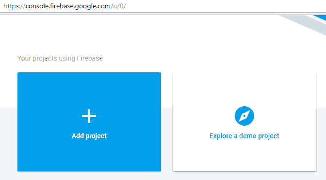

1.  输入项目名称（用红色突出显示）并获取项目 ID（用黑色突出显示），如下所示：

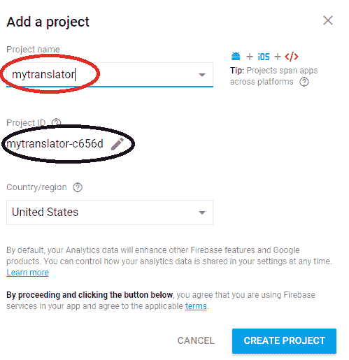

1.  使用 Node.js 包管理器安装 Firebase 工具，如下所示：

    +   将目录更改为需要存储 `firebase` 函数文件的文件夹。在以下屏幕截图中，我们在 `E` 驱动器中创建了一个名为 `firebase` 的文件夹：

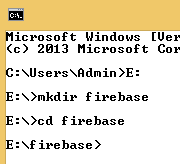

1.  我们使用以下代码片段安装 Firebase 工具：

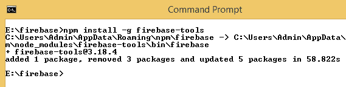

登录并初始化 Firebase：

1.  通过指定以下内容登录 Firebase：

```py
firebase login --reauth
```

1.  之前的代码片段将允许我们使用我们的凭据登录。请确保允许 Firebase CLI 访问您的 Google 账户。

1.  一旦我们登录到 Firebase，我们就可以如下初始化 `firebase`：

```py
firebase init
```

1.  你将看到以下屏幕：

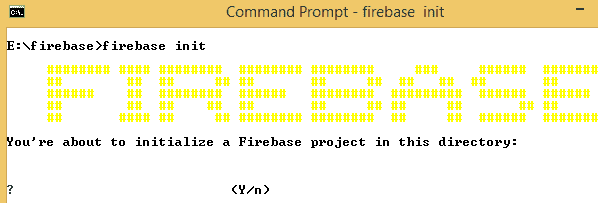

1.  按 *Y* 初始化 Firebase。

1.  通过按空格键选择当前应用程序所需的特性，选择完成后按 *Enter* 键：

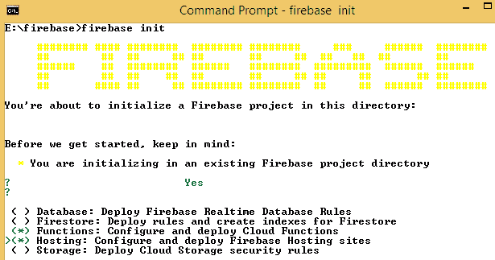

1.  选中后，对于我们这里使用的版本，让我们指定我们的函数使用 JavaScript 部署，如下所示：

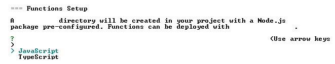

1.  选中后，我们使用项目目录设置项目：

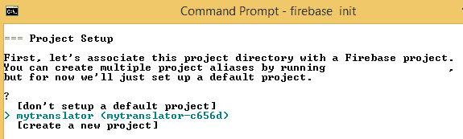

注意 `mytranslator` 是我们在 *步骤 2* 中创建的项目。还请注意，一旦我们初始化了 Firebase，文件夹结构如下所示：

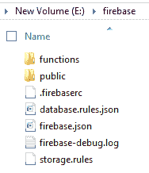

1.  在命令提示符中，初始化 Firebase 后按 *Enter* 键以获取各种提示。初始化完成后，你应该会收到以下确认信息：

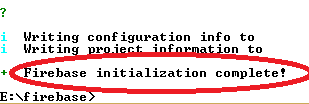

在滚动到 `functions` 文件夹后，使用 Node.js 包管理器安装 Google Translate：

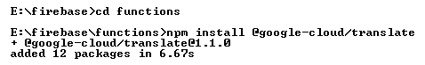

我们指定了我们用例所需的所有功能（公共 API 方法）。这些函数处理所有服务器编程：

1.  为了指定这些，让我们用以下代码片段覆盖 `functions` 文件夹中现有的 `index.js` 文件。

```py
const functions = require('firebase-functions');
const Translate = require('@google-cloud/translate');
const admin = require("firebase-admin")

//setting connection to db
admin.initializeApp();

const translate = new Translate({
    projectId: 'mytranslator-c656d'
});
//Extract the most searched term

exports.getMessageStats=functions.https.onRequest((req,res) =>
 {
 var output;
 var db = admin.database();
 var ref = db.ref("/translateMessageStats");

// Attach an asynchronous callback to read the data at our posts reference
 ref.orderByChild("count").limitToLast(1).on("value", function(snapshot) {

console.log(snapshot.forEach(element => {
 output=element.key+" : "+element.val().count + 'times'
 }))
 res.header("Access-Control-Allow-Origin", "*");
 return res.send(JSON.stringify(output));
 }, function (errorObject) {
 console.log("The read failed: " + errorObject.code);
 });
})

// create a public API method of name "translateMessage"

exports.translateMessage=functions.https.onRequest((req,res) =>
 {
 const input = req.query.text;

translate.translate(input,'en').then(results =>
 {
 const output = results[0];
 console.log(output);

const db = admin.database();
var ref = db.ref("/translateMessageStats");

//update database
 var dataRef= ref.child(input);

dataRef.once('value', function(snapshot) {
 if (snapshot.exists()) {
 dataRef.update({"count":snapshot.val().count+1});
 console.log("data exists")
 }
 else
 {
 console.log("data does not exist")
 dataRef.update({"count":1});
 }
 });

res.header("Access-Control-Allow-Origin", "*");
 return res.send(JSON.stringify(output));
 })
});
```

1.  在此代码中，我们通过以下代码导入所需的 Node.js 包：

```py
const functions = require('firebase-functions');
const Translate = require('@google-cloud/translate');
const admin = require("firebase-admin")
```

1.  我们通过指定以下内容初始化与数据库的连接：

```py
admin.initializeApp();
```

1.  我们创建`translate`对象，并将项目 ID 作为参数传递给它，如下所示：

```py
const translate = new Translate({
    projectId: 'mytranslator-c656d'
});
```

1.  然后，我们创建一个名为`translateMessage`的公开 API，如下所示：

```py
exports.translateMessage=functions.https.onRequest((req,res) =>
```

1.  用户输入通过以下行获取：

```py
const input = req.query.text;
```

1.  输入文本的翻译和相应存储在输出中的翻译文本是通过此代码完成的：

```py
translate.translate(input,'en').then(results =>
{
    const output = results[0];
```

1.  我们创建一个数据库实例，如下所示：

```py
const db = admin.database();
 var ref = db.ref("/translateMessageStats");
```

1.  输入在数据库中更新：

```py
var dataRef= ref.child(input);
```

1.  如果给出新的输入，则`count`初始化为`1`；否则，`count`增加`1`：

```py
dataRef.once('value', function(snapshot) {
    if (snapshot.exists()) {
        dataRef.update({"count":snapshot.val().count+1});
        console.log("data exists")
    }
    else
    {
        console.log("data does not exist")
        dataRef.update({"count":1});
    }
  });
```

启用**Google Cloud Translation API**，如下所示：

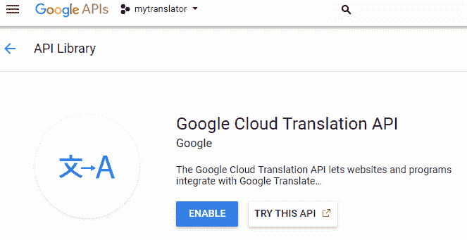

部署`firebase`函数：

1.  我们可以按照以下截图所示部署`firebase`函数：

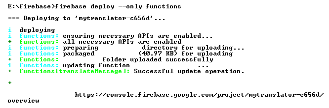

1.  函数部署后，检查项目概述的开发部分中的函数：

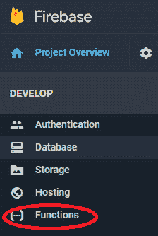

1.  点击函数后，我们应该能够看到一个包含我们刚刚创建的函数`translateMessage`的仪表板：

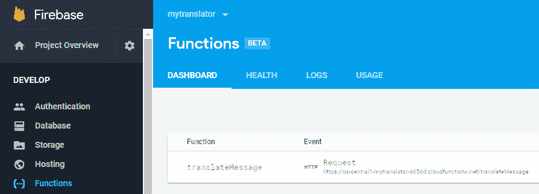

注意，前面的事件为我们提供了一个 URL，使用该 URL 我们应该能够翻译输入文本，如下所示：

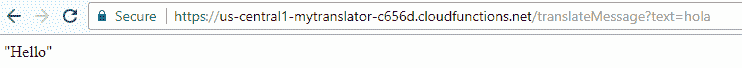

注意 URL 中`?text=`的使用，这是输入。

如果执行过程中出现问题，我们应该能够在函数仪表板的日志标签中理解它们。

此外，我们搜索过的所有输入都存储在数据库中：

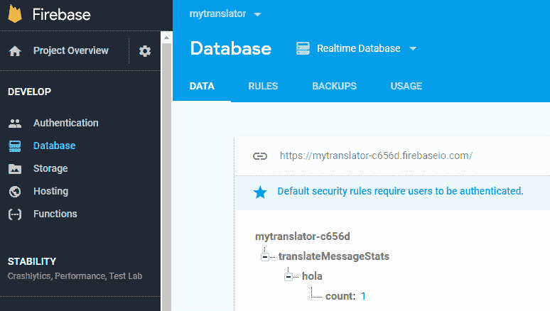

注意，计数值初始化为搜索术语`hola`。

将`public`文件夹中的`index.html`文件的内容替换为以下代码片段。以下代码片段的输出将创建一个文本框，允许我们输入文本，翻译文本，并生成翻译后的输出。

1.  在您的执行中，将项目 ID `mytranslator-c656d`替换为您自己的项目 ID：

```py
<html>
  <script src="img/jquery.min.js">  </script>
  <script>

    $(document).ready(
      getMessageStats()
    );
<!-- The following code extracts the most searched term from the database that we create in the next function -->

    function getMessageStats(){
      var xhr = new XMLHttpRequest();
      xhr.open('GET', "https://us-central1-mytranslator-c656d.cloudfunctions.net/getMessageStats", true);
      xhr.send();

      xhr.onreadystatechange = processRequest;

      function processRequest(e) {
        if (xhr.readyState == 4) {
          var response = JSON.parse(xhr.responseText);
          document.getElementById("mostSearched").innerHTML=response;
        }
      }
    }
<!-- the following function translates the input value into english -->
    function translateText()
    {
      var textInput= document.getElementById("input").value;
      var xhr = new XMLHttpRequest();
      xhr.open('GET', "https://us-central1-mytranslator-c656d.cloudfunctions.net/translateMessage?text="+textInput, true);
      xhr.send();

      xhr.onreadystatechange = processRequest;
      function processRequest(e) {

        if (xhr.readyState == 4) {
          var response = JSON.parse(xhr.responseText);
          document.getElementById("output").innerHTML=response;
          getMessageStats();
        }
      }
    }
  </script>
<!-- the following code creates the layout of web application, with input text box and output-->
  <body>
    <label>Enter Input Text</label>
    <input id="input" type="text-area"></input>
    <button onclick="translateText()" id="btnTrans">Translate</button>
    <label id="output"></label>
    <br/>
    <div>
      <h1>Most Searched element</h1>
      <label id="mostSearched"></label>
    </div>
  </body>
</html>
```

我们部署 Firebase，以便上传指定最终 URL 结构的 HTML 文件：

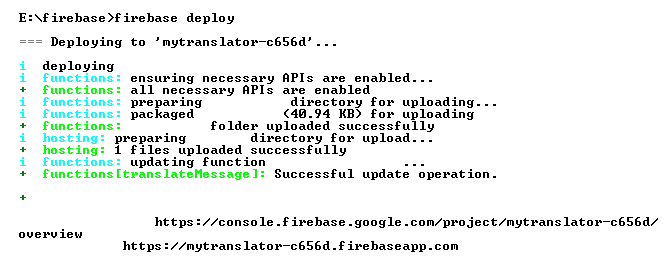

现在，我们应该能够访问显示的链接，这有助于我们翻译文本，如下所示：

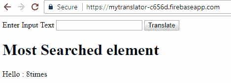

从这个例子中，我们看到我们能够创建一个翻译任何给定输入文本的 Web 应用程序。请注意，Web 应用程序使用了函数创建的 API 端点，而前端代码将根据我们使用的框架而有所不同——当我们使用 Angular 而不是 HTML 时，它可能会有所不同，但服务器端代码将保持不变。

# 构建移动应用程序

在上一节中，我们了解了将为我们翻译输入的 HTML 页面的前端。在本节中，我们将构建利用我们为函数生成的端点返回翻译文本的 Android 应用程序的前端。

我们创建应用的布局如下：

```py
<?xml version="1.0" encoding="utf-8"?>
 <android.support.constraint.ConstraintLayout 

     android:layout_width="match_parent"
     android:layout_height="match_parent"
     tools:context=".MainActivity">

     <Button
         android:id="@+id/button"
         android:layout_width="wrap_content"
         android:layout_height="wrap_content"
         android:layout_marginStart="148dp"
         android:layout_marginTop="56dp"
         android:text="Translate"
         app:layout_constraintStart_toStartOf="parent"
         app:layout_constraintTop_toBottomOf="@+id/input" />

     <EditText
         android:id="@+id/input"
         android:layout_width="wrap_content"
         android:layout_height="wrap_content"
         android:layout_marginStart="84dp"
         android:layout_marginTop="84dp"
         android:ems="10"
         android:inputType="textPersonName"
         app:layout_constraintStart_toStartOf="parent"
         app:layout_constraintTop_toTopOf="parent" />

     <TextView
         android:id="@+id/out"
         android:layout_width="197dp"
         android:layout_height="80dp"
         android:layout_marginStart="92dp"
         android:layout_marginTop="56dp"
         app:layout_constraintStart_toStartOf="parent"
         app:layout_constraintTop_toBottomOf="@+id/button" />

 </android.support.constraint.ConstraintLayout>
```

前面的代码会输出应用的布局：

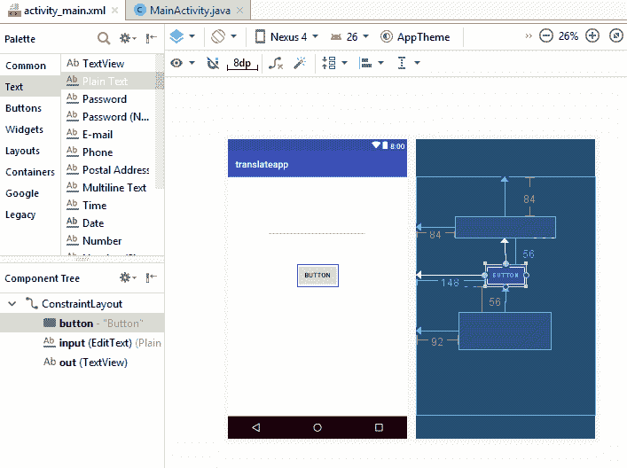

注意，我们有一个用于接收输入的 EditText 视图。

按钮用于执行翻译，而 out 是用于显示输出的 TextView。

此外，请注意，在前面的代码中，我们确保了组件对齐到屏幕。

在主活动（main activity）中，我们执行以下代码：

```py
package com.example.admin.translateapp;

 import android.os.AsyncTask;
 import android.support.v7.app.AppCompatActivity;
 import android.os.Bundle;
 import android.view.View;
 import android.widget.Button;
 import android.widget.EditText;
 import android.widget.TextView;

 import java.io.BufferedReader;
 import java.io.IOException;
 import java.io.InputStreamReader;
 import java.net.HttpURLConnection;
 import java.net.URL;

 import javax.net.ssl.HttpsURLConnection;

 public class MainActivity extends AppCompatActivity {
     public String myurl;
     public String result;
     public String response;
     public EditText inp;
     public TextView out;
     public Button btn;

     @Override
     protected void onCreate(Bundle savedInstanceState) {
         super.onCreate(savedInstanceState);
         setContentView(R.layout.activity_main);
         inp = (EditText) findViewById(R.id.input);
         out = (TextView) findViewById(R.id.out);
         btn = (Button) findViewById(R.id.button);
         myurl = "http://us-central1-mytranslator-c656d.cloudfunctions.net/translateMessage?text=";

         btn.setOnClickListener(new View.OnClickListener() {
             public void onClick(View v) {
                 RequestTask task = new RequestTask();
                 task.execute(inp.getText().toString());
             }
         });
     }

     private class RequestTask extends AsyncTask<String, String, String> {

         @Override
         protected String doInBackground(String... uri) {
             try {
                 URL url = new URL(myurl+uri[0].toString());
                 HttpURLConnection conn = (HttpURLConnection) url.openConnection();
                 conn.setRequestMethod("GET");
                 conn.connect();
                 if (conn.getResponseCode() == HttpURLConnection.HTTP_OK) {
                     InputStreamReader streamReader = new
                             InputStreamReader(conn.getInputStream());
                     //Create a new buffered reader and String Builder
                     BufferedReader reader = new BufferedReader(streamReader);
                     StringBuilder stringBuilder = new StringBuilder();
                     //Check if the line we are reading is not null
                     String inputLine;
                     while((inputLine = reader.readLine()) != null){
                         stringBuilder.append(inputLine);
                     }
                     //Close our InputStream and Buffered reader
                     reader.close();
                     streamReader.close();
                     //Set our result equal to our stringBuilder
                     result = stringBuilder.toString();
                     //result = conn.getResponseMessage();
                 } else {
                 }
             } catch (IOException e) {
                 //TODO Handle problems..
             }
             return result;
         }

         @Override
         protected void onPostExecute(String result1) {
             super.onPostExecute(result1);
             out.setText(result1); }
     }
 }
```

让我们理解前面的代码。

导入相关包：

```py
import android.os.AsyncTask;
 import android.support.v7.app.AppCompatActivity;
 import android.os.Bundle;
 import android.view.View;
 import android.widget.Button;
 import android.widget.EditText;
 import android.widget.TextView;

 import java.io.BufferedReader;
 import java.io.IOException;
 import java.io.InputStreamReader;
 import java.net.HttpURLConnection;
 import java.net.URL;
```

初始化我们在`MainActivity`类中使用的对象：

```py
public String myurl;
 public String result;
 public String response;
 public EditText inp;
 public TextView out;
 public Button btn;
```

此外，使用以下代码初始化视图：

```py
inp = (EditText) findViewById(R.id.*input*);
 out = (TextView) findViewById(R.id.*out*);
 btn = (Button) findViewById(R.id.*button*);
```

设置点击监听器：

```py
btn.setOnClickListener(new View.OnClickListener() {
     public void onClick(View v) {
         RequestTask task = new RequestTask();
         task.execute(inp.getText().toString());
```

指定点击按钮时需要执行的任务：

```py
URL url = new URL(myurl+uri[0].toString());
 HttpURLConnection conn = (HttpURLConnection) url.openConnection();
 conn.setRequestMethod("GET");
 conn.connect();
 if (conn.getResponseCode() == HttpURLConnection.*HTTP_OK*) {
     InputStreamReader streamReader = new
             InputStreamReader(conn.getInputStream());
     //Create a new buffered reader and String Builder
     BufferedReader reader = new BufferedReader(streamReader);
     StringBuilder stringBuilder = new StringBuilder();
     //Check if the line we are reading is not null
     String inputLine;
     while((inputLine = reader.readLine()) != null){
         stringBuilder.append(inputLine);
     }
     //Close our InputStream and Buffered reader
     reader.close();
     streamReader.close();
     //Set our result equal to our stringBuilder
     result = stringBuilder.toString();
```

从前面的代码中，URL 被评估为我们在之前网络应用部分看到的 URL。

前面代码的输出如下：

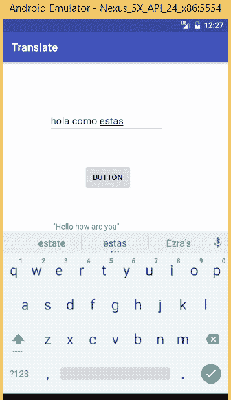

注意，点击按钮时，我们应该能够翻译我们的文本。

# 概述

在本章中，我们了解了 Firebase 的各种功能，并使用`firebase`函数构建网络和移动应用的底层。我们还使用`firebase`函数实时更新数据库，并从数据库中检索历史上搜索最多的术语。
