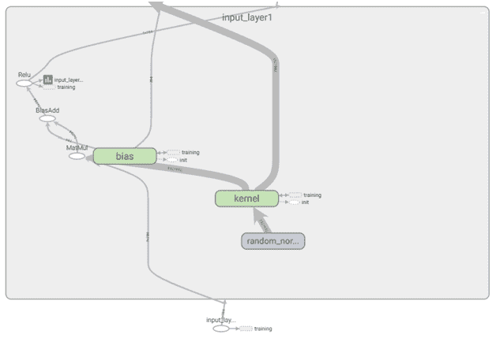

# 使用 TensorBoard 评估结果

在上一章中，我们了解了神经网络的工作原理，神经网络中的各种超参数是什么，以及如何进一步调整它们以提高我们模型的准确性。

Google 提供了 TensorBoard，它是模型训练日志的可视化。在本章中，我们展示了如何使用 TensorBoard 进行 TensorFlow 和 Keras。我们解释 TensorBoard 生成的可视化，以了解我们模型的性能，并了解 TensorBoard 中的其他功能，这些功能可以帮助我们更好地可视化数据集。

如前一章所述，Keras 作为一个框架，是 TensorFlow 或 Theano 之上的包装器。你将使用 TensorFlow 进行的一些计算，例如训练一个大规模的深度神经网络，可能很复杂且令人困惑。为了使其更容易理解、调试和优化 TensorFlow 程序，TensorFlow 的创建者包括了一套名为 TensorBoard 的可视化工具。

你可以使用 TensorBoard 来可视化你的 TensorFlow 图，绘制关于图执行的定量指标，还可以看到输入的图像等额外数据。当 TensorBoard 完全配置后，它看起来像这样：


从这张截图，你可以注意到图表显示了随着 epoch 数量的增加，平均交叉熵误差的减少。在章节的后续部分，我们将介绍以下内容：

+   安装 TensorBoard

+   TensorBoard 捕获的各种总结操作的概述

+   调试代码的方法

# 设置 TensorBoard

在上一章中，我们了解了如何设置 Datalab。在 Datalab 中安装 TensorBoard 与指定以下代码一样简单：


注意，我们不需要为 TensorBoard 进行任何单独的安装，它包含在`google.datalab.ml`包中预构建的。

一旦导入包，我们需要通过指定包含模型拟合过程写入的总结的日志位置来启动 TensorBoard。

`tb.start`方法的工作原理如下：


注意，在第一步中，它检查用户是否有权执行计算。接下来，它选择一个未使用的端口来打开 TensorBoard，最后它启动 TensorBoard 并打印打开 TensorBoard 的链接。

我们将在下一节中学习更多关于写入日志的内容。

# 总结操作的概述

总结提供了一种导出关于模型压缩信息的方法，然后可以在 TensorBoard 等工具中访问。

一些常用的总结函数包括：

+   `标量`

+   `直方图`

+   `音频`

+   `图像`

+   `合并`

+   `merge_all`

一个`标量`总结操作返回一个标量，即随着 epoch 数量的增加，某个度量值的值。

`histogram` 汇总操作返回各种值的直方图——可能是每一层的权重和偏差。

`image` 和 `audio` 汇总操作返回图像和音频，可以在 TensorBoard 中分别进行可视化和播放。

`merge` 操作返回所有输入汇总值的并集，而 `merge_all` 返回模型规范中包含的所有汇总的并集。

下一个部分将提供一些讨论的汇总的可视化。

# 调试代码的方法

为了理解 TensorBoard 如何帮助，让我们初始化一个如下所示的模式结构，一个注定不会工作的结构：


注意，在这段代码片段中，验证准确率仅为约 19%。

验证准确率如此低的原因是输入数据集未进行缩放，并且我们在未缩放的数据集上执行了 ReLU 激活。

注意，在前面的代码中，我们将在目录 `logs/tensor_new6` 中存储模型运行的日志（子目录可以命名为任何名称）。

一旦日志存储在这个位置，我们就可以按照以下步骤启动 TensorBoard：


前面的代码启动了 TensorBoard，其外观如下：


注意，默认情况下，输出给出标量的度量，即训练和测试数据集的准确率和损失值。

可以使用正则表达式 `.*` 在 `Filter` 标签中相邻可视化输出，如下所示：


注意，这张截图中的前两个图表表示训练数据集的准确率和损失，而接下来的两个图表表示验证数据集的准确率和损失。

当我们查看各个层的权重和偏差的直方图时，我们了解到权重和偏差在各个时期没有变化：


这表明网络架构中没有发生学习。

当我们在不同的标签页查看权重和偏差在各个时期的分布时，也可以注意到相同的情况：


从这张截图，我们可以得出模型准确率如此低的原因；这是因为模型无法更新权重。

现在，通过点击“GRAPHS”标签，让我们探索模型是否初始化正确：


你应该注意到训练块连接到图中的每个其他块。这是因为，为了计算梯度，需要连接到图中的每个变量（因为每个变量都包含需要调整的权重）。

现在，让我们从图中删除训练块。这可以通过如下方式右键单击训练块来完成：


移除训练块后的结果图如下：


注意，输入层连接到隐藏层，隐藏层又连接到输出层，从输出层计算指标和损失。让我们通过双击各个块来探索这些连接，如下所示：



放大这些连接有助于我们理解各个块中的形状：


输入层在维度上是（784），因为可能有任意数量的输入样本，但每个样本都是 784 维的。同样，内核（权重矩阵）是 784 x 784 维的，偏差将有 784 个初始化值，依此类推。

注意，在上面的图中，我们使用输入层的值并使用`random_normal`初始化的内核进行矩阵乘法。同时注意，`random_normal`初始化与训练块没有连接，而内核块与训练块相连。

让我们也找出输出层是否按照预期连接到所有相关块。鉴于图看起来非常复杂，我们可以使用 TensorBoard 提供的另一个功能：跟踪输入。跟踪输入有助于突出显示仅与任何感兴趣的块相连的块。通过在左侧面板中选择感兴趣的块并切换开关来激活，如下所示：


现在所有连接看起来都很好，但梯度仍然没有得到更新；让我们将激活函数更改为 sigmoid，然后检查权重直方图：

我们以下面的方式构建一个具有 sigmoid 激活的神经网络：


一旦定义并编译了神经网络结构，让我们按照以下步骤拟合模型：


为了打开 TensorBoard，我们将执行以下代码：

```py
from google.datalab.ml import TensorBoard as tb
tb.start('./logs/tensor_neww3')
```

我们将收到以下输出：


同时，我们应该注意到准确率和损失指标有了相当大的改进：


也可以通过在 TensorBoard 函数中指定 write_grads=True 来可视化梯度的直方图。输出将如下所示：


# 从 TensorFlow 设置 TensorBoard

在上一章中，我们了解到在 TensorFlow 中定义模型有两种方式：

+   预制评估器

+   构建自定义评估器

在以下代码中，我们将考虑一个额外的代码片段，它将使我们能够可视化各种摘要操作：


注意，我们只需要在预制的估计器中指定 `model_dir` 来存储由 TensorFlow 操作生成的各种日志文件。

然后，可以通过引用模型目录来初始化 TensorBoard，如下所示：


上述代码将导致 TensorBoard 可视化，其中将包含所有内置的摘要。

# 自定义估计器的摘要

在上一节中，我们探讨了在 TensorBoard 中从预制的估计器获取预定义摘要的方法。在本节中，我们将了解如何在自定义估计器中获取摘要，以便它们可以在 TensorBoard 中进行可视化。

需要捕获的摘要操作应在自定义估计器函数中指定，如下所示：


注意，模型函数与我们之前在了解自定义估计器时定义的非常相似；然而，添加了一些将摘要写入日志文件的代码行。

`tf.summary.scalar` 添加了准确度指标。同样，我们可能还想将损失（另一个标量）添加到日志中；然而，它默认添加（注意，当训练模型时损失会被显示）。

`tf.summary.histogram` 提供了网络中权重的分布。

一旦模型训练完成，我们应该注意 TensorBoard 输出中的标量和直方图/分布。训练模型并启动 TensorBoard 的代码如下：


在上述代码片段中，我们指定了模型函数和参数以及日志文件将被写入的目录：

```py
model.train(input_fn=train_input_fn, steps=1000)
```

上述代码片段训练了包含 1,024（批大小）数据点的 1,000 批次的模型：

```py
from google.datalab.ml import TensorBoard as tb
tb.start('/content/datalab/docs/log10/')
```

此代码片段通过使用给定文件夹中编写的日志文件启动 TensorBoard。

# 摘要

在本章中，我们了解了在 TensorBoard 中可视化神经网络模型的方法，包括从 Keras 和 TensorFlow 中进行可视化。我们还考虑了如何在预制的估计器和自定义定义的估计器中可视化模型、权重分布以及损失/准确度指标。以及神经网络中的各种指标。
