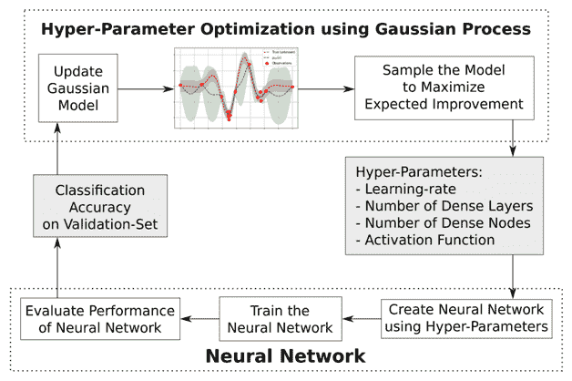
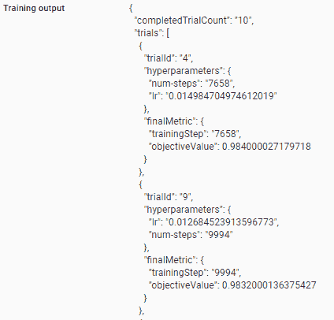

# 第十一章：通过超参数调整优化模型

神经网络包含多个参数，这些参数可以影响预测事件或标签的最终准确度。典型的参数包括：

+   训练时使用的批量大小

+   周期数量

+   学习率

+   隐藏层数量

+   每个隐藏层中的隐藏单元数量

+   隐藏层中应用的激活函数

+   使用的优化器

从前面的列表中，我们可以看到可以调整的参数数量非常高。这使得找到最佳的超参数组合具有挑战性。在这种情况下，Cloud ML Engine 提供的超参数调整服务非常有用。

在本章中，我们将介绍：

+   为什么需要超参数调整

+   超参数调整工作概述

+   在云端实现超参数调整

# 超参数调整的直觉

为了获得超参数调整的实用直觉，让我们通过以下场景来预测给定神经网络架构在 MNIST 数据集上的准确率：

+   **场景 1**：大量周期和低学习率

+   **场景 2**：少量周期和高的学习率

让我们在 Google Cloud 环境中创建训练集和测试集，如下所示：

1.  下载数据集：

```py
mkdir data
curl -O https://s3.amazonaws.com/img-datasets/mnist.pkl.gz
gzip -d mnist.pkl.gz
mv mnist.pkl data/          
```

前面的代码创建了一个名为 `data` 的新文件夹，下载了 MNIST 数据集，并将其移动到 `data` 文件夹中。

1.  在终端中打开 Python 并导入所需的包：

```py
from __future__ import print_function 
import tensorflow as tf
import pickle # for handling the new data source
import numpy as np
from datetime import datetime # for filename conventions
from tensorflow.python.lib.io import file_io # for better file I/O
import sys
```

1.  导入 MNIST 数据集：

```py
f = file_io.FileIO('data/mnist.pkl', mode='r')
data = pickle.load(f)
```

1.  提取训练集和测试集：

```py
(x_train, y_train), (x_test, y_test) = data
# Converting the data from a 28 x 28 shape to 784 columns
x_train = x_train.reshape(60000, 784)
x_train = x_train.astype('float32')
# Scaling the train dataset
x_train /= 255
# Reshaping the test dataset
x_test = x_test.reshape(10000, 784)
x_test = x_test.astype('float32')
# Scaling the test dataset
x_test /= 255
# Specifying the type of labels
y_train = y_train.astype(np.int32)
y_test = y_test.astype(np.int32)
```

1.  创建估算函数：

```py
# Creating the estimator input functions for train and test datasets 
train_input_fn = tf.estimator.inputs.numpy_input_fn(
 x={"x2": np.array(x_train)},
 y=np.array(y_train),
 num_epochs=None,
 batch_size=1024,
 shuffle=True)
test_input_fn = tf.estimator.inputs.numpy_input_fn(
 x={"x2": np.array(x_test)},
 y=np.array(y_test),
 num_epochs=1,
 shuffle=False)
```

1.  指定列的类型：

```py
feature_x = tf.feature_column.numeric_column("x2", shape=(784))
feature_columns = [feature_x]
```

1.  使用场景 1 中的参数构建 DNN 分类器；即学习率为 `0.1`，步数为 `200`：

```py
num_hidden_units = [1000]
lr=0.1
num_steps=200
# Building the estimator using DNN classifier
# This is where the learning rate hyper parameter is passed
model = tf.estimator.DNNClassifier(feature_columns=feature_columns,
                 hidden_units=num_hidden_units,
                 activation_fn=tf.nn.relu,
                 n_classes=10,
                 optimizer=tf.train.AdagradOptimizer(learning_rate = lr))
model.train(input_fn=train_input_fn, steps=num_steps) 
# Fetching the model results
result = model.evaluate(input_fn=test_input_fn)
print('Test loss:', result['average_loss'])
print('Test accuracy:', result['accuracy'])
```

在这种情况下，测试准确率达到 96.49%。

在场景 2 中，我们将使用不同的参数构建另一个 DNN 分类器；现在学习率为 `0.01`，步数为 `2000`：

```py
num_hidden_units = [1000]
lr=0.01
num_steps=2000
# Building the estimator using DNN classifier
# This is where the learning rate hyper parameter is passed
model = tf.estimator.DNNClassifier(feature_columns=feature_columns,
 hidden_units=num_hidden_units,
 activation_fn=tf.nn.relu,
 n_classes=10,
 optimizer=tf.train.AdagradOptimizer(learning_rate = lr))
model.train(input_fn=train_input_fn, steps=num_steps) 
# Fetching the model results
result = model.evaluate(input_fn=test_input_fn)
print('Test loss:', result['average_loss'])
print('Test accuracy:', result['accuracy']) 
```

场景 2 中测试集上的准确率接近 98.2%。

前面的两个场景表明了不同超参数值如何影响最终结果的重要性。

在这种情况下，Google Cloud ML 引擎非常有用，我们可以更智能地选择更优的超参数集。

# 超参数调整概述

超参数调整通过在一个训练作业中运行多个试验来实现。每个试验是您训练应用程序的完整执行，其中选择的超参数值在您指定的范围内设置。Cloud ML Engine 训练服务会跟踪每个试验的结果，并为后续试验进行调整。作业完成后，您可以获取所有试验的摘要，以及根据您指定的标准确定的最有效配置值。

我们希望选择那些能给出最佳性能的超参数。这相当于一个优化问题，具体来说，是优化一个函数 *f(x)*（即性能作为超参数值的函数）在紧致集 *A* 上的问题。我们可以用数学公式表示为：


让我们以函数 *(1-x)^(ex)* 为例，它在 *x = 0* 处达到最大值 *f(x) = 1*，因此 *arg max* 是 *0*。

许多优化设置，如这个例子，假设目标函数 *f(x)* 有已知的数学形式，是凸的，或者容易评估。但这些特征不适用于寻找超参数的问题，其中函数是未知的且难以评估。这就是贝叶斯优化发挥作用的地方。

为了实现超参数调整，Google 使用了一种称为**高斯过程探险家**的算法，这是一种贝叶斯优化的形式。

当函数的数学形式未知或计算成本高昂时，贝叶斯优化是一种极其强大的技术。其背后的主要思想是基于数据（使用著名的贝叶斯定理）计算目标函数的后验分布，然后根据这个分布选择好的点进行尝试。

要使用贝叶斯优化，我们需要一种灵活地建模目标函数分布的方法。这比建模实数分布要复杂一些，因为我们需要一个这样的分布来表示我们对每个 *x* 的 *f(x)* 的信念。如果 *x* 包含连续超参数，那么将会有无限多个 *x* 需要建模 *f(x)*，即为其构建一个分布。对于这个问题，高斯过程是一种特别优雅的技术。实际上，它们推广了多维高斯分布，并且确实存在足够灵活以建模任何目标函数的版本。

上述过程通常如以下图所示：



我们通过迭代的结果更新高斯模型，这有助于进一步确定要测试的正确下一组超参数集；结果进一步提高了我们的高斯模型，以识别要选择正确的超参数集。

高斯分布的细节超出了本书的范围，但为了这个练习，我们将采用 Google 的方法（作为一个黑盒）并使用 Google Cloud 实现超参数调整。

# Google Cloud 中的超参数调整

为了让刚刚设置的高斯过程运行，我们必须允许我们的模型构建在 Google Cloud 上运行，以便进行超参数调整。

为了运行超参数调整，以下组件是必不可少的：

+   数据文件及其位置

+   模型文件

+   超参数配置文件

+   设置文件

+   `__init__` 文件

由于我们正在 Google Cloud ML 引擎上运行模型，数据应位于云存储桶中，以便 ML 引擎可以访问。

这可以通过在云壳中执行以下操作来完成：

```py
gsutil mb gs://my-mnist-bucket
gsutil cp -r data/mnist.pkl gs://my-mnist-bucket/data/mnist.pkl
```

注意，使用前面的步骤，我们已经创建了一个名为`my-mnist-bucket`的存储桶，并将我们的数据复制到该存储桶中。前面的代码应该会在该目录中创建一个名为`data`的目录和该目录中的`mnist.pkl`文件：


# 模型文件

模型文件应位于包含`__init__.py`文件的文件夹中。

让我们创建一个名为`trainer`的文件夹，其中包含模型文件和`__init__`文件：

```py
mkdir trainer
cd trainer
```

之前的代码创建了`trainer`文件夹并将目录更改为新创建的文件夹。

让我们继续创建模型文件，如下所示：

```py
vim mnist_mlp_lr_numsteps.py
```

将以下代码插入到之前创建的文件中：

```py
from __future__ import print_function

import argparse
import pickle 
from datetime import datetime 
import numpy as np
from tensorflow.python.lib.io import file_io # for better file I/O
import sys
import tensorflow as tf

def train_model(train_file='data/mnist.pkl',job_dir='./tmp/mnist_mlp', num_steps = 1, lr=0.1, **args):
  # logs_path gives access to the logs that are generated by the previous epochs of model
  logs_path = job_dir + '/logs/' + str(datetime.now().isoformat())
  print('Using logs_path located at {}'.format(logs_path))
  # by default floats are considered as string
  # Good idea to convert them back into floats
  lr=float(lr)
  num_steps=float(num_steps)
  batch_size = 1024
  num_classes = 10
  # Reading in the pickle file. Pickle works differently with Python 2 vs 3
  # In Python 2 the following code would be:
  # f = file_io.FileIO(train_file, mode='r')
  # data = pickle.load(f)
  f = file_io.FileIO(train_file, mode='rb') 
  data = pickle.load(f,encoding='bytes') 
  (x_train, y_train), (x_test, y_test) = data
  # Converting the data from a 28X28 shape to 784 columns
  x_train = x_train.reshape(60000, 784)
  x_train = x_train.astype('float32')
  x_test = x_test.reshape(10000, 784)
  x_test = x_test.astype('float32')
  x_train /= 255
  x_test /= 255
  # Specifying the type of following labels
  y_train = y_train.astype(np.int32)
  y_test = y_test.astype(np.int32)

  # Creating the estimator following input functions 
  train_input_fn = tf.estimator.inputs.numpy_input_fn(
    x={"x2": np.array(x_train)},
    y=np.array(y_train),
    num_epochs=None,
    batch_size=batch_size,
    shuffle=True)
  test_input_fn = tf.estimator.inputs.numpy_input_fn(
    x={"x2": np.array(x_test)},
    y=np.array(y_test),
    num_epochs=1,
    shuffle=False)
  # Specifying the columns as numeric columns
  feature_x = tf.feature_column.numeric_column("x2", shape=(784))
  feature_columns = [feature_x]
  num_hidden_units = [1000]
  # Building the estimator using DNN classifier
  # This is where the learning rate hyper parameter is passed
  model = tf.estimator.DNNClassifier(feature_columns=feature_columns,
                                   hidden_units=num_hidden_units,
                                   activation_fn=tf.nn.relu,
                                   n_classes=num_classes,
                   optimizer=tf.train.AdagradOptimizer(learning_rate = lr))
  # Passing the other parameter: num_steps
  model.train(input_fn=train_input_fn, steps=num_steps) 
  # Fetching the model results
  result = model.evaluate(input_fn=test_input_fn)
  print('Test loss:', result['average_loss'])
  print('Test accuracy:', result['accuracy'])

if __name__ == '__main__':
  # Parse the input arguments for common Cloud ML Engine options
  # There are 4 arguments that we need to give, as per the preceding model specification 
  # training file location, job directory, number of steps and learning rate
  parser = argparse.ArgumentParser()
  parser.add_argument(
    '--train-file',
    help='Cloud Storage bucket or local path to training data')
  parser.add_argument(
    '--job-dir',
    help='Cloud storage bucket to export the model and store temp files')
  parser.add_argument(
    '--num-steps',
    help='number of steps')
  parser.add_argument(
    '--lr',
    help='learning rate') 

  args = parser.parse_args()
  arguments = args.__dict__
  train_model(**arguments)
```

# 配置文件

一旦模型文件设置好，我们需要在同一个`trainer`文件夹中提供配置文件，以便 ML 引擎知道需要调整的参数以及参数的典型最小和最大值。

我们在`trainer`文件夹中创建配置文件如下：

```py
vim hptune.yaml
```

以下代码被插入到前面的文件中：

```py
trainingInput:
  pythonVersion: "3.5"
  scaleTier: CUSTOM
  masterType: standard_gpu
  hyperparameters:
    goal: MAXIMIZE
    hyperparameterMetricTag: accuracy
    maxTrials: 10
    maxParallelTrials: 1
    params:
      - parameterName: num-steps
        type: INTEGER
        minValue: 200
        maxValue: 10000
        scaleType: UNIT_LINEAR_SCALE
      - parameterName: lr
        type: DOUBLE
        minValue: 0.001
        maxValue: 0.1
        scaleType: UNIT_LOG_SCALE
```

在前面的代码块中，我们指定了要运行的 Python 版本，并指定了它是在 CPU 上运行还是在 GPU 上运行。

在`hyperparameters`部分，我们指定了需要优化的指标是准确率（请注意，`model.evaluate`的输出是`accuracy`、`loss`、`average loss`和`global step`）；目标是最大化它。

此外，我们还指定了要运行的试验的最大次数以及可以并行运行的试验的最大次数（当云配置与多个核心相关联时，此值会发生变化）。

`params`部分包含需要修改的参数、变量的类型以及最小和最大值。

`ScaleType`指示将对参数应用哪种缩放类型：

| **Value** | **描述** |
| --- | --- |
| `UNIT_LINEAR_SCALE` | 线性地将可行空间缩放到（0，1）。 |
| `UNIT_LOG_SCALE` | 对数地将可行空间缩放到（0，1）。整个可行空间必须是严格正的。 |
| `UNIT_REVERSE_LOG_SCALE` | 将可行空间反向对数缩放到（0，1）。结果是，接近可行空间顶部的值比接近底部的点分散得更多。整个可行空间必须是严格正的。 |

# 设置文件

在某些情况下，我们可能需要安装未预构建的包。在这种情况下，`setup.py`文件很有用：

```py
from setuptools import setup, find_packages
setup(name='mnist_mlp_lr_numsteps',
      version='1.0',
      packages=find_packages(),
      include_package_data=True,
      install_requires=[
          'keras',
          'h5py'],
      zip_safe=False)
```

在前面的代码中，可以包含运行模型文件所需的额外包。

# __init__ 文件

为了让 Cloud ML 引擎为我们正在构建的模块创建一个包，它需要在`trainer`文件夹中创建一个`__init__.py`文件。

为了做到这一点，我们将运行以下代码：

```py
touch trainer/__init__.py
```

现在一切设置就绪，我们按照以下方式运行作业：

```py
export BUCKET_NAME=my-mnist-bucket
export JOB_NAME="mnist_mlp_hpt_train_$(date +%Y%m%d_%H%M%S)"
export JOB_DIR=gs://$BUCKET_NAME/$JOB_NAME
export REGION=us-east1
export HPTUNING_CONFIG=hptune.yaml
gcloud ml-engine jobs submit training $JOB_NAME \
 --job-dir $JOB_DIR \
 --runtime-version 1.6 \
 --config $HPTUNING_CONFIG \
 --module-name trainer.mnist_mlp_lr_numsteps \
 --package-path ./trainer \
 --region $REGION \
 -- \
 --train-file gs://$BUCKET_NAME/data/mnist.pkl \
 --num-steps 100 \
 --lr 0.01
```

注意，我们指定了数据存在的数据桶名称，以及需要存储日志的作业名称和目录。需要设置区域，并指定配置文件。

此外，使用你的包的命名空间点表示法将`--module-name`参数设置为应用程序主模块的名称。

注意，在指定区域后，我们有一个空格，表示现在开始是参数（它们是训练文件位置、步数和学习率）。

在前面的代码中指定的步数和学习率是默认版本，一旦传递给 ML 引擎作业，就会进行更改。

代码的输出可以在我们运行的作业的训练输出中可视化，如下所示：



最优的超参数可以从前面的输出中选择。我们可以看到，学习率设置为**0.0149**，步数设置为**7658**，比我们之前测试的两个场景在测试数据集上的准确率更高。

# 摘要

在本章中，我们了解了不同的参数组合如何影响最终的准确度度量，以及如何使用 Cloud ML 引擎进行超参数调整来进一步提高准确度。

在下一章中，我们将学习如何通过设置正确的参数和定义适当的架构来识别过拟合，并使我们的模型对之前未见过的数据更加鲁棒。
