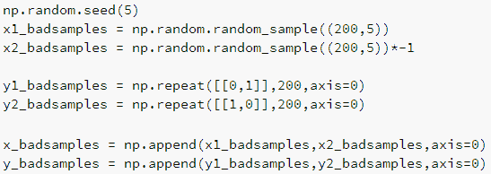
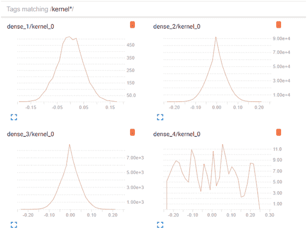

# 使用正则化防止过拟合

到目前为止，在前面的章节中，我们了解了构建神经网络、评估 TensorBoard 结果以及调整神经网络模型的超参数以提高模型准确率。

虽然超参数通常有助于提高模型的准确率，但某些超参数的配置会导致模型过度拟合训练数据，而无法泛化测试数据，这就是过拟合训练数据的问题。

一个关键参数可以帮助我们在泛化未见数据集的同时避免过拟合，那就是正则化技术。以下是一些关键的正则化技术：

+   L2 正则化

+   L1 正则化

+   Dropout

+   缩放

+   批标准化

+   权重初始化

在本章中，我们将讨论以下内容：

+   过度/欠拟合的直觉

+   使用正则化减少过拟合

+   改善欠拟合场景

# 过度/欠拟合的直觉

在我们了解前面技术如何有用之前，让我们构建一个场景，以便我们了解过拟合的现象。

**场景 1：在未见数据集上未泛化的案例**

在这个场景中，我们将创建一个数据集，其中输入和输出之间存在清晰的线性可分映射。例如，每当独立变量为正时，输出为 `[1,0]`，而当输入变量为负时，输出为 `[0,1]`：

为了那个数据集，我们将通过添加一些遵循先前模式相反的数据点来添加少量噪声（前一个数据集的 10%），即当输入变量为正时，输出为 `[0,1]`，而当输入变量为负时，输出为 `[1,0]`：

将前两个步骤获得的数据集附加在一起，就得到了训练数据集，如下所示：

在下一步中，我们将创建测试数据集，其中它遵循大多数训练数据集的准则，即当输入为正时，输出为 `[1,0]`：

现在我们已经创建了数据集，让我们继续构建一个模型来预测给定的输入的输出。

这里的直觉是，如果训练准确率提高了超过 90.91%，那么它就是一个典型的过拟合案例，因为模型试图拟合那些不适用于未见数据集的少数观察结果。

为了检查这一点——让我们首先导入所有相关的包来在 `keras` 中构建一个模型：

我们构建了一个具有三个层的模型，其中每个隐藏层有 1,000、500 和 100 个单元：

下面是训练和测试数据集上损失和准确性的 TensorBoard 可视化：

从前两个图中，我们可以看到，随着训练数据集上的损失减少，其准确性提高。

此外，请注意，训练损失并没有平滑地减少——这可能会向我们表明它正在过度拟合训练数据。

你应该观察到，随着训练数据集准确性的提高，验证准确性（测试准确性）开始下降——再次向我们表明该模型对未见数据集的泛化能力不佳。

这种现象通常发生在模型过于复杂，试图拟合最后几个错误分类以减少训练损失时。

# 减少过拟合

通常，过拟合会导致一些权重相对于其他权重非常高。为了理解这一点，让我们看看在 *场景 1* 中通过运行模型在人工创建的数据集上获得的权重直方图：

我们可以看到，有一些权重值很高（> 0.1），而大多数权重则集中在零附近。

现在我们来探索通过 L1 和 L2 正则化对具有高权重值进行惩罚的影响。

正则化的直觉如下：

+   如果将权重值缩小到尽可能小，那么这些权重中的一些对微调我们的模型以适应少数异常情况贡献更大的可能性就较小。

# 实现 L2 正则化

既然我们已经看到了我们的数据集上过拟合的发生，我们将探讨 L2 正则化在减少数据集上过拟合的影响。

数据集上的 L2 正则化可以定义为如下：

注意，损失函数是传统的损失函数，其中 *y* 是因变量，*x* 是自变量，*W* 是核（权重矩阵）。

正则化项被添加到损失函数中。注意正则化值是权重矩阵所有维度的权重值的平方和。鉴于我们是在最小化权重值的平方和以及损失函数，成本函数确保没有权重值过大——从而确保过拟合现象减少。

Lambda 参数是一个超参数，用于调整我们对正则化项赋予的权重。

让我们探索在 *场景 1* 中定义的模型中添加 L2 正则化的影响：

注意，我们修改了在 *场景 1* 中看到的代码，通过添加 `kernel_regularizer`，在这种情况下，是具有 `0.01` Lambda 值的 L2 正则化器。

注意 TensorBoard 的输出，正如我们训练前面的模型：

训练损失持续下降，验证准确率保持稳定，而训练准确率为 90.9%，没有考虑到过拟合的情况。

让我们探索权重的分布，以了解在执行 L2 正则化和没有正则化时权重分布的差异：

你应该注意到，与没有正则化的情况相比，在 L2 正则化的场景下，核（主要是`dense_2`和`dense_3`层的核）在零点有一个更尖锐的峰值。

为了进一步了解峰值分布，我们将修改 lambda 值，并将正则化的权重提高至 0.1 而不是 0.001，看看权重看起来如何：

注意，由于给正则化项更高的权重，权重在中心（值为 0）周围的分布要尖锐得多。

还应该注意到，核是`dense_4`，并且变化不大，因为我们没有在这个层应用正则化。

从前面的点我们可以得出结论，通过实现 L2 正则化，我们可以减少在没有正则化时看到的过拟合问题。

# 实现 L1 正则化

L1 正则化与 L2 正则化类似；然而，L1 正则化的成本函数与 L2 正则化不同，如下所示：

注意，在上述方程中，所有项都保持不变；只是正则化项是权重绝对值的总和，而不是权重平方值的总和。

让我们在代码中实现 L1 正则化；现在我们看到相应的输出如下：

注意，由于 L1 正则化项不涉及平方，我们可能需要在 L1 中降低 lambda 值，与 L2 相比（考虑到大多数权重小于一，平方它们会使权重值更小）。

在定义模型（这次带有正则化）后，我们拟合它，如下所示：

上述代码拟合结果在训练和测试数据集上的准确率，正如我们所预期，如下所示：

让我们也看看在直方图标签页中各层的权重分布：

我们应该注意，这里的核分布与 L2 正则化 lambda 值高时的核分布相似。

# 实现 dropout

另一种减少过拟合的方法是实现 dropout 技术。在执行典型反向传播中的权重更新时，我们确保在给定的一轮中，一些随机部分的权重被排除在权重更新之外——因此得名 dropout。

Dropout 作为一种技术，也可以帮助减少过拟合，因为减少单个 epoch 中需要更新的权重数量，从而减少了输出依赖于少数输入值的机会。

Dropout 可以这样实现：

模型拟合的结果如下：

应该注意，与没有正则化的场景相比，给定配置中的 dropout 导致权重分布略宽：

# 减少欠拟合

当以下情况发生时，通常会出现欠拟合：

+   模型极其复杂，并且运行了较少的 epoch

+   数据未进行归一化

**场景 2：MNIST 数据集上的欠拟合实际操作**

在以下场景中，我们看到 MNIST 数据集上欠拟合的实际案例：

注意，在前面的代码中，我们没有缩放我们的数据——训练和测试数据集的列值范围在 0 到 255 之间：

前面模型的训练和测试数据集上的 TensorBoard 准确率和损失可视化如下：

注意，在前面的图表中，训练数据集的损失和准确率几乎没有变化（注意两个图表的*y*轴值）。

这种情况（损失几乎没有变化）通常发生在输入有非常高的数字（通常>5）时。

前面的情况可以通过执行以下任何一项来纠正：

+   数据缩放

+   批标准化

数据缩放就像重复前面的架构一样简单，但需要稍作修改，即缩放训练和测试数据集：

批标准化可以在以下方式下执行（甚至可以在未缩放的 MNIST 数据集上）：

训练和测试准确率的可视化如下：

在前面的场景中，我们看到即使在未缩放的数据集上，测试准确率也相当高。

**场景 3：错误的权重初始化**

就像前面的场景一样，如果权重没有正确初始化（即使数据集是正确缩放的），我们很可能遇到欠拟合的场景。例如，在以下代码中，我们将所有权重（核）初始化为零，然后注意到测试数据集上的准确率：

前述代码的输出结果导致以下 TensorBoard 可视化：

与*场景 2*类似，前述图表表明，通过先前定义的架构没有发生学习。

由于权重被初始化为零，没有发生学习。

建议将权重初始化为正态初始化。其他可以尝试的初始化方法，以测试是否可以提高准确率的有：

+   `glorot_normal`

+   `lecun_uniform`

+   `glorot_uniform`

+   `he_normal`

# 摘要

在本章中，我们看到了过拟合的特征以及如何通过 L1 和 L2 正则化以及 dropout 来处理它们。同样，我们也看到了存在大量欠拟合的场景，以及如何通过缩放或批量归一化来帮助我们改善欠拟合的情况。
