# 超越前馈网络——CNN 和 RNN

**人工神经网络**（**ANNs**）现在在各种技术中极为广泛地被用作工具。在最简单的应用中，ANNs 为神经元之间的连接提供了一种前馈架构。前馈神经网络是设计出的第一种也是最简单的人工神经网络。在存在与某些问题相互作用的假设的情况下，前馈网络的内向结构具有强烈的限制性。然而，可以从它开始，创建一个计算一个单元的结果会影响另一个单元计算过程的网络。显然，管理这些网络动态的算法必须满足新的收敛标准。

在本章中，我们将介绍主要的人工神经网络架构，例如卷积神经网络（CNN）、循环神经网络（RNN）和**长短期记忆**（**LSTM**）。我们将解释每种类型 NN 背后的概念，并告诉您它们应该应用于哪些问题。每种类型的 NN 都使用 TensorFlow 在真实数据集上实现。

涵盖的主题包括：

+   卷积网络及其应用

+   循环网络

+   LSTM 架构

在本章结束时，我们将了解训练、测试和评估**卷积神经网络**（**CNN**）。我们将学习如何在 Google Cloud Platform 上训练和测试 CNN 模型。我们将涵盖 CNN 和 RNN 架构的概念。我们还将能够训练一个 LSTM 模型。读者将学习将哪种类型的神经网络应用于不同的问题，以及如何在 Google Cloud Platform 上定义和实现它们。

# 卷积神经网络

ANN 是从生物神经网络（人脑）中受到启发的模型系列，它从调节自然神经网络的机制开始，计划模拟人类思维。它们用于估计或近似可能依赖于大量输入的函数，其中许多通常是未知的。ANN 通常表示为相互连接的神经元系统，其中发生消息交换。每个连接都有一个相关的权重；权重的值可以根据经验进行调整，这使得神经网络成为适应各种类型输入并具有学习能力的工具。

ANNs 将神经元定义为中央处理单元，它通过对一组输入执行数学运算来生成一个输出。神经元的输出是输入加权总和加上偏差的函数。每个神经元执行一个非常简单的操作，如果接收到的总信号量超过激活阈值，则涉及激活。在以下图中，显示了一个简单的 ANN 架构：

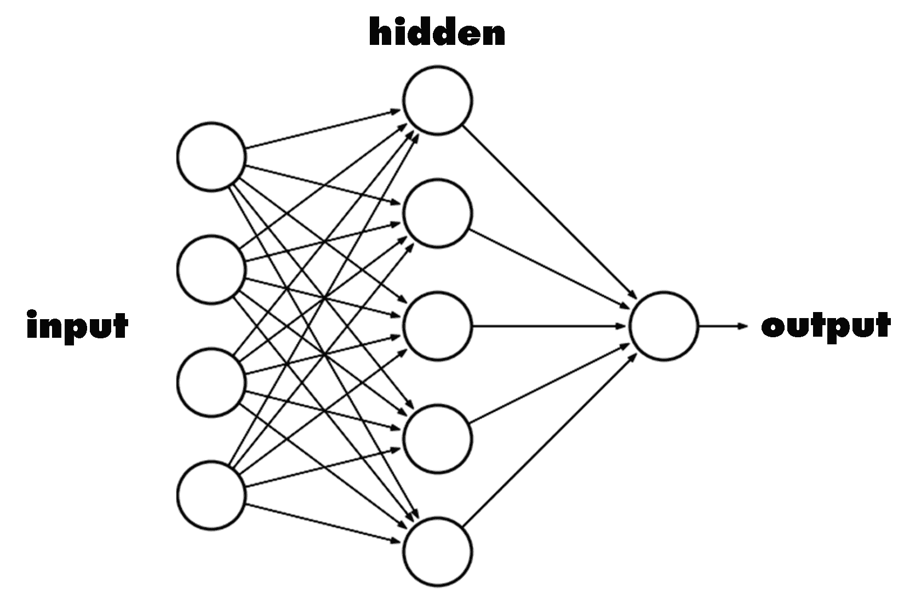

实质上，卷积神经网络（CNN）是人工神经网络。事实上，就像后者一样，CNN 由通过加权分支（权重）相互连接的神经元组成；网络的训练参数再次是权重和偏差。

在 CNN 中，神经元之间的连接模式受到动物世界中视觉皮层结构的启发。大脑的这一部分（视觉皮层）中的单个神经元对观察到的狭窄区域内的某些刺激做出反应，该区域称为**感受野**。不同神经元的感受野部分重叠，以覆盖整个视野。单个神经元对其感受野内发生的刺激的反应可以通过卷积运算进行数学近似。

与神经网络训练相关的所有内容，即前向/反向传播和权重的更新，也适用于此上下文；此外，整个 CNN 总是使用一个可微分的成本函数。然而，CNN 假设它们的输入具有精确的数据结构，例如图像，这使得它们可以在其架构中采用特定的属性以更好地处理此类数据。

使用 FC 架构分层的一般神经网络——其中每一层的每个神经元都与前一层的所有神经元（除偏置神经元外）相连——在输入数据规模增加时通常无法很好地扩展。

让我们举一个实际例子：假设我们想要分析一张图像以检测对象。首先，让我们看看图像是如何处理的。正如我们所知，在图像编码中，它被分成一个小方格的网格，每个小方格代表一个像素。在这个阶段，为了编码彩色图像，我们只需要为每个方格识别一定数量的色调和不同的颜色渐变。然后我们通过适当的位序列对每个方格进行编码。以下是一个简单的图像编码示例：

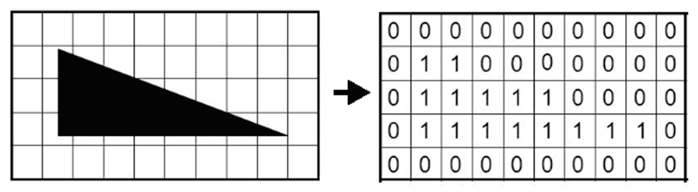

网格中的方块数量定义了图像的分辨率。例如，宽度为 1,600 像素、高度为 800 像素（1,600 x 800）的图像包含（相乘）1,280,000 个像素，或 1.2 兆像素。因此，我们必须乘以三个颜色通道，最终得到 1,600 x 800 x 3 = 3,840,000。这意味着第一个隐藏层中完全连接的每个神经元都会有 3,840,000 个权重。这只是一个神经元的例子；考虑到整个网络，事情肯定会变得难以管理！

CNN 被设计成直接在由像素表示的图像中识别视觉模式，并且需要零或非常有限的预处理。它们能够识别极其变化的模式，例如自由手写和代表现实世界的图像。

通常，CNN 由几个交替的卷积和子采样级别（池化）组成，在分类的情况下，后面跟着一个或多个 FC 最终级别。以下图显示了经典的图像处理流程：

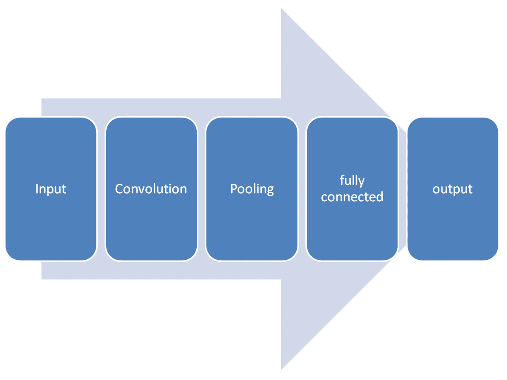

为了解决现实世界中的问题，这些步骤可以按需组合和堆叠。例如，你可以有两层、三层，甚至更多层的**卷积**。你可以输入所有你想要的**池化**来减少数据的大小。

如前所述，在 CNN 中通常使用不同类型的层。在以下章节中，将介绍主要的一些。

# 卷积层

这是主要类型的层；在 CNN 中使用一个或多个这些层是必不可少的。实际上，卷积层的参数与一组可操作的滤波器相关。每个滤波器在宽度和高度维度上是空间上小的，但它扩展到它所应用的输入体积的整个深度。

与普通神经网络不同，卷积层中的神经元以三维组织：**宽度**、**高度**和**深度**。它们在以下图中展示：

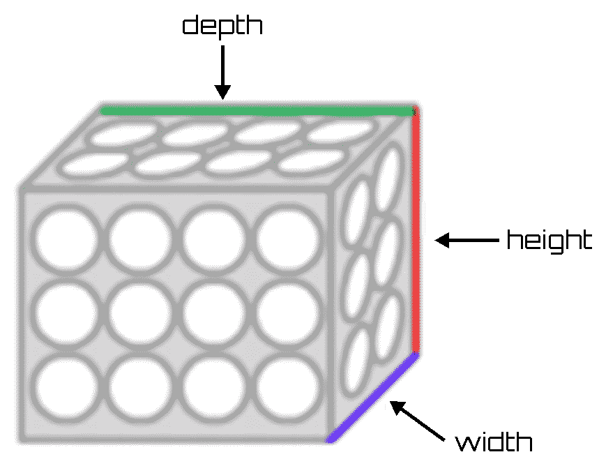

在前向传播过程中，每个滤波器沿着输入体积的宽度和高度进行平移——或者更准确地说，进行卷积——产生该滤波器的二维激活图（或特征图）。当滤波器在输入区域移动时，滤波器的值与它所应用的输入部分的值之间执行标量积操作。

直观地讲，网络的目标是学习在输入的特定空间区域出现某种特定类型的特征时被激活的滤波器。所有这些特征图（对于所有滤波器）沿着深度维度的排队形成了卷积层的输出体积。这个体积的每个元素都可以解释为观察输入的小区域并与其他特征图中的神经元共享其参数的神经元的输出。这是因为这些值都来自应用相同的滤波器。

总结一下，让我们关注以下要点：

+   **局部感受野**：层的每个神经元都与输入的一个小区域（称为**局部感受野**）完全连接；每个连接学习一个权重。

+   **共享权重**：由于有趣的特征（边缘、块等）可以在图像的任何地方找到，同一层的神经元共享权重。这意味着同一层的所有神经元都将识别相同的位置在不同输入点处的特征。

+   **卷积**：相同的权重图应用于不同的位置。卷积输出称为**特征图**。

每个滤波器捕捉前一层中存在的特征。因此，为了提取不同的特征，我们需要训练多个卷积滤波器。每个滤波器返回一个突出不同特性的特征图。

# 矩形线性单元

**ReLU（修正线性单元**）在神经网络中扮演神经元激活函数的角色。ReLU 层由应用函数 f*(x) = max (0, x)* 的神经元组成。这些层增加了网络的非线性，同时不修改卷积层的接收域。与双曲正切或 Sigmoid 等其他函数相比，ReLU 函数的功能更受青睐，因为它在比较中导致训练过程更快，同时不会显著影响泛化精度。

# 池化层

这些层定期插入到网络中，以减少当前表示的空间尺寸（宽度和高度）以及特定网络阶段中的体积；这有助于减少网络参数数量和计算时间。它还监控过拟合。池化层独立地对输入体积的每个深度切片进行操作，以在空间上调整其大小。

例如，这种技术将输入图像分割成一系列正方形，并对每个生成的区域，返回最大值作为输出。

CNNs 还使用位于卷积层之后的池化层。池化层将输入划分为区域，并选择单个代表性值（最大池化和平均池化）。使用池化层：

+   减少了后续层的计算量

+   增强了特征对空间位置的抗干扰性

它基于这样的概念，一旦某个特征被识别，其在输入中的精确位置并不像其相对于其他特征的近似位置那样重要。在典型的 CNN 架构中，卷积层和池化层反复交替。

# 完全连接层

这种类型的层与具有**完全连接**（**FC**）架构的任何经典 ANN 层完全相同。简单地说，在 FC 层中，每个神经元都连接到前一层中的所有神经元，特别是它们的激活。

与 CNN 中迄今为止所看到的不同，这种类型的层不使用局部连接性属性。FC 层连接到整个输入体积，因此，正如你可以想象的那样，会有很多连接。这种类型层的唯一可设置参数是构成它的 K 个神经元的数量。基本上定义 FC 层的是以下内容：将其 K 个神经元与所有输入体积连接，并计算其 K 个神经元中的每个神经元的激活。

实际上，其输出将是一个 1 x 1 x K 的单个向量，包含计算出的激活值。使用单个全连接层后，从三维组织输入体积（在单维中组织单个输出向量）切换，这表明在应用全连接层之后，不能再使用卷积层。在 CNN 的上下文中，全连接层的主要功能是对到目前为止获得的信息进行某种分组，用一个单一的数字（其神经元之一的活动）来表示，这将在后续的计算中用于最终的分类。

# CNN 的结构

在详细分析了 CNN 的每个组件之后，现在是时候看看 CNN 的整体结构了。例如，从图像作为输入层开始，将会有一系列的卷积层，其中穿插着 ReLU 层，并在必要时使用标准化和池化层。最后，在输出层之前，将有一系列的全连接层。以下是一个 CNN 架构的示例：

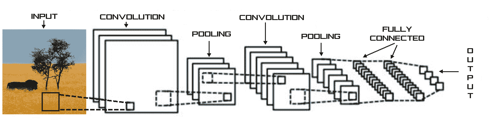

基本思想是从一个大的图像开始，逐步减少数据，直到得到一个单一的结果。卷积通道越多，神经网络就越能够理解和处理复杂函数。

# TensorFlow 概述

TensorFlow 是由谷歌提供的开源数值计算库，用于机器智能。它隐藏了构建深度学习模型所需的全部编程，并为开发者提供了一个黑盒接口来编程。

在 TensorFlow 中，图中的节点代表数学运算，而图边代表它们之间传递的多维数据数组（张量）。TensorFlow 最初是由谷歌大脑团队在谷歌机器智能研究内部为机器学习和深度神经网络研究开发的，但现在它已进入公共领域。当配置适当的时候，TensorFlow 会利用 GPU 处理。

TensorFlow 的通用用例如下：

+   图像识别

+   计算机视觉

+   语音/声音识别

+   时间序列分析

+   语言检测

+   语言翻译

+   基于文本的处理

+   手写识别

+   许多其他

要使用 TensorFlow，我们首先必须安装 Python。如果你机器上没有 Python 安装，那么是时候安装它了。Python 是一种动态的**面向对象编程**（**OOP**）语言，可用于许多类型的软件开发。它提供了与其他语言和程序集成的强大支持，附带一个大型标准库，可以在几天内学会。许多 Python 程序员可以证实生产力的显著提高，并觉得它鼓励开发更高质量的代码和可维护性。

Python 运行在 Windows、Linux/Unix、macOS X、OS/2、Amiga、Palm 手持设备和诺基亚手机上。它还适用于 Java 和.NET 虚拟机。Python 遵循 OSI 批准的开源许可；其使用是免费的，包括商业产品。

Python 是在 20 世纪 90 年代初由荷兰 Stichting Mathematisch Centrum 的 Guido van Rossum 创建的，作为名为**ABC**的语言的继任者。尽管 Python 包括许多其他人的贡献，但 Guido 仍然是 Python 的主要作者。

如果你不知道要使用哪个版本，有一份英文文档可以帮助你选择。原则上，如果你必须从头开始，我们建议选择 Python 3.6。有关可用版本和如何安装 Python 的所有信息，请参阅[`www.python.org/`](https://www.python.org/)。

在正确安装我们的机器的 Python 版本后，我们必须担心安装 TensorFlow。我们可以从以下链接检索所有库信息和操作系统的可用版本：[`www.tensorflow.org/`](https://www.tensorflow.org/)。

此外，在安装部分，我们可以找到一系列指南，解释如何安装允许我们用 Python 编写应用程序的 TensorFlow 版本。以下操作系统的指南可用：

+   Ubuntu

+   macOS X

+   Windows

例如，要在 Windows 上安装 TensorFlow，我们必须选择以下类型之一：

+   仅支持 CPU 的 TensorFlow

+   支持 GPU 的 TensorFlow

要安装 TensorFlow，以管理员权限启动终端。然后在终端中发出适当的`pip3 install`命令。要安装仅 CPU 版本，请输入以下命令：

```py
C:\> pip3 install --upgrade tensorflow
```

一系列代码行将在视频中显示，以使我们了解安装过程的执行情况，如图所示：

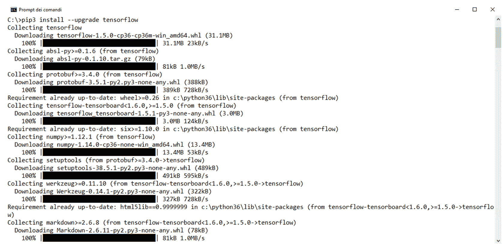

在过程结束时，将显示以下代码：

```py
Successfully installed absl-py-0.1.10 markdown-2.6.11 numpy-1.14.0 protobuf-3.5.1 setuptools-38.5.1 tensorflow-1.5.0 tensorflow-tensorboard-1.5.1 werkzeug-0.14.1
```

要验证安装，从 shell 中调用`python`，如下所示：

```py
python
```

在 Python 交互式外壳中输入以下简短程序：

```py
>>> import tensorflow as tf
>>> hello = tf.constant('Hello, TensorFlow!')
>>> sess = tf.Session()
>>> print(sess.run(hello))
```

如果系统输出以下内容，那么你就可以开始编写 TensorFlow 程序了：

```py
Hello, TensorFlow!
```

在这种情况下，你将确认库在你的计算机上正确安装。现在你只需要使用它。

# 使用 CNN 和 TensorFlow 进行手写识别

**手写识别**（**HWR**）是现代技术中非常常用的程序。通过光学扫描（**光学字符识别**或**OCR**）或智能文字识别，可以从一张纸上离线检测到书写文本的图像。或者，可以在线检测笔尖移动（例如，从笔计算机表面，由于有更多线索，这通常更容易）。

从技术上来说，手写识别是计算机接收和解释来自纸张文件、照片、触摸屏和其他设备等来源的手写可识别输入的能力。HWR 通过需要 OCR 的各种技术来完成。然而，一个完整的脚本识别系统还管理格式，执行正确的字符分割，并找到最可能的单词。

**修改后的国家标准与技术研究院**（**MNIST**）是一个包含手写数字的大型数据库。它包含 70,000 个数据示例。它是 NIST 更大数据集的一个子集。这些数字的分辨率为 28 x 28 像素，存储在一个 70,000 行和 785 列的矩阵中；784 列形成 28 x 28 矩阵中的每个像素值，一个值是实际的数字。这些数字已经被尺寸归一化，并居中在一个固定大小的图像中。

MNIST 集中的数字图像最初是由 Chris Burges 和 Corinna Cortes 使用边界框归一化和居中技术选定的。Yann LeCun 的版本使用更大窗口内的质心居中。数据可在 Yann LeCun 的网站上找到：

[`yann.lecun.com/exdb/mnist/`](http://yann.lecun.com/exdb/mnist/).

每个图像都是 28 x 28 像素创建的。以下图显示了 MNIST 数据集中 0-8 的图像样本：

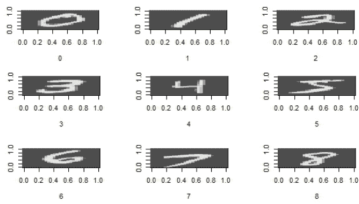

MNIST 包含几个手写数字的样本。这个数据集可以被输入到我们的 Python 程序中，我们的代码可以识别任何作为预测数据呈现的新手写数字。这是一个神经网络架构作为计算机视觉系统在 AI 应用中起作用的案例。以下表格显示了 LeCun 网站上可用的 MNIST 数据集的分布：

| **数字** | **数量** |
| --- | --- |
| 0 | 5923 |
| 1 | 6742 |
| 2 | 5958 |
| 3 | 6131 |
| 4 | 5842 |
| 5 | 5421 |
| 6 | 5918 |
| 7 | 6265 |
| 8 | 5851 |
| 9 | 5949 |

我们将使用 TensorFlow 库来训练和测试 MNIST 数据集。我们将 70,000 行的数据集分为 60,000 个训练行和 10,000 个测试行。接下来，我们将找到模型的准确率。然后，该模型可以用来预测任何包含 0 到 9 数字的 28 x 28 像素手写数字的输入数据集。在我们的示例 Python 代码中，我们使用一个 100 行的训练数据集和一个 10 行的测试数据集。在这个例子中，我们将学习如何使用 TensorFlow 层模块，它提供了一个高级 API，使得构建神经网络变得容易。它提供了创建密集（FC）层和卷积层、添加激活函数和应用 dropout 正则化的方法。

首先，我们将逐行分析代码，然后我们将了解如何使用 Google Cloud Platform 提供的工具来处理它。现在，让我们从头开始分析代码，学习如何应用卷积神经网络（CNN）来解决手写识别（HWR）问题：

```py
from __future__ import absolute_import
from __future__ import division
from __future__ import print_function
```

这三条线被添加以编写兼容 Python 2/3 的代码库。所以让我们继续导入模块：

```py
import numpy as np
import tensorflow as tf
```

这样，我们已经导入了`numpy`和`tensorflow`模块。让我们分析下一行代码：

```py
tf.logging.set_verbosity(tf.logging.INFO)
```

这段代码设置了将记录的消息的阈值。在初始阶段之后，我们将定义一个函数，该函数将允许我们构建一个 CNN 模型：

```py
def cnn_model_fn(features, labels, mode):
```

因此，我们已经定义了函数。现在让我们继续：

```py
input_layer = tf.reshape(features["x"], [-1, 28, 28, 1])
```

在这一行代码中，我们以`（batch_size，image_width，image_height，channels）`的形式传递了输入张量，这是从层模块中的方法期望得到的，用于创建二维图像数据的卷积和池化层。让我们继续到第一个卷积层：

```py
conv1 = tf.layers.conv2d(
      inputs=input_layer,
      filters=32,
      kernel_size=[5, 5],
      padding="same",
      activation=tf.nn.relu)
```

这一层创建了一个卷积核，该核与层输入卷积以产生输出张量。卷积中的过滤器数量为 32，2D 卷积窗口的高度和宽度为`[5,5]`，激活函数是 ReLU 函数。为此，我们使用了层模块中的`conv2d()`方法。接下来，我们将我们的第一个池化层连接到我们刚刚创建的卷积层：

```py
pool1 = tf.layers.max_pooling2d(inputs=conv1,
                       pool_size=[2, 2], strides=2)
```

我们在层中使用了`max_pooling2d()`方法来构建一个执行 2x2 过滤器最大池化和步长为`2`的层。现在我们将第二个卷积层连接到我们的 CNN：

```py
conv2 = tf.layers.conv2d(
    inputs=pool1,
    filters=64,
    kernel_size=[5, 5],
    padding="same",
    activation=tf.nn.relu)
```

现在我们将连接第二个池化层到我们的卷积神经网络（CNN）：

```py
pool2 = tf.layers.max_pooling2d(inputs=conv2,
                   pool_size=[2, 2], strides=2)
pool2_flat = tf.reshape(pool2, [-1, 7 * 7 * 64])
```

接下来，我们将添加一个密集层：

```py
dense = tf.layers.dense(inputs=pool2_flat,
                units=1024, activation=tf.nn.relu)
```

通过这段代码，我们在 CNN 中添加了一个包含 1,024 个神经元的密集层和 ReLU 激活函数，以对卷积/池化层提取的特征进行分类。

记住，ReLU 层由应用函数*f(x) = max (0, x)*的神经元组成。这些层增加了网络的非线性，同时它们不修改卷积层的接收域。

为了提高结果，我们将在密集层上应用 dropout 正则化：

```py
dropout = tf.layers.dropout(inputs=dense,
            rate=0.4, training=mode ==
                      tf.estimator.ModeKeys.TRAIN)
```

为了做到这一点，我们在层中使用了 dropout 方法。接下来，我们将添加最终的层到我们的神经网络：

```py
logits = tf.layers.dense(inputs=dropout, units=10)
```

这是`logits`层，它将返回我们的预测的原始值。通过前面的代码，我们创建了一个包含`10`个神经元的密集层（每个目标类 0-9 一个），具有线性激活。我们只需生成预测：

```py
predictions = {
      "classes": tf.argmax(input=logits, axis=1),
       "probabilities": tf.nn.softmax(logits, name="softmax_tensor")
  }
  if mode == tf.estimator.ModeKeys.PREDICT:
        return tf.estimator.EstimatorSpec(mode=mode,
                           predictions=predictions)
```

我们将预测生成的原始值转换为两种不同的格式，我们的模型函数可以返回：一个从 0 到 9 的数字以及示例是零、是一、是二等的概率。我们在字典中编译我们的预测并返回一个`EstimatorSpec`对象。现在，我们将传递定义一个`loss`函数：

```py
loss = tf.losses.sparse_softmax_cross_entropy(labels=labels, logits=logits)
```

`loss`函数衡量模型的预测与目标类之间的匹配程度。此函数用于训练和评估。我们将配置我们的模型，在训练期间优化此损失值：

```py
if mode == tf.estimator.ModeKeys.TRAIN:
    optimizer = tf.train.GradientDescentOptimizer(learning_rate=0.001)
    train_op = optimizer.minimize(
        loss=loss,
        global_step=tf.train.get_global_step())
    return tf.estimator.EstimatorSpec(mode=mode, loss=loss, train_op=train_op)
```

我们使用`0.001`的学习率和随机梯度下降作为优化算法。现在，我们将在模型中添加一个准确度指标：

```py
  eval_metric_ops = {
      "accuracy": tf.metrics.accuracy(
          labels=labels, predictions=predictions["classes"])}
  return tf.estimator.EstimatorSpec(
      mode=mode, loss=loss, eval_metric_ops=eval_metric_ops)
```

为了做到这一点，我们在`EVAL`模式下定义了`eval_metric_ops`字典。因此，我们已经定义了网络的架构；现在有必要定义训练和测试网络的代码。为此，我们将在 Python 代码中添加一个`main()`函数：

```py
def main(unused_argv):
```

然后我们将加载训练和评估数据：

```py
  mnist = tf.contrib.learn.datasets.load_dataset("mnist")
  train_data = mnist.train.images 
  train_labels = np.asarray(mnist.train.labels, dtype=np.int32)
  eval_data = mnist.test.images 
  eval_labels = np.asarray(mnist.test.labels, dtype=np.int32)
```

在这段代码中，我们将训练特征数据和训练标签分别存储在`train_data`和`train_labels`中的`numpy`数组中。同样，我们将评估特征数据和评估标签分别存储在`eval_data`和`eval_labels`中。接下来，我们将为我们的模型创建一个`Estimator`：

```py
  mnist_classifier = tf.estimator.Estimator(
      model_fn=cnn_model_fn, model_dir="/tmp/mnist_convnet_model")
```

`Estimator`是 TensorFlow 的一个类，用于执行高级模型训练、评估和推理。以下代码设置了预测的日志记录：

```py
  tensors_to_log = {"probabilities": "softmax_tensor"}
  logging_hook = tf.train.LoggingTensorHook(
      tensors=tensors_to_log, every_n_iter=50)
```

现在我们已经准备好训练我们的模型：

```py
    train_input_fn = tf.estimator.inputs.numpy_input_fn(
      x={"x": train_data},
      y=train_labels,
      batch_size=100,
      num_epochs=None,
      shuffle=True)
  mnist_classifier.train(
      input_fn=train_input_fn,
      steps=15000,
      hooks=[logging_hook])
```

为了做到这一点，我们创建了`train_input_fn`并在`mnist_classifier`上调用`train()`。在前面的代码中，我们固定了`steps=15000`，这意味着模型将总共训练 15,000 步。

执行此训练所需的时间取决于我们机器上安装的处理器，但无论如何，它可能将超过 1 小时。为了在更短的时间内进行此类训练，您可以减少传递给`train()`函数的步骤数；很明显，这种变化将对算法的准确性产生负面影响。

最后，我们将评估模型并打印结果：

```py
    eval_input_fn = tf.estimator.inputs.numpy_input_fn(
      x={"x": eval_data},
      y=eval_labels,
      num_epochs=1,
      shuffle=False)
  eval_results = mnist_classifier.evaluate(input_fn=eval_input_fn)
  print(eval_results)
```

我们调用了`evaluate`方法，该方法评估了在`model_fn`的`eval_metriced_ops`参数中指定的度量标准。我们的 Python 代码以以下行结束：

```py
if __name__ == "__main__":
  tf.app.run()
```

这些行只是一个非常快速的包装器，用于处理标志解析，然后转发到您自己的主函数。在这个阶段，我们只需将整个代码复制到一个具有`.py`扩展名的文件中，并在安装了 Python 和 TensorFlow 的机器上运行它。

# 在 Google Cloud Shell 上运行 Python 代码

Google Cloud Shell 直接从您的浏览器提供对云资源的命令行访问。您可以轻松管理项目和服务，无需在系统中安装 Google Cloud SDK 或其他工具。使用 Cloud Shell，当您需要时，Cloud SDK 的`gcloud`命令行工具和其他必要的实用工具始终可用，更新并完全认证。

以下是一些 Google Cloud Shell 的功能：

+   这是一个用于管理托管在 Google Cloud Platform 上的资源的 shell 环境。

+   我们可以使用 Linux shell 的灵活性来管理我们的 GCP 资源。Cloud Shell 通过在网页控制台中打开的终端窗口，提供了对虚拟机实例的命令行访问。

+   它为访问托管在 Google Cloud Platform 上的项目和资源提供了集成授权。

+   您最喜欢的许多命令行工具，从 bash 和 sh 到 emacs 和 vim，都已经预先安装和更新。如 MySQL 客户端、Kubernetes 和 Docker 等管理工具已配置并就绪。您不再需要担心安装最新版本及其所有依赖项。只需连接到 Cloud Shell。

开发者将能够访问所有喜欢的预配置开发工具。您将找到 Java、Go、Python、Node.js、PHP 和 Ruby 的开发和实现工具。在 Cloud Shell 实例中运行您的网络应用程序，并在浏览器中预览它们。然后使用预配置的 Git 和 Mercurial 客户端再次提交到存储库。

Cloud Shell 为 Cloud Shell 实例分配了 5 GB 的永久磁盘存储空间，挂载为 `$ HOME` 目录。存储在 `$ HOME` 目录中的所有文件，包括用户配置脚本和 `bashrc`、`vimrc` 等文件，从一个会话持续到另一个会话。

要启动 Cloud Shell，只需在控制台窗口顶部点击激活 Google Cloud Shell 按钮，如下面的截图所示：


在控制台底部的新的框架中打开一个 Cloud Shell 会话，并显示命令行提示符。初始化 shell 会话可能需要几秒钟。现在，我们的 Cloud Shell 会话已准备好使用，如下面的截图所示：

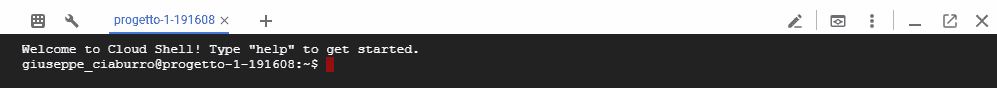

在这一点上，我们需要将包含 Python 代码的 `cnn_hwr.py` 文件传输到 Google Cloud Platform。我们已看到，为此，我们可以使用 Google Cloud Storage 提供的资源。然后我们打开 Google Cloud Storage 浏览器并创建一个新的存储桶。

记住，存储桶是基本容器，用于存储您的数据。您存储在 Cloud Storage 中的所有内容都必须包含在存储桶中。您可以使用存储桶来组织您的数据并控制对数据的访问，但与目录和文件夹不同，您不能嵌套存储桶。

要将 `cnn_hwr.py` 文件传输到 Google Storage，请执行以下步骤：

1.  只需点击创建存储桶图标

1.  在创建存储桶窗口中输入新存储桶的名称（`cnn-hwr`）

1.  之后，在存储桶列表中会出现一个新的存储桶

1.  点击 `cnn-hwr` 存储桶

1.  在打开的窗口中点击上传文件图标

1.  在打开的对话框窗口中选择文件

1.  点击打开

在这一点上，我们的文件将出现在新的存储桶中，如下面的图所示：


现在，我们可以从 Cloud Shell 访问文件。为此，我们在 shell 中创建一个新的文件夹。在 shell 提示符中输入以下命令：

```py
mkdir CNN-HWR
```

现在，要将文件从 Google Storage 存储桶复制到 `CNN-HWR` 文件夹，只需在 shell 提示符中输入以下命令：

```py
gsutil cp gs://cnn-hwr-mlengine/cnn_hwr.py CNN-HWR
```

以下代码将显示：

```py
giuseppe_ciaburro@progetto-1-191608:~$ gsutil cp gs://cnn-hwr/cnn_hwr.py CNN-HWR
Copying gs://cnn-hwr/cnn_hwr.py...
/ [1 files][ 5.7 KiB/ 5.7 KiB]
Operation completed over 1 objects/5.7 KiB.
```

现在，让我们进入文件夹并验证文件的存在：

```py
$cd CNN-HWR
$ls
cnn_hwr.py
```

我们只需运行该文件：

```py
$ python cnn_hwr.py
```

显示了一系列初步指令：

```py
Successfully downloaded train-images-idx3-ubyte.gz 9912422 bytes.
Extracting MNIST-data/train-images-idx3-ubyte.gz
Successfully downloaded train-labels-idx1-ubyte.gz 28881 bytes.
Extracting MNIST-data/train-labels-idx1-ubyte.gz
Successfully downloaded t10k-images-idx3-ubyte.gz 1648877 bytes.
Extracting MNIST-data/t10k-images-idx3-ubyte.gz
Successfully downloaded t10k-labels-idx1-ubyte.gz 4542 bytes.
Extracting MNIST-data/t10k-labels-idx1-ubyte.gz
INFO:tensorflow:Using default config.
```

它们表明数据下载成功，TensorFlow 库的调用也成功了。从这一点开始，网络的训练开始，正如我们预料的，这可能相当长。算法执行结束后，将返回以下信息：

```py
INFO:tensorflow:Saving checkpoints for 15000 into /tmp/mnist_convnet_model/model.ckpt.
INFO:tensorflow:Loss for final step: 2.2751274.INFO:tensorflow:Starting evaluation at 2018-02-19-08:47:04
INFO:tensorflow:Restoring parameters from /tmp/mnist_convnet_model/model.ckpt-15000
INFO:tensorflow:Finished evaluation at 2018-02-19-08:47:56
INFO:tensorflow:Saving dict for global step 15000: accuracy = 0.9723, global_step = 15000, loss = 0.098432
{'loss': 0.098432, 'global_step': 15000, 'accuracy': 0.9723}
```

在这种情况下，我们在测试数据集上达到了`97.2`的准确率。

# 循环神经网络

前馈神经网络基于输入数据，这些数据被提供给网络并转换为输出。如果是一个监督学习算法，输出是一个可以识别输入的标签。基本上，这些算法通过识别模式将原始数据连接到特定的类别。另一方面，循环网络不仅接受被提供给网络的当前输入数据，还包括它们随时间经历过的内容。

一个**循环神经网络**（**RNN**）是一种信息双向流动的神经网络模型。换句话说，在前馈网络中，信号的传播仅以连续的方式从输入到输出方向进行，而循环网络则不同。在这些网络中，这种传播也可以从跟随前一个神经层的神经层发生，或者在同一层的神经元之间发生，甚至可以发生在同一个神经元自身之间。

一个循环网络在特定时刻做出的决策会影响它接下来将做出的决策。因此，循环网络有两个输入来源——当前和最近过去——它们结合起来决定如何对新数据进行响应，就像人们在日常生活中所做的那样。

循环网络之所以与前馈网络不同，是因为它们与过去决策相关的反馈回路，因此暂时将它们的输出作为输入接受。这一点可以通过说循环网络具有记忆来强调。将记忆添加到神经网络中有其目的：序列本身包含信息，循环网络使用这些信息执行前馈网络无法执行的任务。

访问记忆是通过内容而不是通过地址或位置来实现的。一种方法是认为记忆内容是 RNN 节点上的激活模式。想法是使用一个激活方案来启动网络，这个方案是请求的记忆内容的部分或噪声表示，并且网络稳定在所需的内容上。

RNN 是一类神经网络，其中至少存在一个神经元之间的反馈连接，形成一个有向循环。以下图示了一个典型的 RNN，其输出层和隐藏层之间存在连接：

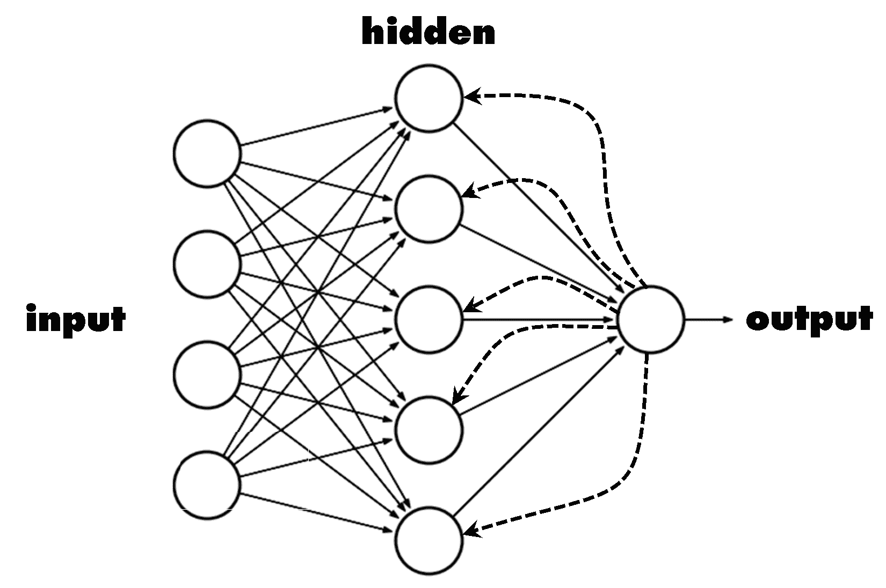

在图所示的循环网络中，既使用输入层又使用输出层来定义隐藏层的权重。

最终，我们可以将 RNN 视为 ANN 的一种变体：这些变体可以在不同的隐藏层数量和数据流的不同趋势上进行表征。RNN 的特点是数据流的不同趋势，实际上神经元之间的连接形成了一个循环。与前馈网络不同，RNN 可以使用内部记忆进行其处理。RNN 是一类 ANN，其特征是隐藏层之间的连接，这些连接通过时间传播以学习序列。

数据在内存中保持的方式以及在不同时间周期中的流动使得 RNN 强大且成功。RNN 的应用案例包括以下领域：

+   股市预测

+   图像标题

+   天气预报

+   基于时间序列的预测

+   语言翻译

+   语音识别

+   手写识别

+   音频或视频处理

+   机器人动作序列

循环神经网络被设计成通过数据序列识别模式，并在预测和预测方面非常有用。它们可以在文本、图像、语音和时间序列数据上工作。RNN 是功能强大的 ANN 之一，代表了生物大脑，包括具有处理能力的记忆。

循环神经网络从当前输入（类似于前馈网络）以及之前计算得出的输出中获取输入。在下面的图中，我们比较了前馈神经网络和循环神经网络的单个神经元工作原理：

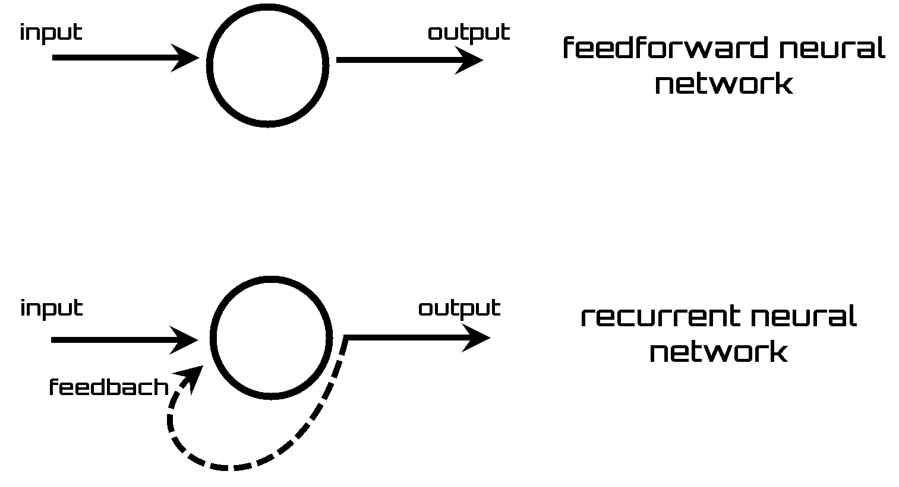

正如我们在简单、刚刚提出的单个神经元方案中看到的那样，反馈信号被添加到 RNN 的输入信号中。反馈是一个相当重要和显著的特征。与仅限于从输入到输出的单向信号的简单网络相比，反馈网络更有可能更新，并且具有更多的计算能力。反馈网络显示出单向网络未揭示的现象和过程。

为了理解 ANN 和 RNN 之间的差异，我们将 RNN 视为神经网络的网络，并且循环性质以下列方式展开：考虑神经元在不同时间周期（*t-1*，*t*，*t+1*，等等）的状态，直到收敛或达到总 epoch 数。

网络学习阶段可以使用类似于导致前馈网络反向传播算法的梯度下降过程进行。至少在简单架构和确定性激活函数的情况下是有效的。当激活是随机的，模拟退火方法可能更合适。

RNN 架构可以有多种不同的形式。在数据向后流动的方式上有更多变体：

+   完全循环

+   递归

+   跳频

+   Elman 网络

+   LSTM

+   门控循环单元

+   双向

+   循环多层感知器

在接下来的几页中，我们将分析这些网络中的一些架构。

# 完全循环神经网络

一个全递归神经网络是一个神经元网络，每个神经元都有一个指向其他每个神经元的定向（单向）连接。每个神经元都有一个时变的、实值的激活度。每个连接都有一个可修改的实值权重。期望有输入神经元、输出神经元和隐藏神经元。这种网络是一种多层感知器，其中前一组隐藏单元的激活度与输入一起反馈到网络中，如下面的图所示：

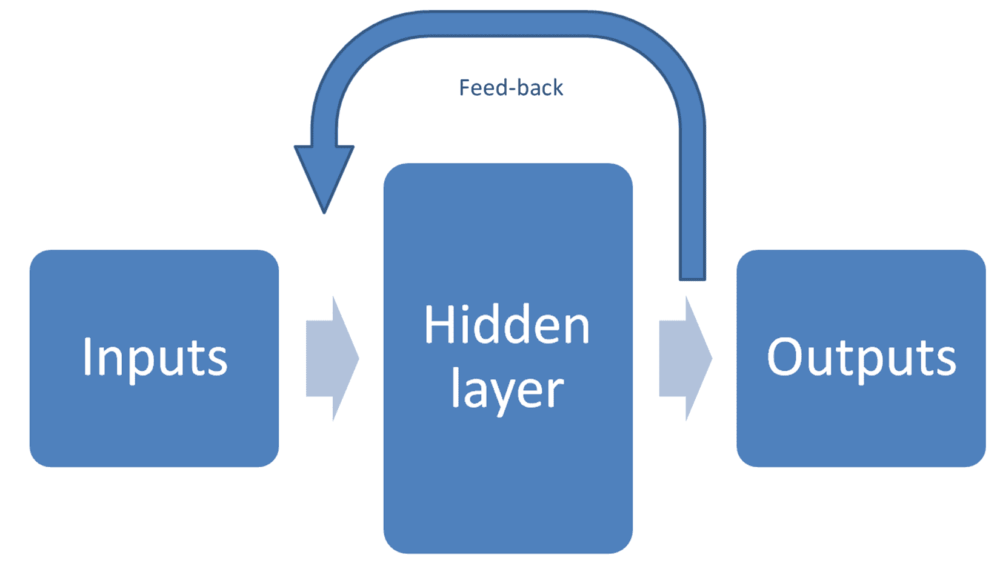

在每一步中，每个非输入单元将其当前激活度计算为连接到它的所有单元激活度的加权和的非线性函数。

# 递归神经网络

递归网络是循环网络的推广。在循环网络中，权重是共享的，维度在序列长度上保持不变。在递归网络中，权重是共享的，维度在节点上保持不变。以下图显示了递归神经网络的外观：

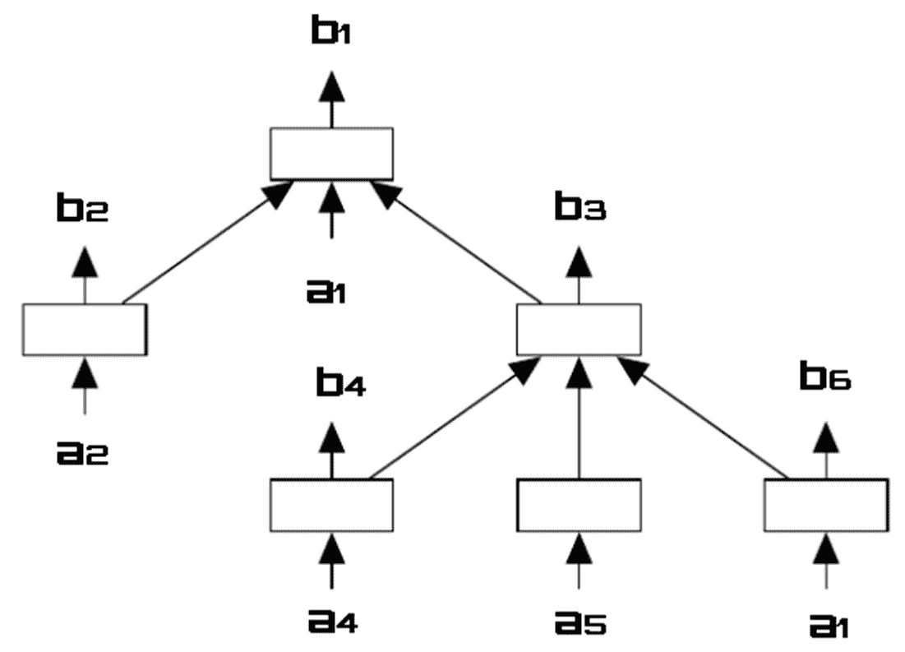

递归神经网络可用于学习树状结构。它们在解析自然场景和语言方面非常有用。

# 霍普菲尔德循环神经网络

1982 年，物理学家约翰·J·霍普菲尔德发表了一篇基础文章，在其中引入了一个数学模型，通常被称为**霍普菲尔德网络**。这个网络突出了从大量简单处理元素的集体行为中产生的新计算能力。霍普菲尔德网络是一种循环人工神经网络（ANN）的形式。

根据霍普菲尔德的观点，每个物理系统都可以被认为是一个潜在的存储设备，如果它具有一定数量的稳定状态，这些状态作为系统本身的吸引子。基于这一考虑，他提出了这样的吸引子的稳定性和位置代表了由大量相互作用的神经元组成的系统的自发性属性的观点。

结构上，霍普菲尔德网络构成一个循环对称神经网络（因此具有对称的突触权重矩阵），它是完全连接的，其中每个神经元都与所有其他神经元相连，如下面的图所示：

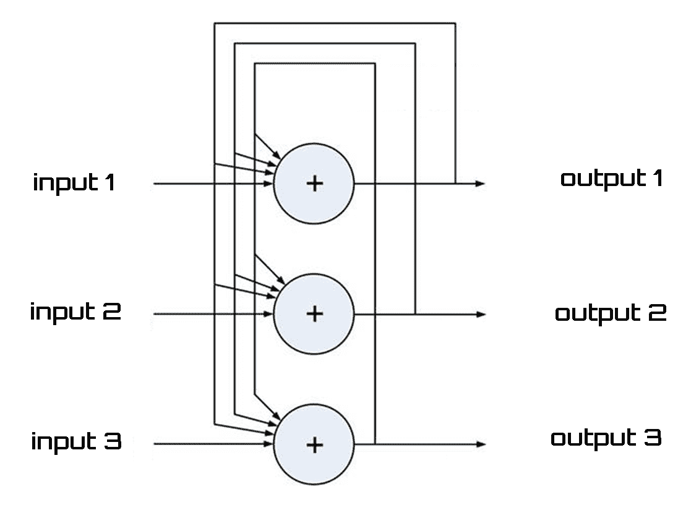

如前所述，循环神经网络是一种包含双向信息流的神经网络；换句话说，在前馈网络中，信号的传播仅以连续的方式在从输入到输出的方向上进行，而在循环网络中，这种传播也可以从跟随前一个神经层的神经层或同一层中的神经元（霍普菲尔德网络）之间发生，甚至可以发生在神经元与其自身之间。

跳频网络的动力学由一个非线性微分方程组描述，神经元更新机制可以是：

+   **异步**：一次更新一个神经元

+   **同步**：所有神经元同时更新

+   **连续**：所有神经元持续更新

# Elman 神经网络

Elman 神经网络是一种前馈网络，其中除了与输出层相连外，隐藏层还分支到另一个相同的层，称为**上下文层**，它与权重等于一的上下文层相连。在每一个时刻（每次数据传递到输入层的神经元时），上下文层的神经元保持前一个值并将它们传递给相应的隐藏层神经元。以下图显示了 Elman 网络方案：

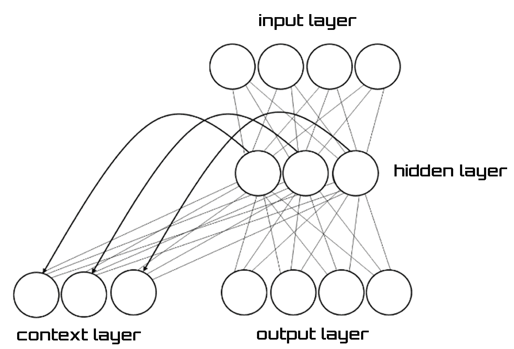

与前馈网络类似，Elman 的 RNN 可以使用称为**时间反向传播**（**BPTT**）的算法进行训练，这是专门为 RNN 创建的反向传播的变体。实质上，该算法将神经网络展开，将其转换为前馈网络，层数等于要学习的序列长度；随后，应用经典的反向传播算法。或者，可以使用全局优化方法，如遗传算法，特别是在无法应用 BPTT 的 RNN 拓扑结构上。

# 长短期记忆网络

LSTM 是 RNN 的一种特定架构，最初由 Hochreiter 和 Schmidhuber 在 1997 年构思。这种类型的神经网络最近在深度学习背景下被重新发现，因为它不受梯度消失问题的影响，并且在实践中提供了出色的结果和性能。

梯度消失问题影响了基于梯度的学习方法的 ANN 训练。在梯度方法，如反向传播中，权重按误差梯度的比例进行调整。由于上述梯度的计算方式，我们得到一个效果，即它们的模量呈指数下降，朝着最深的层前进。问题是，在某些情况下，梯度会变得极其小，实际上阻止了权重改变其值。在最坏的情况下，这可能会完全阻止神经网络进一步训练。

基于 LSTM 的网络非常适合预测和分类时间序列，它们正在取代许多经典机器学习方法。事实上，在 2012 年，谷歌替换了其语音识别模型，从表示了 30 多年标准的隐马尔可夫模型（HMM）过渡到深度学习神经网络。在 2015 年，它切换到结合**连接主义时间分类**（**CTC**）的 RNN LSTM。

CTC 是一种神经网络输出和相关评分函数，用于训练 RNN。

这是因为 LSTM 网络能够考虑数据之间的长期依赖关系，在语音识别的情况下，这意味着管理句子中的上下文以提高识别能力。

LSTM 网络由相互连接的细胞（LSTM 块）组成。每个细胞又由三种类型的端口组成：**输入门**、**输出门**和**遗忘门**。它们分别实现了对细胞内存的写入、读取和重置功能。端口不是二进制而是模拟的（通常由一个映射到范围（0, 1）的 sigmoid 激活函数管理，其中零表示完全抑制，1 表示完全激活），并且是乘法的。这些端口的存 在使得 LSTM 细胞能够记住信息一段时间。实际上，如果输入门低于激活阈值，细胞将保持之前的状态，而如果它被激活，当前状态将与输入值相结合。正如其名所示，遗忘门将细胞当前状态重置（当其值被带到零时），输出门决定细胞内的值是否必须取出。

下图显示了 LSTM 单元：

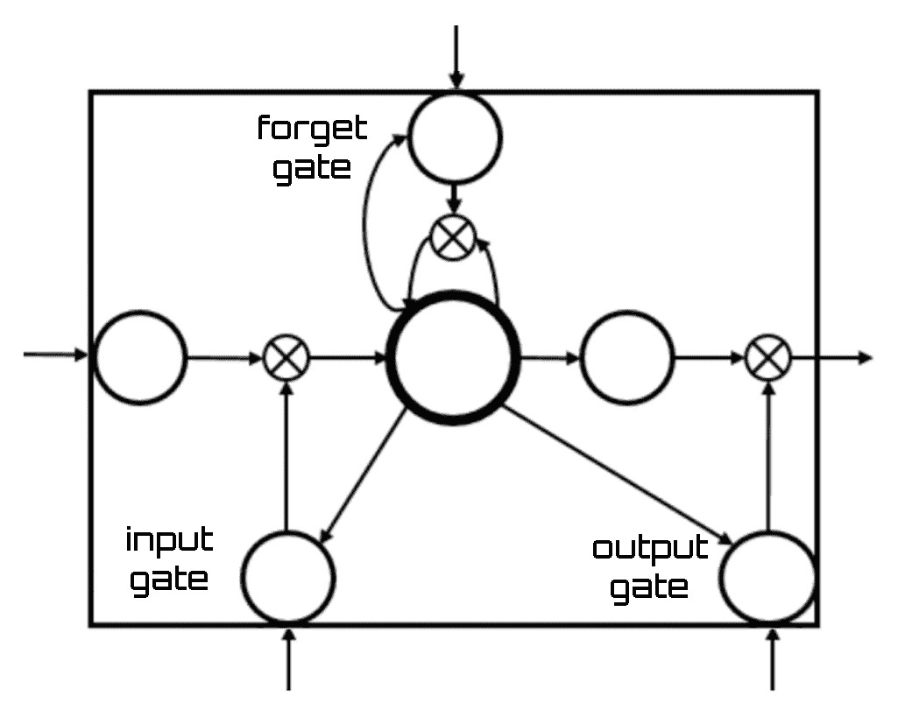

基于神经网络的这些方法非常强大，因为它们能够捕捉数据之间的特征和关系。特别是，在实践中，也发现 LSTM 网络提供了高性能和优秀的识别率。一个缺点是神经网络是黑盒模型，因此它们的行为是不可预测的，并且无法追踪它们处理数据的逻辑。

# 使用 RNN 和 TensorFlow 进行手写识别

为了练习 RNN，我们将使用之前用于构建 CNN 的数据集。我指的是 MNIST 数据集，这是一个包含大量手写数字的大型数据库。它包含 70,000 个数据示例。它是 NIST 更大数据集的一个子集。28 x 28 像素分辨率的图像存储在一个 70,000 行和 785 列的矩阵中；28 x 28 矩阵中的每个像素值和一个值是实际的数字。在固定大小的图像中，数字已经被尺寸归一化。

在此情况下，我们将使用 TensorFlow 库实现一个 RNN（LSTM）来对图像进行分类。我们将把每行图像视为像素序列。由于 MNIST 图像的形状是 28 x 28，我们将为每个样本处理 28 个时间步长的 28 个序列。

首先，我们将逐行分析代码；然后我们将看到如何使用 Google Cloud Platform 提供的工具来处理它。现在，让我们通过代码学习如何将 RNN（LSTM）应用于解决 HWR 问题。让我们从代码的开始部分开始：

```py
from __future__ import absolute_import
from __future__ import division
from __future__ import print_function
```

这三行代码是为了编写一个兼容 Python 2/3 的代码库而添加的。因此，让我们继续导入模块：

```py
import tensorflow as tf
from tensorflow.contrib import rnn
```

这样，我们已经导入了`tensorflow`模块，以及来自`tensorflow.contrib`的`rnn`模块。《tensorflow.contrib》包含易变或实验性代码。《rnn`模块是一个用于构建 RNN 单元和额外的 RNN 操作的模块。让我们分析下一行代码：

```py
from tensorflow.examples.tutorials.mnist import input_data
mnist = input_data.read_data_sets("/tmp/data/", one_hot=True)
```

第一行用于从 TensorFlow 库导入`mnist`数据集；实际上，`minist`数据集已经作为示例存在于库中。第二行从本地目录读取数据。让我们继续设置训练参数：

```py
learning_rate = 0.001
training_steps = 20000
batch_size = 128
display_step = 1000
```

`学习率`是学习算法用来确定权重调整速度的值。它决定了使用该算法训练的权重神经元的获取时间。《训练步数》设置训练过程执行次数。《批量大小》是你输入网络的样本数量。《显示步数》决定显示训练部分结果的步数。现在让我们设置网络参数：

```py
num_input = 28
timesteps = 28
num_hidden = 128
num_classes = 10
```

第一个参数（`num_input`）设置 MNIST 数据输入（图像形状：28 x 28）。`timesteps`参数相当于你运行 RNN 的时间步数。《num_hidden`参数设置神经网络隐藏层的数量。最后，《num_classes`参数设置 MNIST 总类别（0-9 数字）。让我们分析以下代码行：

```py
X = tf.placeholder("float", [None, timesteps, num_input])
Y = tf.placeholder("float", [None, num_classes])
```

在这些代码行中，我们使用了`tf.placeholder()`函数。占位符简单地说是一个我们将在以后日期分配数据的变量。它允许我们创建操作和构建计算图，而无需数据。这样，我们已经设置了`tf.Graph`输入。《tf.Graph》包含两种相关信息：图结构和图集合。TensorFlow 使用数据流图来表示你的计算，以单个操作之间的依赖关系为依据。这导致了一种低级编程模型，其中你首先定义数据流图，然后创建 TensorFlow 会话，在一系列本地和远程设备上运行图的一部分。让我们继续定义`权重`：

```py
weights = {
    'out': tf.Variable(tf.random_normal([num_hidden, num_classes]))
}
biases = {
    'out': tf.Variable(tf.random_normal([num_classes]))
}
```

网络中的权重是将输入转换为影响输出的最重要的因素。这与线性回归中的斜率类似，其中权重乘以输入以形成输出。权重是决定每个神经元如何影响其他神经元的数值参数。偏差类似于线性方程中添加的截距。它是一个额外的参数，用于调整输出，以及神经元输入的加权总和。现在我们必须通过创建一个新的函数来定义`RNN`：

```py
def RNN(x, weights, biases):
    x = tf.unstack(x, timesteps, 1)
    lstm_cell = rnn.BasicLSTMCell(num_hidden, forget_bias=1.0)
    outputs, states = rnn.static_rnn(lstm_cell, x, dtype=tf.float32)
    return tf.matmul(outputs[-1], weights['out']) + biases['out']
```

使用 `unstack()` 函数来获取形状为 (`batch_size`, `n_input`) 的 `timesteps` 张量列表。然后我们使用 TensorFlow 定义了一个 `lstm` 单元，并得到了 `lstm` 单元输出。最后，我们在内循环和最后一个输出处放置了一个线性激活，使用 `RNN`。接下来，让我们继续：

```py
logits = RNN(X, weights, biases)
prediction = tf.nn.softmax(logits)
```

第一行代码使用新定义的 `RNN` 函数构建网络，而第二行代码使用 `tf.nn.softmax()` 函数进行预测，该函数计算 `softmax` 激活。接下来，我们将定义 `loss` 和 `optimizer`：

```py
loss_op = tf.reduce_mean(tf.nn.softmax_cross_entropy_with_logits_v2(
    logits=logits, labels=Y))
optimizer = tf.train.GradientDescentOptimizer(learning_rate=learning_rate)
train_op = optimizer.minimize(loss_op)
```

`loss` 函数将事件或一个或多个变量的值映射到一个实数，直观地表示与事件相关的一些 `cost`。我们使用了 `tf.reduce_mean()` 函数，该函数计算张量维度的元素均值。`optimizer` 基类提供了计算损失梯度并将梯度应用于变量的方法。一系列子类实现了经典的优化算法，如梯度下降和 AdaGrad。让我们继续评估模型：

```py
correct_pred = tf.equal(tf.argmax(prediction, 1), tf.argmax(Y, 1))
accuracy = tf.reduce_mean(tf.cast(correct_pred, tf.float32))
```

然后，我们将通过分配它们的默认值来初始化变量：

```py
init = tf.global_variables_initializer()
```

现在，我们可以开始训练网络：

```py
with tf.Session() as sess:
    sess.run(init)
    for step in range(1, training_steps+1):
        batch_x, batch_y = mnist.train.next_batch(batch_size)
        batch_x = batch_x.reshape((batch_size, timesteps, num_input))
        sess.run(train_op, feed_dict={X: batch_x, Y: batch_y})
        if step % display_step == 0 or step == 1:
            loss, acc = sess.run([loss_op, accuracy], feed_dict={X: batch_x,
                                                                 Y: batch_y})
            print("Step " + str(step) + ", Minibatch Loss= " + \
                  "{:.4f}".format(loss) + ", Training Accuracy= " + \
                  "{:.3f}".format(acc))
    print("End of the optimization process ")
```

最后，我们将计算 `128` 个 mnist 测试图像的准确率：

```py
    test_len = 128
    test_data = mnist.test.images[:test_len].reshape((-1, timesteps, num_input))
    test_label = mnist.test.labels[:test_len]
    print("Testing Accuracy:", \
        sess.run(accuracy, feed_dict={X: test_data, Y: test_label}))
```

到目前为止，我们只需将整个代码复制到一个以 `.py` 扩展名的文件中，并在安装了 Python 和 TensorFlow 的机器上运行它。

# 在 Google Cloud Shell 上使用 LSTM

在彻底分析 Python 代码之后，是时候运行它来对数据集中的图像进行分类了。为此，我们以与 CNN 示例类似的方式进行操作。因此，我们将使用 Google Cloud Shell。Google Cloud Shell 直接从您的浏览器提供对云资源的命令行访问。您可以轻松管理项目和服务，而无需在系统中安装 Google Cloud SDK 或其他工具。使用 Cloud Shell，当您需要时，Cloud SDK 的 `gcloud` 命令行工具和其他必要的实用工具总是可用、更新并完全认证。

要启动 Cloud Shell，只需在控制窗口顶部单击“激活 Google Cloud Shell”按钮，如下面的截图所示：


Cloud Shell 会话在控制窗口底部的新的框架中打开，并显示一个命令行提示符。初始化 shell 会话可能需要几秒钟。现在，我们的 Cloud Shell 会话已准备好使用，如下面的截图所示：


到目前为止，我们需要将包含 Python 代码的 `rnn_hwr.py` 文件传输到 Google Cloud Platform。我们已经看到，为此，我们可以使用 Google Cloud Storage 提供的资源。然后我们打开 Google Cloud Storage 浏览器并创建一个新的存储桶。

要将 `cnn_hwr.py` 文件传输到 Google 存储，请按照以下步骤操作：

1.  只需单击 CREATE BUCKET 图标

1.  在创建存储桶窗口中输入新存储桶的名称（`rnn-hwr`）

1.  之后，在存储桶列表中会出现一个新的存储桶

1.  点击`rnn-hwr`存储桶

1.  点击打开的窗口中的“上传文件”图标

1.  在弹出的对话框中选择文件

1.  点击“打开”

在这一点上，我们的文件将出现在新的存储桶中，如下面的截图所示：


现在我们可以从 Cloud Shell 访问该文件。为此，我们在 shell 中创建一个新的文件夹。在 shell 提示符中输入以下命令：

```py
mkdir RNN-HWR
```

现在，要将文件从 Google Storage 存储桶复制到`CNN-HWR`文件夹，只需在 shell 提示符中输入以下命令：

```py
gsutil cp gs://rnn-hwr-mlengine/rnn_hwr.py RNN-HWR
```

显示以下代码：

```py
giuseppe_ciaburro@progetto-1-191608:~$ gsutil cp gs://rnn-hwr/rnn_hwr.py RNN-HWR
Copying gs://rnn-hwr/rnn_hwr.py...
/ [1 files][ 4.0 KiB/ 4.0 KiB]
Operation completed over 1 objects/4.0 KiB.
```

现在，让我们进入文件夹并验证文件的存在：

```py
$cd RNN-HWR
$ls
rnn_hwr.py
```

我们只需运行文件：

```py
$ python rnn_hwr.py
```

显示一系列初步指令：

```py
Extracting /tmp/data/train-images-idx3-ubyte.gz
Extracting /tmp/data/train-labels-idx1-ubyte.gz
Extracting /tmp/data/t10k-images-idx3-ubyte.gz
Extracting /tmp/data/t10k-labels-idx1-ubyte.gz
```

它们表明数据下载成功，TensorFlow 库的调用也成功。从这一点开始，网络的训练开始，正如我们预期的，可能相当长。算法执行结束后，将返回以下信息：

```py
Step 1, Minibatch Loss= 2.9727, Training Accuracy= 0.117
Step 1000, Minibatch Loss= 1.8381, Training Accuracy= 0.430
Step 2000, Minibatch Loss= 1.4021, Training Accuracy= 0.602
Step 3000, Minibatch Loss= 1.1560, Training Accuracy= 0.672
Step 4000, Minibatch Loss= 0.9748, Training Accuracy= 0.727
Step 5000, Minibatch Loss= 0.8156, Training Accuracy= 0.750
Step 6000, Minibatch Loss= 0.7572, Training Accuracy= 0.758
Step 7000, Minibatch Loss= 0.5930, Training Accuracy= 0.812
Step 8000, Minibatch Loss= 0.5583, Training Accuracy= 0.805
Step 9000, Minibatch Loss= 0.4324, Training Accuracy= 0.914
Step 10000, Minibatch Loss= 0.4227, Training Accuracy= 0.844
Step 11000, Minibatch Loss= 0.2818, Training Accuracy= 0.906
Step 12000, Minibatch Loss= 0.3205, Training Accuracy= 0.922
Step 13000, Minibatch Loss= 0.4042, Training Accuracy= 0.891
Step 14000, Minibatch Loss= 0.2918, Training Accuracy= 0.914
Step 15000, Minibatch Loss= 0.1991, Training Accuracy= 0.938
Step 16000, Minibatch Loss= 0.2815, Training Accuracy= 0.930
Step 17000, Minibatch Loss= 0.1790, Training Accuracy= 0.953
Step 18000, Minibatch Loss= 0.2627, Training Accuracy= 0.906
Step 19000, Minibatch Loss= 0.1616, Training Accuracy= 0.945
Step 20000, Minibatch Loss= 0.1017, Training Accuracy= 0.992
Optimization Finished!
Testing Accuracy: 0.9765625
```

在这种情况下，我们在测试数据集上达到了`97.6`的准确率。

# 摘要

在本章中，我们通过添加功能来扩展标准神经网络的底层概念，以解决更复杂的问题。首先，我们发现了 CNN 的架构。CNN 是一种 ANN，其隐藏层通常由卷积层、池化层、全连接层和归一化层组成。CNN 的底层概念得到了覆盖。

我们通过分析一个真实案例来理解 CNN 的训练、测试和评估。为此，在 Google Cloud Platform 中解决了一个 HWR 问题。

然后，我们探讨了 RNN。循环神经网络不仅接受当前输入数据作为网络输入，还接受它们在一段时间内经历过的数据。分析了几个 RNN 架构。特别是，我们专注于 LSTM 网络。
