# 使用 LSTM 的时间序列

在涉及多个现实生活领域的许多情况下，需要规划未来的行动。**预测**是有效规划的重要工具。此外，这个工具使决策者对意外事件的影响降低，因为它要求对操作环境的知识采取更科学的方法。通常，未来行动的规划源于对随时间积累的数据的分析，以提取对观察现象特征化的信息。

事件的按时间顺序记录产生了新的行为，这恰好被称为**时间序列**。时间序列是由在连续瞬间或时间间隔内对现象进行的观察序列组成的。通常，即使不是必然的，它们也是均匀分布的或长度相同。时间序列预测需要神经网络对数据序列有一定的记忆。称为**长短期记忆**（**LSTM**）的特定架构非常适合时间序列分析。在本章中，我们将展示如何使用 Keras 在 GCD 上创建和训练自己的 LSTM，并将它们应用于预测金融时间序列。我们将发现最常用的建模方法：**自回归**（**AR**）、**移动平均**（**MA**）、**自回归移动平均**（**ARMA**）和**自回归积分移动平均**（**ARIMA**）。

本章涵盖的主题包括：

+   时间序列的经典方法

+   时间序列分解

+   时间序列模型

+   LSTM 用于时间序列分析

在本章结束时，我们将能够处理与时间序列相关的问题。我们将了解如何识别时间序列的不同组成部分，包括趋势、季节性和残差，以及消除季节性以使预测更容易理解。最后，我们将通过一个实际例子了解如何实现具有重复功能的 LSTM 网络。

# 介绍时间序列

时间序列是由在连续瞬间或时间间隔内对现象 *y* 进行的观察序列组成的，这些瞬间或时间间隔通常是均匀分布的，即使不是必然的，长度也相同。商品价格趋势、股票市场指数、BTP/BUND 利差和失业率只是时间序列的几个例子。

与经典统计学中假设独立观察来自单个随机变量相反，在时间序列中，假设有 n 个观察来自许多相关随机变量。因此，时间序列的推断被配置为一个试图将时间序列恢复到其生成过程的程序。

时间序列可以分为两种类型：

+   **确定性**：如果变量的值可以根据先前值精确确定

+   **随机性**：如果变量的值只能根据先前值部分确定

大多数时间序列都是随机的，因此没有错误地绘制预测是不可能的。通常假设观察到的时序是这两个组成部分组成的。这两个序列不能单独观察，但必须基于样本来确定。

我们将这个序列表示为这两个贡献的总和：

*Y[t] = f(t) + w(t)*

根据时间序列的经典方法，假设存在现象的时间演化规律，由*f(t)*表示。随机成分*w(t)*被假设代表我们不想或不能在*Y[t]*中考虑的、每个都微不足道的情形集合。

因此，*Y[t]*的残差部分，即未被*f(t)*解释的部分，被归因于偶然误差的情况，并同化为一系列偶然误差。这相当于假设随机成分*w(t)*是由一个白噪声过程生成的，即由一系列独立同分布的随机变量序列，均值为零，方差恒定。总之，在经典方法中，注意力集中在*f(t)*上，而*w(t)*被认为是一个具有不相关成分的过程，因此可以忽略不计。

用*t = 1…. T*表示时间，我们将指示这个序列*y[t]*；时间是决定事件序列的参数，不能被忽略，因此我们还需要知道观察在时间维度上的位置。通常，它用于在笛卡尔图上表示值对*(t, y[t])*，以连续线图的形式，好像现象是连续检测到的。这种图表称为**时间序列图**。在下面的图表中，我们看到的是从 1871 年到 1970 年阿斯旺尼罗河流量的时间序列图：

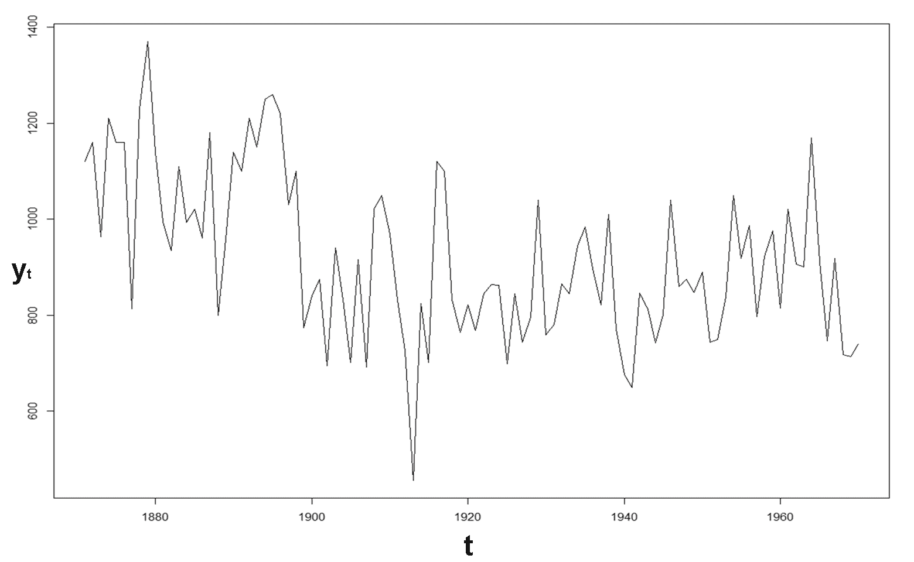

时间序列图可以立即揭示趋势或规律性振荡，以及随时间出现的其他系统性趋势。前一个图表显示了长期内系统性地下降的年度数据。特别是，它有一个锯齿状模式；由于数据是按月度计算的，存在称为**季节性**的现象。可以注意到，在预期有雨的那些月份总是记录到高峰值。

时间序列的单变量分析旨在解释生成序列的动态机制，并预测现象的未来实现。在这些操作中，所利用的信息仅限于*(t; Y[t])*这对，其中*t = 1,…, T*。基本点是过去和现在都包含与预测现象未来演化相关的信息。

可以认为单变量分析过于限制；我们通常有与要预测的现象相关的信息，这些信息应该适当融入，以提高修订模型的性能。尽管如此，它是一个有用的基准，允许验证更复杂的替代方案。

在时间序列图中，可以根据时间识别出四种类型的模式：

+   **水平模式**：在这种情况下，系列围绕一个常数值（系列平均值）波动。这种系列在平均意义上被称为**平稳的**。这是在质量控制中，当过程相对于平均值保持控制时出现的典型情况。

+   **季节性模式**：当系列受季节性因素影响时存在（例如，每月、半年、季度等）。冰淇淋、软饮料、电力消耗等产品都受到季节性现象的影响。受季节性影响的系列也被称为**周期性系列**，因为季节周期在固定周期内重复。在年度数据中，季节性不存在。

+   **周期模式**：当系列有非固定周期的增加和减少时，这种趋势类型就会出现。这是周期性和季节性波动之间的主要区别。此外，周期性振荡的幅度通常大于季节性引起的幅度。在经济系列中，周期模式由经济因猜测现象的扩张和收缩所决定。

+   **趋势或潜在趋势**：它以长期增加或减少的趋势为特征。世界居民人口系列就是一个增加趋势的例子；另一方面，月度啤酒销售系列没有显示出任何趋势。它有一个水平的背景模式。

许多系列强调了这些模式的组合。正是这种复杂性使得预测操作极其有趣。实际上，预测方法必须能够识别系列的各个组成部分，以便在未来的假设下，在它们的进化特征中继续重复过去的模式。

时间序列的经典方法基于将系列的确定性部分分解成一系列信号成分（这些成分表达系列的结构性信息）相对于可忽略的噪声部分。在实践中，我们将尝试在时间序列趋势中识别我们之前列出的一些模式。以下图显示了一个时间序列，其中已识别出一些成分：

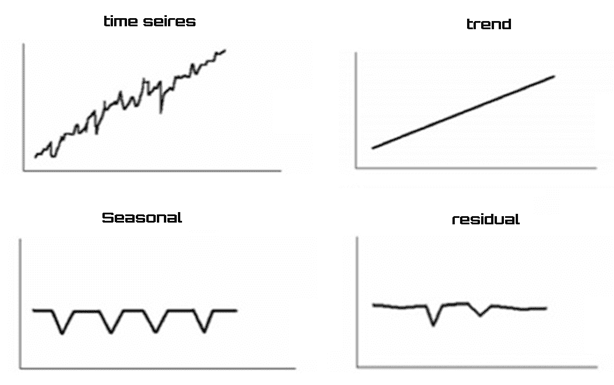

在之前的图中，我们已识别的组成部分是：

+   **趋势**：这是所考虑现象的潜在趋势，指的是一个长期的时间段。

+   **季节性**：这包括现象在一年中的运动。由于气候和社会因素的影响，它们往往在相同时期（例如，月份、季度等）以类似的方式重复出现。

+   **残差**：在时间序列模型中，观察变量与不同成分之间从未有过完美的关系。偶然成分考虑了这一点，以及经济主体、社会等方面的不可预测行为。

最后，我们可以说，采用这种方法，时间序列可以被视为分析过的三个成分的总和（加法方法）。

# 时间序列的经典方法

到目前为止，我们根据经典方法处理时间序列。在这个视角下，试图模拟现象的经典模型可以分为两种类型：

+   **组合模型**：已知基本组成部分，通过假设某种聚合形式，得到结果序列

+   **分解模型**：从观察序列中假设存在一些基本趋势，我们想要确定其特征

分解模型在实践中最常使用，因此我们将详细分析它们。

时间序列的成分可以根据不同类型的方法进行聚合：

+   **加法方法**：*Y(t) = τ(t) + C(t) + S(t) + r(t)*

+   **乘法方法**：*Y(t) = τ(t) * C(t) * S(t) * r(t)*

+   **混合方法**：*Y(t) = τ(t) * C(t) + S(t) * r(t)*

在这些公式中，因子定义为以下：

+   *Y(t)* 代表时间序列

+   *τ(t)* 代表趋势成分

+   *C(t)* 代表周期成分

+   *S(t)* 代表季节性成分

+   *r(t)* 代表残差成分

通过对时间序列成分的对数变换，乘法模型可以追溯到加法模型：

*Y(t) = τ(t) * C(t) * S(t) * r(t)*

通过对所有因子应用对数函数，这个公式变为：

*lnY(t) = lnτ(t) + lnC(t) + lnS(t) + lnr(t)*

# 趋势成分的估计

趋势成分的估计可以有两种不同的模式，这取决于线性/非线性特征。

如果序列趋势在参数上通过对数变换是线性的或可线性化的，那么这些趋势可以通过从线性回归中推导出的程序进行估计。我们可以假设一个可以用以下方程表示的多项式趋势：

*τ (t) = α[0] + α[1] t + α[2] t[2] + ... + α[q] t[q] + εt*

在这个公式中，*q* 代表多项式的次数。

根据假设的 *q* 的值，可以表示以下情况：

| **q** | **情况** |
| --- | --- |
| *0* | 获得一个常数趋势 |
| *1* | 我们得到一个线性趋势 |
| *2* | 我们得到一个抛物线趋势 |

相反，非线性行为的存在使得难以，如果不是不可能的话，识别出一个已知的函数形式 *f(t)* 来表达趋势成分。

在这些情况下，使用 MA 工具。MA 是一个移动到每个新迭代（在任何时间 *t*）从数据序列的开始到结束的算术平均值（简单或加权）。

假设我们有 *n* 个数据项：

*a1, a2, a3, ..., a^((n-1)), a^n*

以下程序被采用：

1.  首先，我们计算前三个数据的平均值，并用平均值替换中间数据

1.  然后，我们用第二组三个数据重复该程序

1.  当没有更多数据可用时，程序将耗尽

在考虑的情况下，MA 由仅三个数据组成。MA 的阶数可以扩展到 5，7，9，等等。为了使 MA 与可用数据居中，阶数必须是奇数。

# 估计季节性成分

研究历史序列的季节性可以有以下目的：

+   简单地估计季节性成分

+   一旦估计出来，就从一般课程中消除它

如果必须比较具有不同季节性的几个时间序列，唯一的方法是对它们进行季节性调整。

有几种方法可以估计季节性成分。其中之一是使用二元辅助变量（虚拟变量）的回归模型。

假设存在一个没有趋势成分的加性模型：

*Y(t) = S(t) + r(t)*

假设我们按月度测量了该序列。虚拟变量可以按以下方式定义：

+   *dj*：如果观察值 *t* 是相对于年份的第 *j* 个月，则为 1

+   *dj*：否则为 0

一旦创建了周期性虚拟变量，就可以使用以下回归模型来估计季节性成分：

*Y(t) = β[1]D[1] + β[2]D[2] + ... + β[n]D[n] + ε(t)*

模型中剩余的 *ε(t)* 部分代表序列中未被季节性解释的部分。如果序列中存在趋势成分，它将与 *ε(t)* 完全一致。

# 时间序列模型

在前面的章节中，我们探讨了时间序列的基本原理。为了根据过去发生的事件正确预测未来事件，有必要构建一个适当的数值模拟模型。选择一个合适的模型非常重要，因为它反映了序列的潜在结构。在实践中，有两种类型的模型可用：线性或非线性（取决于序列的当前值是否是过去观察值的线性或非线性函数）。

以下是最广泛用于预测时间序列数据的模型：

+   AR

+   MA

+   ARMA

+   ARIMA

# 自回归模型

AR 模型是解决与时间序列相关的预测问题的非常有用的工具。一个序列连续值之间的强相关性通常会被观察到。在这种情况下，当我们考虑相邻值时，我们谈论一阶自相关；如果我们指的是两个周期后序列值之间的关系，我们谈论二阶自相关；在一般情况下，如果考虑的值之间有 *p* 个周期，我们谈论 *p* 阶自相关。AR 模型允许利用这些联系来获得序列未来行为的有用预测。

AR 是一种线性预测建模技术。该模型试图根据使用 AR 参数作为系数的先前值来预测时间序列。用于预测的样本数量决定了模型的阶数（*p*）。正如其名称所示，这是一个变量的自回归；也就是说，使用变量的过去值的线性组合来预测未来值。阶数为 *p* 的 AR 模型定义为：

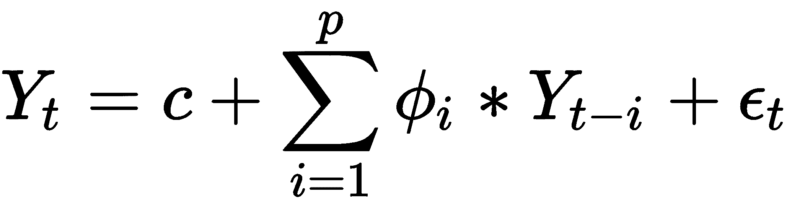

在前面的公式中，术语定义如下：

+   *Y[t]* 是时间周期 *t* 的实际值

+   *c* 是一个常数

+   *ϕ[i] (i = 1,2,..., p)* 是模型参数

+   *Y[t-i]* 是时间周期 *t-i* 的过去值

+   *ε[t]* 是时间周期 *t* 的随机误差（白噪声）

可能会发生常数项被省略的情况；这样做是为了使模型尽可能简单。

# 移动平均模型

MA 模型规定输出变量线性依赖于随机项（不可完全预测）的过去和当前过去值。MA 模型不应与我们在前几节中看到的 MA 混淆。这是一个本质上不同的概念，尽管有一些相似之处。与 AR 模型不同，完成的 MA 模型总是平稳的。

正如 AR (*p*) 模型相对于序列的过去值进行回归一样，MA (*q*) 模型使用过去误差作为解释变量。

阶数为 *q* 的 MA 模型定义为：

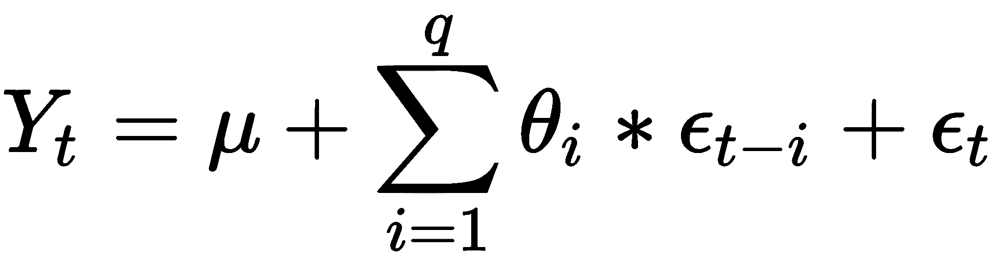

在前面的公式中，术语定义如下：

+   *Y[t]* 是时间周期 *t* 的实际值

+   *μ* 是序列的均值

+   *θ[i] (i = 1,2,..., q)* 是模型参数

+   *ε[t-i]* 是时间周期 *t-i* 的过去随机误差

+   *ε[t]* 是时间周期 *t* 的随机误差（白噪声）

MA 模型本质上是对白噪声应用有限脉冲响应滤波器，并对它附加了一些额外的解释。

# 自回归移动平均模型

ARMA 是一种线性数学模型，它基于先前输入和输出值即时提供输出值。该系统被视为一个实体，它即时接收输入值（输入）并生成输出（输出），基于内部参数，这些参数根据线性规律变化。因此，每个内部参数在每个瞬间等于前一个瞬间的所有内部参数的线性组合和输入值。输出值反过来又将是内部参数的线性组合，在罕见情况下，也可能是输入值。

更简单地说，ARMA 可以看作是 AR 和 MA 模型的有效组合，形成了一类通用且有用的时序模型。

该模型通常定义为 ARMA 模型 *(p, q)*，其中 *p* 是自回归部分的阶数，*q* 是移动平均部分的阶数。ARMA 模型由以下公式定义：

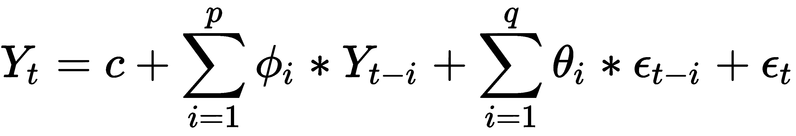

术语定义如下：

+   *Y[t]* 是时间周期 *t* 的实际值

+   *c* 仍然是一个常数

+   *ϕ[i] (i = 1,2,..., p)* 是自回归模型参数

+   *Y[t-i]* 是时间周期 *t-i* 的过去值

+   *θ[i] (i = 1,2,..., q)* 是移动平均模型参数

+   *ε[t-i]* 是时间周期 *t-i* 的过去随机误差

+   *ε[t]* 是时间周期 *t* 的随机误差（白噪声）

通常，一旦选择了阶数 *(p, q)*，ARMA 模型 *(p, q)* 的参数可以通过最大似然估计器进行估计，例如。至于 AR 模型，模型阶数的选择必须满足对数据良好适应和参数估计数量简约性的对立需求。

# 自回归积分移动平均模型

ARIMA 模型是 ARMA 模型的一种推广。ARIMA 模型适用于数据表现出明显的非平稳趋势的情况。在这些情况下，为了消除非平稳性，在 ARMA 算法（对应于模型的积分部分）中添加了一个初始微分步骤，该步骤应用一次或多次。

因此，该算法本质上由三个部分组成：

+   自回归部分决定了对其自身延迟（即先前）值进行回归的演变变量。

+   MA 部分。它表示回归误差实际上是过去同时发生并在不同时间出现的误差项的线性组合。

+   积分部分；它表示数据值已被替换为它们当前值与先前值之间的差值（并且这种微分过程可能已经执行过多次）。

每个这些特征的目的都是为了以最佳方式使模型适合数据。

为了制定 ARIMA 模型的代表性方程，我们从 ARMA 模型方程开始：


简单地将 AR 部分移到方程的右侧，得到以下方程（小于常数 *c*）：

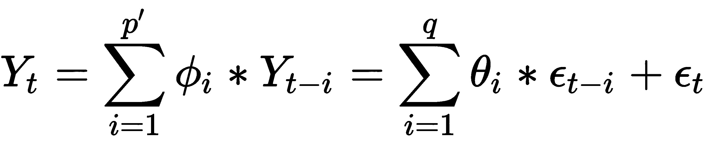

通过引入滞后算子 (*L*)，我们可以将这个方程重写如下：

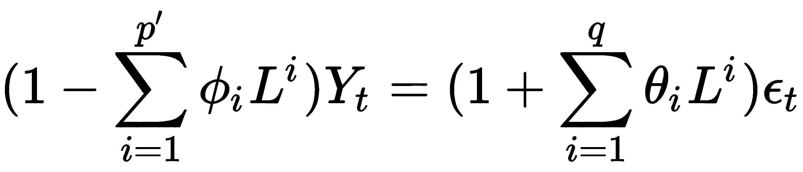

记住：滞后算子 (*L*) 对时间序列的一个元素进行操作，以产生前一个元素，其含义是 *LY[t] = Y[t-1]*。

假设如下：

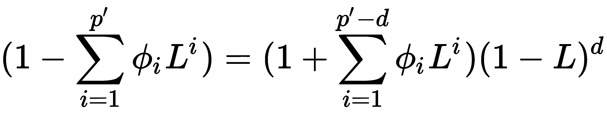

这精确地表达了之前为了消除非平稳性而进行的 *d* 阶因式分解过程。基于这个假设并设置 *p = p'-d*，我们可以写出以下方程来表示 ARIMA *(p,d,q)* 模型的数学公式，使用滞后多项式：

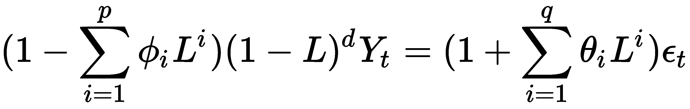

*d* 参数控制着区分的程度。通常情况下，*d=1* 就足够了。

# 从时间序列中去除季节性

在经济和金融分析中，这些分析通常基于众多指标，使用季节性调整形式（即净去季节性波动）的数据被广泛使用，以便更清楚地把握所考虑现象的短期演变。

在时间序列的动态中，季节性是每年以固定间隔重复出现的成分，在连续年份的同一时期（月份、季度、学期等）中强度变化或多或少相似；在同年中强度不同。这种类型的典型例子是 8 月份在许多公司假期关闭后工业生产的下降，以及 12 月份由于假日季节零售销售的上升。

季节性波动，伪装其他感兴趣的运动（通常是周期性波动），在分析经济周期时通常被视为一种干扰。季节性的存在会在例如分析历史序列中两个连续时期（月份和季度）之间观察到的变化时造成问题——所谓的**经济波动**。这些波动通常在很大程度上受到季节性波动的影响，而不是其他原因（例如，经济周期）的影响。另一方面，可以通过在季节性调整后的数据上计算经济波动来正确地突出显示后者。此外，由于每个时间序列都有其特定的季节性特征，使用季节性调整后的数据使得比较不同时间序列的演变成为可能，并且在联合使用不同国家产生的统计数据时得到了广泛应用。

# 分析时间序列数据集

要了解如何在时间序列上执行季节性移除操作，我们将使用关于月度牛奶产量（每头牛的磅数；1962 年 1 月 – 1975 年 12 月）的数据集。以下是关于此数据集的一些有用信息：

+   **单位**：每头牛的磅数

+   **数据集度量**：一个时间序列中的 168 个事实值

+   **时间粒度**：月份

+   **时间范围**：1962 年 1 月 – 1975 年 12 月

+   **来源**：时间序列数据库

**时间序列数据库**（**TSDL**）是由澳大利亚莫纳什大学统计学教授 Rob Hyndman 创建的。

数据存储在一个名为 `milk-production-pounds.csv` 的 `.csv` 文件中。首先，让我们看看如何将数据导入 Python，然后如何显示它以识别可能存在的季节性。首先要做的事情是导入我们将要使用的库：

```py
import pandas as pd
import matplotlib.pyplot as plt
```

在第一行中，我们导入了 `pandas` 库，在第二行中，我们导入了来自 `matplotlib` 库的 `pyplot` 模块。

`pandas` 是一个开源的 BSD 许可库，为 Python 编程语言提供高性能、易于使用的数据结构和数据分析工具。特别是，它提供了用于操作数值表和时间序列的数据结构和操作。

Matplotlib 是一个 Python 2D 绘图库，可以在各种硬拷贝格式和跨平台的交互式环境中生成出版物质量的图形。Matplotlib 可以用于 Python 脚本、Python 和 IPython Shell、Jupyter Notebook、Web 应用服务器以及四个图形用户界面工具包。`matplotlib.pyplot` 模块包含允许您快速生成许多类型图表的函数。现在让我们看看如何在 Python 中导入数据集中包含的数据：

```py
data = pd.read_csv('milk-production-pounds.csv',
               parse_dates=True,index_col='DateTime',
               names=['DateTime', 'Milk'], header=None)
```

要导入数据集，我们使用了 `pandas` 库的 `read_csv` 模块。`read_csv` 方法将数据加载到我们命名为 `data` 的 Pandas DataFrame 中。为了显示视频导入的 DataFrame 的前五行，我们可以使用 `head()` 函数如下：

```py
print(data.head())
```

以下结果返回：

```py
DateTime     Milk
1962-01-01   589
1962-02-01   561
1962-03-01   640
1962-04-01   656
1962-05-01   727
```

`head()` 函数不带任何参数时，从 DataFrame 中获取前五行数据。现在时间序列已在我们的 Python 环境中可用；为了预览其中包含的数据，我们可以计算一系列基本统计量。为此，我们将使用以下方式的 `describe()` 函数：

```py
print(data.describe())
```

以下结果返回：

```py
 Milk
count  168.000000
mean   754.708333
std    102.204524
min    553.000000
25%    677.750000
50%    761.000000
75%    824.500000
max    969.000000
```

`describe()` 函数生成描述性统计量，用于总结数据集分布的中心趋势、离散程度和形状，排除 NaN 值。它分析数值和对象序列，以及混合数据类型的 DataFrame 列集。输出将根据提供的内容而变化。为了提取更多信息，我们可以按照以下方式调用 `info()` 函数：

```py
print(data.info())
```

以下结果返回：

```py
<class 'pandas.core.frame.DataFrame'>
DatetimeIndex: 168 entries, 1962-01-01 to 1975-12-01
Data columns (total 1 columns):
Milk    168 non-null int64
dtypes: int64(1)
memory usage: 2.6 KB
None
```

在查看数据集的内容之后，我们将进行初步的视觉探索性分析。Pandas 内置了相对广泛的绘图功能，可用于探索性图表——特别是在数据分析中非常有用。Pandas 的 `.plot()` 命令本身提供了大量的功能：

```py
data.plot()
plt.show()
```

`data.plot()` 命令使用 `matplotlib`/`pylab` 绘制 DataFrame 的图表。为了在视频中显示刚刚创建的图表，我们必须使用 `plt.show()` 函数，如下面的图表所示：

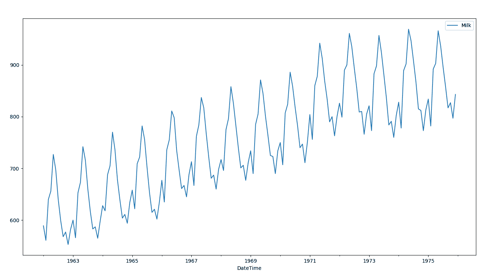

从前一个图表的分析中，我们可以肯定地认识到牛奶产量正在增长（我们注意到一个正向趋势），但同时也表现出一定的可变性（围绕假设趋势线的波动）。这种状态几乎随着时间的推移而持续不变。

# 识别时间序列中的趋势

如果我们想要尝试预测下一个月的牛奶产量，我们可以这样思考：有了获取到的数据，我们可以追踪趋势线并将其延伸到下一个月。这样，我们就可以对即将到来的未来牛奶产量有一个粗略的估计。

但追踪趋势线意味着追踪回归线。线性回归方法包括精确地确定一条能够代表二维平面上点分布的线。正如容易想象的那样，如果对应于观察点的点靠近这条线，那么选定的模型将能够有效地描述变量之间的联系。在理论上，有无限多条可能近似观察点的线。在实践中，只有一个数学模型能够优化数据的表示。

要拟合线性回归模型，我们首先需要导入两个额外的库：

```py
import numpy
from sklearn.linear_model import LinearRegression
```

NumPy 是 Python 科学计算的基础包。它包含，但不仅限于：

+   一个强大的 N 维数组对象

+   复杂的（广播）功能

+   用于集成 C/C++ 和 FORTRAN 代码的工具

+   有用的线性代数、傅里叶变换和随机数功能

除了其明显的科学用途外，NumPy 还可以用作高效的多维通用数据容器。可以定义任意数据类型。这使得 NumPy 能够无缝且快速地与各种数据库集成。

sklearn 是一个用于 Python 编程语言的免费软件机器学习库。它包含各种分类、回归和聚类算法，包括支持向量机、随机森林、梯度提升、k-means 和 DBSCAN，并且设计为与 Python 的数值和科学库 NumPy 和 SciPy 兼容。

记住，要导入 Python 初始分布中不存在的库，你必须使用`pip install`命令后跟库的名称。这个命令应该只使用一次，而不是每次运行代码时都使用。

我们开始准备数据：

```py
X = [i for i in range(0, len(data))]
X = numpy.reshape(X, (len(X), 1))
y = data.values
```

首先，我们统计了数据；然后我们使用`reshape()`函数给一个数组赋予新的形状而不改变其数据。最后，我们将时间序列值插入到`y`变量中。现在我们可以构建线性回归模型：

```py
LModel = LinearRegression()
```

`LinearRegression()`函数执行普通最小二乘线性回归。普通最小二乘法是一种优化技术（或回归），它允许我们找到一个函数，该函数由一个最优曲线（或回归曲线）表示，该曲线尽可能接近一组数据。特别是，找到的函数必须是最小化观测数据与代表该函数本身的曲线之间的距离平方和的函数。

给定观察群体中的 n 个点(*x[1]*, *y[1]*), (*x[2]*, *y[2]*), ... (*x[n]*, *y[n]*)，最小二乘回归线定义为方程线：

*y=α*x+β*

对于以下量是最小的：

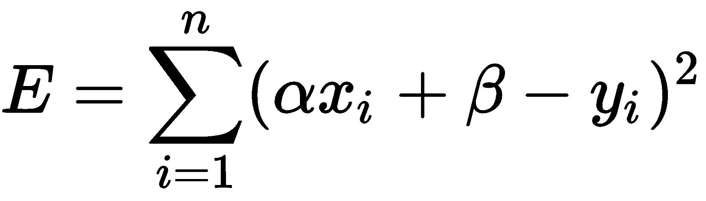

这个量表示每个实验数据(*x[i], y[i]*)到对应直线上的点(*x[i], αx[i]+β*)的距离平方和，如下所示：

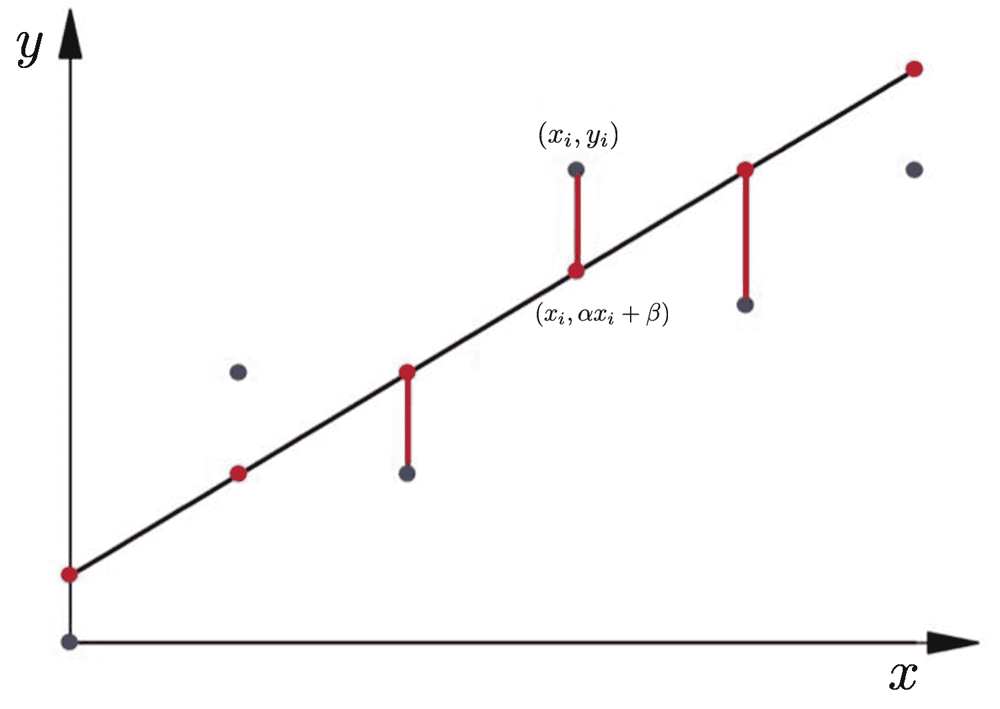

现在，我们必须应用`fit`方法来拟合线性模型：

```py
LModel.fit(X, y)
```

线性回归模型基本上找到截距和斜率的最佳值，从而得到一条最佳拟合数据的直线。为了查看线性回归算法为我们数据集计算出的截距和斜率的值，执行以下代码：

```py
print(LModel.intercept_,LModel.coef_)
```

返回以下结果：

```py
[613.37496478] [[1.69261519]]
```

第一个是截距；第二个是回归线的系数。现在我们已经训练了我们的算法，是时候进行一些预测了。为了做到这一点，我们将使用全部数据并查看我们的算法预测百分比分数的准确性。记住，我们的目标是定位时间序列趋势。要对全部数据进行预测，执行以下代码：

```py
trend = LModel.predict(X)
```

是时候可视化我们所取得的成果了：

```py
plt.plot(y)
plt.plot(trend)
plt.show()
```

使用这段代码，我们首先追踪了时间序列。因此，我们添加了代表数据趋势的回归线，最后我们将整个图表打印出来，如下所示：

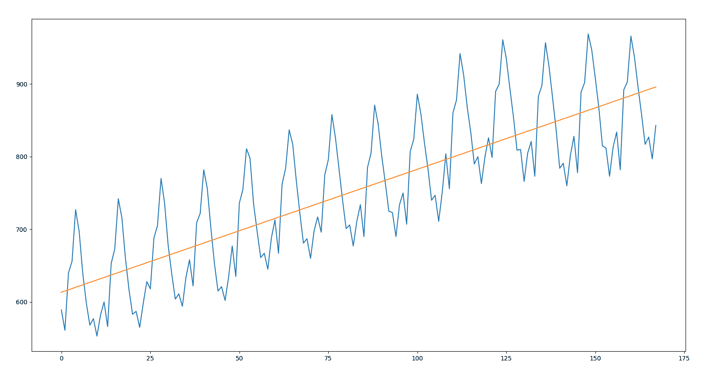

我们回顾一下，这代表了一种长期单调趋势运动，突出了由于在相同方面系统作用的原因而产生的现象的结构演变。从前图的分析中，我们可以注意到这一点：基于表示时间序列趋势的线条对精确时期牛奶产量进行估计，在某些情况下可能是灾难性的。这是因为季节性高点和低点与回归线的距离很重要。很明显，不能使用这条线来估计牛奶产量。

# 时间序列分解

时间序列经典分析的一个基本目的是将序列分解为其组成部分，以便更好地研究它们。此外，为了能够将随机方法应用于时间序列，通常几乎总是需要消除趋势和季节性，以获得稳定的过程。正如我们在前面的章节中指定的那样，时间序列的组成部分通常是以下这些：趋势、季节性、周期和残差。

如前所述，它们可以通过加法方式分解：

*Y(t) = τ(t) + S(t) + r(t)*

它们也可以通过乘法方法分解：

*Y(t) = τ(t) * S(t) * r(t)*

在接下来的章节中，我们将探讨如何使用这两种方法推导出这些成分。

# 加法方法

要进行时间序列分解，我们可以使用自动化程序。`stats`模型库提供了一个名为`seasonal_decompose()`的函数，实现了朴素或经典分解方法的实现。加法或乘法方法都是可用的。

我们开始导入`stats`模型库：

```py
from statsmodels.tsa.seasonal import seasonal_decompose
```

尤其是我们导入了`seasonal_decompose`模块，使用移动平均（MAs）进行季节分解。我们通过应用加法方法进行分解：

```py
DecompDataAdd = seasonal_decompose(data, model='additive', freq=1)
```

通过对数据进行卷积滤波器处理，首先移除季节成分。每个周期的平滑序列的平均值即为返回的季节成分。让我们通过识别成分的可视化来看看发生了什么：

```py
DecompDataAdd.plot()
plt.show()
```

下图显示了加法方法的分解结果：

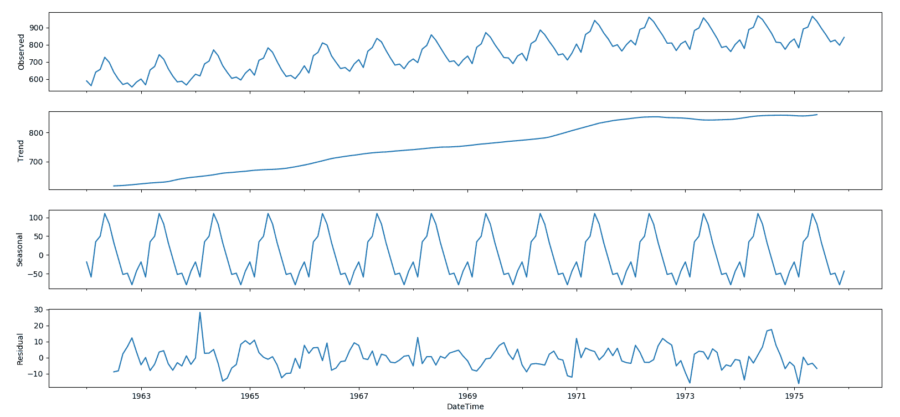

在此图中，时间序列的三个成分被清晰地表示出来：趋势、季节和残差。这些属性包含在`seasonal_decompose()`方法返回的对象中。这意味着我们可以使用该对象的内容来从时间序列中去除季节性影响。让我们看看如何：

```py
SeasRemov= data-DecompDataAdd.seasonal
```

通过这一行代码，我们已经简化了`seasonal_decompose()`方法从数据返回的季节性属性。此时，我们只需可视化结果：

```py
SeasRemov.plot()
plt.show()
```

下图显示了去除季节性后的月度牛奶产量（1962 年 1 月至 1975 年 12 月每头牛的磅数）：

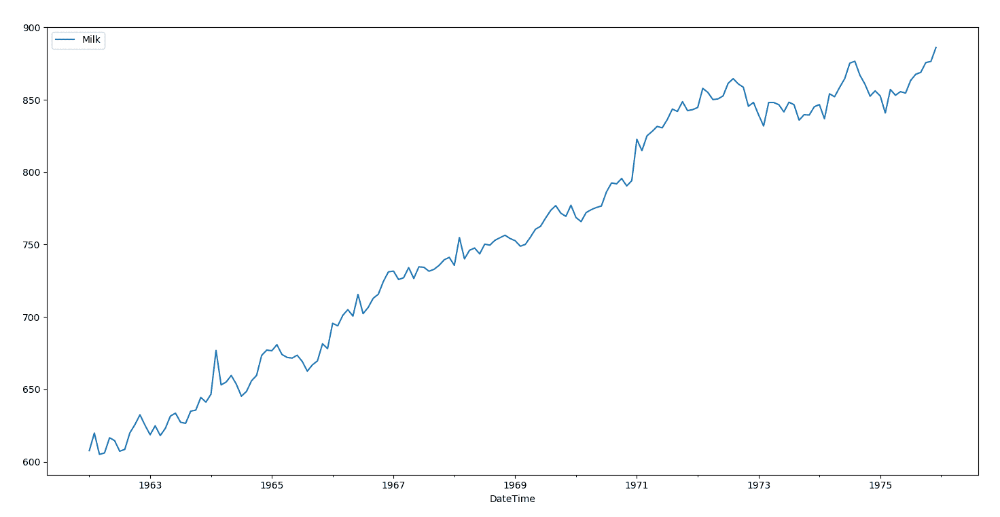

在获得的图表中，由于季节性而产生的成分已被清楚地去除，而由于趋势而产生的成分则清晰可见。

# 乘法方法

正如我们所说的，`seasonal_decompose()`执行加法和乘法分解。要运行乘法方法，只需键入以下命令：

```py
DecompDataMult = seasonal_decompose(data, model='multiplicative')
```

到目前为止，我们只需可视化结果：

```py
DecompDataMult.plot()
plt.show()
```

下面的图表显示了乘法方法的分解结果：

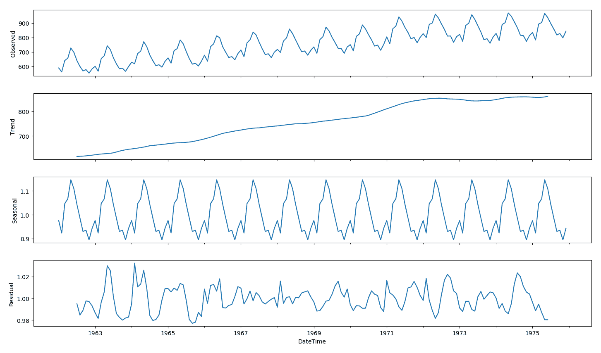

在上一幅图中，我们可以注意到从时间序列中提取的趋势和季节性信息似乎相当合理。残差显示出有趣的变异；在时间序列的早期和后期，高变异性时期被清楚地识别出来。

# 用于时间序列分析的 LSTM

LSTM 是一种由 Hochreiter 和 Schmidhuber 在 1997 年最初构思的循环神经网络特定架构。这种类型的神经网络最近在深度学习背景下被重新发现，因为它摆脱了梯度消失的问题，并且在实践中提供了出色的结果和性能。

基于 LSTM 的网络非常适合时间序列的预测和分类，并且正在取代许多经典的机器学习方法。这是因为 LSTM 网络能够考虑数据之间的长期依赖关系，在语音识别的情况下，这意味着管理句子中的上下文以提高识别能力。

# 时间序列数据集概述

来自美国**国家海洋和大气管理局**（**NOAA**）的科学家们从 1965 年到 1980 年在夏威夷莫纳罗亚火山锥顶部（顶部）测量了大气二氧化碳。该数据集覆盖了 317.25 到 341.19 **百万分之一**（**ppm**）的二氧化碳浓度，并包含 192 个月的记录。以下是关于此数据集的一些有用信息：

+   **单位**：ppm

+   **数据集指标**：一个时间序列中有 192 个事实值

+   **时间粒度**：月

+   **时间范围**：1965 年 1 月-1980 年 12 月

来源：TSDL，由澳大利亚莫纳什大学统计学教授 Rob Hyndman 创建。

数据可在名为`co2-ppm-mauna-loa-19651980.csv`的`.csv`文件中找到。首先，让我们看看如何将数据导入 Python，然后如何显示它们以识别可能存在的季节性。首先要做的事情是导入我们将要使用的库：

```py
import pandas as pd
import matplotlib.pyplot as plt
```

在第一行中，我们导入了`pandas`，在第二行中，我们导入了来自`matplotlib`库的`pyplot`模块。现在让我们看看如何在 Python 中导入数据集中的数据：

```py
dataset = pd.read_csv(' co2-ppm-mauna-loa-19651980.csv',
               parse_dates=True,index_col='DateTime',
               names=['DateTime', 'CO2'], header=None)
```

要导入数据集，我们使用了`pandas`库的`read_csv`模块。`read_csv`方法将数据加载到我们命名为`dataset`的 Pandas DataFrame 中。为了在视频中显示导入的 DataFrame 的前五行，我们可以使用以下`head()`函数：

```py
print(dataset.head())
```

返回以下结果：

```py
DateTime    CO2
1965-01-01  319.32
1965-02-01  320.36
1965-03-01  320.82
1965-04-01  322.06
1965-05-01  322.17
```

`head()`函数不带参数时，从 DataFrame 中获取前五行数据。现在时间序列已经存在于我们的 Python 环境中；为了预览其中的数据，我们可以计算一系列基本统计信息。为此，我们将使用以下方式的`describe()`函数：

```py
print(dataset.describe())
```

返回以下结果：

```py
 CO2
count  192.000000
mean   328.463958
std      5.962682
min    317.250000
25%    323.397500
50%    328.295000
75%    333.095000
max    341.190000
```

`describe()`函数生成描述性统计信息，总结数据集分布的中心趋势、离散度和形状，排除 NaN 值。它分析数值和对象序列，以及混合数据类型的 DataFrame 列集。输出将根据提供的内容而变化。为了提取更多信息，我们可以调用`info()`函数：

```py
print(data.info())
```

返回以下结果：

```py
<class 'pandas.core.frame.DataFrame'>
DatetimeIndex: 192 entries, 1965-01-01 to 1980-12-01
Data columns (total 1 columns):
CO2    192 non-null float64
dtypes: float64(1)
memory usage: 3.0 KB
```

在查看数据集的内容之后，我们将进行初步的视觉探索性分析。Pandas 内置了相对广泛的绘图功能，可用于探索性图表；这在数据分析中特别有用。Pandas 的`.plot()`命令提供了大量的功能：

```py
dataset.plot()
plt.show()
```

`dataset.plot()`命令使用`matplotlib`/`pylab`绘制 DataFrame 的图表。为了在视频中显示刚刚创建的图表，我们必须使用`plt.show()`函数，如下面的图表所示：

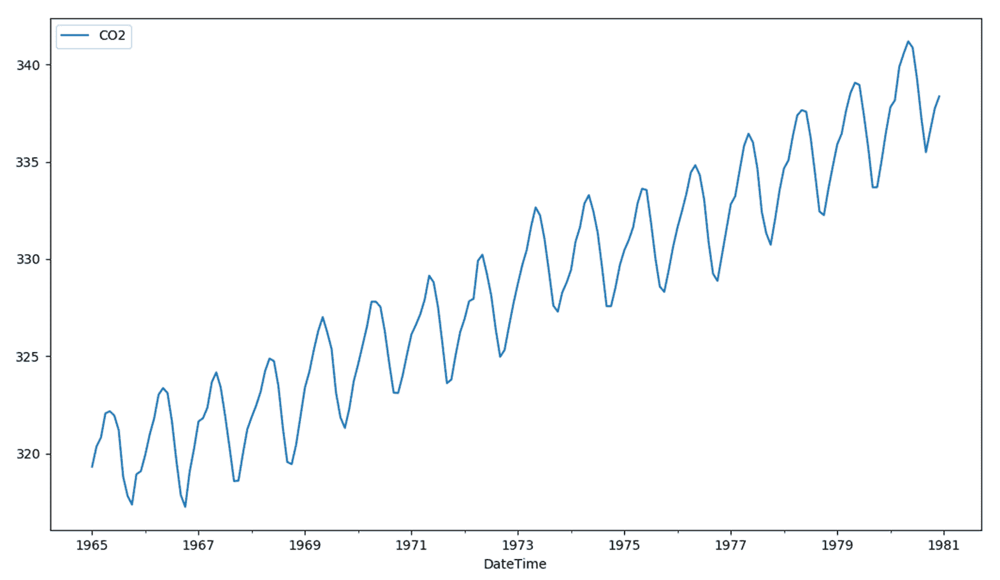

从前一个图的分析中，我们可以肯定地认识到大气二氧化碳正在增长。我们注意到一个正向趋势。但这也表明了一定的可变性（围绕假设趋势线的振荡），这种可变性几乎随着时间的推移而持续保持。

# 数据缩放

**数据缩放**是一种预处理技术，通常在特征选择和分类之前使用。许多基于人工智能的系统使用由许多不同的特征提取算法生成的特征，这些算法来自不同的来源。这些特征可能具有不同的动态范围。

此外，在具有大量特征和较大动态范围的数据挖掘应用中，特征缩放可能会提高拟合模型的性能。然而，选择这些技术是重要的问题，因为对输入数据进行缩放可能会改变数据的结构，从而影响数据挖掘中使用的多元分析结果。

为了对数据进行缩放，我们将使用最小-最大归一化（通常称为**特征缩放**）；它对原始数据进行线性变换。这种技术将所有缩放数据都转换到（0,1）的范围内。实现这一目标的公式是：


最小-最大归一化保留了原始数据值之间的关系。这种有界范围的代价是我们最终会得到较小的标准差，这可能会抑制异常值的影响。

为了执行最小-最大归一化，我们将使用`sklearn.preprocessing`类的`MinMaxScaler()`模块。此模块通过将每个特征缩放到给定范围来转换特征。这个估计器将每个特征单独缩放和转换，使其在训练集上位于给定的范围内，即零到一之间。以下代码显示了如何将此模块应用于我们的数据：

```py
scaler = MinMaxScaler()
dataset = scaler.fit_transform(dataset)
```

首先，我们使用了`MinMaxScaler()`函数来设置归一化区间（默认为（0，1））。在代码的第二行中，我们应用了`fit_transform()`函数；它将转换器拟合到数据集，并返回数据的转换版本。这个函数特别有用，因为它存储了使用的转换参数。这些参数在做出预测后，我们将需要将这些数据以初始形式（归一化之前）报告出来，以便与实际数据进行比较。

# 数据拆分

现在我们来拆分用于训练和测试模型的数据。训练和测试模型是进一步使用模型进行预测分析的基础。给定 192 行数据的数据集，我们将其拆分为一个方便的比例（比如说 70:30），并将 134 行分配给训练，58 行分配给测试。

通常，在基于人工神经网络的算法中，拆分是通过随机选择行来进行的，以减少偏差。对于时间序列数据，值的顺序很重要，因此这个程序不可行。我们可以使用的一个简单方法是按照顺序将数据集分为训练集和测试集。正如我们所预期的，以下代码计算了分割点索引，并在训练数据集中分离数据，其中 70%的观测值用于训练我们的模型；这留下了剩余的 30%用于测试模型：

```py
train_len = int(len(dataset) * 0.70)
test_len  = len(dataset) - train_len
train = dataset[0:train_len,:]
test  = dataset[train_len:len(dataset),:]
```

代码的前两行设置了两组数据长度。接下来的两行将数据集分为两部分：从第 1 行到`train_len -1`行用于训练集，从`train_len`行到最后一行用于测试集。为了确认数据的正确拆分，我们可以打印两个数据集的长度：

```py
print(len(train), len(test))
```

这给出了以下结果：

```py
134 58
```

正如我们所预期的，这个操作将数据集分为`134`行（训练集）和`58`行（测试集）。

# 构建模型

我们的目标是利用数据集中的数据来进行预测。具体来说，我们希望根据`.csv`文件中可用的数据预测空气中二氧化碳的存在。我们需要输入和输出数据来训练和测试我们的网络。很明显，输入由数据集中存在的数据表示。然后我们必须构建我们的输出；我们将通过假设我们想要预测时间`t + 1`时大气中存在的 CO2 相对于时间`t`时测量的值来做到这一点。所以我们将有：

*输入 = data(t)*

*输出 = data(t + 1)*

我们已经说过，循环网络具有记忆功能，并且通过固定所谓的**时间步**来维持。时间步与在训练期间计算权重更新梯度的反向传播中回溯的时间步数有关。这样，我们设置 *时间步 = 1*。然后我们定义一个函数，它接受一个数据集和一个时间步返回输入和输出数据：

```py
def dataset_creating(dataset):
   Xdata, Ydata = [], []
   for i in range(len(dataset)-1):
         Xdata.append(dataset[i, 0])
         Ydata.append(dataset[i + 1, 0])
   return numpy.array(Xdata), numpy.array(Ydata)
```

在此函数中，`Xdata=Input= data(t)` 是输入变量，`Ydata=output= data(t + 1)` 是下一个时间段的预测值。让我们使用这个函数来设置下一阶段（网络建模）中我们将使用的训练和测试数据集：

```py
trainX, trainY = create_dataset(train)
testX, testY = create_dataset(test)
```

以这种方式，我们创建了网络训练和测试所需的所有数据。此函数将值数组转换为数据集矩阵。现在我们必须准备两个输入数据集（`trainX` 和 `testX`），以符合我们打算使用的机器学习算法（LSTM）所需的形式。为此，有必要深化这一概念。

在一个经典的正向传播网络中，如前几章已分析的，输入包含每个观测变量所假设的值。这意味着输入具有以下形状：

*(观测数量，特征数量)*

在 LSTM/RNN 网络中，每个 LSTM 层的输入必须包含以下信息：

+   **观测**：收集到的观测数量

+   **时间步**：样本中的一个观测点

+   **特征**：每个步骤一个特征

因此，有必要为那些经典网络预见的添加一个时间维度。因此，输入形状变为：

*(观测数量，时间步数，每步特征数量)*

以这种方式，每个 LSTM 层的输入变为三维。为了将输入数据集转换为 3D 形式，我们将使用以下 `numpy.reshape()` 函数：

```py
trainX = numpy.reshape(trainX, (trainX.shape[0], 1, 1))
testX = numpy.reshape(testX, (testX.shape[0], 1, 1))
```

`numpy.reshape()` 函数在不改变其数据的情况下，为数组赋予新的形状。所使用的函数参数包括：

+   `trainX`，`testX`：需要重塑的数组

+   `(trainX.shape[0], 1, 1)`，`(testX.shape[0], 1, 1)`：新形状

新形状应该与原始形状兼容。在我们的例子中，新形状是 `trainX` 的 (133,1,1) 和 `testX` 的 (57,1,1)。现在数据已经以正确的格式，是时候创建模型了：

```py
timesteps = 1
model = Sequential()
```

我们开始定义时间步；然后我们使用一个顺序模型，即层的线性堆叠。要创建一个顺序模型，我们必须将层实例的列表传递给构造函数。我们也可以通过 `.add()` 方法简单地添加层：

```py
model.add(LSTM(4, input_shape=(1, timesteps)))
model.add(Dense(1))
```

第一层是一个 LSTM 层，包含四个 LSTM 块的隐藏层。模型需要知道它应该期望的输入形状。因此，我们向这个层传递了一个 `input_shape` 参数。在下一行，我们添加了一个实现默认 sigmoid 激活函数的密集层。现在，我们必须为训练配置模型：

```py
model.compile(loss='mean_squared_error', optimizer='adam')
```

为了做到这一点，我们使用了编译模块。传递的参数是一个损失函数`mean_squared_error`和随机梯度下降`optimizer`。最后，我们可以拟合模型：

```py
model.fit(trainX, trainY, epochs=1000, batch_size=1, verbose=2)
```

在训练阶段，使用`trainX`和`trainY`数据，共 1,000 个 epoch（在训练集上的完整训练周期）。传递一个批大小为 1（batch_size = 每个梯度更新中的样本数）。最后`verbose=2`（verbose 参数提供了关于计算机正在做什么的额外细节）打印出每个 epoch 的损失值。

# 进行预测

我们的模式现在已准备好使用。因此，我们可以用它来执行我们的预测：

```py
trainPred = model.predict(trainX)
testPred = model.predict(testX)
```

使用了`predict()`模块，它为输入样本生成输出预测。计算是在批处理中完成的。返回一个预测的 Numpy 数组。之前，当执行数据缩放时，我们使用了`fit_transform()`函数。正如我们所说的，这个函数特别有用，因为它存储了使用的转换参数。这些参数在做出预测后，当我们必须将数据报告为初始形式（在归一化之前），以便与实际数据进行比较时将是有用的。事实上，现在必须以原始形式报告预测，以便与实际值进行比较：

```py
trainPred = scaler.inverse_transform(trainPred)
trainY = scaler.inverse_transform([trainY])
testPred = scaler.inverse_transform(testPred)
testY = scaler.inverse_transform([testY])
```

这个代码块仅用于取消归一化的影响，并将数据集恢复到初始形式。为了估计算法的性能，我们将计算均方根误差：

```py
trainScore = math.sqrt(mean_squared_error(trainY[0], trainPred[:,0]))
print('Train Score: %.2f RMSE' % (trainScore))
testScore = math.sqrt(mean_squared_error(testY[0], testPred[:,0]))
print('Test Score: %.2f RMSE' % (testScore))
```

**均方根误差**（**RMSE**）衡量两个数据集之间的误差程度。换句话说，它比较了一个预测值和一个观察值。

返回以下结果：

```py
Train Score: 1.12 RMSE
Test Score: 1.35 RMSE
```

在评估了方法性能之后，我们现在可以通过绘制适当的图表来可视化结果。为了正确显示时间序列，需要进行预测偏移。这个操作必须在训练集和测试集上执行：

```py
trainPredPlot = numpy.empty_like(dataset)
trainPredPlot[:,:] = numpy.nan
trainPredPlot[1:len(trainPred)+1,:] = trainPred
```

然后在测试集上执行相同的操作：

```py
testPredPlot = numpy.empty_like(dataset)
testPredPlot[:,:] = numpy.nan
testPredPlot[len(trainPred)+2:len(dataset),:] = testPred
```

最后，我们必须绘制实际数据和预测：

```py
plt.plot(scaler.inverse_transform(dataset))
plt.plot(trainPredPlot)
plt.plot(testPredPlot)
plt.show()
```

在以下图表中显示了实际数据和预测：

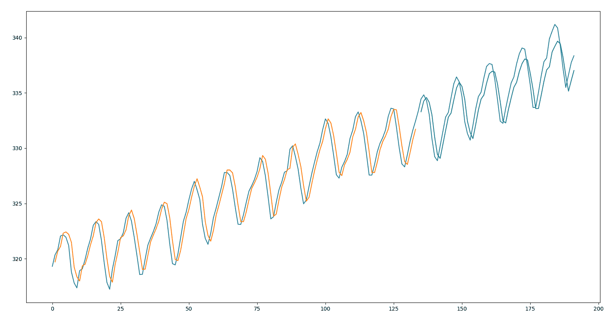

从前一个图表的分析中，我们可以看到 RMSE 报告的内容得到了图表的证实。事实上，我们可以看到模型在训练集和测试集的拟合方面做得非常出色。

# 摘要

在本章中，我们探讨了时间序列数据。时间序列构成了一系列现象的观察序列。在一个时间序列中，我们可以识别出几个组成部分：趋势、季节性、周期和残差。我们通过一个实际例子学习了如何从一个时间序列中去除季节性。

然后讨论了表示时间序列的最常用的模型：AR、MA、ARMA 和 ARIMA。对于每一个，我们分析了基本概念，然后提供了模型的数学公式。

最后，提出了一种用于时间序列分析的长短期记忆（LSTM）模型。通过一个实际例子，我们可以看到如何使用 LSTM 类型的循环神经网络模型来处理时间序列回归问题。
