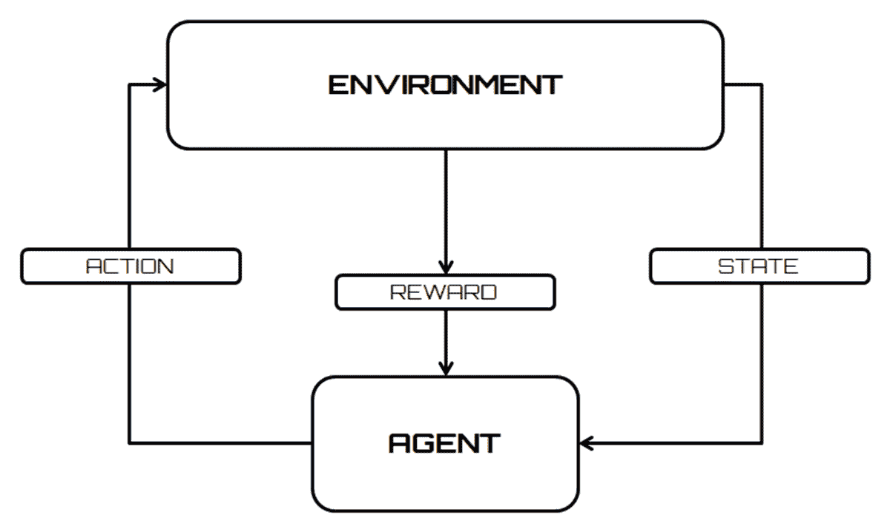
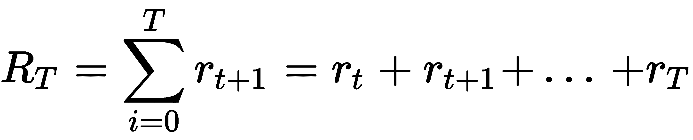
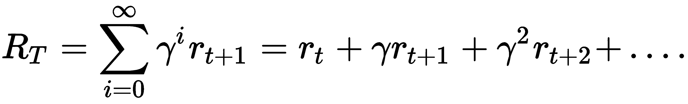
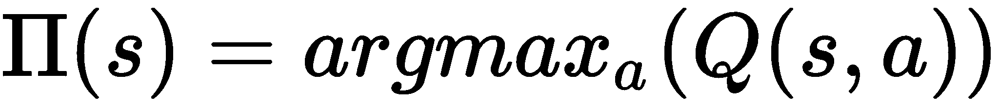
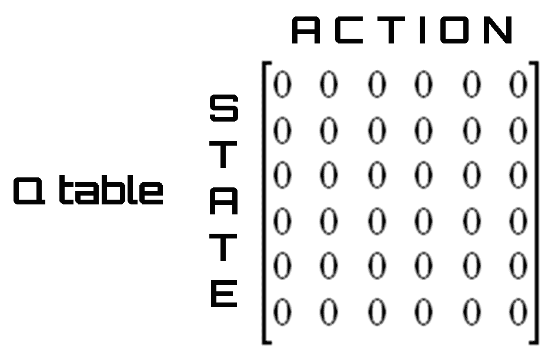
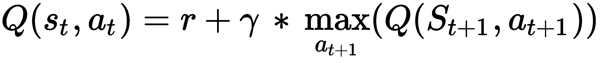
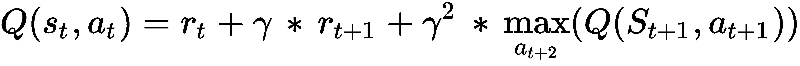
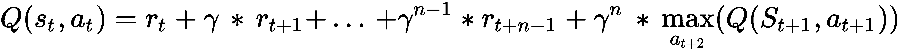
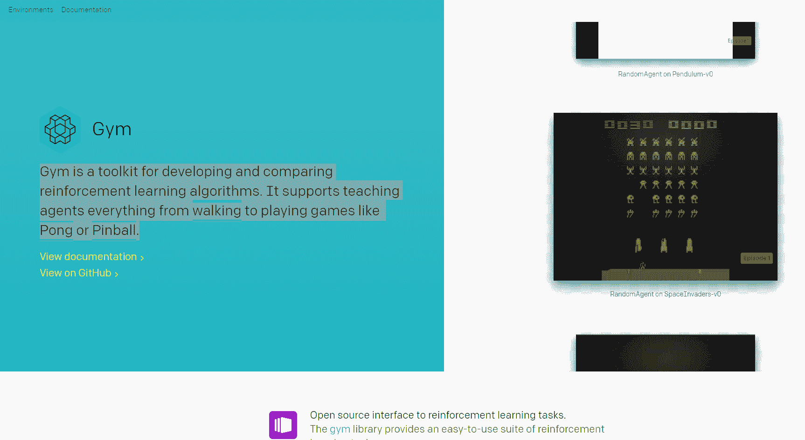
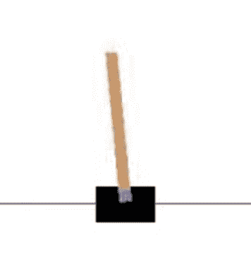

# 第十五章：强化学习

现在，大多数计算机都是基于符号化处理。问题是首先编码在一系列变量中，然后使用一个显式算法进行处理，该算法为问题的每个可能输入提供适当的输出。然而，有些问题通过显式算法的解决既低效甚至不自然，例如，语音识别器；用经典方法处理这类问题是不高效的。这类问题和其他类似问题，如机器人的自主导航或操作中的语音助手，是可以通过基于强化学习的解决方案直接解决的一个非常多样化的问题集。

强化学习基于心理学理论，该理论是在对动物进行一系列实验之后详细阐述的。定义一个要实现的目标，强化学习试图最大化执行动作或动作集以使我们达到指定目标所获得的奖励。强化学习是机器学习的一个非常激动人心的领域，它被用于从自动驾驶汽车到视频游戏的各种应用中。它的目标是创建能够学习和适应环境变化的算法。

本章涵盖的主题包括：

+   强化学习

+   **马尔可夫决策过程**（**MDP**）

+   Q 学习

+   **时间差分**（**TD**）学习

+   深度 Q 学习网络

在本章结束时，你将全面了解强化学习的力量，并学习这种技术的不同方法。将涵盖几种强化学习方法。

# 强化学习简介

强化学习的目标是创建能够学习和适应环境变化的算法。这种编程技术基于根据算法选择接收外部刺激的概念。正确的选择将涉及奖励，而错误的选择将导致惩罚。当然，系统的目标是实现最佳可能的结果。

在监督学习中，有一个教师告诉系统哪个是正确的输出（有教师的学习）。这并不总是可能的。通常我们只有定性信息（有时是二元的，对/错，或成功/失败）。可用的信息被称为**强化信号**。但系统不会提供任何关于如何更新代理行为（即权重）的信息。你不能定义一个成本函数或梯度。系统的目标是创建能够从经验中学习的智能代理。

下图是一个流程图，显示了强化学习与环境之间的交互：



科学文献对强化学习的分类持不确定的态度，将其视为一种范例。事实上，在最初阶段，它被视为监督学习的特殊情况，然后被完全提升为机器学习算法的第三范式。它在监督学习效率低下的不同环境中得到应用；与环境交互的问题是很明显的例子。

以下流程显示了正确应用强化学习算法的步骤：

1.  代理的准备

1.  监测环境

1.  选择最佳策略

1.  执行动作

1.  计算相应的奖励（或惩罚）

1.  更新策略的开发（如果需要）

1.  重复步骤 2-5，直到代理学会最佳策略

强化学习基于一些心理学理论，这些理论是在一系列对动物进行的实验之后详细阐述的。特别是，美国心理学家爱德华·桑代克指出，如果一只猫在执行被认为正确的行为后立即得到奖励，那么这种行为再次发生的概率会增加。而面对不受欢迎的行为时，应用惩罚会降低错误重复的概率。

在此理论的基础上，并定义了一个要实现的目标，强化学习试图最大化执行动作或动作集以实现指定目标的奖励。

# 代理-环境接口

强化学习可以看作是达到目标交互问题的特殊情况。必须达到目标的是被称为**代理**的实体。与代理必须交互的实体被称为**环境**，它对应于代理外部的一切。

到目前为止，我们更多地关注了“代理”这个术语，但它究竟代表了什么？代理是一种代表其他程序执行服务的软件实体，通常自动且无形。这些软件也被称为**智能代理**。

以下是一个代理最重要的特征：

+   它可以在连续集和离散集之间选择对环境采取的行动

+   行动取决于情况。情况总结在系统状态中

+   代理持续监控环境（输入）并持续改变状态

+   行动选择并非易事，需要一定程度的**智能**

+   代理具有智能记忆

代理具有目标导向的行为，但在一个事先未知或部分已知的不确定环境中行动。代理通过与环境的交互来学习。在通过代理自身进行的测量中了解环境的同时，可以制定计划。策略接近试错理论。

尝试和错误是解决问题的基本方法。它以重复、变化的尝试为特征，直到成功，或者直到智能体停止尝试。

智能体-环境交互是连续的；智能体选择一个要采取的动作，然后环境改变状态，呈现一个新的情况来面对。

在强化学习的特定情况下，环境为智能体提供奖励；确保奖励来源是环境，以避免在智能体内部形成会损害学习的个人强化机制。

奖励的价值与动作在达到目标时产生的影响成比例；因此，在正确动作的情况下是正的或高的，在错误动作的情况下是负的或低的。

以下是一些现实生活中智能体和环境之间交互以解决问题的例子：

+   国际象棋选手，对于每一个移动，都有关于可以创造和对手可能的反击动作的棋子配置的信息

+   一只小长颈鹿在几小时内学会以 50 公里/小时的速度站起来和奔跑

+   一个真正自主的机器人学会在房间里移动以走出房间

+   炼油厂的参数（如油压、流量等）在实时设置，以便获得最大产量或最大质量

我们所分析的所有例子都具有以下共同特征：

+   与环境的交互

+   智能体的目标

+   环境的不确定性或部分知识

从这些例子的分析中，可以得出以下观察：

+   智能体从自己的经验中学习。

+   当动作改变状态（情况）时，未来选择的可能性会改变（延迟奖励）。

+   动作的效果不能完全预测。

+   智能体对其行为的整体评估。

+   它必须利用这些信息来改善其选择。选择随着经验而提高。

+   问题可以有一个有限或无限的时间范围。

# 马尔可夫决策过程

为了避免负载问题和计算困难，智能体-环境交互被视为一个 MDP。MDP 是一个离散时间随机控制过程。在每一个时间步，过程处于一个状态 *s*，决策者可以选择在状态 *s* 中可用的任何动作 *a*。在下一个时间步，过程通过随机移动到新的状态 *s'* 并给决策者一个相应的奖励，*r(s,s')* 来响应。

在这些假设下，智能体-环境交互可以概括如下：

+   智能体和环境在时间上的离散间隔内进行交互，*t = 0, 1, 2, … n*。

+   在每个间隔，智能体接收环境状态 *st* 的表示。

+   *S* 集合中每个元素 *s[t]*，其中 *S* 是可能状态集合。

+   一旦识别出状态，智能体必须采取 *A(s[t])* 中的行动 *a[t]*，其中 *A(s[t])* 是状态 *s[t]* 中的可能行动集合。

+   要采取的行动的选择取决于要实现的目标，并通过带有符号 *π*（折现累积奖励）的策略来映射，该策略将行动与 *A(s)* 中的 *a[t]* 相关联，对于每个状态 *s*。术语 *πt* 表示在状态 *s* 中执行行动 *a* 的概率。

+   在下一个时间间隔 *t + 1* 中，作为行动后果的一部分，智能体收到一个数值奖励 *r[t] + 1* *R*，对应于之前采取的行动 *a[t]*。

+   行动的后果代表的是新的状态 *s[t]*。在这个时候，智能体必须再次编码状态并选择行动。

+   这种迭代会一直重复，直到智能体达到目标。

状态 *s[t] + 1* 的定义取决于之前的状态和采取的行动 MDP，即：

*s[t] + 1 = δ (s[t],a[t])*

这里 *δ* 代表状态函数。

总结来说：

+   在一个 MDP 中，智能体可以感知到他所处的状态 *s S*，并且有一个 *A* 集合的行动可供选择。

+   在每个离散的时间间隔 *t* 中，智能体检测到当前状态 *st* 并决定在 *A* 实施行动。

+   环境通过提供奖励（强化）*r[t] = r (s[t], a[t])* 并移动到状态 *s[t] + 1 = δ (s[t], a[t])* 来做出反应。

+   *r* 和 *δ* 函数是环境的一部分；它们只依赖于当前状态和行动（不是之前的），并且不一定为智能体所知。

+   强化学习的目标是学习一个策略，对于系统所处的每个状态 *s*，指示智能体采取一个行动以最大化在整个行动序列中收到的总强化。

让我们深入探讨一些使用的术语：

+   **奖励函数**定义了强化学习问题中的目标。它将环境检测到的状态映射到一个单一的数字，从而定义了一个奖励。如前所述，唯一的目标是在长期内最大化它所收到的总奖励。奖励函数定义了对于智能体来说什么是好事和坏事。奖励函数需要是正确的，并且可以用作改变策略的基础。例如，如果策略选择的行动导致低奖励，策略可以在下一步改变以选择其他行动。

+   **策略**定义了学习智能体在给定时间的行为。它将环境检测到的状态和在这些状态下采取的行动进行映射。对应于心理学中所谓的**规则集**或刺激反应的关联。策略是强化学习智能体的基本部分，因为它单独就足以确定行为。

+   **价值函数**表示一个状态对智能体有多好。它等于智能体从状态 *s* 预期得到的总奖励。价值函数取决于智能体选择执行的动作的策略。

# 折扣累积奖励

在上一节中，我们提到这一点：强化学习的目标是学习一个策略，对于系统所处的每个状态 *s*，指示智能体一个动作，以在整个动作序列中最大化收到的总强化。但如何最大化整个动作序列中收到的总强化呢？

根据策略计算得到的总强化如下：



在这里，*r[T]* 表示将环境驱动到终端状态 *s[T]* 的动作的奖励。

解决这个问题的可能方法是将提供最高奖励的动作与每个个体状态关联起来；也就是说，我们必须确定一个最优策略，使得之前的数量最大化。

对于在有限步数内无法达到目标或终端状态的问题（持续任务），*R[t]* 趋向于无穷大。

在这些情况下，想要最大化的奖励总和在无穷大处发散，因此这种方法不适用。那么，就需要开发一种替代的强化技术。

适合强化学习范式的技术最终证明是折扣累积奖励，它试图最大化以下数量：



这里，*γ* 被称为**折扣因子**，它表示对未来奖励的重要性。此参数可以取值 *0 ≤ γ ≤ 1*，具有以下含义：

+   如果 *γ < 1*，序列 *r[t]* 将收敛到一个有限值。

+   如果 *γ = 0*，智能体将不会对未来的奖励感兴趣，但会尝试仅最大化当前状态的奖励。

+   如果 *γ = 1*，智能体将试图增加未来的奖励，即使是以牺牲当前的奖励为代价。

折扣因子可以在学习过程中修改，以突出或忽略特定的动作或状态。一个最优策略可以使执行单个动作获得的强化甚至很低（或甚至为负），只要这总体上导致更大的强化。

# 探索与利用

理想情况下，智能体必须将每个动作与相应的奖励 *r* 关联起来，然后选择最被奖励的行为以实现目标。因此，这种方法对于复杂问题来说不切实际，在这些问题中，状态的数量特别高，因此可能的关联呈指数增长。

这个问题被称为**探索-利用困境**。理想情况下，智能体必须探索每个状态的所有可能动作，找到实际最被奖励的动作，以利用它来实现其目标。

因此，决策涉及一个基本的选择：

+   **利用**：根据当前信息做出最佳决策

+   **探索**：收集更多信息

在这个过程中，最佳长期策略可能会在短期内带来相当大的牺牲。因此，有必要收集足够的信息来做出最佳决策。

这里有一些采用这种技术解决现实生活案例的例子：

**选择商店**：

+   **利用**：前往你最喜欢的商店

+   **探索**：尝试一个新的商店

**选择路线**：

+   **利用**：选择迄今为止的最佳路线

+   **探索**：尝试一条新路线

在实践中，对于非常复杂的问题，收敛到非常好的策略会太慢。

解决这个问题的好方法是在探索和利用之间找到平衡：

+   一个仅限于探索的代理将始终在每个状态下以随意的方式行事，显然收敛到最优策略是不可能的

+   如果一个代理很少探索，它将始终使用常规动作，这些动作可能不是最优的

# 强化学习技术

正如我们在前几节中看到的，强化学习是一种编程哲学，旨在开发能够学习和适应环境变化的算法。这种编程技术基于能够根据算法的选择从外部接收刺激的假设。因此，正确的选择将带来奖励，而错误的选择将导致系统的惩罚。系统的目标是实现尽可能高的奖励，从而获得最佳结果。与强化学习相关的技术分为两大类：

+   **连续学习算法**：这些技术从假设有一个简单的机制来评估算法的选择，然后根据结果奖励或惩罚算法。这些技术也可以适应环境中的重大变化。例如，语音识别程序或 OCR 程序在使用过程中提高其性能。

+   **预防性训练算法**：这些算法从观察出发，认为不断评估算法的行为可能是一个无法自动化或非常昂贵的流程。在这种情况下，应用一个第一阶段，在这个阶段中，算法被教授；当系统被认为可靠时，它被固定下来，就不再可编辑。许多电子组件在其内部使用神经网络，这些网络的突触权重是不可变的，因为它们在电路构建过程中是固定的。

应该注意的是，前面提到的类别是实现选择而不是算法概念上的差异。因此，一个算法可以根据设计者的实现方式经常位于第一类或第二类。

# Q 学习

Q-learning 是最常用的强化学习算法之一。这得益于它能够在不要求环境模型的情况下比较可用动作的预期效用。

通过这项技术，我们可以找到在完成 MDP 中每个给定状态的优化动作。

强化学习问题的一般解决方案是，通过学习过程估计一个评估函数。这个函数必须能够通过奖励的总和评估特定策略的便利性或不利性。实际上，Q-learning 试图最大化 *Q* 函数（动作值函数）的值，它代表我们在状态 *s* 执行动作 *a* 时的最大折现未来奖励，如下所示：

*Q(S[t],a[t]) = max(R[t+1])* 

知道 *Q* 函数，状态 *s* 中的最佳动作 *a* 是具有最高 *Q* 值的动作。在这个点上，我们可以定义一个策略 *π(s)*，它为我们提供任何状态下的最佳动作。回忆一下，策略 *π* 将 *(s; a)* 对与在状态 *s* 中执行动作的概率 *(s; a)* 相关联，我们可以写出以下内容：



问题被简化为评估 *Q* 函数。然后我们可以通过递归过程，用下一个点的 *Q* 函数来估计过渡点的 *Q* 函数。以下是在过程的单步中使用的方程。这个方程被称为 **贝尔曼方程**，代表了 Q-learning 的转换规则：


术语定义如下：

+   *Q(s[t],a[t])* 是从状态 *s* 出发的动作 *a* 的当前策略。

+   *r* 是动作的奖励。

+   *maxt+1)* 定义了最大未来奖励。我们执行了 *a[t]* 动作，从状态 *s[t]* 到达状态 *s[t+1]*。从这里，我们可能有多个动作，每个动作对应一些奖励。计算这些奖励中的最大值。

+   *γ* 是折扣因子。*γ* 的值在 0 到 1 之间变化；如果值接近 0，则优先考虑即时奖励。如果它接近 1，则未来奖励的重要性增加，直到 1，此时它被认为与即时奖励相等。

在前面的方程的基础上，评估函数 *Q* 是即时奖励和从下一个状态开始可获得的最高奖励的总和。

应用前面的公式，我们试图将延迟奖励转化为即时奖励。我们之前提到，*Q* 函数的评估代表一个递归过程。然后我们可以将这个过程中获得的价值输入到一个表格中，当然，我们将这个表格称为 *Q* 表。在这个表格中，行是状态，列是动作。作为一个起始的 *Q* 表，我们可以使用一个包含所有零的矩阵（我们已经初始化了 *Q* 表），如下面的图所示：



此表 *Q* 的元素（单元格）是在给定行状态和列动作的情况下获得的奖励。在任何状态下采取的最佳动作是具有最高奖励的动作。我们的任务是使用新值更新此表。为此，我们可以采用以下算法：

1.  解码状态 *s[t]*

1.  选择动作 *a[t]*

1.  执行动作 *a[t]* 并获得奖励 *r*

1.  表 *Q(s[t]; a[t])* 的元素根据 Bellman 方程提供的训练规则进行更新。

1.  执行动作 a 将环境状态移动到 *s[t+1]*

1.  将下一个状态设置为当前状态 (*s[t] = s[t+1]*)

1.  从点 1 重新开始并重复该过程，直到达到终端状态。

在更复杂和高效的公式中，可以用神经网络代替迭代效率仍然不高的表，学习过程将改变突触连接的权重。

# 时间差分学习

TD 学习算法基于减少代理在不同时间做出的估计之间的差异。在前一节中看到的 Q-learning 是 TD 算法，但它基于相邻瞬间状态之间的差异。TD 更通用，可能考虑更远的时间和状态。

它是**蒙特卡洛**（**MC**）方法和**动态规划**（**DP**）思想的结合。

MC 方法允许基于获得结果的平均值解决强化学习问题。

DP 代表一组算法，可以在给定环境完美模型（以 MDP 形式）的情况下计算最优策略。

TD 算法可以直接从原始数据中学习，而无需环境动态模型（如 MC）。该算法基于先前学习的估计部分更新估计，而不需要等待最终结果（如 DP 中的自举）。它适用于没有动态环境模型的场景。如果时间步长足够小，或者随着时间的推移而减少，则使用固定策略收敛。

如前节所述，Q-learning 根据以下公式计算其值：



通过采用一步前瞻。

前瞻是尝试预测选择一个分支变量以评估其值的影响的通用术语。前瞻的两个主要目标是选择下一个要评估的变量以及分配给它的值的顺序。

很明显，也可以使用两步公式，如下所示：



更一般地，使用 n 步前瞻，我们得到以下公式：



# 动态规划

DP 代表一组算法，可以用来在给定环境完美模型（以 MDP 形式）的情况下计算最优策略。DP 的基本思想，以及一般强化学习，是使用状态值和动作来寻找好的策略。

DP 方法通过迭代两个称为**政策评估**和**政策改进**的过程来接近解决马尔可夫决策过程。 

+   政策评估算法在于将迭代方法应用于 Bellman 方程的求解。由于只有当*k → ∞*时我们才能保证收敛，我们必须满足于通过设置停止条件来获得良好的近似值。

+   政策改进算法基于当前值来改进策略。

政策迭代算法的一个缺点是我们必须在每一步评估策略。这涉及一个迭代过程，其收敛时间我们事先不知道。这将取决于许多其他因素，包括起始策略的选择。

克服这种缺点的一种方法是在特定步骤中断策略的评估。这种操作不会改变收敛到最优值的保证。一种特殊情况是，通过状态（也称为**sweep**）的步骤阻止策略评估，定义了值迭代算法。在值迭代算法中，在策略改进的每一步之间执行一次值的计算迭代。

因此，DP 算法基本上基于两个并行发生的过程：政策评估和政策改进。这两个过程的重复执行使整个过程收敛到最优解。在策略迭代算法中，这两个阶段交替进行，每个阶段都在另一个开始之前结束。

DP 方法在整个环境可能假设的状态集中操作，在每个迭代中对每个状态进行完全备份。备份操作中执行的每次更新操作都是基于所有可能的后继状态值，这些值根据它们发生的概率加权，并受到选择策略和环境动态的影响。完全备份与 Bellman 方程密切相关；它们不过是将方程转换为赋值指令。

当完整的备份迭代不会对状态值带来任何变化时，就达到了收敛；因此，最终状态值完全满足 Bellman 方程。DP 方法仅在存在交替器的完美模型时适用，该模型必须等同于 MDP。

正是因为这个原因，动态规划算法在强化学习中用处不大，这不仅是因为它们假设了一个完美的环境模型，还因为计算成本高且昂贵。但仍然有必要提及它们，因为它们代表了强化学习的理论基础。实际上，所有强化学习方法都试图实现动态规划方法相同的目标，只是计算成本更低，且不假设一个完美的环境模型。

动态规划方法相对于状态数量 *n* 和动作数量 *m* 的多项式操作次数收敛到最优解，而基于直接搜索的方法则需要指数操作次数 *m*n*。

动态规划方法基于后续状态的值估计来更新状态的值估计；或者基于过去的估计来更新。这代表了一种特殊属性，称为**自助法**。几种强化学习方法执行自助法，甚至是不需要像动态规划方法那样要求完美环境模型的方法。

# 蒙特卡洛方法

用于估计值函数和发现优秀策略的蒙特卡洛方法不需要环境模型的存在。它们能够仅通过代理的经验或从代理与环境交互中获得的状态序列、动作和奖励的样本来学习。经验可以通过代理在符合学习过程的情况下获得，或者通过预先填充的数据集来模拟。在学习过程中获得经验（在线学习）的可能性很有趣，因为它即使在缺乏对环境动力学先验知识的情况下，也能获得优秀的行为。即使通过已经填充的经验数据集进行学习也可能很有趣，因为如果与在线学习相结合，它使得通过他人的经验引起的自动策略改进成为可能。

为了解决强化学习问题，蒙特卡洛方法基于过去回合中获得的总奖励的平均值来估计值函数。这假设经验被划分为回合，并且所有回合都由有限数量的转换组成。这是因为，在蒙特卡洛方法中，只有当回合完成后，才会进行新值的估计和策略的修改。蒙特卡洛方法迭代地估计策略和值函数。然而，在这种情况下，每个迭代周期相当于完成一个回合——策略和值函数的新估计是逐个回合发生的。

通常，MC 术语用于估计方法，其中涉及随机成分的操作；在这种情况下，MC 指的是基于总奖励平均值的强化学习方法。与计算每个状态值的 DP 方法不同，MC 方法计算每个状态-动作对的值，因为在没有模型的情况下，只有状态值不足以决定在某个状态下执行哪种动作最好。

# 深度 Q 网络

**深度 Q 网络**（**DQN**）算法结合了强化学习和深度学习的方法。DQN 通过自我学习，以经验方式学习，而不需要针对特定目标（如赢得棋类游戏）的严格编程。

DQN 代表了一种使用深度学习来近似评估函数的 Q 学习的应用。DQN 是由 Mnih 等人于 2015 年 2 月 26 日在《自然》杂志上发表的文章中提出的。因此，许多研究机构加入了这个领域，因为深度神经网络可以使强化学习算法能够直接处理高维状态。

深度神经网络的使用是由于研究人员注意到了以下事实：使用神经网络来近似强化学习算法中的**Q 评估**函数使得系统不稳定或发散。实际上，可以注意到对*Q*的小更新可以显著改变策略、数据分布以及*Q*和目标值之间的相关性。这些相关性存在于观察序列中，是算法不稳定的原因。

要将一个普通的 Q 网络转换为 DQN，需要采取以下预防措施：

+   用多层卷积网络替换单层神经网络来近似 Q 函数评估

+   实现经验回放

+   在更新期间使用第二个网络来计算目标 Q 值

“经验回放”这个术语是什么意思？这意味着，不是在模拟或实际经验中发生时运行 Q 学习在状态/动作对上，系统会存储发现的数据，通常在一个大表中。这样，我们的网络可以使用存储的经验记忆来自我训练。

# OpenAI Gym

**OpenAI Gym**是一个帮助我们实现基于强化学习算法的库。它包括一个不断增长的基准问题集合，这些问题提供了一个公共接口，以及一个网站，人们可以在那里分享他们的结果并比较算法性能。

OpenAI Gym 专注于强化学习的场景设置。换句话说，代理的经验被划分为一系列的场景。代理的初始状态由一个分布随机采样，直到环境达到终端状态，交互过程才继续。这个程序为每个场景重复进行，目的是最大化每个场景的总奖励期望，并在尽可能少的场景中实现高水平的表现。

Gym 是开发比较强化学习算法的工具包。它支持教代理从走路到玩像 Pong 或弹球这样的游戏的一切。该库可在以下 URL 获取：

[`gym.openai.com/`](https://gym.openai.com/)

下图显示了 OpenAI Gym 项目网站的首页：



OpenAI Gym 是更大胆的项目——OpenAI 项目的一部分。OpenAI 是由埃隆·马斯克和山姆·奥特曼共同创立的人工智能研究公司。这是一个非营利项目，旨在以造福全人类的方式促进和开发友好的人工智能。该组织旨在通过使他们的专利和研究对公众开放，自由地与其他机构和研究人员合作。创始人决定承担这个项目，因为他们对来自人工智能无差别使用的存在风险感到担忧。

OpenAI Gym 是一个程序库，允许你开发人工智能，衡量它们的智力能力，并增强它们的学习能力。简而言之，这是一个以算法形式存在的 Gym，它训练当前的数字大脑，并将它们投射到 OpenAI Gym 项目中。

但还有一个目标。OpenAI 希望通过资助那些即使在经济上没有回报也能让人类进步的项目来刺激人工智能领域的研究。另一方面，Gym 旨在标准化人工智能的测量，以便研究人员可以在平等的基础上竞争，了解他们的同事已经取得了哪些进展，但最重要的是，关注真正对所有人都有用的结果。

可用的工具很多。从玩像 Pong 这样的老式视频游戏到在围棋中战斗，再到控制机器人，我们只需将我们的算法输入这个数字空间，看看它是如何工作的。第二步是将获得的基准与其他基准进行比较，看看我们与其他人的差距，也许我们可以与他们合作，实现互利共赢。

OpenAI Gym 对我们的代理结构没有假设，并且与任何数值计算库兼容，例如 TensorFlow 或 Theano。Gym 库是我们可以使用来测试我们的强化学习算法的测试问题——环境。这些环境有一个共享的接口，允许你编写通用算法。

要安装 OpenAI Gym，请确保您之前已安装了 Python 3.5+ 版本；然后只需输入以下命令：

```py
pip install gym
```

完成此操作后，我们将能够以简单直接的方式插入库提供的工具。

# Cart-Pole 系统

Cart-Pole 系统 是强化学习的一个经典问题。该系统由一个杆（类似于倒立摆）通过一个关节连接到车上，如图所示：



该系统通过向车上施加 +1 或 -1 的力来控制。可以控制施加到车上的力，目标是使杆向上摆动并稳定它。这必须在不让车掉到地面上完成。在每一步，智能体可以选择将车向左或向右移动，并且每当杆平衡时，它都会收到 1 的奖励。如果杆偏离垂直方向超过 15 度，则程序结束。

要使用 OpenAI Gym 库运行 Cart-Pole 示例，只需输入以下代码：

```py
import gym
env = gym.make('CartPole-v0')
env.reset()
for i in range(1000):
    env.render()
    env.step(env.action_space.sample())
```

和往常一样，我们将详细解释每一行代码的含义。第一行用于导入 `gym` 库：

```py
import gym
```

然后我们继续通过调用 `make` 方法创建环境：

```py
env = gym.make('CartPole-v0')
```

此方法创建我们的智能体将运行的虚拟环境。环境是一个具有最小接口的问题，智能体可以与之交互。OpenAI Gym 中的环境设计是为了允许对智能体能力的客观测试和基准测试。Gym 库附带了一系列从简单到困难、涉及多种不同类型数据的环境。

要获取可用环境的列表，请参阅以下链接：

[`gym.openai.com/envs`](https://gym.openai.com/envs)

最常用的环境列在这里：

+   **经典控制和玩具文本**：完成小规模任务，主要来自强化学习文献。它们在这里是为了让您开始。

+   **算法**：执行加多位数和反转序列等计算。

+   **Atari**：玩经典 Atari 游戏。

+   **2D 和 3D 机器人**：在模拟中控制机器人。

在我们的案例中，我们已将 CartPole-v0 环境命名为。`make` 方法返回一个 `env` 对象，我们将使用它来与游戏交互。但让我们回到分析代码。现在我们必须使用 `reset()` 方法初始化系统：

```py
env.reset()
```

此方法将环境置于其初始状态，返回描述它的数组。在此阶段，我们将使用 `for` 循环运行 CartPole-v0 环境的实例 `1000` 次时间步，并在每一步渲染环境：

```py
for i in range(1000):
    env.render()
    env.step(env.action_space.sample())
```

调用 `render()` 方法将可视化显示当前状态，而后续对 `env.step()` 的调用将允许我们与环境交互，并返回对调用它的动作的响应的新状态。

这样，我们在每一步都采用了随机动作。在这个时候，了解我们对环境所采取的动作以决定未来的动作是非常有用的。`step()` 方法正是返回这个信息。实际上，这个方法返回以下四个值：

+   `observation (object)`: 代表你对环境观察的环境特定对象。

+   `reward (float)`: 上一个动作获得的奖励量。这个量在环境中变化，但目标始终是增加你的总奖励。

+   `done (boolean)`: 是否是时候重新设置环境了。大多数（但不是所有）任务被划分为定义良好的剧集，`done` 为 `True` 表示剧集已结束。

+   `info (dict)`: 用于调试的诊断信息。有时它对学习很有用。

要运行这个简单的示例，将代码保存到名为 `cart.py` 的文件中，并在 bash 窗口中输入以下命令：

```py
python cart.py
```

这样，就会显示一个包含我们系统（不稳定且很快会超出屏幕）的窗口。这是因为对小车施加的推力是随机的，没有考虑到杆的位置。

为了解决问题，即平衡杆，因此必须将推力设置在杆倾斜的相反方向。所以，我们只需要设置两种动作，-1 或 +1，将小车推向左边或右边。但为了做到这一点，我们需要随时了解来自环境观察的数据。正如我们之前所说的，这些数据是由 `step()` 方法返回的，特别是它们包含在观察对象中。

此对象包含以下参数：

+   小车位置

+   小车速度

+   杆的角度

+   杆尖的速度

这四个值成为我们问题的输入。正如我们之前预料的，通过向小车施加推力来平衡系统。有两种可能的选择：

+   向左推小车（0）

+   向右推（1）

很明显，这是一个二元分类问题：四个输入和一个单一的二元输出。

让我们首先考虑如何提取作为输入的值。为了提取这些参数，我们只需更改前面提出的代码：

```py
import gym
env = gym.make('CartPole-v0')
observation = env.reset()
for i in range(1000):
    env.render()
    print(observation)
    observation, reward, done, info = env.step(env.action_space.sample())
```

通过运行代码，我们可以看到观察对象中包含的值现在被打印在屏幕上。所有这些很快就会变得有用。

使用从环境观察返回的值，智能体必须决定采取两种可能动作之一：将小车向左或向右移动。

# 学习阶段

现在，我们必须面对最具挑战性的阶段，即我们系统的训练。在前一节中，我们提到 Gym 库专注于强化学习的周期性设置。智能体的经验被划分为一系列的周期。智能体的初始状态由一个分布随机采样，交互过程一直进行到环境达到终端状态。这个程序为每个周期重复进行，目的是最大化每个周期的总奖励期望值，并在尽可能少的周期内达到高水平的表现。

在学习阶段，我们必须估计一个评估函数。这个函数必须能够通过奖励的总和来评估特定策略的便利性或其他方面。换句话说，我们必须近似评估函数。我们如何做？一个解决方案是使用人工神经网络作为函数近似器。

回想一下，神经网络训练的目的是识别神经元之间连接的权重。在这种情况下，我们将为每个周期选择随机的权重值。最后，我们将选择收集到最大奖励的权重组合。

在某一时刻的系统状态由观察对象返回给我们。为了从实际状态中选择一个动作，我们可以使用权重和观察的线性组合。这是函数近似的最重要特殊情况之一，其中近似函数是权重向量 *w* 的线性函数。对于每个状态 *s*，都有一个与 *w* 具有相同数量的分量的实值向量 *x(s)*。线性方法通过 *w* 和 *x(s)* 的内积来近似状态值函数。

以这种方式，我们已经指定了我们打算采用的方法来解决问题。现在，为了使整个训练阶段易于理解，我们报告整个代码块，然后逐行详细注释：

```py
import gym
import numpy as np
env = gym.make('CartPole-v0')
HighReward = 0
BestWeights = None
for i in range(200):
  observation = env.reset()
  Weights = np.random.uniform(-1,1,4)
  SumReward = 0
  for j in range(1000):
    env.render()
    action = 0 if np.matmul(Weights,observation) < 0 else 1
    observation, reward, done, info = env.step(action)
    SumReward += reward
    print( i, j, Weights, observation, action, SumReward, BestWeights)

  if SumReward > HighReward:
    HighReward = SumReward
    BestWeights = Weights
```

代码的第一部分处理导入库：

```py
import gym
import numpy as np
```

然后我们继续通过调用 `make` 方法创建环境：

```py
env = gym.make('CartPole-v0')
```

这种方法创建了我们的智能体将运行的 环境。现在让我们初始化我们将使用的参数：

```py
HighReward = 0
BestWeights = None
```

`HighReward` 将包含到目前为止获得的最高奖励；这个值将用作比较值。`BestWeights` 将包含将记录最高奖励的权重序列。我们现在可以通过对每个周期的迭代过程实现最佳权重序列搜索：

```py
for i in range(200):
```

我们决定执行该过程 `200` 次，因此我们使用 `reset()` 方法初始化系统：

```py
  observation = env.reset() 
```

在每个周期中，我们使用与环境的观察数量相等的权重序列，正如之前所说的，这是四个（小车位置、小车速度、杆角度和杆尖端速度）：

```py
Weights = np.random.uniform(-1,1,4)
```

为了固定权重，我们使用了`np.random.uniform()`函数。此函数从均匀分布中抽取样本。样本在半开区间（低和高）上均匀分布。它包括低但不包括高。

换句话说，在给定的区间内，任何值都有可能被均匀分布抽取。已经传递了三个参数：输出区间的下界，其上界，以及输出形状。在我们的情况下，我们请求在区间`(-1,1)`内生成四个随机值。完成此操作后，我们初始化奖励的总和：

```py
SumReward = 0
```

在这一点上，我们实现另一个迭代周期，以确定使用这些权重可以获得的最大奖励：

```py
for j in range(1000):
```

调用`render()`方法将可视化显示当前状态：

```py
env.render()
```

现在，我们必须决定`action`：

```py
action = 0 if np.matmul(Weights,observation) < 0 else 1
```

正如我们所说的，为了决定动作，我们使用了两个向量的线性组合：`weights`和`observation`。为了执行线性组合，我们使用了`np.matmul()`函数；它实现了两个数组的矩阵乘积。因此，如果这个乘积是`<0`，则`action`是 0（向左移动）；否则，`action`是 1（向右移动）。

应该注意的是，负乘积意味着杆倾斜到左边，因此为了平衡这种趋势，有必要将小车推向左边。正乘积意味着杆倾斜到右边，因此为了平衡这种趋势，有必要将小车推向右边。

现在我们使用`step()`方法来返回我们调用它时采取的动作对应的新状态。显然，我们传递给方法的动作是我们刚刚决定的：

```py
observation, reward, done, info = env.step(action)
```

正如我们所说的，此方法返回以下四个值：

+   `observation`（`对象`）：一个特定于环境的对象，代表你对环境的观察。

+   `reward`（`浮点数`）：前一个动作获得的奖励量。在不同的环境中，其比例不同，但目标始终是增加你的总奖励。

+   `done`（`布尔值`）：是否是时候再次重置环境了。大多数（但不是所有）任务被划分为定义良好的剧集，`done`为`True`表示剧集已结束。

+   `info`（`字典`）：用于调试的诊断信息。有时它对学习很有用。

然后，我们可以使用刚刚获得的奖励更新奖励的总和。记住，对于每次我们保持杆直立的时间步，我们都会获得+1 的`reward`：

```py
SumReward += reward
```

我们只需打印出在此步骤中获得的价值：

```py
print( i, j, Weights, observation, action, SumReward, BestWeights)
```

在当前迭代的末尾，我们可以进行比较，以检查获得的总奖励是否是迄今为止获得的最高的：

```py
if SumReward > HighReward:
```

如果这是迄今为止获得的最大奖励，则使用此值更新`HighReward`参数：

```py
HighReward = SumReward
```

一旦完成，将当前步骤的`Weights`序列固定为最佳序列：

```py
BestWeights = Weights
```

通过这条指令，训练阶段结束，这将给我们提供最佳逼近评估函数的权重序列。我们现在可以测试系统。

# 测试阶段

当训练阶段完成时，在实践中这意味着我们已经找到了最佳逼近该函数的权重序列，即返回了可实现的最佳奖励的那个。现在我们必须用这些值测试系统，以检查杆是否能在至少`100`个时间步内保持平衡。

现在，因为我们已经完成了训练阶段，为了使整个测试阶段易于理解，我们报告整个代码块，然后逐行详细注释：

```py
observation = env.reset()
for j in range(100):
  env.render()
  action = 0 if np.matmul(BestWeights,observation) < 0 else 1
  observation, reward, done, info = env.step(action)
  print( j, action)
```

首先，我们必须再次使用`reset()`方法初始化系统：

```py
observation = env.reset() 
```

然后，我们必须运行一个迭代周期来应用训练阶段获得的结果：

```py
for j in range(100):
```

对于每一步，我们将调用`render()`方法来可视化显示当前状态：

```py
env.render()
```

现在，我们必须根据训练阶段获得的最佳权重和当前状态下的观察结果来决定对系统执行的动作：

```py
action = 0 if np.matmul(BestWeights,observation) < 0 else 1
```

现在我们使用返回对所调用动作的新状态的`step()`方法。传递给方法的行为是我们刚刚决定的：

```py
observation, reward, done, info = env.step(action)
```

最后，我们打印出步数和决定执行的动作，以便进行流程的可视化控制。

通过运行提出的代码，我们可以验证在训练阶段之后，系统能够在 100 个时间步内保持杆的平衡。

# 摘要

强化学习旨在创建能够学习和适应环境变化的算法。这种编程技术基于根据算法选择接收外部刺激的概念。正确的选择将涉及奖励，而错误的选择将导致惩罚。系统的目标是实现最佳可能的结果。在本章中，我们讨论了强化学习的基础。

首先，我们了解到，强化学习的目标是创建能够从经验中学习的智能代理。因此，我们分析了正确应用强化学习算法的步骤。后来，我们探讨了代理-环境接口。必须实现目标的是被称为**代理**的实体。代理必须与之交互的实体被称为**环境**，它对应于代理之外的一切。

为了避免加载问题和计算困难，将代理-环境交互视为马尔可夫决策过程（MDP）。MDP 是一个随机控制过程。然后引入了折扣因子概念。折扣因子可以在学习过程中修改，以突出或忽略特定的动作或状态。一个最优策略可以使执行单个动作获得的强化甚至很低（或负值），只要这总体上导致更大的强化。

在本章的核心部分，我们专注于分析最常用的强化学习技术。涵盖了 Q 学习、TD 学习和深度 Q 学习网络。最后，我们探讨了 OpenAI Gym 库，并分析了强化学习的一个实际案例。
