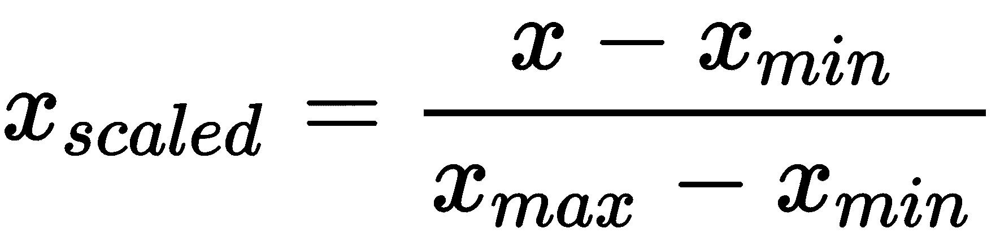

# 生成神经网络

近年来，神经网络已被用作生成模型：能够复制输入数据的分布，然后能够从这个分布中生成新值的算法。通常，分析图像数据集，并尝试学习与图像像素相关的分布，以产生与原始图像相似的形状。正在进行大量工作，以使神经网络能够创建小说、文章、艺术和音乐。

**人工智能**（**AI**）研究人员对生成模型感兴趣，因为它们代表了一个跳板，可以构建能够使用世界原始数据并自动提取知识的 AI 系统。这些模型似乎是一种训练计算机理解概念的方法，无需研究人员事先教授这些概念。与当前系统相比，这将是一个巨大的进步，因为当前系统只能从由有能力的自然人准确标记的训练数据中学习。

在本章中，我们将触及生成模型中最激动人心的研究途径之一。首先，我们将介绍无监督学习算法；然后提出生成模型的概述。我们还将发现最常见的生成模型，并展示如何实现一些示例。最后，我们将向读者介绍 Nsynth 数据集和 Google Magenta 项目。

涵盖的主题是：

+   无监督学习

+   生成模型介绍

+   受限玻尔兹曼机

+   深度玻尔兹曼机

+   自动编码器

+   变分自动编码器

+   生成对抗网络

+   对抗性自动编码器

在本章结束时，读者将学习如何从神经网络中提取不同类型的内容生成的内容。

# 无监督学习

无监督学习是一种机器学习技术，它从一系列输入（系统经验）开始，能够根据共同特征重新分类和组织，以尝试对后续输入进行预测。与监督学习不同，在学习过程中，只向学习者提供未标记的示例，因为类别不是事先已知的，而是必须自动学习。

下面的图表显示了从原始数据中标记的三个组：


从这张图中，我们可以注意到系统基于相似性识别了三个组，在这个例子中，这种相似性是由于邻近性。一般来说，无监督学习试图识别数据的内部结构以重现它。

这些算法的典型例子是搜索引擎。这些程序，给定一个或多个关键词，能够创建一个链接列表，这些链接指向搜索算法认为与所进行的研究相关的页面。这些算法的有效性取决于它们可以从数据库中提取的信息的有用性。

无监督学习技术通过比较数据和寻找相似性或差异来工作。众所周知，机器学习算法试图模仿动物神经系统的功能。为此，我们可以假设神经过程是由优化他们追求的未知目标的机制所引导的。每个过程都从与刺激相关联的初始情况发展到终端，其中有一个答案，这是过程本身的结果。直观地讲，在这个过程中，存在信息传递。事实上，刺激提供了获得所需响应所需的信息。因此，在过程完成之前，尽可能忠实地传输这些信息是很重要的。因此，解释神经系统发生的过程的合理标准是，将它们视为信息传递，同时最大限度地保留相同的信息。

无监督学习算法基于这些概念。这是一个使用学习理论技术来衡量在传输过程中发生的信息损失的问题。考虑的过程被视为通过通信领域开发出的已知技术来传输信号的噪声信道。然而，也可以遵循基于过程几何表示的不同方法。实际上，刺激和响应都由适当数量的组件表征，这些组件在空间中对应于一个点。因此，这个过程可以解释为输入空间到输出空间的几何变换。输出空间的大小小于输入空间，因为刺激包含了激活许多同时进行的过程所需的信息。与只有一个相比，它是冗余的。这意味着在考虑的变换中始终存在冗余减少操作。

在输入和输出空间中，形成了典型的区域，信息与之相关联。因此，控制信息传输的自然机制必须以某种方式识别考虑过程中的这些重要区域，并确保它们在变换中相对应。因此，在所讨论的过程中存在数据分组操作；这个操作可以与经验的获得相等同。前两个分组和冗余减少操作是典型信号处理中的操作，有生物学证据表明它们存在于神经系统的功能中。值得注意的是，这两种操作在基于实验原则的非监督学习中是自动实现的，例如竞争学习。

# 生成模型

生成模型旨在生成现象的所有值，包括可观察到的（输入）和可以从观察到的值中计算出的（目标）。我们试图通过提出生成模型和判别模型之间的第一个区别来理解这种模型如何实现这一目标。

在机器学习中，我们通常需要根据输入 *x* 向量的值预测目标向量 *y* 的值。从概率的角度来看，目标是找到条件概率分布 *p(y|x)*。

事件 *y* 关于事件 *x* 的条件概率是在已知 *x* 已验证的情况下 *y* 发生的概率。这个概率，用 *p(y|x)* 表示，表达了由 *x* 的观察所决定的 *y* 的期望修正。

解决这个问题的最常见方法是用参数模型表示条件分布，然后使用由包含输入变量的值和相应输出的相对向量的对 (*xn*, *yn*) 组成的训练集来确定参数。得到的条件分布可以用来对新输入值 (*x*) 的目标 (*y*) 进行预测。这被称为**判别方法**，因为条件分布直接区分了 *y* 的不同值。

作为这种方法的替代方案，我们可以寻找联合概率分布 *p(x∩ y)*，然后使用这个联合分布来评估条件概率 *p(y | x)* 以便对新值 *x* 的 *y* 进行预测。这被称为**生成方法**，因为通过从联合分布中采样，可以生成特征向量 *x* 的合成示例。

联合概率分布 *p(x, y)* 是一个概率分布，它给出了 *x* 和 *y* 向量中的每一个落在为该变量指定的任何特定范围或离散值集中的概率。

生成方法，无论数据类型和使用的理论模型如何，都分为两个基本步骤：

1.  第一步涉及生成模型的构建。输入数据被处理，目的是推导它们的分布。为此，输入数据可以简单地重新组织成不同的结构，或者它可以代表从输入数据中提取的新信息，这些信息来自特定的算法。生成模型构建的结果是根据其近似分布呈现数据。

1.  一旦在输入数据上构建了生成模型，这允许采样，从而导致形成与输入数据具有相同分布的新数据。

生成模型的构建允许突出显示初始数据中隐含的特征和属性。然后，根据对数据进行解释以说明这些特征的类型以及因此获得的近似数据分布的变量类型，区分不同的方法。

为什么人工智能研究人员对生成模型如此兴奋？让我们举一个简单的例子：假设我们向系统提供一系列猫的图片。假设在这些图片看过之后，计算机能够以完全独立的方式生成新的猫的照片。如果计算机能够做到这一点，并且产生的图像具有正确的腿、尾巴、耳朵等数量，那么很容易证明计算机知道哪些部分构成了猫，即使没有人向它解释过猫的解剖结构。因此，从某种意义上说，一个好的生成模型是计算机对概念基本知识的证明。

这就是为什么研究人员对构建生成模型如此热情的原因。这些模型似乎是一种训练计算机理解概念的方法，无需研究人员事先教授它们概念。

# 限制性玻尔兹曼机

玻尔兹曼机是一种概率图模型，可以解释为随机神经网络。玻尔兹曼机首次由杰弗里·辛顿和特里·谢诺夫斯基于 1985 年提出。"随机"一词源于神经元的行为；在它们内部，在激活函数中，它们将具有一个概率值，这将影响神经元的激活。

在实践中，玻尔兹曼机是一个模型（包括一定数量的参数），当应用于数据分布时，能够提供一种表示。该模型可以用来从目标分布（目标分布）的样本中提取未知分布的重要方面。玻尔兹曼机所引用的数据样本也称为**训练数据**。以下图显示了玻尔兹曼机的架构：


训练玻尔兹曼机意味着调整其参数，以便它所表示的概率分布尽可能好地插值训练数据。从计算角度来看，玻尔兹曼机的训练是一项相当繁重的工作。然而，通过在工作网络的拓扑结构上施加限制，可以简化这个问题；这定义了**限制性玻尔兹曼机**（**RBM**）。

在玻尔兹曼机中，有两种类型的单元：

+   可见单元（或神经元，因为正如我们所说，玻尔兹曼机可以解释为神经网络）

+   隐藏单元（或神经元）

即使在 RBMs 中，也存在这两种类型的单元，我们可以想象它们被安排在两个层面上：

+   可见单元是观察的组成部分（例如，如果我们的数据由图像组成，我们可以将一个可见单元与每个像素关联）

+   隐藏单元为我们提供了一个关于观察（例如，图像像素之间的依赖关系）的组件之间存在的依赖关系的模型

因此，隐藏单元可以被视为数据特征的检测器。在 RBM 图中，每个神经元都与另一层的所有神经元相连，而同一层的神经元之间没有连接；正是这种限制使得 RBM 得名，如下面的图所示：


在成功训练后，RBM 提供了对训练数据下分布的非常好的表示。它是一个生成模型，允许从学习到的分布中采样新的数据；例如，可以从研究过的图像生成新的图像结构。拥有生成模型使得有用的应用成为可能。例如，你可以考虑整合一些对应于部分观察的可见单元（即，固定观察变量的值并认为它们是常数）然后产生剩余的可见单元以完成观察；在图像分析示例中，这可以用于图像补全任务。

作为生成模型，RBM 也可以用作分类器。考虑这种类型的应用：

+   RBM 被训练来学习输入数据（解释变量）和相应的标签（响应/输出变量）的联合概率分布，这两个变量都在网络图中表示，从 RBM 的可见单元中学习。

+   随后，可以链接一个新的输入模式，这次没有标签，到可见变量。相应的标签可以通过直接从霍尔兹曼机采样来预测。

霍尔兹曼机能够完成可见单元上的部分数据模式。如果我们把可见单元分为输入单元和输出单元，给定输入模式，霍尔兹曼机通过产生输出（分类）来完成它。否则，它作为关联记忆工作，返回学习到的模式中最相似的模式到（部分）数据。

# 霍尔兹曼机架构

霍尔兹曼机架构基于输入、输出和隐藏节点。连接权重是对称的：


基于这个假设，霍尔兹曼机高度递归，这种递归消除了输入节点和输出节点之间的任何基本差异，在需要时可以被视为输入或输出。霍尔兹曼机是一个为整个网络定义了**能量**的单元网络。其单元产生二元结果（(1,0)值）。输出是概率性地计算的，并依赖于温度变量*T*。

玻尔兹曼机的共识函数由以下公式给出：


在前面的公式中，项的定义如下：

+   *S[i]*是单元*i(1,0)*的状态

+   *w[ij]*是单元*j*和单元*i*之间的连接强度

+   *u[j]*是单元*j*的输出

计算在机器中以随机方式进行，以便增加一致性。因此，如果*w[ij]*是正的，那么单元*i*和*j*同时激活或同时失活的趋势会增加，而如果权重是负的，那么它们具有不同激活（一个激活，另一个不激活）的趋势。当一个权重是正的时，它被称为**兴奋性**；否则，它被称为**抑制性**。

每个二元单元都会随机决定是 1（概率*p[i]*）或 0（概率*1- p[i]*）。这个概率由以下公式给出：


在网络的平衡状态下，似然被定义为指数化的负能量，称为**玻尔兹曼分布**。你可以想象，通过施加能量，你可以使系统摆脱局部最小值。这必须缓慢进行，因为剧烈的冲击可能会使系统远离全局最小值。最佳方法是先施加能量，然后缓慢减少。这个概念在冶金学中得到了应用，首先通过熔化获得金属的有序状态，然后缓慢降低温度。在过程进行中的温度降低被称为**模拟退火**。

这种方法可以通过向 Hopfield 网络添加概率更新规则来重现（参见第十三章，*超越前馈网络 - CNN 和 RNN*）；重现它的网络被称为**玻尔兹曼机**。将有一个参数会变化：温度。因此，在高温*T*下，跃迁到更高能量的概率远大于在低温下。

当温度下降时，假设正确最小能量状态的概率接近 1，网络达到热平衡。网络中的每个单元都会根据以下公式进行能量跃迁：


系统根据以下概率规则（转换函数）转变为更低能量的状态：


可以看到，在高温*T*下，向更高能量状态的转换概率高于低温*T*。网络可以根据以下玻尔兹曼分布假设稳定状态配置：


即，它取决于状态的能量和系统的温度。低能量状态更可能；事实上，如果 *E[a] < E[b]*，则 *P[a]/P[b] > 1*，因此 *P[a]>P[b]*。所以系统倾向于向最低能量状态转变。

# 玻尔兹曼机缺点

基于玻尔兹曼机的算法在使用过程中出现了许多问题。以下是一些遇到的问题：

+   权重调整

+   收集统计信息以计算概率所需的时间，

+   一次改变多少权重

+   如何在模拟退火过程中调整温度

+   如何决定网络何时达到平衡温度。

主要缺点是玻尔兹曼学习比反向传播慢得多。

# 深度玻尔兹曼机

另一种类型的玻尔兹曼机是**深度玻尔兹曼机**（**DBM**）。这是一个类似于 RBM 的神经网络，但它不仅仅只有一个隐藏层节点，DBM 有很多。每个神经层只与相邻层（立即前一个和立即后一个）连接；在这里，同一层的神经元也不相互连接。这种结构使得每个层都能产生特定的统计信息，从而能够捕捉新的数据特征。以下图显示了具有一个可见层和两个隐藏层的 DBM 模型：


如我们所见，连接仅存在于相邻层之间的单元之间。像 RBM 和 DBM 只包含二进制单元。

DBMs 模型为可见向量 *v* 分配以下概率：


在前面的公式中，术语定义如下：

+   *v* 是可见向量

+   *θ = (W(1),W(2))* 是模型参数，代表可见到隐藏和隐藏到隐藏的对称交互项

+   *h^((1))* 和 *h^((2))* 是隐藏的随机二进制变量

+   *Z(θ)* 是配分函数

在识别对象或单词的情况下，DBMs 特别有用。这是由于使用少量标记输入数据学习复杂和抽象的内部表示的强大能力，而不是利用大量未标记的输入数据。然而，与深度卷积神经网络不同，DBMs 在双向推理和训练过程中都采用，以更好地检测输入结构的表示。

# 自编码器

自编码器是一种神经网络，其目的是将输入编码成小维度，并得到的结果能够重建输入本身。自编码器由以下两个子网组成：

+   编码器，它计算以下函数：

*z = ϕ(x)*

给定一个输入 *x*，编码器将其编码到变量 *z* 中，也称为**潜在变量**。*z*通常比 *x* 的维度小得多。

+   解码器，它计算以下函数：

*x' = ψ(z)*

由于 *z* 是编码器产生的 *x* 的代码，解码器必须将其解码，以便 *x'* 与 *x* 相似。

自编码器的训练旨在最小化输入和结果之间的均方误差。

**均方误差**（**MSE**）是输出和目标之间的平均平方差。较低的值表示更好的结果。零表示没有错误。

对于 n 个观测值，*MSE* 由以下公式给出：


最后，我们可以总结说，编码器将输入编码为压缩表示，解码器从它返回输入的重建，如下面的图所示：


让我们定义以下术语：

+   *W*: 输入 → 隐藏权重

+   *V*: 隐藏 → 输出权重

之前的公式变为：

*z = ϕ(W* x)*

并且它们也变为：

*x' = ψ(V*W1* x)*

最后，自编码器的训练旨在最小化以下量：


自编码器的目的不仅仅是执行一种对输入的压缩或寻找恒等函数的近似。有一些技术可以从一个降低维度的隐藏层开始，指导模型给予某些数据属性更大的重要性，从而基于相同的数据产生不同的表示。

# 变分自编码器

**变分自编码器**（**VAE**）受自编码器概念的影响：由两个称为**编码器**和**解码器**的神经网络组成的模型。正如我们所见，编码器网络试图以压缩的形式编码其输入，而解码器网络则试图从编码器返回的代码开始重建初始输入。

然而，变分自编码器（VAE）的功能与简单的自编码器非常不同。VAE 不仅允许对输入进行编码/解码，还可以生成新的数据。为此，它们将代码 *z* 和重建/生成 *x'* 视为属于某个概率分布的一部分。特别是，VAE 是深度学习和贝叶斯推理相结合的结果，因为它们由一个使用称为**重参数化**技术的反向传播算法修改后的神经网络训练而成。虽然深度学习已被证明在复杂函数逼近方面非常有效，但贝叶斯统计允许以概率的形式管理随机生成的不确定性。

VAE 使用与训练集相似的相同结构来生成新的图像。在这种情况下，编码器不会直接为给定的输入生成一个代码，而是计算正态分布的均值和方差。从这个分布中取一个值，然后由解码器进行解码。训练包括修改编码器和解码器参数，以便解码的结果尽可能接近起始图像。训练结束时，我们有从编码器产生的均值和方差的正态分布开始；解码器将能够生成与训练集相似的图像。

让我们定义以下术语：

+   *X*: 输入数据向量

+   *z*: 潜在变量

+   *P(X)*: 数据的概率分布

+   *P(z)*: 潜在变量的概率分布

+   *P(X|z)*: 后验概率，即给定潜在变量生成数据的分布

后验概率 *P(X|z)* 是在证据 *z* 下 *X* 的概率。

我们的目标是根据潜在变量中包含的特征生成数据，因此我们想要找到 *P(X)*。为此，我们可以使用以下公式的全概率定律：


为了理解我们是如何得到这个公式的，我们逐步进行推理。在定义模型的第一项任务是从观察数据开始推断潜在变量的良好值，或者计算后验 *p(z|X)*。为此，我们可以使用贝叶斯定理：


在前面的公式中，出现了 *P(X)* 项。在贝叶斯统计的背景下，它也可能被称为证据或模型证据。证据可以通过对潜在变量进行边缘化来计算。这使我们回到了起始公式：


这个积分的计算估计需要指数级的时间，因为它必须在所有潜在变量的配置上进行评估。为了降低计算成本，我们被迫对后验概率的估计进行近似。

在变分自编码器（VAE）中，正如其名所示，我们使用一种称为**变分推断**（**VI**）的方法来推断 *p(z | X)*。VI 是贝叶斯推理中最常用的方法之一。这种技术将推断视为一个优化问题。在这样做的时候，我们使用一个简单且易于评估的分布（例如高斯分布），并使用 **Kullback-Leibler 散度度量**来最小化这两个分布之间的差异。

Kullback-Leibler 散度度量是两个概率分布 *P* 和 *Q* 之间非对称差异的度量。特别地，从 *P* 到 *Q* 的 Kullback-Leibler 散度，记为 **DKL** *(P ||Q)*，是当使用 *Q* 来近似 *P* 时损失的信息的度量。

对于离散概率分布*P*和*Q*，从*Q*到*P*的 Kullback-Leibler 散度定义为以下：


分析公式可以清楚地看出，Kullback-Leibler 散度是概率*P*和*Q*之间对数差异的期望，这里的期望是使用概率*P*来计算的。

# 生成对抗网络

**生成对抗网络**（**GAN**）是由两个共同训练的网络组成的生成模型，称为**生成器**和**判别器**。

这两个网络之间的动力学类似于伪造者和调查者之间的关系。伪造者试图制作对真实艺术作品的忠实模仿，而调查者则试图区分赝品和真品。在这个类比中，伪造者代表生成器，调查者代表判别器。生成器接受属于固定分布的输入值，并试图生成与数据集相似的图像。判别器试图区分生成器创建的数据与属于数据集的数据。这两个网络是共同训练的：

+   如果输入属于数据集，判别器试图返回输出=1，如果其输入是由生成器生成的，则返回 0

+   生成器则试图最大化判别器犯错的概率

生成器获取随机输入噪声并试图创建数据样本，而判别器从现实世界的示例或生成器获取输入，如下面的图所示：


为了简单起见，这两个对抗网络是多层感知器类型；然而，可以使用深度网络来模拟相同的结构。例如，为了生成新的图像，而不是从复杂的分布中采样数据，这些网络中使用的方法是从属于简单分布的值或从随机值开始。随后，它们通过将在训练过程中学习的第二个分布进行映射。

在这样的系统中，训练会导致生成器和判别器之间持续的竞争。在这些条件下，优化过程可以在双方独立进行。将生成器命名为*G(z*)，判别器命名为*D(x*)，模型的训练目标是最大化判别器将 1 分配给来自训练集的值的概率，而不是将 0 分配给生成器产生的值。另一方面，我们希望教会生成器最小化以下量：


训练是通过将梯度下降技术应用于以下表达式来进行的：


这种方法源于博弈论，特别是称为**两人最小-最大博弈**的方法。这类算法采用最小化玩家选择可能造成的最大损失的策略。在训练过程中，判别器可能无法对由真实数据生成的示例进行分类。

# 对抗自编码器

**对抗自编码器**（**AAE**）是 VAE 和 GAN 结合产生的生成模型。为了解释该模型，我们首先定义以下术语：

+   *x*：自编码器输入

+   z：从 *x* 生成的代码，

+   *p(z)*：我们想要施加的分布

+   *q(z|x)*：从编码器学习到的分布

+   *p(x|z)*：从解码器学习到的分布

+   *pdata*：数据的分布

+   *p(x)*：模型的分布

我们将函数 *q(z|x)* 视为 *q(z)* 的后验分布，其定义如下：


我们试图将等式 *q(z)=p(z)* 强加于模型。与 VAE 的不同之处在于，驱动 *q (z)* 向 *p(z)* 靠近的是对抗网络。VAE 的编码器被视为 GAN 的生成器，对于该生成器可以使用判别器。这试图区分属于 *q(z)* 的数据与来自 *p(z)* 的数据。以下图显示了 AAE 架构：


对抗网络和自编码器的训练是联合进行的，使用随机梯度下降。

# 使用 RBM 进行特征提取

最近，几种类型的**人工神经网络**（**ANNs**）已被应用于对特定数据集进行分类。然而，这些模型中的大多数只使用有限数量的特征作为输入，在这种情况下，由于起始数据集的复杂性，可能没有足够的信息来做出预测。如果你有更多特征，训练的运行时间会增加，并且由于维度诅咒，泛化性能会下降。在这些情况下，一个用于提取特征的工具会特别有用。RBM 是一种具有强大表示能力的机器学习工具，通常用作各种分类问题中的特征提取器。

# 乳腺癌数据集

乳房由一组腺体和脂肪组织组成，位于皮肤和胸壁之间。实际上，它不是一个单一的腺体，而是一组腺体结构，称为**小叶**，它们联合起来形成一个叶。在乳房中，有 15 到 20 个小叶。牛奶通过称为**乳管**的小管道从小叶流向乳头。

乳腺癌如果未被发现和治疗，可能是一种严重的疾病。它是由乳腺中某些细胞不受控制地增殖并转化为恶性细胞引起的。这意味着它们具有从产生它们的组织中脱离并侵犯周围组织以及最终侵犯身体其他器官的能力。理论上，癌症可以由所有类型的乳腺组织形成，但最常见的是由腺细胞或形成导管壁的细胞形成。

本例的目标是识别多个良性或恶性类别中的每一个。为此，我们将使用名为“乳腺癌”（威斯康星乳腺癌数据库）的数据集中的数据。这些数据是从 UCI 机器学习数据库仓库中获取的，因为 DNA 样本定期到达，正如 Wolberg 博士报告他的临床病例一样。因此，数据库反映了这种数据的按时间顺序分组。这种分组信息立即出现，因为已经被从数据本身中移除。除了第一个变量之外，每个变量都被转换成了 11 个原始数值属性，其值从零到十不等。

为了获取数据，我们借鉴了以下链接中 UCI 机器学习仓库的大量数据集：[`archive.ics.uci.edu/ml`](http://archive.ics.uci.edu/ml)。

为了加载数据集，我们将使用`sklearn.datasets`模块。它包括用于加载数据集的实用工具，包括加载和检索流行参考数据集的方法。它还提供了一些人工数据生成器。

乳腺癌数据集是一个经典且非常容易的二分类数据集。以下表格提供了一些关于数据集的信息：

| 类别 | 2 |
| --- | --- |
| 每类样本数 | 212(M), 357(B) |
| 样本总数 | 569 |
| 维度 | 30 |
| 特征 | 实数和正数 |

# 数据准备

在介绍了乳腺癌数据集之后，我们可以分析代码，这将使我们能够逐行对输入数据进行分类。在代码的第一部分，我们导入稍后将要使用的库：

```py
from sklearn import linear_model, datasets, preprocessing
from sklearn.cross_validation import train_test_split
from sklearn.pipeline import Pipeline
from sklearn.neural_network import BernoulliRBM
from pandas_ml import ConfusionMatrix
import numpy as np
import pandas as pd
```

目前，让我们仅限于导入；我们将在使用时进一步深入研究。首先，我们必须导入数据集；我们将使用`sklearn.datasets`包来完成：

```py
BC = datasets.load_breast_cancer()
```

此命令加载并返回乳腺癌`wisconsin`数据集。`sklearn.datasets`包嵌入了一些小型玩具数据集。为了评估数据集的规模（`n_samples`和`n_features`）对数据统计属性（通常是特征的相关性和信息性）的影响，同时生成合成数据也是可能的。此包还提供了一些辅助工具，用于获取机器学习社区常用的大型数据集，以在来自真实世界的数据上基准测试算法。数据集是一个类似字典的对象，包含所有数据和有关数据的元数据。这些数据存储在数据成员中，它是一个`n_samples`和`n_features`数组。在监督问题的情况下，一个或多个响应变量存储在目标成员中。

数据以`Bunch`对象的形式返回，这是一个类似字典的对象，包含以下属性：

+   `data`: 要学习的数据

+   `target`: 分类标签

+   `target_names`: 标签的含义

+   `feature_names`: 特征的含义

+   `DESCR`: 数据集的完整描述

为了确认数据的内容，让我们提取维度：

```py
print(BC.data.shape)
print(BC.target.shape)
```

结果如下所示：

```py
(569, 30)
(569,)
```

为了更好地理解操作，我们将这些数据分为`X`（预测变量）和`Y`（目标）：

```py
X = BC.data
Y = BC.target
```

在这一点上，我们使用提供给我们`pandas`库的工具从预测变量中提取一系列统计信息。

`pandas`是一个开源的、BSD 许可的库，为 Python 编程语言提供高性能、易于使用的数据结构和数据分析工具。

要使用此功能，我们必须将输入数据从`numpy.darray`转换为`pandas`数据框：

```py
Xdata=pd.DataFrame(X)
print(Xdata.describe())
```

结果如下所示：

```py
               0           1           2            3           4   \
count  569.000000  569.000000  569.000000   569.000000  569.000000
mean    14.127292   19.289649   91.969033   654.889104    0.096360
std      3.524049    4.301036   24.298981   351.914129    0.014064
min      6.981000    9.710000   43.790000   143.500000    0.052630
25%     11.700000   16.170000   75.170000   420.300000    0.086370
50%     13.370000   18.840000   86.240000   551.100000    0.095870
75%     15.780000   21.800000  104.100000   782.700000    0.105300
max     28.110000   39.280000  188.500000  2501.000000    0.163400
```

由于空间限制，我们只报告了前五个预测变量的结果。正如我们所看到的，变量有不同的范围。当预测变量有不同的范围时，具有较大数值范围的特征的响应变量的影响可能比具有较小数值范围的特征的影响更大，这反过来又可能影响预测精度。我们的目标是提高预测精度，不允许某个特征由于较大的数值范围而影响预测。因此，我们可能需要将不同特征下的值缩放到一个共同的范围内。通过这个统计过程，可以比较属于不同分布的相同变量，也可以比较不同的变量或以不同单位表示的变量。 

记住，在训练机器学习算法之前对数据进行缩放是一种良好的实践。通过缩放，消除了数据单位，使得您能够轻松地比较来自不同位置的数据。

在这个例子中，我们将使用最小-最大方法（通常称为**特征缩放**）来获取所有缩放数据在范围（0，1）内。实现此目的的公式是：



以下命令执行特征缩放：

```py
X = (X - np.min(X, 0)) / (np.max(X, 0) - np.min(X, 0))
```

`numpy.min()` 和 `numpy.max()` 用于计算每个数据库列的最小值和最大值。

现在让我们将数据分割成训练和测试模型。训练和测试模型是进一步使用模型进行预测分析的基础。给定一个包含预测变量和响应变量的 100 行数据集，我们将数据集分割成方便的比例（比如说 80:20），并分配 80 行用于训练，20 行用于测试。行是随机选择的，以减少偏差。一旦有了训练数据，数据就被输入到机器学习算法中，以获得大规模的通用函数。为了分割数据集，我们将使用 `sklearn.model_selection.train_test_split()` 函数：

```py
X_train, X_test, Y_train, Y_test = train_test_split(X, Y, test_size=0.2, random_state=1)
```

`train_test_split()` 函数将数组或矩阵分割成随机的训练和测试子集。前两个参数是 `X`（预测变量）和 `Y`（目标）numpy 数组。允许的输入包括列表、`numpy` 数组、scipy 稀疏矩阵或 `pandas` 数据框。然后添加了两个选项：

+   `test_size`：这应该在 0.0 和 1.0 之间，并代表要包含在测试分割中的数据集比例

+   `random_state`：这是随机数生成器使用的种子

# 模型拟合

我们之前提到 RBM 经常被用作各种分类问题中的特征。现在是时候看看如何做了。首先要做的是使用 `sklearn.neural_network` 模块的 `BernoulliRBM` 函数。

`sklearn` 是一个用于 Python 编程语言的免费机器学习库。它具有各种分类、回归和聚类算法，包括支持向量机、随机森林、梯度提升、k-means 和 DBSCAN。它旨在与 Python 数值和科学库 NumPy 和 SciPy 交互操作。

在 `sklearn` 库中，`sklearn.neural_network` 模块包括基于神经网络的模型。在这个模块中，`BernoulliRBM` 函数拟合一个伯努利 RBM。返回一个具有二元可见单元和二元隐藏单元的 RBM。参数使用**随机最大似然**（**SML**），也称为**持久对比散度**（**PCD**）进行估计。首先，我们将设置模型的架构：

```py
RbmModel = BernoulliRBM(random_state=0, verbose=True)
```

然后，我们将使用训练数据拟合模型：

```py
FitRbmModel = RbmModel.fit_transform(X_train, Y_train)
```

`fit_transform` 方法将转换器拟合到 `X_train` 和 `Y_train` 上，并可选地使用参数 `fit_params`，然后返回 `X_train` 的转换版本。在这种情况下，没有使用可选参数。

如果你还记得，我们的目的是使用`Rbm`模型提取特征，然后这些特征将被逻辑回归模型用于分类数据。所以，第一部分已经完成——我们已经在`FitRbmModel`变量中提取了特征。现在是时候创建逻辑回归模型了。为此，我们将使用`sklearn.linear_model`模块中的`LogisticRegression`函数，如下所示：

```py
LogModel = linear_model.LogisticRegression()
```

现在我们将决策函数中特征系数设置为从`rbm`模型中提取的特征：

```py
LogModel.coef_ = FitRbmModel
```

现在我们可以构建分类器了。为此，我们将使用`sklearn.pipeline`模块中的`Pipeline`函数：

```py
Classifier = Pipeline(steps=[('RbmModel', RbmModel), ('LogModel', LogModel)])
```

`pipeline`的目的在于组装可以一起进行交叉验证的多个步骤，同时设置不同的参数。为此，它允许使用步骤的名称来设置各个步骤的参数，就像之前的代码中那样。可以通过将参数名称设置为另一个估计器来完全替换一个步骤的估计器，或者通过将其设置为`None`来移除一个转换器。现在分类器已经准备好了；我们只需要对其进行训练：

```py
LogModel.fit(X_train, Y_train)
Classifier.fit(X_train, Y_train)
```

首先，训练逻辑回归模型，然后训练分类器。我们只需要进行预测。回想一下，为了做到这一点，我们有一个未使用的数据集可用：`X_test`和`Y_test`。为了检查分类器的性能，我们将预测与真实数据进行比较：

```py
print ("The RBM model:")
print ("Predict: ", Classifier.predict(X_test))
print ("Real:    ", Y_test)
```

下面的截图显示了返回的结果：


最后，为了更好地理解模型性能，我们将计算混淆矩阵。在混淆矩阵中，我们的分类结果与真实数据进行比较。混淆矩阵的优势在于它不仅识别了分类错误的性质，还识别了它们的数量。在这个矩阵中，对角线单元格显示了正确分类的案例数量；所有其他单元格显示了错误分类的案例。要计算混淆矩阵，我们可以使用 pandas 库中包含的`ConfusionMatrix()`函数，如下所示：

```py
CM = ConfusionMatrix(Y_test, Classifier.predict(X_test))
CM.print_stats()
```

在下面的代码中，展示了`ConfusionMatrix()`函数返回的结果：

```py
population: 114
P: 72
N: 42
PositiveTest: 87
NegativeTest: 27
TP: 71
TN: 26
FP: 16
FN: 1
TPR: 0.9861111111111112
TNR: 0.6190476190476191
PPV: 0.8160919540229885
NPV: 0.9629629629629629
FPR: 0.38095238095238093
FDR: 0.1839080459770115
FNR: 0.013888888888888888
ACC: 0.8508771929824561
F1_score: 0.8930817610062893
MCC: 0.6866235389841608
informedness: 0.6051587301587302
markedness: 0.7790549169859515
prevalence: 0.631578947368421
LRP: 2.588541666666667
LRN: 0.022435897435897433
DOR: 115.37500000000003
FOR: 0.037037037037037035
```

返回了一些信息；特别是，我们可以注意到模型的准确率为 0.85。

# Keras 自编码器

正如我们之前所说的，自编码器是一种神经网络，其目的是将输入编码成小维度，并能够重建输入本身。自编码器由以下两个子网络的并集组成：编码器和解码器。此外，还有一个损失函数，它是数据压缩表示和分解表示之间信息损失量的距离。编码器和解码器将与距离函数可微分，因此编码/解码函数的参数可以通过梯度随机优化来最小化重建损失。

# 加载数据

这是一个包含 60,000 个 28 x 28 灰度图像的手写数字数据库，这些图像是 10 个数字的，还有一个包含 10,000 个图像的测试集。这个数据集已经在 Keras 库中可用。以下图表显示了 MNIST 数据集中 0-8 的图像样本：


如往常一样，我们将逐行分析代码。在代码的第一部分，我们导入稍后将要使用的库：

```py
from keras.layers import Input, Dense
from keras.models import Model
```

此代码导入了以下函数：

+   使用 Input 函数来实例化一个 Keras 张量。Keras 张量是从底层后端（Theano、TensorFlow 或 CNTK）的张量对象。我们通过添加某些属性来增强它，这些属性允许我们仅通过知道模型的输入和输出就构建一个 Keras 模型。

+   使用 Dense 函数实例化一个常规密集连接神经网络层。

+   使用 Model 函数来定义模型。模型是你可以总结、拟合、评估并用于做出预测的东西。Keras 提供了一个`Model`类，你可以用它从创建的层中创建模型。它只需要你指定输入和输出层。

要导入数据集，只需使用此代码：

```py
from keras.datasets import mnist
(x_train, y_train), (x_test, y_test) = mnist.load_data()
```

以下元组被返回：

+   `x_train, x_test`：一个`uint8`数组，包含灰度图像数据，形状为(`num_samples`, 28, 28)

+   `y_train, y_test`：一个`uint8`数组，包含数字标签（范围在 0-9 的整数），形状为(`num_samples`)

现在我们必须将所有值归一化到 0 到 1 之间。Mnist 图像以像素格式存储，其中每个像素（总共 28 x 28）存储为一个 8 位整数，其值范围从 0 到 255。通常，0 被认为是黑色，255 被认为是白色。介于两者之间的值构成了不同的灰色阴影。现在，为了将所有值归一化到 0 到 1 之间，只需将每个值除以 255。因此，包含值 255 的像素将变为 1，包含 0 的像素将保持原样；介于两者之间的是所有其他值：

```py
x_train = x_train.astype('float32') / 255
x_test = x_test.astype('float32') / 255
```

通过使用`astype()`函数，我们已经将输入数据从`float32`（单精度浮点数：符号位，8 位指数，23 位尾数）转换过来。正如我们所说的，每个样本（图像）由一个 28 x 28 的矩阵组成。为了降低维度，我们将 28 x 28 的图像展平成大小为 784 的向量：

```py
x_train = x_train.reshape((len(x_train), np.prod(x_train.shape[1:])))
x_test = x_test.reshape((len(x_test), np.prod(x_test.shape[1:])))
```

`reshape()`函数给数组赋予一个新形状，而不改变其数据。新形状应与原始形状兼容。新形状的第一个维度是`len()`函数返回的观测数（`len(x_train)`和`len(x_test)`）。第二个维度代表起始数据的最后两个维度的乘积（28 x 28 = 784）。为了更好地理解这种转换，我们首先打印起始数据集的形状，然后打印转换后数据集的形状：

```py
print (x_train.shape)
print (x_test.shape)
```

以下是数据集重塑前后的结果：

```py
(60000, 28, 28)
(10000, 28, 28)
(60000, 784)
(10000, 784)
```

# Keras 模型概述

Keras 中有两种类型的模型可用：

+   顺序模型

+   Keras 功能 API

让我们在以下各节中详细查看每个部分。

# 顺序模型

`Sequential` 模型是层的线性堆叠。我们可以通过将层实例列表传递给构造函数来创建一个 `Sequential` 模型，如下所示：

```py
from keras.models import Sequential
from keras.layers import Dense, Activation
model = Sequential([
    Dense(32, input_shape=(784,)),
    Activation('relu'),
    Dense(10),
    Activation('softmax'),
])
```

我们也可以通过 `.add()` 方法简单地添加层：

```py
model = Sequential()
model.add(Dense(32, input_dim=784))
model.add(Activation('relu'))
```

此类模型需要知道它应该期望什么输入形状。因此，`Sequential` 模型的第一个层需要接收有关其输入形状的信息。有几种可能的方法可以实现这一点：

+   向第一个层传递 `input_shape` 参数

+   通过 `input_dim` 和 `input_length` 参数指定它们的输入形状

+   向一个层传递 `batch_size` 参数

# Keras 功能 API

定义模型的另一种方式是 Keras 功能 API。对于定义复杂模型，如多输出模型、有向无环图或具有共享层的模型，Keras 功能 API 是最佳选择。例如，要定义一个密集连接网络，只需输入以下代码：

```py
from keras.layers import Input, Dense
from keras.models import Model
inputs = Input(shape=(784,))
x = Dense(64, activation='relu')(inputs)
x = Dense(64, activation='relu')(x)
predictions = Dense(10, activation='softmax')(x)
model = Model(inputs=inputs, outputs=predictions)
model.compile(optimizer='rmsprop',
              loss='categorical_crossentropy',
              metrics=['accuracy'])
model.fit(data, labels) 
```

在下一节中，我们将通过将其应用于我们的示例来深入探讨此类模型。

# 定义模型架构

现在我们将使用 Keras 功能 API 来构建模型。正如我们之前看到的，首先我们必须定义输入：

```py
InputModel = Input(shape=(784,))
```

这将返回一个表示我们输入占位符的张量。稍后，我们将使用这个占位符来定义一个 `Model`。在这个阶段，我们可以向我们的模型架构中添加层：

```py
EncodedLayer = Dense(32, activation='relu')(InputModel)
```

Dense 类用于定义一个全连接层。我们指定层的神经元数量作为第一个参数（32），使用激活参数（`relu`）指定激活函数，最后指定层的输入张量（`InputModel`）。

记住，给定一个输入 `x`，编码器将其编码到一个变量 `z` 中，也称为**潜在变量**。`z` 通常比 `x` 的维度小得多；在我们的例子中，我们从 784 压缩到 32，压缩因子为 24.5。

现在，让我们添加解码层：

```py
DecodedLayer = Dense(784, activation='sigmoid')(EncodedLayer)
```

此层是对输入的损失重建。又一次，我们使用了具有 784 个神经元（输出空间的维度）的 Dense 类，`sigmoid` 激活函数，以及 `EncodedLayer` 输出作为输入。现在我们必须如下实例化一个模型：

```py
AutoencoderModel = Model(InputModel, DecodedLayer)
```

此模型将包括在给定 `InputModel`（输入）的情况下计算 `DecodedLayer`（输出）所需的全部层。以下是 Model 类的一些有用属性：

+   `model.layers` 是包含模型图的层的扁平化列表

+   `model.inputs` 是输入张量的列表

+   `model.outputs` 是输出张量的列表

因此，我们必须为训练配置模型。为此，我们将使用 `compile` 方法，如下所示：

```py
AutoencoderModel.compile(optimizer='adadelta', loss='binary_crossentropy')
```

此方法配置模型以进行训练。仅使用两个参数：

+   `optimizer`：字符串（优化器名称）或优化器实例。

+   `loss`: 字符串（目标函数的名称）或目标函数。如果模型有多个输出，可以通过传递字典或损失列表来使用不同的损失函数。然后，模型将最小化的损失值将是所有单个损失的加和。

我们使用了 adadelta 优化器。这种方法随时间动态调整，仅使用一阶信息，并且计算开销最小，超出了传统的随机梯度下降。该方法不需要手动调整学习率，并且对噪声梯度信息、不同的模型架构选择、各种数据模态和超参数的选择具有鲁棒性。

此外，我们使用了`binary_crossentropy`作为`loss`函数。损失函数是计算上可行的函数，表示在分类问题中对预测不准确性的代价。

在这一点上，我们可以训练模型：

```py
history = AutoencoderModel.fit(x_train, x_train,
                batch_size=256,
                epochs=100,
                shuffle=True,
                validation_data=(x_test, x_test))
```

`fit`方法用于在固定数量的 epochs（在数据集上的迭代）上训练模型。以下是对传递的参数的解释，以便更好地理解其含义：

+   `x`: 如果模型有一个输入，则为训练数据的 Numpy 数组，或者如果有多个输入，则为 Numpy 数组的列表。如果模型中的输入层有名称，也可以通过将输入名称映射到 Numpy 数组来传递字典。如果从框架原生张量（例如，TensorFlow 数据张量）中提供，则`x`可以是`None`（默认）。

+   `y`: 如果模型有一个输出，则为目标（标签）数据的 Numpy 数组，或者如果有多个输出，则为 Numpy 数组的列表。如果模型中的输出层有名称，也可以通过将输出名称映射到 Numpy 数组来传递字典。如果从框架原生张量（例如，TensorFlow 数据张量）中提供，则`y`可以是`None`（默认）。

+   `batch_size`: `整数`或`None`。这是每次梯度更新时的样本数量。如果没有指定，`batch_size`将默认为`32`。

+   `epochs`: 一个整数。这是训练模型的 epoch 数量。一个 epoch 是对整个`x`和`y`数据的迭代。注意，与`initial_epoch`结合使用时，`epochs`应理解为最终 epoch。模型不是根据 epoch 的数量进行多次迭代训练，而是仅仅训练到 epoch 索引为 epochs 的那个 epoch。

+   `shuffle`: 一个布尔值，用于决定在每个 epoch 之前是否对训练数据进行洗牌，或者`str`（用于`batch`）。`batch`是处理 HDF5 数据限制的特殊选项；它以批大小块进行洗牌。当`steps_per_epoch`不是`None`时，它没有效果。

+   `validation_data`: 一个元组（`x_val`和`y_val`）或元组（`x_val`，`y_val`，和`val_sample_weights`），用于在每个 epoch 结束时评估损失和任何模型度量。模型不会在此数据上训练。`validation_data`将覆盖`validation_split`。

返回一个`History`对象。其`history.history`属性是记录在连续的 epoch 中训练损失值和指标值，以及验证损失值和验证指标值（如果适用）。

我们的模式现在已准备就绪，因此我们可以使用它来自动重建手写数字。为此，我们将使用`predict`方法：

```py
DecodedDigits = AutoencoderModel.predict(x_test)
```

此方法为输入样本（`x_test`）生成输出预测。运行此示例，你应该会看到每个 100 个 epoch 的消息，打印每个 epoch 的损失和准确率，然后是对训练数据集上训练模型的最终评估。如下所示：


要了解`loss`函数在 epoch 中的变化情况，可以创建一个在训练和验证数据集上训练 epoch 的损失图。为此，我们将使用以下`Matplotlib`库：

```py
plt.plot(history.history['loss'])
plt.plot(history.history['val_loss'])
plt.title('Autoencoder Model loss')
plt.ylabel('loss')
plt.xlabel('epoch')
plt.legend(['train', 'test'], loc='upper left')
plt.show()
```

在以下图表中显示了训练和验证数据集上训练 epoch 的损失图：


我们的工作已经完成；我们只需验证获得的结果。我们可以在屏幕上打印出原始的手写数字和从我们的模型重建的数字。当然，我们只会对数据集中包含的 60000 个数字中的某些进行操作；实际上，我们将仅显示前五个。在这种情况下，我们也将使用`Matplotlib`库：

```py
n=5
plt.figure(figsize=(20, 4))
for i in range(n):
    ax = plt.subplot(2, n, i + 1)
    plt.imshow(x_test[i].reshape(28, 28))
    plt.gray()
    ax.get_xaxis().set_visible(False)
    ax.get_yaxis().set_visible(False)
    ax = plt.subplot(2, n, i + 1 + n)
    plt.imshow(DecodedDigits[i].reshape(28, 28))
    plt.gray()
    ax.get_xaxis().set_visible(False)
    ax.get_yaxis().set_visible(False)
plt.show()
```

结果如下所示：


如您所见，结果非常接近原始数据，这意味着模型运行良好。

# Magenta

2016 年 6 月 1 日，谷歌推出了 Magenta 项目，这是一个旨在通过使用人工智能以自主方式创作艺术和音乐的研究项目。基于 TensorFlow 平台，Magenta 旨在以开源模式在 GitHub 上发布代码，以便开发者能够实现越来越引人注目和先进的结果。

该项目是谷歌大脑团队的一个创意，谷歌大脑团队是谷歌的一个深度学习人工智能研究团队。它将开放式的机器学习研究、系统工程和谷歌规模的计算资源相结合。

Magenta 项目为自己设定了两个雄心勃勃的目标：开发艺术和音乐机器学习，并建立一个对这一主题感兴趣的人们的社区。机器学习长期以来在不同的环境中被使用，特别是在语音识别和语言翻译方面。Magenta 的创建是为了集中活动在之前未探索的领域，如广义上的艺术生成。为此，Magenta 希望创建一个物理场所，所有由相同兴趣（即艺术生成）联合的人可以交流思想和产品。换句话说，一个由艺术家、程序员和机器学习研究者组成的社区。

更多信息，请参考以下 URL 的项目官方网站：[`magenta.tensorflow.org/`](https://magenta.tensorflow.org/).

# NSynth 数据集

通过阅读前面的章节，我们现在已经了解到，为了正确训练机器学习算法，需要有一个包含重要数量观察的数据集。最近，由于高质量图像数据集的可用性，生成模型在图像上的使用增加，因此这对应着一个重要的数据集。考虑到这一点，Google Brain 团队推出了 NSynth。这是一个大规模、高质量的音符集，比可比的公共数据集大一个数量级。目标是拥有一个重要的音频数据集，以便开发性能更好的生成模型。

NSynth 数据集由 Jesse Engel 等人介绍在名为《使用 WaveNet 自动编码器进行神经音频合成音符》的文章中。

NSynth 是一个包含 305,979 个音乐音符的音频数据集，每个音符都有独特的音调、音色和包络。对于来自商业样本库的 1,006 个工具，Google Brain 团队生成了 4 秒的 16 kHz 单声道音频片段，称为**音符**，跨越标准 MIDI 钢琴的每个步骤（21-108）和五种不同的速度（25、50、75、100 和 127）。音符保持前 3 秒，并在最后 1 秒允许其衰减。

Google Brain 团队还根据人类评估和启发式算法的组合，为每个音符标注了三条额外信息：

+   **来源**：音符乐器的声音产生方法。这可以是声学或电子，对于分别从声学或电子乐器录制乐器的乐器，或合成，对于合成乐器。

+   **家族**：音符所属的高级别家族。每个乐器恰好属于一个家族。

+   **品质**：音符的音质。每个音符都标注了零个或多个品质。

NSynth 数据集可以以下两种格式下载：

+   TensorFlow 示例协议缓冲区的序列化 TFRecord 文件，每个 note 包含一个 Example proto

+   包含非音频特征和 16 位 PCM WAV 音频文件的 JSON 文件

整个数据集分为三个集合：

+   **训练**：包含 289,205 个示例的训练集。乐器与有效集或测试集不重叠。

+   **有效**：包含 12,678 个示例的验证集。乐器与训练集不重叠。

+   **测试**：包含 4,096 个示例的测试集。乐器与训练集不重叠。

更多信息和下载数据集，请参考以下 URL 的项目官方网站：[`magenta.tensorflow.org/datasets/nsynth`](https://magenta.tensorflow.org/datasets/nsynth).

# 摘要

在本章中，我们探讨了使用神经网络建模的最有趣的研究领域之一。首先，我们看到了无监督学习算法的介绍。无监督学习是一种机器学习技术，它从一系列输入（系统经验）开始，将能够根据共同特征重新分类和组织，以尝试对后续输入进行预测。与监督学习不同，在学习过程中，只向学习者提供未标记的示例，因为类别不是事先已知的，而是必须自动学习。

因此，我们分析了不同类型的生成模型。玻尔兹曼机是一种概率图模型，可以解释为随机神经网络。在实践中，玻尔兹曼机是一个模型（包括一定数量的参数），当应用于数据分布时，能够提供一种表示。该模型可以用来从目标分布（未知分布）的样本中提取重要方面。

自动编码器是一种神经网络，其目的是将输入编码成小维度，并能够重建输入本身。自动编码器的目的不仅仅是执行一种输入的压缩或寻找身份函数的近似；但有一些技术可以让我们指导模型（从减少维度的隐藏层开始）给予某些数据属性更大的重要性。因此，它们基于相同的数据产生不同的表示。

GAN 是由两个联合训练的网络组成的生成模型，称为 **生成器** 和 **判别器**。这两个网络之间的动态类似于伪造者和调查者。伪造者试图制作忠实于原作的仿制品，而调查者则试图区分赝品和真品。

然后，我们展示了如何实现一些示例：使用 RBM 进行特征提取和 Keras 的自动编码器。最后，我们介绍了 Nsynth 数据集和 Google Magenta 项目。
