# 第十七章：聊天机器人

聊天机器人的时代已经到来，这是一种新的技术现象，它帮助产生了与机器互动的新方式，从而创造了新的商业机会。聊天机器人是能够通过聊天与用户互动的机器人，能够通过执行极其有限的任务来帮助他们：提供当前账户信息、购票、接收天气预报等。

聊天机器人处理用户呈现的文本，然后根据一组复杂的算法进行响应，这些算法解释和识别用户说了什么。在扣除用户所需的内容后，它根据从上下文中提取的信息确定一组适当的响应。一些聊天机器人提供了一种非常真实的对话体验，其中很难确定代理是机器人还是人类。

聊天机器人也是人工智能带来的最令人兴奋的创新之一。在本章中，在介绍所有这些技术所基于的主要概念之后，我们将介绍构建上下文聊天机器人的方法，并在 GCP 上实现一个简单的聊天机器人端到端应用程序。

涵盖的主题：

+   聊天机器人基础

+   聊天机器人设计技术

+   自然语言处理

+   Google Cloud Dialogflow

+   在 GCP 上构建和实施聊天机器人

在本章结束时，读者将完成对聊天机器人的实战介绍，并学习如何在实施过程中训练上下文聊天机器人。

# 聊天机器人基础

聊天机器人，或称为 chatbots，是能够通过聊天与人类互动的程序，模拟人类的行为。随后，人类与机器人之间建立对话。自从计算机科学开始发展以来，学者们与其他学科合作，试图通过机器来重现典型的人类认知过程。它们通常用于简单且重复的活动，这些活动可能需要花费大量时间，或者不值得分配人力资源。

考虑到它们的复杂性，显然在这种情况下，我们不能谈论对人类自身行为的令人满意的模拟，但仍然可以开始提及人工智能的概念。

机器人可以执行方案并展示其操作。机器人可以做任何事情，从自动回复消息到允许在线购物。它们可以接收任何类型的新闻，发布天气状况，或展示音乐视频，所有这些都可以通过聊天完成。

有几个平台实现了使用机器人的能力。这些包括：Telegram、Skype、Messenger、Slack、SMS 和电子邮件。机器人允许您使用这些平台——用户已知并用于其他功能（如消息）的应用程序——在它们内部执行最不同的功能，从而节省用户在设备上使用和安装额外应用程序的努力。

# 聊天机器人历史

聊天机器人的历史比你想象的要早得多。我们回到了 20 世纪中叶的英国，当时艾伦·图灵提出了“机器能思考吗？”这个问题，并提出了一种将智能与进行对话的能力联系起来的测试。从那时起，创建能够以越来越准确的方式模拟人类语言的软件的挑战从未停止。

# 模仿游戏

在 20 世纪 50 年代，艾伦·图灵撰写了一篇名为*计算机与智能*的文章，其中讨论了确定机器是否能够思考的标准问题。这个标准基于*模仿游戏*，其中有一个计算机**A**，一个人**B**，以及另一个人类**C**（审问者）。人类**C**必须确定**A**和**B**的身份。审问者向他们提问，**A**和**B**以书面形式回答。当**C**在判断**A**的身份时出错，认为它是人类时，计算机**A**赢得游戏。以下图显示了模仿游戏的方案：

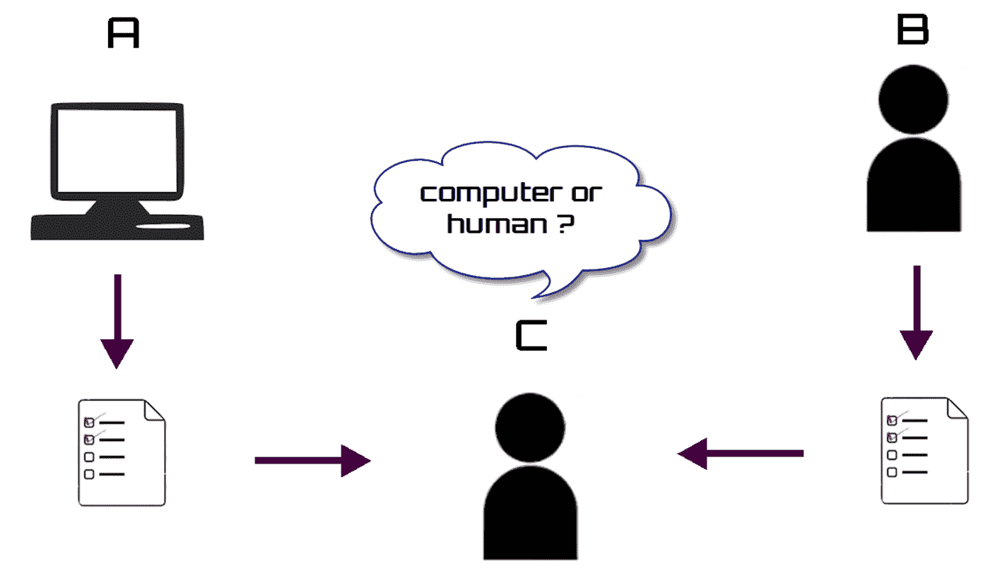

图灵的游戏——尽管有众多批评认为这一标准不足以确定机器是否能够思考——在过去几十年中引发了一场挑战，导致了以越来越准确的方式模拟人类语言的软件的创建。

1990 年，一项名为**洛布纳奖**的竞赛成立，基于图灵测试，以奖励行为最接近人类思维的计算机。这项竞赛每年举行一次。以下是竞赛的官方网站：[`www.aisb.org.uk/events/loebner-prize`](http://www.aisb.org.uk/events/loebner-prize)。

# Eliza

1966 年，约瑟夫·魏岑鲍姆创建了 Eliza 程序，旨在模仿治疗师和患者在他们初始阶段之间的对话。在程序中，发生了一系列简单的问题交换，这些问题不需要深厚的情感深度。以下截图展示了一个简单的 Eliza 聊天机器人：

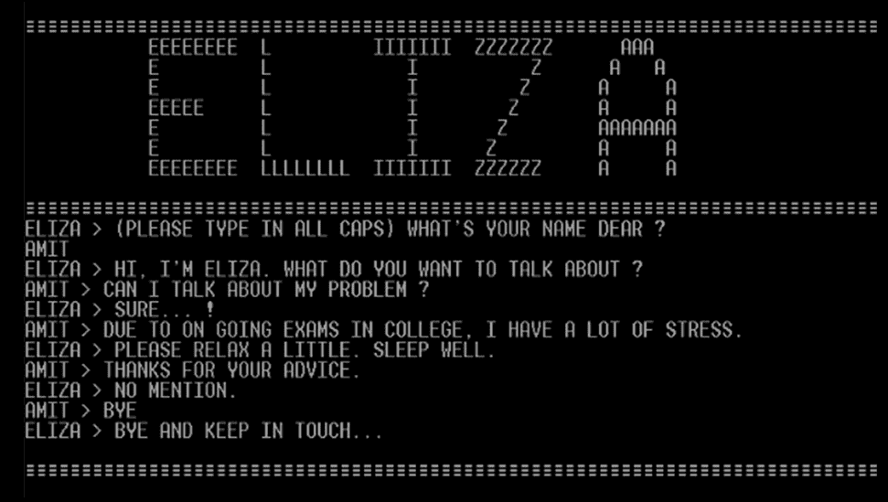

Eliza 依赖于使用正则表达式将用户输入转换为输出，以便使对话保持连续性以及明显的连贯性。在其他时候，它不会产生任何上下文观察，而是产生与心理治疗师态度完全一致的内容，例如*非常有趣*、*请*、*继续*或*c*an you elaborate on that?*

# 帕里

帕里继续留在医疗领域，模拟了患有偏执型精神分裂症的人的行为。它于 1972 年由精神病学家肯尼斯·科比开发，作为他在处理真实患者之前为学生提供的一种实践工具。

在图灵测试的一个轻微变化中，精神科医生被要求阅读 Parry 的记录和真实患者的记录，以区分这两者来自哪里。这在当时是一个令人难以置信的结果；精神科医生只成功地在 48%的时间里识别出行为上的差异。

1973 年 1 月，在国际计算机会议期间，计算机科学先驱 Vint Cerf 决定将机器人带到它们的逻辑结论。使用 ARPANET，他设置了 Eliza 和 Parry 之间的对话。这是一次计算机思维的跨海岸会议；Eliza 位于麻省理工学院，Parry 位于斯坦福大学。以下是从两个机器人之间的对话中摘录的一段简短对话：

+   Eliza：*晚上好。告诉我你的问题。请用句号或问号结束输入。*

+   Parry：*有时候人们让我感到烦躁。*

+   Eliza：*我不确定我是否完全理解你。*

+   Parry：*你应该更加注意。*

+   Eliza：*也许你应该更加注意。*

+   Parry：*你有权持有自己的观点。*

+   Eliza：*是什么让你认为我有权持有自己的观点？*

+   Parry：*仅仅和普通人在一起就让我感到烦恼。*

+   Eliza：*请继续说。*

+   Parry：*我之前去过 Bay Meadows 的跑道。*

+   Eliza：*这对你有什么启示？*

+   Parry：*我去过赛马。*

# Jabberwacky

Jabberwacky 是由程序员 Rollo Carpenter 于 1988 年创造的。这个机器人的目标是通过图灵测试。Jabberwacky 能够以幽默的方式模拟人类的声音。目前，该机器人的开发仍在继续，旨在将系统应用于机器人或会说话的宠物，基于声音学习。

这是一个基于机器学习的机器人；实际上，为了与我们互动，它只使用学到的材料，并借用我们的一些智慧，同时增加它的知识。没有硬编码的规则，它完全基于反馈的原则。

Cleverbot 是 Jabberwacky 在 1997 年发布的一个变体，取得了显著成果；2011 年，它参加了印度 IIT Guwahati 的图灵测试，有 59.3%的概率被认为是人类。

# Dr. Sbaitso

Dr. Sbaitso 也被设计成模拟能够解决用户情感问题的心理学家的行为，并且可以在使用 MS-DOS 操作系统的个人电脑上使用。它由 Creative Labs 于 1992 年开发，旨在展示声卡生成合成声音的能力。以下截图显示了 Dr. Sbaitso 中的欢迎信息所在的 MS-DOS 窗口：

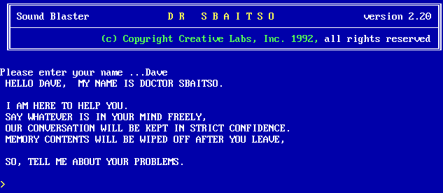

大部分问题是`WHY DO YOU FEEL THAT WAY?`。因此避免了更复杂的互动。当他收到他无法理解的句子时，他通常会回答`THAT'S NOT MY PROBLEM`。

# ALICE

**人工语言互联网计算机实体** (**ALICE**) 是基于 **自然语言处理** (**NLP**) 的开源软件，由科学家理查德·S·华莱士于 1995 年设计。Alice 的解释系统基于最小化方法。句子的意义通过特定的关键词或术语（根）来阐述，避免了深入和复杂的分析。Alice 三次赢得了 Loebner 奖：2000 年、2001 年和 2004 年。

# SmarterChild

SmarterChild 是一个非常成功的聊天机器人，可在 AOL 即时消息和 MSN 即时消息上使用。由 ActiveBuddy Inc. 于 2001 年开发，被超过 3000 万用户使用。从 SmarterChild 的快速成功中衍生出了面向市场营销的机器人，如 Radiohead、Austin Powers、Intel、Keebler、体育新闻等。

# IBM Watson

Watson 是 IBM 在 2006 年开发的人工智能系统，能够回答以自然语言表达的问题。最初，Watson 是为了参加一档名为 **Jeopardy!** 的美国电视智力竞赛而创建的。然而，在第一次参赛时，它只能回答 35% 的问题。在 IBM 团队进行多次改进后，Watson 于 2011 年再次尝试，这次它成功地击败了智力竞赛的人类冠军。

在游戏中，Watson 在没有连接到互联网的情况下工作，利用了 4 个 terabytes 的磁盘空间。后来，它被用于许多其他完全不同的环境中，例如在纪念斯隆-凯特琳癌症中心管理肺癌治疗决策。

# 构建机器人

在早期的聊天机器人中，使用了相当简单的算法来分析输入消息并返回输出响应；这些算法旨在通过提供一致的输出响应来模拟计算机对输入中提出的内容的理解。随着时间的推移和技术的发展，越来越多的复杂人工智能方法被创造出来，使得聊天机器人能够建立越来越接近人类真实对话的对话。为了正确设计聊天机器人，从哪些基本点开始是必要的？机器人构建的基本主题包括意图、实体和上下文。在下一节中，我们将分析它们，以了解如何有效地使用它们。

# 意图

用户的意图是他们的目的，最终目标。例如，订购某物、想要激活用户窗口上的某物、寻找节目，或者只是说再见。聊天机器人应该能够根据从用户消息中检测到的意图执行一些操作。

假设我们想要创建一个为销售 IT 相关产品的商店设计的聊天机器人。作为一个初步程序，有必要考虑聊天机器人在被用户请求后能够执行哪些操作。例如，当用户请求查看商店销售的产品时，聊天机器人需要向用户提供适当的信息，比如：“我想买一个鼠标”。同样，当用户发送消息，如“在罗马找一个商店”时，聊天机器人应该能够定位到该特定位置附近的商店。为了执行这些操作中的每一个，聊天机器人必须能够区分用户的两种意图：搜索产品或销售点。在以下图中，用户表达了两种可能的意图：

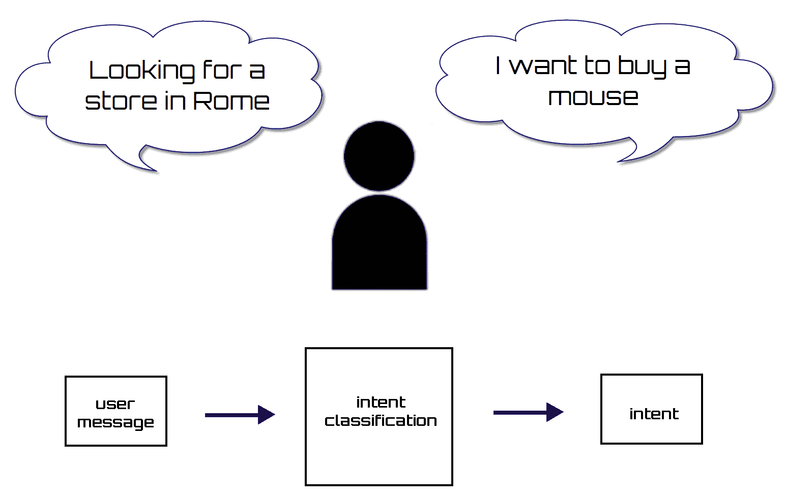

从用户消息中检测意图是机器学习领域的一个非常普遍的问题。这是称为**文本分类**的技术，其中程序的目标是将文档/短语分类到几个类别中，这些类别代表了用户的意图。理解用户的请求是什么是聊天机器人的智能部分，因为自然语言中表达请求的方式有很多。聊天机器人将通过识别最接近的意图来尝试解释用户的请求。当然，这种关联并不总是精确的；事实上，会返回可能的解释的排名。但从这个角度来看，可以通过提供更多相同请求的替代示例来改进答案。

# 实体

实体是用户消息中包含的相关主题，例如一个物体、一种颜色或一个日期。如果意图是在网页上激活某个功能，用户也可能指明是什么，比如一个按钮或一个窗口。因此，实体是聊天机器人可以识别的关键词。多亏了这些实体，聊天机器人能够识别对话的主题，从而提供有针对性的信息作为输出。在以下图中，聊天机器人识别出了两个可能的实体：

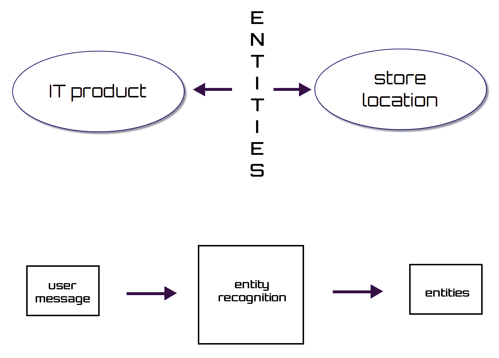

假设我们有一个以下的消息作为输入：`我想买一个显示器`。很明显，用户想要购买一个 IT 产品，但如果聊天机器人无法识别用户试图购买的产品类型，返回的信息将关于所有类型的 IT 产品，其中许多对用户来说并不感兴趣。如果聊天机器人能够检测到用户试图购买显示器，那么它将只返回关于这种 IT 产品的信息，从而减少可用的选项。这对用户是有益的。

# 上下文

聊天机器人是为了简化并自动化流程而创建的。因此，如果一个聊天机器人使人类以前简单管理的过程变得复杂，那么它就失败了。例如，假设你搜索天气信息。如果你用手机请求信息，服务提供商可能会使用你的电话号码查找你的账户信息，就像你的地址一样。同样的程序应该适用于聊天机器人。如果你旨在创建一个与使用手机相当或更有效率或更无效的机器人，那么聊天机器人的上下文就极其重要。

当我们谈论聊天机器人的上下文时，我们指的是机器人能够识别它已经知道的信息，并且能够只查找它需要提供适当解决方案的未知信息。在这种情况下，它必须提供未来几天该地区的天气信息。如果这个天气信息聊天机器人适当地使用上下文，那么它就不应该询问它已经知道的信息。由于上下文的维护，使用机器人已经持有的信息，使得返回信息的程序变得更快。

一旦意图和实体被放入系统中，对话的逻辑流程就创建了，因为区分对话和简单的**常见问题解答**（**FAQs**）的是上下文。多亏了上下文，我们才能将用户的当前输入与之前提到的输入联系起来。

上下文在聊天机器人和用户之间来回传递。维护对话从一回合到下一回合的上下文是聊天机器人的责任。上下文包括与每个用户对话的唯一标识符，以及每次对话回合增加的计数器。如果我们不保留上下文，每一轮输入似乎都是一次新对话的开始。

# 聊天机器人

我们不需要从头开始设计聊天机器人。事实上，我们可以利用程序员在开发我们之前章节中分析的应用程序过程中积累的经验。收集到的所有信息代表了一种知识，我们可以从中提取对我们应用程序有用的线索。

# 必要要求

首先，我们可以看看一个优秀的聊天机器人必须满足哪些要求，以确保它提供服务的成功。以下列表提到了我们必须记住的聊天机器人设计的一些关键要素：

+   **保证用户最小手动努力**：这是聊天机器人设计中的起点。为了服务的成功，必须通过最小化手动干预来陪伴用户的选择。这是通过大幅减少帮助机器人确定最佳解决方案所需的触摸、按键或鼠标点击次数来实现的。为此，你需要确保大多数选项都由同一个聊天机器人提供，用户只需选择正确的选项。这样，在用户与聊天机器人的交互中可以节省大量时间。

+   **预测正确选项**：为了确保系统只显示与该上下文相关的选项，必须通过一系列选择提供正确的选项。为了实现这一点，系统必须能够识别用户的需求。用户需求必须通过最少的提问和用户的手动努力来识别。

+   **聊天机器人的定制**：这是根据服务用户的特点构建不同用户聊天机器人交互的可能性。例如，系统可以记住用户档案、之前的交互、系统中其他用户的交互、当前上下文和环境知识。理解用户及其当前可能需要什么，必须将这些属性与其他属性一起理解。

# 文本的重要性

在应用任何文本解释策略之前，必须进行一系列的加工。特别是，以下阶段很重要：

+   **文本清理**：文本被清理掉所有可能改变后续分析结果的因素（例如，消息开头和结尾的空格）

+   **验证文本字符**：检查文本是否包含等同于其他可能使后续分析无效的字符

+   **文本规范化**：将大写字母转换为小写字母，这样用大写字母而不是小写字母写的同一个单词将被以相同的方式解释（这种方法并不总是最优的，因为有时大写字母可能具有歧视性价值）

# 单词转换

这种技术已被 Eliza 类型的聊天机器人广泛使用。它包括重新表述输入消息以生成相应的输出。例如，如果用户写道 *you are a chatbot*，聊天机器人的回答将是 *so you think I'm a chatbot*。

使用这种技术进行的替换主要涉及人称代词（you → me）和动词（you are → I am），因此将所有第一人称形式转换为第二人称形式，反之亦然。

# 检查值与模式的一致性

任何使用过文字处理程序的人都必须面对在括号内搜索文本字符串的问题。也许我们并不知道，我们遇到了模式匹配问题。模式匹配是一种检查标记序列是否具有某种模式的过程，即一组遵循特定模式的字符。

词汇标记，或简称为标记，是一个具有分配和因此识别的意义的字符串。它由一个标记名称和一个可选的标记值组成的对构成。标记名称是词汇单元的类别。

至于聊天机器人对输入的解释，模式匹配对于识别某些消息集是有用的。例如，通过模式匹配，你可以对包含单词*hello*或*hi*的所有消息回答*Hello!*；或者你可以通过检查最后一个标记是否为*?*来识别消息是问题类型。

正则表达式是模式识别的一个非常有用的工具，它提供了一种识别字符串集合的符号系统。

# 维护上下文

存储上下文是一种策略，用于跟踪之前说过的话，并能够将其用于对话。当聊天机器人的响应不能仅基于用户发送的最后一条消息，而必须从某些之前的消息中获取信息时，这变得必要。

为了更好地理解上下文管理的作用，让我们举一个例子：

+   用户：*我的名字是 Giuseppe.*

+   聊天机器人：*好的，Giuseppe。*

+   用户：*我的名字是什么？*

+   聊天机器人：*你之前在叫你 Giuseppe 之前告诉过我。*

如果用户尚未声明他的名字，聊天机器人的回答将不得不类似于：

+   用户：*我的名字是什么？*

+   聊天机器人：*你仍然没有告诉我你的名字。*

因此，理解如何管理上下文以形成答案是很简单的。这对于使聊天机器人看起来不那么机械而更有人性化至关重要。

记住之前的消息对于检测用户重复发送消息是有用的，或者它可以通过在选择下一个之前检查最后一条消息的值来防止相同的聊天机器人发送相同的消息。

# 聊天机器人架构

聊天机器人的主要模块是对话管理器。该模块控制人机交互的流程。它接收用户的请求作为输入，并决定系统的响应应该是什么。它将以某种形式记住对话上下文，例如通过键值对，来管理用户和系统之间多步骤的对话。

为了使对话管理器能够为用户提出的请求选择正确的答案，有必要理解用户意图。在最能理解人类语言的先进聊天机器人中，用户的表达将被转换为包含用户意图和实体的语义表示。这项操作将由自然语言理解模块执行。该模块必须事先经过训练，以理解开发者先前识别的一系列用户意图。该模块基于**自然语言理解（NLU**）组件。

在语音输入的情况下，系统还必须配备一个可以将输入转换为文本的语音识别模块，然后再将其传递到自然语言理解模块。在操作结束时，系统响应（输出）必须首先通过语音合成器模块处理，该模块将系统的文本响应转换为语音。

当用户输入被理解时，对话管理器会采取行动。为了执行操作或生成响应，对话管理器从数据源检索所需信息。之后，响应生成组件生成响应消息并发送回用户。以下是一个聊天机器人架构方案图：

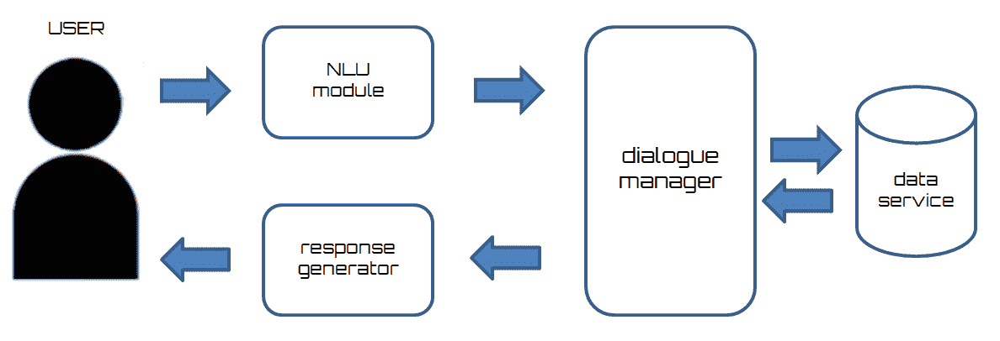

为了跟踪上下文，对话管理器保持对话状态，以了解请求是否与之前的对话相关，或者是否将新主题引入对话。

# 自然语言处理

自然语言处理（NLP）是计算语言学的一个领域，它处理计算机与自然语言之间的交互。

计算语言学通过计算机方法处理自然语言的分析和处理。它侧重于发展自然语言功能的描述性形式化，以便它们可以被转换成计算机可以执行的程序。

传统上，计算机要求你通过编程语言与之交互，因此它应该是一种精确、无歧义且高度结构化的通信方式，使用有限数量的已知命令。相反，人类语言并不精确；它通常是模糊的，语言结构可能取决于许多不同的变量，例如方言和各种社会环境。

因此，NLP 是一个极其重要的领域，因为它研究和试图解决计算机在解释或分析人类语言时遇到的全部困难。人类语言的众多歧义使得算法理解人类语言特别困难。要理解一个话语，有必要对现实和周围世界有更广泛的知识。实际上，仅仅了解每个单词的含义并不足以正确解释句子的信息；相反，它可能导致矛盾和无意义的交流。

自然语言的研究是通过一系列精确顺序的步骤进行的，这些步骤以不断增长的语义价值为特征，如下所述：

+   发音并解码一种语言的声音，使我们能够识别声音和字母。

+   了解一种语言中的单词，它们的结构（复数/单数）以及它们的组织（名词、动词和形容词）。词汇分析识别构成该语言的词汇并从词典中找到定义。形态分析识别复数/单数结构、动词方式和动词时间；并为每个单词分配其自身的形态类别，即形容词、名词和动词。

+   在复杂成分（词性）中组合单词。句法识别词性作为主语、谓语、补语或具有单一意义的单词组，如热狗，或具有完整句法树派生的名词和动词部分。

+   将意义赋予简单和复杂的语言表达。语义学试图根据上下文识别单词的意义。

+   在适合交流目的的语境、情境和方式中使用句子。实用主义者观察语言是如何以及为什么目的被使用的，区分它是叙述、对话、隐喻等问题。

然后将获得的结果应用于 NLP 的两个主要类别：

+   **自然语言生成**（**NLG**），它涉及将数据库中的信息转换为人类可读语言

+   NLU，它将人类语言转换为程序易于操作的形式

NLP 面临许多问题：

+   **语音分割**：将语音轨道转换为具有完整意义的字符和单词

+   **文本分割**：识别用汉字而不是字母书写的文本中的单个单词（如中文、日语、泰语等）

+   **词性标注**：识别句子中的语法元素，如名词、形容词、动词、代词

+   **词义消歧**：从上下文中推断出通常用于表示多个概念的术语的意义

+   **不完整或不规则输入**：识别和纠正任何地方口音、打字错误或由光学字符识别工具产生的错误

语言领域阐述的困难也可以通过考虑自然语言本身最明显的特征来解释：

+   灵活性，因为它使用不同的方式来确认同一个事实

+   含糊性，因为同一个陈述可以有多个含义

+   动态性，由于新词的不断创造

正是因为这些特殊性，自然语言的理解通常被认为是一个 AI 完全问题，即一个其解决方案相当于创建 AI 本身的问题。实际上，理解文本需要理解与之相关的概念，因此需要广泛的知识和对现实的深刻理解，以及强大的操纵能力。

**AI 完全**被定义为最困难的问题；也就是说，它们呈现的计算问题等同于解决 AI 本身的问题——使计算机像人一样智能。因此，AI 完全这个术语表明了一个不会通过简单的特定算法解决的问题。

对于人类来说，语言理解是心理过程的结果，这个过程在机器中无法复制；此外，语言是人与人之间沟通和互动的一种形式，它反映了意义的表面，并使人们能够相互理解。然而，无论计算机的软件多么复杂，它仍然基于先验确定的程序。

# 自然语言理解

NLU 包括阅读用自然语言表达的文字；通过赋予其中存在的术语、句子和段落以意义来确定其含义，并通过对这些元素进行推理来揭示它们的显性或隐性属性。特别是，在建模文本表示时最突出的问题之一是捕捉概念之间的语义关系。为了解决这个任务，文献中提出了几种方法，其中一些提到了访问外部知识库。另一些方法则构建语义分布空间，分析文本集合的内容，而不使用先验知识。

在 NLU 的定义下，计算机应用的范围非常广泛，从简单的操作，如给机器人的简短命令，到复杂的操作，如对文本的全面理解。在现实世界中，现在广泛使用基于 NLU 的算法；例如，对电子邮件中的文本进行分类以分配标签，不需要对文本有彻底的理解，但它需要处理许多词汇项。

文本输入的拆解和解析过程非常复杂，因为输入中出现了未知和意外的特征，并且在输出语言时需要确定适用于它的适当句法和语义方案（这些因素是预先确定的）。在下面的图中，你可以看到 NLU 过程的流程图：

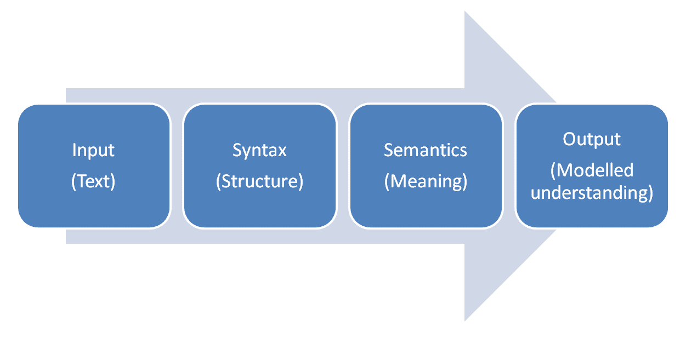

NLU（自然语言理解）帮助我们分析输入文本的语义特征并从内容中提取元数据，例如类别、概念、情感、实体、关键词、元数据、关系和语义角色。通过 NLU，开发者将文本翻译成机器可读的正式表示，使其内容的相关方面明确化。

# Google Cloud Dialogflow

从聊天机器人到物联网设备，广泛使用的对话式虚拟助手应用能够以最自然的方式与人类语言互动，这表明需要创建更多引人入胜的个人交互。挑战是双重的：不仅需要识别和传输优化的基本信息，还需要涉及用户并帮助他们实现目标。这要求自动系统尽可能适应其目标用户的语言，这得益于数据分析和机器学习及人工智能技术的力量。

# Dialogflow 概述

Google 通过 Dialogflow 应对这一挑战，Dialogflow 是一个基于机器学习的创建语音和文本对话应用的平台。它支持 14 种语言，并且可以通过服务 API 与主要的聊天平台集成，如 Google Assistant、Facebook Messenger、Slack、Skype、Telegram 以及其自身的应用。

最近，鉴于开发者对在标准版本中添加商业功能的大量需求，Google 宣布推出 Dialogflow 企业版，目前处于测试阶段。

以下是一些 Dialogflow 提供的功能：

+   **基于机器学习的对话交互**：Dialogflow 使用自然语言处理（NLP）来创建更快的对话体验并快速迭代。只需提供一些用户可能说的话的例子，Dialogflow 就会创建一个特定的模型，该模型可以学习激活哪些动作以及提取哪些数据以提供最相关和最准确的答案。

+   **一次创建，处处部署**：使用 Dialogflow 创建对话应用，并将其部署到您的网站、应用或包括 Google Assistant 和其他流行消息服务在内的 32 个不同平台。Dialogflow 还包括多语言支持和多语言体验，以覆盖全球各地的用户。

+   **高级满足选项**：满足意味着对用户所说内容的相应动作，例如处理食品订单或激活对用户问题的正确答案。为此，Dialogflow 允许您连接到任何 Webhook，无论它托管在公共云还是本地。Dialogflow 集成的代码编辑器允许您直接在 Dialogflow 控制台中编码、测试和实施这些动作。

+   **语音识别与语音识别**：Dialogflow 使对话应用能够响应命令或语音对话。它可以通过一个 API 调用实现，该调用结合了语音识别和自然语言理解。

除了理解自然语言之外，Dialogflow 的灵活性也允许开发者超越决策结构和功能，例如与云函数的深度集成，可以直接将其界面中的基本无服务器脚本写入其中，这使得 Dialogflow 与一些竞争对手区分开来。Dialogflow 还简化了与其他应用程序的连接，无论它们托管在哪里。如果你想要将你的对话应用与你的订单和发货系统集成，这将是必需的。

# Dialogflow 基本元素

在详细分析构建聊天机器人的实际案例之前，建议详细分析 Dialogflow 的基本元素。我们现在将介绍在聊天机器人构建中最常用的元素。

# 代理

代理是一个响应特定任务的程序。它可以是一个负责酒店房间预订的接待员。或者它可能是一个了解所有产品和价格表的在线商店的商业专家。或者它可能是一个为我们购买的家用电器提供合格技术支持的合格技术支持人员。或者它可能是汽车的机载计算机。

重要的是，一个智能代理有一个特定的目的和有限的知识库；我们并不感兴趣与那个负责航班预订的机器人下棋，而且无论如何它也无法做到这一点。

使用 Dialogflow，创建代理非常简单；只需访问服务的初始页面，点击创建代理按钮，给它起一个名字，如下面的截图所示：


要访问 Dialogflow，只需使用 URL [`dialogflow.com/`](https://dialogflow.com/)。你可以注册或使用 Google 账户并登录。

# 意图

意图是最终用户可以向代理提出的问题。预订酒店房间是一个意图；另一个意图是咨询午餐时间，或者取消已经做出的预订。

理解用户的请求是什么是代理的智能部分，因为请求可以用自然语言以多种方式表达，即我们人类所谈论的内容。

代理将通过识别最接近的意图来尝试解释用户的请求。自然地，这种关联并不总是精确的；事实上，会返回可能的解释的排名。但是，从这个角度来看，我们可以通过提供更多相同请求的替代示例来改进答案。此外，还可以应用机器学习算法来从之前的答案中学习。

# 实体

如果一个意图与请求匹配，实体对应于细节。在预订酒店房间时，您需要知道确切的日期、将入住的人或用户的请求。从代理的设计角度来看，像酒店房间这样的实体被定义，并包含所有必要的细节。

Dialogflow 有一系列已创建的系统实体，这些实体有助于管理更简单的概念（例如，日期）。开发者可以定义一系列实体（开发实体）以概括代理的行为。最后，最终用户为每个请求创建一个实体。开发实体可以具有由列表确定的值、执行映射或由其他实体组成，等等。

# 动作

到目前为止，我们处理的是对用户请求的解释；现在则是回答的问题。实际上，这个概念更为广泛；一旦我们理解了一个请求，我们就可以满足它，例如，预订房间、开票或与餐厅沟通。但如果我们在制作聊天机器人，答案可能将对应于动作。

一个动作对应于当用户的输入触发特定意图时，应用程序将采取的步骤。动作的名称及其参数都在意图的动作部分定义。

# 上下文

客人何时到达酒店？你吃了什么？这些短语在没有上下文的情况下是没有意义的，但在更广泛的对话上下文中变得可以理解；这就是上下文的作用。从上下文中收集参数的语法非常简单：

```py
  # context_name.parameter_name
```

使用 Dialogflow，上下文保持时间为 10 分钟或五次请求。

# 使用 Dialogflow 构建聊天机器人

在分析了 Dialogflow 的主要组件之后，现在是时候关注实际应用了。实际上，我们将创建一个简单的聊天机器人，帮助用户检索关于世界上最美丽城市的天气信息。

首先要做的是创建代理，即包含您想要向用户提供的意图、实体和答案的项目。意图是收集用户请求（使用实体）并指导代理相应响应的机制。对于不包含对话外收集信息的简单答案，您可以直接在意图中定义答案。您可以使用自己的逻辑和 Webhook 来执行更复杂的响应。

Webhook 是调用执行要执行的动作的代码的 URL。与其它环境不同，Dialogflow 还允许您使用 HTTP 协议（而不仅仅是 HTTPS 协议）。

# 代理创建

要创建代理，请执行以下步骤：

1.  如果您还没有 Dialogflow 账户，请注册。如果您已有账户，请登录。

1.  点击左侧导航中的“创建代理”并填写字段。以下窗口将被打开：

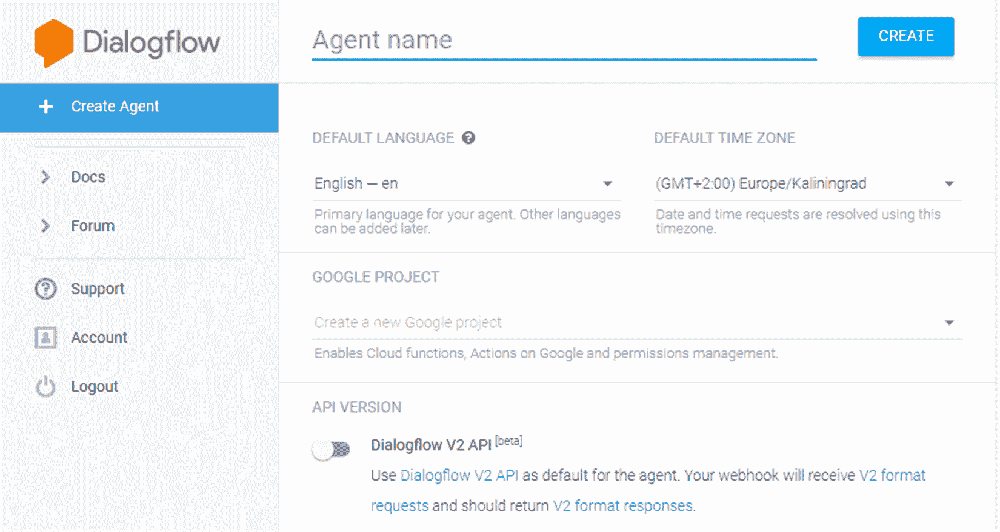

在此窗口中，我们需要设置一些参数：

+   +   代理的名称。

    +   代理的主要语言。

    +   时区设置。日期和时间使用此时区进行解析。

    +   Google 项目。这使 Cloud functions、Google 动作和权限管理成为可能。

已有一系列代理（预构建代理）可用于某些类型的请求，可以根据您的需求进行定制和丰富。可用的代理数量取决于语言；在英语中，有超过 30 个不同的代理可用。

1.  点击保存按钮。

# 意图定义

如我们之前所说，用户的意图是他们的目的，最终目标。例如，订购某物、想要在用户窗口上激活某物、寻找节目，或者只是说再见。聊天机器人应该能够根据从用户消息中检测到的意图执行一些操作。

要创建一个意图，请点击“意图”旁边的加号图标；以下窗口将被打开：

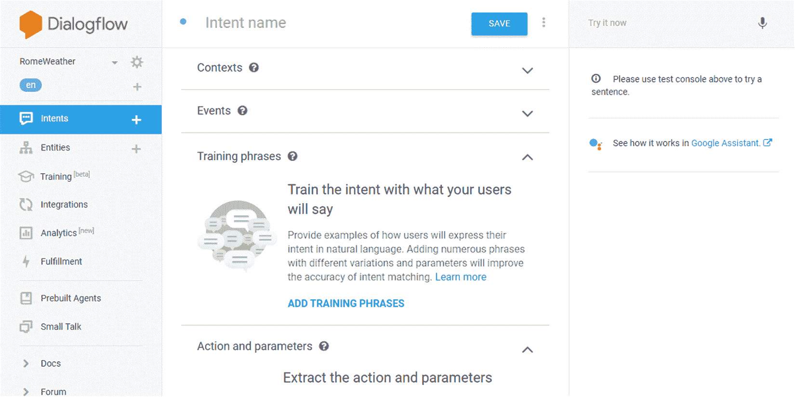

在此窗口中，我们需要设置一些参数：

+   意图名称：意图的名称。

+   上下文：这是用于管理对话流程的。

+   事件：这是一个允许您通过事件名称而不是用户查询来调用意图的功能。事件可以被外部服务用来触发 Dialogflow 意图，例如，Google Assistant 的内置意图。

+   训练短语：必须以自然语言报告识别意图的短语。您可以使用示例（示例模式由“图标”识别）和模板（模板模式由“@”图标识别）。还提供了其他句子的示例，越多，代理将越智能，或者他将能够更好地识别用户请求并解决歧义。

+   动作和参数：这指定了要执行的可能动作及其可以从对话中提取的参数。

+   响应：当识别到意图时，必须报告返回给用户的答案。为了使其更人性化，您可以输入相同答案的不同变体。答案也可以参数化，并且根据所使用的集成，它们可以由丰富的消息组成。

+   履行：调用网络服务以连接您的后端。将意图、参数和上下文发送到您的云函数或网络服务。执行必要的逻辑并以书面、口语或视觉响应进行响应。

当插入示例句子时，它会自动标记，识别收集为实体的部分。一个代理总是包含一个默认的回退意图，收集所有没有识别到其他意图的情况。

我们想要插入的第一个意图的目的是指定与我们的天气预报相关的位置。我们说意图代表用户的意图，因此我们需要思考用户可能会提出哪些问题以获取天气预报。我们需要不同的意图，因为询问相同内容的方式有很多。识别意图的过程是将用户可以用来表达意图的所有可能方式映射出来。我们可能期望从用户那里得到的要求应在训练短语部分中指定。为了开始，让我们插入以下短语：

+   `罗马的天气怎么样`

+   `罗马的天气怎么样`

+   `罗马的天气`

+   `罗马天气预报`

要插入单个短语，只需在训练短语文本字段中添加用户表达式，然后按*Enter*键添加另一个短语。我们会注意到句子将被添加到我们的意图声明中。特别是，我们可以看到单词 Rome 被突出显示。这意味着它被标记为分配给现有城市实体的参数，如下面的截图所示：

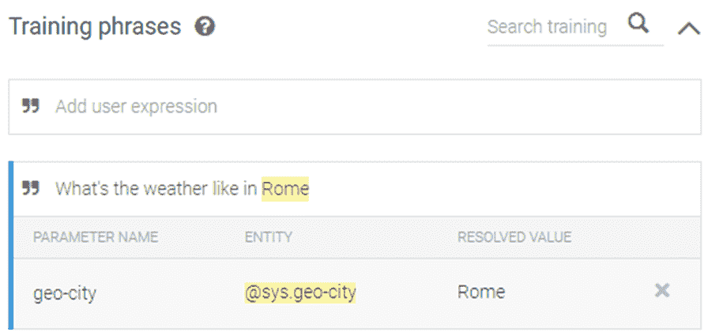

我们继续插入句子。在定义位置之后，还需要定义时间。很明显，用户将需要知道特定日期的预测，例如今天或明天。然后我们也包括以下短语：

+   `今天天气怎么样`

+   `明天的天气预报`

+   `罗马今天的天气预报`

如前所述，时间参数也被突出显示，这次颜色不同。最后一句很有趣，因为它包含了一个`date`参数和一个`geo-city`参数，如下面的截图所示：


要开始，我们保留其他字段不变，只关注聊天机器人将提供给用户的答案。到目前为止，我们还没有考虑任何外部参考来检索用户请求的信息。这意味着至少现在，我们不得不插入这样的模糊答案：

+   `很抱歉，我现在没有这个信息`

+   `日期为$date 的预报不可用`

+   `在$geo-city 的日期为$date 的天气预报不可用`

在最后两个短语中，我们插入了以下参考实体：`$date`和`$geo-city`。因此，当代理响应时，它会考虑收集到的参数值，并使用包含这些值的回复。

一旦完成，我们点击保存按钮。以下消息出现在窗口的右下角：

+   意图已保存

+   代理训练开始

+   代理训练完成

意义很明确。既然你的代理能够理解用户的基本请求，现在就尝试一下你到目前为止所做的一切。要尝试新创建的代理，我们可以使用右上角控制台中的相应框。为此，我们只需输入一个请求。让我们通过输入与“训练短语”部分给出的示例略有不同的请求来测试我们的代理。例如，我们询问：“今天罗马的天气怎么样”。之后，我们按下*Enter*键，随后返回以下窗口：

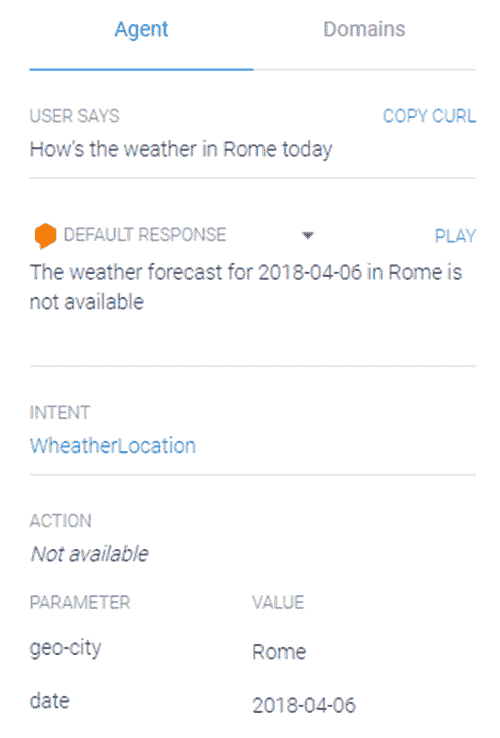

我们可以理解那些未能恢复搜索信息的用户的挫败感，但至少现在我们可以满意，因为代理已经正确理解了问题并提供了合理的答案。记住，至少目前，预报数据是不可用的，这就是代理所说的。此外，正如预期的那样，代理已经识别出两个参考实体，并重新使用它们来构建响应。

# 摘要

在本章中，我们发现了聊天机器人的神奇世界。聊天机器人是机器人，通过与用户进行聊天互动，能够通过执行极其有限的任务来帮助他们：提供当前账户的信息、购票、接收天气预报等。

首先，我们研究了该主题的基本概念，从 20 世纪 50 年代聊天机器人的历史开始，包括艾伦·图灵的努力以及各种随后的聊天机器人实现，它们完善了基本概念。Eliza、Parry、Jabberwacky、Dr. Sbaitso、ALICE、SmarterChild 和 IBM Watson 是最重要的例子。随着时间的推移和技术的发展，越来越多的复杂人工智能方法被创造出来。

在介绍基本概念之后，我们专注于聊天机器人的设计技术，然后转向分析聊天机器人的架构。我们探讨了自然语言处理（NLP）和自然语言理解（NLU）的有趣领域。

在本章的最后部分，我们介绍了基于机器学习的语音和文本对话应用平台 Google Cloud Dialogflow。它支持 14 种语言，可以与主要的聊天平台集成。最后，我们创建了一个简单的聊天机器人，帮助用户获取世界上最美城市——罗马的天气预报。这至少是一个心灵旅行的好机会。
