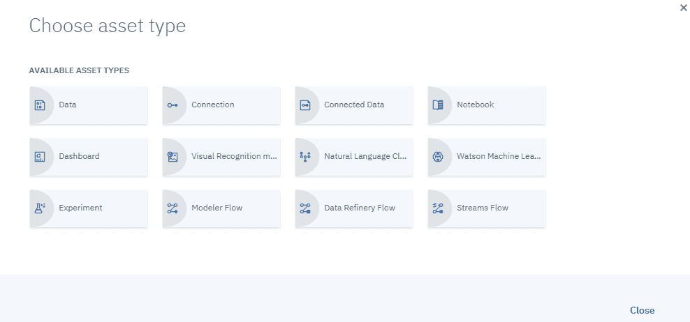

# 特征提取 - 一系列技巧

在本章中，我们将提供从实际数据中提取和选择特征的实际操作指南，重点是实际机器学习系统都是关于适当的特征工程。本章将专注于教你向机器学习算法提供数据的最佳实践。此外，它将向你展示如何移除可能对机器学习系统性能产生负面影响的数据冗余。最后，它将向你展示一些从不同来源组合数据的策略。

本章我们将涵盖以下主题：

+   预处理

+   维度缩减

+   数据融合

+   一系列技巧

# 预处理

预处理是什么意思？

除了选择你想要用于特定机器学习项目的特定数据集之外，你还需要预处理这些数据。这通常涉及格式化、清理和采样（或分析）。我们不会深入探讨每个任务的定义，并假设读者已经理解了它们的意义和目的。我们可以这样说，**格式化**是将数据源以易于在项目中理解和消费的形式呈现的方式。**清理**主要关注移除不需要的数据，而**采样**则是为了性能原因减少数据的总体大小。

尽管内心深处我是一个开发者，渴望通过编写脚本或从开源库中选择函数来承担这些任务，但让我们来探索 Watson Studio 为我们提供实现这些目标的功能。

# 数据精炼器

作为预处理的一部分，Watson Studio 为你提供了精炼数据的能力。在线文档中将精炼数据描述为数据的清理和塑形。

当你在 Watson Studio 中使用精炼器功能操作数据时，你构建了一个被称为定制数据精炼流程的东西。我们可以通过以下步骤尝试数据精炼器提供的一些功能和函数（从一些设置开始）：

1.  要创建一个项目，你点击 Watson Studio 我的项目页面右侧的“新建项目”，如下面的截图所示：


1.  接下来，选择一个项目启动器。我们将选择数据工程，如下面的截图所示（根据你的选择，你可能需要在此步骤中选择或配置所需的服务；对于我们的选择，不需要额外的服务）：


1.  在新建项目屏幕上，你可以为项目添加名称和描述，如下面的截图所示：


在这一点上，您需要选择是否限制您可以添加为协作者的人员（在本例中，我们将使用默认设置），并且当您添加需要这些服务的资产时，可能会提示您添加服务（在本例中，不需要额外的服务，但作为参考信息，您也可以在通过设置页面创建项目后添加其他服务）。

1.  接下来，点击“创建”，如图所示：


点击“创建”后，Watson Studio 将为您准备项目，显示如图所示的对话框：


最后（通常只需要一分钟左右），您的新项目将打开，准备就绪，您就可以开始享受开发它的乐趣了！

# 数据

当然，每个项目都需要数据，所以下一步是将数据添加到我们的项目中。当您添加数据时，它被视为**数据资产**，默认情况下，所有项目的协作者都可以自动访问数据。按照以下步骤将数据文件添加到您的项目中：

1.  从项目的“资产”页面，点击“查找并添加数据”图标，如图所示：


1.  接下来，点击“加载”，然后浏览找到文件，或者如图所示将其拖动到“加载”面板上：


您必须留在该页面上，直到加载完成。如果您想停止加载文件，可以取消正在进行的加载过程。请注意，在文件加载时，实际上并没有任何进度指示器，所以请给它几分钟时间！！

我们在这个项目中使用的文件（`combine.csv`）是一个逗号分隔的文本文件，其中包含参加 NFL 选秀训练营的球员的统计数据。

1.  您添加的文件将保存在与您的项目关联的对象存储中，并在项目的“资产”页面上列出为数据资产（如前图所示）。从那里，您必须选择特定的文件，然后点击“添加为数据资产”。此时，您将被提示点击“应用”，如图所示：


现在，我们已经准备好在我们的项目中使用这个文件：


# 添加精炼器

让我们按照以下步骤添加精炼器：

1.  要访问 IBM Watson Studio 数据精炼器，您可以点击“添加到项目”，如图所示：


1.  然后，选择“数据精炼流程”，如图所示：



1.  在你调用精炼器之后，你需要通过点击数据资产（文件）来添加我们的数据文件，然后点击页面右下角的“添加”。一旦数据被读入精炼器（如下面的截图所示），你就可以开始处理它：


# 通过使用命令精炼数据

而不是使用脚本处理或精炼你的数据，你可以使用命令（也称为**操作**）来预处理数据。为此，你可以先输入一个命令（或**操作名称**），让 Watson Studio 的自动完成功能帮助你找到正确的操作和语法（无需编程！）。

注意，当你悬停在任何操作或函数名称上时，你会看到完成该命令的描述和详细信息。

当你准备好时，你可以点击“应用”将操作添加到你的数据精炼流程中。

例如，你可能想要对数据列进行排序或重新排序。如果你开始输入 `arra`，你会看到以下结果：


如果你然后点击选择 arrange() 函数，你可以点击括号（()）并从你的数据文件中选择一个列，如下面的截图所示：


当你准备好时，点击“应用”按钮将命令添加到数据精炼流程中，如下面的截图所示：


在不保存数据精炼器的情况下（稍后将有更多关于此的信息），Watson Studio 将显示应用命令到你的数据的效果，如下面的截图所示：


有许多命令可供添加到数据精炼流程中。每个命令都将作为流程中的一个步骤添加。如果你点击“步骤”（如下面的截图所示），你可以查看和编辑为流程定义的每个步骤；如果你愿意，甚至可以删除它们。在我们的案例中，我已经添加了三个步骤：第一个是对数据进行排序（排列），第二个是将第一列从字符串转换为整数，第三个是过滤出 2011 年之前的记录，如下面的截图所示：


在任何时候，你可以通过点击以下截图所示的“保存数据精炼流程”和“运行数据精炼流程”图标来保存并运行数据精炼流程：


再次强调，有命令可以执行大多数机器学习项目中所需的几乎所有预处理任务，例如`group`、`rename`、`sample_n`和`summarize`。也许最重要的是，数据精炼提供了对许多`dplyr` R 库操作、函数和逻辑运算符的脚本支持。例如，`sample_frac`和`sample_n`由数据精炼支持，并且对于生成原始数据源的样本数据集非常有用。

我们可以使用以下命令将我们的原始文件（`combine_.csv`）创建一个数据精炼流程以生成样本：

```py
Sample_n(199, replace=TRUE)
```

以下命令将生成以下输出：


这将自动读取我们的原始文件，并根据指定的行数（在我们的案例中为 99）创建一个随机数据样本。`replace`参数表示，如果输出文件名已经存在数据集，则它将被覆盖。

在保存并运行数据精炼流程后，我们将看到我们的结果摘要（以及我们之前的运行列表），如下面的截图所示：


我们可以看到，我们已经从原始数据中创建了一个样本文件，命名为`combine.csv_sharped_199.csv`，如下面的截图所示：


# 维度缩减

**维度缩减**通常用于减少机器学习项目中要考虑的变量数量。它通常用于文件中的数据列具有超过可接受数量的缺失值、方差低或性质极端变化的情况。在尝试通过删除这些不需要的列来缩减数据源之前，您需要确信这是正确的事情要做。换句话说，您想确保您缩减的数据不会在剩余数据中造成偏差。对数据进行概要分析是确定特定列或列的维度缩减是否合适的绝佳方法。**数据** **概要分析**是一种用于检查**数据**以确定其准确性和完整性的技术。这是检查**数据源**以揭示数据中的错误部分的过程。

您可以创建有效的脚本来完成这项任务，并且正如预期的那样，有许多包和库可供您下载和使用。然而，再次强调，Watson Studio 可以轻松地为我们完成这项工作。

我们可以通过创建数据资产概要来收集我们所需的信息来描述我们的数据源，而无需编写脚本或进行编程。Watson Studio 默认创建的数据资产概要包括生成的元数据和关于数据文件文本内容的统计信息。

要为您的数据创建一个概要，您可以访问资产的概要页面并点击创建概要。

当数据发生变化时，您可以更新任何现有的概要。

点击创建配置文件后，结果将显示，如下面的截图所示：


您可以花一两分钟的时间滚动查看生成的配置文件，查看各种统计数据，例如列和行的总数。您可以通过列或数据点、值频率、唯一值、最小/最大值、平均值等进行搜索。

# 数据融合

数据融合不是数据分析实践，而是描述了来自不同来源的数据集成。幸运的是，您会发现您可以使用 Watson Studio 轻松收集和组合数据源。

使用 Watson Studio，您可以为您所有的数据源设置一个**目录**，以便您可以轻松地查找和共享数据（以及其他资产）。目录是在环境或组织内定义的私有空间。它是组织跨多个数据科学项目资源的一种方式——例如数据资产和分析资产——并且可以用来管理用户对每个这些资产的访问权限。

这个功能特别令人兴奋的是，您可以在单个目录中组织和控制许多不同类型的资产，包括以下内容：

+   文件中的数据

+   连接数据

+   连接本身

+   文件夹

+   许多其他分析资产（我们将在本书的后面部分进行实验）

# 目录设置

创建目录很简单。让我们通过以下步骤创建一个目录：

1.  首先，点击目录，然后查看所有目录，然后新建目录，如下面的截图所示：


1.  然后，提供一些基本信息，例如为新目录命名和描述，然后点击创建，如下面的截图所示：


几乎瞬间，全新的目录就会被创建并准备好使用，如下面的截图所示：


1.  要将一些资产添加到目录中，您可以点击页面右上角的“添加到目录”并选择您想要添加的资产类型（本地文件、连接资产或连接），如下面的截图所示：


1.  在这里，我们只需将一些本地文件添加到我们的目录中。一旦我们点击本地文件，就会显示“从本地文件添加数据资产”页面（如下面的截图所示），您可以在其中浏览并选择要添加的文件：


1.  一旦您将所有文件添加到该页面，就必须点击添加，如下面的截图所示：


再次，经过短暂的暂停后，目录将被更新、组织并准备好使用，如下面的截图所示：


1.  一旦您创建和更新了您的目录，您可以通过点击“访问控制”，如图所示，来管理谁可以访问目录，以及他们如何访问它：


Watson Studio 目录允许协作者快速轻松地查找、预览、评分和消费目录中的每个资产。我们将在本书的后面部分更详细地探讨目录。

# 推荐资产

Watson Studio 目录的另一个酷特性是，Watson Studio 实际上使用**Watson Machine Learning**根据您查看、创建和添加到项目的资产的共同属性来推导出一个您尚未访问的资产列表，例如标签、资产分类、属性分类器、数据类型、资产所有者和资产类型。您访问和编目越多资产，建议就越好。我们将在本书的后续章节中更深入地探讨这个功能！

# 一系列技巧

您在处理数据时的越有序，您可能获得的（任何项目）结果就越一致、越好。为机器学习算法准备数据的过程（选择、预处理和转换）可以使用 IBM Watson Studio 完成，几乎不需要编程或脚本，通过利用数据精炼和目录功能，您在开始时所做的工 作可以反复使用，几乎不需要重新工作。

这里有一些临别的建议：

+   抽出时间为您资产添加描述，并始终使用描述性的名称

+   有效地管理您的数据资产：立即删除多余的副本或测试版本，并保持您的目录整洁

+   严格遵守配置文件功能，以更好地了解您的资产

+   通过管理项目和资产协作者来控制谁可以访问您的资产

# 摘要

在本章中，我们直接跳到了使用 IBM Watson Studio 的各种功能来完成各种数据预处理和设置目标，例如使用内置的 R 库进行数据预处理、降维和数据融合。然后我们提供了一些建议，以节省您在准备机器学习项目时的时间。

在下一章中，我们将探讨机器学习范式，并关注各种方法和算法。本章将从机器学习中的模型评估、模型选择和算法选择的实际背景开始，然后涵盖监督学习。
