# 实施无监督算法

在第三章《为您的数据构建监督机器学习模型》中，我们专注于**监督**机器学习算法。本章将在前几章的基础上继续探讨 IBM Cloud 提供的机器学习范式。本章将涵盖**监督**与**无监督**以及**半监督**学习。

监督学习问题通常被分为**回归**和**分类**问题，我们看到了使用 IBM Watson Studio 及其模型构建器功能如何帮助解决这类问题的方法。

相反，无监督学习允许我们在对结果可能一无所知或知之甚少的情况下解决问题。在这里，在这些类型的问题中，我们可以尝试通过根据数据内部变量之间的关系进行**聚类**（数据），从数据本身推导出结构，即使我们不一定知道这些变量的影响。

本章将专注于无监督机器学习及其相关概念。

此外，本章将讨论一些常见的聚类算法。最后，本章将通过讨论在线学习与批量学习概念来总结。

我们将本章分为以下区域：

+   无监督学习

+   半监督学习

+   异常检测

+   在线和/或批量学习

# 无监督学习

正如我们在上一章中讨论的，监督学习是利用一个将输入映射到输出的函数的机器学习过程，基于示例输入-输出对，从包含一组训练样本的标记训练数据中推断出一个函数。

再次，在上章中，我们看到了在使用模型构建器时，我们可以为预测模型设置一个**标签列**来进行预测。回想一下，在一个例子中，我们选择了训练数据中的`IS_TENT`列作为模型预测的列。

现在，在本章的这一部分，我们想要检查没有在数据中定义标签数据或换句话说，无监督学习问题的场景。重申一下，在这些情况下，我们没有基于先前预测结果的可用的反馈（或标签）；我们期望在不指示或设置期望标签的情况下解决这些案例。

要进一步了解无监督学习究竟是什么，您可以点击以下链接：[`www.datasciencecentral.com/profiles/blogs/what-is-unsupervised-learning`](https://www.datasciencecentral.com/profiles/blogs/what-is-unsupervised-learning)。

为什么不总是使用监督学习（和标记数据）呢？为了理解为什么你可能会发现自己使用无监督学习模型，考虑这样一个事实：通常更容易找到未标记的数据（更便宜），而润色未标记数据并添加标签通常需要领域专家，并且本身可能是一个复杂的过程。

实现无监督学习目标的一种方法是通过使用**聚类**算法。聚类仅使用数据来确定模式、异常（关于异常将在本章后面的部分中详细介绍）或数据中的相似性。

聚类通过识别不同簇内相似的数据以及跨簇不相似的数据来组织数据。

聚类在统计数据分析领域很受欢迎，因为不同的簇揭示了数据中对象的不同细节，这与分类或回归不同，在分类或回归中，你有一些关于结果的前期信息。

一种流行的聚类算法是**K-means 聚类算法**。该算法用于根据属性或特征将对象分类或分组到*K 个组*（表明了该方法名称的由来）。

在此方法中，*K*将是一个正整数，它简单地表示数据被分类到的簇或不同组数，而不使用标记或目标字段。K-means 试图在数据输入字段集中揭示模式，而不是预测结果。

在本章下一节中，我们将查看一个工作示例，展示如何在 Watson Studio 中使用 K-means 算法从数据中创建簇，以产生预测，而不了解预测因子可能是什么。

# Watson Studio，机器学习流，和 KMeans

Watson Studio 中的**流**编辑器在构建模型时提供了一个非常酷的图形视图，通过组合代表对象或动作的各种类型的节点来表示。流编辑器有三个调色板可供选择：SPSS 模型器节点、Spark ML 算法节点和神经网络节点。在这个例子中，我们将创建一个 SPSS 模型器流。

注意：SPSS 是社会科学统计软件包的缩写，研究人员使用它来进行统计分析。这项技术于 2009 年被 IBM 收购。当前版本（2015）被称为 IBM SPSS Statistics。

# 入门

到目前为止，我们知道你需要创建一个 Watson 项目并将其中的数据包含或添加进去。因为我们之前已经做过，所以我们将跳过这一部分，进入如何使用 Watson Studio 提供的流编辑器。

# 创建 SPSS 模型流

让我们通过以下步骤创建一个 SPSS 模型流：

1.  要创建一个 SPSS 模型流，首先我们必须转到“添加到项目”：

1.  然后，我们可以使用“资产”标签（如下面的截图所示）并点击模型器流图标：

1.  接下来，输入流程的名称和描述，然后选择 IBM SPSS Modeler 运行时（位于左下角），然后点击创建按钮（位于右下角）：

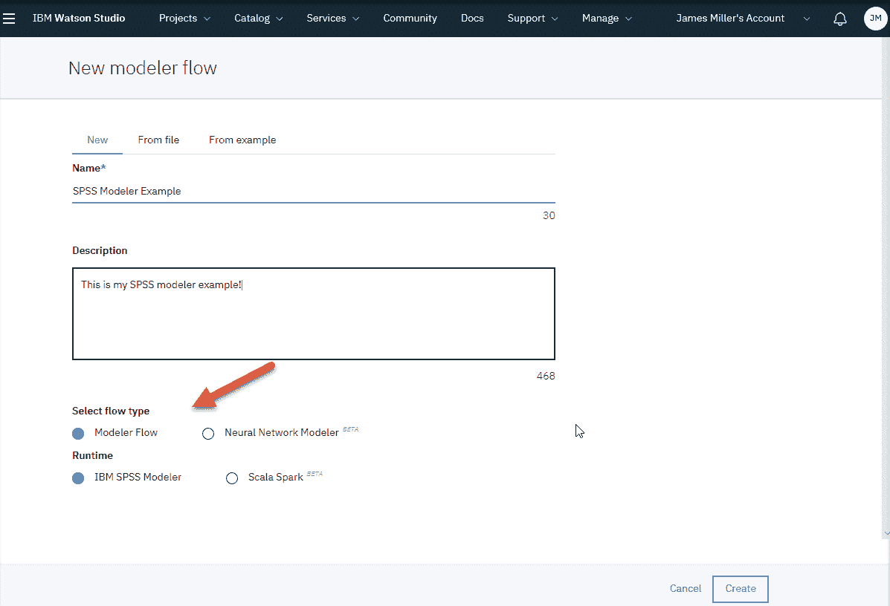

1.  现在我们准备使用以下流程编辑器画布创建我们的机器学习模型流：

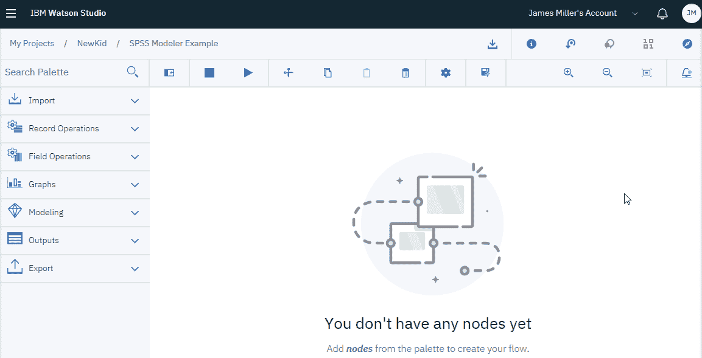

流程编辑器面板使您能够使用机器学习、**人工智能**（**AI**）和统计建模方法从数据中提取新信息，而无需编程。

1.  现在我们准备添加我们的数据，因此我们可以将数据资产节点（位于导入下）拖放到画布上：

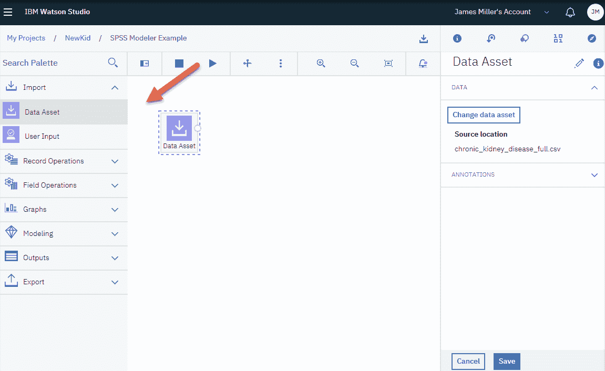

1.  一旦您有一个数据资产节点，您可以双击它，选择更改数据资产，选择您首选的（训练）文件，然后点击确定。如果您现在右键单击节点，您可以选择预览（如下截图所示）以查看您的数据（只读模式）：

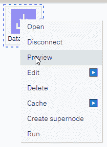

1.  要生成数据的概要，您可以添加数据审计节点（位于输出下），通过将其拖放到画布上，连接到数据资产节点，然后点击 VCR 类型的运行图标：

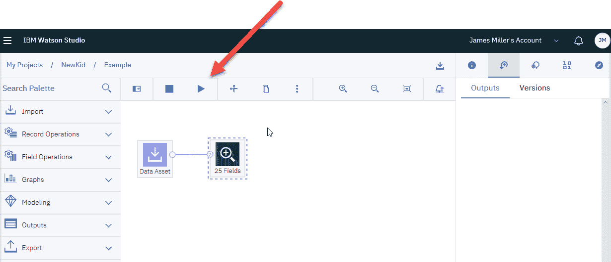

您可以看到数据审计节点显示了它在数据资产节点中自动找到的 25 个字段。再次提醒，如果您双击数据审计节点，您将能够查看和更新各种参数，例如节点的名称（您可以在流程中拥有多个数据审计节点），以及输出摘要中包含的内容（图表、基本和/或高级统计信息等）：

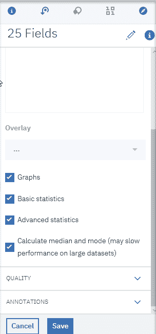

数据审计节点的输出提供了您数据的详细概要。您可以更改参数，重新运行您的流程，并重新检查结果，以便熟悉输出：

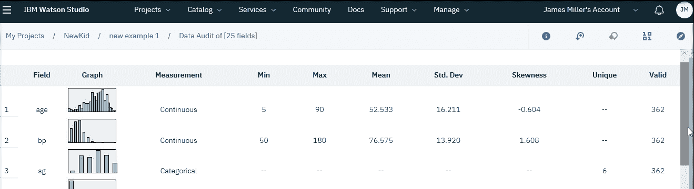

上一张截图的底部页面如下：

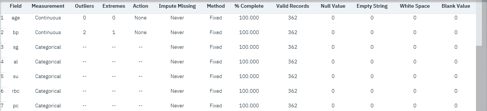

# 额外的节点工作

在实际构建分类模型之前，应该注意的是，在面板上有很多节点可供使用，可以帮助或实际执行您需要执行的大多数操作或流程，而无需编写任何代码！

如果您花点时间查看左侧的面板（称为节点面板），您将看到可供您在处理数据时使用的不同类型的节点。这些节点被组织成以下六个基本类别：

+   **记录操作**：这可以用于在记录（行）级别执行选择、追加和排序等操作。

+   **字段操作**：这些节点在数据准备阶段非常有用。您可以过滤数据、重命名特征，并选择属性的类型。

+   **图示**：本节中的节点将帮助您进行基本的数据探索，并理解特征之间的分布或关系。

+   **建模**：这些节点为不同类型的问题提供不同的建模算法。

+   **输出**：这些节点有助于理解您的数据和模型。您可以将结果以表格格式显示或获取模型评估参数的报告。

+   **导出**：在处理和建模之后，此节点将帮助您将数据从流程编辑器导出到您的 DSX 项目**。**

让我们尝试一个。它们基本上都是用相同的方式实现的：将选定的节点拖放到画布上，然后右键单击以执行进一步操作，如打开、预览或运行。

例如，让我们看看在字段操作下找到的过滤器节点。以下截图显示了添加到画布并连接到我们的数据资产节点的过滤器节点：

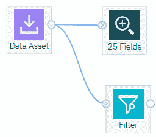

您可以使用过滤器节点重命名列，如下截图所示：

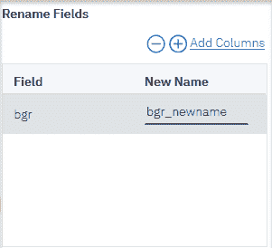

您还可以从原始数据资产节点中过滤掉或仅保留选定的数据字段：

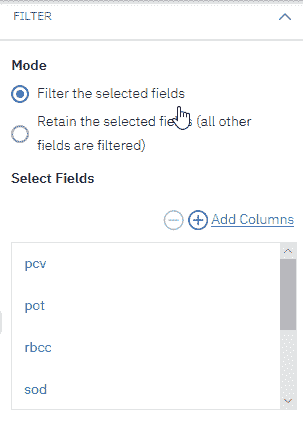

当您对数据满意后，可以使用类型节点设置一个变量作为模型的目标变量。这将帮助模型区分输入和目标特征。例如，您可以执行以下任务：

1.  将类型节点拖放到画布上。

1.  将类型节点连接到过滤器节点。

1.  右键单击类型节点，然后点击打开以打开节点。

1.  点击读取值，然后选择列名 class，将变量的角色更改为目标，最后点击保存：

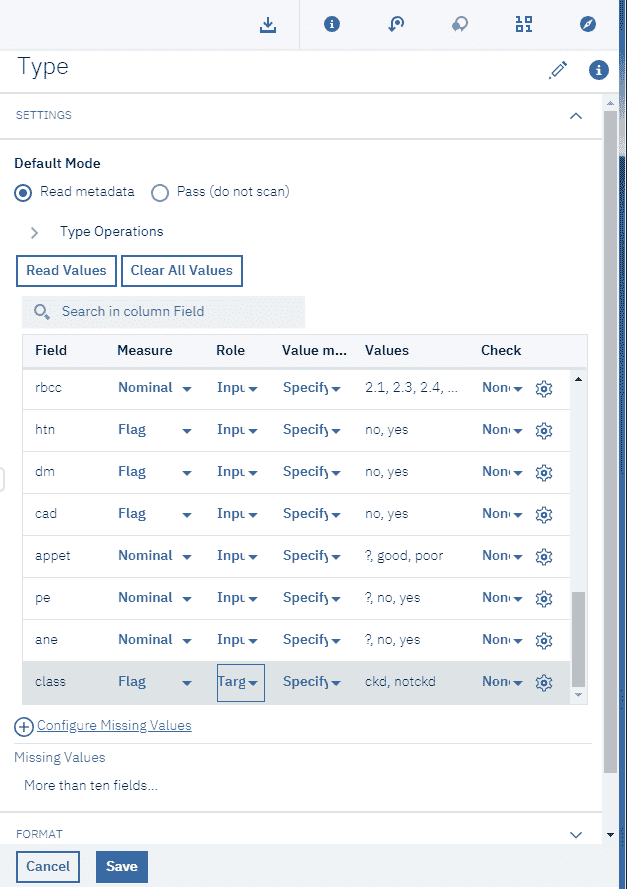

1.  要查看目标变量（我们的设置为类别）的分布情况，您可以使用分布节点（来自节点面板的图示部分）。再次，只需将节点拖放到画布上，打开并提供如下信息：绘图（在字段（离散）下选择类别字段）和颜色（离散）（使用类别），然后点击保存。运行流程后，输出看起来如下：

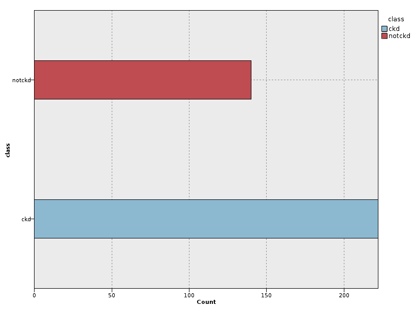

在此数据中，我们看到慢性病例（**ckd**）比非慢性病例（**notckd**）更多。这是我们在画布上显示的当前流程：

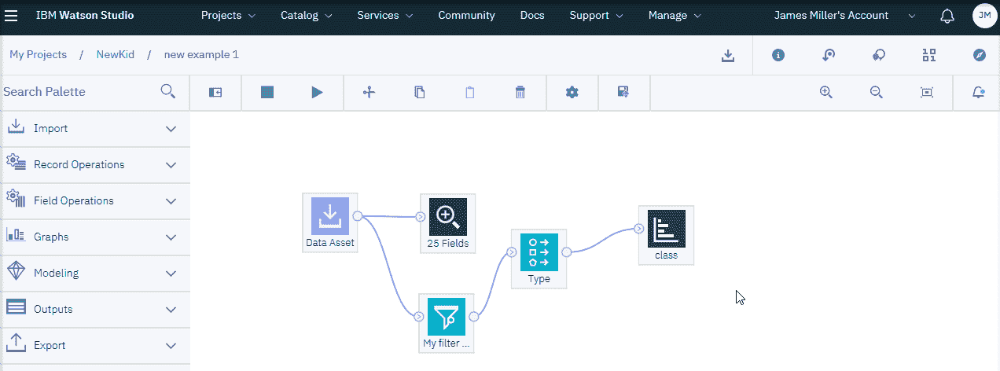

# 训练和测试

在 SPSS 模型器流程中另一个有用的功能是能够轻松地将数据分为训练集和测试集。这可以通过分区节点实现。为了训练、测试和验证模型构建的阶段，使用分区节点生成一个分区字段，将数据分割成单独的子集或样本。

使用样本生成模型，并使用另一个样本进行测试，这将为您提供一个很好的提示，了解模型将如何推广到与当前数据相对应的更大的数据集：

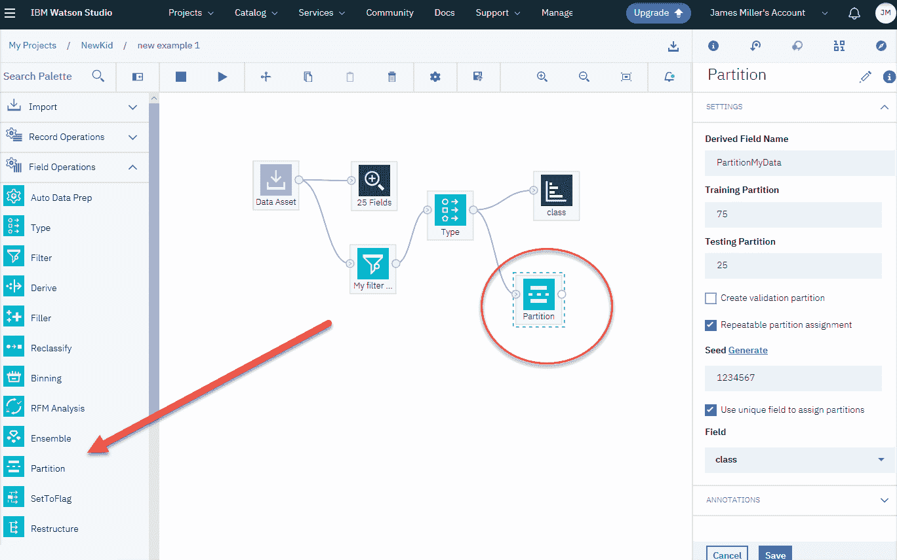

如果我们在流程中添加一个分区节点，打开它并根据前面的截图调整设置，我们是在指示模型师在我们的数据中添加一个新的字段（`PartionMyData`），这将指定记录分割（基于 75/25）。要查看此节点的结果，我们可以在流程中添加一个表格节点，并设置以下参数：

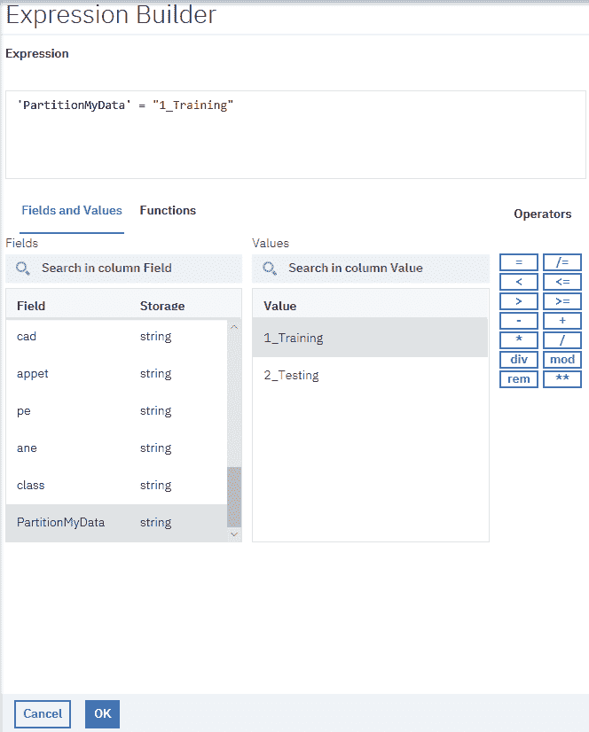

前面的截图表明，我们想要查询我们的数据，并基于我们的派生字段中的值等于`1_Training`生成一个表格；换句话说，所有分区节点指定的作为我们的训练数据成员的记录。我们的流程现在看起来如下所示：

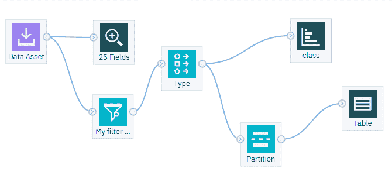

现在运行流程将生成以下表格：

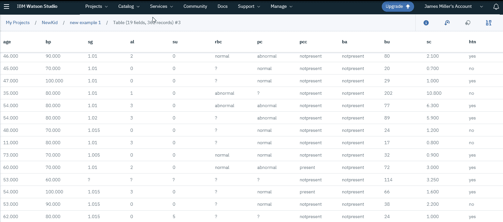

# SPSS 流程和 K-means

如我们本章前面提到的，一种流行的聚类算法是**K-means 聚类**算法。再次强调，在没有标签或目标字段的情况下，K-means 不是试图预测结果，而是试图通过在数据输入字段集中对数据点进行分组和/或聚类来发现数据中的模式和结构。

使用我们在本章中一直在使用的样本数据，假设我们不知道一个人是否有慢性肾病，并希望使用 K-means 算法构建一个无监督模型，看看我们是否可以识别出慢性肾病的任何模式。

我们将在我们的流程中选择 K-Means 节点来完成这个任务。

K-Means 节点提供了一种聚类分析方法，您可以在以下链接中参考 IBM SPSS Modeller 15 文档中的第*第十一章*：[`public.dhe.ibm.com/software/analytics/spss/documentation/modeler/15.0/en/ModelingNodes.pdf`](http://public.dhe.ibm.com/software/analytics/spss/documentation/modeler/15.0/en/ModelingNodes.pdf)。

让我们看看以下步骤，了解如何了解 K-means 算法：

1.  从左侧，在建模下，我们可以选择 K-Means 节点并将其拖放到画布上。

1.  接下来，将节点连接到类型节点，如图所示：

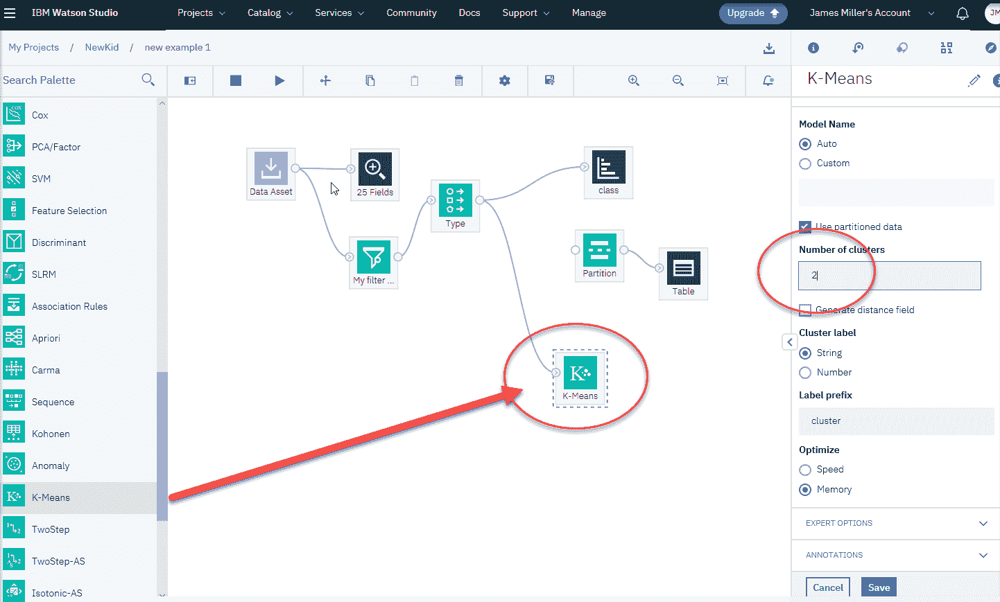

注意，我已经断开了之前使用的分区节点。

1.  一旦我们添加了 K-Class 节点，右键单击并打开它以更改其设置（在画布的右侧）。具体来说，在构建选项下，我们将根据我们想要将数据组织成两组（或聚类）的想法，将聚类数设置为`2`：那些患有慢性肾病的人和那些没有慢性肾病的人。所有其他设置都可以保持默认。最后，点击保存。

1.  现在，在你运行流程之后，一个金色 K-Means 节点将出现在画布上（如下一张截图所示），你可以右键单击并选择查看模型：

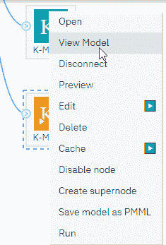

1.  SPSS 可视化提供了交互式表格和图表，以帮助评估预测模型。这些可视化提供了一套单一的全面输出，因此你不需要创建多个图表和表格来确定模型的性能。根据算法的不同，你将看到一系列与你的特定数据集和模型相关的可视化。以下是我们 K-means 模型的输出：

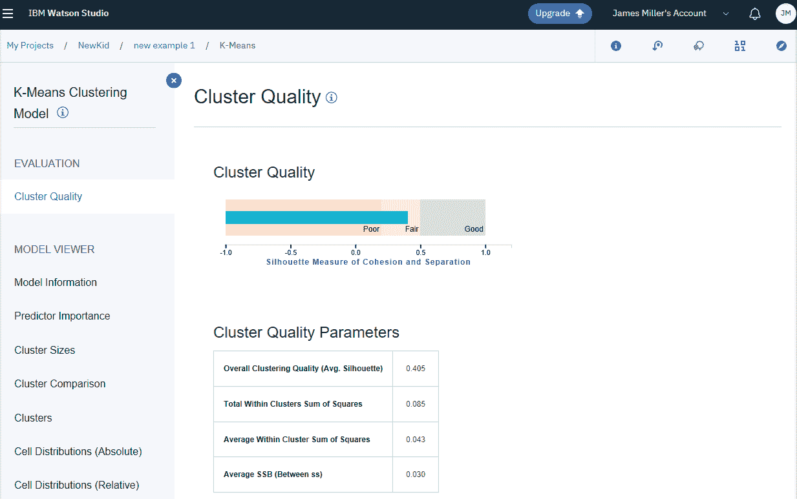

输出包括关于聚类质量（如前一张截图所示）以及预测因子重要性（如下一张截图所示）的信息：

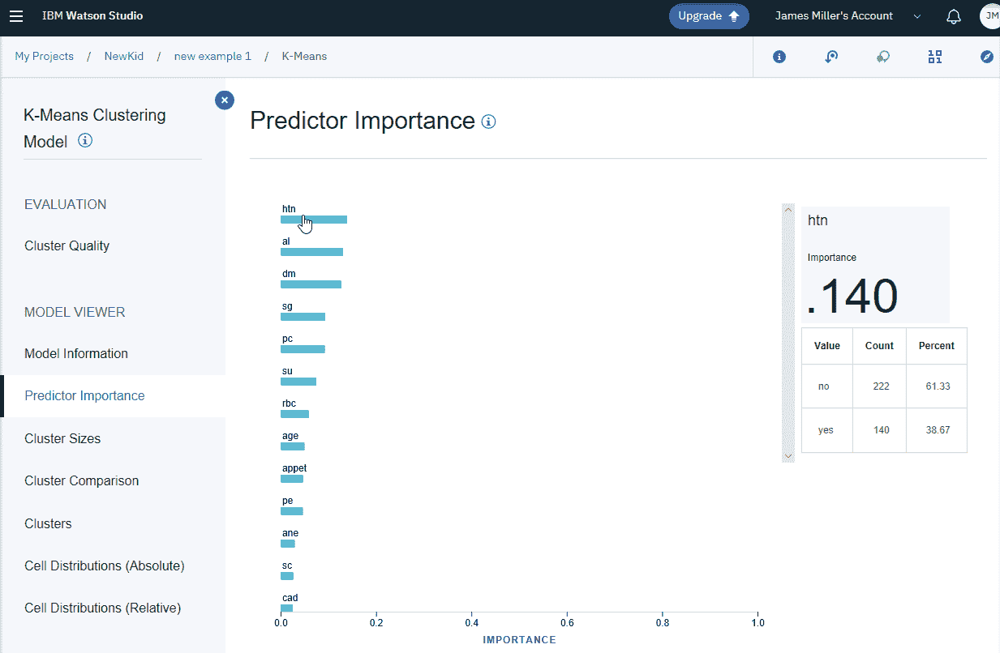**聚类质量评估**是一个复杂的话题，超出了本章的范围，然而 IBM Watson Studio 提供了典型的聚类质量细节，例如聚类大小图表，这是一个按降序显示聚类相对大小的水平条形图。将鼠标悬停在条形图上会显示基于 K-Means 模型的该聚类中实例总数的精确百分比。所有聚类信息都应在各种项目选项和结果的基础上进行审查和评估。

最后（尽管生成了其他信息可视化），它显示了基本的模型信息（如下所示）：

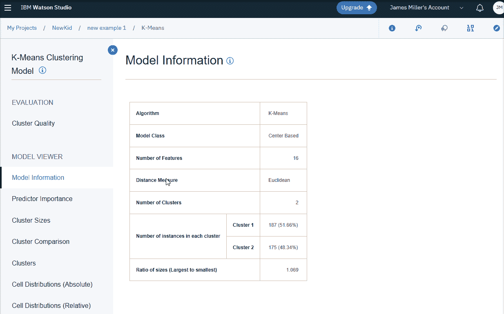

SPSS 模型流的一个令人惊叹的特性是，你可以在同一个画布内构建多个不同的模型！

实际上，修改节点、重新运行（流程）然后重新评估结果以确定最佳算法和参数是如此容易，以至于你应该假设多次迭代是过程的一部分。

# 导出模型结果

一旦你对你的模型感到满意，你可以使用另一个名为数据资产导出节点的便捷节点来导出结果。与其他节点一样，你可以将其拖放到画布上，连接到金色 K-Means 节点，并打开它来编辑其设置：

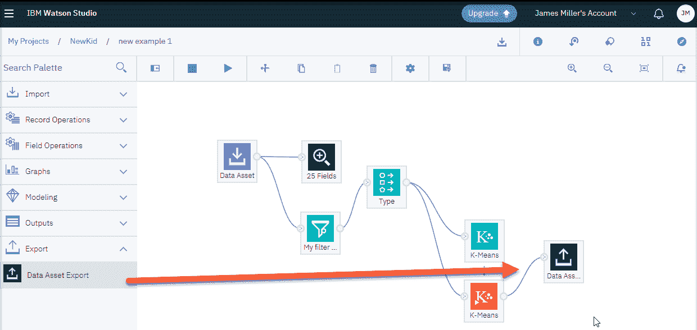

对于节点设置，你实际上需要做的只是在你点击的以下截图中的数据资产导出设置下的目标路径部分输入一个文件名（我已经输入了`Lovely`）：

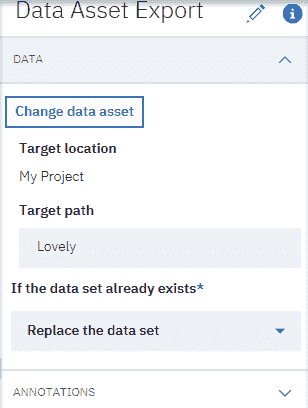

你也可以在“如果数据集已经存在”部分下选择“替换数据集”作为选项。

现在，当你运行流程时，数据将被导出到你的项目存储中，你可以在项目的“资产”标签页中查看和访问它：

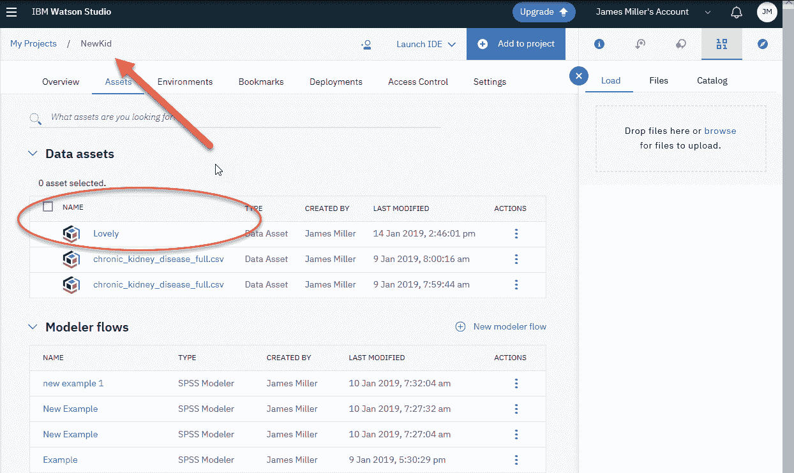

# 半监督学习

**半监督**学习是机器学习过程和技术的另一类，它也利用未标记的数据进行训练（就像无监督学习一样），但通常情况下，模型会使用一小部分标记数据和大量未标记数据。这通常被称为**部分标记数据**。

半监督学习介于无监督学习（没有任何标记的训练数据）和监督学习（具有完全标记的训练数据）之间。

半监督学习程序确实试图使用某些标准假设来帮助他们利用未标记的数据。这些标准假设包括连续性、集群和流形。

不深入描述这些假设，粗略的定义如下：

+   **连续性**：这个假设意味着接近的数据点也倾向于共享一个标签。

+   **集群**：这个假设表明，倾向于形成离散集群的数据，同一集群中的点最终会共享一个标签。

+   **流形**：这个假设认为数据大致位于一个被称为流形的低维空间中，原始数据维度较低，并且在这个假设下，尝试使用标记和未标记的数据来理解流形以降低维度。

# 异常检测

**异常**也被称为异常值、新颖性、噪声、偏差和例外，通常定义为在数据池或集中识别出罕见的项目、事件或观察结果，这些项目、事件或观察结果由于与大多数数据显著不同而引起怀疑。

为什么应该如此重视异常及其检测？

因为数据中的异常几乎总是转化为某种问题，比如欺诈、缺陷、医疗问题或文本中的错误。

异常检测是一种用于识别不符合预期行为的异常模式的技术，称为**异常值**。为了定位异常，你需要理解它们可能落入几个广泛的类别。

通常，我们将异常视为点、上下文或集体性质。点异常可能就是你所猜测的：一个与其它数据非常不同的单个数据点。上下文异常是指看似良好的数据仅在特定上下文中才是好的。集体异常是指将数据集视为异常。

# 基于机器学习的方法

当然，有许多基于机器学习的一般接受的方法用于异常检测过程。这些目前包括以下内容：

+   **基于密度的异常检测**：这种方法基于 KNN 算法；使用依赖于数据类型（分类或数值）的评分方法评估最近的数据点集。

+   **基于聚类的异常检测**：在无监督学习领域，对于异常检测来说，聚类是最受欢迎的概念之一。

+   **基于支持向量机的异常检测**：此算法使用训练集来学习软边界，以便聚类正常数据实例，然后使用测试实例，它调整自己以定位超出学习区域的不规则性。

# 在线或批量学习

将在线和批量机器学习概念视为基本上是执行从新数据块中更新预测值的多重迭代与首先处理所有可用数据然后设置预测值之间的区别：

+   在线机器学习：这是一种机器学习技术，其中数据以顺序方式提供，并用于在每一步或迭代中简化对未来数据的最佳预测器。

+   批量学习：批量机器学习是一种方法，它通过一次在整个训练数据集上学习来生成最佳预测器。

# 摘要

在本章中，我们首先提供了无监督学习、半监督学习、异常检测的简要描述，最后是在线和批量学习。

在下一章中，我们将使用 Python 作为编程语言，在笔记本上创建我们将要学习的内容。我们还将学习如何使用 Watson Studio 创建各种机器学习项目。
