# 第五章：IBM Cloud 上的机器学习练习

在本章中，我们将通过使用 IBM Cloud 平台进行几个机器学习（ML）练习，来揭示 Python 语言作为机器学习编程语言的选择之优势，并查看 IBM Watson Studio 提供的机器学习服务。

本章将使您能够理解适当的特征工程实践，并展示在 IBM Cloud 中使用 IBM Watson Studio 运行**监督**（分类）和**无监督**（聚类）算法的能力。

通过简单的实践示例，本章将指导您使用 IBM Watson Studio 实现各种机器学习项目的步骤。

我们将本章内容分为以下几个部分：

+   Watson Studio 和 Python

+   数据清洗和准备

+   K-means 聚类示例

+   K-最近邻示例

+   时间序列预测示例

# Watson Studio 和 Python

如前所述，Python 可能（目前确实如此）是预测建模和数据科学项目中最常选择的编程或脚本语言。这类计算领域的一个重大进步是 **Jupyter** **笔记本**（以前称为 IPython）技术。

Jupyter Notebook 是一个基于网络的交互式计算环境，您可以在其中运行小块代码来处理数据，并立即查看该代码的结果。笔记本包括您处理数据所需的所有构建块：

+   数据

+   处理数据的代码计算

+   代码计算结果的可视化（结果可视化）

+   文本和丰富媒体以增强您的理解

此外，保存的笔记本记录了您如何处理数据，因此您可以更轻松地了解具体做了什么，一致地重现这些计算，甚至与他人共享您的发现以进行协作。

# 设置环境

使用 IBM Watson Studio，创建 Python、Scala 或 R 笔记本的过程相当直接。这些笔记本可以用来分析、清洗和转换数据，以及执行数值模拟、统计分析、数据可视化和机器学习等任务。

为了让我们开始本章的示例项目，我们需要采取以下步骤在 IBM Watson Studio 中创建一个新项目并添加一个笔记本：

1.  首先，点击“新建项目”，然后从“创建项目”页面（如下所示），找到深度学习并点击“创建项目”：

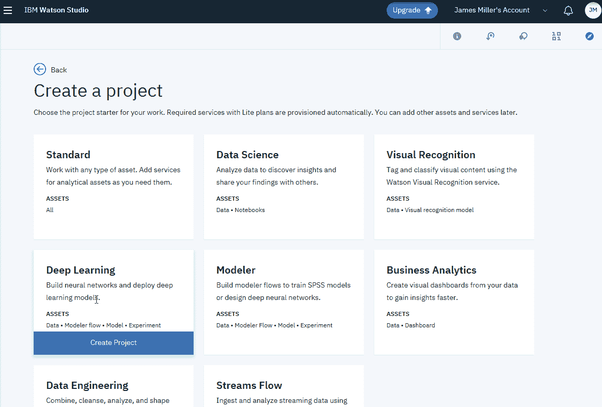

1.  接下来，选择机器学习服务运行的区域，然后点击“选择”：

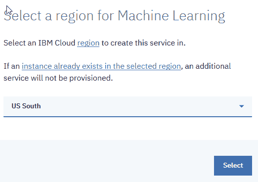

1.  在“新建项目”页面（如下所示）上命名您的项目，然后点击**创建**：

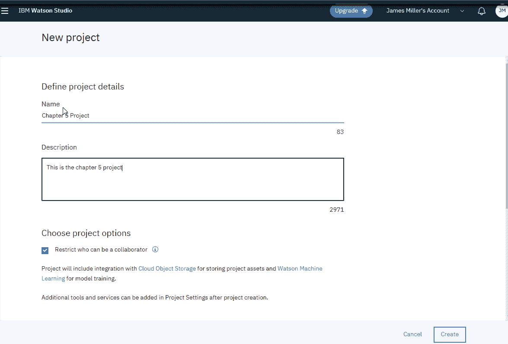

1.  现在我们已经创建了一个机器学习项目，我们准备创建一个笔记本。笔记本被认为是项目资产，可以用于和共享。要在项目内创建笔记本，您点击“添加到项目”：

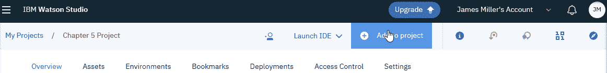

1.  一旦您点击“添加到项目”，您需要选择一个资产类型。在之前的示例中，我们选择了 DATA 和 DASHBOARD 资产类型；这里我们将选择 NOTEBOOK：

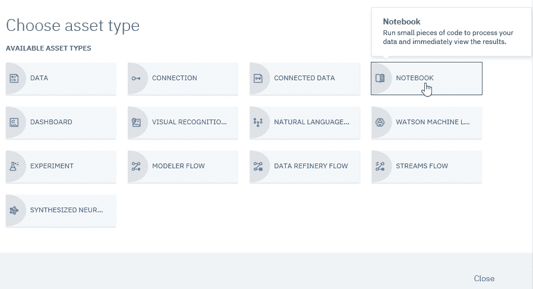

1.  就像创建项目一样，一旦您选择 NOTEBOOK 作为资产类型，您需要在“名称”和“描述”选项下为新笔记本提供名称和描述：


1.  此外，在页面左下角，您需要为笔记本选择一种语言。请注意，默认为 Python 3.5：

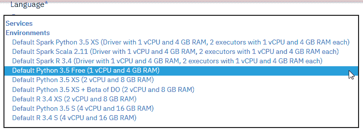

1.  由于我们将在示例中使用 Python，我们可以简单地点击“创建笔记本”。请注意，IBM Watson Studio 笔记本（目前）支持以下运行时语言。一旦您点击“创建笔记本”，笔记本实例将被创建并初始化以供使用：

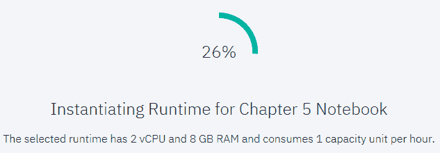

# 尝试一下

一旦您的笔记本实例化，您就可以运行 Python 命令和代码了。注意以下截图中的几个要点。例如，我们在笔记本的第一个**单元**中输入了一段 Python 代码，该代码使用 for 循环迭代并打印数据列。另一件要注意的事情是我们点击了“查找并添加数据”，并添加了一个新文件（winemag-data-130k-v2.csv）作为资产，如以下截图所示：

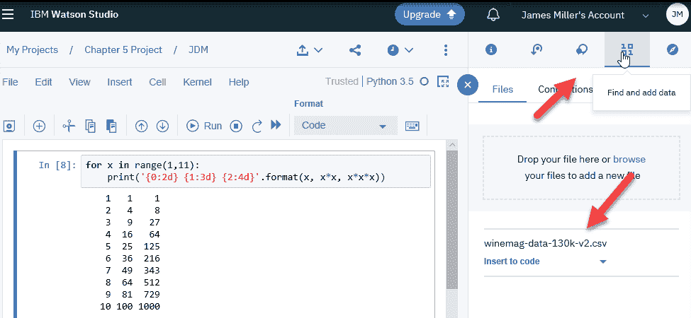

为了简化操作，我们可以在文件名下方的链接“插入代码”处点击，选择“插入 pandas DataFrame”。结果是，相应的**Python**模块（pandas 是为 Python 编程语言编写的用于数据操作和分析的软件库）会自动为我们导入，并自动定义一个 Python DataFrame。这可以在下面的截图中的笔记本单元（In [9]）中看到：

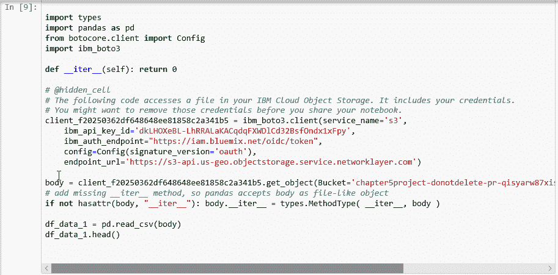

最后一条代码 `df_data_1.head()` 生成的输出显示在笔记本单元 Out [9] 中：

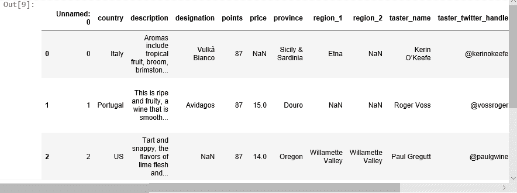

现在我们已经将数据资产（一个 CSV 文件）加载到我们的 Watson Studio 项目中，并通过 DataFrame 对象访问。

# 数据清洗和准备

数据清洗和准备的一个常见描述是将**原始数据**转换成数据科学家和分析师可以更容易地通过机器学习算法运行的形式，以努力发现洞察或基于该数据进行预测。

这个过程可能会因为诸如缺失或不完整记录或简单地在一个数据源中找到无关的信息列等问题而变得复杂。

在前面的示例截图中，我们可以看到 DataFrame 对象包括国家、描述、指定、分数、价格、省份等列。

作为一项旨在展示我们如何轻松地在 Watson Studio 中使用 Python 准备数据的练习，让我们假设我们想要从 DataFrame 中删除一个或多个列。为了完成这个任务，我们使用以下 Python 语句：

```py
to_drop = ['points']
df_data_1.drop(to_drop, inplace=True, axis=1)
df_data_1.head()
```

前面的简单 Python 命令定义了要从 DataFrame 中删除的列名，即分数，然后从`df_data_1` DataFrame 中删除该列：

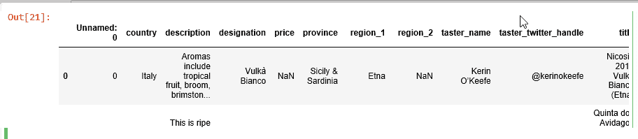

在 IBM Watson Studio 中，使用本章前面创建的笔记本，我们可以输入并运行前面的命令，然后使用`head()`函数，以验证我们指定的列实际上已被删除。

尽管前面的演示很简单，并没有开始触及数据清洗和准备过程，但它确实展示了在 Watson Studio 中轻松使用 Python 访问和操作数据的能力。

而不是继续进行更多的基本数据处理，我们将转向查看一些更复杂的内容。

# 使用 Python 进行 K-means 聚类

回顾第四章，“在 IBM Cloud 上的机器学习练习”，**k-means 聚类**是一种无监督机器学习方法——一个常用于在**未标记**数据中找到组的算法。再次强调，由于这里的目的是展示您如何使用 Python 在 Watson Studio 中应用这种方法，我们不会深入探讨 k-means 是如何工作的细节，而是将展示算法的一个工作示例，使用 Watson Studio 作为概念验证。

在线和其他地方有大量示例演示了使用 Python 实现 k-means 逻辑。在这里，我们将使用一个简单易懂的示例，并使用可用的 Python 模块，如`matplotlib`、`pandas`和`scipy`。

我们使用 IBM Watson Studio 和笔记本（我们在本章的各个部分中创建的）进行的练习将：

1.  为二维数据集创建一个 DataFrame

1.  为三个簇和四个簇找到质心

1.  添加一个**图形用户界面**（**GUI**）来显示结果

组内最代表性的点称为**质心**。它被定义为簇中**数据点**值的平均值。每个簇应包含离它最近的**数据点**。

# Python 代码

首先，我们可以看一下 Python 代码：

1.  此步骤引用了`pandas`并定义了我们的二维 DataFrame。请注意，数据仅仅是两个数字列表，分别定义为`x`和`y`：

```py
from pandas import DataFrame
Data = {'x': [25,34,22,27,33,33,31,22,35,34,67,54,57,43,50,57,59,52,65,47,49,48,35,33,44,45,38,43,51,46],
        'y': [79,51,53,78,59,74,73,57,69,75,51,32,40,47,53,36,35,58,59,50,25,20,14,12,20,5,29,27,8,7]
      }
df = DataFrame(Data,columns=['x','y'])
print (df)
```

最后一条命令（`print(df)`）被添加，以便如果您运行代码，您将看到输出，它应该与定义的数据集相匹配。

1.  下一个步骤是我们将使用`sklearn` Python 模块来找到三个和四个簇的中心，然后使用`matplotlib`模块创建一些图表来可视化算法的结果。

Scikit-learn 通过 Python 中的一致接口提供了一系列监督和无监督学习算法。该库建立在 SciPy（科学 Python）的基础上。**Matplotlib**是 Python 的绘图库及其数值数学扩展 NumPy（维基百科，2019 年）。

1.  一旦使用输入数据的列创建 DataFrame，下一块 Python 代码也导入了上述两个 Python 模块，并指定使用`KMeans`算法创建的簇的数量，最后使用`matplotlib`生成一些散点图：

```py
from pandas import DataFrame
import matplotlib.pyplot as plt
from sklearn.cluster import KMeans
Data = {'x': [25,34,22,27,33,33,31,22,35,34,67,54,57,43,50,57,59,52,65,47,49,48,35,33,44,45,38,43,51,46],
        'y': [79,51,53,78,59,74,73,57,69,75,51,32,40,47,53,36,35,58,59,50,25,20,14,12,20,5,29,27,8,7]
       }
df = DataFrame(Data,columns=['x','y'])
kmeans = KMeans(n_clusters=3).fit(df)
centroids = kmeans.cluster_centers_
print(centroids)
plt.scatter(df['x'], df['y'], c= kmeans.labels_.astype(float), s=50, alpha=0.5)
plt.scatter(centroids[:, 0], centroids[:, 1], c='red', s=50)
plt.show()
```

上一段 Python 代码的输出生成以下结果：


# 观察结果

注意，每个三个簇的中心（红色）代表属于该簇的所有观察值的平均值。正如你可能看到的，属于给定簇的观察值与该簇的中心更近，与其他簇的中心相比。

# 在 Watson 中实现

再次，我们不再纠结于前一个输出的解释，而是看看我们如何能够使用 IBM Watson Studio 实现相同的练习。我们可以使用本章前面创建的笔记本，但让我们创建一个新的（遵循我们之前使用的相同程序）。

一旦笔记本打开并准备就绪，我们可以运行我们刚才审查的 Python 代码。首先将原始代码块粘贴到第一个笔记本单元中，然后点击运行：

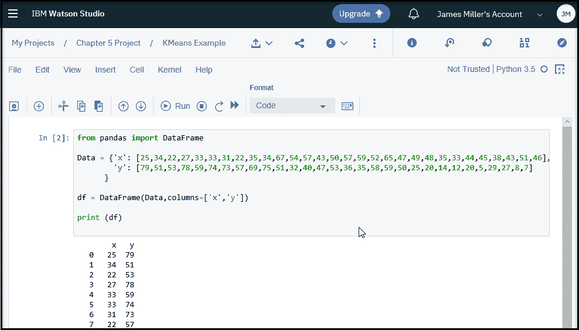

重复此步骤，但使用以下代码块：

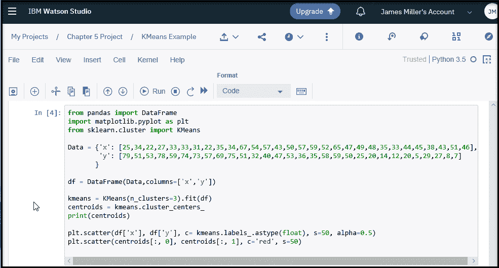

这会产生以下输出：

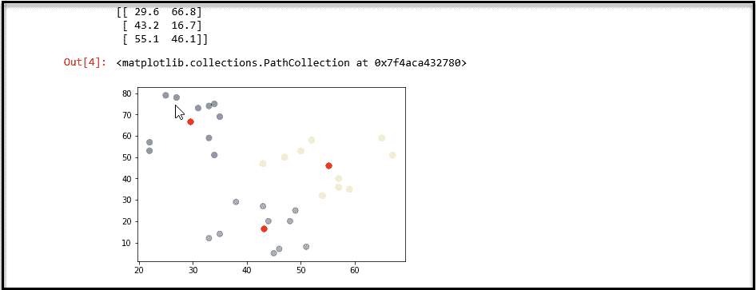

# 保存你的工作

一旦你对结果满意，你应该通过点击文件然后保存来保存你的笔记本。此外，一个很棒的功能是能够以各种格式下载笔记本，这样你就可以与他人分享，他们可能没有访问 Watson Studio 的权限。我们将在下一节中进一步讨论这个问题。

现在，尝试导航到文件 | 下载为 | Python (.py)，这将保存笔记本中的所有 Python 代码块作为标准的 Python 代码文件，可以在其他 Python 环境中共享和运行：

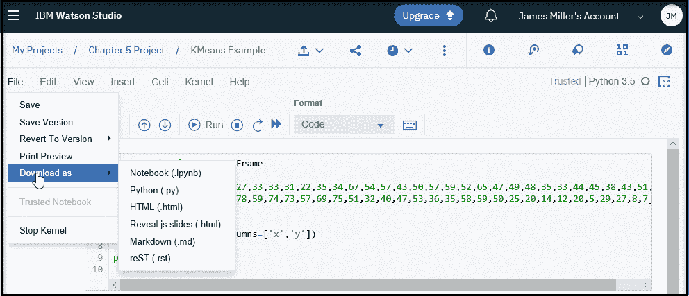

# K 最近邻

由于之前的算法（`KMeans`）是一种**无监督**学习方法，因此**k 近邻**（**KNN**）算法是一种基本简单易懂的**监督**机器学习方法。KNN 算法的概念通常被描述为通过识别数据的最邻近邻居来进行数据分类，或者，我最喜欢的类比，你可以通过识别或分类数据与谁关联最多或找到其最近邻来进行识别或分类。

# Python 代码

正如我们之前所述，我们的目标是展示如何在 IBM Watson Studio 中实现各种类型的机器学习算法，而不是提供每个算法背后的理论；除此之外，与上一节保持一致，我们将利用现有的样本 Python 脚本来展示 Watson Studio 平台提供的功能性和特性，而不是尝试创建一个新的解决方案。

在这个实现的例子中，我们必须做以下事情：

+   找到与需要分类的新数据样本距离最近的一定数量的训练样本

+   确保新数据样本的标签（分类）由那些（训练样本）邻居定义

+   为要确定的邻居数量设置一个固定的用户定义的常量

+   使用新样本的最近邻的多数投票来计算分类

# 在 Watson 中实现

再次，按照本章前面使用的步骤，我们可以在 IBM Watson Studio 中打开我们的机器学习项目并创建一个新的笔记本。从那里，我们可以将样本 Python 代码粘贴到笔记本中的单元格中，然后按运行来测试每个单元格的代码。

正如我们所看到的，你可以在笔记本中使用多个单元格来分割代码的功能块。使用菜单栏，你还可以剪切和粘贴单元格，拆分和合并单元格，以及将单元格在笔记本中上下移动。为了清晰起见，还有一个额外的实用功能，可以显示笔记本中每个 Python 命令的行号。你可以通过点击菜单栏上的“编辑”或“查看”下适当菜单选择来实现这一点：

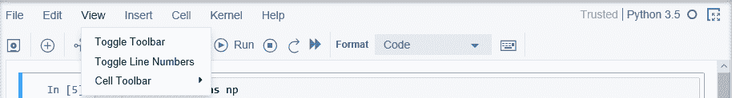

你可能想要拆分单元格以显示中间单元格的输出，或者将单元格合并到一个单元格中并显示合并后的输出。例如，在下一个屏幕截图中，你可以看到两个单元格，每个单元格后面都跟着它们各自的输出：

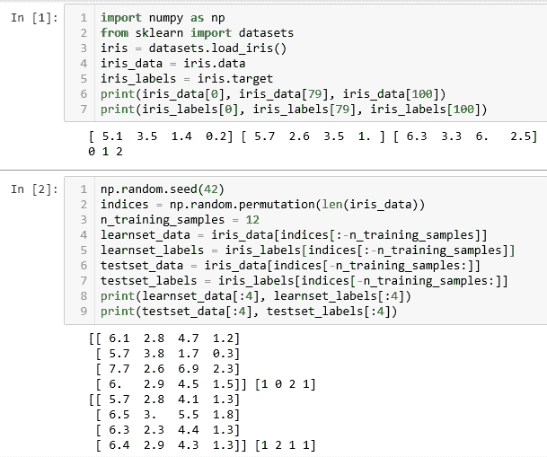

以下屏幕截图显示了这两个单元格合并为一个，后面跟着合并后的输出：

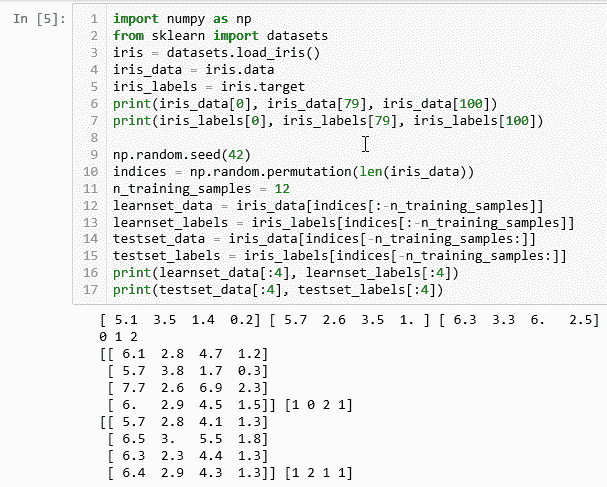

使用菜单选项，你可以创建一个非常组织良好、功能强大且易于分享的解决方案。在下一节中，我们将使用 Watson Studio 中的 **Markdown** **标签**来创建一个更有价值的解决方案。

# 探索 Markdown 文本

**Markdown**是一种易于使用的标记语言，它用于纯文本，以在不使用正式文本编辑器或使用**HTML**标签的情况下添加格式化元素（标题、项目符号列表、URL 等）到纯文本中。Markdown 不依赖于设备，并努力在所有设备类型上以一致的方式显示写作格式，以在 Notebook 解决方案中创造视觉兴趣。

让我们完成最新的示例案例。我们假设所有示例 Python 代码都已粘贴到 Notebook 的单元格中，并且我们已经运行了解决方案的全部内容。

现在，假设我们想要将此解决方案保存并与其他不熟悉我们的项目和思维过程的人分享？我们可以做的是在我们的 Notebook 中插入额外的单元格，而不是将代码粘贴到它们中，我们可以添加注释和其他信息作为解释性文本，以便其他人更容易理解我们所创建的内容。例如，看看下面的截图：

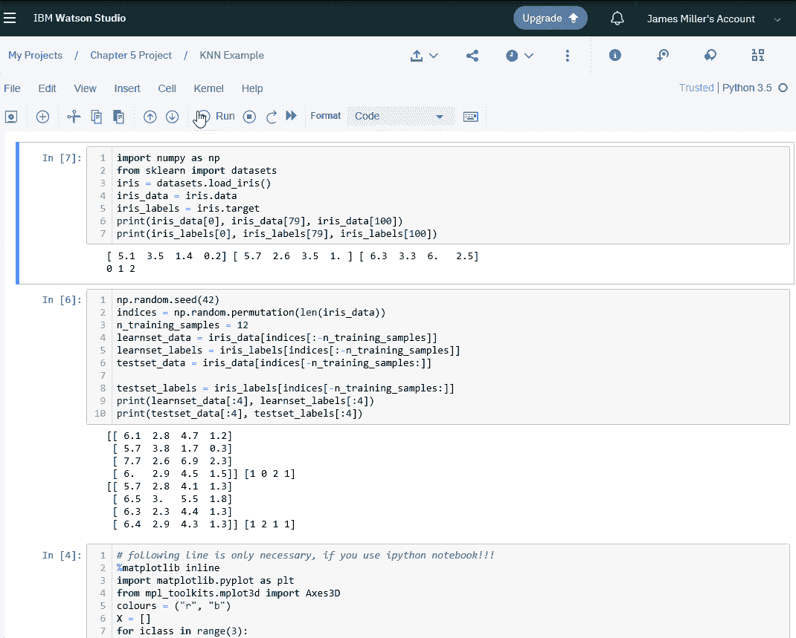

让我们通过以下步骤来查看这是如何完成的：

1.  我们可以点击 Notebook 中的第一个单元格，然后点击“插入”，接着点击“在上方插入单元格”。接下来点击新的单元格，并将单元格的格式（单元格格式）更改为 Markdown：

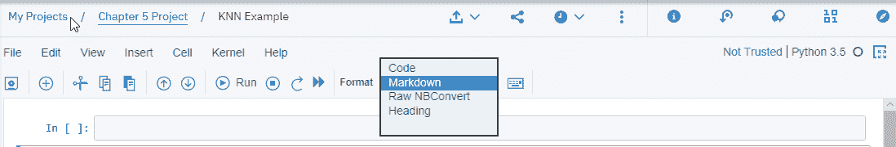

1.  接下来，在新单元格中输入`k-Nearest-Neighbor Classifier`文本：

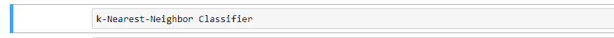

1.  然后，点击键盘图标并选择将单元格更改为标题 1：

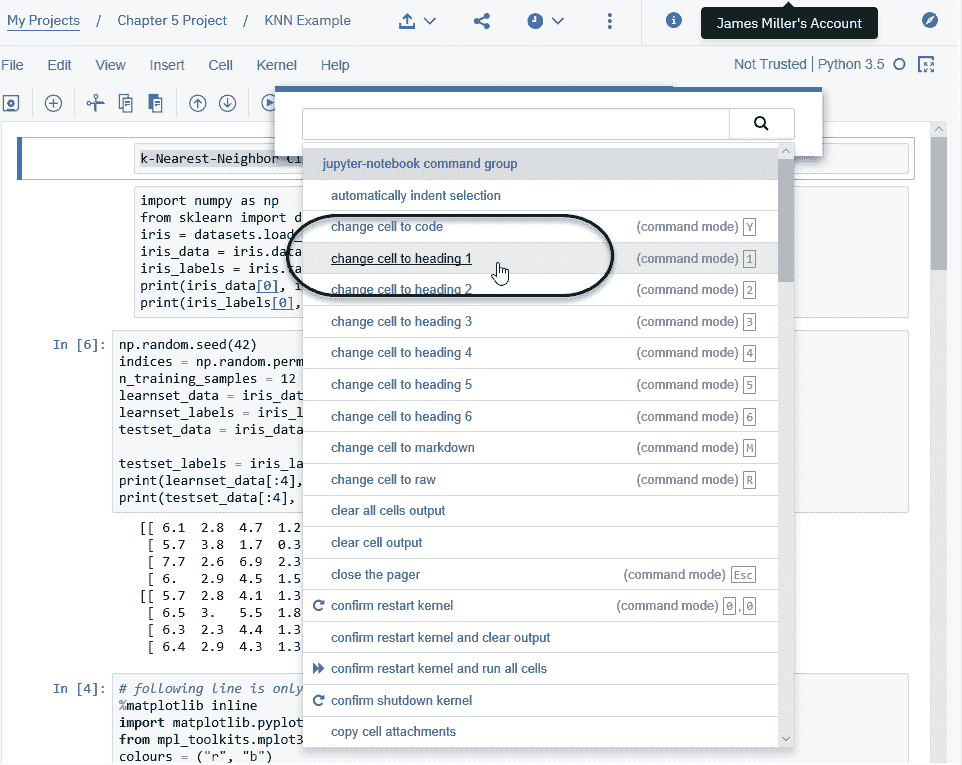

1.  在执行前面的步骤之后，你可以看到 Markdown 单元格看起来略有不同：

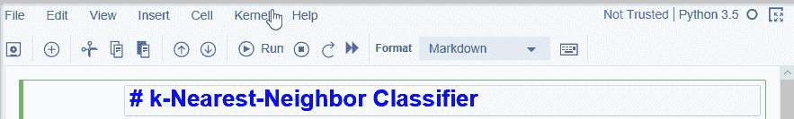

1.  一旦点击运行，你可以看到结果：

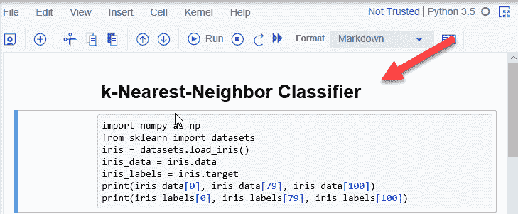

使用常见的 Markdown，我们可以继续在 Notebook 中插入注释：

+   你可以在 Notebook 的顶部添加一个新的单元格，将其格式转换为 Markdown，然后拖放一张图片到单元格中（如下所示）。这可以用来添加公司标志或甚至工作流程图：

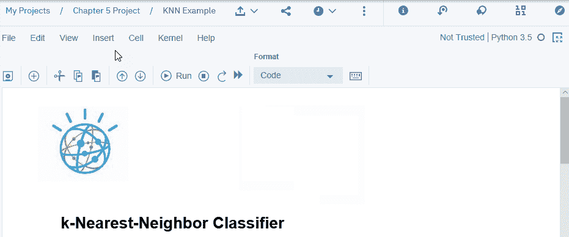

+   使用其他 Markdown，如标题级别、缩进和项目符号列表，你可以提供有关假设的详细信息，例如使用的数据来源和数据中包含的内容：

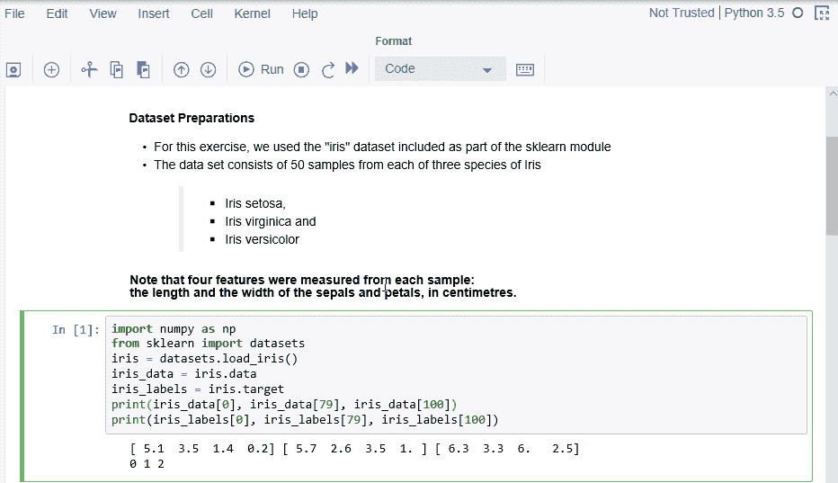

+   使用额外的类似 HTML 的 Markdown（例如 `<font color=></font>`），你可以创建如下 Markdown 单元格：

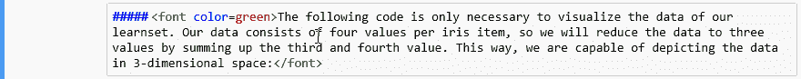

这将产生以下输出：

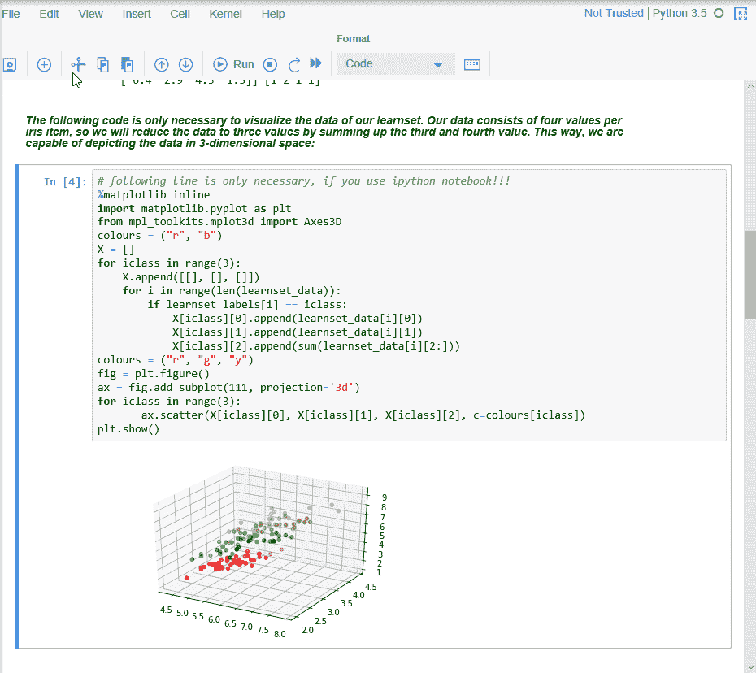

你可以尝试使用全功能的 Markdown，看看哪种最适合你。你可以访问：[`commonmark.org/help/`](https://commonmark.org/help/) 以找到完整的 Markdown 速查表。

# 时间序列预测示例

在本节中，我们的目标是尝试使用 Python 和 Watson Studio 实现一个时间序列模型。

时间序列分析包括分析时间序列数据的方法（当然）以便我们可以提取数据的统计意义和其他特征。时间序列预测是使用算法根据先前观察到的值预测未来值的过程。

# 时间序列分析

时间序列数据在本质上可能是 **平稳的** 或 **非平稳的**。平稳意味着没有周期性波动，而非平稳数据通常具有频繁的价值变化。你通常看到时间序列分析用于非平稳数据，例如评估和预测零售销售。在这个例子中，我们将再次利用一个研究练习（可在 GitHub 上找到）来展示分析零售销售数据及其预测的基本步骤，这些步骤是通过 IBM Watson Studio 实现的。

# 设置

使用（现在）熟悉的将数据添加到我们的 Watson Studio 项目中的过程，我们创建了一个新的资产，使用 CSV 数据文件，并为了更好地理解数据，使用了数据精炼功能来分析、描述和可视化我们的资产。从那里（正如我们在本章之前的 *时间序列分析* 部分中所做的那样），我们使用“插入到代码”并然后插入 pandas DataFrame，以便 Watson Studio 生成导入所需 Python 模块的代码，将数据（加载到名为 `df_data_1` 的 Python DataFrame 对象中）并打印前五行，如下面的截图所示：

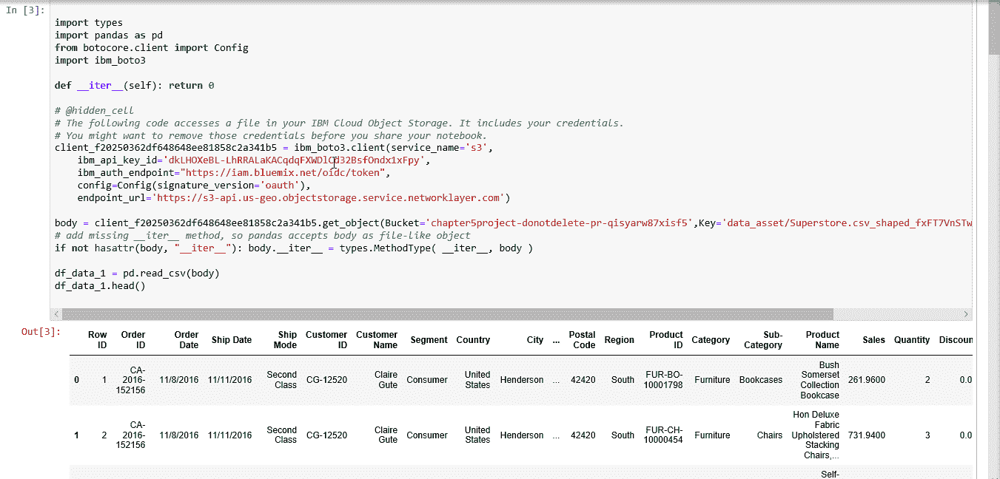

# 数据预处理

在使用 **数据精炼** 功能时，我们注意到数据文件中有一个名为 `Category` 的列，这似乎表明了所售产品的类型（家具、办公用品等）。在这个例子中，数据科学家只对家具销售感兴趣，因此以下代码行被用来过滤数据并验证该类别是否有足够的数据来进行适当的分析：

```py
furniture = df.loc[df['Category'] == 'Furniture']
furniture['Order Date'].min(), furniture['Order Date'].max()
```

在 Watson Studio 中执行的前置代码如下所示，通过显示最早和最晚的时间戳来过滤销售数据并验证我们在这份数据文件中有四年的家具销售记录：

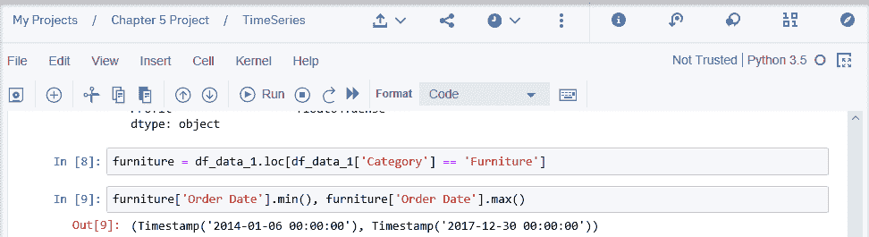

在所选示例中，数据科学家选择使用原始的 Python 命令来删除（删除）分析中不需要的数据列，检查缺失值，按日期对销售交易进行汇总（按组），等等。虽然使用 Python 脚本来完成这些任务并不特别复杂，但你也可以通过 Watson **数据精炼流程** 的拖放操作来完成所有这些任务（以及更多）。

如我们之前提到的，数据精炼流程是一系列按顺序排列的步骤，用于净化、塑形和增强数据资产。通过应用操作来精炼数据，你实际上是在动态构建一个可以实时修改并保存以备将来使用的数据精炼流程，因为新数据变得可用！

# 可视化索引

一旦数据被适当准备，数据科学家使用`Pandas set_index`命令将`订单日期`列设置为索引，将销售交易的行（作为我们将进行初步分析的领域）进行索引。换句话说，我们最终希望能够预测每月的家具销售量。以下截图显示了在我们的 Watson 项目中执行的 Python 语句，以设置索引并打印命令的结果：

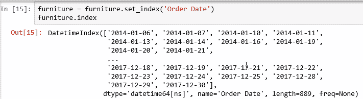

数据科学家接着指出，考虑到数据，查看每个月的平均日销售额会更合理，因此使用以下命令**重采样**销售数据，以每个月的开始（MS）作为时间戳，然后，作为一个合理性检查，查看一些数据（按订单月份排序后，计算平均销售）：

```py
y = furniture['Sales'].resample('MS').mean()
y["2017":]
```

以下截图显示了在我们的 Watson 项目中执行的前述命令：

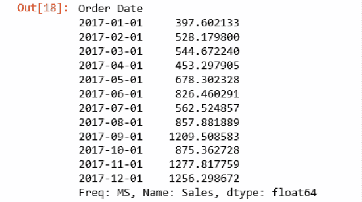

# 可视化

要实际可视化 4 年系列的平均销售量，使用`plot`命令：

```py
y.plot(figsize=(15, 6))
plt.show()
```

这导致了以下可视化，在此处由 Watson Studio 执行：

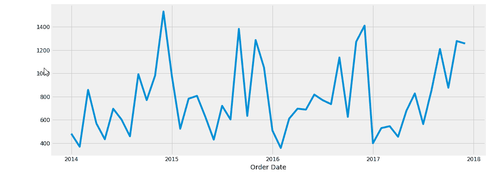

当你绘制或以其他方式可视化数据时，识别模式会容易得多。在这个例子中，数据科学家指出了一个通常被称为季节性的模式。然后，数据科学家进一步进行时间序列分解，使用以下命令将趋势、季节性和噪声分离出来：

```py
from pylab import rcParams
rcParams['figure.figsize'] = 18, 8
decomposition = sm.tsa.seasonal_decompose(y, model='additive')
fig = decomposition.plot()
plt.show()
```

再次强调，正如在所选示例中执行的那样，我们在 Watson Studio 中得到了以下结果：

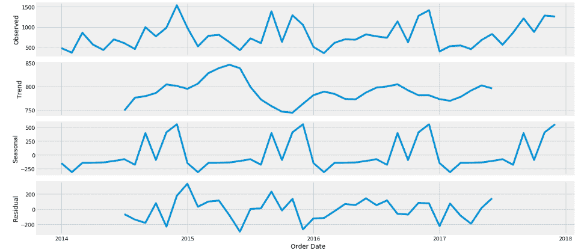

# 销售预测

最后，在完成前述时间序列数据分析和解构之后，我们可以进入实际的预测步骤！仍然遵循所选示例中概述的轨迹，数据科学家选择应用时间序列预测中最常用的方法之一，**自回归积分移动平均**（**ARIMA**）。

你可以点击以下链接了解更多关于 ARIMA 的信息：[`www.forecastingsolutions.com/arima.html`](http://www.forecastingsolutions.com/arima.html)。

要使用 ARIMA 模型或方法进行时间序列预测练习，你需要了解如何为算法的三个主要参数选择值：*P*、*D*和*Q*。假设你已经验证了你的模型选择（首先使用 ARIMA），构建实际预测模型和生成模型预测的最困难的部分是选择那些最适合模型的参数值（给定数据）：

+   *P* 是自回归项的数量

+   *D* 是为了平稳性所需的非季节性差分的数量

+   *Q* 是预测方程中滞后预测错误的数量

在不深入挖掘参数选择背后的理论之前，我们在这里说明，这一步涉及确定可能的参数值组合，查看它们的整体拟合结果，运行适当的诊断来调查模型中是否存在任何异常行为，以及验证模型生成的结果。

以下是用 IBM Watson Studio 实现时使用的代码块和选定的输出：

让我们看一下第一个代码示例，它展示了参数组合的例子：

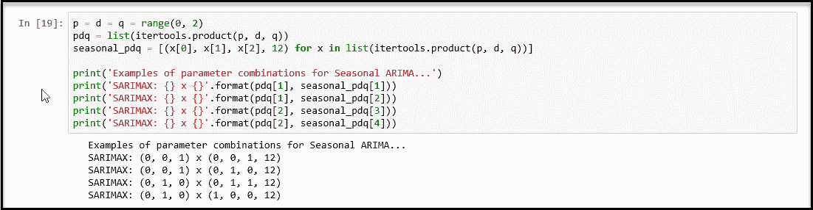

让我们看一下下一个代码示例：


现在，让我们看一下下面的截图：

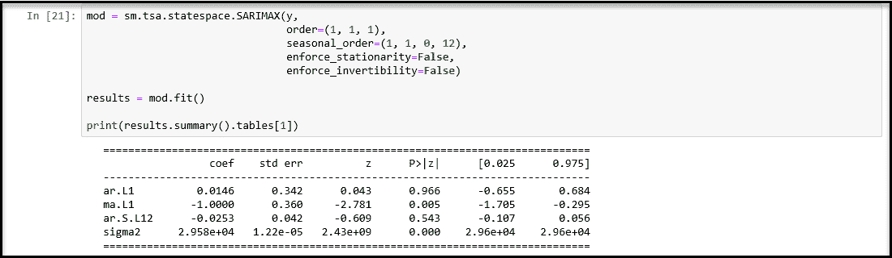

现在，让我们一次性看一下这里所有的图表：

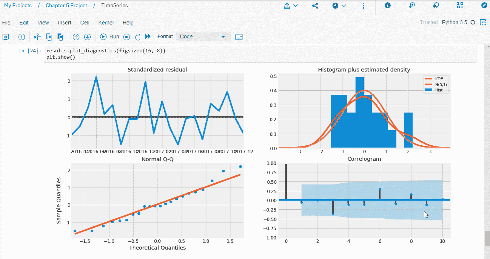

# 验证

当然，数据科学家不能仅仅生成一个预测就结束了。必须努力审查模型的性能或预测准确性。为了帮助理解模型的准确性，将*预测*销售额与实际销售额进行比较，将预测从 2017-07-01 开始（到数据结束）。再次使用图表来可视化输出，显示*观察*值与滚动预测预测值的比较。总体而言，销售预测似乎与实际销售值一致，并显示出从年初开始的上行趋势。

我们看到以下代码块：

```py
pred = results.get_prediction(start=pd.to_datetime('2017-01-01'), dynamic=False)
pred_ci = pred.conf_int()
ax = y['2014':].plot(label='observed')
pred.predicted_mean.plot(ax=ax, label='One-step' ahead Forecast', alpha=.7, figsize=(14, 7))
ax.fill_between(pred_ci.index, pred_ci.iloc[:, 0], pred_ci.iloc[:, 1], color='k', alpha)
ax.set_xlabel('Date')
ax.set_ylabel('Furniture Sales')
plt.legend()
plt.show() 
```

在 Watson Studio 中实际实现的结果如下：

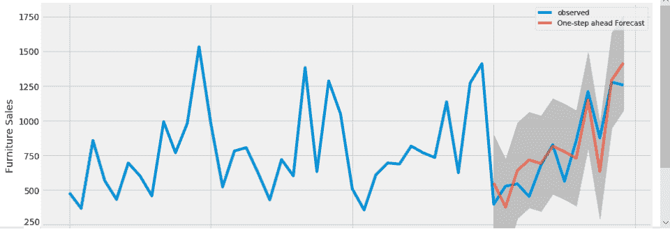

# 摘要

在本章中，我们在 IBM Watson Studio 中创建了一个新的机器学习项目，并向其中添加了笔记本，以便我们可以使用 Python 作为项目目标的编程语言。

使用 Python，我们展示了如何轻松地将数据加载到 DataFrame 中，并在进一步处理之前对其进行操作。我们还使用了额外的笔记本来说明如何轻松地使用 Watson Studio 实现各种机器学习项目。

在下一章中，我们将提供在 IBM Watson Studio 中创建 Spark 机器学习管道的指南。
