# 第八章：在 IBM 云上创建面部表情平台

在本章中，我们将介绍一个基于 IBM Cloud 的完整表达式分类解决方案，该解决方案将在 IBM Cloud 平台上使用深度学习机器学习技术。该解决方案将使用 TensorFlow 和 IBM Watson Studio 提供的 ML 服务实现一个简单而高效的 ML 模型。目标是展示一个复杂 ML 任务的端到端解决方案。

我们将本章分为以下区域：

+   理解面部表情分类

+   探索表情数据库

+   面部预处理

+   学习表达式分类器

+   评估表达式分类器

# 理解面部表情分类

让我们从简短讨论开始，讨论当我们说**面部表情分类**时我们究竟指的是什么。

在第七章《在 IBM 云上使用 TensorFlow 进行深度学习》中，我们使用了 IBM Watson Studio 在随机图像中执行**目标检测**。在那个用例中，我们要求我们的项目模型找到或检测图像中可能出现的常见或已知对象。例如，我们提交了一张动物的图片，解决方案正确地检测并识别出了一匹斑马，尽管没有提供关于检测到的对象的更多信息，例如马是否生气或害怕。

# 面部检测

可能的下一步（在图像中的目标检测之后）是面部检测。面部检测是一种计算机技术，被应用于各种应用中，旨在识别数字图像中的人类面部。

面部识别是通过使用技术来检测和识别人类面部的一种方式。面部识别解决方案利用生物识别逻辑将照片（甚至视频）中的面部特征进行映射，然后将其与已知面部数据库中的信息进行比较，寻找匹配项。

生物识别是基于每个人独特的生理和行为特征进行测量和统计分析的科学，基于的原则是每个个体都可以通过其固有的生理或行为特征被准确识别。

# 面部表情分析

现在我们可以进入正题：**面部表情分析**。

这个概念通常将所有面部表情归类为与六种普遍情感之一相关——快乐（幸福）、惊讶、厌恶、悲伤、愤怒和恐惧，以及中性。

情感是我们作为人类的一个元素，而且（信不信由你）它们很难隐藏，因为所有情感，无论是否被抑制，都可能产生明显的生理效应，如果我们能够自动化检测和解释这些生理效应的过程，这些效应将是有价值的。

一旦检测到，对（面部表情）的解释过程（或许）仅仅是另一个分类练习。在实践中，你会发现面部表情分类将基于所谓的**TBM**或**可迁移信念模型**框架。

# TBM

TBM 提供了一个有趣的假设。无意提供对 TBM 框架的全面解释，一个关键点是它引入了信念和转移的程度（从而产生了该方法的名字：可迁移信念模型），这允许模型做出执行适当分类（表情）所需的必要假设。基本上，这意味着它对其假设进行评分，即确定表情是快乐的表情的假设有*n*百分比的正确性（我们将在本章后面回顾我们项目的结果时看到这一点）。

进一步（并且我在简化），TBM 试图使用量化的信念来做出其分类决策。也许更容易理解的是，面部表情分析从面部特征（嘴巴、眼睛和眉毛）中提取表情骨骼，然后从面部图像中推导出简单的距离系数。这些特征距离随后被输入到一个基于规则的决策系统中，该系统依赖于 TBM 来将面部表情分配给面部图像。

再次强调，目标不是定义 TBM 背后的理论，甚至不是面部表情分析解决方案的详细细节，而是更多地展示一个实际的工作示例；因此，我们将继续到下一节和我们的用例示例，并将进一步研究这个主题的工作留给读者。

# 探索表情数据库

所有面部表情分析解决方案的核心是一个表情数据库。

一个（面部）**表情数据库**是展示一系列情感的具体面部表情的图像集合。如果这些图像要用于表情识别系统和相关算法，它们必须被很好地注释或情感标记。

自动人类行为分析领域新发展的一个主要障碍是缺乏展示行为和情感的合适数据库。在这个领域已经有一些有针对性的进展，例如**MMI 面部表情数据库**项目，该项目旨在向面部表情分析社区提供大量**面部表情视觉数据**。

MMI 面部表情数据库最初于 2002 年创建，作为构建和评估面部表情识别算法的资源。该数据库的一个显著特点是，其他数据库专注于六种基本情绪（我们之前提到过）的表情，而此数据库包含这些典型表情以及仅激活单个**面部动作编码系统（FACS**）或**动作单元（AU**）的表情，对于所有现有的 AU 和许多其他**动作描述符（AD**）。最近还增加了自然表情的记录。

该数据库对科学界免费开放。有关数据库的更多信息，请在网上查看[`mmifacedb.eu`](https://mmifacedb.eu)。

在其他示例项目中，我们能够创建自己的测试数据或修改现有数据集以在项目中使用。然而，对于**表情分析**项目来说，创建一个合理规模的数据库（从零开始），这需要收集和处理成千上万张图像，所有这些图像都需要适当的文档记录，实际上并不现实。

收集后，每个（面部）图像都需要根据所显示的情绪进行审查和分类，分为七个类别之一（愤怒、厌恶、恐惧、快乐、悲伤、惊讶和中性）。为了进一步复杂化这项工作，图像可能没有对齐和适当的比例。

事实上，即使你有大量的图像，如果图像没有正确标记，或者根本不包含可检测的面部图像，表情分析和检测过程的性能将会受到影响（表现不佳）。

这些类型的挑战使得分类过程更加困难，因为模型被迫进行泛化。

# 使用 Watson 视觉识别服务进行训练

考虑到上述挑战，IBM Watson Studio 通过提供（开箱即用的）**Watson 视觉识别**服务，帮助我们开始使用。

这个有价值的服务有助于使用机器学习逻辑准确分析、分类和训练图像的过程（尽管，诚然，一开始仍然需要合理数量的相关训练数据，关于这一点稍后还会详细说明）。

幸运的是，有一组内置模型可供我们使用，无需无限期地训练就能提供高度准确的结果。这些模型如下：

+   **通用模型**：通用分类类别

+   **面部模型**：在图像中定位面部、性别和年龄

+   **显式模型**：图像是否适合通用

+   **b 模型**：专门用于食品图像

在本章的项目中，我们将展示如何使用视觉识别服务和面部模型构建一个端到端的工作解决方案，该解决方案可以查看人脸图像，执行表情分析和简单分类，并最终确定个人是感到快乐还是悲伤。

# 预处理面部

我们刚刚提到，构建一个合适的表情数据库是一项大量工作。为了能够构建一个端到端的工作表情分析解决方案（并将其全部放入本书的单章中），我们将在我们的项目中采取一些自由：

+   我们将限制我们模型检测和分类的能力，仅限于两种情绪——快乐和悲伤

+   我们将只提供有限的表达数据来训练我们的模型

显然，在现实世界中，我们的第二个假设是风险性的；在任何机器学习模型中，训练数据越少，通常产生的结果就越没有价值。

# 准备训练数据

再次强调，如果我们决定仅满足使用面部模型和视觉识别服务的最低要求，我们可以只收集每个类别（我们打算让模型训练的类别）的 10 张图片（10 个笑脸，10 个哭脸和 10 个负面表情）。

这些单个训练文件需要满足以下条件：

+   格式为 JPEG（`.jpg`）和 PNG（`.png`）

+   至少 32*32 像素大小

+   将一组图片压缩成 ZIP 文件，即一个`happy.zip`文件包含 10 个笑脸，一个`sad.zip`文件包含 10 个哭脸

下面是初始快乐模型训练数据的抽样截图：

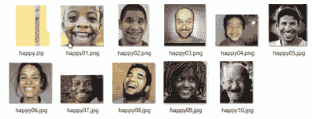

前面的图像是 10 个面部表情，我们认为可以标记为快乐面部表情的代表。请注意，所有单个文件都已添加到名为`happy.zip`的压缩（ZIP）文件中。

下面是初始悲伤模型训练数据的抽样截图：

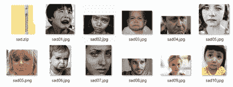

显然，前一组展示了快乐，后一组图像是面部表情，我们认为可以标记为悲伤表情的代表（单个文件和压缩文件`sad.zip`）。

# 负面或非正面分类

为了使面部模型正常工作，也需要负面图像，这些图像不会被用于创建分类（我们将在下一节中介绍）在创建的分类器中，而是用来定义更新的分类器不是什么。负面示例文件不应包含任何正面类别（快乐和悲伤）的主题图像。本质上，这个组中的面部图像可能被认为是中性的。你只需要指定一个负面示例文件。

因为你想给模型提供不应该寻找的例子，你必须提供负面类别。向机器学习模型提供所有正面图像意味着它只会假设一切都是正面的，并产生风险性的结果。

因此，最终，我们的初始负面模型训练数据如下截图所示：

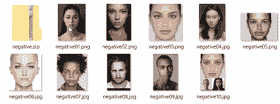

# 准备环境

让我们现在继续进行项目模型开发。

下一步（假设您已经创建了一个新的 IBM Watson Studio 项目）是将 Watson 视觉识别服务关联到项目。我们在第七章*使用 TensorFlow 在 IBM Cloud 上进行深度学习*中介绍了如何进行此操作，因此我们假设您已经将服务添加到这个新项目中。如果没有，请参阅第七章*使用 TensorFlow 在 IBM Cloud 上进行深度学习*或在线 Watson Studio 文档。

# 项目资产

在本章的项目中，我们的主要资产将是我们所收集的培训图像，也许间接地，还包括分类。这些图像资产以类似于我们在前几章中向 Watson Studio 项目添加数据资产的过程添加，但也有一些不同之处，我们很快就会看到。

现在，我们将执行以下步骤：

1.  前往“资产”标签页，在“模型”下点击“新建视觉识别模型”：

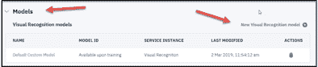

1.  一旦模型创建完成（这应该只需要几分钟），您可以将我们在本章早期部分收集的培训（`.zip`）文件浏览到或拖放到新项目中以添加它们。这将上传图像文件到**云对象存储**（**COO**），使它们可用于我们的项目：

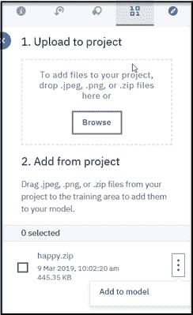

您不需要单独加载每个图像文件，只需加载三个压缩文件（`happy.zip`、`sad.zip`和`negative.zip`）。ZIP 文件应列在先前的截图所示。

虽然您可以上传 ZIP 文件，但 Watson 不会允许这些 ZIP 文件在数据资产页面使用预览功能。但这并不是问题，因为您仍然可以从模型页面预览图像，正如我们很快就会看到的。

# 为我们的模型创建类别

现在，从默认自定义模型页面，我们需要创建两个类别。按照以下步骤创建模型类别：

1.  点击“创建类别”。

1.  为其输入一个类别名称。

1.  点击蓝色的“创建”按钮：

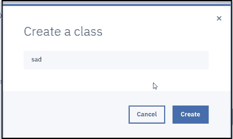

实际上，我们只需要为这个项目创建两个类别：快乐和悲伤，因为 Watson 已经为我们创建了负面类别。每个模型只有一个负面类别，但您可以根据项目目标需要创建尽可能多的其他类别。

一旦创建了类别，您只需将 `.zip` 文件拖放到相应的类别中，如下面的截图所示：

如您所见，我们将每个三个 ZIP 文件都拖放到相应的类别面板中。

正如我们在本章前面所述，Watson 预览不支持 zip 图像文件资产；然而，从以下截图所示的默认自定义模型页面，我们可以点击所有图片并滚动查看已加载的文件名、标签和内容：

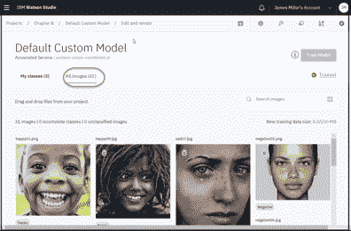

# 自动标注

在本章前面，我们指出，在收集用于表情分析和识别的图像后，每个单独的图像都必须被标注或标记为属于哪个情感组。这可能是一项艰巨的任务。幸运的是，当使用 IBM Watson Studio 时，你只需将适当的图像包含在一个 ZIP 文件中，并将 ZIP 文件拖放到一个类别上，Watson 就会自动标记图像文件。例如，在以下截图中，你可以看到我们可以正确识别那些属于我们**快乐**类别的图像（用绿色轮廓表示），而单个图像`sad05`（用红色轮廓表示）不属于，应该从我们的 ZIP 文件中排除：

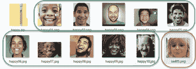

这是一个相当简单的过程，但它可能会引起错误。由于它简单快捷，你可能会错误地包含会稀释训练样本的图像。记住，即使图像文件命名直观，如快乐或悲伤，Watson 并不关心这些名称，它只是将文件中的所有图像标记为*正面*或*匹配*到类别。

最后，还有关于训练数据的另一个注意事项。一旦你费心收集和上传数据作为 IBM Watson Studio 资产，这些数据将可用于任何你的项目，如果你愿意，你可以与任何其他 Watson Studio 用户共享！这促进了跨项目和用户之间的资产开发，并增加了你的投资回报率。

# 学习表情分类器

一旦你注意到模型状态（在默认自定义模型页面的右上角指示）已更改为“模型准备训练”，然后你可以点击“训练模型”按钮开始在我们提供的训练图像上训练 Face 模型：

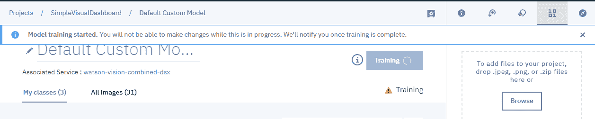

由于我们只提供了大约 30 个训练图像，训练过程应该不到 5 或 10 分钟。在训练过程中，你将无法对模型或类别进行任何更改。

# 评估表情分类器

一旦模型训练完成，你应该会看到以下训练成功的消息：

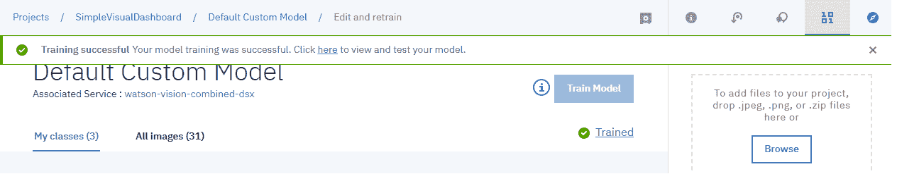

从这个点开始，你可以点击弹出窗口中的此处超链接来查看和测试模型。

# 查看模型训练结果

在成功训练模型后，你将被重定向到一个页面，你可以看到模型构建的概述或摘要（模型 ID、状态和其他元数据）：

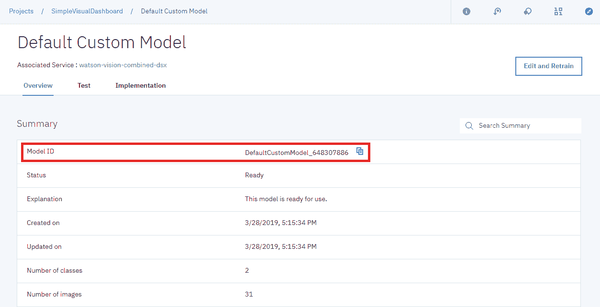

我们还可以查看我们模型的类别信息：

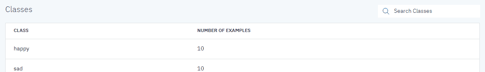

# 测试模型

要测试和了解我们的模型表现如何（或者它是否真的工作！），您可以在上一页视图的测试标签页上传图像。让我们试试！

要使用图像进行测试，请点击测试：

就像我们收集快乐和悲伤图像一样，我们可以识别出一些随机图像（不考虑图像中显示的表情）来测试模型检测表情的能力：

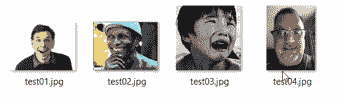

# 测试分数

我们的模型旨在解释前面的图像，进行一些表情分析，然后根据图像是快乐表情还是悲伤表情进行分类。此外，模型应为每个定义的类别（除了负类别）生成并显示一个分数。

正如您在我们模型中看到的那样，我们定义了两个要分类的类别——快乐和悲伤。对于每个测试图像，模型应显示一个百分比分数，显示检测到的表情是快乐还是悲伤的百分比。例如，以下分数表明有大约 90%的可能性，所识别的表情是快乐的：

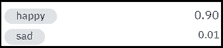

# 测试模型

要使用以下图像测试模型，我们可以简单地将图像文件拖放到前面的页面上，让分类器分析它们：

还请查看以下截图：

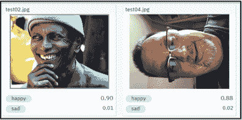

成功！看起来我们的四个随机面孔都被我们的面部模型正确评估和评分了。我们可以看到，在前两张图像中，模型表示有 11%和 90%的可能性认为个体是快乐的和悲伤的。

# 改进模型

尽管我们的解决方案看起来运行正确，但我们仍需记住，模型是在非常少量的数据上训练的。

要改进模型，从默认自定义模型页面，您可以点击标有“编辑和重新训练”的蓝色按钮：

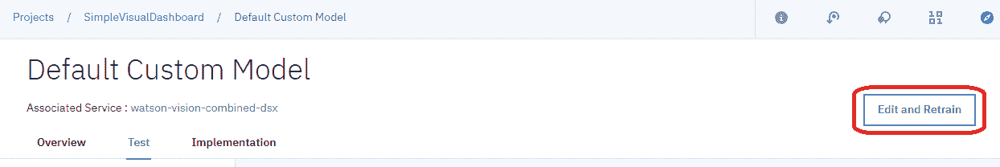

这将使我们的项目可编辑。

# 更多训练数据

对我们的解决方案的一些改进包括向快乐和悲伤组添加更多图像。为此，您可以创建一个新的 ZIP 文件，包含新的和额外的图像，并将其上传到 IBM Watson Studio（与本章前面所做的方式相同），上传文件，并将新的 ZIP 文件拖放到相应的类别中。Watson 将添加新的图像（而不会覆盖已定义的内容）：

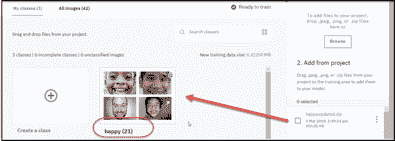

# 添加更多类别

我们解决方案的另一个重大改进是添加额外的类别。这是为了让我们的模型能够支持检测除了快乐和悲伤之外的第三种情感或表情。让我们尝试添加愤怒作为我们的第三个（不计负面）类别：

1.  当然，第一步是收集和压缩（zip 文件）我们的愤怒图像训练数据：

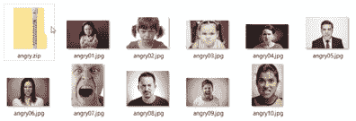

记住，单个图像文件的名字并不重要，重要的是它们都代表相同的情感，*愤怒*。

1.  在我们上传了`angry.zip`文件（作为我们项目可用的另一个数据资产）之后，我们就可以继续点击创建一个类别，输入`angry`作为类别名称，然后点击创建：

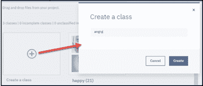

片刻之后，我们新的`angry`类别就准备好了：

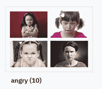

1.  现在，我们可以再次点击训练模型按钮，开始使用我们提供的训练图像以及我们新的愤怒类别重新训练面部模型。片刻之后，我们应该再次看到模型已训练的消息：

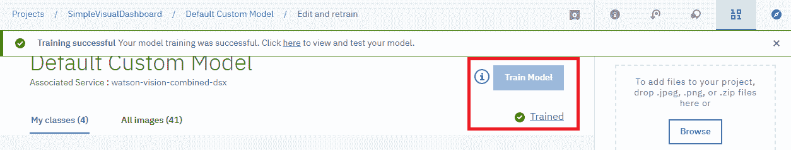

# 结果

再次，我们可以前往默认自定义模型页面，点击测试选项卡，并投放一些新的测试图像供模型评估和分类：

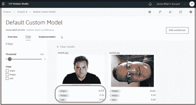

您可以看到模型已经正确地将第一张图像分类为 0.77 愤怒。我们还对一张之前的图像进行了回归测试，模型再次正确地将其分类（为 0.66 快乐）。

注意，现在我们的模型为每个测试图像提供了三个分数：愤怒、快乐和悲伤，对应于我们模型定义的每个类别：

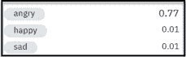

# 摘要

在本章中，我们探讨了表情分析和检测背后的概念，并使用 IBM Watson Studio、Watson 视觉识别服务和默认的面部模型构建、训练和测试了一个几乎零编程的端到端、可工作的视觉表情分类解决方案！

在下一章中，我们将发现使用 IBM 云平台上的机器学习自动分类岩相形成。
