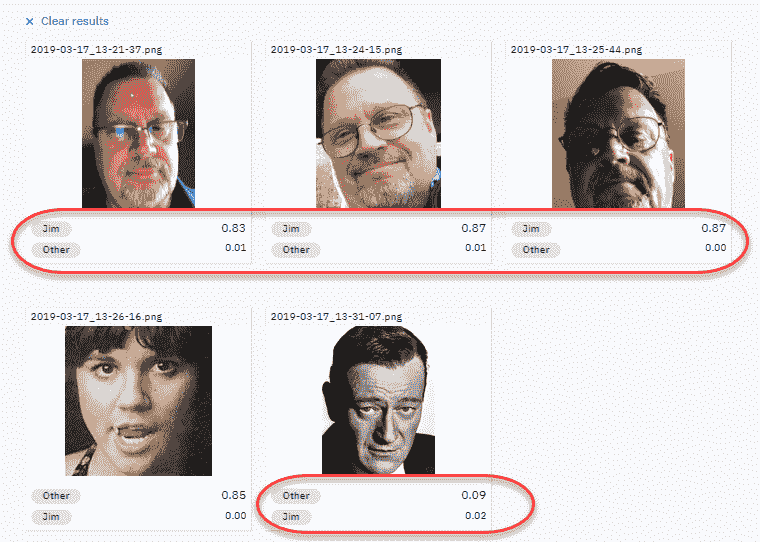

# 构建基于云的多生物识别身份认证平台

在本章中，我们将使用**IBM Watson Studio**，通过构建一个基于云的**人类**识别系统来展示如何使用**生物识别特征**。我们首先介绍生物识别，并考虑我们所说的生物识别数据是什么。然后，我们将解释每种生物识别所需的预处理类型。此外，我们将了解如何从生物识别数据中提取有意义特征的过程。最后，我们将涵盖**多模态数据融合**的概念。

本章将涵盖以下主题：

+   理解生物识别

+   探索生物识别数据

+   特征提取

+   生物识别识别

+   多模态融合

+   我们的示例

# 理解生物识别

如果我们从单词本身开始分解，**生物识别**这个词来源于希腊语单词**bio**（生命）和**metrics**（测量），因此生物识别与将统计分析应用于生物数据的应用相关。

**生物识别验证**是指通过评估一个（或多个）区分性生物特征来唯一识别某人的过程。

在生物识别验证过程中通常使用的唯一标识符包括以下内容：

+   指纹

+   手部几何形状

+   耳垂几何形状

+   视网膜/虹膜图案

+   语音（波）

+   DNA

+   签名

对于我们这些《法医档案》粉丝来说，最古老的生物识别验证形式之一是指纹识别。您可以参考以下链接中的文章，了解更多关于第一个法医档案是如何实施的信息：[`onin.com/fp/fphistory.html`](http://onin.com/fp/fphistory.html)。

随着技术的进步，生物识别验证和认证得到了显著的发展，例如模拟数据的数字化（更不用说 IBM Watson 了！），现在可以实现几乎瞬时的个人识别。

虽然可能很明显，生物识别认证过程使用物理特征（指纹识别）来数字化识别（或验证）一个人，但更先进的解决方案也可能利用人类的行为特征（如语音节奏）。

这些（特征）被认为对特定个人是独特的，因此它们可以组合使用（关于如何组合标识符将在本章稍后讨论）以确保更高的识别准确性。

# 建立案例

为什么生物识别验证如此引人关注？

答案是，在一个瞬间和越来越互联网化的世界中，密码验证速度慢，坦白说，根本不够好（不够强大）。

根据最近的流行观点（*4 reasons why biometric security is the way forward*, Digitial Biometrics, AUG 2015），以下四个原因被认为是生物识别验证之所以如此重要的原因：

+   物联网的格局正变得越来越复杂

+   密码不够强大

+   生物识别安全更高效

+   越来越多的公司和机构正在采用生物识别技术

几乎我们每个人都需要创建或选择一个密码，并且被告知所选短语是弱的或不够强大。一个弱密码是指人类或自动化过程都容易检测到的密码。

人们经常使用可猜测的密码，如孩子的名字或房子的号码（这样就不会忘记密码），但密码越简单或越弱，就越容易被检测或复制。

生物识别认证是一种更有效的证明身份或验证某人的方法，因为它不能被模拟或复制，而且黑客几乎不可能操纵认证过程，即使使用恶意软件和其他病毒。

# 流行用例

一些目前实际应用生物识别认证技术的领域包括以下内容：

+   边境和移民

+   劳动力管理

+   犯罪识别

+   机场安全

+   时间管理和考勤

+   公安执法

+   访问控制和**单点登录**（**SSO**）

+   银行

所有迹象都表明，这项技术将继续增长和成熟，正如 M2SYS Technology 的 John Trader 在文章《全球生物识别技术的应用》中所展示的（[`www.m2sys.com/blog/biometric-hardware/top-5-uses-biometrics-across-globe/amp/`](http://www.m2sys.com/blog/biometric-hardware/top-5-uses-biometrics-across-globe/amp/)）。

从财务角度来看，根据**安全行业协会**（**SIA**）的数据，仅在美国，电子访问控制市场的规模预计在 2019 年将超过 447 亿美元（从 2014 年的略超过 30 亿美元增长而来）。

为了进一步证明生物识别认证的合理性，一篇在线文章《千禧一代加速密码时代的终结》（2018 年 1 月 29 日，作者 Limor Kessem），我们看到尽管密码使用并不流行，但在登录应用程序时，*安全性*是用户最关心的问题（[`securityintelligence.com/new-ibm-study-consumers-weigh-in-on-biometrics-authentication-and-the-future-of-identity/`](https://securityintelligence.com/new-ibm-study-consumers-weigh-in-on-biometrics-authentication-and-the-future-of-identity/))。

# 隐私问题

随着生物识别技术的便利性和安全性，隐私问题也引起了关注。为了使任何生物识别认证解决方案正常工作，它需要一个数据库，包含每个要被系统识别和授权的个人的相关信息。这意味着每个用户的生物识别签名都必须被记录，以便解决方案可以使用这些信息来验证每个人的身份。保护、道德使用和治理这些信息变得至关重要。

除了上述内容外，由于生物系统的本质，它们还收集比用户的指纹、视网膜模式或其他生物数据更多的信息。在基本层面上，大多数系统会记录个人在身份验证时的时间和地点。这也导致了关于如何以及在哪里可能使用这些信息的担忧。

关于这个特定主题的一些最后的话：一项最近的法院裁决强调了在收集和使用生物数据之前提供（事先）通知的重要性。处理生物数据时要小心：违反法律很可能会导致你或你的公司被起诉。

# 生物认证解决方案的组件

构成生物认证解决方案的组件包括以下内容：

+   用于捕获生物信息的传感器或其他设备

+   数据存储以保存生物数据

+   机器学习匹配算法

+   决策处理器或如何处理前三个步骤的结果

在下一节中，我们将开始探索生物数据。

# 探索生物数据

在阅读本章前面的部分，并希望理解在解决方案中使用生物数据的目的和机会之后，下一步是至少在概念上构建解决方案的概述。

当使用生物信息进行身份验证时，我们会看到以下情况：

+   **生物数据的收集**：此步骤使用某种输入设备来捕获生物数据。此信息的输入通常被称为生物扫描。这种扫描可能是指纹、眼睛的虹膜、语音提示或其他形式的生物扫描（相当常见的是，照片是首先使用的生物形式，因为照片易于理解和处理）。

+   **生物数据的转换、标记和存储**：通过扫描收集的数据必须随后转换为数字格式，并保存在数据库中，并适当标记。此数据库存储需要由解决方案授权的个人生物数据。

+   **选择和配置机器学习算法**：使用**匹配算法**将新扫描的数据与数字数据库中存储和标记的数据进行比较。一旦匹配，个人就会被验证，然后使用决策逻辑来决定下一步将是什么，例如授予系统或位置的访问权限。

# 特定个人识别

因此，生物识别涉及通过比较呈现在（或扫描）的**生物特征签名**与解决方案数据库中已编目和标记的签名来确定特定个人的身份，并做出决定：是否匹配？这可以在以下图表中看到：

生物特征签名可以是来自个人的以下项目之一：

+   他们的面部照片

+   他们的声音记录

+   一张他们的指纹图像

请记住，**生物识别数据**是一个通用术语，用于指代在**生物识别****扫描过程中**创建的任何数据。

除了之前提到的，这种生物识别数据还可能包括任何样本、模型、指纹、相似度得分，以及包括个人姓名和人口统计数据的所有验证或识别数据。

个人签名中还可以包括掌纹、面部识别、DNA、掌印、手部几何形状、虹膜识别、视网膜和气味/香味。此外，与个人行为模式相关的**行为特征**（例如，他的步态或打字节奏）也可能成为生物识别数据库的一部分。

还应该注意的是，由于生物识别数据是数字格式，它可以被计算机系统高效处理，并且可以轻松加密，以防止未经授权的人员进行不道德的操作和使用。

另一点是，将一组生物识别样本提交给生物识别系统进行身份验证或验证被称为尝试。出于明显的原因，解决方案通常只允许对个人进行一次身份验证或验证尝试。那些在解决方案数据库中没有预先扫描和编目生物识别签名的人的尝试将失败认证。这很重要，因为它减少了解决方案工作所需扫描和编目的数据量：你只需要为那些确实需要认证和授权访问的个人建立数字签名。

# 生物识别数据使用的挑战

收集、编目和使用生物识别数据可能是一个挑战。这种数据形式，像大多数数据一样，容易受到不确定性和变化的影响。也许生物识别数据独有的，我们发现这些信息可能受到个人年龄变化、环境影响、疾病、压力、职业因素、训练和提示、有意改变、发生情境的社会文化方面、人与系统交互的变化等因素的影响。

因此，个人的每次互动或尝试都可能关联到不同的生物识别信息。

# 样本量确定

在第八章《在 IBM 云上创建面部表情平台》中，我们构建了一个表情分析模型，使用面部图像作为模型训练和检测人类情感（快乐、悲伤和愤怒）的数据。在那个练习中，我们为每种情感选择了 11 张图像的样本量：

在那个练习中，样本量（11）是足够的，因为目标是证明我们的概念。显然，样本量越大，模型越准确。

**生物识别认证**解决方案基于相同的原理；然而，它不是从尝试中检测情绪，而是将**扫描**的图像与其目录数据库进行比较，寻找匹配项。由于扫描的图像不会是数据库中的图像，匹配算法必须比较数据库中的图像，并根据其面部识别和评估逻辑检测个体。如果数据库中每个已认证用户的图像只有一张，错误率就会增加。因此，需要多少张图像（对于每个用户）？对于生物识别认证解决方案，最优的样本大小是多少？

生物识别系统性能通常通过从**n**个不同主体收集生物识别模板（或生物识别签名）来评估，并且为了方便起见，为每个**n**个主体获取该生物识别的多个实例（例如，照片）。

不幸的是，你很可能会发现，目前关于基于**接收者操作特征（ROC）曲线**构建置信区域以验证声称的性能水平并确定建立 ROC 曲线预定宽度置信区域所需的生物识别样本数量的工作并不多。

ROC 广泛用于确定预测模型如何区分真阳性和真阴性。为了完成这项任务，模型不仅需要正确地将阳性预测为阳性，还需要将阴性预测为阴性。

# 特征提取

生物识别特征提取（有时也称为细节提取）是指选择或增强样本的已建立**关键**特征的过程，以便更有效地处理。通常，特征提取的过程依赖于一套算法，这些算法根据所使用的生物识别识别类型（例如，面部图像或指纹）而变化。

生物识别认证是将从图像（例如，生物特征图像）等转换成可搜索数据集的样本进行匹配。这种转换的过程被称为特征提取。

如果你想要了解特征提取的基本工作原理的例子，你会发现它取决于样本类型，但大部分来说，概念化起来相当简单。你可以访问以下链接了解更多关于生物识别匹配的工作原理：[`devtechnology.com/2013/11/emerging-biometric-technology-revocable-biometric-features/`](http://devtechnology.com/2013/11/emerging-biometric-technology-revocable-biometric-features/)。

一些其他生物识别特征提取的例子也可以参考以下链接中的文章：[`arindamcctvaccesscontrol.blogspot.com/2010/05/access-control-index-terminology.html`](http://arindamcctvaccesscontrol.blogspot.com/2010/05/access-control-index-terminology.html)。

# 生物识别识别

生物识别认证以及最终的认证成功，依赖于解决方案中选用的机器学习算法的鲁棒性，同时也取决于（正如我们在本章的*特征提取*部分所讨论的）样本大小。

除了这些要求之外，还需要考虑样本的质量以及类型。例如，图像质量差可能会显著影响生物识别认证的准确性。我们还简要提到了将**行为特征**作为生物识别签名的一部分。

一般而言，**生理特征**（例如指纹或面部图像）总是最静态的，随着时间的推移显示出很少的差异，而**行为特征**（即步态或节奏）可能会并且通常会有变化，可能会受到外部因素或特定情绪条件（如压力或强烈的心理影响）的影响。

一些生物识别认证解决方案已经使用的一些有趣的**行为****特征**包括声音印记、书写和/或打字风格、身体动作、行走风格和趋势等。

# 多模态融合

最简单地说，围绕个人财产的关卡越多，它就越安全，因为我们需要具备成功通过多个测试的能力才能继续进行。同样适用于任何基于测试结果（匹配或不匹配）做出继续决策的系统或解决方案。添加额外的测试会产生额外的结果和基于这些结果做出的额外决策。

生物识别认证解决方案通常被认为是单模态（仅进行单一测试）或多模态（进行多个测试）：

+   **多模态生物识别认证**：这描述了一个实现解决方案，该解决方案利用多个生物识别指标来识别认证的个人，例如照片/图像和签名。需要成功匹配两个生物识别才能成功。

+   **单模态生物识别认证**：这描述了一个仅利用单一认证级别的解决方案，例如仅使用照片/图像或签名。在这种情况下，如果解决方案成功匹配到生物识别（例如，图像），则尝试成功。

# 我们的例子

现在我们已经对生物识别认证解决方案及其工作原理有了概念和理解，我们将尝试构建一个简单但实际可行的原型，使用与我们在第八章，“在 IBM 云上创建面部表情平台”中使用的相同的**IBM Watson 视觉识别服务**，以及那个项目作为我们新解决方案的指南。

作为提醒，IBM Watson 视觉识别服务能够直接理解图像内容（我们已在我们的第八章，*在 IBM 云上创建面部表情平台*项目中演示过）。提供的预训练模型使您能够分析图像中的对象、人脸、颜色、食物、显性内容以及其他主题，以深入了解您的视觉内容。我们成功使用该服务检测人脸并确定表情。

# 前提

基本前提是克隆我们的第八章，*在 IBM 云上创建面部表情平台*项目，并创建一个或多个类，用作我自己的简单生物特征签名；一个包含 dozen 张我脸的图片，以及一个包含 dozen 张随机人脸的负类（这些人脸中不会有我）。

此外，至少还有一个其他类，设计为另一个个人的生物特征签名。因此，我们预计在本章的项目中，我们将有以下三个类：

+   吉姆类

+   第二个人或其他类

+   负类

最后一步将是使用移动设备拍摄我和其他人的几张照片，不进行任何准备或图像处理，将面部图像提交到我们的项目并记录结果：匹配或不匹配。这些图像提交将被视为我们生物识别认证的尝试。

为了公平地测试项目，我们确保提交几张我自己的照片（这些照片都不会成为模型类定义的一部分，即我的生物特征签名）和几张不是我的脸的照片，并记录每次提交的结果。

最后，我们将评估并记录结果。

# 数据准备

立即，我们需要有 10 张我脸的样本。这些图片应该是合理的质量，并且为了获得最佳结果，应该在一段时间内拍摄近距离照片，以便算法可以考虑到我外观的变化。

如果您忘记了，可以回顾第八章，*在 IBM 云上创建面部表情平台*，以了解具体的文件图像要求。

这里是用于创建我的生物特征签名的图片：

接下来，我们需要为另一个人建立生物特征签名（与相同大小的样本）：

最后，需要设置 10 张随机人脸的负类（当然，这些是从我们的项目中借用的）：

来自 Watson 文档的提醒：创建分类器的调用需要你提供至少两个示例 ZIP 文件：两个正面示例文件或一个正面和一个负面文件。负面示例定义了更新后的分类器不是什么。它不用于在创建的分类器中创建一个类别。负面示例文件将包含不匹配任何正面示例主题的图像。在单个调用中，只能指定一个示例。

# 项目设置

再次假设我们已经创建了一个新的 IBM Watson Studio 项目，现在（就像在第八章，“在 IBM 云上创建面部表情平台”）通过访问资产选项卡下的模型，点击新建视觉识别模型（你可以回到第八章，“在 IBM 云上创建面部表情平台”，快速回顾）。

就像在第八章，“在 IBM 云上创建面部表情平台”，一旦模型创建完成（只需几分钟），你就可以将本章前几节准备的图像`.zip`文件拖放到模型上。

这将把图像文件上传到**云对象存储**（**COO**），使它们可用于我们的项目（如下面的截图所示）：

从默认自定义模型屏幕（如下面的截图所示），我们准备好构建我们的模型类别：

# 创建类别

现在，你可以点击创建类别按钮（如下面的截图所示底部左侧）来创建 Jim 和其他类别（记住，负类别已经为你创建好了）：

再次，你可以参考第八章，“在 IBM 云上创建面部表情平台”，到“为我们的模型创建类别”部分，以获取创建类别的逐步说明。

# 训练模型

一旦我们创建了三个类别（并加载了图像），并保存，并且模型状态显示为“准备训练”，我们就可以点击训练模型按钮开始在我们提供的图像上训练模型：

再次强调，这是一个只有 30 个训练图像的小模型；训练过程将不到 5 或 10 分钟。使用 IBM Watson 和服务的美丽之处在于，许多“详细任务”如创建模型定义和训练模型只是简单地“点击按钮”。要了解更多关于训练视觉识别模型的信息，你可以访问：

https://dataplatform.cloud.ibm.com/docs/content/wsj/analyze-data/visual-recognition-train.html?linkInPage=true

一旦模型训练完成，并且您注意到（见以下截图）模型状态显示为“已训练”，您就可以继续：

正如我们在第八章，“在 IBM 云上创建面部表情平台”中做的那样，为了测试和验证我们的模型，我们可以在默认自定义模型页面的测试区域上传图片，如下截图所示：

# 测试我们的项目

正如我们计划的那样，我们项目练习的最后一步是使用移动设备拍摄自己和其他人的几张照片，不准备图片，将面部图像提交到我们的项目进行认证并记录结果：匹配或不匹配。

使用我的智能手机，我拍摄了以下三张头像。我试图捕捉到光照和表情的变化：

此外，正如我们之前所述，为了公平地测试我们的项目，我们需要提交几张不是我的脸的图片，并记录每次提交的结果。

对于这些测试对象，我收集了以下内容：

现在是测试时间！

如以下截图所示，我提交了前四张图片：吉姆、吉姆、吉姆和其他。模型正确验证了提交的每一张图片：

这相当不错，对吧？现在我们可以提交第四张和最后一张图片（*不是*吉姆和*不是*其他）并放大所有分数：

# 良好训练的指南

我们现在使用 IBM Watson Studio 和 IBM Watson 视觉识别服务创建了一个简单的生物识别认证概念证明。它可行，但当然这还不是部署状态。在模型准备好部署和生产使用之前，有许多事情需要考虑。例如，视觉识别服务提供的指南指出，在开始实际评估训练结果之前，最好每个类别至少包含 50 张正面图片。

提供的其他建议包括以下内容：

+   假设您的训练数据质量和内容相似，更多的训练图片通常比更少的图片提供更准确的结果。

+   每个`.zip`文件包含 150 到 200 张图片，在处理时间和准确性之间提供了最佳平衡。超过 200 张图片会增加时间，但准确性会下降，而且时间的增加会带来递减的回报。

# 实现方式

测试标签旁边的实现标签（如下截图所示）。从这里，您可以看到 Watson 为您提供的代码片段，用于将图像与您刚刚构建的模型进行分类：

作为参考，您将需要部署模型的全 API 规范在此处可用：[`cloud.ibm.com/apidocs/visual-recognition`](https://cloud.ibm.com/apidocs/visual-recognition)。

# 摘要

在本章中，我们介绍了讨论了在生物识别认证解决方案中收集和使用生物识别数据，以及此类解决方案的工作原理，以及特征提取（就生物识别数据解决方案而言）的多模态融合的想法。最后，我们再次使用 IBM Watson 视觉识别服务，将第八章中提到的表情检测和分析解决方案扩展，即*在 IBM Cloud 上创建一个面部表情平台*，以创建一个工作的生物识别认证解决方案的概念验证。

下一章将总结本书内容，概述我们已经涵盖的内容。该章节还将对与在 IBM Watson Studio 上开发机器学习系统相关的某些实际考虑因素进行一些说明。
