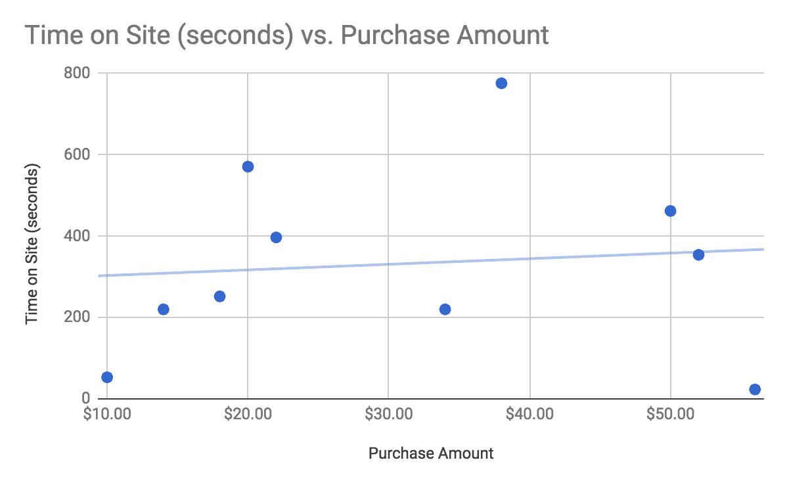
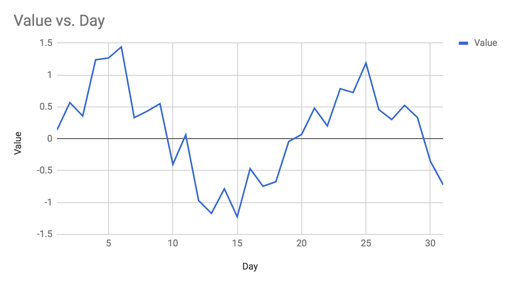
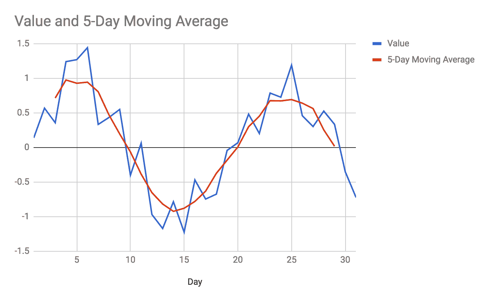
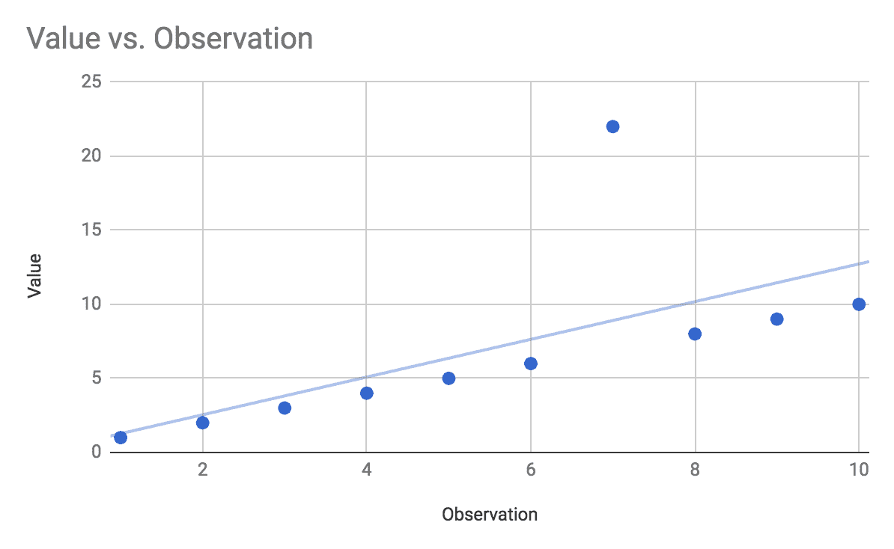
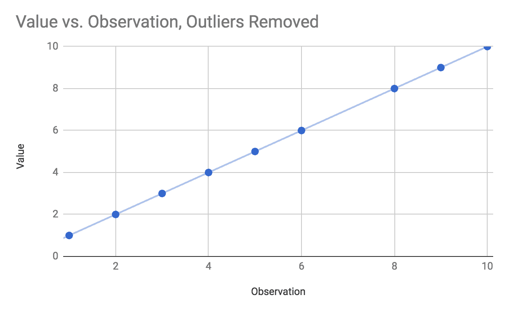
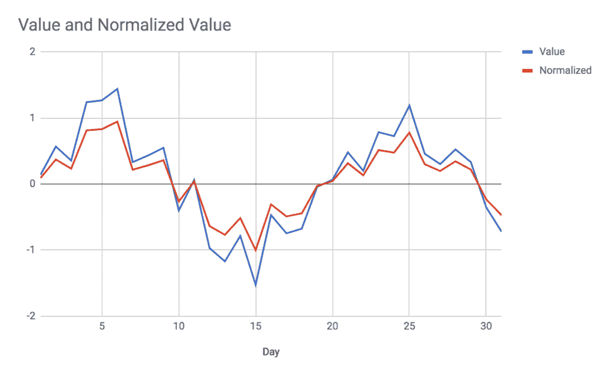

# 第二章：数据探索

对于初学者来说，关于**机器学习**（**ML**）最重要的认识是，*机器学习不是魔法*。将大量数据集拿过来，天真地应用神经网络，并不会自动给你带来震撼的见解。机器学习建立在坚实且熟悉的数学原理之上，如概率、统计学、线性代数和向量微积分——不包括巫术（尽管一些读者可能会把向量微积分比作巫术）！

在本章中，我们将涵盖以下主题：

+   概述

+   变量识别

+   数据清洗

+   转换

+   分析类型

+   缺失值处理

+   异常值处理

# 概述

我希望尽早澄清的一个误解是，实现机器学习算法本身是完成某些任务所需工作的主要部分。如果你是新手，你可能会有这样的印象，即你应该花费 95%的时间来实现神经网络，并且神经网络完全负责你得到的结果。构建一个神经网络，放入数据，神奇地得到结果。还有什么比这更容易的吗？

机器学习的现实是，你使用的算法只和你放入的数据一样好。此外，你得到的结果只和你处理和解释它们的能力一样好。古老的计算机科学缩写词**GIGO**（垃圾输入，垃圾输出）在这里非常适用：*垃圾输入*，*垃圾输出*。

在实现机器学习技术时，你还必须密切关注它们的预处理和后处理。数据预处理需要很多原因，这也是本章的重点。后处理与你对算法输出的解释有关，无论是你对算法结果的信心是否足够高，以至于可以采取行动，以及你将结果应用于业务问题的能力。由于结果的后处理强烈依赖于所讨论的算法，因此我们将根据本书中的具体示例来讨论后处理考虑事项。

数据预处理，就像数据后处理一样，通常取决于所使用的算法，因为不同的算法有不同的要求。一个直接的例子是图像处理，使用**卷积神经网络**（**CNNs**），这在后面的章节中会有介绍。所有由单个 CNN 处理的图像都应具有相同的尺寸，或者至少具有相同数量的像素和相同数量的颜色通道（RGB 与 RGBA 与灰度等）。CNN 被配置为期望特定的输入数量，因此你给它的每一张图像都必须进行预处理，以确保它符合神经网络的要求。在将图像输入网络之前，你可能需要调整大小、缩放、裁剪或填充输入图像。你可能需要将彩色图像转换为灰度图像。你可能需要检测并从你的数据集中移除损坏的图像。

一些算法如果输入错误的数据，根本就无法工作。如果一个卷积神经网络（CNN）期望接收 10,000 个灰度像素强度输入（即一个 100 x 100 像素的图像），那么你不可能给它一个 150 x 200 像素大小的图像。这是我们最好的情况：算法会大声失败，我们能够在尝试使用我们的网络之前改变我们的方法。

然而，其他算法如果输入错误的数据，可能会无声无息地失败。算法看起来似乎在工作，甚至给出看似合理的但实际完全错误的结果。这是我们最坏的情况：我们以为算法按预期工作，但实际上我们陷入了垃圾进垃圾出（GIGO）的情况。想想看，你需要花多长时间才能发现算法实际上给你的是无意义的输出。你基于错误的分析或糟糕的数据做出了多少不良的商业决策？我们必须避免这些情况，而这一切都始于开始：确保我们使用的数据适合应用。

大多数机器学习（ML）算法对其处理的数据做出假设。一些算法期望数据具有特定的尺寸和形状（如神经网络），一些算法期望数据被分类，一些算法期望数据在某个范围内归一化（在 0 到 1 或-1 到+1 之间），一些算法对缺失值有弹性，而另一些则没有。最终，你的责任是理解算法对你数据的假设，并将数据与算法的期望相匹配。

大部分上述内容都与数据的格式、形状和大小有关。还有另一个考虑因素：数据的质量。一个数据点可能格式正确，并且与算法的期望相匹配，但仍然可能是错误的。也许有人记录了一个错误的测量值，也许有仪器故障，或者可能某些环境效应已经污染或损害了你的数据。在这些情况下，格式、形状和大小可能正确，但数据本身可能会损害你的模型，并阻止它收敛到一个稳定或准确的结果。在这些情况中，有问题的数据点可能是一个**异常值**，或者是一个似乎不适用于集合的数据点。

异常值在现实生活中存在，通常是有效数据。仅凭观察数据本身，我们往往无法确定异常值是否有效，我们还需要考虑上下文和算法来确定如何处理数据。例如，假设您正在进行一项元分析，将患者的身高与他们的心脏功能联系起来，并且您有 100 份医疗记录可供分析。其中一位患者的身高被记录为 7'3"（221 厘米）。这是否是一个打字错误？记录数据的人实际上是否意味着 6'3"（190 厘米）？在只有 100 个随机个体的情况下，其中一个人实际上那么高的可能性有多大？即使这会扭曲您原本看起来非常干净的结果，您是否仍然应该使用这个数据点进行分析？如果样本量是 100 万条记录而不是只有 100 条呢？在这种情况下，您实际上确实选择了一个非常高的人的可能性就更大了。如果样本量只有 100，但他们都是 NBA 球员呢？

如您所见，处理异常值并不简单。您应该始终谨慎对待删除数据，尤其是在有疑问的情况下。通过删除数据，您可能会无意中创造出一个自我实现的预言，即您有意识地或无意识地只选择了支持您假设的数据，即使您的假设是错误的。另一方面，使用不合法的坏数据可能会毁掉您的结果并阻碍进步。

在本章中，我们将讨论在数据预处理阶段必须考虑的多个不同因素，包括数据转换、处理缺失数据、选择正确的参数、处理异常值以及其他有助于数据预处理阶段的分析形式。

# 特征识别

想象一下，您负责在一个您帮助运营的电子商务网站上放置目标产品广告。目标是分析访客过去的购物趋势，并选择展示的产品以提高购物者购买的可能性。鉴于您拥有先见之明，您已经收集了数月来所有购物者的 50 个不同指标：您记录了过去的购买，这些购买的产品类别，每次购买的标价，用户在购买前在网站上的停留时间等等。

认为机器学习是一剂万能药，认为数据越多越好，以及认为对模型进行更多训练越好，您将所有 50 个维度的数据加载到算法中，并连续训练了数天。当测试您的算法时，您发现它在评估您训练的数据点时准确性非常高，但同时也发现当评估验证集时，算法表现糟糕。此外，模型训练时间非常长。这里出了什么问题？

首先，你假设你所有的 50 个数据维度都与当前任务相关。结果证明并非所有数据都相关。机器学习擅长在数据中找到模式，但并非所有数据实际上都包含模式。一些数据是随机的，而其他数据虽然不是随机的，但也不有趣。一个符合模式但无趣的数据例子可能是购物者在你的网站上浏览的时间：用户只能在清醒时购物，所以大多数用户在早上 7 点到午夜之间购物。这些数据显然遵循一个模式，但可能实际上并不影响用户的购买意图。当然，确实可能存在一个有趣的模式：也许夜猫子倾向于在深夜进行冲动购物——但也许不是。

其次，使用所有 50 个维度并长时间训练你的模型可能会导致模型过拟合：你的过拟合模型现在非常擅长识别某种行为代表史蒂夫·约翰逊（一个特定的购物者），而不是将史蒂夫的行为归纳为一个广泛适用的趋势。这种过拟合是由两个因素造成的：长时间的训练时间和训练集中存在无关数据。如果你记录的一个维度大部分是随机的，并且你花了大量时间在这个数据上训练模型，那么模型最终可能会将那些随机数据作为用户的标识符，而不是将其过滤掉作为非趋势。模型可能会学习到，当用户在网站上的时间是正好 182 秒时，他们会购买价值 120 美元的产品，仅仅是因为你在训练过程中多次在训练数据点上训练了模型。

让我们考虑一个不同的例子：人脸识别。你拥有成千上万张人们的面孔照片，并希望能够分析一张照片并确定主题人物是谁。你在自己的数据上训练了一个卷积神经网络（CNN），发现你的算法准确率相当低，只有 60%的时间能够正确识别主题人物。这里的问题可能在于你的 CNN 在处理原始像素数据时，未能自动识别真正重要的面部特征。例如，莎拉·简总是在她厨房里拍自拍，她最喜欢的勺子总是放在背景中展示。任何其他恰好也在照片中有勺子的人可能会被错误地识别为莎拉·简，即使他们的面孔相当不同。数据已经过度训练了神经网络，使其将勺子识别为莎拉·简，而不是真正查看用户的脸部。

在这两个例子中，问题始于数据预处理不足。在电子商务商店的例子中，你没有正确识别出真正重要的购物者特征，因此用大量无关数据训练了你的模型。在人脸检测的例子中，也存在相同的问题：照片中的每个像素并不代表一个人或其特征，算法在看到可靠的勺子模式后，学会了 Sarah Jane 是勺子。

为了解决这两个问题，你需要更好地选择提供给你的机器学习模型的特征。在电子商务的例子中，可能只有你记录的 50 个维度中的 10 个是相关的，为了解决这个问题，你必须确定这 10 个维度是什么，并且只在训练模型时使用这些维度。在人脸检测的例子中，也许神经网络不应该接收原始像素强度数据，而应该接收面部维度，例如**鼻梁长度**、**嘴巴宽度**、**瞳孔间距**、**瞳孔与眉毛之间的距离**、**耳垂间距**、**下巴到发际线的距离**等等。这两个例子都说明了选择数据中最相关和适当特征的需要。适当选择特征将有助于提高模型的速度和准确性。

# 维度诅咒

在机器学习应用中，我们经常处理高维数据。如果我们为每位购物者记录 50 个不同的指标，我们就在一个 50 维的空间中工作。如果我们分析 100 x 100 像素的灰度图像，我们就在一个 10,000 维的空间中工作。如果图像是 RGB 彩色，维度将增加到 30,000 维（图像中每个像素的每个颜色通道都是一个维度）！

这个问题被称为**维度诅咒**。一方面，机器学习擅长分析具有许多维度的数据。人类不擅长在如此多的维度中找到可能分布的模式，尤其是如果这些维度以反直觉的方式相互关联。另一方面，随着我们添加更多维度，我们也需要更多的处理能力来分析数据，并且我们也需要更多的训练数据来构建有意义的模型。

一个明显体现维度诅咒的领域是**自然语言处理**（**NLP**）。想象一下，你正在使用贝叶斯分类器对与品牌或其他主题相关的推文进行情感分析。正如你将在后面的章节中学到的，NLP 数据预处理的一部分是将输入字符串分解成**n-gram**，即单词组。这些 n-gram 是提供给贝叶斯分类器算法的特征。

考虑几个输入字符串：`I love cheese`、`I like cheese`、`I hate cheese`、`I don't love cheese`、`I don't really like cheese`。对我们来说，这些例子很简单，因为我们整个一生都在使用自然语言。然而，一个算法会如何看待这些例子呢？如果我们进行 1-gram 或**unigram**分析——这意味着我们将输入字符串分割成单个单词——我们在第一个例子中看到`love`，在第二个例子中看到`like`，在第三个例子中看到`hate`，在第四个例子中看到`love`，在第五个例子中看到`like`。我们的 unigram 分析可能对前三个例子是准确的，但对于第四和第五个例子失败了，因为它没有学习到`don't love`和`don't really like`是连贯的陈述；算法只关注单个单词的影响。这个算法运行非常快，需要的存储空间也很小，因为在先前的例子中，上述四个短语中只使用了七个独特的单词（`I`、`love`、`cheese`、`like`、`hate`、`don't`和`really`）。

您可以修改分词预处理以使用`bigrams`，即 2-gram，或者每次两个词的组合。这增加了我们数据的维度，需要更多的存储空间和处理时间，但也能得到更好的结果。算法现在可以看到像`I love`和`love cheese`这样的维度，现在也能识别出`don't love`与`I love`是不同的。使用 bigram 方法，算法可能正确地识别前四个示例的情感，但对于第五个示例，它被解析为`I don't`、`don't really`、`really like`和`like cheese`。分类算法将看到`really like`和`like cheese`，并错误地将它与第二个示例中的积极情感联系起来。尽管如此，bigram 方法在我们的示例中有 80%是有效的。

您现在可能想再次升级分词以捕获 trigrams，即每次三个词的组合。然而，算法并没有提高准确性，而是急剧下降，无法正确识别任何内容。现在我们的数据维度太多了。算法学习了`I love cheese`的含义，但没有任何其他训练示例包含这个短语，因此这种知识无法以任何方式应用。第五个示例被解析为 trigrams `I don't really`、`don't really like`和`really like cheese`——这些之前都从未遇到过！这个算法最终给每个示例都给出了 50%的情感评分，因为训练集中没有足够的数据来捕捉所有相关的 trigrams 组合。

这是维度灾难在发挥作用：**三元组**方法确实可能比二元组方法提供更好的准确性，但前提是你有一个巨大的训练集，它提供了关于每次三个不同单词的所有可能组合的数据。你现在还需要大量的存储空间，因为三个单词的组合比两个单词的组合要多得多。因此，选择预处理方法将取决于问题的上下文、可用的计算资源以及你拥有的训练数据。如果你有大量的训练数据和大量的资源，三元组方法可能更准确，但在更现实的情况下，二元组方法可能总体上更好，即使它确实会错误分类一些推文。

前面的讨论涉及到**特征选择**、**特征提取**和**维度**的概念。一般来说，我们的目标是只**选择**相关的特征（忽略对我们不感兴趣的客户趋势），**提取**或**推导**出更好地代表我们数据的特征（通过使用面部测量而不是照片像素），并最终**降低维度**，这样我们就可以使用尽可能少且最相关的维度。

# 特征选择和特征提取

特征选择和特征提取都是用于降维的技术，尽管它们是略有不同的概念。特征选择是指只使用与当前问题相关的变量或特征。一般来说，特征选择会查看单个特征（例如“网站停留时间”）并判断该单个特征的相关性。特征提取与此类似，然而特征提取通常查看多个相关特征并将它们组合成一个单一的特征（例如查看数百个单个像素并将它们转换为**瞳孔间距**测量）。在这两种情况下，我们都在降低问题的维度，但两者的区别在于我们是在简单地过滤掉不相关的维度（特征选择）还是通过组合现有特征来推导出一个新的代表性特征（特征提取）。

特征选择的目标是选择数据中特征或维度的子集，以优化模型的准确率。让我们看看解决这个问题的直观方法：对所有可能的维度子集进行穷举、暴力搜索。这种方法在现实世界的应用中不可行，但它有助于为我们界定问题。如果我们以电子商务商店为例，我们的目标是找到一些维度或特征的子集，从我们的模型中获得最佳结果。我们知道我们有 50 个特征可供选择，但我们不知道最佳特征集中有多少个。通过暴力解决此问题，我们首先一次只选择一个特征，并为每个特征训练和评估我们的模型。

例如，我们只会使用“网站停留时间”作为一个数据点，在该数据点上训练模型，评估模型，并记录模型的准确率。然后我们转向“过去总购买金额”，在该数据点上训练模型，评估模型，并记录结果。我们对剩余的每个特征重复此过程 48 次，并记录每个特征的性能。然后我们必须考虑每次两个特征的组合，例如通过在“网站停留时间”和“过去总购买金额”上训练和评估模型，然后训练和评估在“网站停留时间”和“最后购买日期”上，等等。在我们的 50 个特征集中有 1,225 个独特的特征对，我们必须对每一对重复此过程。然后我们必须考虑每次三个特征的组合，其中共有 19,600 种组合。然后我们必须考虑每次四个特征的组合，其中共有 230,300 个独特的组合。有 2,118,760 个五个特征的组合，以及近 1600 万个六个特征的组合可供我们选择，等等。显然，这种对最优特征集的全面搜索无法在合理的时间内完成：我们可能需要训练我们的模型数十亿次，才能找出最佳的子集特征！我们必须找到更好的方法。

通常，特征选择技术分为三类：过滤方法、包装方法和嵌入式方法。每个类别都有多种技术，你选择的技术将取决于你的数据、上下文以及特定情况下的算法。

过滤方法是最容易实现的，并且通常具有最佳性能。特征选择的过滤方法一次分析一个特征，并试图确定该特征与数据的相关性。过滤方法通常与之后使用的机器学习算法无关，而是更典型的分析特征本身的统计方法。

例如，你可以使用皮尔逊相关系数来确定一个特征是否与输出变量有线性关系，并移除与零非常接近的相关性特征。这种方法族在计算时间上会非常快，但缺点是无法识别相互交叉相关的特征，并且根据你使用的过滤器算法，可能无法识别非线性或复杂关系。

包装方法与之前描述的暴力方法类似，但目标是避免像之前那样对每个特征组合进行全面穷举搜索。例如，你可以使用遗传算法来选择特征子集，训练和评估模型，然后使用模型的评估作为进化压力来找到下一个要测试的特征子集。

遗传算法方法可能找不到完美的特征子集，但很可能会发现一个非常好的特征子集来使用。根据你实际使用的机器学习模型和数据集的大小，这种方法可能仍然需要很长时间，但不会像穷举搜索那样需要无法处理的大量时间。包装方法的优势在于它们与正在训练的实际模型交互，因此直接优化你的模型，而不是简单地尝试独立地统计过滤出单个特征。这些方法的重大缺点是实现所需结果所需的计算时间。

此外，还有一种称为**嵌入式方法**的方法族，然而这个技术族依赖于具有内置特征选择算法的算法，因此非常专业化；我们在这里不会讨论它们。

特征提取技术专注于将现有特征组合成新的、派生特征，这些特征更好地代表你的数据，同时消除额外的或冗余的维度。想象一下，你的电子商务购物者数据包括`网站停留时间`和`浏览时的总像素滚动距离`作为维度。也想象一下，这两个维度都与购物者在网站上花费的金额有很强的相关性。自然地，这两个特征是相互关联的：用户在网站上花费的时间越多，他们滚动距离越远的可能性就越大。仅使用特征选择技术，如皮尔逊相关分析，你会发现在特征中应该保留`网站停留时间`和`总滚动距离`。这种独立分析这些特征的特征选择技术已经确定这两个都与你的问题相关，但没有理解到这两个特征实际上高度相关，因此是冗余的。

一种更复杂的特征提取技术，例如**主成分分析**（**PCA**），能够识别出网站停留时间和滚动距离实际上可以合并成一个单一的新特征（让我们称它为“网站参与度”），它封装了以前由两个单独特征表示的数据。在这种情况下，我们从网站停留时间和滚动距离测量中提取了一个新特征，并使用这个单一特征而不是两个原始特征分别。这与特征选择不同；在特征选择中，我们只是在训练模型时选择使用原始特征中的哪一个，然而在特征提取中，我们是从原始特征的关联组合中创建全新的特征。因此，特征选择和特征提取都减少了我们数据的维度，但以不同的方式做到这一点。

# 皮尔逊相关系数示例

让我们回到电子商务商店购物者的例子，并考虑我们如何使用皮尔逊相关系数来选择数据特征。考虑以下示例数据，它记录了购物者在网站上的停留时间和他们之前在购买上花费的金额所对应的购买金额：

| **购买金额** | **网站停留时间（秒）** | **过去购买金额** |
| --- | --- | --- |
| 10.00 | 53 | 7.00 |
| 14.00 | 220 | 12.00 |
| 18.00 | 252 | 22.00 |
| 20.00 | 571 | 17.00 |
| 22.00 | 397 | 21.00 |
| 34.00 | 220 | 23.00 |
| 38.00 | 776 | 29.00 |
| 50.00 | 462 | 74.00 |
| 52.00 | 354 | 63.00 |
| 56.00 | 23 | 61.00 |

当然，在实际应用这个问题时，你可能会有数千或数百万行，以及数十列，每列代表数据的不同维度。

现在我们将手动选择这些数据的特点。`购买金额`列是我们的输出数据，或我们希望算法根据其他特征预测的数据。在这个练习中，我们可以选择使用网站停留时间和之前的购买金额、仅使用网站停留时间，或者仅使用之前的购买金额来训练模型。

当使用过滤器方法进行特征选择时，我们一次考虑一个特征，因此我们必须独立于过去购买金额与购买金额的关系，来查看网站停留时间与购买金额的关系。解决这个问题的一个手动方法是将我们的两个候选特征分别与“购买金额”列进行图表化，并计算相关系数以确定每个特征与购买金额数据的相关程度。

首先，我们将图表化网站停留时间与购买金额，并使用我们的电子表格工具计算皮尔逊相关系数：


即使是简单的数据视觉检查也暗示着网站停留时间和购买金额之间只有很小的关系——如果有的话。计算皮尔逊相关系数得到大约 +0.1 的相关性，这是非常弱、几乎不相关的两个数据集之间的相关性。

然而，如果我们绘制过去购买金额与当前购买金额的图表，我们会看到一个非常不同的关系：



在这种情况下，我们的视觉检查告诉我们，过去购买金额和当前购买金额之间存在线性但有些嘈杂的关系。计算相关系数给我们一个相关性值为 +0.9，这是一个相当强的线性关系！

这种分析告诉我们，在训练我们的模型时可以忽略网站停留时间数据，因为似乎在该信息中几乎没有或没有统计意义。通过忽略网站停留时间数据，我们可以减少训练模型所需的维度数量，从而让我们的模型更好地泛化数据并提高性能。

如果我们还有 48 个其他数值维度需要考虑，我们可以简单地计算每个维度的相关系数，并丢弃那些相关性低于某个阈值的维度。然而，并非每个特征都可以使用相关系数进行分析，因此您只能将皮尔逊算法应用于那些进行此类统计分析有意义的特征；例如，使用皮尔逊相关系数分析列出*最近浏览的产品类别*的特征就没有意义。您可以使用，并且应该使用其他类型的特征选择过滤器来处理代表不同类型数据的维度。随着时间的推移，您将开发出一套适用于不同类型数据的分析技术工具箱。

很遗憾，在这里不可能对所有可能的特征提取和特征选择算法及工具进行详尽的解释；您将不得不研究各种技术并确定哪些适合您特征和数据的形式和风格。

对于过滤技术，可以考虑的算法包括皮尔逊和斯皮尔曼相关系数、卡方检验和信息增益算法，如库尔巴克-莱布勒散度。

对于包装技术，可以考虑的方法包括遗传算法、最佳优先搜索等树搜索算法、随机技术如随机爬山算法以及启发式技术如递归特征消除和模拟退火。所有这些技术旨在选择最佳的特征集以优化您模型的输出，因此任何优化技术都可以作为候选，然而，遗传算法非常有效且受欢迎。

特征提取有许多算法需要考虑，通常关注于特征之间的互相关，以确定最小化某些误差函数的新特征；也就是说，如何将两个或多个特征结合起来，使得损失的数据量最小。相关的算法包括主成分分析（PCA）、偏最小二乘法和自动编码。在自然语言处理（NLP）中，潜在语义分析很受欢迎。图像处理有许多专门的特征提取算法，例如边缘检测、角点检测和阈值处理，以及基于问题域的进一步专业化，如人脸识别或运动检测。

# 清洗和准备数据

在预处理数据时，特征选择并不是唯一需要考虑的因素。还有许多其他事情你可能需要做，以准备数据供最终分析数据的算法使用。可能存在测量误差，导致显著的异常值。数据中也可能存在需要平滑的仪器噪声。数据中可能存在某些特征的缺失值。这些都是可以根据上下文、数据和涉及的算法选择忽略或解决的问题。

此外，你使用的算法可能要求数据被归一化到某个值域。或者，也许你的数据格式与算法不兼容，例如神经网络通常期望你提供一个值向量，但你从数据库中得到的却是 JSON 对象。有时你可能只需要分析来自更大数据源的具体子集。如果你处理图像，你可能需要调整大小、缩放、填充、裁剪或降低图像到灰度。

这些任务都属于数据预处理的范畴。让我们看看一些具体的场景，并讨论每个场景的可能方法。

# 处理缺失数据

在许多情况下，几个数据点可能某些特征值缺失。如果你查看调查问题的 Yes/No 回答，几个参与者可能意外或故意跳过了一个给定问题。如果你查看时间序列数据，你的测量工具可能在某个时间段或测量中出现了错误。如果你查看电子商务购物习惯，某些特征可能对用户不相关，例如对作为匿名客人的用户来说的`最后登录日期`。具体情况和场景，以及你的算法对缺失数据的容忍度，决定了你必须采取的方法来修复缺失数据。

# 缺失的类别数据

在分类数据的情况下，例如可能未回答的 Yes/No 调查问题，或尚未对其类别进行标记的图像，通常最好的方法是创建一个新的类别，称为*未定义*、*N/A*、*未知*或*类似*。或者，你可能能够选择一个合理的默认类别来用于这些缺失值，例如选择集合中最频繁的类别，或者选择代表数据点逻辑父类的类别。如果你正在分析用户上传的图片，并且缺少特定照片的类别标签，你可以使用*用户*声明的类别代替照片的个别类别。也就是说，如果一个用户被标记为时尚摄影师，你可以为该照片使用*时尚*类别，即使该用户也上传了一些*旅行*照片。这种方法将以误分类数据点的形式向系统中添加噪声，但实际上可能对算法泛化模型有积极的影响；模型最终可能学会时尚摄影和旅行摄影是相似的。

使用*未定义*或*N/A*类别也是一个首选的方法，因为数据点没有类别的事实本身可能就很重要——*无类别*本身可以是一个有效的类别。数据集的大小、所使用的算法以及数据集中*N/A*类别的相对大小将影响这是否是一个合理的处理方法。例如，在分类场景中，可能出现两种效果。如果未分类的项目*确实*形成了一个模式（例如，*时尚*照片比其他照片更常被未分类），你可能会发现你的分类器错误地学习到时尚照片应该被分类为 N/A！在这种情况下，最好完全忽略未分类的数据点。

然而，如果未分类的照片由来自各种类别的照片均匀组成，你的分类器最终可能会将难以分类的照片识别为 N/A，这实际上可能是一个期望的效果。在这种情况下，你可以考虑 N/A 作为一个包含难以分类、损坏或无法解决的图片的类别。

# 缺失的数值数据

处理数值数据的缺失值比处理分类数据更复杂，因为通常没有合理的默认值来替换缺失的数值。根据数据集的不同，你可能可以使用零作为替代值，然而在某些情况下，使用该特征的均值或中位数可能更合适。在其他情况下，根据所使用的算法，用一个非常大的值填充缺失值可能是有用的：如果需要对数据点进行错误计算，使用大值将标记数据点为具有大错误，从而阻止算法考虑该点。

在其他情况下，你可以使用线性插值来填充缺失的数据点。这在某些时间序列应用中是有意义的。如果你的算法期望有 31 个数据点表示某些指标的增长，而你缺少第 12 天的一个值，你可以使用第 11 天和第 13 天的平均值作为第 12 天值的估计。

通常正确的做法是忽略并过滤掉缺失值的数据点，然而，你必须考虑这种行为的效应。如果具有缺失值的数据点强烈代表特定类别数据，你可能会在副作用中创建一个强烈的选择偏差，因为你的分析会忽略一个重要的群体。你必须平衡这种类型的副作用与其他方法可能引起的副作用：将缺失值置零会显著扭曲你的分布吗？使用平均值或中位数作为替代品会污染分析的其他部分吗？这些问题只能根据具体情况回答。

# 处理噪声

数据中的噪声可能来自许多来源，但通常不是一个重大问题，因为大多数机器学习技术对噪声数据集具有弹性。噪声可能来自环境因素（例如，空调压缩机随机启动并导致附近传感器的信号噪声），也可能来自转录错误（有人记录了错误的数据点，在调查中选择了错误的选项，或者 OCR 算法将`3`读作`8`），或者它可能是数据本身固有的（例如，温度记录的波动将遵循季节性模式，但具有嘈杂的日间模式）。

类别数据中的噪声也可能是由未归一化的类别标签引起的，例如，当类别应该是`Fashion`时，图像被标记为`fashion`或`fashions`。在这些情况下，最佳做法是简单地归一化类别标签，可能通过强制所有类别标签变为单数并完全小写——这将把`Fashion`、`fashion`和`fashions`类别合并为一个单一的`fashion`类别。

时间序列数据中的噪声可以通过取多个值的移动平均来平滑；然而，首先你应该评估平滑数据对你的算法和结果是否重要。通常，如果噪声量很小，算法仍然足以满足实际应用，特别是如果噪声是随机的而不是系统性的。

考虑以下某个传感器每日测量的示例：

| **Day** | **Value** |
| --- | --- |
| 1 | 0.1381426172 |
| 2 | 0.5678176776 |
| 3 | 0.3564009968 |
| 4 | 1.239499423 |
| 5 | 1.267606181 |
| 6 | 1.440843361 |
| 7 | 0.3322843208 |
| 8 | 0.4329166745 |
| 9 | 0.5499234277 |
| 10 | -0.4016070826 |
| 11 | 0.06216906816 |
| 12 | -0.9689103112 |
| 13 | -1.170421963 |
| 14 | -0.784125647 |
| 15 | -1.224217169 |
| 16 | -0.4689120937 |
| 17 | -0.7458561671 |
| 18 | -0.6746415566 |
| 19 | -0.0429460593 |
| 20 | 0.06757010626 |
| 21 | 0.480806698 |
| 22 | 0.2019759014 |
| 23 | 0.7857692899 |
| 24 | 0.725414402 |
| 25 | 1.188534085 |
| 26 | 0.458488458 |
| 27 | 0.3017212831 |
| 28 | 0.5249332545 |
| 29 | 0.3333153146 |
| 30 | -0.3517342423 |
| 31 | -0.721682062 |

绘制这些数据会显示出一种嘈杂但周期性的模式：



这在许多情况下可能是可接受的，但其他应用可能需要更平滑的数据。

此外，请注意，一些数据点超过了+1 和-1，这可能在您的算法期望数据在-1 和+1 范围内时特别有意义。

我们可以对数据进行`5-Day Moving Average`处理以生成更平滑的曲线。要执行`5-Day Moving Average`，从第`3`天开始，将第`1`天到第`5`天的值相加，然后除以 5。结果成为第`3`天的移动平均值。

注意，在此方法中，我们失去了第`1`天和第`2`天，以及第`30`天和第`31`天，因为我们不能查看第`1`天之前的两天，也不能查看第`31`天之后的两天。然而，如果您需要这些天的值，您可以使用第`1`天、第`2`天、第`30`天和第`31`天的原始值，或者您可以使用第`2`天和第`30`天的`3-Day Moving Averages`以及第`1`天和第`31`天的单个值。如果您有更多历史数据，您可以使用上个月的数据，计算第`1`天和第`2`天的`5-Day Moving Average`（通过使用上个月最后两天来计算第`1`天）。如何处理这个移动平均的方法将取决于您可用的数据以及拥有每个数据点的 5 天平均值的重要性，以及将 5 天平均值与边界处的 3 天和 1 天平均值相结合的重要性。

如果我们计算我们这个月的`5-Day Moving Average`，数据将如下所示：

| **Day** | **Value** | **5-Day Moving Average** |
| --- | --- | --- |
| 1 | 0.1381426172 |  |
| 2 | 0.5678176776 |  |
| 3 | 0.3564009968 | 0.7138933792 |
| 4 | 1.239499423 | 0.974433528 |
| 5 | 1.267606181 | 0.9273268566 |
| 6 | 1.440843361 | 0.9426299922 |
| 7 | 0.3322843208 | 0.8047147931 |
| 8 | 0.4329166745 | 0.4708721403 |
| 9 | 0.5499234277 | 0.1951372817 |
| 10 | -0.4016070826 | -0.06510164468 |
| 11 | 0.06216906816 | -0.3857693722 |
| 12 | -0.9689103112 | -0.6525791871 |
| 13 | -1.170421963 | -0.8171012043 |
| 14 | -0.784125647 | -0.9233174367 |
| 15 | -1.224217169 | -0.8787066079 |
| 16 | -0.4689120937 | -0.7795505266 |
| 17 | -0.7458561671 | -0.631314609 |
| 18 | -0.6746415566 | -0.3729571541 |
| 19 | -0.0429460593 | -0.1830133958 |
| 20 | 0.06757010626 | 0.006553017948 |
| 21 | 0.480806698 | 0.2986351872 |
| 22 | 0.2019759014 | 0.4523072795 |
| 23 | 0.7857692899 | 0.6765000752 |
| 24 | 0.725414402 | 0.6720364272 |
| 25 | 1.188534085 | 0.6919855036 |
| 26 | 0.458488458 | 0.6398182965 |
| 27 | 0.3017212831 | 0.561398479 |
| 28 | 0.5249332545 | 0.2533448136 |
| 29 | 0.3333153146 | 0.0173107096 |
| 30 | -0.3517342423 |  |
| 31 | -0.721682062 |  |

在某些情况下，移动平均线与每日数据点的差异很大。例如，在第三天，移动平均线是当日测量值的两倍。

然而，在需要单独考虑给定一天测量值的情况下，这种方法并不合适；然而，当我们把移动平均线与每日数据点绘图时，我们可以看到这种方法的价值：



我们可以看到，移动平均线比每日测量值要平滑得多，并且移动平均线更好地代表了我们的数据的周期性和正弦性质。对我们来说，一个额外的优点是移动平均线数据不再包含位于我们的[-1, +1]范围之外的点；因为此数据中的噪声是随机的，随机波动在很大程度上相互抵消，使我们的数据回归到范围内。

增加移动平均线的窗口将导致越来越宽的平均值，降低分辨率；如果我们采用*31 天移动平均线*，我们就会得到整个月的平均测量值。如果你的应用只需要平滑数据而不是降低数据分辨率，你应该从应用最小的移动平均线窗口开始，足以清理数据，例如，一个 3 点移动平均线。

如果你处理的是非时间序列的测量值，那么移动平均线方法可能不适用。例如，如果你在任意和随机的时间测量传感器的值，而测量时间没有记录，那么移动平均线就不适用，因为平均要跨越的维度是未知的（也就是说，我们不知道平均移动的时间段）。

如果你仍然需要从你的数据中消除噪声，你可以尝试通过创建数据的直方图来对测量值进行*分箱*。这种方法改变了数据本身的性质，并且不适用于所有情况，然而，它可以用来模糊单个测量值的波动，同时仍然表示不同测量值的相对频率。

# 处理异常值

你的数据通常会包含异常值，或者远离数据集预期值的测量点。有时，异常值是由噪声或错误引起的（某人记录了 7'3"的高度而不是 6'3"），但有时，异常值是合法的数据点（一位拥有 1000 万 Twitter 粉丝的明星加入你的服务，而大多数用户只有 1 万到 10 万粉丝）。在两种情况下，你首先想要识别异常值，以便确定如何处理它们。

识别异常值的一种方法是通过计算数据集的平均值和标准差，并确定每个数据点与平均值的偏差。数据集的标准差代表数据的整体方差或分散度。考虑以下数据，它代表了你正在分析的用户账户的 Twitter 关注者数量：

| **关注者** |
| --- |
| 1075 |
| 1879 |
| 3794 |
| 4111 |
| 4243 |
| 4885 |
| 7617 |
| 8555 |
| 8755 |
| 19422 |
| 31914 |
| 36732 |
| 39570 |
| 1230324 |

如你所见，最后一个值比集合中的其他值大得多。然而，如果你正在分析数百万条记录，每条记录有数十个特征，这种差异可能并不那么明显。为了自动化我们的异常值识别，我们首先应该计算所有用户的平均平均值，在这个例子中是**100,205**个关注者的平均值。然后，我们应该计算数据集的标准差，对于这个数据来说，是**325,523**个关注者的标准差。最后，我们可以通过确定每个数据点与平均值的偏差来检查每个数据点：找到数据点与平均值之间的绝对差值，然后除以标准差：

| **关注者** | **偏差** |
| --- | --- |
| 1075 | 0.3045078726 |
| 1879 | 0.3020381533 |
| 3794 | 0.2961556752 |
| 4111 | 0.2951819177 |
| 4243 | 0.2947764414 |
| 4885 | 0.2928043522 |
| 7617 | 0.2844122215 |
| 8555 | 0.2815308824 |
| 8755 | 0.2809165243 |
| 19422 | 0.248149739 |
| 31914 | 0.2097769366 |
| 36732 | 0.1949770517 |
| 39570 | 0.1862593113 |
| 1230324 | 3.471487079 |

这种方法产生了良好的结果：除了一个数据点外，所有数据点都在平均值的一个标准差内，我们的异常值与平均值的距离近 3.5 个标准差。一般来说，你可以将距离平均值两个或三个标准差以上的数据点视为异常值。

如果你的数据集代表正态分布，那么你可以使用**68-95-99.7**规则：68%的数据点预计将在一个标准差内，95%预计将在两个标准差内，99.7%的数据点预计将在三个标准差内。因此，在正态分布中，只有 0.3%的数据预计将比平均值远三个标准差。

注意，前面提供的数据不是正态分布，而且你的大部分数据也不会遵循正态分布，但标准差的概念仍然适用（每个标准差预期的数据点比率将根据分布而有所不同）。

现在已经识别出异常值，必须确定如何处理这个异常数据点。在某些情况下，最好保留数据集中的异常值并继续正常处理；基于实际数据的异常值通常是重要的数据点，不能被忽略，因为它们代表了数据中不常见但可能出现的值。

例如，如果你正在监控服务器的 CPU 负载平均值，并发现平均值为 2.0，标准差为 1.0，你不会想忽略负载平均值为 10.0 的数据点——这些数据点仍然代表了 CPU 实际经历的平均负载，对于许多类型的分析，忽略这些数据点可能是自相矛盾的，尽管这些点远离平均值。这些点应该被考虑并在分析中予以考虑。然而，在我们的 Twitter 粉丝示例中，我们可能希望忽略异常值，特别是如果我们分析的目标是确定 Twitter 用户受众的行为模式——我们的异常值很可能表现出完全不同的行为模式，这可能会简单地混淆我们的分析。

当考虑预期为线性、多项式、指数或周期性数据时，还有另一种处理异常值的方法，这些数据类型的数据集可以进行回归分析。考虑以下预期为线性的数据：

| **观察** | **值** |
| --- | --- |
| 1 | 1 |
| 2 | 2 |
| 3 | 3 |
| 4 | 4 |
| 5 | 5 |
| 6 | 6 |
| 7 | 22 |
| 8 | 8 |
| 9 | 9 |
| 10 | 10 |

在对此数据进行线性回归时，我们可以看到异常数据点使回归向上倾斜：



对于这样一组小的数据点，回归中的误差可能并不显著，但如果你使用回归来外推未来的值，例如，对于第 30 次观察，预测值将远远偏离实际值，因为异常值引入的小误差在外推值的过程中会累积。在这种情况下，我们希望在执行回归之前移除异常值，以便回归的外推更加准确。

为了识别异常值，我们可以像之前一样执行线性回归，然后计算每个点的趋势线的平方误差。如果数据点超过例如 25%的误差，我们可以认为该点为异常值，并在第二次执行回归之前将其移除。一旦我们移除了异常值并重新执行了回归，趋势线将更好地拟合数据：



# 转换和归一化数据

最常见的预处理任务是转换和/或归一化数据，使其能够被你的算法使用。例如，你可能从 API 端点接收 JSON 对象，需要将其转换为算法使用的向量。考虑以下 JSON 数据：

```py
const users = [
     {
       "name": "Andrew",
       "followers": 27304,
       "posts": 34,
       "images": 38,
       "engagements": 2343,
       "is_verified": false
     },
     {
       "name": "Bailey",
       "followers": 32102,
       "posts": 54,
       "images": 102,
       "engagements": 9488,
       "is_verified": true
     },
     {
       "name": "Caroline",
       "followers": 19932,
       "posts": 12,
       "images": 0,
       "engagements": 19,
       "is_verified": false
     }
];
```

您处理数据的神经网络期望以向量形式输入数据，如下所示：

```py
[followers, posts, images, engagements, is_verified]
```

在 JavaScript 中，在这种情况下转换我们的 JSON 数据最简单的方法是使用内置的 `Array.map` 函数。以下代码将生成一个向量数组（数组中的数组）。这种转换形式将在本书中非常常见：

```py
const vectors = users.map(user => [
     user.followers,
     user.posts,
     user.images,
     user.engagements,
     user.is_verified ? 1 : 0
   ]);
```

注意，我们正在使用 ES6 箭头函数的最简形式，它不需要在参数周围使用括号，也不需要显式的返回语句，因为我们直接返回特征数组。一个等效的 ES5 示例将如下所示：

```py
var vectors = users.map(function(user) {
     return [
       user.followers,
       user.posts,
       user.images,
       user.engagements,
       user.is_verified ? 1 : 0
     ];
   });
```

还请注意，`is_verified` 字段已使用三元运算符转换为整数，即 `user.is_verified ? 1 : 0`。神经网络只能处理数值，因此我们必须将布尔值表示为整数。

我们将在后面的章节中讨论使用自然语言与神经网络结合的技术。

另一种常见的数据转换是将数据值归一化到给定范围，例如在 -1 和 +1 之间。许多算法依赖于数据值落在这个范围内，然而，大多数现实世界的数据并不如此。让我们回顾一下本章前面提到的嘈杂的每日传感器数据，并假设我们能够通过一个简单的名为 **measurements** 的 JavaScript 数组访问这些数据（注重细节的读者会注意到，与前面的示例相比，我已更改了第 15 天的值）：

| **Day** | **Value** |
| --- | --- |
| 1 | 0.1381426172 |
| 2 | 0.5678176776 |
| 3 | 0.3564009968 |
| 4 | 1.239499423 |
| 5 | 1.267606181 |
| 6 | 1.440843361 |
| 7 | 0.3322843208 |
| 8 | 0.4329166745 |
| 9 | 0.5499234277 |
| 10 | -0.4016070826 |
| 11 | 0.06216906816 |
| 12 | -0.9689103112 |
| 13 | -1.170421963 |
| 14 | -0.784125647 |
| 15 | -1.524217169 |
| 16 | -0.4689120937 |
| 17 | -0.7458561671 |
| 18 | -0.6746415566 |
| 19 | -0.0429460593 |
| 20 | 0.06757010626 |
| 21 | 0.480806698 |
| 22 | 0.2019759014 |
| 23 | 0.7857692899 |
| 24 | 0.725414402 |
| 25 | 1.188534085 |
| 26 | 0.458488458 |
| 27 | 0.3017212831 |
| 28 | 0.5249332545 |
| 29 | 0.3333153146 |
| 30 | -0.3517342423 |
| 31 | -0.721682062 |

如果我们希望将此数据归一化到 [-1, +1] 的范围，我们必须首先找到集合中所有数字的最大 *绝对值*，在这个例子中是第 15 天的值 `-1.52`。如果我们简单地使用 JavaScript 的 `Math.max` 来处理这些数据，我们会找到数轴上的最大值，即第 6 天的值 `1.44`——然而，第 15 天的负值比第 6 天的正值更负。

在 JavaScript 数组中找到最大绝对值可以通过以下方式实现：

```py
const absolute_max = Math.max.apply(null, measurements.map(Math.abs));
```

`absolute_max` 的值将是 +1.524217169——当我们使用 `measurements.map` 调用 `Math.abs` 时，这个数字变成了正数。保持绝对最大值正数非常重要，因为在下一步中我们将除以最大值，并希望保留所有数据点的符号。

给定绝对最大值，我们可以这样规范化我们的数据点：

```py
const normalized = measurements.map(value => value / absolute_max);
```

通过将每个数字除以集合中的最大值，我们确保所有值都位于范围[-1, +1]内。最大值将是（在这种情况下）-1，集合中的其他所有数字将比最大值更接近 0。规范化后，我们的数据现在看起来像这样：

| **Day** | **Value** | **Normalized** |
| --- | --- | --- |
| 1 | 0.1381426172 | 0.09063184696 |
| 2 | 0.5678176776 | 0.3725306927 |
| 3 | 0.3564009968 | 0.2338256018 |
| 4 | 1.239499423 | 0.8132039508 |
| 5 | 1.267606181 | 0.8316440777 |
| 6 | 1.440843361 | 0.9453005718 |
| 7 | 0.3322843208 | 0.218003266 |
| 8 | 0.4329166745 | 0.284025586 |
| 9 | 0.5499234277 | 0.3607907319 |
| 10 | -0.4016070826 | -0.2634841615 |
| 11 | 0.06216906816 | 0.04078753963 |
| 12 | -0.9689103112 | -0.6356773373 |
| 13 | -1.170421963 | -0.7678839913 |
| 14 | -0.784125647 | -0.5144448332 |
| 15 | -1.524217169 | -1 |
| 16 | -0.4689120937 | -0.3076412623 |
| 17 | -0.7458561671 | -0.4893372037 |
| 18 | -0.6746415566 | -0.4426151145 |
| 19 | -0.0429460593 | -0.02817581391 |
| 20 | 0.06757010626 | 0.04433102293 |
| 21 | 0.480806698 | 0.3154450087 |
| 22 | 0.2019759014 | 0.1325112363 |
| 23 | 0.7857692899 | 0.5155231854 |
| 24 | 0.725414402 | 0.4759258831 |
| 25 | 1.188534085 | 0.7797668924 |
| 26 | 0.458488458 | 0.3008025808 |
| 27 | 0.3017212831 | 0.1979516366 |
| 28 | 0.5249332545 | 0.3443953167 |
| 29 | 0.3333153146 | 0.2186796747 |
| 30 | -0.3517342423 | -0.2307638633 |
| 31 | -0.721682062 | -0.4734771901 |

没有数据点位于[-1, +1]范围之外，你还可以看到，数据绝对值最大的第 15 天已经被规范化为`-1`。绘制数据显示了原始值和规范化值之间的关系：



数据的形状已经保留，图表只是通过一个常数因子进行了缩放。现在这些数据可以用于需要规范化范围的算法，例如 PCA。

你的数据可能比这些先前的例子复杂得多。也许你的 JSON 数据由复杂的对象组成，其中嵌套了实体和数组。你可能需要对具有特定子元素的项目进行分析，或者你可能需要根据用户提供的查询或过滤器生成数据的动态子集。

对于复杂的情况和数据集，你可能需要第三方库的帮助，例如`DataCollection.js`，这是一个向 JavaScript 数组添加 SQL 和 NoSQL 风格查询功能的库。想象一下，我们之前的**用户**JSON 数据还包含一个名为**locale**的对象，它提供了用户的国籍和语言：

```py
const users = [
     {
       "name": "Andrew",
       "followers": 27304,
       "posts": 34,
       "images": 38,
       "engagements": 2343,
       "is_verified": false,
       "locale": {
         "country":"US",
         "language":"en_US"
       }
     },
     ...
 ];
```

要找到语言为`en_US`的用户，你可以使用`DataCollection.js`执行以下查询：

```py
const collection = new DataCollection(users);
   const english_lang_users = collection.query().filter({locale__language__is: "en_US"}).values();
```

当然，你可以轻松地在纯 JavaScript 中完成上述操作：

```py
const english_lang_users = users.filter(user => user.locale.language === 'en_US');
```

然而，纯 JavaScript 版本需要对未定义或 null `locale`对象进行一些繁琐的修改，以使其具有弹性，当然，在纯 JavaScript 中编写更复杂的过滤器变得越来越繁琐。大多数时候，我们将使用纯 JavaScript 来展示本书中的示例，然而，我们的示例将是人为设计的，并且比现实世界的用例要干净得多；如果你觉得需要，可以使用像`DataCollection.js`这样的工具。

# 摘要

在本章中，我们讨论了数据预处理，即向我们的机器学习算法提供尽可能有用的数据的艺术。我们讨论了适当特征选择的重要性以及特征选择的相关性，无论是对于过拟合还是对于维度灾难。我们探讨了相关系数作为帮助我们确定要选择适当特征的技术，并讨论了更复杂的包装方法用于特征选择，例如使用遗传算法来确定要选择的最佳特征集。然后我们讨论了更高级的主题——特征提取，这是一类可以将多个特征组合成新的单个特征，从而进一步降低数据维度的算法。

我们接着探讨了在处理现实世界数据集时可能会遇到的一些常见场景，例如缺失值、异常值和测量噪声。我们讨论了你可以使用的各种技术来纠正这些问题。我们还讨论了你可能需要执行的一些常见数据转换和归一化，例如将值归一化到某个范围或对对象进行矢量化。

在下一章中，我们将从宏观角度探讨机器学习，并开始介绍具体的算法及其应用。
