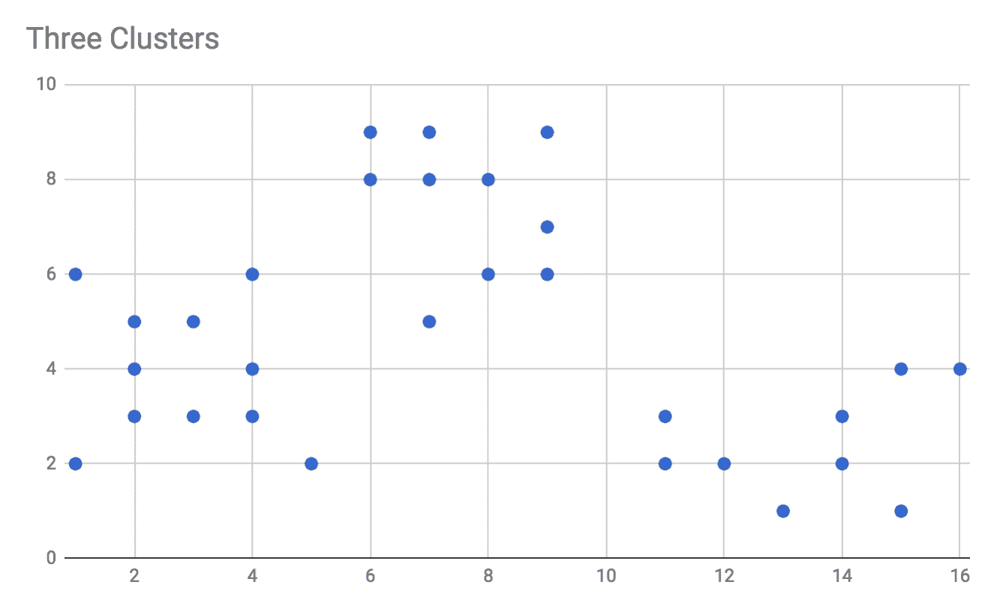
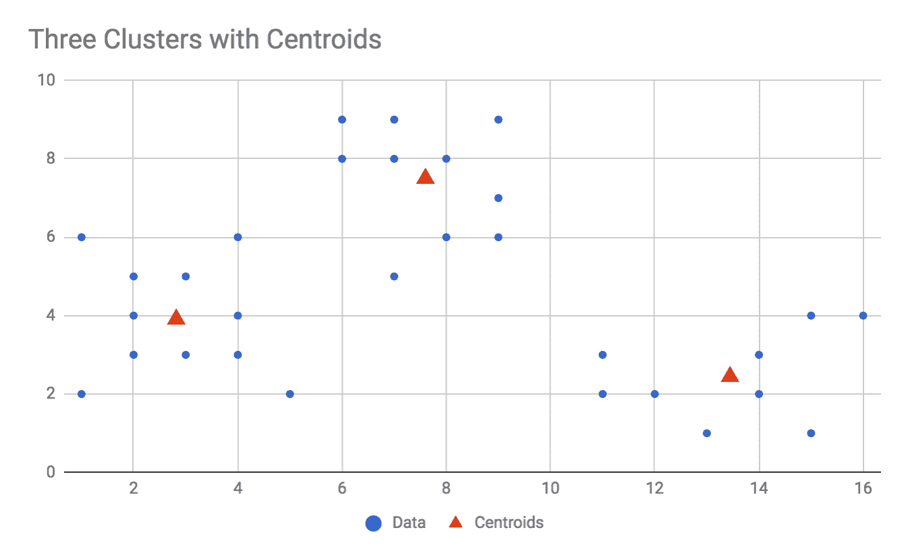
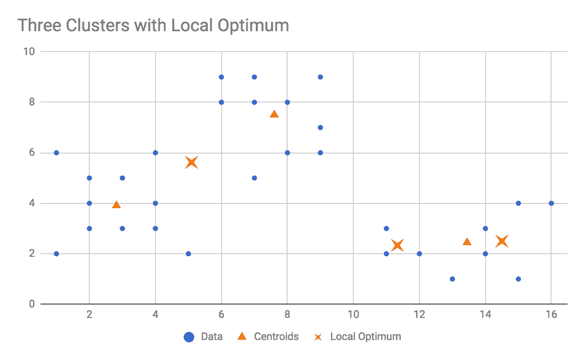
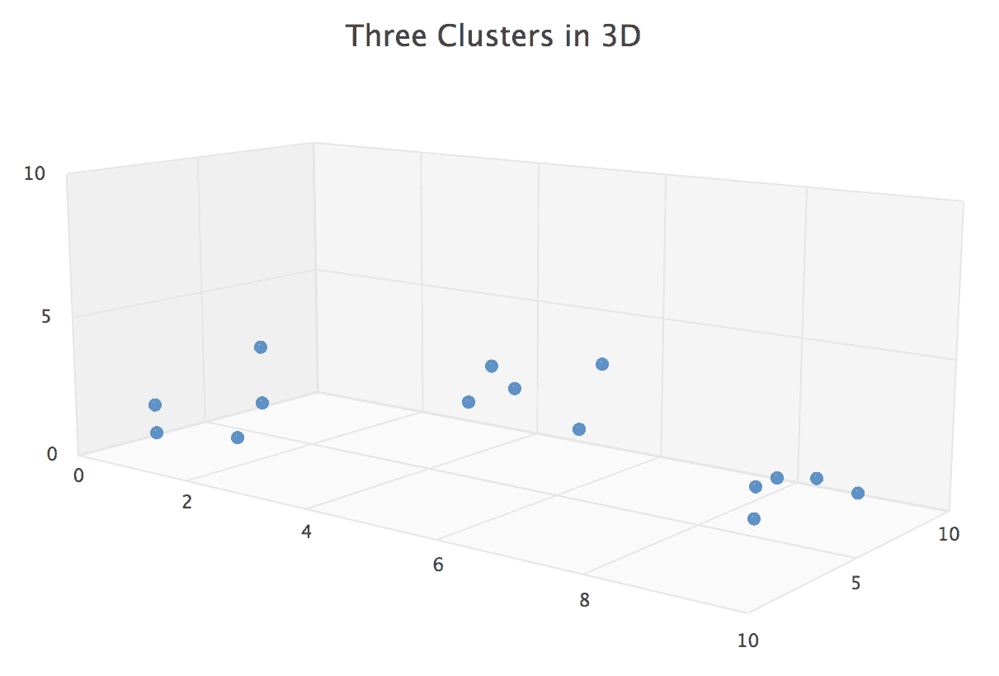
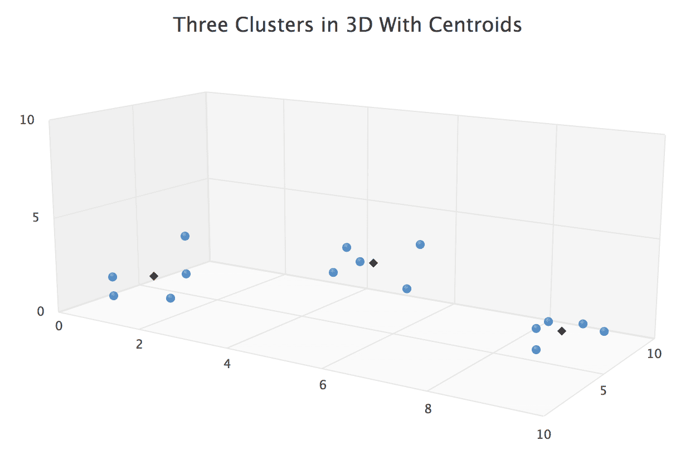
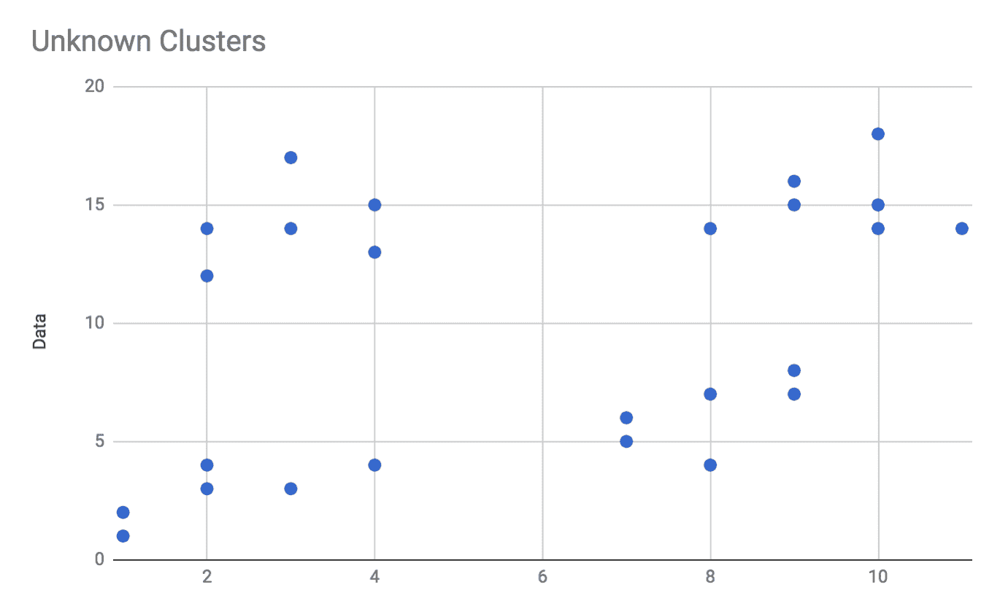
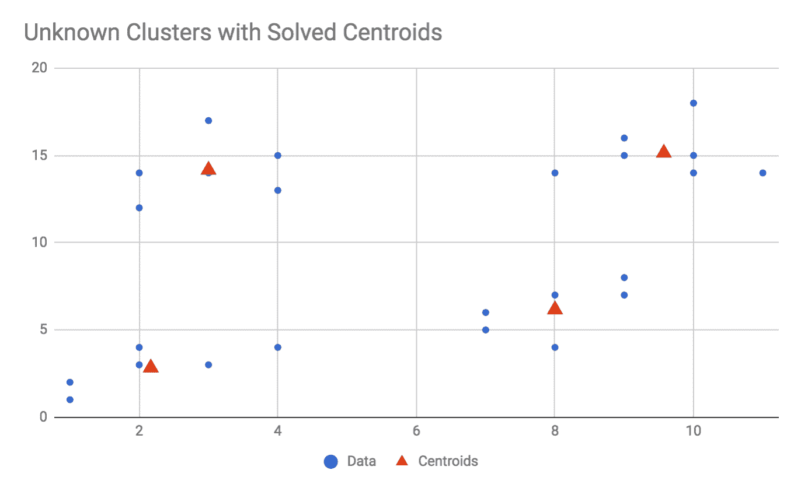
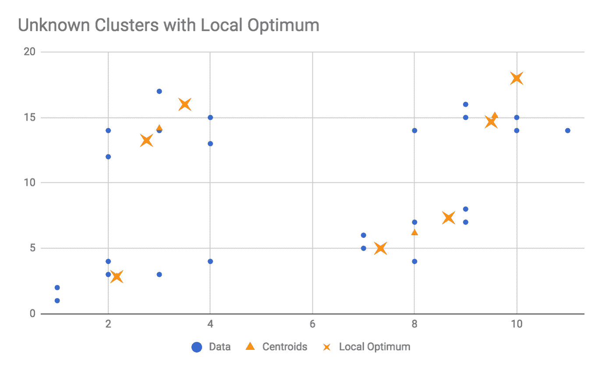

# 使用聚类算法进行分组

一个常见且入门级的无监督学习问题是 *聚类*。通常，你拥有大量数据集，希望将其组织成更小的组，或者希望将其分解成逻辑上相似的组。例如，你可以尝试将家庭收入普查数据分为三个组：低收入、高收入和超级富豪。如果你将家庭收入数据输入到聚类算法中，你预计会看到三个数据点作为结果，每个数据点对应于你三个类别的平均值。即使这个一维的聚类家庭收入问题也可能很难手工完成，因为你可能不知道一个组应该在哪里结束，另一个组应该在哪里开始。你可以使用政府关于收入分组的定义，但没有保证这些分组在几何上是平衡的；它们是由政策制定者发明的，可能无法准确代表数据。

*簇* 是一组逻辑上相似的数据点。它们可以是具有相似行为的用户、具有相似收入范围的公民、具有相似颜色的像素等等。k-means 算法是数值和几何的，因此它所识别的簇都将具有数值上的相似性，并且数据点在几何上彼此接近。幸运的是，大多数数据都可以用数值表示，因此 k-means 算法适用于许多不同的问题领域。

k-means 算法是一种强大、快速且流行的数值数据聚类算法。名称 k-means 由两部分组成：***k***，它代表我们希望算法找到的簇的数量，和***means***，这是确定那些簇中心位置的方法（例如，你也可以使用 k-medians 或 k-modes）。用简单的英语来说，我们可能会要求算法为我们找到三个簇中心，这些中心是它们所代表点的平均值。在这种情况下，*k = 3*，我们可以在提交报告时告诉我们的老板我们进行了 *k = 3* 的 k-means 分析。

K-means 算法是一个迭代算法，这意味着它会运行一个循环，并不断更新其模型，直到模型达到稳定状态，此时它将返回其结果。用叙述形式来说，k-means 算法的工作方式是这样的：绘制你想要分析的数据，并选择一个*k*的值。你事先必须知道*k*的值，或者至少有一个大概的估计（尽管我们也会在后面的章节中探讨一种绕过这个问题的方法）。随机创建*k*个点（如果*k*等于 5，就创建五个点），并将它们添加到你的图表中；这些点被称为**质心**，因为它们最终将代表簇的几何中心。对于图表中的每个数据点，找到离该点最近的质心，并将其连接或分配给该点。一旦所有分配都已完成，依次查看每个质心，并将其位置更新为分配给它的所有点的平均值。重复分配然后更新的过程，直到质心停止移动；这些质心的最终位置是算法的输出，可以被认为是你的簇中心。如果叙述难以理解，不要担心，随着我们从零开始构建这个算法，我们会更深入地探讨它。

在本章中，我们首先将讨论平均值和距离的概念以及它们如何应用于 k-means 算法。然后我们将描述算法本身，并从头开始构建一个 JavaScript 类来实现 k-means 算法。我们将用几个简单的数据集测试我们的 k-means 求解器，然后讨论在事先不知道*k*的值时应该做什么。我们将构建另一个工具来自动发现*k*的值。我们还将讨论对于 k-means 应用来说，*错误*的概念意味着什么，以及如何设计一个帮助实现我们目标的错误算法。以下是在本章中将要涉及的主题：

+   平均值和距离

+   编写 k-means 算法

+   示例 1—简单 2D 数据上的 k-means

+   示例 2—3D 数据

+   当*k*未知时的 K-means

# 平均值和距离

k-means 算法依赖于两个概念来运行：平均值和距离。为了告诉你簇的中心在哪里，算法将计算这些点的平均值。在这种情况下，我们将使用算术平均值，即值的总和除以值的数量，来表示我们的平均值。在 ES5/经典 JavaScript（我还在这个例子中有意地明确指出，对于不熟悉计算平均值的读者），我们可能会编写一个像这样的函数：

```py
/**
 * @param {Array.<number>} numbers
 * @return {float}
 */
function mean(numbers) {
    var sum = 0, length = numbers.length;

    if (length === 0) {
        /**
         * Mathematically, the mean of an empty set is undefined,
         * so we could return early here. We could also allow the function
         * to attempt dividing 0/0, would would return NaN in JavaScript but
         * fail in some other languages (so probably a bad habit to encourage).
         * Ultimately, I would like this function to not return mixed types,
         * so instead let's throw an error.
         */
        throw new Error('Cannot calculate mean of empty set');
    }

    for (var i = 0; i < length; i++) {
        sum += numbers[i];
    }

    return sum / length;
}
```

在 ES6 中，我们可以滥用我们的简写特权，并编写以下代码：

```py
const mean = numbers => numbers.reduce((sum, val) => sum + val, 0) / numbers.length;
```

这是一个可以随时放在口袋里的 ES6 单行代码，然而，它假设所有值都已经数字化和定义好了，如果你给它一个空数组，它将返回 NaN。如果这个简写让人困惑，我们可以这样拆分它：

```py
const sum = (numbers) => numbers.reduce((sum, val) => sum + val, 0);
const mean = (numbers) => sum(numbers) / numbers.length;
```

请记住，我们可以使用任何类型的平均值，包括中位数和众数。事实上，有时使用 k-medians 而不是 k-means 更可取。中位数在抑制异常值方面比平均值做得更好。因此，你应该始终问自己你实际上需要哪种平均值。例如，如果你想表示总资源消耗，你可能使用算术平均值。如果你怀疑异常值是由错误的测量引起的并且应该被忽略，k-medians 可能更适合你。

在此算法中，我们还需要一个距离的概念。它可以采用任何距离度量，然而，对于数值数据，你将主要使用典型的欧几里得距离——你在高中学习过的标准距离度量，在 ES5 JavaScript 中，对于二维数据如下所示：

```py
/**
 * Calculates only the 2-dimensional distance between two points a and b.
 * Each point should be an array with length = 2, and both elements defined and numeric.
 * @param {Array.number} a
 * @param {Array.number} b
 * @return {float}
 */
function distance2d(a, b) {
    // Difference between b[0] and a[0]
    var diff_0 = b[0] - a[0];
    // Difference between b[1] and a[1]
    var diff_1 = b[1] - a[1];

    return Math.sqrt(diff_0*diff_0 + diff_1*diff_1);
}
```

然而，我们必须支持超过两个维度的更多维度，因此可以推广如下：

```py
/**
 * Calculates the N-dimensional distance between two points a and b.
 * Each point should be an array with equal length, and all elements defined and numeric.
 * @param {Array.number} a
 * @param {Array.number} b
 * @return {float}
 */
function distance(a, b) {

    var length = a.length,
        sumOfSquares = 0;

    if (length !== b.length) {
        throw new Error('Points a and b must be the same length');
    }

    for (var i = 0; i < length; i++) {
        var diff = b[i] - a[i];
        sumOfSquares += diff*diff;
    }

    return Math.sqrt(sumOfSquares);
}
```

我们可以为此编写一个 ES6 单行代码，但它不会像较长的、明确的示例那样易于阅读：

```py
const distance = (a, b) => Math.sqrt(
    a.map((aPoint, i) => b[i] - aPoint)
     .reduce((sumOfSquares, diff) => sumOfSquares + (diff*diff), 0)
);
```

带着这些工具，我们可以开始编写 k-means 算法本身。

# 编写 k-means 算法

K-means 算法相对简单易实现，因此在本章中我们将从头开始编写它。该算法只需要两条信息：k-means 中的*k*（我们希望识别的聚类数量），以及要评估的数据点。算法还可以使用一些额外的参数，例如允许的最大迭代次数，但这些不是必需的。算法的唯一必需输出是*k*个质心，或者表示数据点聚类中心的点列表。如果*k*等于 3，则算法必须返回三个质心作为其输出。算法还可以返回其他指标，例如总误差、达到稳态所需的总迭代次数等，但这些是可选的。

K-means 算法的高级描述如下：

1.  给定参数*k*和要处理的数据，随机初始化*k*个候选质心

1.  对于每个数据点，确定哪个候选质心与该点最近，并将该点*分配*给该质心

1.  对于每个质心，将其位置更新为其分配给的所有点的平均位置

1.  重复*步骤 2*和*步骤 3*，直到质心的位置达到稳态（即，质心停止移动）

在此过程结束时，你可以返回质心的位置作为算法的输出。

# 设置环境

让我们花点时间来设置这个算法的开发环境。环境将如第一章中所述，*探索 JavaScript 的潜力*，然而，我们将在这里完整地走一遍整个过程。

首先，为该项目创建一个新的文件夹。我已将该文件夹命名为`Ch4-kmeans`。在`Ch4-kmeans`内部创建一个名为`src`的子文件夹。

接下来，将一个名为`package.json`的文件添加到`Ch4-kmeans`文件夹中。将该文件的内容添加如下：

```py
{
  "name": "Ch4-kmeans",
  "version": "1.0.0",
  "description": "ML in JS Example for Chapter 4 - kmeans",
  "main": "src/index.js",
  "author": "Burak Kanber",
  "license": "MIT",
  "scripts": {
    "build-web": "browserify src/index.js -o dist/index.js -t [ babelify --presets [ env ] ]",
    "build-cli": "browserify src/index.js --node -o dist/index.js -t [ babelify --presets [ env ] ]",
    "start": "yarn build-cli && node dist/index.js"
  },
  "dependencies": {
    "babel-core": "⁶.26.0",
    "babel-preset-env": "¹.6.1",
    "babelify": "⁸.0.0",
    "browserify": "¹⁵.1.0"
  }
}
```

在创建`package.json`文件后，切换到您的终端程序，并在`Ch4-kmeans`文件夹中运行`yarn install`命令。

接下来，在`Ch4-kmeans/src`文件夹内创建三个新文件：`index.js`、`data.js`和`kmeans.js`。我们将在`kmeans.js`中编写实际的 k-means 算法，将一些示例数据加载到`data.js`中，并使用`index.js`作为我们的启动点来设置和运行多个示例。

在这一点上，您可能想要停下来测试一切是否正常工作。在`index.js`中添加一个简单的`console.log("Hello");`，然后从命令行运行`yarn start`命令。您应该看到文件编译并运行，在退出前将`Hello`打印到屏幕上。如果您遇到错误或看不到`Hello`，您可能需要退一步并仔细检查您的环境。如果一切正常，您可以删除`index.js`中的`console.log("Hello");`。

# 初始化算法

在本节中，我们将工作在`kmeans.js`文件中。首先要做的事情是将我们的均值和距离函数添加到文件顶部。由于这些是通用的函数，可以**统计地**调用，我们不会在类内部定义它们。将以下内容添加到文件顶部：

```py
/**
 * Calculate the mean of an array of numbers.
 * @param {Array.<number>} numbers
 * @return {number}
 */
const mean = numbers => numbers.reduce((sum, val) => sum + val, 0) / numbers.length;

/**
 * Calculate the distance between two points.
 * Points must be given as arrays or objects with equivalent keys.
 * @param {Array.<number>} a
 * @param {Array.<number>} b
 * @return {number}
 */
const distance = (a, b) => Math.sqrt(
    a.map((aPoint, i) => b[i] - aPoint)
     .reduce((sumOfSquares, diff) => sumOfSquares + (diff*diff), 0)
);
```

接下来，在`kmeans.js`文件中添加并导出`KMeans`类。我们将在本章的其余部分添加更多方法，但让我们从以下内容开始。将以下内容添加到您刚刚添加的代码下方：

```py
class KMeans {

    /**
     * @param k
     * @param data
     */
    constructor(k, data) {
        this.k = k;
        this.data = data;
        this.reset();
    }

    /**
     * Resets the solver state; use this if you wish to run the
     * same solver instance again with the same data points
     * but different initial conditions.
     */
    reset() {
        this.error = null;
        this.iterations = 0;
        this.iterationLogs = [];
        this.centroids = this.initRandomCentroids();
        this.centroidAssignments = [];
    }

}

export default KMeans;
```

我们创建了一个名为`KMeans`的类，并将其作为此文件的默认导出。前面的代码还初始化了类将需要的某些实例变量，我们将在稍后描述。

类的构造函数接受两个参数，`k`和`data`，并将它们都存储为实例变量。`k`参数代表 k-means 中的`k`，或者算法输出中期望的簇数量。`data`参数是算法将处理的数据点的数组。

在构造函数的末尾，我们调用`reset()`方法，该方法用于初始化（或重置）求解器的状态。具体来说，我们在`reset`方法中初始化的实例变量包括：

+   `iterations`，它是一个简单的计数器，记录求解器已运行的迭代次数，从 0 开始

+   `error`，它记录了当前迭代中点到其质心的**均方根误差**（**RMSE**）

+   `centroidAssignments`，它是一个数据点索引数组，映射到一个质心索引

+   `centroids`，它将存储求解器在当前迭代中候选的`k`个质心

注意，在 `reset` 方法中，我们调用了 `this.initRandomCentroids()`，这是我们尚未定义的。k-means 算法必须从一个候选质心集合开始，所以那个方法的目的就是随机生成正确数量的质心。因为算法从一个随机状态开始，可以预期多次运行算法将基于初始条件返回不同的结果。这实际上是 k-means 算法的一个期望属性，因为它容易陷入局部最优，多次运行算法使用不同的初始条件可能有助于找到全局最优。

在我们生成随机质心之前，我们必须满足一些先决条件。首先，我们必须知道数据的维度。我们是在处理 2D 数据、3D 数据、10D 数据还是 1324D 数据？我们生成的随机质心必须与数据点的其他维度数量相同。这是一个容易解决的问题；我们假设所有数据点都有相同的维度，所以我们只需检查我们遇到的第一个数据点。将以下方法添加到 `KMeans` 类中：

```py
/**
 * Determines the number of dimensions in the dataset.
 * @return {number}
 */
getDimensionality() {
    const point = this.data[0];
    return point.length;
}
```

在生成随机初始质心时，我们必须考虑的其他因素是质心应该接近我们正在处理的数据。例如，如果你的所有数据点都在 (0, 0) 和 (10, 10) 之间，你不会希望生成一个像 (1200, 740) 这样的随机质心。同样，如果你的数据点都是负数，你不会希望生成正的质心，等等。

我们为什么要关心随机质心的起始位置呢？在这个算法中，点会被分配到最近的质心，并逐渐 *拉* 质心向簇中心移动。如果所有质心都在数据点的右侧，那么质心本身也会遵循类似的路径向数据移动，并可能全部聚集在一个单独的簇中，收敛到局部最优。通过确保质心在数据范围内部随机分布，我们更有可能避免这种类型的局部最优。

我们生成质心起始位置的方法将是确定数据的每个维度的范围，然后在那些范围内为质心的位置选择随机值。例如，想象在 *x, **y* 平面上的三个二维数据点：(1, 3)，(5, 8) 和 (3, 0)。*x* 维度的范围在 1 和 5 之间，而 *y* 维度的范围在 0 和 8 之间。因此，当创建随机初始化的质心时，我们将为其 *x* 位置选择一个介于 1 和 5 之间的随机数，为其 *y* 位置选择一个介于 0 和 8 之间的随机数。

我们可以使用 JavaScript 的 `Math.min` 和 `Math.max` 来确定每个维度的数据范围。将以下方法添加到 `KMeans` 类中：

```py

/**
 * For a given dimension in the dataset, determine the minimum
 * and maximum value. This is used during random initialization
 * to make sure the random centroids are in the same range as
 * the data.
 *
 * @param n
 * @returns {{min: *, max: *}}
 */
getRangeForDimension(n) {
    const values = this.data.map(point => point[n]);
    return {
        min: Math.min.apply(null, values),
        max: Math.max.apply(null, values)
    };
}
```

此方法首先收集数据点中给定维度的所有值作为数组，然后返回一个包含该范围 `min` 和 `max` 的对象。回到我们前面三个数据点（（1，3），（5，8）和（3，0））的示例，调用 `getRangeForDimension(0)` 将返回 `{min: 1, max: 5}`，而调用 `getRangeForDimension(1)` 将返回 `{min: 0, max: 8}`。

对于我们来说，有一个包含所有维度及其范围的缓存对象将很有用，我们可以在初始化质心时使用它，所以也将以下方法添加到 `KMeans` 类中：

```py
/**
 * Get ranges for all dimensions.
 * @see getRangeForDimension
 * @returns {Array} Array whose indices are the dimension number and whose members are the output of getRangeForDimension
 */
getAllDimensionRanges() {
    const dimensionRanges = [];
    const dimensionality = this.getDimensionality();

    for (let dimension = 0; dimension < dimensionality; dimension++) {
        dimensionRanges[dimension] = this.getRangeForDimension(dimension);
    }

    return dimensionRanges;

}
```

此方法简单地查看所有维度，并为每个维度返回 `min` 和 `max` 范围，结构为一个按维度索引的数组中的对象。此方法主要是为了方便，但我们很快就会使用它。

我们最终可以生成随机初始化的质心。我们需要创建 *k* 个质心，并且逐个维度地选择每个维度范围内的随机点。将以下方法添加到 `KMeans` 类中：

```py

/**
 * Initializes random centroids, using the ranges of the data
 * to set minimum and maximum bounds for the centroids.
 * You may inspect the output of this method if you need to debug
 * random initialization, otherwise this is an internal method.
 * @see getAllDimensionRanges
 * @see getRangeForDimension
 * @returns {Array}
 */
initRandomCentroids() {

    const dimensionality = this.getDimensionality();
    const dimensionRanges = this.getAllDimensionRanges();
    const centroids = [];

    // We must create 'k' centroids.
    for (let i = 0; i < this.k; i++) {

        // Since each dimension has its own range, create a placeholder at first
        let point = [];

        /**
         * For each dimension in the data find the min/max range of that dimension,
         * and choose a random value that lies within that range. 
         */
        for (let dimension = 0; dimension < dimensionality; dimension++) {
            const {min, max} = dimensionRanges[dimension];
            point[dimension] = min + (Math.random()*(max-min));
        }

        centroids.push(point);

    }

    return centroids;

}
```

前面的算法包含两个循环；外循环创建 `k` 个候选质心。由于数据集的维度数量是任意的，并且每个维度本身也有一个任意的范围，因此我们必须逐个维度地工作，为每个质心生成随机位置。如果你的数据是三维的，内循环将分别考虑维度 0、1 和 2，确定每个维度的 `min` 和 `max` 值，在该范围内选择一个随机值，并将该值分配给质心点的特定维度。

# 测试随机质心生成

我们已经编写了大量的代码，所以现在是停止并测试我们工作的好时机。我们还应该开始设置我们的 `data.js` 文件，我们将使用它来存储一些示例数据。

打开 `data.js` 文件并添加以下内容：

```py
const example_randomCentroids = [
    [1, 3], [5, 8], [3, 0]
];

export default {
    example_randomCentroids
};
```

使用的值与前面块中编写的简单数据点示例中的值相同。

现在，切换到 `index.js` 并添加以下代码：

```py
import KMeans from './kmeans.js';
import example_data from './data.js';

console.log("\nML in JS Chapter 4 k-means clustering examples.");
console.log("===============================================\n");

console.log("Testing centroid generation:");
console.log("===============================================\n");

const ex_randomCentroids_solver = new KMeans(2, example_data.example_randomCentroids);

console.log("Randomly initialized centroids: ");
console.log(ex_randomCentroids_solver.centroids);
console.log("\n-----------------------------------------------\n\n");
```

首先，我们从各自的文件中导入 `KMeans` 类和 `example_data` 对象。我们在屏幕上打印一些有用的输出，然后为我们的简单数据初始化一个 `KMeans` 求解器实例。我们可以通过检查 `ex_randomCentroids_solver.centroids` 的值来检查随机初始化的质心。

添加此代码后，从命令行运行 `yarn start`，你应该会看到以下类似输出。请注意，由于质心初始化是随机的，你将不会看到与我相同的值；然而，我们想要确保随机质心位于正确的范围内。具体来说，我们希望我们的质心在 1 和 5 之间有 *x* 位置，在 0 和 8 之间有 *y* 位置。多次运行代码以确保质心有正确的位置：

```py
$ yarn start
yarn run v1.3.2
$ yarn build-cli && node dist/index.js
$ browserify src/index.js --node -o dist/index.js -t [ babelify --presets [ env ] ]

 ML in JS Chapter 4 k-means clustering examples.
 ===============================================

 Testing centroid generation:
 ===============================================

 Randomly initialized centroids:
 [ [ 4.038663181817283, 7.765675509733137 ],
 [ 1.976405159755187, 0.026837564634993427 ] ]
```

如果你看到与前面块类似的内容，这意味着到目前为止一切正常，我们可以继续实现算法。

# 将点分配到质心

k-means 算法执行的迭代循环包含两个步骤：将每个点分配到最近的质心，然后更新质心的位置，使其成为分配给该质心的所有点的平均值。在本节中，我们将实现算法的第一部分：将点分配到质心。

从高层次来看，我们的任务是考虑数据集中的每个点，并确定哪个质心离它最近。我们还需要记录此分配的结果，以便我们可以稍后根据分配给它的点更新质心的位置。

将以下方法添加到`KMeans`类的主体中：

```py
/**
 * Given a point in the data to consider, determine the closest
 * centroid and assign the point to that centroid.
 * The return value of this method is a boolean which represents
 * whether the point's centroid assignment has changed;
 * this is used to determine the termination condition for the algorithm.
 * @param pointIndex
 * @returns {boolean} Did the point change its assignment?
 */
assignPointToCentroid(pointIndex) {

    const lastAssignedCentroid = this.centroidAssignments[pointIndex];
    const point = this.data[pointIndex];
    let minDistance = null;
    let assignedCentroid = null;

    for (let i = 0; i < this.centroids.length; i++) {
        const centroid = this.centroids[i];
        const distanceToCentroid = distance(point, centroid);

        if (minDistance === null || distanceToCentroid < minDistance) {
            minDistance = distanceToCentroid;
            assignedCentroid = i;
        }

    }

    this.centroidAssignments[pointIndex] = assignedCentroid;

    return lastAssignedCentroid !== assignedCentroid;

}
```

此方法考虑单个数据点，由其索引给出，并依次考虑系统中的每个质心。我们还跟踪此点最后分配到的质心，以确定分配是否已更改。

在前面的代码中，我们遍历所有质心并使用我们的`distance`函数来确定点与质心之间的距离。如果距离小于迄今为止看到的最低距离，或者这是我们为该点考虑的第一个质心（在这种情况下`minDistance`将为 null），我们将记录距离和质心的索引位置。遍历所有质心后，我们现在将知道哪个质心是考虑中的点最近的。

最后，我们通过将质心分配给点的索引设置到`this.centroidAssignments`数组中来记录质心分配——在这个数组中，索引是点的索引，值是质心的索引。我们通过比较最后已知的质心分配和新质心分配来从这个方法返回一个布尔值——如果分配已更改，则返回`true`，如果没有更改，则返回`false`。我们将使用这个信息来确定算法何时达到稳态。

之前的方法只考虑单个点，因此我们还应该编写一个方法来处理所有点的质心分配。此外，我们编写的方法还应确定是否有任何点更新了其质心分配。将以下内容添加到`KMeans`类中：

```py
/**
 * For all points in the data, call assignPointsToCentroids
 * and returns whether _any_ point's centroid assignment has
 * been updated.
 *
 * @see assignPointToCentroid
 * @returns {boolean} Was any point's centroid assignment updated?
 */
assignPointsToCentroids() {
    let didAnyPointsGetReassigned = false;
    for (let i = 0; i < this.data.length; i++) {
        const wasReassigned = this.assignPointToCentroid(i);
        if (wasReassigned) didAnyPointsGetReassigned = true;
    }
    return didAnyPointsGetReassigned;
}
```

此方法定义了一个名为`didAnyPointsGetReassigned`的变量，并将其初始化为`false`，然后遍历数据集中的所有点以更新它们的质心分配。如果有任何点被分配到新的质心，该方法将返回`true`。如果没有分配更改，该方法返回`false`。此方法的返回值将成为我们的终止条件之一；如果在迭代后没有点更新，我们可以认为算法已达到稳态，可以终止它。

现在我们来讨论 k-means 算法的第二部分：更新质心位置。

# 更新质心位置

在上一节中，我们实现了 k-means 算法的第一部分：查看数据集中的所有点并将它们分配到地理位置上最近的质心。算法的下一步是查看所有质心并更新它们的地理位置到分配给它们的所有点的平均值。

为了做一个类比，你可以想象每个点伸出手去抓住离它最近的质心。点给质心一个拉力，试图将其拉得更近。我们已经实现了算法的“伸出手去抓住”部分，现在我们将实现“拉质心更近”的部分。

从高层次来看，我们的任务是遍历所有质心，对于每个质心，确定分配给它的所有点的平均位置。然后我们将更新质心的位置到这个平均值。进一步分解，我们必须首先收集分配给质心的所有点，然后我们必须计算这些点的平均值，始终记住点可以有任意数量的维度。

让我们从收集分配给质心的所有点这个简单的任务开始。我们已经在 `this.centroidAssignments` 实例变量中有一个点索引到质心索引的映射。将以下代码添加到 `KMeans` 类的主体中：

```py
/**
 * Given a centroid to consider, returns an array
 * of all points assigned to that centroid.
 *
 * @param centroidIndex
 * @returns {Array}
 */
getPointsForCentroid(centroidIndex) {
    const points = [];
    for (let i = 0; i < this.data.length; i++) {
        const assignment = this.centroidAssignments[i];
        if (assignment === centroidIndex) {
            points.push(this.data[i]);
        }
    }
    return points;
}
```

上述方法是相当标准的：遍历所有数据点，查找该点的质心分配，如果它被分配到所讨论的质心，我们就将该点添加到输出数组中。

我们现在可以使用这个点列表来更新质心的位置。我们的目标是更新质心的位置，使其成为我们之前找到的所有点的平均值。因为数据可能是多维的，我们必须独立考虑每个维度。

使用我们简单的点示例（1, 3）、（5, 8）和（3, 0），我们会找到一个平均位置为（3, 3.6667）。为了得到这个值，我们首先计算 x 维度的平均值（（1 + 5 + 3）/ 3 = 3），然后计算 y 维度的平均值（（3 + 8 + 0）/ 3 = 11/3 = 3.6666...）。如果我们工作在超过两个维度的情况下，我们只需对每个维度重复此过程。

我们可以用 JavaScript 编写这个算法。将以下代码添加到 `KMeans` 类的主体中：

```py
/**
 * Given a centroid to consider, update its location to
 * the mean value of the positions of points assigned to it.
 * @see getPointsForCentroid
 * @param centroidIndex
 * @returns {Array}
 */
updateCentroidLocation(centroidIndex) {
    const thisCentroidPoints = this.getPointsForCentroid(centroidIndex);
    const dimensionality = this.getDimensionality();
    const newCentroid = [];
    for (let dimension = 0; dimension < dimensionality; dimension++) {
        newCentroid[dimension] = mean(thisCentroidPoints.map(point => point[dimension]));
    }
    this.centroids[centroidIndex] = newCentroid;
    return newCentroid;
}
```

上述方法只考虑一个质心，由其索引指定。我们使用刚刚添加的 `getPointsForCentroid` 方法来获取分配给该质心的点数组。我们初始化一个名为 `newCentroid` 的变量为空数组；这最终将替换当前的质心。

考虑一次一个维度，我们只收集该维度的点位置，然后计算平均值。我们使用 JavaScript 的 `Array.map` 方法来提取正确维度的位置，然后使用我们的 `mean` 函数来计算该维度的平均位置。

如果我们手动使用数据点（1, 3）、（5, 8）和（3, 0）来工作，我们首先检查维度 0，即*x*维度。`thisCentroidPoints.map(point => point[dimension])`的结果是维度 0 的数组`[1, 5, 3]`，对于维度 1，结果是`[3, 8, 0]`。这些数组中的每一个都传递给`mean`函数，并且该维度的`newCentroid`使用平均值。

在此方法结束时，我们使用新计算出的质心位置更新我们的`this.centroids`数组。

我们还将编写一个便利方法来遍历所有质心并更新它们的位置。将以下代码添加到`KMeans`类的主体中：

```py
/**
 * For all centroids, call updateCentroidLocation
 */
updateCentroidLocations() {
    for (let i = 0; i < this.centroids.length; i++) {
        this.updateCentroidLocation(i);
    }
}
```

在完成算法并将所有部分连接起来之前，我们还有一个最终的前提条件需要满足。我们将把*误差*的概念引入算法中。计算误差对于 k-means 算法的功能不是必需的，但你会看到，在某些情况下这可能会带来优势。

因为这是一个无监督学习算法，我们的误差概念与语义错误无关。相反，我们将使用一个误差度量，它表示所有点与其分配的质心之间的平均距离。我们将使用 RMSE 来做到这一点，它对更大的距离进行更严厉的惩罚，因此我们的误差度量将很好地指示聚类的紧密程度。

为了执行这个误差计算，我们遍历所有点并确定该点与其质心的距离。在将每个距离加到运行总和中之前，我们将其平方（在均方根中称为*平方*），然后除以点的数量（在均方根中称为*平均*），最后取整个数的平方根（在均方根中称为*根*）。

将以下代码添加到`KMeans`类的主体中：

```py
/**
 * Calculates the total "error" for the current state
 * of centroid positions and assignments.
 * Here, error is defined as the root-mean-squared distance
 * of all points to their centroids.
 * @returns {Number}
 */
calculateError() {

    let sumDistanceSquared = 0;
    for (let i = 0; i < this.data.length; i++) {
        const centroidIndex = this.centroidAssignments[i];
        const centroid = this.centroids[centroidIndex];
        const point = this.data[i];
        const thisDistance = distance(point, centroid);
        sumDistanceSquared += thisDistance*thisDistance;
    }

    this.error = Math.sqrt(sumDistanceSquared / this.data.length);
    return this.error;
}
```

现在我们已经准备好将所有东西连接起来并实现算法的主循环。

# 主循环

k-means 算法的所有支持和基础逻辑现在都已实现。最后要做的就是将它们全部连接起来并实现算法的主循环。要运行算法，我们应该重复将点分配给质心和更新质心位置的过程，直到质心停止移动。我们还可以执行可选步骤，例如计算误差并确保算法不超过某些最大允许的迭代次数。

将以下代码添加到`KMeans`类的主体中：

```py
/**
 * Run the k-means algorithm until either the solver reaches steady-state,
 * or the maxIterations allowed has been exceeded.
 *
 * The return value from this method is an object with properties:
 * {
 *  centroids {Array.<Object>},
 *  iteration {number},
 *  error {number},
 *  didReachSteadyState {Boolean}
 * }
 *
 * You are most likely interested in the centroids property of the output.
 *
 * @param {Number} maxIterations Default 1000
 * @returns {Object}
 */
solve(maxIterations = 1000) {

    while (this.iterations < maxIterations) {

        const didAssignmentsChange = this.assignPointsToCentroids();
        this.updateCentroidLocations();
        this.calculateError();

        this.iterationLogs[this.iterations] = {
            centroids: [...this.centroids],
            iteration: this.iterations,
            error: this.error,
            didReachSteadyState: !didAssignmentsChange
        };

        if (didAssignmentsChange === false) {
            break;
        }

        this.iterations++;

    }

    return this.iterationLogs[this.iterationLogs.length - 1];

}
```

我们编写了一个`solve`方法，它还接受允许的最大迭代次数的限制，我们将其默认设置为`1000`。我们在`while`循环中运行算法，并在循环的每次迭代中调用`assignPointsToCentroids`（记录其输出值，`didAssignmentsChange`），调用`updateCentroidLocations`，并调用`calculateError`。

为了帮助调试并维护算法所完成工作的历史记录，我们维护一个`this.iterationLogs`数组，并在每次迭代中记录质心位置、迭代次数、计算误差以及算法是否达到稳态（这是`didAssignmentsChange`的反面）。我们在记录日志时使用 ES6 的数组扩展运算符对`this.centroids`进行操作，以避免将此数组作为引用传递，否则迭代日志将显示质心的最后状态而不是其随时间的变化过程。

如果点/质心分配在连续的迭代中不发生变化，我们认为算法已经达到稳态，可以返回结果。我们通过使用`break`关键字提前退出`while`循环来实现这一点。如果算法从未达到稳态，`while`循环将继续执行，直到达到允许的最大迭代次数，并返回最新的可用结果。`solve`方法的输出仅仅是最近的迭代日志，其中包含了此类用户需要了解的所有信息。

# 示例 1 - 对简单 2D 数据的 k-means 算法

我们已经编写并编码了 k-means 算法的实现，所以现在是时候看看它是如何工作的了。在我们的第一个例子中，我们将运行我们的算法针对一个简单的二维数据集。数据本身将被设计得算法可以轻松找到三个不同的簇。

首先，修改`data.js`文件，在`export default`行之前添加以下数据：

```py
const example_2d3k = [
    [1, 2], [2, 3], [2, 5], [1, 6], [4, 6],
    [3, 5], [2, 4], [4, 3], [5, 2], [6, 9],
    [4, 4], [3, 3], [8, 6], [7, 5], [9, 6],
    [9, 7], [8, 8], [7, 9], [11, 3], [11, 2],
    [9, 9], [7, 8], [6, 8], [12, 2], [14, 3],
    [15, 1], [15, 4], [14, 2], [13, 1], [16, 4]
];
```

然后，更新最终的导出行，使其看起来像这样：

```py
export default {
    example_randomCentroids,
    example_2d3k
};
```

如果我们要绘制前面的数据点，我们会看到以下内容：



从视觉上看，我们可以看到有三个整齐聚集的数据点组。当我们运行算法时，我们将使用*k = 3*，并期望质心能够整齐地定位到这三个簇的中心。让我们试试看。

打开`index.js`并添加以下内容。你可以替换你之前添加的代码（保留`import`语句），或者简单地添加到下面：

```py
console.log("Solving example: 2d data with 3 clusters:");
console.log("===============================================\n");

console.log("Solution for 2d data with 3 clusters:");
console.log("-------------------------------------");
const ex_1_solver = new KMeans(3, example_data.example_2d3k);
const ex_1_centroids = ex_1_solver.solve();
console.log(ex_1_centroids);
console.log("");
```

在输出一些标题后，我们创建了一个新的名为`ex_1_solver`的`KMeans`实例，并用 k = 3 和刚刚添加的`example_data.example_2d3k`初始化它。我们调用`solve`方法，不带任何参数（即，最大允许的迭代次数将是 1,000），并将输出捕获在变量`ex_1_centroids`中。最后，我们将结果打印到屏幕上并添加换行符——我们将在这一点之后添加更多的测试和示例。

注意，你的质心顺序可能与我不同，因为随机初始条件会有所不同。

你现在可以运行`yarn start`，应该会看到类似的输出。此外，由于随机初始化，解算器的某些运行可能会陷入局部最优，你将看到不同的质心。连续运行程序几次，看看会发生什么。以下是我的输出：

```py
Solving example: 2d data with 3 clusters:
==========================================================

Solution for 2d data with 3 clusters:
---------------------------------------------------------
 { centroids:
 [ [ 2.8181818181818183, 3.909090909090909 ],
 [ 13.444444444444445, 2.4444444444444446 ],
 [ 7.6, 7.5 ] ],
 iteration: 1,
 error: 1.878739816915397,
 didReachSteadyState: true }
```

程序的输出告诉我们，算法在仅经过两次迭代后（迭代 1 是第二次迭代，因为我们从零开始计数），并且我们的质心位于（2.8，3.9），（13.4，2.4），和（7.6，7.5）。

让我们绘制这些质心与原始数据，看看它看起来像什么：



如您所见，k-means 已经出色地完成了其工作，报告的质心正好在我们预期的位置。

让我们深入了解一下这个算法在解决方案之后做了什么，通过打印`iterationLogs`。将以下代码添加到`index.js`的底部：

```py
console.log("Iteration log for 2d data with 3 clusters:");
console.log("------------------------------------------");
ex_1_solver.iterationLogs.forEach(log => console.log(log));
console.log("");
```

再次运行`yarn start`，你应该会看到以下输出。像往常一样，根据初始条件，你的版本可能需要比我的更多或更少的迭代，所以你的输出会有所不同，但你应该会看到类似的东西：

```py
Solving example: 2d data with 3 clusters:
=====================================================================

 Solution for 2d data with 3 clusters:
 --------------------------------------------------------------------
 { centroids:
 [ [ 2.8181818181818183, 3.909090909090909 ],
 [ 13.444444444444445, 2.4444444444444446 ],
 [ 7.6, 7.5 ] ],
 iteration: 4,
 error: 1.878739816915397,
 didReachSteadyState: true }

 Iteration log for 2d data with 3 clusters:
 ----------------------------------------------------------------------
 { centroids: [ [ 2.7, 3.7 ], [ 9, 4.125 ], [ 10.75, 5.833333333333333 ] ],
 iteration: 0,
 error: 3.6193538404281806,
 didReachSteadyState: false }
 { centroids:
 [ [ 2.8181818181818183, 3.909090909090909 ],
 [ 9.714285714285714, 3.857142857142857 ],
 [ 10.75, 5.833333333333333 ] ],
 iteration: 1,
 error: 3.4964164297074007,
 didReachSteadyState: false }
 { centroids: [ [ 3.0833333333333335, 4.25 ], [ 11.375, 2.75 ], [ 10, 6.7 ] ],
 iteration: 2,
 error: 3.19709069137691,
 didReachSteadyState: false }
 { centroids:
 [ [ 2.8181818181818183, 3.909090909090909 ],
 [ 13.444444444444445, 2.4444444444444446 ],
 [ 7.6, 7.5 ] ],
 iteration: 3,
 error: 1.878739816915397,
 didReachSteadyState: false }
 { centroids:
 [ [ 2.8181818181818183, 3.909090909090909 ],
 [ 13.444444444444445, 2.4444444444444446 ],
 [ 7.6, 7.5 ] ],
 iteration: 4,
 error: 1.878739816915397,
 didReachSteadyState: true }
```

如您所见，算法经过五次迭代才达到稳定状态，而之前只有两次。这是正常的，也是预期的，因为两次运行之间的随机初始条件不同。查看日志，您可以看到算法报告的错误随着时间的推移而下降。注意，第一个质心（2.8，3.9）在第一次迭代后到达其最终位置，而其他质心则需要更多时间才能赶上。这是因为第一个质心被随机初始化到一个非常接近其最终位置的位置，从（2.7，3.7）开始，到（2.8，3.9）结束。

虽然可能性不大，但在该数据集上捕捉到算法陷入局部最优是有可能的。让我们将以下代码添加到`index.js`的底部，以多次运行解算器，看看它是否会找到局部最优而不是全局最优：

```py
console.log("Test 2d data with 3 clusters five times:");
console.log("----------------------------------------");
for (let i = 0; i < 5; i++) {
    ex_1_solver.reset();
    const solution = ex_1_solver.solve();
    console.log(solution);
}
console.log("");
```

用`yarn start`运行几次，直到你看到意外结果。在我的情况下，我找到了以下解决方案（我省略了前面程序的其他输出）：

```py
Test 2d data with 3 clusters five times:
--------------------------------------------------------------
 { centroids:
 [ [ 13.444444444444445, 2.4444444444444446 ],
 [ 2.8181818181818183, 3.909090909090909 ],
 [ 7.6, 7.5 ] ],
 iteration: 2,
 error: 1.878739816915397,
 didReachSteadyState: true }
 { centroids:
 [ [ 2.8181818181818183, 3.909090909090909 ],
 [ 7.6, 7.5 ],
 [ 13.444444444444445, 2.4444444444444446 ] ],
 iteration: 1,
 error: 1.878739816915397,
 didReachSteadyState: true }
 { centroids:
 [ [ 7.6, 7.5 ],
 [ 13.444444444444445, 2.4444444444444446 ],
 [ 2.8181818181818183, 3.909090909090909 ] ],
 iteration: 3,
 error: 1.878739816915397,
 didReachSteadyState: true }
 { centroids:
 [ [ 11.333333333333334, 2.3333333333333335 ],
 [ 5.095238095238095, 5.619047619047619 ],
 [ 14.5, 2.5 ] ],
 iteration: 2,
 error: 3.0171467652692345,
 didReachSteadyState: true }
 { centroids:
 [ [ 7.6, 7.5 ],
 [ 2.8181818181818183, 3.909090909090909 ],
 [ 13.444444444444445, 2.4444444444444446 ] ],
 iteration: 2,
 error: 1.878739816915397,
 didReachSteadyState: true }
```

解算器的第四次运行得到了与其他运行不同的答案：它发现了（11.3，2.3），（5.1，5.6），（14.5，2.5）作为解决方案。因为其他解决方案比这个更常见，我们可以假设算法已经陷入了局部最优。让我们将这些值与剩余的数据进行比较，看看它看起来像什么：



在前面的图表中，我们的数据点用圆圈表示，我们预期的质心用三角形表示，而我们得到的不寻常的结果用**X**标记表示。查看图表，你可以理解算法是如何得出这个结论的。一个质心，位于（5.1，5.6）的**X**标记，捕捉了两个不同的簇，并且位于它们之间。其他两个质心将第三个簇分成了两部分。这是一个完美的局部最优解的例子：这是一个有意义的解决方案，它逻辑上聚类了数据点，但它并不是数据最佳可用的解决方案（全局最优解）。很可能是右边的两个质心都在该簇内部随机初始化，并且被困在那里。

这总是 k-means 算法以及所有机器学习算法的一个潜在结果。基于初始条件和数据集的怪癖，算法可能会偶尔（甚至经常）发现局部最优解。幸运的是，如果你比较前面输出中的两个解决方案的误差，全局解决方案的误差为 1.9，局部最优解报告的误差为 3.0。在这种情况下，我们的误差计算已经很好地完成了工作，并正确地表示了聚类的紧密程度。

为了解决 k-means 算法的这个问题，你应该通常运行它多次，并寻找一致性（例如，五次运行中有四次同意），或者最小误差，并使用那个作为你的结果。

# 示例 2 – 3D 数据

因为我们已经编写了 k-means 算法来处理任意数量的维度，我们也可以用 3D 数据（或 10D，或 100D 或任何你需要的维度）来测试它。虽然这个算法可以处理超过三个维度，但我们无法可视地绘制高维，因此无法直观地检查结果——所以我们将用 3D 数据进行测试，然后继续。

打开`data.js`并在文件的中间添加以下内容——在任何`export default`行之前都可以：

```py
const example_3d3k = [
    [1, 1, 1],
    [1, 2, 1],
    [2, 1, 2],
    [2, 2, 3],
    [2, 4, 3],
    [5, 4, 5],
    [5, 3, 4],
    [6, 2, 6],
    [5, 3, 6],
    [6, 4, 7],
    [9, 1, 4],
    [10, 2, 5],
    [9, 2, 5],
    [9, 2, 4],
    [10, 3, 3]
];
```

然后将导出行修改为如下所示（将`example_3d3k`变量添加到导出中）：

```py
export default {
    example_randomCentroids,
    example_2d3k,
    example_3d3k
};
```

前面的数据，当在三维中绘制时，看起来是这样的：



如你所见，有三个清晰的簇，我们预计 k-means 可以轻松处理这个问题。现在，切换到`index.js`并添加以下内容。我们只是为这个例子创建了一个新的求解器，加载 3D 数据，并打印结果：

```py
console.log("Solving example: 3d data with 3 clusters:");
console.log("===============================================\n");
console.log("Solution for 3d data with 3 clusters:");
console.log("-------------------------------------");
const ex_2_solver = new KMeans(3, example_data.example_3d3k);
const ex_2_centroids = ex_2_solver.solve();
console.log(ex_2_centroids);
console.log("");
```

使用`yarn start`运行程序，你应该看到以下内容。我已经省略了早期 2D 示例的输出：

```py
Solving example: 3d data with 3 clusters:
====================================================================

Solution for 3d data with 3 clusters:
---------------------------------------------------------------------
 { centroids: [ [ 1.6, 2, 2 ], [ 5.4, 3.2, 5.6 ], [ 9.4, 2, 4.2 ] ],
 iteration: 5,
 error: 1.3266499161421599,
 didReachSteadyState: true }
```

幸运的是，我们的求解器给了我们 3D 数据点，因此我们知道，至少，算法可以区分二维和三维问题。我们看到它仍然只进行了少量迭代，并且误差是一个合理的数字（意味着它是定义的，不是负数，也不是太大）。

如果我们将这些质心与原始数据相对应，我们会看到以下情况：



圆圈代表数据点，就像之前一样，现在我们可以看到我们的黑色菱形质心已经找到了它们簇的中间位置。我们的算法已经证明它可以用于三维数据，并且对于您给出的任何维度的数据，它都会同样有效。

# 当 k 未知时的 k-means

到目前为止，我们能够提前定义算法应该找到多少个簇。在每个示例中，我们开始项目时都知道我们的数据有三个簇，因此我们手动编程了 *k* 的值为 3。这仍然是一个非常有用的算法，但您可能并不总是知道您的数据中有多少个簇。为了解决这个问题，我们需要扩展 k-means 算法。

我在 k-means 实现中包含可选的错误计算的主要原因是为了帮助解决这个问题。在任何机器学习算法中使用错误度量——不仅允许我们寻找解决方案，还允许我们寻找产生最佳解决方案的最佳 *参数*。

从某种意义上说，我们需要构建一个元机器学习算法，或者是一个修改我们算法及其参数的算法。我们的方法将简单但有效：我们将构建一个新的类，称为 `KMeansAutoSolver`，而不是指定一个 *k* 的值，我们将指定一个要测试的 *k* 值的范围。新的求解器将为范围内的每个 *k* 值运行我们的 k-means 代码，并确定哪个 *k* 值产生最低的错误。此外，我们还将对每个 *k* 值运行多次试验，以避免陷入局部最优解。

将一个名为 `kmeans-autosolver.js` 的文件添加到 `src/` 文件夹中。将以下代码添加到该文件中：

```py
import KMeans from './kmeans.js';

class KMeansAutoSolver {

    constructor(kMin = 1, kMax = 5, maxTrials = 5, data) {
        this.kMin = kMin;
        this.kMax = kMax;
        this.maxTrials = maxTrials;
        this.data = data;
        this.reset();
    }

    reset() {
        this.best = null;
        this.log = [];
    }

    solve(maxIterations = 1000) {

        for (let k = this.kMin; k < this.kMax; k++) {

            for (let currentTrial = 0; currentTrial < this.maxTrials; currentTrial++) {

                const solver = new KMeans(k, this.data);
                // Add k and currentTrial number to the solution before logging
                const solution = Object.assign({}, solver.solve(maxIterations), {k, currentTrial});
                this.log.push(solution);

                if (this.best === null || solution.error < this.best.error) {
                    this.best = solution;
                }

            }

        }

        return this.best;

    }
}

export default KMeansAutoSolver;
```

`KMeansAutoSolver` 类包含一个构造函数，该函数接受 `kMin`、`kMax`、`maxTrials` 和 `data` 参数。`data` 参数与您提供给 `KMeans` 类的数据相同。您不是为类提供一个 *k* 的值，而是提供一个要测试的 *k* 值的范围，该范围由 `kMin` 和 `kMax` 指定。此外，我们还将编程这个求解器为每个 *k* 值运行 k-means 算法多次，以避免找到局部最优解，正如我们之前所展示的。

类的主要部分是 `solve` 方法，与 `KMeans` 类一样，它也接受一个 `maxIterations` 参数。`solve` 方法返回与 `KMeans` 类相同的内容，除了我们还在输出中添加了 *k* 的值和 `currentTrial` 数量。将 *k* 的值添加到输出中有点冗余，因为您可以直接计算返回的质心的数量，但看到输出中的这个值还是不错的。

`solve`方法的主体很简单。对于`kMin`和`kMax`之间的每个*k*值*，*我们运行`KMeans`求解器`maxTrials`次*.* 如果解决方案在误差方面优于当前最佳解决方案，我们就将其记录为最佳解决方案。方法结束时，我们返回具有最佳（最低）误差的解决方案。

让我们试试看。打开`data.js`并添加以下内容：

```py
const example_2dnk = [
 [1, 2], [1, 1], [2, 3], [2, 4], [3, 3],
 [4, 4], [2, 12], [2, 14], [3, 14], [4, 13],
 [4, 15], [3, 17], [8, 4], [7, 6], [7, 5],
 [8, 7], [9, 7], [9, 8], [8, 14], [9, 15],
 [9, 16], [10, 15], [10, 14], [11, 14], [10, 18]
];
```

并更新导出行如下：

```py
export default {
    example_randomCentroids,
    example_2d3k,
    example_3d3k,
    example_2dnk
};
```

绘制这些数据，我们看到四个整齐的聚类：



然而，对于这个示例的目的，我们不知道预期有多少个聚类，只知道它可能在 1 到 5 之间。

接下来，打开`index.js`并在文件顶部导入`KMeansAutoSolver`：

```py
import KMeansAutoSolver from './kmeans-autosolver';
```

然后，在文件底部添加以下内容：

```py
console.log("Solving example: 2d data with unknown clusters:");
console.log("===============================================\n");
console.log("Solution for 2d data with unknown clusters:");
console.log("-------------------------------------");
const ex_3_solver = new KMeansAutoSolver(1, 5, 5, example_data.example_2dnk);
const ex_3_solution = ex_3_solver.solve();
console.log(ex_3_solution);
```

运行`yarn start`，你应该看到类似以下输出（省略了之前的输出）：

```py
Solving example: 2d data with unknown clusters:
================================================================

Solution for 2d data with unknown clusters:
----------------------------------------------------------------
 { centroids:
 [ [ 2.1666666666666665, 2.8333333333333335 ],
 [ 9.571428571428571, 15.142857142857142 ],
 [ 8, 6.166666666666667 ],
 [ 3, 14.166666666666666 ] ],
 iteration: 2,
 error: 1.6236349578000828,
 didReachSteadyState: true,
 k: 4,
 currentTrial: 0 }
```

立即可以看到，求解器找到了`k: 4`的答案，这正是我们预期的，并且算法在仅三次迭代中就达到了稳态，误差值很低——这些都是好兆头。

将这些质点与我们的数据作图，我们看到算法已经确定了*k*的正确值和质心位置：



注意，我们的 k-means 自动求解器也容易受到局部最优的影响，并且不一定总能猜出*k*的正确值。原因？增加*k*的值意味着我们可以将更多的质心分配到数据中，并减少误差值。如果我们有 25 个数据点，并将*k*的范围设置为 1 到 30 之间，求解器最终可能会找到一个 k = 25 的解决方案，每个质心都位于每个单独的数据点上，总误差为 0！这可以被认为是*过拟合*，其中算法找到了正确的答案，但没有充分泛化问题以给出我们想要的结果。即使使用自动求解器，你也必须小心你给出的*k*值范围，并尽可能保持范围小。

例如，如果我们把前面的例子中的`kMax`从 5 增加到 10，我们会发现它给出了*k = 7*作为最佳结果。像往常一样，局部最优是有意义的，但它并不是我们真正想要的：



因为自动求解器只使用误差值计算作为其唯一指导，你可能能够调整误差计算，使其也考虑*k*的值，并惩罚具有过多聚类的解决方案*.* 之前的误差计算是一个纯粹几何计算，表示每个点与其质心的平均距离。我们可能希望升级我们的误差计算，使其也偏好具有较少质心的解决方案。让我们看看这将是什么样子。

返回`kmeans.js`文件并修改`calculateError`方法。找到以下行：

```py
const thisDistance = distance(point, centroid);
```

并修改它以将`k`的值添加到距离中：

```py
const thisDistance = distance(point, centroid) + this.k;
```

当单独运行 `KMeans` 类时，这种修改不会造成伤害，因为那个求解器的 `k` 值将是恒定的。唯一可能不希望这种修改的情况是，如果你实际上是在解释和使用误差值作为 *距离* 的表示，而不是仅仅寻找更低的误差值。这意味着，如果你 *需要* 误差成为距离的表示，那么你不应该进行这种修改。然而，在所有其他情况下，这可能是有益的，因为这种修改将倾向于具有更少簇的解。

现在，回到 `index.js` 并修改 `ex_3_solver` 以搜索从 1 到 30 的 `k` 值范围。再次使用 `yarn start` 运行程序，你会看到自动求解器再次正确地返回了 *k = 4* 的结果！虽然之前具有低误差率的局部最优解是 *k = 7*，但将 `k` 的值添加到误差中，使得求解器现在更倾向于 *k = 4* 的解。由于对误差计算的这种修改，我们在选择 `kMin` 和 `kMax` 时可以稍微不那么小心，这在当我们不知道 *k* 会是多少时非常有帮助。

虽然我们的误差计算不再是簇紧度的几何表示，但你可以看到，在尝试优化某些系统属性时，对误差计算的深思熟虑可以给你很大的灵活性。在我们的例子中，我们不仅想要找到最紧密的几何簇，还想要找到尽可能少的簇数量的最紧密几何簇，因此将误差计算更新为考虑 *k* 是一个非常有益的步骤。

# 摘要

在本章中，我们讨论了聚类问题，即将数据点分组到逻辑上相似的组中。具体来说，我们介绍了 k-means 算法，这是机器学习中最流行的数值聚类算法。然后我们以 `KMeans` JavaScript 类的形式实现了 k-means 算法，并用二维和三维数据进行了测试。我们还讨论了在事先不知道所需簇的数量时如何处理聚类问题，并构建了一个新的 JavaScript 类 `KMeansAutoSolver` 来解决这个问题。在这个过程中，我们还讨论了误差计算的影响，并对我们的误差计算进行了修改，以帮助我们的解决方案泛化并避免过拟合。

在下一章中，我们将探讨分类算法。分类算法是监督学习算法，可以看作是聚类算法的更复杂扩展。与仅仅根据相似性或接近性对数据点进行分组不同，分类算法可以被训练来学习应该应用于数据的特定标签。
