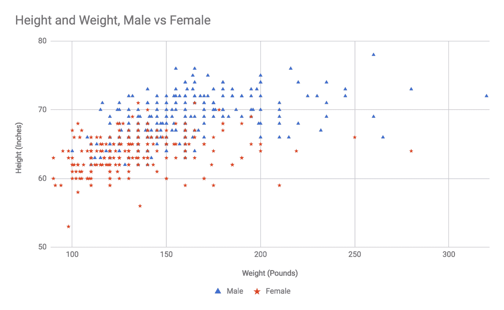
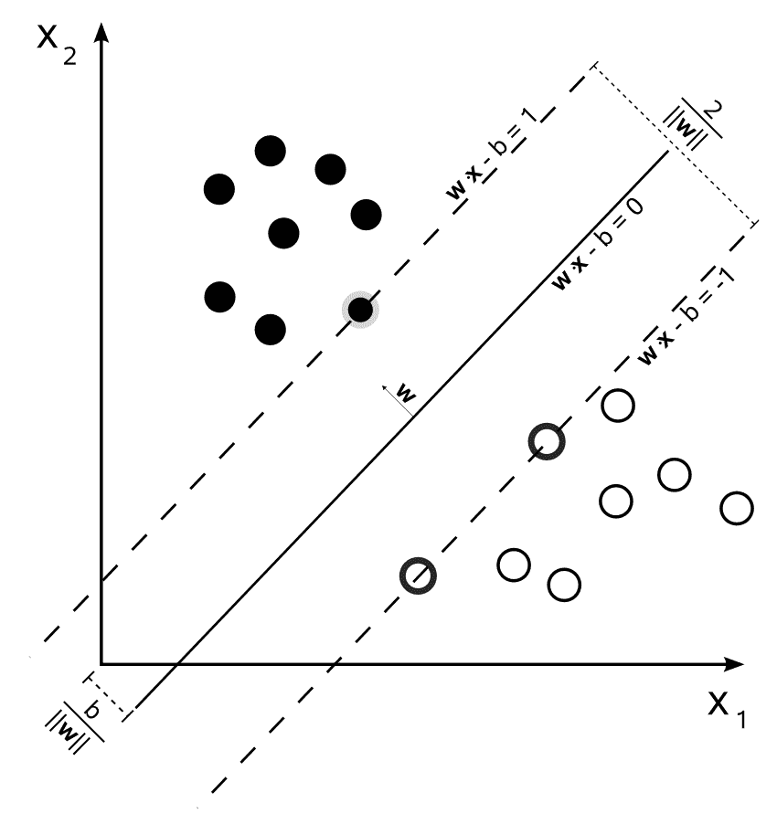
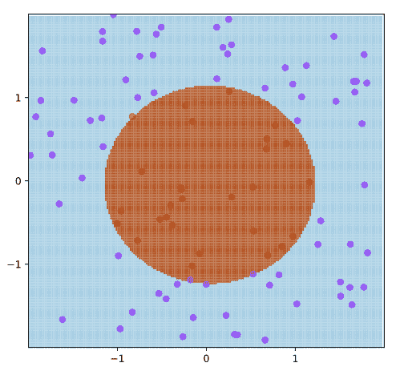
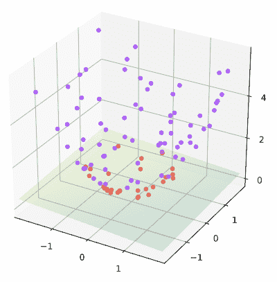
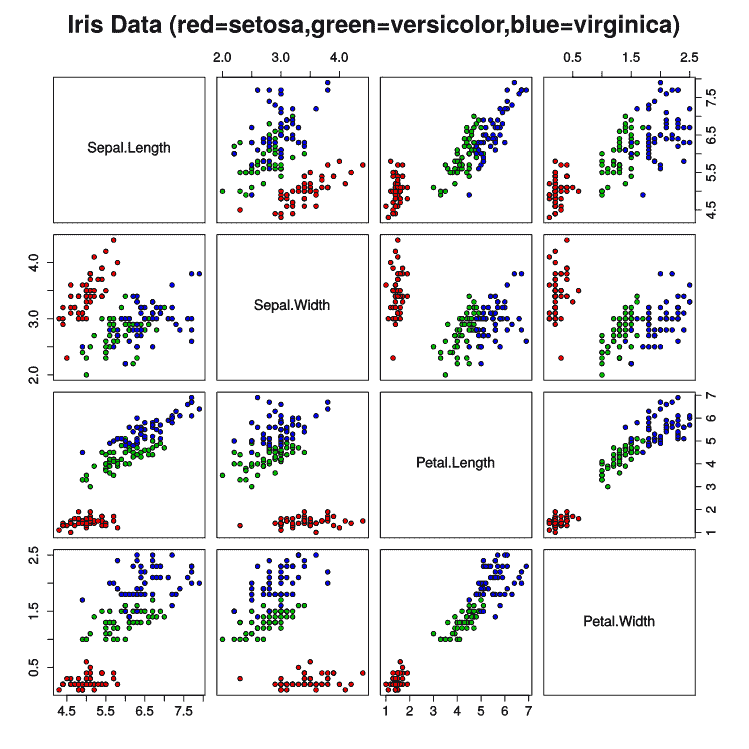

# 第五章：分类算法

分类问题涉及在数据中检测模式，并使用这些模式将数据点分配到一组相似的数据点中。如果这还不够具体，这里有一些分类问题的例子：分析一封电子邮件以确定它是否为垃圾邮件；检测一段文本的语言；阅读一篇文章并将其分类为财经、体育、政治、观点文章或犯罪；以及确定你在 Twitter 上发布的关于产品的评论是正面还是负面（这个最后的例子通常被称为**情感分析**）。

分类算法是解决分类问题的工具。根据定义，它们是监督学习算法，因为它们始终需要一个标记的训练集来构建模型。有许多分类算法，每个都是基于特定的原则设计的，或者针对特定类型的输入数据。

在本章中，我们将讨论四种分类器：**k-最近邻**（**KNN**）、朴素贝叶斯、**支持向量机**（**SVMs**）和随机森林。以下是每个算法的简要介绍：

+   KNN 算法是最简单的分类器之一，当你的数据集具有数值特征和聚类模式时，它表现得很好。在本质上，它与 k-means 聚类算法相似，因为它依赖于绘制数据点和测量点与点之间的距离。

+   朴素贝叶斯分类器是基于贝叶斯概率的有效且通用的分类器。虽然它可以用于数值数据，但它最常用于文本分类问题，如垃圾邮件检测和情感分析。当正确实现时，朴素贝叶斯分类器对于狭窄领域既快又高度准确。朴素贝叶斯分类器是我首选的分类算法之一。

+   SVMs 在精神上是非常先进的 KNN 算法形式。SVM 绘制你的数据并试图找到你已标记的类别之间的分隔线。通过一些非平凡的数学方法，SVM 可以将非线性模式线性化，因此这个工具对于线性和非线性数据都有效。

+   随机森林是分类算法中相对较新的发展，但它们既有效又灵活，因此许多研究人员（包括我自己）的首选分类器。随机森林构建了一个决策树集合（我们稍后将要讨论的另一种分类器），每个决策树都包含数据特征的一个随机子集。决策树可以处理数值和分类数据，它们可以执行回归和分类任务，并且还帮助进行特征选择，因此它们正成为许多研究人员面对新问题时首先抓取的工具。

# k-最近邻

KNN 是一个简单、快速且直接的分类算法。它对于自然聚类的分类数值数据集非常有用。在某些方面，它将类似于 k-means 聚类算法，但主要区别在于 k-means 是一个无监督算法，而 KNN 是一个监督学习算法。

如果你手动执行 KNN 分析，过程如下：首先，将所有训练数据点绘制在图上，并给每个点标注其类别或标签。当你想要对一个新的、未知的数据点进行分类时，将其放在图上，并找到距离它最近的 *k* 个点（即 *最近邻*）。*k* 应该是一个奇数，以避免平局；3 是一个不错的起点，但某些应用可能需要更多，而某些应用则可以用 1 来完成。报告大多数 *k* 个最近邻被分类为何种类别，这将作为算法的结果。

找到测试点的 *k* 个最近邻是直接的，但如果你的训练数据非常大，则可以使用一些优化。通常，在评估一个新点时，你会计算它与每个其他训练点之间的欧几里得距离（我们在第四章[84fd2c4d-41b4-46c4-82e5-4d8e55bb0066.xhtml]，*使用聚类算法进行分组*中介绍的高中几何距离度量），并按距离排序。这个算法相当快，因为训练数据通常不超过 10,000 个点。

如果你有很多训练示例（以百万计）或者你真的需要算法非常快，你可以进行两种优化。第一种是跳过距离度量中的平方根运算，而使用平方距离。虽然现代 CPU 非常快，但平方根运算仍然比乘法和加法慢得多，所以你可以通过避免平方根来节省几毫秒。第二种优化是只考虑距离测试点某个边界矩形内的点；例如，只考虑每个维度上距离测试点位置 +/- 5 个单位的点。如果你的训练数据密集，这种优化不会影响结果，但会加快算法速度，因为它将避免计算许多点的距离。

以下是对 KNN 算法的高级描述：

1.  记录所有训练数据和它们的标签

1.  给定一个要评估的新点，生成它到所有训练点的距离列表

1.  按照从近到远的顺序对距离列表进行排序

1.  丢弃除了 *k* 个最近距离之外的所有距离

1.  确定哪个标签代表了你的 *k* 个最近邻中的大多数；这是算法的结果

一个更高效的版本通过限制距离列表只包含 *k* 项来避免维护一个需要排序的大距离列表。现在让我们编写我们自己的 KNN 算法实现。

# 构建 KNN 算法

由于 KNN 算法相当简单，我们将构建自己的实现：

1.  创建一个新的文件夹，并将其命名为`Ch5-knn`。

1.  到该文件夹中添加以下`package.json`文件。请注意，这个文件与之前的示例略有不同，因为我们为`jimp`库添加了一个依赖项，这是一个我们将用于第二个示例的图像处理库：

```py
{
  "name": "Ch5-knn",
  "version": "1.0.0",
  "description": "ML in JS Example for Chapter 5 - k-nearest-neighbor",
  "main": "src/index.js",
  "author": "Burak Kanber",
  "license": "MIT",
  "scripts": {
    "build-web": "browserify src/index.js -o dist/index.js -t [ babelify --presets [ env ] ]",
    "build-cli": "browserify src/index.js --node -o dist/index.js -t [ babelify --presets [ env ] ]",
    "start": "yarn build-cli && node dist/index.js"
  },
  "dependencies": {
    "babel-core": "⁶.26.0",
    "babel-plugin-transform-object-rest-spread": "⁶.26.0",
    "babel-preset-env": "¹.6.1",
    "babelify": "⁸.0.0",
    "browserify": "¹⁵.1.0",
    "jimp": "⁰.2.28"
  }
}
```

1.  运行`yarn install`命令以下载和安装所有依赖项，然后创建名为`src`、`dist`和`files`的子文件夹。

1.  在`src`文件夹内，创建一个`index.js`文件和一个`knn.js`文件。

你还需要一个`data.js`文件。对于这些示例，我使用了一个比这本书能打印的更大的数据集，所以你应该花一分钟时间从这个书的 GitHub 账户下载`Ch5-knn/src/data.js`文件。

让我们从`knn.js`文件开始。就像前一章中的 k-means 示例一样，我们需要一个距离测量函数。让我们使用来自第四章，*使用聚类算法进行分组*的函数；将以下内容添加到`knn.js`的开头：

```py
/**
 * Calculate the distance between two points.
 * Points must be given as arrays or objects with equivalent keys.
 * @param {Array.<number>} a
 * @param {Array.<number>} b
 * @return {number}
 */
const distance = (a, b) => Math.sqrt(
    a.map((aPoint, i) => b[i] - aPoint)
        .reduce((sumOfSquares, diff) => sumOfSquares + (diff*diff), 0)
);
```

如果你真的需要对你的 KNN 实现进行性能优化，你可能在这里省略`Math.sqrt`操作，只返回平方距离。然而，我再次强调，由于这个算法本质上非常快，你应该只有在处理极端问题、大量数据或非常严格的速度要求时才需要这样做。

接下来，让我们添加我们的 KNN 类的骨架。将以下内容添加到`knn.js`中，在距离函数下方：

```py
class KNN {

    constructor(k = 1, data, labels) {
        this.k = k;
        this.data = data;
        this.labels = labels;
    }

}

export default KNN;
```

构造函数接受三个参数：`k`或分类新点时考虑的邻居数量；将训练数据拆分为单独的数据点；以及它们对应标签的数组。

接下来，我们需要添加一个内部方法，该方法考虑一个测试点并计算从测试点到训练点的距离的排序列表。我们将称之为**距离图**。将以下内容添加到 KNN 类的主体中：

```py
generateDistanceMap(point) {

    const map = [];
    let maxDistanceInMap;

    for (let index = 0, len = this.data.length; index < len; index++) {

        const otherPoint = this.data[index];
        const otherPointLabel = this.labels[index];
        const thisDistance = distance(point, otherPoint);

        /**
         * Keep at most k items in the map. 
         * Much more efficient for large sets, because this 
         * avoids storing and then sorting a million-item map.
         * This adds many more sort operations, but hopefully k is small.
         */
        if (!maxDistanceInMap || thisDistance < maxDistanceInMap) {

            // Only add an item if it's closer than the farthest of the candidates
            map.push({
                index,
                distance: thisDistance,
                label: otherPointLabel
            });

            // Sort the map so the closest is first
            map.sort((a, b) => a.distance < b.distance ? -1 : 1);

            // If the map became too long, drop the farthest item
            if (map.length > this.k) {
                map.pop();
            }

            // Update this value for the next comparison
            maxDistanceInMap = map[map.length - 1].distance;

        }
    }

    return map;
}
```

这个方法可能更容易阅读，但简单的版本对于非常大的训练集来说并不高效。我们在这里做的是维护一个可能包含 KNN 的点列表，并将它们存储在`map`中。通过维护一个名为`maxDistanceInMap`的变量，我们可以遍历每个训练点，进行简单的比较以确定该点是否应该添加到我们的候选列表中。如果我们正在迭代的点比我们的候选点中最远的点更近，我们可以将该点添加到列表中，重新排序列表，移除最远的点以保持列表较小，然后更新`mapDistanceInMap`。

如果这听起来像是一项繁重的工作，一个更简单的版本可能会遍历所有点，将每个点及其距离测量值添加到映射中，对映射进行排序，然后返回前*k*个条目。这种实现的缺点是，对于一个包含一百万个点的数据集，你需要构建一个包含一百万个点的距离映射，然后在内存中对这个巨大的列表进行排序。在我们的版本中，你只需要始终保留*k*个候选项，因此你永远不需要存储一个单独的一百万点映射。我们的版本确实需要在将项目添加到映射时调用`Array.sort`。这种方式本身就不太高效，因为每次添加到映射时都会调用排序函数。幸运的是，排序操作仅针对*k*个项，其中*k*可能类似于 3 或 5。排序算法的计算复杂度很可能是`O(n log n)`（对于快速排序或归并排序实现），因此当*k=3*时，更复杂的版本在约 30 个数据点时比简单版本更高效，当*k=5*时，这种情况发生在大约 3,000 个数据点时。然而，两种版本都非常快，对于小于 3,000 个点的数据集，你不会注意到任何区别。

最后，我们将算法与一个`predict`方法结合起来。`predict`方法必须接受一个测试点，并且至少返回该点的确定标签。我们还将向该方法添加一些额外的输出，并报告*k*个最近邻的标签以及每个标签所贡献的投票数。

将以下内容添加到 KNN 类的主体中：

```py
predict(point) {

    const map = this.generateDistanceMap(point);
    const votes = map.slice(0, this.k);
    const voteCounts = votes
        // Reduces into an object like {label: voteCount}
        .reduce((obj, vote) => Object.assign({}, obj, {[vote.label]: (obj[vote.label] || 0) + 1}), {})
    ;
    const sortedVotes = Object.keys(voteCounts)
        .map(label => ({label, count: voteCounts[label]}))
        .sort((a, b) => a.count > b.count ? -1 : 1)
    ;

    return {
        label: sortedVotes[0].label,
        voteCounts,
        votes
    };

}
```

这个方法在 JavaScript 中需要进行一些数据类型转换，但在概念上很简单。首先，我们使用我们刚刚实现的方法生成我们的距离映射。然后，我们移除所有数据，只保留*k*个最近点，并将这些数据存储在`votes`变量中。如果你使用*k=3*，那么`votes`将是一个长度为三的数组。

现在我们有了*k*个最近邻，我们需要确定哪个标签代表了大多数邻居。我们将通过将投票数组缩减成一个名为`voteCounts`的对象来完成这项工作。为了了解我们希望`voteCounts`看起来像什么，想象我们在寻找三个最近邻，可能的类别是`Male`或`Female`。`voteCounts`变量可能看起来像这样：`{"Female": 2, "Male": 1}`。

然而，我们的工作还没有完成——在将我们的投票汇总成一个投票计数对象之后，我们仍然需要对其进行排序并确定多数标签。我们通过将投票计数对象映射回一个数组，然后根据投票数对数组进行排序来完成这项工作。

有其他方法可以处理这个投票计数问题；任何你能想到的方法都可以工作，只要你在最后能够返回多数投票。我喜欢从结构和从一种结构转换到另一种结构所需的转换来思考数据，但只要你能报告最高票，算法就会工作。

在`knn.js`文件中，我们只需要做这些。算法已经完成，只需要少于 70 行代码。

让我们设置`index.js`文件并准备运行一些示例。记住，你首先需要下载`data.js`文件——请参阅 Packt 的 GitHub 账户或我的个人 GitHub 账户[`github.com/bkanber/MLinJSBook`](https://github.com/bkanber/MLinJSBook)。

将以下内容添加到`index.js`的顶部：

```py
import KNN from './knn.js';
import {weight_height} from './data.js';
```

让我们在几个简单的例子上尝试我们的算法。

# 示例 1 – 身高、体重和性别

KNN，就像 k-means 一样，可以处理高维数据——但是，就像 k-means 一样，我们只能在二维平面上绘制示例数据，所以我们将保持示例简单。我们将要解决的第一个问题是：我们能否仅根据一个人的身高和体重预测其生物性别？

我从这个例子中下载了一些数据，数据来自一项关于人们对自身体重感知的全国性纵向调查。数据中包括受访者的身高、体重和性别。以下是数据在图表中的样子：



只需看一下前面的图表数据，你就可以感受到 KNN 在评估聚类数据时为什么如此有效。确实，男性和女性之间没有清晰的边界，但如果你要评估一个体重 200 磅、身高 72 英寸的新数据点，很明显，围绕该点的所有训练数据都是男性，你的新点也很可能是男性。相反，一个体重 125 磅、身高 62 英寸的新受访者已经进入了图表中的女性区域，尽管也有几个男性具有这些特征。图表的中间，大约在 145 磅和 65 英寸高，是最模糊的，男性和女性的训练点分布均匀。我预计算法在这个区域的新点将不确定。因为在这个数据集中没有清晰的分割线，我们需要更多的特征或更多的维度来获得更好的边界分辨率。

在任何情况下，让我们尝试几个例子。我们将选择五个我们预期肯定是男性、肯定是女性、可能是男性、可能是女性和无法确定的点。将以下代码添加到`index.js`文件中，在两个导入行下面：

```py
console.log("Testing height and weight with k=5");
console.log("==========================");

 const solver1 = new KNN(5, weight_height.data, weight_height.labels);

 console.log("Testing a 'definitely male' point:");
 console.log(solver1.predict([200, 75]));
 console.log("\nTesting a 'probably male' point:");
 console.log(solver1.predict([170, 70]));
 console.log("\nTesting a 'totally uncertain' point:");
 console.log(solver1.predict([140, 64]));
 console.log("\nTesting a 'probably female' point:");
 console.log(solver1.predict([130, 63]));
 console.log("\nTesting a 'definitely female' point:");
 console.log(solver1.predict([120, 60]));
```

在命令行中运行`yarn start`，你应该看到以下输出。由于 KNN 不是随机的，这意味着它在评估时没有使用任何随机条件，你应该看到与我完全相同的输出——除非两个投票有相同的距离，否则投票顺序和它们的索引可能会有所不同。

如果你运行`yarn start`时出现错误，请确保你的`data.js`文件已经正确下载并安装。

下面是前面代码的输出：

```py
Testing height and weight with k=5
======================================================================

 Testing a 'definitely male' point:
 { label: 'Male',
 voteCounts: { Male: 5 },
 votes:
 [ { index: 372, distance: 0, label: 'Male' },
 { index: 256, distance: 1, label: 'Male' },
 { index: 291, distance: 1, label: 'Male' },
 { index: 236, distance: 2.8284271247461903, label: 'Male' },
 { index: 310, distance: 3, label: 'Male' } ] }

 Testing a 'probably male' point:
 { label: 'Male',
 voteCounts: { Male: 5 },
 votes:
 [ { index: 463, distance: 0, label: 'Male' },
 { index: 311, distance: 0, label: 'Male' },
 { index: 247, distance: 1, label: 'Male' },
 { index: 437, distance: 1, label: 'Male' },
 { index: 435, distance: 1, label: 'Male' } ] }

 Testing a 'totally uncertain' point:
 { label: 'Male',
 voteCounts: { Male: 3, Female: 2 },
 votes:
 [ { index: 329, distance: 0, label: 'Male' },
 { index: 465, distance: 0, label: 'Male' },
 { index: 386, distance: 0, label: 'Male' },
 { index: 126, distance: 0, label: 'Female' },
 { index: 174, distance: 1, label: 'Female' } ] }

 Testing a 'probably female' point:
 { label: 'Female',
 voteCounts: { Female: 4, Male: 1 },
 votes:
 [ { index: 186, distance: 0, label: 'Female' },
 { index: 90, distance: 0, label: 'Female' },
 { index: 330, distance: 0, label: 'Male' },
 { index: 51, distance: 1, label: 'Female' },
 { index: 96, distance: 1, label: 'Female' } ] }

 Testing a 'definitely female' point:
 { label: 'Female',
 voteCounts: { Female: 5 },
 votes:
 [ { index: 200, distance: 0, label: 'Female' },
 { index: 150, distance: 0, label: 'Female' },
 { index: 198, distance: 1, label: 'Female' },
 { index: 147, distance: 1, label: 'Female' },
 { index: 157, distance: 1, label: 'Female' } ] }
```

该算法已经确定了性别，就像我们通过查看图表进行视觉判断一样。您可以随意玩转这个例子，并尝试不同的 `k` 值，看看结果可能会有何不同。

现在我们来看一个 KNN 实际应用的第二个例子。这次，我们将选择一个 `k = 1` 真正发光的问题。

# 示例 2 – 去色照片

KNN 算法非常容易受到局部噪声的影响，当预期类别之间存在大量重叠时，它并不很有用。它通常对更高级的任务，如心理分析、人口统计或行为分析，并不很有用。但它是您工具箱中一个非常有用的工具，因为它可以很容易地帮助完成底层任务。

在这个例子中，我们将使用我们的 KNN 类去色照片。具体来说，我们将从彩色输入照片中提取，并限制它们只使用 16 种颜色方案。我们将使用 KNN 来选择给定像素的适当替代颜色。

我们的工作流程将如下所示：

1.  使用 `jimp` 库读取输入图像

1.  遍历图像中的每个像素：

    1.  在我们的 16 种颜色方案中找到最相似的颜色

    1.  用新颜色替换那个像素

1.  基于十六色方案写入一个新输出文件

在我们开始之前，*验证* 以下内容是否存在于您的 `data.js` 文件中。如果您从 GitHub 下载了这本书的 `data.js` 文件，那么它应该已经在那里了。然而，如果您从其他地方获取了性别调查数据，您需要在 `data.js` 文件中包含以下内容：

```py
export const colors_16 = {
 data: [
 [0, 0, 0], // black
 [128, 128, 128], // gray
 [128, 0, 0], //maroon
 [255, 0, 0], // red
 [0, 128, 0], // green
 [0, 255, 0], // lime
 [128, 128, 0], // olive
 [255, 255, 0], // yellow
 [0, 0, 128], // navy
 [0, 0, 255], // blue
 [128, 0, 128], // purple
 [255, 0, 255], // fuchsia
 [0, 128, 128], // teal
 [0, 255, 255], // aqua
 [192, 192, 192], // silver
 [255, 255, 255], // white
 ],

 labels: [
 'Black',
 'Gray',
 'Maroon',
 'Red',
 'Green',
 'Lime',
 'Olive',
 'Yellow',
 'Navy',
 'Blue',
 'Purple',
 'Fuchsia',
 'Teal',
 'Aqua',
 'Silver',
 'White',
 ]
 };
```

上述颜色定义代表一个常见的 16 种颜色方案。您也可以自己尝试不同的颜色方案；您可以使用这种方法将图像着色为蓝色调、暖色调或棕褐色调等。您还可以通过增加训练数据的大小来允许远超过 16 种颜色。

让我们先编写几个辅助函数。在 `src` 文件夹中创建一个名为 `decolorize.js` 的新文件。确保您已将 `jimp` 添加到您的 `package.json` 中——如果您不确定，请在命令行中运行 `yarn add jimp`。将以下导入添加到文件顶部：

```py
import KNN from './knn.js';
import {colors_16} from './data.js';
import jimp from 'jimp'
```

然后，创建并导出一个函数，该函数接受一个图像文件名并写入一个去色图像的新文件。我在代码片段中留下了一些温和的注释，描述了工作流程；大部分代码只是处理数据格式。一般来说，我们的方法是打开并读取输入文件，遍历所有像素，使用 KNN 为该像素找到一个替代颜色，将新颜色写入像素，然后最终使用修改后的颜色写入一个新输出文件：

```py
const decolorize = filename => {

  return jimp.read(filename)
    .then(image => {

      // Create a KNN instance with our color scheme as training data
      // We use k=1 to find the single closest color
      // k > 1 wouldn't work, because we only have 1 label per training point
      const mapper = new KNN(1, colors_16.data, colors_16.labels);
      const {width, height} = image.bitmap;

      // For every pixel in the image...
      for (let x = 0; x < width; x++) {
      for (let y = 0; y < height; y++) {

      // Do some work to get the RGB value as an array: [R,G,B]
      const originalColorHex = image.getPixelColor(x, y);
      const originalColorRgb = jimp.intToRGBA(originalColorHex);
      const pixelPoint = [originalColorRgb.r, originalColorRgb.g, originalColorRgb.b];

      // Ask the KNN instance what the closest color from the scheme is
      const closestColor = mapper.predict(pixelPoint);

      // Then get that color in hex format, and set the pixel to the new color
      const newColor = colors_16.data[colors_16.labels.indexOf(closestColor.label)];
      const newColorHex = jimp.rgbaToInt(newColor[0], newColor[1], newColor[2], 255);
      image.setPixelColor(newColorHex, x, y);

    }
  }

  const ext = image.getExtension();
  image.write(filename.replace('.'+ext, '') + '_16.' + ext);

  })
  .catch(err => {
    console.log("Error reading image:");
    console.log(err);
  })
};

export default decolorize
```

我们现在有一个函数，它将接受一个文件名并创建一个新的去色照片。如果你还没有创建，请在`Ch5-knn`目录下创建一个名为`files`的文件夹。找到一些你喜欢的图片并将它们添加到`files`文件夹中。或者，你可以使用书中 GitHub 上的图像示例，它们是`landscape.jpeg`、`lily.jpeg`和`waterlilies.jpeg`。

最后，打开`index.js`文件，并将以下内容添加到文件底部：

```py
['landscape.jpeg', 'lily.jpeg', 'waterlilies.jpeg'].forEach(filename => {
  console.log("Decolorizing " + filename + '...');
  decolorize('./files/' + filename)
    .then(() => console.log(filename + " decolorized"));
});
```

如果你正在使用自己的示例文件，请确保更新前面代码中显示的粗体文件名。

使用`yarn start`运行代码，你应该会看到以下输出（你的输出中可能还有其他 KNN 实验的结果）：

```py
 Decolorizing images
 =======================================================
 Decolorizing landscape.jpeg...
 Decolorizing lily.jpeg...
 Decolorizing waterlilies.jpeg...
 lily.jpeg decolorized
 waterlilies.jpeg decolorized
 landscape.jpeg decolorized
```

如果有任何关于文件名或权限的错误，请解决它们。在`files`文件夹中查找你的新照片。我不知道你用哪种格式阅读这本书，以及这些图片将如何显示给你，但以下是我的`landscape.jpeg`文件，原始和处理的。

原始：


去色版本：


我认为它在前景和风景方面做得非常好，然而，有限的调色板无疑影响了背景中的天空、水和山脉。尝试向训练数据中添加 8 或 16 种颜色，看看会发生什么。

我喜欢这个项目作为 KNN 示例，因为它表明**机器学习**（**ML**）算法并不总是用于复杂分析。其中许多可以作为你日常工具箱的一部分使用，用较小的模型训练，帮助你处理更简单的数据处理任务。

我还应该在这里记一笔关于测量颜色之间距离的事情。我们采用的方法，即使用欧几里得距离公式来测量 RGB 值之间的距离，在感知上并不准确。当涉及到人类视觉感知时，RGB 空间略有扭曲，因此我们的欧几里得距离测量并不完全准确。就我们的目的而言，它们已经足够接近了，因为我们正在降低到非常低的分辨率。如果你需要进行感知上准确的照片处理，你可能需要将所有 RGB 值转换到一个更准确的颜色空间，例如*Lab*，或者更新你的距离函数来测量感知距离，而不仅仅是点之间的几何距离。

让我们从 KNN 转向一个更复杂的方法来分类对象，基于几个世纪前的概率理论，至今仍然强大：贝叶斯分类。

# 天真贝叶斯分类器

天真贝叶斯分类器是一种概率分类器，或者是一种将概率分布分配给潜在结果的算法。与`Male`或`Female`这样的二进制分类不同，概率分类器会告诉你这个数据点有 87%的概率是`Male`，有 13%的概率是`Female`。

并非所有概率分类器都是贝叶斯分类器，它们也不一定都是朴素分类器。在这个上下文中，“朴素”一词并不是对分类器的隐晦侮辱——它是一个在概率论中有特定意义的数学术语，我们稍后会进一步讨论。术语“贝叶斯”或“贝叶斯派”意味着分类器中使用的原理最初是由 18 世纪的数学家托马斯·贝叶斯牧师发表的，他因其在概率论中的**贝叶斯定理**而闻名。

让我们先来复习一下概率。首先，你应该知道概率可以与**连续分布**和**离散分布**一起工作。连续分布是变量是一个数字，可以具有任何值的分布。离散分布只有有限数量的可能状态，即使这个数量很大。连续值是像*每周 54.21 分钟的活动；每股 23.34 美元；总共 18 次登录*这样的东西。离散值是*真/假*；*好莱坞*，*八卦*，*政治*，*体育*，*本地事件*，或者*世界新闻*，甚至是文章中单个单词的频率。概率论中的大多数定理都可以用于连续和离散分布，尽管两者之间的实现细节会有所不同。

在我们例子中使用的离散概率中，你处理的是各种**事件**发生的概率。事件是从实验中可能得到的结果的集合。这个经典的说明性例子涉及一副扑克牌；想象你从洗好的牌堆中随机抽取一张牌。你抽到的牌是红心的概率是多少？当我们提出这个问题时，我们是在询问某个事件的概率，具体来说是**这张牌是红心**的概率。我们可以给我们的事件一个标签，比如用`H`表示红心，然后我们可以将短语“这张牌是红心的概率”简短地表示为`P(H)`。答案是 13/52，或者 1/4，或者 0.25，所以你也可以说`P(H) = 0.25`。在我们的场景中还有许多其他可能的事件。抽到方块 5 的概率是多少？抽到黑桃的概率是多少？抽到人头牌的概率是多少？数值小于 5 的概率是多少？所有这些都是事件类型，每个事件都有其自己的概率。

并非所有事件都是独立的。例如，假设实验是“你昨天喝了汽水吗？”，并且我们在调查美国人。我们可以定义事件`S`为“昨天喝了汽水”。通过调查美国所有人（或者至少是一个代表性样本），我们发现近 50%的受访者表示是的！（根据耶鲁大学的数据，实际上是 48%）所以我们可以这样说，事件`S`的概率是 50%，或者`P(S) = 0.5`。我们还可以定义一个事件为`S'`，这是事件“昨天没有喝汽水”的概率，或者其逆事件。

我们希望更深入地了解公民的饮食习惯，所以我们向调查中添加了另一个问题：你昨天在快餐店吃饭了吗？我们将这个事件命名为`M`，代表麦当劳，我们发现`P(M) = 0.25`，即全国的四分之一。

我们现在可以问更复杂的问题，例如：吃快餐是否会影响人们喝汽水？我们可以询问在昨天吃了快餐的情况下，某人喝了汽水的概率。这被称为`S`事件在`M`条件下的**条件概率**，即`P(S|M)`。

如果我们在同一份调查中询问关于喝汽水和吃快餐的问题，那么我们可以通过找到同时进行这两个事件的受访者的概率（这写成`P(S ∩ M)`，发音为*概率 S 交集 M*），然后除以`P(M)`来计算`P(S|M)`。完整的公式是`P(S|M) = P(S ∩ M) / P(M)`。

假设有 20%的受访者既喝了汽水又吃了快餐。我们现在可以计算出`P(S|M) = 0.2 / 0.25 = 0.8`。如果你昨天吃了快餐，那么昨天喝了汽水的概率是 80%。

注意，这*不是*你在吃快餐时喝了汽水的概率。要回答这个问题，你必须去快餐店并对那里的人进行调查。我们的版本在因果关系方面承诺较少。

现在你想问相反的问题：如果某人昨天喝了汽水，那么他们昨天吃快餐的概率是多少？这是在询问`P(M|S)`。我们本可以直接反转前面的公式，但假设我们失去了原始的调查数据，无法再确定`P(S ∩ M)`。

我们可以使用贝叶斯定理来正确地反转我们的概率：

*P(M|S) = P(S|M) * P(M) / P(S)*

幸运的是，我们记得这三个值，并发现：

*P(M|S) = 0.8 * 0.25 / 0.5 = 0.4*

知道某人昨天喝了汽水，那么他们昨天吃快餐的概率是 40%。这比任何吃快餐的人的基准概率 25%要高。

这如何应用于朴素贝叶斯分类器？我们使用前面的条件概率定理将特征与其相应的类别联系起来。在垃圾邮件过滤器中，我们提出这样的问题：这个文档包含单词*credit*时，它是垃圾邮件的概率是多少？*以及这个文档包含单词*transfer*时，它是垃圾邮件的概率是多少？*我们对文档中的每个单词都提出这样的问题，然后我们将这些概率结合起来，得到文档是垃圾邮件的整体概率。朴素贝叶斯分类器之所以被称为朴素，是因为它假设所有事件都是独立的。实际上，这是一个错误的假设。包含单词*credit*的电子邮件更有可能也包含单词*transfer*，但在实践中，这些分类器仍然非常准确，尽管存在错误的假设。

# 分词

我们还必须简要讨论一下**分词**的概念。我们将在第十章“实践中的自然语言处理”中深入讨论分词，当我们讨论自然语言编程时，但我们现在确实需要对其有一个简短的介绍。分词是将文档分解成单个**分词**的行为。你可以把分词想象成单词，但并非所有单词都是分词，也不是所有分词都是单词。

最简单的分词器可能是通过空格分割文档。结果将是一个包含单词、它们的字母大小写和标点符号的数组。一个稍微高级一点的分词器可能会将所有内容转换为小写并删除任何非字母数字字符。现在，所有分词都是小写单词、数字以及包含数字的单词。你的分词器可以删除常见单词，如“和”和“的”——这被称为**停用词过滤**。你还可以在分词器中实现**词干提取**，即从单词中删除不必要的结尾。例如，“parties”、“partied”和“party”都可能变成“parti”。这是一个很好的降维技术，有助于你的分类器关注单词的意义而不是特定的时态或用法。你可以通过**词形还原**更进一步，这与词干提取类似，但实际上是将单词语法上转换为它们的词根形式，因此“running”、“runs”和“ran”都会变成“run”。

分词可以采取更高级的形式。一个分词不一定是单个单词；它可以是单词的对或三联组。这些分别被称为**二元组**和**三元组**。分词也可以从元数据生成。特别是电子邮件垃圾邮件过滤器，当将消息头中的某些信息作为分词包含在内时，表现非常好：电子邮件是否通过了 SPF 检查，是否有有效的 DKIM 密钥，发送者的域名等等。分词器还可以修改某些字段中的分词；例如，发现给电子邮件主题行中的分词加上前缀（与正文内容相反）可以提高垃圾邮件过滤性能。与其将“现在购买药品”分词为“购买”、“药品”、“现在”，不如将其分词为“SUBJ_buy”、“SUBJ_pharmaceuticals”、“SUBJ_now”。这种前缀的效果是允许分类器分别考虑主题和正文中的单词，这可能会提高性能。

不要低估分词器的重要性。通常，通过深思熟虑地选择分词器算法，你可以获得显著的准确率提升。在这个例子中，我们将使用一个简单、直观但仍相当有效的分词器。

# 构建算法

现在让我们构建朴素贝叶斯分类器。以下是构建算法需要遵循的步骤：

1.  为项目创建一个名为`Ch5-Bayes`的新文件夹。像往常一样，创建`src`、`data`和`dist`文件夹，并添加以下`package.json`文件：

```py
{
 "name": "Ch5-Bayes",
 "version": "1.0.0",
 "description": "ML in JS Example for Chapter 5 - Bayes",
 "main": "src/index.js",
 "author": "Burak Kanber",
 "license": "MIT",
 "scripts": {
 "build-web": "browserify src/index.js -o dist/index.js -t [ babelify --presets [ env ] ]",
 "build-cli": "browserify src/index.js --node -o dist/index.js -t [ babelify --presets [ env ] ]",
 "start": "yarn build-cli && node dist/index.js"
 },
 "dependencies": {
 "babel-core": "⁶.26.0",
 "babel-plugin-transform-object-rest-spread": "⁶.26.0",
 "babel-preset-env": "¹.6.1",
 "babelify": "⁸.0.0",
 "browserify": "¹⁵.1.0"
 }
 }
```

1.  一旦添加了`package.json`文件，请在命令行中运行`yarn install`来安装所有项目依赖项。

1.  导航到书籍的 GitHub 账户，并在`data`文件夹中下载四个文件。这些文件应命名为`train_negative.txt`、`train_positive.txt`、`test_negative.txt`和`test_positive.txt`。这些文件包含来自[`www.imdb.com/`](https://www.imdb.com/)的电影评论，并使用 IMDB 的星级评分系统预先分类为正面评论和负面评论。我们将使用这些数据来训练并验证一个检测电影评论情感的算法。

1.  在`src`文件夹中创建一个`bayes.js`文件。将以下分词器函数添加到文件顶部：

```py
export const simpleTokenizer = string => string
 .toLowerCase()
 .replace(/[^\w\d]/g, ' ')
 .split(' ')
 .filter(word => word.length > 3)
 .filter((word, index, arr) => arr.indexOf(word, index+1) === -1);
```

此函数接受一个字符串作为输入，并返回一个标记数组作为输出。首先将字符串转换为小写，因为我们的分析是区分大小写的。然后删除任何非单词或数字字符，并用空格替换。通过空格分割字符串以获取标记数组。接下来，过滤掉任何长度为三个字符或更短的标记（因此会移除像*the*和*was*这样的单词，而像*this*和*that*这样的单词会被保留）。分词器的最后一行过滤掉非唯一标记；我们只考虑文档中单词的存在，而不是这些单词的使用次数。

注意，分词器中的`filter`函数不会保留单词顺序。为了保留单词顺序，你需要在最后的过滤行前后添加`.reverse()`。然而，我们的算法不考虑单词顺序，因此保留它是不必要的。

1.  创建`BayesClassifier`类并将其从`bayes.js`文件中导出。将以下内容添加到文件中：

```py
class BayesClassifier {

 constructor(tokenizer = null) {
 this.database = {
 labels: {},
 tokens: {}
 };

 this.tokenizer = (tokenizer !== null) ? tokenizer : simpleTokenizer;
 }
 }

 export default BayesClassifier;
```

分类器的构造函数只接受一个`tokenizer`函数，但是默认为我们创建的简单分词器。将分词器配置为可配置的，这样你就可以尝试适合你特定数据集的更好的分词器。

训练朴素贝叶斯分类器是一个简单的过程。首先，简单地计算你看到的每个类别的文档数量。如果你的训练集包含 600 条正面电影评论和 400 条负面电影评论，那么你应该分别有 600 和 400 作为你的文档计数。接下来，对要训练的文档进行分词。你必须始终确保在训练期间使用与评估期间相同的分词器。对于训练文档中的每个标记，记录你在该类别中所有文档中看到该标记的次数。例如，如果你的训练数据有 600 条正面电影评论，而单词*beautiful*出现在其中的 100 条，那么你需要在*positive*类别中为标记*beautiful*维护一个计数为 100。如果标记*beautiful*在你的负面评论训练数据中只出现了三次，那么你必须单独维护这个计数。

让我们将这个翻译成代码。这是一个非常简单的操作，但我们也在将工作分配给许多小的计数和递增函数；我们将在评估阶段也使用这些计数函数：

```py
/**
 * Trains a given document for a label.
 * @param label
 * @param text
 */
train(label, text) {
  this.incrementLabelDocumentCount(label);
  this.tokenizer(text).forEach(token => this.incrementTokenCount(token, label));
}

 /**
 * Increments the count of documents in a given category/label
 * @param label
 */
incrementLabelDocumentCount(label) {
  this.database.labels[label] = this.getLabelDocumentCount(label) + 1;
}

 /**
 * Returns the number of documents seen for a given category/label.
 * If null is passed as the label, return the total number of training documents seen.
 * @param label
 */
getLabelDocumentCount(label = null) {
  if (label) {
    return this.database.labels[label] || 0;
  } else {
    return Object.values(this.database.labels)
      .reduce((sum, count) => sum + count, 0);
  }
}

 /**
 * Increment the count of a token observed with a given label.
 * @param token
 * @param label
 */
incrementTokenCount(token, label) {
  if (typeof this.database.tokens[token] === 'undefined') {
    this.database.tokens[token] = {};
  }

  this.database.tokens[token][label] = this.getTokenCount(token, label) + 1;
}

 /**
 * Get the number of times a token was seen with a given category/label.
 * If no label is given, returns the total number of times the token was seen
 * across all training examples.
 * @param token
 * @param label
 * @returns {*}
 */
getTokenCount(token, label = null) {
  if (label) {
    return (this.database.tokens[token] || {})[label] || 0;
  } else {
    return Object.values(this.database.tokens[token] || {})
      .reduce((sum, count) => sum + count, 0);
  }
}
```

如您所见，`train()`方法相当简单：增加给定标签的文档计数（例如，`垃圾邮件`或`非垃圾邮件`，`正面情感`或`负面情感`）；然后，对于文档中的每个标记，增加给定标签的标记计数（例如，*beautiful*在正面情感文档中出现了 100 次，在负面情感文档中出现了 3 次）。这些计数保存在`BayesClassifier`类的一个实例变量`this.database`中。

为了对新文档进行预测，我们需要单独考虑我们在训练过程中遇到的每个标签，计算该标签的概率，并返回最可能的标签。让我们从实现预测的反向工作开始；我们首先添加`predict`方法，然后反向工作，填充我们需要的所有其他方法。

首先，将以下`predict`方法添加到`BayesClassifier`类中：

```py
/**
 * Given a document, predict its category or label.
 * @param text
 * @returns {{label: string, probability: number, probabilities: array}}
 */
predict(text) {
  const probabilities = this.calculateAllLabelProbabilities(text);
  const best = probabilities[0];

  return {
    label: best.label,
    probability: best.probability,
    probabilities
  };

}
```

此方法接受一个输入字符串或文档，并返回一个`result`对象，其中包含最可能的标签或类别，该标签或类别的概率，以及训练过程中遇到的所有标签的概率数组。

接下来，添加`predict`方法所依赖的方法，用于计算输入文档中每个标签的概率：

```py
/**
 * Given a document, determine its probability for all labels/categories encountered in the training set.
 * The first element in the return array (element 0) is the label/category with the best match.
 * @param text
 * @returns {Array.<Object>}
 */
calculateAllLabelProbabilities(text) {
  const tokens = this.tokenizer(text);
  return this.getAllLabels()
    .map(label => ({
      label,
      probability: this.calculateLabelProbability(label, tokens)
    }))
    .sort((a, b) => a.probability > b.probability ? -1 : 1);
}
```

此方法将输入文本进行分词，然后生成一个包含所有标签及其概率的数组，按最可能到最不可能的顺序排序。现在您需要将这两个方法添加到类中——首先，是简单的`getAllLabels()`方法：

```py
/**
 * Get all labels encountered during training.
 * @returns {Array}
 */
getAllLabels() {
  return Object.keys(this.database.labels);
}
```

然后添加更复杂的`calculateLabelProbability`函数，该函数负责计算单个标签适合文档的概率：

```py
/**
 * Given a token stream (ie a tokenized document), calculate the probability that
 * this document has a given label.
 * @param label
 * @param tokens
 * @returns {number}
 */
calculateLabelProbability(label, tokens) {

  // We assume that the a-priori probability of all labels are equal.
  // You could alternatively calculate the probability based on label frequencies.
  const probLabel = 1 / this.getAllLabels().length;

  // How significant each token must be in order to be considered;
  // Their score must be greater than epsilon from the default token score
  // This basically filters out uninteresting tokens from consideration.
  // Responsible for 78% => 87.8% accuracy bump (e=.17) overall.
  const epsilon = 0.15;

  // For each token, we have to calculate a "token score", which is the probability of this document
  // belonging to a category given the token appears in it.
  const tokenScores = tokens
    .map(token => this.calculateTokenScore(token, label))
    .filter(score => Math.abs(probLabel - score) > epsilon);

 // To avoid floating point underflow when working with really small numbers,
 // we add combine the token probabilities in log space instead.
 // This is only used because of floating point math and should not affect the algorithm overall.
  const logSum = tokenScores.reduce((sum, score) => sum + (Math.log(1-score) - Math.log(score)), 0);
  const probability = 1 / (1 + Math.exp(logSum));

  return probability;
}
```

`calculateLabelProbability`方法中的内联注释说明了该方法的具体工作方式，但这一步的基本目标是计算文档中每个标记的概率，然后将单个标记概率组合成一个标签的整体概率。

例如，如果一部电影评论说*beautiful [but] awful garbage*，这个方法负责查看所有标记（*but*被分词器省略）并确定它们与给定标签（例如，*正面*或*负面*）的匹配程度。

让我们假设我们正在为 *正面* 类别标签运行这个方法。单词 *beautiful* 会得到一个强烈的分数，可能是 90%，但标记 *awful* 和 *garbage* 都会得到弱的分数，例如 5%。这种方法会报告说，对于这个文档，*正面* 标签的概率很低。另一方面，当这个方法为 *负面* 类别标签运行时，*beautiful* 标记得到一个低的分数，但 *awful* 和 *garbage* 都得到高的分数，所以该方法会返回文档为负面的高概率。

这种方法涉及一些技巧。第一个技巧是准确性增强。如果一个标记是模糊的（例如像 *that* 或 *movie* 这样的词，它适用于所有类别），它就会被从考虑中移除。我们通过过滤掉接近 50% 的标记分数来实现这一点；具体来说，我们忽略所有分数在 35-65% 之间的标记。这是一个非常有效的技术，可以提高大约 10% 的准确性。它之所以工作得很好，是因为它过滤掉了那些边缘标记中的噪声。如果单词 *movie* 有一个正面的分数 55%，但它通常出现在正面和负面的文档中，它会使所有文档都偏向正面类别。我们的方法是不考虑那些最具影响力的标记。

第二个技巧是我们的对数和技巧。通常，将单个单词或标记概率组合成整体概率的方法如下——假设你已经有一个名为 `tokenScores` 的数组变量：

```py
const multiplyArray = arr => arr.reduce((product, current) => current * product, 1);
const tokenScores = []; // array of scores, defined elsewhere
const inverseTokenScores = tokenScores.map(score => 1 - score);
const combinedProbability = multiplyArray(tokenScores) / (multiplyArray(tokenScores) + multiplyArray(inverseTokenScores));
```

换句话说，假设你有一些称为 `p1`、`p2`、`p3`、... `pN` 的单个标记的概率；获取所有这些标记的联合概率的方法是：

```py
p = (p1 * p2 * p3 * ... pN) / ( (p1 * p2 * p3 * ... pN) + (1-p1 * 1-p2 * 1-p3 * ... 1-pN) )
```

这种方法在处理小的浮点数时有一些问题。如果你开始将小的浮点数相互相乘，你可能会得到非常小的数，以至于浮点数学无法处理它，这会导致 *浮点下溢*，或者在 JavaScript 中是 NaN。解决方案是将这个计算转换为对数空间，并通过添加每个概率的自然对数值来管理整个计算，并在最后移除对数。

拼图的最后一块是生成给定标签的每个单个标记的概率。这正是贝叶斯定理真正发挥作用的地方。我们寻找的是类似于 `P(L|W)` 的概率，或者说是给定一个 **单词** 的 **标签** 的概率。我们需要为文档中的每个标记以及我们考虑的每个标签计算这个概率。然而，我们手头没有 `P(L|W)` 的值，所以我们可以使用贝叶斯定理来得到一个等价的表达式：

*P(L|W) = P(W|L)P(L) / P(W|L)P(L) + P(W|L')P(L')*

这可能看起来很复杂，但实际上并不糟糕。我们正在将`P(L|W)`的目标转化为更容易计算的概率，例如`P(W|L)`（给定标签时单词出现的概率，或在该标签中的频率）和`P(L)`（任何给定标签的概率）。分母也使用了逆概率，`P(W|L')`（单词出现在任何其他标签中的概率）和`P(L')`（任何其他标签的概率）。

我们进行这种转换是因为我们可以在训练过程中通过计数 token 和标签来获得单词频率；我们不需要记录哪些 token 出现在哪些文档中，我们可以保持我们的数据库简单且快速。

之前提到的表达式就是我们所说的*token score*，或者说是给定文档中包含一个单词时，文档具有某个标签的概率。为了使问题更加具体，我们可以提出这样的问题：`P("positive review" | "beautiful")`，或者说是给定单词 beautiful 时，文档是正面电影评论的概率。

如果评论是正面或负面的概率各占 50%，并且我们在 10%的正面评论中看到了单词*beautiful*，而在 1%的负面评论中只看到了它，那么我们的`P(L|W)`概率大约是 91%。（这个计算的公式是`(0.1 * 0.5) / ( (0.1 * 0.5) + (0.01 * 0.5) )`，使用前面的公式。）你可以将这个 91%的数字理解为单词*beautiful*的*积极性*。通过以这种方式分析文档中的所有单词，我们可以将它们的积极性分数结合起来，得到一个文档是正面的整体概率。这同样适用于任何类型的分类，无论是正面/负面电影评论，垃圾邮件/非垃圾邮件，还是英语/法语/西班牙语语言检测。

在计算 token 分数时，我们还需要考虑另一件事。如果我们以前从未见过一个 token，或者我们只见过它一两次，我们应该怎么办？对我们来说，最好的方法是调整我们计算出的 token 分数的加权平均值；我们希望加权平均，使得罕见单词的分数接近 50/50。

让我们实现前面提到的所有逻辑。这个方法可能比较长，但正如你所见，大部分工作只是简单地获取我们需要计算的各种变量的正确计数。我们还定义了一个*强度*用于罕见单词加权；我们将强度定义为三，这意味着我们必须看到这个 token 三次，它才能具有与默认的 50/50 加权等效的权重：

```py
 /**
 * Given a token and a label, calculate the probability that
 * the document has the label given that the token is in the document.
 * We do this by calculating the much easier to find Bayesian equivalent:
 * the probability that the token appears, given the label (the word frequency in that category).
 * This method also adjusts for rare tokens.
 * @param token
 * @param label
 * @returns {number}
 */
calculateTokenScore(token, label) {
  const rareTokenWeight = 3;

  const totalDocumentCount = this.getLabelDocumentCount();
  const labelDocumentCount = this.getLabelDocumentCount(label);
  const notLabelDocumentCount = totalDocumentCount - labelDocumentCount;

  // Assuming equal probabilities gave us 1% accuracy bump over using the frequencies of each label
  const probLabel = 1 / this.getAllLabels().length;
  const probNotLabel = 1 - probLabel;

  const tokenLabelCount = this.getTokenCount(token, label);
  const tokenTotalCount = this.getTokenCount(token);
  const tokenNotLabelCount = tokenTotalCount - tokenLabelCount;

  const probTokenGivenLabel = tokenLabelCount / labelDocumentCount;
  const probTokenGivenNotLabel = tokenNotLabelCount / notLabelDocumentCount;
  const probTokenLabelSupport = probTokenGivenLabel * probLabel;
  const probTokenNotLabelSupport = probTokenGivenNotLabel * probNotLabel;

  const rawWordScore =
    (probTokenLabelSupport)
    /
    (probTokenLabelSupport + probTokenNotLabelSupport);

  // Adjust for rare tokens -- essentially weighted average
  // We're going to shorthand some variables to make reading easier.
  // s is the "strength" or the "weight"
  // n is the number of times we've seen the token total
  const s = rareTokenWeight;
  const n = tokenTotalCount;
  const adjustedTokenScore =
    ( (s * probLabel) + (n * (rawWordScore || probLabel)) )
    /
    ( s + n );

  return adjustedTokenScore;
}
```

为了回顾这个算法的工作方式，这里有一个简要的总结：

训练：

1.  接受一个输入文档和已知的标签或类别

1.  将输入文档分词成一个 token 数组

1.  记录你看到这个特定标签的文档总数

1.  对于每个 token，记录你看到这个 token 与这个特定标签一起出现的次数

预测：

1.  接受一个输入文档并将其分词

1.  对于每个可能的标签（你在训练过程中遇到的全部标签），以及文档中的每个标记，计算该标记的*标记分数*（从数学上讲，给定特定标记的文档具有该标签的概率）

1.  你可能需要过滤标记分数的重要性

1.  你可能需要调整罕见词的标记分数

1.  对于每个可能的标签，将标记分数组合成一个单一的、整体的标签概率（例如，文档属于这个类别或标签的概率）

1.  报告具有最高整体概率的标签

在添加了所有代码后，我们准备训练和测试我们的朴素贝叶斯分类器。我们将使用 IMDB 电影评论来训练它，并尝试猜测从未见过的评论的情感。

# 示例 3 – 电影评论情感

我们将使用我们的朴素贝叶斯分类器来解决*情感分析*问题，或者检查一段文本并确定它是否具有整体正面或负面情感的问题。这在广告、营销和公共关系中是一个常见的分析；大多数品牌经理想知道推特上的人对他们的品牌或产品是好评还是差评。

本例的训练数据将来自[`www.imdb.com/`](https://www.imdb.com/)。我们将使用正面和负面的电影评论来训练我们的分类器，然后使用我们的分类器来检查未经训练（但已预先标记）的评论，看看它能正确识别多少。

如果你还没有这样做，请从本项目的 GitHub 页面上的`data`目录下载数据文件。你需要所有四个文本文件：`train_positive.txt`、`train_negative.txt`、`test_positive.txt`和`test_negative.txt`。我们将使用两个训练文件进行训练，两个测试文件进行验证。

接下来，在`src`文件夹中创建一个`index.js`文件。将以下代码添加到文件顶部：

```py
import readline from 'readline';
import fs from 'fs';
import BayesClassifier, {simpleTokenizer} from "./bayes";

const classifier = new BayesClassifier(simpleTokenizer);
```

我们导入`readline`和`fs`库来帮助我们处理训练文件。接下来，创建一个`utility`函数来帮助我们训练分类器：

```py
const trainer = (filename, label, classifier) => {

  return new Promise((resolve) => {
    console.log("Training " + label + " examples...");
    readline.createInterface({
      input: fs.createReadStream(filename)
    })
      .on('line', line => classifier.train(label, line))
      .on('close', () => {
        console.log("Finished training " + label + " examples.");
        resolve();
      });
  });
}
```

这个`helper`函数接受一个文件名、一个标签和一个`BayesClassifier`类的实例。它逐行读取输入文件，并针对给定的标签在每个标签上训练分类器。所有逻辑都被封装在一个承诺中，这样我们就可以在外部检测到训练器何时完成。

接下来，添加一个辅助实用工具来测试分类器。为了测试分类器，它必须首先被训练。测试函数将打开一个已知标签的测试文件，并使用分类器的`predict`方法测试文件中的每一行。实用工具将计算分类器正确和错误识别的例子数量，并报告：

```py
const tester = (filename, label, classifier) => {

  return new Promise((resolve) => {
    let total = 0;
    let correct = 0;
    console.log("Testing " + label + " examples...");
    readline.createInterface({ input: fs.createReadStream(filename) })
      .on('line', line => {
        const prediction = classifier.predict(line);
        total++;
        if (prediction.label === label) {
          correct++;
        }
      })
      .on('close', () => {
        console.log("Finished testing " + label + " examples.");
        const results = {total, correct};
        console.log(results);
        resolve(results);
      });
  }); 
}
```

我们也将这个操作封装在一个承诺中，并确保将结果作为承诺解决的一部分提供，这样我们就可以从外部检查结果。

最后，添加一些引导代码。这段代码将在两个训练文件上训练分类器，等待训练完成，然后在对两个测试文件进行测试后报告整体结果：

```py
Promise.all([
  trainer('./data/train_positive.txt', 'positive', classifier),
  trainer('./data/train_negative.txt', 'negative', classifier)
])
  .then(() => {
    console.log("Finished training. Now testing.");

    Promise.all([
      tester('./data/test_negative.txt', 'negative', classifier),
      tester('./data/test_positive.txt', 'positive', classifier)
    ])
      .then(results => results.reduce(
        (obj, item) => ({total: obj.total + item.total, correct: obj.correct + item.correct}), {total: 0, correct: 0}
      ))
      .then(results => {
        const pct = (100 * results.correct / results.total).toFixed(2) + '%';
        console.log(results);
        console.log("Test results: " + pct);
      });
 })
```

一旦添加了这段代码，你就可以通过在命令行中输入`yarn start`来运行程序。你应该会看到以下类似的输出：

```py
Training positive examples...
Training negative examples...
Finished training positive examples.
Finished training negative examples.
Finished training. Now testing.
Testing negative examples...
Testing positive examples...
Finished testing positive examples.
{ total: 4999, correct: 4402 }
Finished testing negative examples.
{ total: 5022, correct: 4738 }
{ total: 10021, correct: 9140 }
Test results: 91.21%
```

这个简单、概率性的分类器准确率超过 91%！9%的错误率可能看起来并不令人印象深刻，但在机器学习世界中，这实际上是一个非常良好的结果，特别是考虑到分类器的实现简便性和操作速度。正是这些结果使得朴素贝叶斯分类器在文本分类中非常受欢迎。通过更细致的标记化，尤其是在狭窄领域，如垃圾邮件检测，你可以将朴素贝叶斯分类器的准确率提高到 95%以上。

让我们看看一个单独的例子是什么样的。如果你想在自己的文档上测试一些文档，可以将以下代码添加到`index.js`文件中：

```py
Promise.all([
  trainer('./data/train_positive.txt', 'positive', classifier),
  trainer('./data/train_negative.txt', 'negative', classifier)
])
  .then(() => {

    const tests = [
      "i really hated this awful movie, it was so bad I didn't even know what to do with myself",
      "this was the best movie i've ever seen. it was so exciting, i was on the edge of my seat every minute",
      "i am indifferent about this"
    ];

    tests.forEach(test => {
      console.log("Testing: " + test);
      const result = classifier.predict(test);
      console.log(result);
    });
  });
```

运行前面的代码会产生以下代码：

```py
Training positive examples...
Training negative examples...
Finished training positive examples.
Finished training negative examples.

Testing: i really hated this awful movie, it was so bad I didn't even know what to do with myself
{ label: 'negative',
 probability: 0.9727173302897202,
 probabilities:
 [ { label: 'negative', probability: 0.9727173302897202 },
 { label: 'positive', probability: 0.027282669710279664 } ] }

Testing: this was the best movie i've ever seen. it was so exciting, i was on the edge of my seat every minute
{ label: 'positive',
 probability: 0.8636681390743286,
 probabilities:
 [ { label: 'positive', probability: 0.8636681390743286 },
 { label: 'negative', probability: 0.13633186092567148 } ] }

Testing: i am indifferent about this
{ label: 'negative',
 probability: 0.5,
 probabilities:
 [ { label: 'negative', probability: 0.5 },
 { label: 'positive', probability: 0.5 } ] }
```

分类器按预期工作。我们强烈的负面陈述有 97%的概率是负面的。我们的正面陈述有 86%的概率是正面的。即使我们的中立陈述返回了负面标签，也报告了正面和负面情绪的 50/50 概率分割。

我们通过简单地计算我们在文档中看到单词的次数，并使用几个世纪的概率理论来解释数据，就完成了所有这些工作，并取得了很高的准确率。我们不需要神经网络、高级框架或深度自然语言编程知识来获得这些结果；因此，朴素贝叶斯分类器应该是你在研究机器学习时应该关注的核心算法之一。

在接下来的章节中，我们将探讨两个不应被忽视的分类算法：SVM 和随机森林。

# 支持向量机

支持向量机（SVM）是一种数值分类器，在某些方面与 KNN 算法相似，尽管 SVM 在数学上更为先进。SVM 不是将测试点与其最近的点进行比较，而是试图在数据点的类别之间绘制边界线，创建一个区域，其中该区域内的所有点都将被视为该类别的成员。

考虑这张图片（来自维基百科关于 SVM 的文章）。数据点的两个类别由一条直线分开。分隔类别的线被选为*最大间隔线*，这意味着这条分割线在其两侧都有最多的空间，与你可以绘制的任何其他分割线相比：



正如这里实现的那样，SVM 在某些有限情况下是有用的，但它不是一个强大的工具，因为它要求类别必须是*线性可分的*；也就是说，它要求你可以在两个类别之间画一条直线。这个 SVM 也是一个*二元分类器*，意味着它只处理两个类别或类别。

考虑以下数据（此图像及之后的图像均由 Shiyu Ji 提供，并授权使用 Creative Commons CC BY-SA 4.0 许可）。尽管只有两个类别，但它们并不是线性可分的；只有圆形或椭圆形才能将这两个类别分开：



虽然 SVM 自 20 世纪 60 年代以来就存在，但直到 1992 年研究人员才找到了解决这个问题的方法。通过使用一种称为**核技巧**的技术，可以将非线性可分的数据转换成更高维度的线性可分数据。在这种情况下，通过核转换数据将增加一个第三维度，而正是这个新的第三维度变得线性可分：



应用核技巧后，数据已经被映射到三维空间。红色数据点在第三维度上被向下拉，而紫色点则被向上拉。现在可以绘制一个平面（在二维空间中直线的三维等价物），以分离这两个类别。

通过适当选择核和参数，支持向量机可以处理各种形状的数据。虽然支持向量机总是会在数据上绘制一条线、一个平面或超平面（平面的更高维版本）——这些总是*直线*——但算法首先将数据转换成可以用直线分离的形式。

可以与 SVM 一起使用的核类型有很多。每种核以不同的方式转换数据，而适当的核选择将取决于你的数据形状。在我们的案例中，我们将使用*径向基函数核*，这是一种适用于聚类数据的良好通用核。SVM 本身有设置和参数需要调整，例如错误成本参数，但请记住，你选择的核也可能有自己的可配置参数。例如，径向基函数使用一个称为**gamma**的参数，它控制核的曲率。

由于 SVM 需要大量的数学知识，我们不会尝试自己构建。相反，我们将使用一个现成的库和一个流行的经典数据集。我们将使用的数据集被称为`iris flower`数据集。这个特定的数据集是在 1936 年由 Edgar Anderson（一位植物学家）和 Ronald Fisher（一位统计学家和生物学家）创建的。Anderson 选择了三种鸢尾花物种，具体是* Iris setosa*、* Iris versicolor* 和 * Iris virginica*。对于每种物种，Anderson 选择了 50 个样本，并测量了花瓣长度、花瓣宽度、萼片长度和萼片宽度，并记录了测量值以及物种名称（*萼片*是保护花蕾在开花前生长的绿色叶子）。

`Iris`数据集是许多机器学习算法的常见玩具或测试数据集，原因有几个。这是一个小数据集：只有 150 个样本，四个维度或特征，以及三个类别。数据是多维的，但只有四个特征，仍然容易可视化和直观理解。数据中的模式也很有趣，对分类器提出了非平凡的挑战：一种物种（* Iris setosa*）与其他两种物种明显分离，但 * Iris versicolor* 和 * Iris virginica* 则更为交织。

因为数据是四维的，不能直接可视化，但我们可以将两个特征的所有组合分别绘制到网格中。此图像由维基百科用户 Nicoguaro 提供，并授权为 CC BY 4.0：



你可以理解为什么这个数据集对研究人员来说很有趣。在几个维度上，例如花瓣长度与花瓣宽度的比较，* Iris versicolor* 和 * Iris virginica* 有很大的重叠；在其他维度上，它们看起来几乎是线性可分的，例如在花瓣长度与花瓣宽度图上。

最后，让我们实现一个支持向量机（SVM）来帮我们解决这个问题。

创建一个名为`Ch5-SVM`的新文件夹，并添加以下`package.json`文件：

```py
{
 "name": "Ch5-SVM",
 "version": "1.0.0",
 "description": "ML in JS Example for Chapter 5 - Support Vector Machine",
 "main": "src/index.js",
 "author": "Burak Kanber",
 "license": "MIT",
 "scripts": {
 "build-web": "browserify src/index.js -o dist/index.js -t [ babelify --presets [ env ] ]",
 "build-cli": "browserify src/index.js --node -o dist/index.js -t [ babelify --presets [ env ] ]",
 "start": "yarn build-cli && node dist/index.js"
 },
 "dependencies": {
 "babel-core": "⁶.26.0",
 "babel-plugin-transform-object-rest-spread": "⁶.26.0",
 "babel-preset-env": "¹.6.1",
 "babelify": "⁸.0.0",
 "browserify": "¹⁵.1.0",
 "libsvm-js": "⁰.1.3",
 "ml-cross-validation": "¹.2.0",
 "ml-dataset-iris": "¹.0.0",
 "ml-random-forest": "¹.0.2"
 }
 }
```

一旦文件就绪，运行`yarn install`来安装所有依赖项。我们不会使用`data.js`文件，而是将使用`MLJS`库附带的`Iris`数据集。

接下来，创建一个`src`文件夹和一个`index.js`文件。在`index.js`的顶部，导入以下内容：

```py
import SVM from 'libsvm-js/asm';
import IrisDataset from 'ml-dataset-iris';
```

接下来，我们需要从`IrisDataset`库中提取数据。这个 SVM 算法的实现要求我们的标签必须是整数（它不支持将字符串作为标签），因此我们必须将数据集中的物种名称映射到整数：

```py
const data = IrisDataset.getNumbers();
const labels = IrisDataset.getClasses().map(
  (elem) => IrisDataset.getDistinctClasses().indexOf(elem)
);
```

让我们也编写一个简单的函数来衡量准确度，或者更具体地说，*损失*（或误差）。这个函数必须接受一个预期值的数组以及一个实际值的数组，并返回错误猜测的比例：

```py
const loss = (expected, actual) => {
  let incorrect = 0,
  len = expected.length;
  for (let i in expected) {
    if (expected[i] !== actual[i]) {
      incorrect++;
    }
  }
  return incorrect / len;
};
```

我们现在准备实现 SVM 类。我们将以两种方式测试我们的分类器：首先，我们将在整个数据集上训练分类器，然后在整个数据集上测试它；这将测试算法拟合数据的能力。然后我们将使用交叉验证方法，只对数据的子集进行训练，并在未见过的数据上进行测试；这将测试算法泛化其学习的能力。

将以下代码添加到 `index.js`：

```py
console.log("Support Vector Machine");
console.log("======================");

const svm = new SVM({
  kernel: SVM.KERNEL_TYPES.RBF,
  type: SVM.SVM_TYPES.C_SVC,
  gamma: 0.25,
  cost: 1,
  quiet: true
});

svm.train(data, labels);

const svmPredictions = svm.predict(data);
const svmCvPredictions = svm.crossValidation(data, labels, 5);

console.log("Loss for predictions: " + Math.round(loss(labels, svmPredictions) * 100) + "%");
console.log("Loss for crossvalidated predictions: " + Math.round(loss(labels, svmCvPredictions) * 100) + "%");
```

我们使用一些合理的参数初始化 SVM。我们选择径向基函数作为我们的核函数，我们选择一个称为 **CSVC** 的特定算法作为我们的 SVM（这是最常见的 SVM 算法），我们选择成本为 1，gamma 为 0.25。成本和 gamma 都将对分类器围绕类别绘制边界的方式产生类似的影响：值越大，围绕聚类的曲线和边界就越紧密。

`svm.crossValidation` 方法接受三个参数：数据、标签以及将数据分割成多少个段，每个遍历保留一个段用于验证。

从命令行运行 `yarn start`，你应该会看到以下内容：

```py
 Support Vector Machine
 =============================================
 Loss for predictions: 1%
 Loss for crossvalidated predictions: 3%
```

这是一个非常强的结果。SVM 能够正确回忆起 99% 的训练示例，这意味着在完全训练后，只有几个数据点被错误地猜测。在交叉验证时，我们只看到 3% 的损失；只有可能五例中的 150 个例子被错误地猜测。交叉验证步骤很重要，因为它更准确地代表了现实世界的性能；你应该调整算法的参数，以便交叉验证的准确率最大化。

对于完全训练的算法，获得 100% 的准确率很容易：我们可以简单地过度拟合数据并记住每个数据点的类别。将 gamma 和 cost 的值都改为 50 并重新运行算法。你应该会看到类似以下内容：

```py
 Support Vector Machine
 =============================================
 Loss for predictions: 0%
 Loss for crossvalidated predictions: 25%
```

通过提高成本和 gamma 的值，我们正在围绕现有数据点绘制非常紧密的边界。当成本和 gamma 的值足够高时，我们甚至可能为每个数据点绘制单独的圆圈！当测试完全训练的分类器时（例如，每个训练点都已记住），结果是完美的分数，但在交叉验证数据集时，分数会很糟糕。我们的交叉验证使用 80% 的数据用于训练，并保留 20% 用于验证；在这种情况下，我们过度拟合了训练数据，以至于分类器根本无法对未见过的数据点进行分类。分类器记住了数据，但没有从中学习。

作为经验法则，成本值的良好起点大约是 1。较高的成本会更严厉地惩罚训练错误，这意味着你的分类边界将试图更紧密地包裹训练数据。成本参数试图在边界的简单性和训练数据的召回率之间取得平衡：较低的成本将倾向于更简单、更平滑的边界，而较高的成本将倾向于更高的训练准确率，即使这意味着绘制更复杂的边界。这可能会导致样本空间的大部分区域在现实世界数据中被错误分类，特别是如果你的数据集高度分散。较高的成本值对于非常紧密聚集和清晰分离的数据效果更好；你越信任你的数据，你可以将成本设置得越高。成本参数最常见的是介于 0.01 和 100 之间，尽管当然也有可能需要更大或更小的成本值。

同样，gamma 值也控制 SVM 边界的形状和曲率，然而，这个值在应用核技巧转换数据时的数据预处理中产生影响。结果是与成本参数相似，但源于完全不同的机制。gamma 参数本质上控制单个训练样本的影响。gamma 值较低将导致训练点周围的边界更平滑、更宽，而较高的值将导致边界更紧密。gamma 的一个常见经验法则是将其设置为大约 1/M，其中 M 是数据中的特征数量。在我们的例子中，我们的数据有四个特征或维度，因此我们将 gamma 设置为 1/4 或 0.25。

当第一次训练支持向量机（SVM）时，你应该始终使用交叉验证来调整你的参数。与任何机器学习（ML）算法一样，你必须调整参数以适应你的数据集，并确保你对问题进行了充分的泛化，而不是过度拟合你的数据。有系统地调整和测试参数：例如，选择五个可能的成本值和五个可能的 gamma 值，使用交叉验证测试所有 25 种组合，并选择具有最高准确率的参数。

接下来，我们将探讨机器学习的一个现代工作马：随机森林。

# 随机森林

随机森林算法是现代的、多才多艺的、健壮的、准确的，并且对于你可能会遇到的几乎所有新的分类任务都值得考虑。它不总是给定问题域的最佳算法，并且在高维和非常大的数据集上存在问题。如果你有超过 20-30 个特征或超过，比如说，10 万个训练点，它肯定会在资源和训练时间上遇到困难。

然而，随机森林在许多方面都是优秀的。它可以轻松处理不同类型的特征，这意味着一些特征可以是数值型的，而其他特征可以是分类型的；你可以将如`number_of_logins: 24`这样的特征与如`account_type: guest`这样的特征混合。随机森林对噪声非常鲁棒，因此在实际数据上表现良好。随机森林旨在避免过拟合，因此训练和实现起来非常简单，需要的调整和微调比其他算法少。随机森林还会自动评估你数据中每个特征的重要性，因此可以免费帮助你降低维度或选择更好的特征。尽管随机森林在高维数据上可能成本较高，但根据我的经验，大多数现实世界的机器学习问题只涉及大约十几个特征和几千个训练点，而随机森林可以处理这些。这些优点使随机森林成为通用分类任务的优秀算法选择。

因此，我非常难过地报告说，在写作的时候，我在 JavaScript 生态系统中没有找到高质量的随机森林分类器。无论如何，我将继续撰写这一部分——甚至向你展示一个我认为可能存在一些错误或问题的现有库——希望在你阅读这段文字的时候，一切都已经修复，高质量的随机森林将在 JavaScript 中轻松可用。

随机森林是一种基于决策树的**集成**分类器。集成分类器由多个或许多个单独的分类器组成，它们都对预测进行投票。在第二章“数据探索”中，我们多次运行了 k-means 算法，并使用不同的随机初始条件，以避免陷入局部最优；这是一个基本的集成分类示例。

随机森林是一组**决策树**。你可能已经熟悉决策树了：在日常生活中，决策树更常被称为**流程图**。在机器学习（ML）的背景下，决策树是由算法自动训练和构建的，而不是手工绘制。

首先，让我们讨论单个决策树。决策树在随机森林之前就已经存在，但历史上对机器学习的贡献仅限于中等水平。决策树背后的概念与手绘流程图相同。当决策树评估一个数据点时，它会依次检查每个特征：*花瓣长度是否小于 1.5 厘米？如果是，检查萼片长度；如果不是，检查花瓣宽度。*最终，决策树会到达一个最终的叶子或节点，在那里不再可能做出决策，然后树会预测数据点的类别。

决策树通过使用信息理论中的几个概念自动训练，例如信息增益、熵以及一个称为**基尼不纯度**的度量。本质上，这些技术用于确定最重要的分支决策是什么。决策树希望尽可能小和简单，因此这些技术用于确定如何最好地在决策之间分割数据集。树的第一个分支应该检查花瓣宽度还是萼片长度？如果它检查萼片长度，应该是在 2.0 厘米还是 1.5 厘米处分割？哪些比较将导致整个数据集的最佳分割？这种训练是递归进行的，每个特征和每个训练点都会被评估以确定其对整体的影响。

结果是一个既快速又易于理解和调试的分类器。与神经网络不同，其中每个神经元的影響非常抽象，也与贝叶斯分类器不同，后者需要概率方面的技能才能理解，决策树可以被表示为流程图，并由研究人员直接解释。

很不幸，决策树本身并不非常准确，它们对训练数据或噪声的变化不稳健，可能会陷入局部最优，而且有一些问题类别决策树处理得并不好（比如经典的 XOR 问题，会导致树变得非常复杂）。

在 20 世纪 90 年代中期，研究人员找到了两种新的决策树集成方法。首先，开发了**样本袋装法**（或**自助聚集**）技术。在这种方法中，你创建多个决策树，每个树基于训练数据的完全随机子集（有放回），并在做出预测时使用所有树的多数投票。袋装法之所以有效，是因为单个树的噪声方差很高，但对于许多不相关的树，噪声往往会相互抵消。想象一下在体育馆里，观众们跟着他们最喜欢的乐队一起唱歌——人群总是听起来很和谐，因为唱得尖锐的人会被唱得平的人所抵消。

随机森林建立在 bagging（袋装法）的基础上，不仅随机化每个树接收到的样本，还随机化每个树接收到的*特征*。与*样本袋装法*相反，你可以称之为*特征袋装法*。如果你为我们的`Iris`数据集（该数据集有四个特征和 150 个数据点）构建一个包含 50 棵树的随机森林，你可能期望每棵树只有 100 个独特的数据点，并且只有四个特征中的两个。像样本袋装法一样，特征袋装法旨在解耦每个决策树，并减少集成整体的方差。特征袋装法还旨在识别最重要的特征，如果你需要节省资源，你总是可以从数据集中移除最不重要的特征。当你尝试预测一个数据点时，每棵树都会提交它的投票；有些树可能会非常错误，但整个集成将做出一个非常好的预测，对噪声具有鲁棒性。

让我们构建一个随机森林，并用我们的`Iris`数据对其进行测试。你应该已经在`package.json`文件中安装了随机森林和交叉验证库，从 SVM 部分开始；如果没有，你应该使用`yarn add`安装`ml-cross-validation`和`ml-random-forest`。

在`Ch5-SVM`示例的现有`index.js`文件顶部，导入适当的类：

```py
import {RandomForestClassifier} from 'ml-random-forest';
import crossValidation from 'ml-cross-validation';
```

你应该已经从 SVM 部分设置了`labels`和`data`。现在，将以下内容添加到文件底部，在 SVM 示例下方：

```py
console.log("======================");
console.log("Random Forest");
console.log("======================");

const rfOptions = {
  maxFeatures: 3,
  replacement: true,
  nEstimators: 100,
  useSampleBagging: true
};

const rf = new RandomForestClassifier(rfOptions);
rf.train(data, labels);
const rfPredictions = rf.predict(data);

const confusionMatrix = crossValidation.kFold(RandomForestClassifier, data, labels, rfOptions, 10);
const accuracy = confusionMatrix.getAccuracy();

console.log("Predictions:");
console.log(rfPredictions.join(","));
console.log("\nLoss for predictions: " + Math.round(loss(labels, rfPredictions) * 100) + "%");
console.log("Loss for crossvalidated predictions: " + Math.round( (1 - accuracy) * 100) + "%\n");
console.log(confusionMatrix);
```

与 SVM 示例类似，我们以两种方式评估随机森林。我们首先在全部训练数据上训练森林，并评估其召回率，然后我们使用交叉验证来了解其实际性能。在这个例子中，我们使用 MLJS 的交叉验证和混淆矩阵工具来评估分类器的性能。

使用`yarn start`运行代码，你应该会看到以下类似的内容：

```py
Random Forest
======================================================================
Predictions:
0,0,0,0,0,0,0,0,0,0,0,0,0,0,2,0,0,0,0,0,0,0,0,0,0,0,0,0,0,0,0,0,0,1,0, 0,1,0,0,0,0,0,0,0,0,0,0,0,0,0,2,2,2,1,2,0,2,0,2,0,0,2,2,2,1,2,1,2,2,1, 2,2,2,2,2,2,2,2,2,0,1,1,2,2,0,2,2,2,1,1,1,2,2,0,1,0,0,2,0,0,2,2,2,2,2,
2,0,2,2,2,2,2,2,0,2,2,2,2,2,2,2,1,2,2,2,2,2,2,2,2,2,2,2,2,2,2,2,2,2,2,
2,2,2,2,2,2,2,2,2,2

Loss for predictions: 31%
Loss for crossvalidated predictions: 33%

ConfusionMatrix {
 labels: [ 0, 1, 2 ],
 matrix: [ [ 43, 6, 1 ], [ 8, 11, 31 ], [ 1, 2, 47 ] ] }
```

很不幸，这个算法的准确性非常差。实际上，这种表现并不典型，尤其是对于`Iris`数据集，这个数据集对于算法来说应该非常容易解释。

我想要确定这些糟糕的结果是由于实现问题而不是概念问题，所以我用相同的 Iris 数据集通过我日常使用的熟悉的随机森林库运行，使用相同的选项和参数，但得到了非常不同的结果：**我的随机森林的交叉验证损失仅为 2%**。不幸的是，我必须将这个糟糕的准确率归咎于算法的具体实现，而不是随机森林本身。虽然我花了一些时间调查这个问题，但我并没有能够快速地识别出这个实现的问题。有可能我误用了这个工具，然而，更有可能的是，在库的某个地方有一个负号应该是一个正号（或者类似愚蠢且灾难性的错误）。我对于随机森林在`Iris`数据集上的性能的个人预测是大约 95%的准确率，我熟悉的随机森林库得到了 98%的准确率，但这个库只得到了 70%的准确率。

更糟糕的是，我无法在 JavaScript 中找到一个适用于`Iris`数据集的随机森林库。虽然有几个随机森林库，但没有一个是现代的、维护良好的和正确的。Andrej Karpathy 有一个废弃的随机森林库似乎可以工作，但它只能处理二分类（只有 1 和-1 作为标签），还有几个其他随机森林库在类似的方式下有限制。《MLJS》随机森林库是我们之前使用的最接近一个工作、维护良好的库，所以我希望无论问题是什么，它都会在你阅读这篇文章的时候被发现并解决。

我不希望你们因为使用随机森林而气馁。如果你在除了 JavaScript 以外的语言中工作，有许多随机森林库可供选择。你应该熟悉它们，因为它们很快就会成为你大多数分类问题的首选。至于 JavaScript，虽然从零开始构建随机森林比构建贝叶斯分类器更难，但它们仍然是可以实现的。如果你能够正确实现决策树，或者从不同的语言中移植一个，构建随机森林就会变得非常简单——森林中的树做了大部分工作。

虽然 JavaScript 的机器学习工具集一直在进步，但这个随机森林的例子完美地突出了还有很多工作要做。你必须谨慎行事。我开始写这个例子时，预期至少有 95%的准确率，基于我对随机森林的先前经验。但如果没有期望或经验呢？我会接受这个工具的 70%准确率吗？我会说服自己随机森林不适合这项工作吗？这会让我在将来不愿意使用随机森林吗？也许吧！JavaScript 生态系统中的机器学习会有更多这样的地雷；小心它们。

在我们结束这一章之前，我想回顾一下我们刚才看到的混淆矩阵，因为这可能对你来说是一个新概念。我们在前面的章节中讨论了精确度、召回率和准确率。混淆矩阵是这些值可以从任何分类中得出的原始数据。这是随机森林的混淆矩阵，再次呈现：

```py
ConfusionMatrix {
 labels: [ 0, 1, 2 ],
 matrix: [ [ 43, 6, 1 ], [ 8, 11, 31 ], [ 1, 2, 47 ] ] }
```

如果我们将这些组织成表格，可能看起来是这样的：

|  | **Guessed *I. setosa*** | **Guessed *I. versicolor*** | **Guessed *I. virginica*** |
| --- | --- | --- | --- |
| Actual *I. setosa* | 43 | 6 | 1 |
| 实际 *I. versicolor* | 8 | 11 | 31 |
| 实际 *I. virginica* | 1 | 2 | 47 |

混淆矩阵是猜测与实际类别之间的矩阵（或表格）。在理想的世界里，你希望混淆矩阵除了对角线外都是零。混淆矩阵告诉我们随机森林在猜测*Iris setosa*和*Iris virginica*方面做得相当不错，但它错误地将大多数*Iris versicolor*标记为*Iris virginica*。考虑到数据的形状，这并不太令人惊讶；回想一下，后两种物种重叠相当多（然而，随机森林仍然应该能够解决这个问题）。

我们为随机森林编写的代码还打印出了每个数据点的个别预测，看起来是这样的：

```py
0,0,0,0,0,0,0,0,0,0,0,0,0,0,2,0,0,0,0,0,0,0,0,0,0,0,0,0,0,0,0,0,0,1,0,0,1,0,0,0,0,0,0,0,0,0,0,0,0,0,2,2,2,1,2,0,2,0,2,0,0,2,2,2,1,2,1,2,2,1,2,2,2,2,2,2,2,2,2,0,1,1,2,2,0,2,2,2,1,1,1,2,2,0,1,0,0,2,0,0,2,2,2,2,2,2,0,2,2,2,2,2,2,0,2,2,2,2,2,2,2,1,2,2,2,2,2,2,2,2,2,2,2,2,2,2,2,2,2,2,2,2,2,2,2,2,2,2,2,2
```

这些数字并不完全与混淆矩阵中的数字相同，因为这些预测来自完全训练的树，而混淆矩阵来自交叉验证过程；但你可以看到它们仍然很相似。前 50 个预测应该都是 0（对于*Iris setosa*），而且大多数确实是。接下来的 50 个预测应该是全部 1，但主要是 2；混淆矩阵告诉我们同样的事情（即大多数`I. versicolor`被错误地标记为`I. virginica`）。最后 50 个预测应该是全部 2，大部分是正确的。混淆矩阵是查看预期猜测与实际猜测之间差异的一种更紧凑和直观的方式，这正是你在微调算法时需要的信息。

简而言之，随机森林是一种优秀的分类算法，但目前还没有令人信服的 JavaScript 实现。我鼓励您成为 JavaScript 进化的参与者，构建自己的随机森林，或者至少将这个算法记在心里以备将来使用。

# 摘要

分类算法是一种监督学习算法，其目的是分析数据并将未见过的数据点分配到预存在的类别、标签或分类中。分类算法是机器学习（ML）中一个非常受欢迎的子集，有众多分类算法可供选择。

具体来说，我们讨论了简单直观的 k 近邻算法，该算法在图上比较数据点与其邻居。我们还讨论了优秀且非常受欢迎的朴素贝叶斯分类器，它是一种经典的基于概率的分类器，在文本分类和情感分析问题空间中占据主导地位（尽管它也可以用于许多其他类型的问题）。我们还讨论了支持向量机，这是一种适用于非线性可分数据的先进几何分类器。最后，我们讨论了随机森林分类器，这是一种强大且稳健的集成技术，依赖于决策树，但不幸的是，在 JavaScript 中只有一种有疑问的实现。

我们还讨论了交叉验证和混淆矩阵，这两种强大的技术可以用来评估你模型的准确性。

在下一章中，我们将探讨关联规则，这些规则为我们提供了更多的预测能力。如果有人在商店购买了面包和黄油，他们更有可能还会购买牛奶，还是购买熟食肉类？关联规则可以帮助我们建模和解释这些关系。
