# 第七章：使用回归算法进行预测

在本章中，我们将简要介绍使用回归算法进行预测。我们还将讨论时间序列分析以及我们如何使用数字信号处理技术来辅助我们的分析。到本章结束时，你将看到时间序列和连续值数据中常见的许多模式，并了解哪些类型的回归适合哪些类型的数据。此外，你还将学习一些数字信号处理技术，例如滤波、季节性分析和傅里叶变换。

预测是一个非常广泛的概念，涵盖了多种类型的任务。本章将为你提供一套适用于时间序列数据的初始概念和算法工具箱。我们将关注基础，并讨论以下主题：

+   回归与分类

+   回归基础

+   线性、指数和多项式回归

+   时间序列分析基础

+   低通和高通滤波

+   季节性和减法分析

+   傅里叶分析

这些概念构建了一个基本的工具箱，你可以在处理现实世界的预测和分析问题时使用。还有许多其他适用于特定情况的工具，但我认为这些主题是绝对的基础。

让我们从比较和对比机器学习（ML）中回归和分类的相似之处和不同之处开始。

# 回归与分类

本书的大部分内容都与分类任务有关，分析的目标是将数据点拟合到预定义的多个类别或标签之一。在分类数据时，你可以通过将预测值与真实值进行比较来判断你的算法的准确性；一个猜测的标签要么是正确的，要么是错误的。在分类任务中，你通常可以确定一个猜测的标签与数据的匹配可能性或概率，并且你通常选择具有最大可能性的标签。

让我们比较和对比分类任务与回归任务。两者在最终目标上相似，即根据先前的知识或数据进行预测。两者在目标上相似，即我们希望创建某种函数或逻辑，将输入值映射到输出值，并使映射函数尽可能准确和通用。然而，回归和分类之间的主要区别在于，在回归中，你的目标是确定值的*数量*而不是其标签。

假设你有一份关于你管理的服务器随时间处理负载的历史数据。这些数据是*时间序列*的，因为数据随时间演变。数据也是*连续的*（与*离散的*相对），因为输出值可以是任何实数：1，或 2.3，或 2.34353，等等。在时间序列分析或回归分析中的目标不是标记数据，而是预测例如下周四晚上 20:15 的服务器负载将会是多少。为了实现这个目标，你必须分析时间序列数据，并尝试从中提取模式，然后使用这些模式进行未来预测。你的预测也将是一个真实且连续的数字，例如*我预测下周四晚上服务器负载将是 2.75*。

在分类任务中，你可以通过将预测与真实值进行比较，并计算预测正确或错误的数量来判断算法的准确性。由于回归任务涉及连续值，不能简单地确定预测是否正确。如果你预测服务器负载将是 2.75，结果实际上是 2.65，你能说预测是正确的吗？或者错误的？如果结果是 2.74 呢？当分类*垃圾邮件*或*非垃圾邮件*时，要么预测正确，要么预测错误。然而，当你比较连续值时，你只能确定预测有多接近，因此必须使用其他指标来定义算法的准确性。

通常，你将使用不同的算法集来分析连续或时间序列数据，而不是用于分类任务。然而，有一些机器学习算法可以通过轻微的修改来处理回归和分类任务。最值得注意的是，决策树、随机森林和神经网络都可以用于分类和回归任务。

在本章中，我们将探讨以下概念：

+   最小二乘回归技术，如线性回归、多项式回归、幂律回归等

+   趋势分析或平滑

+   季节性分析或模式减法

# 回归基础

在进行回归分析时，有两个主要和整体的目标。首先，我们希望确定和识别数据中任何潜在的、系统的模式。如果我们能识别出系统的模式，我们可能能够识别出导致这些模式的现象，并更深入地理解整个系统。如果你通过分析发现有一个每 16 小时重复一次的模式，你将处于一个更好的位置来弄清楚是什么现象导致了这个模式，并采取行动。与所有机器学习任务一样，这个 16 小时的模式可能深深隐藏在数据中，并且可能一眼看不出来。

第二个主要目标是利用对基本模式的知识来做出未来的预测。你所做的预测将仅与驱动预测的分析一样好。如果你的数据中有四个不同的系统性模式，而你只识别并建模了其中的三个，那么你的预测可能不准确，因为你没有完全建模涉及的现实世界现象。

实现这两个目标依赖于你识别和正式（即数学上）描述模式和现象的能力。在某些情况下，你可能无法完全识别模式的根本原因；即使如此，如果模式是可靠的，你的分析是好的，即使你不完全理解原因，你仍然能够预测系统的未来行为。这是所有机器学习问题的情况；机器学习最终分析的是行为和结果——我们可以衡量的东西，但深入了解原因只能有所帮助。

在所有机器学习问题中，我们还得应对噪声。在分类问题中，噪声可以有多种形式，例如缺失或错误的数据值，或者不可定义的人类行为。在回归问题中，噪声也可以有多种形式：传感器可能容易受到环境噪声的影响，基本过程可能存在随机波动，或者噪声可能由许多难以预测的小型系统性因素引起。

无论是在进行回归分析还是分类分析，噪声总是使模式更难以识别。在回归分析中，你的目标是能够将数据中的系统性行为（实际模式）与随机噪声源分开。在某些情况下，也很重要将噪声建模为一种行为，因为噪声本身可能对你的预测产生重大影响；在其他情况下，噪声可以被忽略。

为了说明系统性模式和噪声之间的区别，考虑以下数据集。图中没有单位，因为这只是一个关于某些依赖参数*Y*随某些独立参数*X*变化的抽象示例：

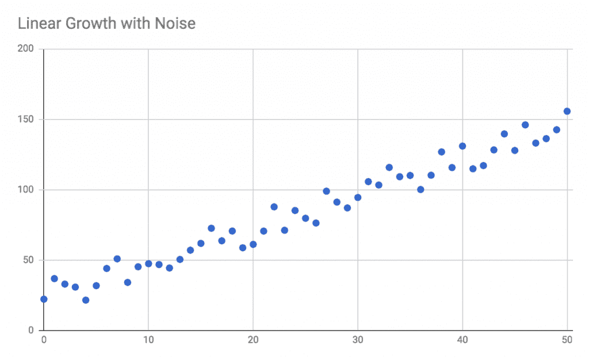

在这个例子中，我们可以清楚地看到系统性模式和噪声之间的区别。系统性模式是稳定的线性增长——Y 值通常随着 X 值的增加而增加，尽管由于噪声导致的点与点之间的波动，Y 值有所波动。通过在这个数据中建模系统性模式，我们就能对当 X 值为 75、100 或-20 时 Y 值将是什么做出合理的预测。噪声是否重要将取决于具体的应用；你可以忽略噪声，或者你可以对其进行建模并将其包含在分析中。

在第一章，“探索 JavaScript 的潜力”中，我们了解了一种处理噪声的技术：使用移动平均进行平滑。我们不是绘制单个点，而是可以一起取三个点的组合并绘制它们的平均值。如果噪声确实是真正的随机且均匀分布的（也就是说，所有噪声效应的平均值接近于零），则移动平均将倾向于消除一些噪声。如果你平均三个点，并且每个点由于噪声产生的影响分别增加+1、-2 和+1.2，那么移动平均将减少噪声的总影响至+0.2。当我们绘制移动平均时，我们通常会找到一个更平滑的模式：

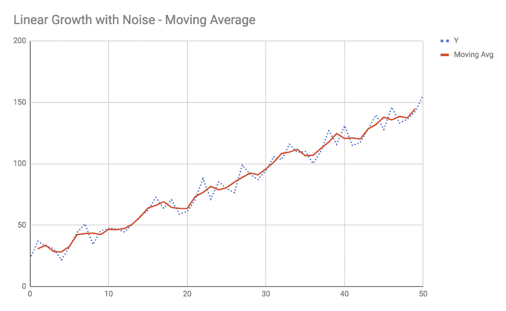

移动平均减少了噪声的影响，并帮助我们更多地关注系统模式——但我们并没有更接近于能够预测未来的值，例如当*X*为 75 时。移动平均仅帮助我们减少数据集中数据点的噪声影响。例如，当你查看*X = 4*时的 Y 值时，测量的值大约是 21，而平滑后的值是 28。在这种情况下，28 的平滑值更好地代表了*X = 4*处的*系统模式*，尽管在此点的实际测量值是 21。很可能是由于在这次测量时存在一个显著的随机噪声源，导致测量值与系统模式之间存在很大的差异。

在处理噪声时请谨慎。重要的是要认识到，在前面的例子中，实际测量的 Y 值在*X = 4*时确实是 21。平滑的移动平均是一种理想化。这是我们试图穿过噪声以看到信号的努力，但我们不能忘记实际测量受到了噪声的显著影响。这个事实是否对你的分析重要，很大程度上取决于你试图解决的问题。

那么，我们如何处理预测这些数据未来值的难题呢？移动平均在*插值*数据时可能对我们有所帮助，但在*外推*到未来的 X 值时则不然。当然，你可以猜测当*X = 75*时该值将会是多少，因为此例简单且易于可视化。然而，由于这是一本关于机器学习的书，我们可以假设现实世界的问题不会如此容易通过肉眼分析，我们需要引入新的工具。

这个问题的解决方案是*回归*。与所有预测性机器学习问题一样，我们希望创建某种抽象函数，可以将输入值映射到输出值，并使用该函数进行预测。在分类任务中，该映射函数可能是一个贝叶斯预测器或基于随机森林的启发式方法。在回归任务中，映射函数通常是一个描述直线、多项式或其他适合数据的形状的数学函数。

如果你曾经在 Excel 或 Google Sheets 中绘制过数据，那么你很可能已经使用了线性回归。这些程序的趋势线功能执行线性回归，以确定最佳拟合数据的映射函数。以下图表是由*线性回归*确定的趋势线，线性回归是一种用于找到最佳拟合数据的数学线的算法：

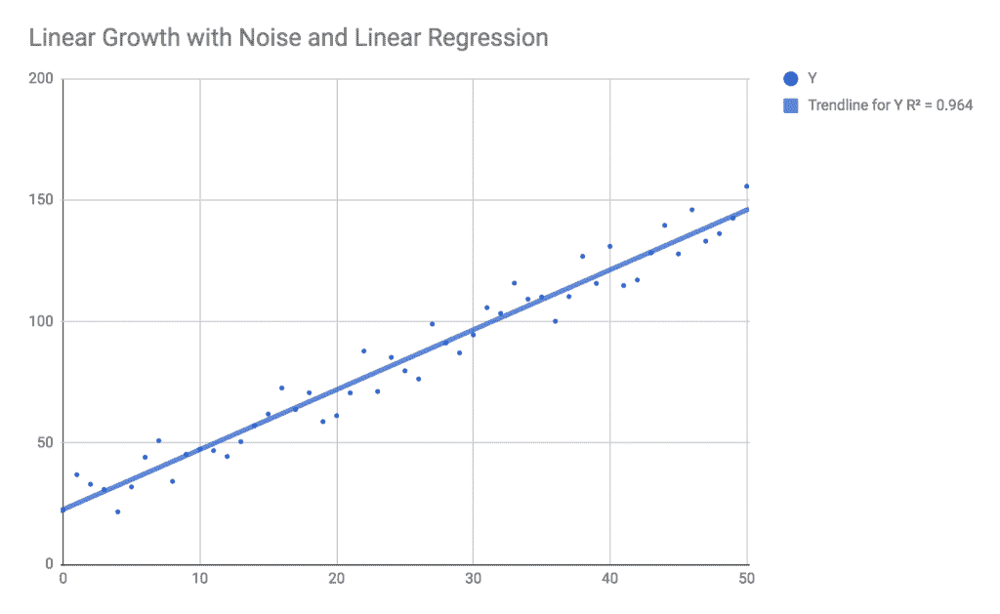

此外，Excel 还给我们提供了另一条信息，称为**R²值**，它是趋势线如何适合数据的表示。R²值接近 1.0 表示趋势线解释了点之间的大部分方差；R²值低表示模型没有解释方差。

我们之前看到的趋势线和移动平均的主要区别在于趋势线是一个实际的数学模型。当你找到一个线性回归的趋势线时，你将得到一个描述整条线的数学公式。移动平均只存在于数据点存在的地方；我们只能在 X = 0 和 X = 50 之间有一个移动平均。另一方面，趋势线由直线的数学公式描述，并且向左和向右无限延伸。如果你知道趋势线的公式，你可以将任何 *X* 的值代入该公式，并得到 *Y* 值的预测。例如，如果你发现一条线的公式是 *Y = 2.5 x X + 22*，你可以将 *X = 75* 代入，你将得到预测的 *Y = 2.5 x 75 + 22*，或者 *Y = 209.5*。从移动平均中无法得到这样的预测。

线性回归只是回归算法的一种类型，专门用于找到适合数据的直线。在本章中，我们将探讨几种其他类型的回归算法，每种算法都有不同的形状。在所有情况下，你可以使用一个描述回归如何适合数据的度量。通常，这个度量将是**均方根误差**（**RMSE**），它是每个点与趋势线比较的平方误差平均值的平方根。大多数回归算法都是*最小二乘法*回归，旨在找到最小化 RMSE 的趋势线。

让我们看看几个回归形状的例子以及如何在 JavaScript 中将它们拟合到数据中。

# 示例 1 – 线性回归

在我们深入第一个例子之前，让我们花一分钟时间设置我们的项目文件夹和依赖项。创建一个名为 `Ch7-Regression` 的新文件夹，并在该文件夹内添加以下 `package.json` 文件：

```py
{
  "name": "Ch7-Regression",
  "version": "1.0.0",
  "description": "ML in JS Example for Chapter 7 - Regression",
  "main": "src/index.js",
  "author": "Burak Kanber",
  "license": "MIT",
  "scripts": {
    "build-web": "browserify src/index.js -o dist/index.js -t [ babelify --presets [ env ] ]",
    "build-cli": "browserify src/index.js --node -o dist/index.js -t [ babelify --presets [ env ] ]",
    "start": "yarn build-cli && node dist/index.js"
  },
  "dependencies": {
    "babel-core": "⁶.26.0",
    "babel-plugin-transform-object-rest-spread": "⁶.26.0",
    "babel-preset-env": "¹.6.1",
    "babelify": "⁸.0.0",
    "browserify": "¹⁵.1.0",
    "dspjs": "¹.0.0",
    "regression": "².0.1"
  }
}
```

然后，从命令行运行 `yarn install` 命令来安装所有依赖项。接下来，创建一个名为 `src` 的文件夹，并添加一个名为 `index.js` 的空文件。最后，从书籍的 GitHub 仓库下载 `data.js` 文件到 `src` 文件夹。

在这个例子中，我们将处理上一节中的噪声线性数据。作为提醒，数据本身看起来是这样的：

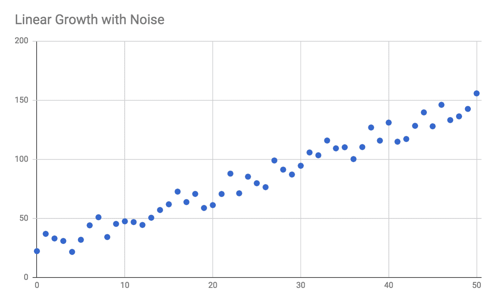

我们的目标是找到一个适合数据的直线公式，并在 *X = 75* 时对未来值进行预测。我们将使用汤姆·亚历山大的 `regression` 库，它可以执行多种类型的回归，并提供基于结果回归进行预测的能力。

在 `index.js` 文件中，将以下导入语句添加到文件顶部：

```py
import * as data from './data';
import regression from 'regression';
```

与所有机器学习问题一样，你应该首先可视化你的数据，并在选择算法之前尝试理解数据的整体形状。在这种情况下，我们可以看到数据遵循线性趋势，因此我们将选择线性回归算法。

在线性回归中，目标是确定最佳拟合数据的直线公式的参数。直线的公式具有以下形式：*y = mx + b*，有时也写作 *y = ax + b*，其中 *x* 是输入变量或自变量，*y* 是目标或因变量，*m*（或 *a*）是直线的*斜率*或*梯度*，而 *b* 是直线的*截距*（当 *X = 0* 时的 Y 值）。因此，线性回归输出的最小要求是 *a* 和 *b* 的值，这两个参数是决定直线形状的唯一两个参数。

将以下导入行添加到 `index.js`：

```py
console.log("Performing linear regression:");
console.log("=============================");
const linearModel = regression.linear(data.linear);
console.log("Slope and intercept:");
console.log(linearModel.equation);
console.log("Line formula:");
console.log(linearModel.string);
console.log("R² fitness: " + linearModel.r2);
console.log("Predict X = 75: " + linearModel.predict(75)[1]);
```

对数据进行线性回归将返回一个模型；该模型本质上封装了 *a* 和 *b* 的值，即直线的斜率和截距。这个特定的库不仅返回 `linearModel.equation` 属性中的直线参数，还提供了直线公式的字符串表示，计算回归的 R² 拟合度，并给我们一个名为 `predict` 的方法，我们可以用它将新的 X 值插入到模型中。

通过在命令行中发出 `yarn start` 命令来运行代码。你应该会看到以下输出：

```py
 Performing linear regression:
 =============================
 Slope and intercept:
 [ 2.47, 22.6 ]
 Line formula:
 y = 2.47x + 22.6
 R² fitness: 0.96
 Predict X = 75: 207.85
```

回归确定，最适合我们数据的直线公式是 *y = 2.47x + 22.6*。我用来创建测试数据的原始公式是 *y = 2.5x + 22*。确定方程与实际方程之间的小差异是由于我添加到数据集中的随机噪声的影响。正如你所见，线性回归很好地超越了噪声，发现了潜在的规律。如果我们绘制这些结果，我们将看到以下情况：

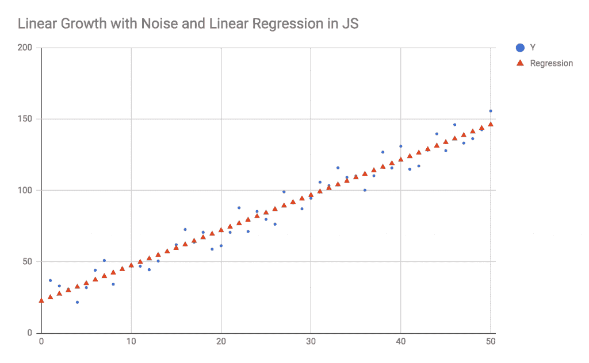

如前图所示，回归的结果与 Excel 或 Google Sheets 的趋势线功能给出的结果完全相同，区别在于我们是在 JavaScript 中生成的趋势线。

当被要求预测 *X = 75* 的未来值时，回归返回 *Y = 207.85*。使用我的原始公式，真实值应该是 209.5。我添加到数据中的噪声量相当于任何给定点的随机和均匀噪声水平 +/- 12.5，因此当考虑到噪声引起的不确定性时，预测值非常接近实际值。

然而，需要注意的是，随着你预测越来越远离原始数据域，回归误差会累积。当预测 X = 75 时，预测值与实际值之间的误差仅为 1.65。另一方面，如果我们预测 X = 1000，则真正的公式会返回 2,522，但回归会预测 2,492.6。在 X = 1000 时，实际值与预测值之间的误差现在为 29.4，接近 30，远超过由于噪声引起的不确定性。回归是非常有用的预测工具，但你必须始终记住，这些误差会累积，因此随着你远离数据集的域，预测将变得不那么准确。

这种预测误差的原因在于方程斜率的回归。原始方程中线的斜率是 2.5。这意味着对于 *X* 值的每单位变化，我们应该期望 *Y* 值变化 2.5 个单位。另一方面，回归确定斜率为 2.47。因此，对于 *X* 值的每单位变化，回归会继承一个微小的误差 -0.03。预测值将比实际值略低，这个量乘以你的预测的 *X* 距离。对于每 10 个单位的 *X*，回归会继承总共 -0.3 的误差。对于每 100 个单位的 *X*，回归会继承 -3.0 的误差，依此类推。当我们外推到 X=1000 时，我们继承了 -30 的误差，因为那个每单位微小的误差 -0.03 乘以我们在 *x* 轴上移动的距离。

当我们查看数据域内的值——X = 0 和 X = 50 之间的值——由于斜率略有差异，我们只会得到非常小的预测误差。在我们的数据域内，回归通过略微增加 y 截距值（原始值为 +22，回归返回 +22.6）来纠正斜率误差。由于我们数据中的噪声，回归公式 *y = 2.47x + 22.6* 比实际公式 *y = 2.5x + 22* 更好地拟合。回归找到一个略微平缓的斜率，并通过将整个线提高 0.6 个单位（y 截距的差异）来弥补这一点，因为这样更适合数据和噪声。这个模型在 X = 0 和 X = 50 之间拟合得非常好，但当我们尝试预测 X = 1000 时的值时，y 截距中轻微的 +0.6 修改已不足以弥补如此巨大距离上的斜率下降。

像这个例子中找到的线性趋势非常常见。有许多类型的数据表现出线性关系，只要你不尝试过度外推数据，就可以简单而准确地建模。在下一个例子中，我们将查看指数回归。

# 示例 2 – 指数回归

连续数据模式中的另一个常见趋势是 *指数增长**，它也通常被视为 *指数衰减。* 在指数增长中，未来的值与当前值成比例。这种类型增长的一般公式可以写成：

*y = y[0] (1 + r) x*

*y[0]* 表示数量的初始值（当 *x* = 0 时），而 *r* 是该数量的增长率。

例如，如果你在股市投资并期望每年有 5%的回报率（*r = 0.05*），初始投资为 10,000 美元，五年后你可以期望有 12,763 美元。指数增长公式适用于这里，因为明年你拥有的金额与今年你拥有的金额成比例，两年后你拥有的金额与明年你拥有的金额成比例，依此类推。这仅适用于你重新投资回报，导致你积极投资的金额每年增加。

指数增长方程的另一种形式如下：

*y = ae^(bx)*

其中 *b = ln(1 + r)*，*a* 是初始值 *y[0]*，而 *e* 是约等于 2.718 的欧拉常数。这种形式上的轻微变换在数学上更容易操作，并且通常是数学家用于分析的首选形式。在我们的股市投资例子中，我们可以将五年增长公式重写为 *y = 10000*e^(ln(1.05)*5)*，我们将会得到同样的结果 12,763 美元。

指数增长有时被称为 **曲棍球棒增长**，因为曲线的形状类似于曲棍球的轮廓：

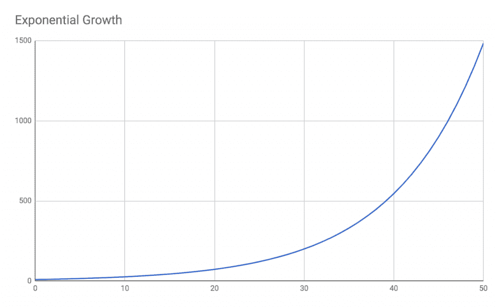

指数增长的例子包括：

+   人口增长；即世界人口或细菌培养生长

+   病毒式增长，例如疾病感染的分析或 YouTube 视频的病毒式传播

+   机械或信号处理中的正反馈回路

+   经济增长，包括复利

+   摩尔定律下计算机的处理能力

重要的是要注意，在几乎所有情况下，指数增长都是不可持续的。例如，如果你在预测培养皿中细菌菌落的增长，你可能会观察到一段时间的指数增长，然而一旦培养皿中的食物和空间耗尽，其他因素将占主导地位，增长将不再呈指数形式。同样，如果你的网站通过激励新用户邀请朋友来增加会员，你可能会看到一段时间内会员数的指数增长，但最终市场将饱和，增长会放缓。因此，在分析指数增长模型时必须谨慎，并理解推动指数增长的条件最终可能会改变。与线性回归类似，指数回归只适用于数据的适度外推。你的网站会员可能一年内会呈指数增长，但不可能持续十年；地球上只有 70 亿人口，你不能有 200 亿会员。

如果增长率*r*或参数*k*（称为**增长常数**）为负，那么你将得到指数衰减而不是指数增长。尽管在指数衰减中，未来的值与当前值成比例，但未来的值在比例上比当前值*小*。

指数衰减的一个实际应用是在碳-14 年代测定中。因为放射性碳-14 同位素以 5730 年的半衰期衰变为非放射性碳-12——这意味着在总体上，每 5730 年有一半的碳-14 衰变为碳-12——科学家可以使用指数衰减公式来计算出物体必须有多久才能达到碳-14 与碳-12 的适当比例。

指数衰减在物理学和力学中也有所体现，尤其是在弹簧-质量-阻尼问题中。验尸官和法医也可以利用这一原理，根据尸体温度以指数衰减的方式逐渐接近室温来确定死亡时间。

在指数回归中，我们的目标是确定参数*a*和*b*的值——初始值和增长常数。让我们用 JavaScript 来尝试一下。我们希望分析的数据是指数衰减的，并添加了随机传感器噪声：

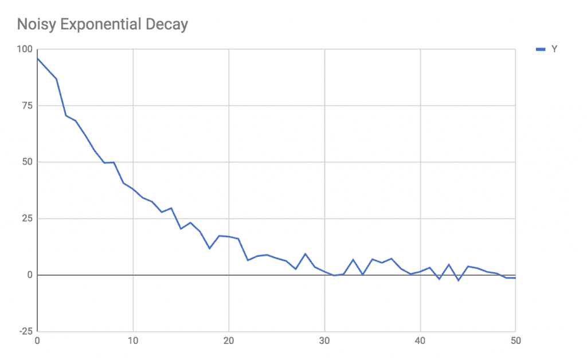

前面的图表显示了一些量，它从接近 100 开始衰减到大约 0。例如，这可以代表在 Facebook 上分享的帖子随时间变化的访问者数量。

尝试使用 Excel 或 Google Sheets 来拟合趋势线在这种情况下并不能帮助我们。线性趋势线并不适合指数曲线，不合适的拟合可以通过较差的 R²值来表示：

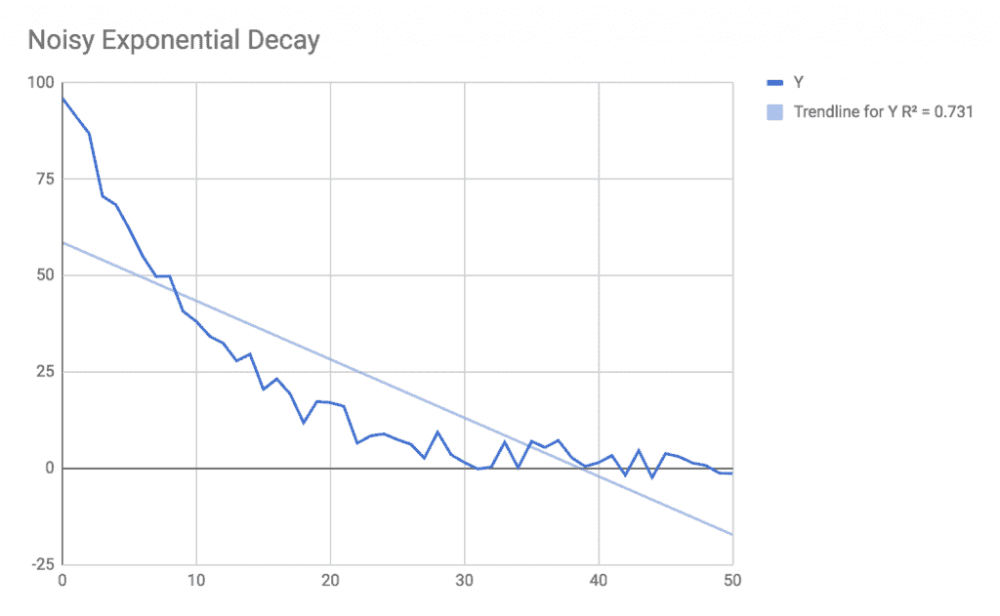

现在我们使用 JavaScript 来找到这个数据的回归，并预测数据集开始前一秒的值。将以下代码添加到`index.js`中；这是线性回归代码：

```py
console.log("Performing exponential regression:");
console.log("=============================");
const expModel = regression.exponential(data.exponential);
console.log("Initial value and rate:");
console.log(expModel.equation);
console.log("Exponential formula:");
console.log(expModel.string);
console.log("R² fitness: " + expModel.r2);
console.log("Predict X = -1: " + expModel.predict(-1)[1]);
```

使用`yarn start`运行程序，你应该看到以下输出，紧随线性回归示例的输出之后：

```py
 Performing exponential regression:
 =============================
 Initial value and rate:
 [ 94.45, -0.09 ]
 Exponential formula:
 y = 94.45e^(-0.09x)
 R² fitness: 0.99
 Predict X = -1: 103.34
```

我们可以立即看到高 R²值 0.99，这表明回归已经很好地拟合了数据。如果我们将这个回归与原始数据一起绘制，我们会看到以下结果：

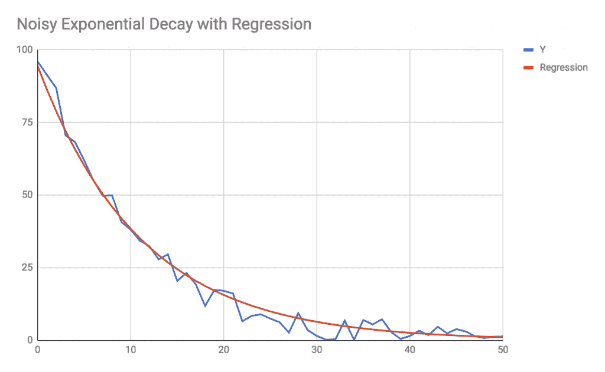

此外，我们还得到了 X = -1 时的预测值为 103，这与我们的数据拟合得很好。我用来生成测试数据的方程的原始参数是**a = 100**和**b = -0.1**，而预测的参数是**a = 94.5**和**b = -0.09**。噪声的存在对起始值产生了重大影响，如果没有噪声，起始值应该是 100，但实际上测量值为 96。当比较回归值**a**与实际值**a**时，你还必须考虑回归值**a**接近测量值（即使它离系统值相当远）这一事实。

在下一节中，我们将探讨多项式回归。

# 示例 3 – 多项式回归

多项式回归可以被认为是线性回归的更一般形式。多项式关系的形式为：

**y = a[0] + a[1]x¹ + a[2]x² + a[3]x³ + ... + a[n]x^n**

多项式可以有任意多个项，这被称为多项式的**次数**。对于多项式的每个次数，自变量**x**乘以某个参数**a[n]**，X 值被提升到**n**次幂。一条直线被认为是**一次**多项式；如果你更新前面的多项式公式以删除高于一次的所有次数，你将剩下：

**y = a[0] + a[1]x**

其中**a[0]**是 y 轴截距，**a[1]**是线的斜率。尽管符号略有不同，但这与**y = mx + b**是等价的。

二次方程，你可能还记得从高中数学中学过的，它仅仅是**二次**的多项式，或者**y = a[0] + a[1]x + a[2]x²**。三次方程是**三次**的多项式，四次方程是**四次**的多项式，以此类推。

多项式和多项式回归的属性使它们如此强大，是因为在有限的值范围内，几乎任何形状都可以用足够次数的多项式来描述。只要你不尝试过度外推，多项式回归甚至可以拟合正弦形状。多项式回归在某种程度上表现出与其他机器学习算法相似的性质，即如果你尝试过度外推，它们可能会过拟合并对于新的数据点变得非常不准确。

因为多项式可以是任何次数，所以你也必须配置回归的附加参数；这个参数可以猜测，或者你可以寻找最大化 R²拟合度的次数。这种方法与我们用于 k-means（当你事先不知道聚类数量时）的方法类似。

我们希望拟合的数据，当绘制时，看起来像这样：

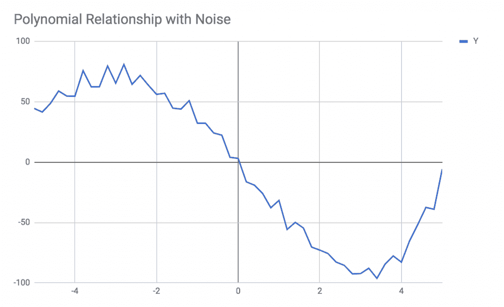

这个小数据窗口看起来是正弦形的，但实际上是多项式的；记住，多项式方程可以复制许多类型的形状。

将以下代码添加到`index.js`的底部：

```py
console.log("Performing polynomial regression:");
console.log("=============================");
const polyModel = regression.polynomial(data.polynomial, {order: 2});
console.log("Polynomial parameters");
console.log(polyModel.equation);
console.log("Polynomial formula:");
console.log(polyModel.string);
console.log("R² fitness: " + polyModel.r2);
console.log("Predict X = 6: " + polyModel.predict(6)[1]);
```

注意，我们已经将回归配置为`{order: 2}`，这意味着我们正在尝试用二次公式拟合数据。使用`yarn start`运行程序，可以看到以下输出：

```py
 Performing polynomial regression:
 =============================
 Polynomial parameters
 [ 0.28, -17.83, -6.6 ]
 Polynomial formula:
 y = 0.28x² + -17.83x + -6.6
 R² fitness: 0.75
 Predict X = 6: -103.5
```

这组数据的 R²拟合度相当低，为`0.75`，这表明我们可能使用了错误的`order`参数值。尝试将顺序增加到`{order: 4}`并重新运行程序，可以得到以下结果：

```py
 Performing polynomial regression:
 =============================
 Polynomial parameters
 [ 0.13, 1.45, -2.59, -40.45, 0.86 ]
 Polynomial formula:
 y = 0.13x⁴ + 1.45x³ + -2.59x² + -40.45x + 0.86
 R² fitness: 0.99
 Predict X = 6: 146.6
```

现在回归拟合得更好了，但代价是方程中添加了额外的多项式项。如果我们用原始数据来绘制这个回归，我们会看到以下输出，这确实很好地拟合了数据：

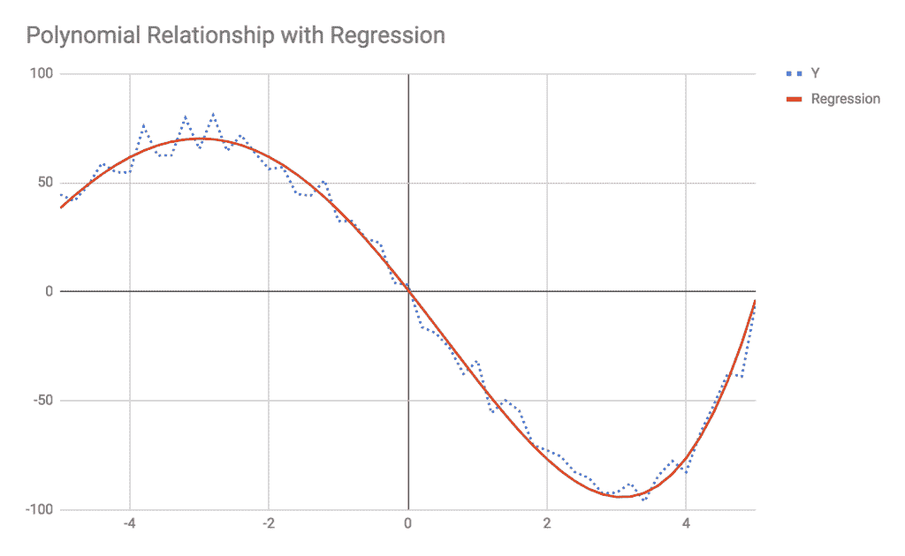

在下一节中，我们将探讨可以在时间序列数据上执行的其他类型分析，包括低通滤波器、高通滤波器和季节性分析。

# 其他时间序列分析技术

回归分析是分析连续数据的良好起点，然而，在分析特定的时间序列数据时，还有许多其他技术可以采用。虽然回归可以用于任何连续数据的映射，但时间序列分析专门针对随时间演变的连续数据。

时间序列数据有很多例子，例如：

+   服务器负载随时间变化

+   股票价格随时间变化

+   用户活动随时间变化

+   气候模式随时间变化

分析时间序列数据时的目标与使用回归分析连续数据时的目标相似。我们希望识别和描述影响随时间变化的值的各种因素。本节将描述一些超越回归的技术，您可以使用这些技术来分析时间序列数据。

在本节中，我们将探讨来自数字信号处理领域的技巧，该领域在电子学、传感器分析和音频信号处理中都有应用。虽然你的具体时间序列问题可能与这些领域无关，但数字信号处理应用中使用的工具可以应用于任何处理数字信号的领域。其中最显著的工具和技术包括滤波、季节性检测和频谱分析。我们将讨论这些技术，但我将把实现自己的示例和实验留给你。

# 滤波

在数字信号处理的背景下，滤波是一种用于过滤掉信号的高频或低频成分的技术。这些分别被称为**低通滤波器**和**高通滤波器**；低通滤波器允许低频信号通过，同时从信号中移除高频成分。还有**带通滤波器**和**陷波滤波器**，它们允许一定范围内的频率通过或从信号中截断一定范围的频率。

在电子学中，通过使用电容器、电阻和其他简单的电子元件来设计滤波器，以便只允许高于或低于一个**截止频率**的频率通过电路。在数字信号处理中，可以通过一个**无限脉冲响应**滤波器实现相同的效果，这是一种可以再现电子电路对时间序列数据影响的算法。

为了说明这一点，考虑以下数据：

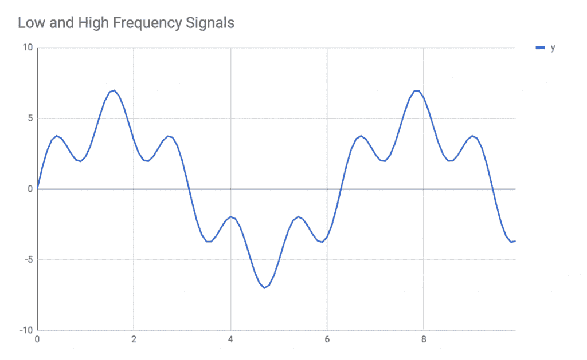

这组数据是通过组合两个正弦信号生成的，一个是低频信号，另一个是高频信号。如果我们单独绘制这两个信号，我们可以看到它们是如何组合成整体信号的：

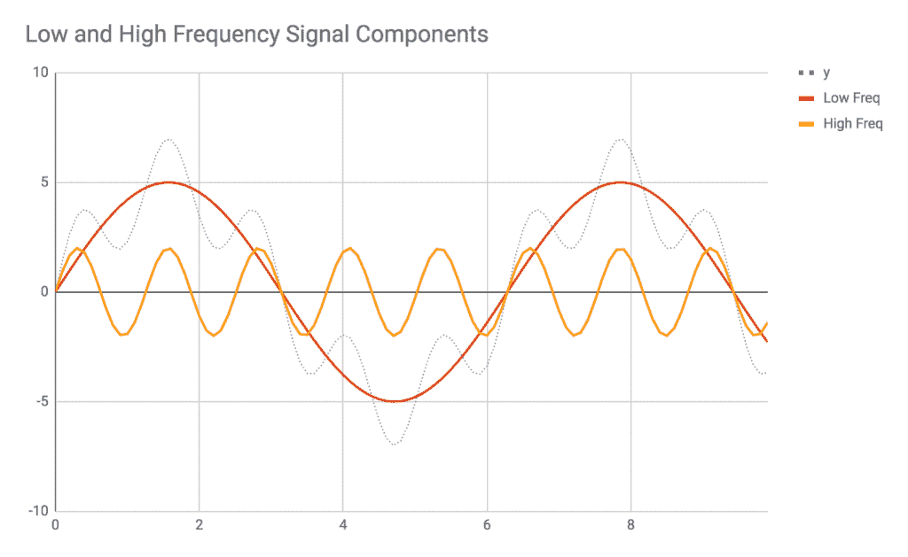

在过滤整体信号时，目标是提取信号的低频或高频成分，同时过滤掉另一个成分。这被称为**减法处理**，因为我们是从信号中移除（过滤）一个成分。

通常情况下，你应该使用低通滤波来隔离时间序列数据中的大范围、一般性的周期性趋势，同时忽略较快的周期性趋势。另一方面，当你希望探索短期周期性趋势而忽略长期趋势时，应该使用高通滤波。这种方法的一个例子是在分析访客流量时；你可以使用高通和低通滤波来选择性地忽略月度趋势与日度趋势。

# 季节性分析

在上一节的基础上，我们还可以使用数字信号处理来分析季节性趋势。季节性趋势是长期周期性（即低频）趋势，你希望从整体数据中减去，以便分析数据中的其他可能非周期性趋势。考虑以下图表：

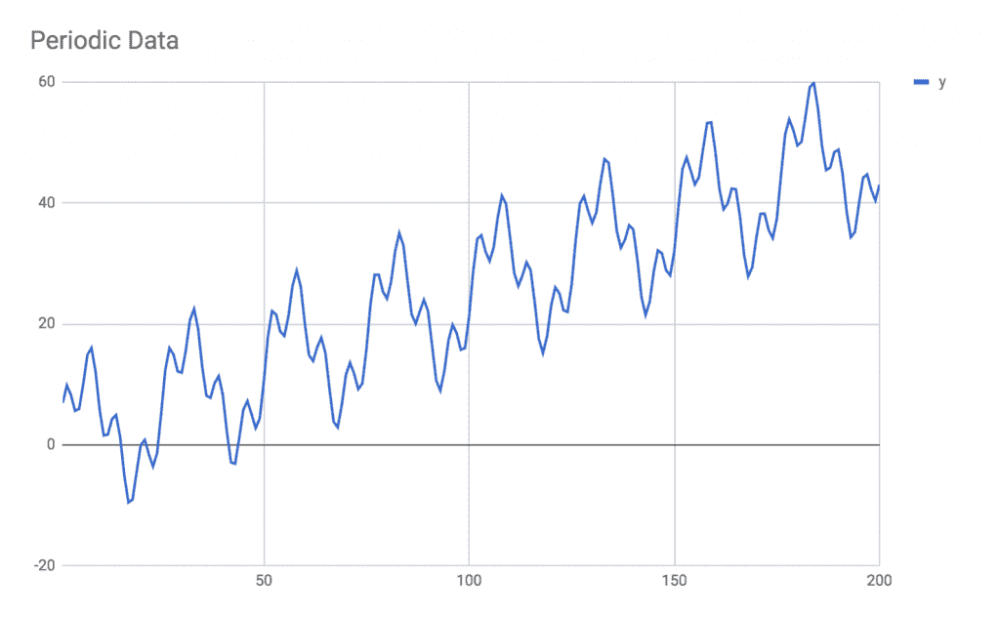

这份数据显示了活动周期性波动之上的线性增长组合。具体来说，这个数据趋势有两个周期性成分（一个低频和一个高频）和一个线性成分。

为了分析这些数据，首先的方法是识别线性趋势，无论是通过一个大的移动平均窗口还是通过线性回归。一旦确定了线性趋势，就可以从数据中减去它，以仅隔离周期性部分。以下是如何展示这个方法的：

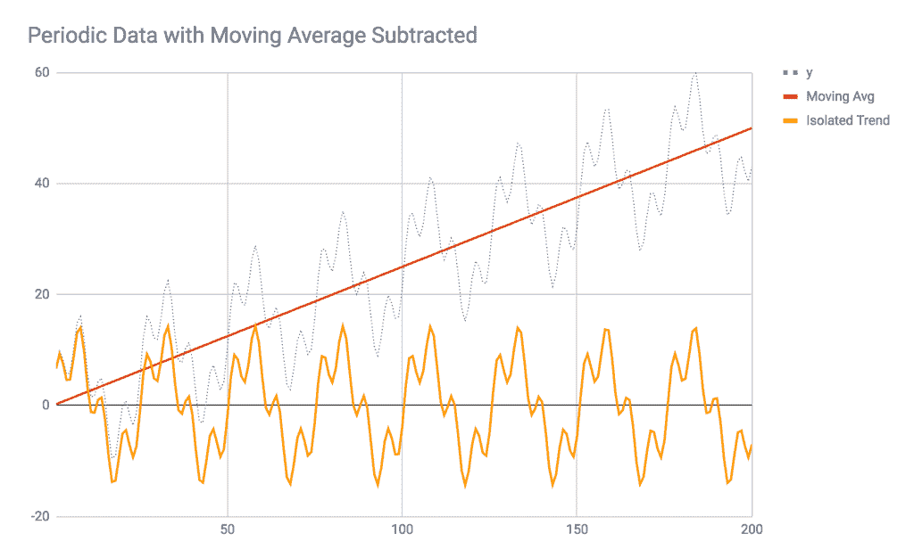

因为信号是可加的，所以你可以从原始数据中减去线性趋势，以隔离信号的非线性成分。如果你已经通过回归或其他方式识别了多个趋势，你可以继续从原始信号中减去你已识别的趋势，最终只剩下未识别的信号成分。一旦你识别并减去了所有的系统模式，你将只剩下传感器噪声。

在这种情况下，一旦你从数据中识别并减去线性趋势，你可以对结果信号进行滤波，以隔离低频和高频成分，或者可以对剩余信号进行*傅里叶分析*，以识别剩余成分的具体频率和幅度。

# 傅里叶分析

傅里叶分析是一种数学技术，用于将时间序列信号分解为其各自的频率分量。回想一下，任意阶数的多项式回归可以复制几乎任何信号形状。以类似的方式，多个正弦振荡器的总和可以复制几乎任何周期性信号。如果你曾经看到过*示波器*或*频谱分析仪*在工作，你就看到了傅里叶变换应用于信号的实时结果。简而言之，傅里叶变换将周期性信号，如我们在上一节中看到的，转换成类似以下的公式：

*a[1]sin(f[1]+φ[1]) + a[2]sin(f[2]+φ[2]) + a[3]sin(f[3]+φ[3]) + ... + a[n]sin(f[n]+φ[n]*) 

其中 *f[n]* 代表频率，*a[n]* 代表其幅度，*φ[n]* 代表相位偏移。通过组合任意数量的这些正弦信号，可以复制几乎任何周期性信号。

进行傅里叶分析有许多原因。最直观的例子与音频和声音处理相关。如果你取一个一秒钟长的音频样本，记录钢琴上演奏的 A4 音符，并对它进行傅里叶变换，你会看到 440 Hz 的频率具有最大的振幅。你还会看到 440 Hz 的谐波，如 880 Hz 和 1,320 Hz，也具有一定的能量。你可以使用这些数据来辅助音频指纹识别、自动调音、可视化以及许多其他应用。傅里叶变换是一种采样算法，因此它容易受到混叠和其他采样误差的影响。傅里叶变换可以用来部分重建原始信号，但在转换过程中会丢失很多细节。这个过程与对图像进行下采样然后再尝试上采样是相似的。

在几乎每个领域，傅里叶变换都有许多其他应用。傅里叶变换之所以受欢迎，是因为在数学上，许多类型的操作在频域中比在时域中更容易执行。在数学、物理和工程中，有许多问题在时域中非常难以解决，但在频域中却容易解决。

傅里叶变换是一种由特定算法执行的计算过程。最流行的傅里叶变换算法称为**快速傅里叶变换**（**FFT**），之所以命名为 FFT，是因为它比其前身*离散傅里叶变换*快得多。FFT 有一个显著的限制，即要分析样本的数量必须是 2 的幂，也就是说，它必须是 128、256、512、1,024、2,048 等等样本长。如果你有 1,400 个样本要分析，你必须将其截断到 1,024 个样本或填充到 2,048 个样本。通常，你会对较大的样本进行*加窗*；在钢琴音符录音的例子中，我们从实时或录制的信号中提取了一秒钟的样本。如果音频采样率为 44,100 Hz，那么我们就有了 44,100 个样本（一秒钟的样本）要提供给傅里叶变换。

当对来自较大信号的样本进行填充、截断或加窗时，你应该使用一个*窗函数*，这是一个在两端逐渐减小信号的函数，以便它不会被你的窗口锐利地截断。有许多类型的窗函数，每种都有其自己的数学特性和对信号处理的独特影响。一些流行的窗函数包括矩形窗和三角形窗，以及高斯窗、兰佐斯窗、汉宁窗、汉明窗和布莱克曼窗，它们在不同的分析类型中都具有可取的特性。

类似于 FFT 算法的傅里叶变换算法的输出是一个*频域频谱*。更具体地说，FFT 算法的输出将是一个数组或哈希表，其中键是频率桶（例如 0-10 Hz，10-20 Hz 等），值是幅度和相位。这些可能表示为复数、多维数组或算法实现中特定的其他结构。

所有采样算法都存在一些限制；这些限制是信号处理本身的限制。例如，如果您的信号包含高于*奈奎斯特频率*的成分，或者采样率的一半，就会发生混叠。在音频中，常见的采样率为 44,100 Hz，任何高于 22,050 Hz 的频率都会发生混叠，或者被错误地表示为低频信号。因此，使用低通滤波器预处理信号是一种常见的技术。同样，FFT 算法只能解析到奈奎斯特频率。FFT 算法将只返回与样本缓冲区大小一样多的频率桶，所以如果您提供 1,024 个样本，您将只得到 1,024 个频率桶。在音频中，这意味着每个频率桶的带宽为 44,100 Hz / 1,024 = 43 Hz。这意味着您可能无法区分 50 Hz 和 55 Hz，但您很容易就能区分 50 Hz 和 500 Hz。为了获得更高的分辨率，您需要提供更多的样本，然而，这反过来又会降低您窗口的时间分辨率。

您可以使用 FFT 来分析我们在上一节中看到的时间序列数据的周期部分。最好在从信号中减去线性趋势后执行 FFT。然而，如果您有足够高的频率分辨率，线性趋势可能只被解释为傅里叶变换的低频成分，因此是否需要减去线性趋势将取决于您的具体应用。

通过将 FFT 添加到本章中您所学的其他工具，您已经准备好应对大多数现实世界的回归或时间序列分析任务。每个问题都是独特的，您将必须仔细考虑您任务中需要哪些特定的工具。

# 摘要

在本章中，您学习了在预测、信号处理、回归和时间序列数据分析中使用的许多技术。由于预测和时间序列分析是一个广泛的类别，没有单一的算法可以涵盖所有情况。相反，本章为您提供了一个初始的工具箱，其中包含了一些重要的概念和算法，您可以从这些算法开始应用到您的预测和回归任务中。

具体来说，你学习了回归和分类之间的区别。分类将标签分配给数据点，而回归则试图预测数据点的数值。并非所有的回归都是必要的预测，但回归是预测中使用的最显著的单一技术。

在学习回归的基本知识之后，我们探索了几种特定的回归类型。具体来说，我们讨论了线性、多项式和对数回归。我们看到了回归如何处理噪声，以及我们如何利用它来预测未来的值。

然后，我们转向更广泛的时间序列分析概念，并讨论了核心概念，例如从信号中提取趋势。我们讨论了在数字信号处理中适用的工具，这些工具适用于时间序列分析，例如低通和高通滤波器、季节性分析和傅里叶变换。

在下一章中，我们将探讨更高级的机器学习模型。具体来说，我们将学习神经网络——顺便提一下，神经网络也可以执行回归。
