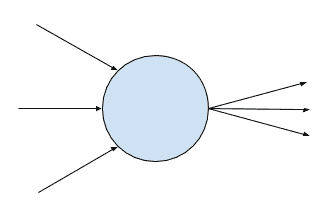
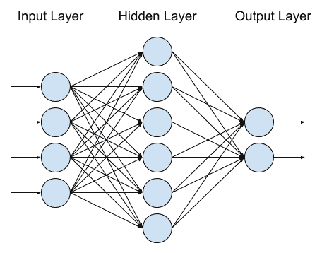
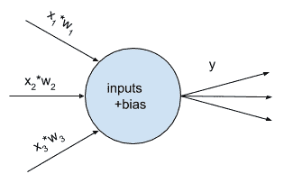
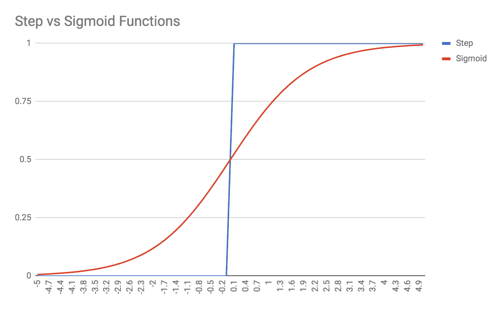
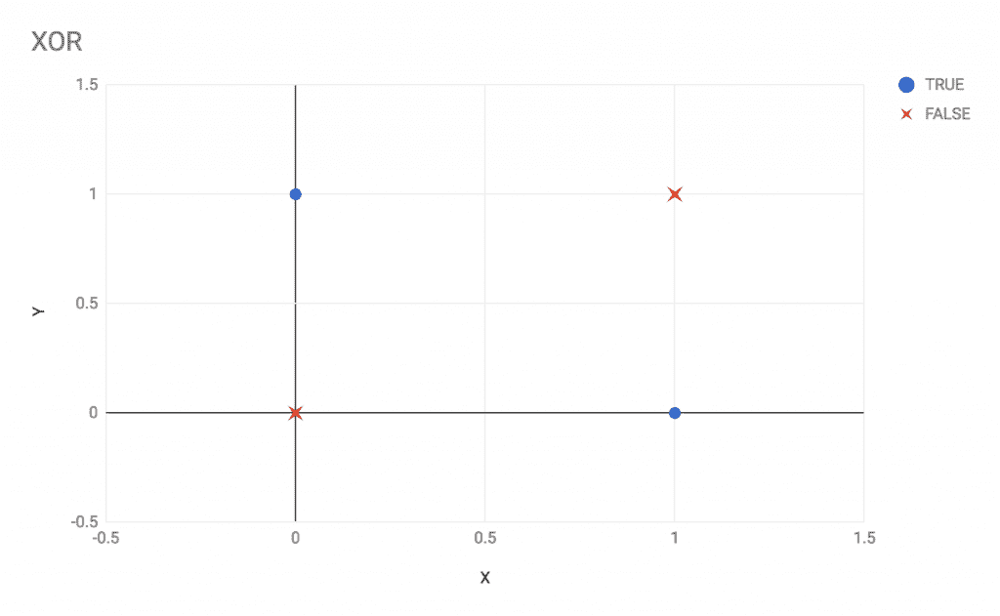
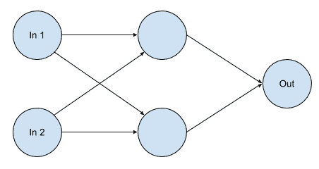
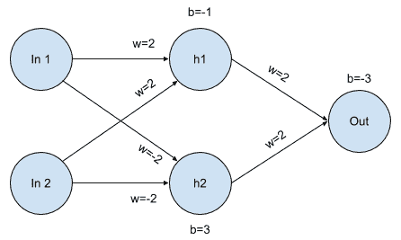

# 人工神经网络算法

**人工神经网络（ANNs**）或简称 NNs，可能是今天最流行的**机器学习（ML**）工具，如果不是最广泛使用的。当时的科技媒体和评论喜欢关注神经网络，许多人认为它们是神奇的算法。人们相信神经网络将为**通用人工智能（AGI**）铺平道路——但技术现实却大不相同。

虽然神经网络功能强大，但它们是高度专业化的机器学习模型，专注于解决单个任务或问题——它们不是可以现成解决问题的神奇**大脑**。一个表现出 90%准确率的模型通常被认为是好的。神经网络训练缓慢，需要精心设计和实现。尽管如此，它们确实是高度熟练的问题解决者，可以解开甚至非常困难的问题，例如图像中的物体识别。

神经网络可能在实现通用人工智能（AGI）中扮演重要角色。然而，许多其他机器学习（ML）和**自然语言处理（NLP**）领域也将需要参与其中。因为人工神经网络（ANNs）仅仅是专门的问题解决者，普遍认为通往 AGI 的道路是通过成千上万的人工神经网络的大集合，每个网络针对一个特定的任务进行优化。我个人认为，我们可能会很快看到类似 AGI 的东西。然而，AGI 最初只能通过巨大的资源来实现——不是指计算能力，而是指训练数据。

在本章中，你将学习神经网络的基础知识。神经网络有许多使用方式，以及许多可能的拓扑结构——我们将在本章和第九章深度神经网络中讨论其中的一些。每种神经网络拓扑都有其自身的目的、优势和劣势。

首先，我们将从概念上讨论神经网络。我们将检查它们的组件和构建，并探讨它们的应用和优势。我们将讨论反向传播算法以及如何训练人工神经网络。然后，我们将简要地看一下人工神经网络的数学，接着深入探讨野外神经网络的实用建议。最后，我们将使用`TensorFlow.js`库演示一个简单神经网络的例子。

本章我们将涵盖以下主题：

+   神经网络的概念概述

+   反向传播训练

+   示例——`TensorFlow.js`中的 XOR

# 神经网络的概念概述

人工神经网络（ANNs）几乎与计算机一样历史悠久，最初确实是由电子硬件构建的。第一个 ANN 是在 20 世纪 70 年代开发的，用于自适应地过滤电话线路传输中的回声。尽管它们最初取得了早期成功，但 ANNs 在 1985 年中期之前一直不太受欢迎，那时反向传播训练算法被普及。

ANNs 是基于我们对生物大脑的理解构建的。ANN 包含许多相互连接的神经元。这些神经元连接的方式、结构和组织被称为网络的**拓扑结构**（或**形状**）。每个单独的神经元是一个简单的结构：它接受几个数值输入值，并输出一个数值，这个数值可能随后被传输到几个其他神经元。以下是一个简单的、概念性的神经元示例：



神经元通常但并非总是排列成层。神经元的具体排列和连接由网络的拓扑结构定义。然而，大多数人工神经网络（ANNs）将具有三到四个全连接层，或者每一层的每个神经元都连接到下一层的每个神经元的层。在这些常见的拓扑结构中，第一层是输入层，最后一层是输出层。输入数据直接馈送到输入神经元，算法的结果从输出神经元读取。在输入层和输出层之间，通常有一到两个用户或程序员不直接交互的隐藏层。以下图显示了具有三个层的神经网络：



输入层有四个神经元，单个隐藏层有六个神经元，输出层有两个神经元。描述这种网络的简写方法是列出每层的神经元数量，因此可以简称为**4-6-2 网络**。这样的网络能够接受四个不同的特征，并输出两份数据，例如 X/Y 坐标，两个属性的布尔值，或者如果输出被视为二进制位，甚至可以是 0-3 的数字。

当使用 ANN 进行预测时，你实际上是在使用前馈模式下的网络，这实际上相当简单。我们将深入讨论神经元的机制，但就目前而言，你需要知道的是，一个神经元接受多个输入，并根据简单的加权总和和光滑函数（称为**激活函数**）生成单个输出。

为了做出预测，你直接将输入数据加载到输入神经元中。如果你的问题是图像识别问题，那么每个输入神经元可能被提供单个像素的灰度强度（处理一个 50 x 50 像素的灰度图像可能需要 2,500 个输入神经元）。输入神经元被激活，意味着它们的输入被求和、加权、加偏差，然后将结果输入到激活函数中，该函数将返回一个数值（通常在-1 和+1 之间，或 0 和+1 之间）。输入神经元随后将它们的激活输出发送到隐藏层的神经元，这些神经元经历相同的过程，并将结果发送到输出层，输出层再次被激活。算法的结果是输出层激活函数的值。如果你的图像识别问题是具有 15 个可能类别的分类问题，那么输出层将有 15 个神经元，每个神经元代表一个类别标签。输出神经元将返回 1 或 0 的值（或介于两者之间的分数），具有最高值的输出神经元是图像最可能代表的类别。

为了理解像这样的网络实际上是如何产生结果的，我们需要更仔细地研究神经元。在人工神经网络中，神经元有几个不同的特性。首先，一个神经元保持一组（一个向量）的权重。每个输入到神经元的值都乘以其相应的权重。如果你看前面图像中隐藏层最顶部的神经元，你可以看到它从输入层的神经元接收四个输入。因此，隐藏层中的每个神经元必须有一个包含四个权重的向量，每个权重对应于前一层发送信号的神经元。权重基本上决定了特定输入信号对相关神经元的重要性。例如，最顶部的隐藏层神经元可能对最底部的输入神经元有一个权重为 0；在这种情况下，两个神经元基本上是未连接的。另一方面，下一个隐藏神经元可能对最底部的输入神经元有一个非常高的权重，这意味着它非常重视其输入。

每个神经元还有一个偏差。偏差不适用于任何一个单独的输入，而是在激活函数被调用之前添加到加权输入的总和中。偏差可以看作是神经元激活阈值的修饰器。我们很快就会讨论激活函数，但让我们先看看神经元的更新图示：



描述神经元的数学形式大致如下，其中粗体数字 **w** 和 **x** 代表输入和权重的向量（即[x[1], x[2], x[3]]），非粗体 *b* 和 *y* 分别代表神经元的偏差和输出，而 *fn(...)* 代表激活函数。下面是具体内容：

*y = fn( **w·x** + b)*

**w** 和 **x** 之间的点表示两个向量的向量点积。另一种写**w·x**的方式是 *w[1]*x[1] + w[2]*x[2] + w[3]*x[3] + … + w[n]*x[n]*，或者简单地表示为 Σ*[j] w[j]*x[j]*。

总的来说，网络中神经元的权重和偏置实际上负责学习和计算。当你训练一个神经网络时，你是在逐渐更新权重和偏置，目的是将它们配置来解决你的问题。具有相同拓扑结构（例如，两个全连接的 10-15-5 网络）但不同权重和偏置的两个神经网络是不同的网络，将解决不同的问题。

激活函数在这个过程中的作用是什么？人工神经元的原始模型被称为感知器，其激活函数是阶跃函数。基本上，如果一个神经元的***w·x** + b*大于零，那么神经元将输出 1。另一方面，如果***w·x** + b*小于零，那么神经元将输出零。

这个早期的感知器模型之所以强大，是因为可以用人工神经元来表示逻辑门。如果你曾经上过布尔逻辑或电路的课程，你就会知道你可以使用 NAND 门来构建任何其他类型的逻辑门，并且用感知器构建 NAND 门是极其容易的。

想象一个接受两个输入的感知器，每个输入的权重为-2。感知器的偏置为+3。如果两个输入都是 0，那么***w·x** + b = +3*（仅仅是权重，因为所有输入都是零）。由于感知器的激活函数是阶跃函数，在这种情况下神经元的输出将是 1（+3 大于零，因此阶跃函数返回+1）。

如果输入是 1 和 0，无论顺序如何，那么***w·x** + b = +1*，因此感知器的输出也将是 1。然而，如果两个输入都是 1，那么***w·x** + b = -1*。两个输入，权重都是-2，将克服神经元的偏置+3，激活函数（返回 1 或 0）将返回 0。这就是 NAND 门的逻辑：如果两个输入都是 1，感知器将返回 0，对于任何其他输入组合，它将返回 1。

这些早期结果在 20 世纪 70 年代激发了计算机科学和电子学界的兴趣，人工神经网络（ANNs）受到了大量的炒作。然而，我们很难自动训练神经网络。感知器可以通过手工制作来表示逻辑门，并且对神经网络进行一定程度的自动训练是可能的，但对于大规模问题仍然难以接近。

问题在于用作感知器激活函数的阶跃函数。在训练人工神经网络时，你希望网络权重或偏置的微小变化只会导致网络输出的微小变化。但阶跃函数阻碍了这个过程；权重的一个微小变化可能不会改变输出，但下一个微小变化可能导致输出发生巨大变化！这是因为阶跃函数不是一个平滑函数——一旦越过阈值，它就会从 0 突然跳到 1，而在所有其他点上它恰好是 0 或恰好是 1。这种感知器的限制，以及因此人工神经网络的重大限制，导致了十多年的研究停滞。

最终，1986 年，研究人员重新发现了几年前就已经发现的一种训练技术。他们发现，这种称为**反向传播**的技术使训练变得更快、更可靠。因此，人工神经网络经历了第二次发展。

# 反向传播训练

有一个关键的洞察力将神经网络研究从停滞中带入了现代时代：为神经元选择更好的激活函数。阶跃函数导致网络自动训练出现问题，因为网络参数（权重和偏置）的微小变化可能会交替产生没有效果或突然的重大效果。显然，这不是一个可训练系统的期望属性。

自动训练人工神经网络的一般方法是从输出层开始，逆向工作。对于训练集中每个示例，你以前馈模式（即**预测模式**）运行网络，并将实际输出与期望输出进行比较。用于比较期望结果与实际结果的好指标是**均方误差**（**MSE**）；测试所有训练示例，并对每个示例计算输出与期望值之间的差异并平方。将所有平方误差相加，并除以训练示例的数量，你就得到了一个成本函数或损失函数。成本函数是给定网络拓扑的权重和偏置的函数。训练人工神经网络的目标是将成本函数降低到——理想情况下——零。你可以使用人工神经网络在所有训练示例上的准确率作为成本函数，但均方误差在训练中具有更好的数学特性。

反向传播算法的关键在于以下洞察：如果你知道所有神经元的权重和偏置，如果你知道输入和期望的输出，以及如果你知道神经元使用的激活函数，你可以从输出神经元开始反向工作，以发现哪些权重或偏置对大的误差有贡献。也就是说，如果神经元 Z 有来自神经元 A、B 和 C 的输入，它们的权重分别为 100、10 和 0，你就会知道神经元 C 对神经元 Z 没有影响，因此神经元 C 没有对神经元 Z 的误差做出贡献。另一方面，神经元 A 对神经元 Z 有巨大的影响，所以如果神经元 Z 有一个大的误差，那么很可能是神经元 A 的责任。反向传播算法之所以得名，是因为它通过网络将输出神经元的误差反向传播。

将这个概念进一步扩展，如果你还知道激活函数及其与权重、偏置和误差之间的关系，你可以确定权重需要改变多少才能使神经元的输出产生相应的变化。当然，在人工神经网络中有很多权重，它是一个高度复杂的系统，所以我们使用的方法是对权重进行微小的调整——我们只能使用对权重微小变化的简化近似来预测网络输出的变化。这个方法的一部分被称为梯度下降，之所以得名，是因为我们试图通过调整权重和偏置来降低成本函数的梯度（斜率）。

为了形象地理解这一点，想象一个挂在两棵树之间的尼龙吊床。吊床代表成本函数，而*x*和*y*轴（从天空看）抽象地代表网络的偏置和权重（实际上，这是一个多千维度的图像）。存在一些权重和偏置的组合，使得吊床挂得最低：那个点就是我们的目标。我们是一只坐在吊床表面某处的微小蚂蚁。我们不知道吊床最低点在哪里，而且我们太小了，即使布料上的褶皱或折痕也能让我们偏离方向。但我们知道吊床是光滑且连续的，我们可以在我们周围摸索。只要我们在每一步都朝下山方向前进，我们最终会在吊床中找到最低点——或者至少，一个接近我们起始点（局部最小值）的低点，这取决于吊床形状的复杂程度。

这种梯度下降的方法要求我们数学上理解和能够描述成本函数的梯度，这意味着我们也必须理解激活函数的梯度。函数的梯度本质上是其斜率或导数。我们不能使用感知器原始的步函数作为激活函数的原因是步函数在所有点上都是不可微分的；步函数在 0 和 1 之间巨大的、瞬间的跳跃是一个不可微分的间断。

一旦我们弄清楚我们应该使用梯度下降和反向传播来训练我们的神经网络，其他事情就变得容易了。我们不再使用步函数作为神经元激活函数，而是开始使用 Sigmoid 函数。Sigmoid 函数通常呈阶梯函数形状，但它们被平滑了，是连续的，并且在所有点上都是可微分的。以下是一个 Sigmoid 函数与步函数的例子：



有许多类型的 Sigmoid 函数；前一个函数由方程 *y = 1 / (1+e^(-x))* 描述，被称为**逻辑函数**或**逻辑曲线**。其他流行的 Sigmoid 函数是双曲正切（即 tanh），其范围从 -1 到 +1，与逻辑函数的范围 0 到 +1 相比。另一个流行的激活函数是**修正线性单元**（**ReLU**），它常用于图像处理和输出层。还有 *softplus* 函数，其导数实际上是逻辑函数本身。你选择的激活函数将取决于你想要的特定数学属性。在不同的网络层中使用不同的激活函数也很常见；隐藏层通常会使用逻辑或 tanh 激活函数，而输出层可能会使用 *softmax*，输入层可能会使用 ReLU。然而，你可以为你的神经元发明自己的激活函数，但你必须能够微分该函数并确定其梯度，以便将其与反向传播算法集成。

对神经元激活函数的这种微小改变对我们训练人工神经网络产生了巨大的影响。一旦我们开始使用可微分的激活函数，我们就能计算成本和激活函数的梯度，并利用这些信息来确定在反向传播算法中如何精确地更新权重。神经网络训练变得更快、更强大，神经网络被推进到现代时代，尽管它们仍然需要等待硬件和软件库的跟进。更重要的是，神经网络训练成为了一项数学研究——尤其是矢量微积分——而不是仅限于计算机科学家的研究。

# 示例 - TensorFlow.js 中的 XOR 操作

在这个例子中，我们将使用`TensorFlow.js`前馈神经网络来解决 XOR 问题。首先，让我们探索 XOR 问题，以及为什么它对我们来说是一个好的起点。

XOR，或称为*排他或*操作，是一个布尔运算符，当且仅当其输入中只有一个为真时返回真。与您更熟悉的常规布尔 OR 运算符相比，后者在两个输入都为真时返回真——XOR 在两个输入都为真时返回假。以下是一个比较 XOR 和 OR 的表格；我已经突出显示了 OR 和 XOR 不同的情况：

| **输入 1** | **输入 2** | **OR** | **XOR** |
| --- | --- | --- | --- |
| False | False | False | False |
| False | True | True | True |
| True | False | True | True |
| True | True | **True** | **False** |

为什么 XOR 问题对我们来说是一个好的测试？让我们在图上绘制 XOR 操作：



观察前面的图表，我们可以看到在 XOR 操作中涉及的两个类别在图上不是线性可分的。换句话说，不可能画出一条直线来将前面的图中的圆圈与 X 分开。

XOR 操作非常简单，但类别不是线性可分的事实，使得 XOR 操作在测试新的分类算法时是一个极好的起点。您不需要一个复杂的数据集来测试新的库或算法是否适合您。

在跳入 TensorFlow 示例之前，让我们首先讨论我们如何手动构建一个解决 XOR 的神经网络。我们将设计自己的权重和偏差，看看我们是否能开发出一个手动神经网络来解决 XOR。

首先，我们知道网络需要两个输入和一个输出。我们知道输入和输出是二进制的，因此我们必须选择范围在[0, 1]的激活函数；ReLU 或 sigmoid 是合适的，而 tanh，其范围是[-1, 1]，则不太合适。

最后，我们知道 XOR 不是线性可分的，因此不能轻易解决；我们需要在网络上添加一个隐藏层。因此，让我们尝试构建一个 2-2-1 神经网络：



接下来，我们需要考虑网络中神经元的权重和偏差。我们知道网络需要设计成对两个输入都为真时有一个惩罚。因此，一个隐藏层神经元应该表示一个弱正信号（即，当输入被激活时它会被激活），而另一个隐藏层神经元应该表示一个强负信号（即，如果两个输入都为真，这个神经元应该压倒弱正神经元）。

这是一个可以用来实现 XOR 的一组权重的示例：



让我们进行几个示例计算。我将从两个输入都为真的不同情况开始。隐藏的 **h1** 神经元将有一个总加权输入为 4，因为每个输入的权重是 2，且两个输入都为真。h1 神经元还有一个 -1 的偏差，然而，这个偏差不足以使神经元失活。因此，h1 神经元的带偏差输入总和是 3；由于我们还没有决定一个特定的激活函数，我们不会尝试猜测实际的激活会变成什么——只需说一个 +3 的输入足以激活神经元。

我们现在将注意力转向隐藏的 **h2** 神经元。它也接收来自两个输入神经元的输入，然而，这些权重是负的，因此它接收到的无偏差输入总和是 -4。h2 的偏差是 +3，所以 h2 的总带偏差输入是 -1。如果我们选择 ReLU 激活函数，神经元的输出将是零。无论如何，h2 没有被激活。

最后，我们来看看输出节点。它从 h1 接收一个 +2 的加权输入，但从 h2 接收不到输入。由于输出节点的偏差是 -3（本质上要求 h1 和 h2 都被激活），输出节点将返回 0 或假。这是当两个输入都设置为真或 1 时 XOR 的预期结果。

让我们类似地列出其他 XOR 情况的结果。`h1`、`h2` 和 `Out` 列代表神经元在应用激活函数之前的加权带偏差输入（因为我们还没有选择一个）。只需记住，每个神经元将向下一个神经元传输 [0, 1] 范围内的值；激活函数应用后，它不会发送像 -1 或 3 这样的值：

| **In 1** | **In 2** | **h1** | **h2** | **Out** |
| --- | --- | --- | --- | --- |
| 0 | 0 | -1 | 3 | -1 |
| 0 | 1 | 1 | 1 | 1 |
| 1 | 0 | 1 | 1 | 1 |
| 1 | 1 | 3 | -1 | -1 |

前面的表格证明了手工制作的 ANN 对所有 XOR 测试案例都有效。它也让我们对网络的内部工作原理有了一点了解。隐藏的 h1 和 h2 神经元有特定的作用。h1 神经元默认是关闭的，但很容易满足，如果任何输入是活跃的，它就会变得活跃；h1 实质上是一个典型的 OR 操作。另一方面，h2 默认是开启的，只有当两个输入都开启时才能被关闭；h2 实质上是一个 NAND 操作。输出神经元需要 h1 和 h2 都活跃，因此输出神经元是一个 AND 操作。

让我们现在使用 `TensorFlow.js` 库来看看我们是否能取得同样的成功。在你的电脑上，创建一个名为 `Ch8-ANN` 的新文件夹。添加以下 `package.json` 文件，然后执行 `yarn install`：

```py
{
  "name": "Ch8-ANN",
  "version": "1.0.0",
  "description": "ML in JS Example for Chapter 8 - ANN",
  "main": "src/index.js",
  "author": "Burak Kanber",
  "license": "MIT",
  "scripts": {
    "build-web": "browserify src/index.js -o dist/index.js -t [ babelify --presets [ env ] ]",
    "build-cli": "browserify src/index.js --node -o dist/index.js -t [ babelify --presets [ env ] ]",
    "start": "yarn build-cli && node dist/index.js"
  },
  "dependencies": {
    "@tensorflow/tfjs": "⁰.9.1",
    "babel-core": "⁶.26.0",
    "babel-plugin-transform-object-rest-spread": "⁶.26.0",
    "babel-preset-env": "¹.6.1",
    "babelify": "⁸.0.0",
    "browserify": "¹⁵.1.0"
  }
}
```

现在添加 `src/index.js` 文件并导入 TensorFlow：

```py
import * as tf from '@tensorflow/tfjs';
```

TensorFlow 不仅仅是一个 ANN 库。TensorFlow 库提供了一系列在 ANN 和通用 ML（机器学习）以及线性代数（即向量/矩阵数学）问题中都很有用的构建块。因为 TensorFlow 更像是一个工具箱而不是一个单一的工具，所以解决任何给定问题的方式总是多种多样的。

让我们从创建一个顺序模型开始：

```py
const model = tf.sequential();
```

TensorFlow 的*模型*是高级容器，本质上运行函数；它们是从输入到输出的映射。你可以使用 TensorFlow 的低级算子（库中附带线性代数工具）来构建你的模型，或者你可以使用一个高级模型类。在这种情况下，我们正在构建一个*顺序模型*，它是 TensorFlow 通用模型的一个特例。你可以将顺序模型视为一个仅向前传播，不涉及任何内部递归或反馈循环的神经网络。顺序模型本质上是一个传统的神经网络。

接下来，让我们向模型中添加层：

```py
model.add(tf.layers.dense({units: 4, activation: 'relu', inputDim: 2}));
model.add(tf.layers.dense({units: 4, activation: 'relu'}));
model.add(tf.layers.dense({units: 1, activation: 'sigmoid'}));
```

我们正在将三层添加到我们的模型中。所有层都是**密集**层，这意味着它们与下一层完全连接。这正是从传统的神经网络中期望得到的结果。我们为每一层指定了*单元*——单元是 TensorFlow 对神经元的称呼，因为 TensorFlow 可以在 ANN（人工神经网络）以外的环境中使用。我选择在每个层中使用四个神经元而不是两个，因为我发现额外的神经元大大提高了训练过程的速度和鲁棒性。我们在第一层中指定了`inputDim`，告诉该层它应该期望每个数据点有两个输入。第一和第二层使用 ReLU 激活函数。第三层，也就是输出层，只有一个单元/神经元，并使用熟悉的 sigmoid 激活函数，因为我希望结果能够更快地趋近于 0 或 1。

现在我们必须编译模型，然后才能使用它。我们将指定一个损失函数，这可以是库中预构建的损失函数，也可以是我们提供的自定义损失函数。我们还将指定我们的优化器；我们在本章前面讨论了梯度下降，但还有许多其他优化器可供选择，例如 Adam、Adagrad 和 Adadelta。在这种情况下，我们将使用随机梯度下降优化器（对于传统的神经网络来说是典型的），然而，我们将选择`binaryCrossentropy`损失函数，这对于我们的二分类任务来说比均方误差更合适：

```py
const learningRate = 1;
const optimizer = tf.train.sgd(learningRate);
model.compile({loss: 'binaryCrossentropy', optimizer, metrics: ['accuracy']});
```

我们还设置了梯度下降优化器的学习率；学习率决定了反向传播训练算法在每次训练生成或 epoch 中修改权重和偏置的程度。较低的学习率会导致网络训练时间更长，但会更稳定。较高的学习率会使网络训练得更快，但可靠性较低；如果学习率过高，你的网络可能根本无法收敛。

最后，我们在编译步骤中添加了`metrics: ['accuracy']`。这允许我们在最终调用`model.evaluate`时获取关于网络准确性的报告。

接下来，我们将设置我们的训练数据，这仅仅是四个数据点。TensorFlow 在**张量**上操作，张量本质上是一种数学矩阵。TensorFlow 的张量是不可变的，对张量执行的所有操作都会返回新的张量，而不是修改现有的张量。如果您需要就地修改张量，您必须使用 TensorFlow 的**变量**，这些变量是围绕张量的可变包装器。TensorFlow 要求所有数学运算都通过张量进行，以便库可以优化 GPU 处理：

```py
// XOR data x values.
const xs = tf.tensor([
    [0, 0],
    [0, 1],
    [1, 0],
    [1, 1]
],
// Shape of the tensor is 4 rows x 2 cols
[4, 2]);

// XOR data y values.
const ys = tf.tensor([ 0, 1, 1, 0 ], [4, 1]);
```

因为张量是矩阵，所以每个张量都有一个**形状**。对于二维张量，形状定义为*[行，列]*。对于三维张量，形状是*[行，列，深度]*；图像处理通常使用三维张量，其中行和列代表像素的 Y 和 X 坐标，深度代表该像素的颜色通道（例如，RGBA）。由于我们有四个训练示例，并且每个训练示例需要两个输入字段，因此我们的输入张量具有四行两列的形状。同样，我们的目标值张量具有四行一列的形状。如果您尝试使用错误的输入和输出形状进行计算或训练模型，TensorFlow 将抛出错误。

我们的最后一步是用数据训练模型，然后评估模型。TensorFlow 的`model.fit`方法是训练模型的方法，一旦训练完成，我们可以使用`model.evaluate`来获取统计数据，例如准确性和损失，我们还可以使用`model.predict`在前馈或预测模式下运行模型：

```py
model.fit(xs, ys, {epochs: 1000}).then(() => {
    console.log("Done training. Evaluating model...");
    const r = model.evaluate(xs, ys);

    console.log("Loss:");
    r[0].print();
    console.log("Accuracy:");
    r[1].print();

    console.log("Testing 0,0");
    model.predict(tf.tensor2d([0, 0], [1, 2])).print();
    console.log("Testing 0,1");
    model.predict(tf.tensor2d([0, 1], [1, 2])).print();
    console.log("Testing 1,0");
    model.predict(tf.tensor2d([1, 0], [1, 2])).print();
    console.log("Testing 1,1");
    model.predict(tf.tensor2d([1, 1], [1, 2])).print();
});
```

添加代码后，从命令行运行`yarn start`。对我来说，运行这个模型大约需要 60 秒。当模型完成时，您应该看到以下类似输出。请注意，ANNs 和随机梯度下降优化器在初始化和处理时使用随机值，因此模型的某些运行可能不成功，具体取决于特定的随机初始条件。以下是将获得的输出：

```py
Done training. Evaluating model...
 Loss:
 Tensor
 0.00011571444338187575
 Accuracy:
 Tensor
 1
 Testing 0, 0
 Tensor
 [[0.0001664],]
 Testing 0, 1
 Tensor
 [[0.9999378],]
 Testing 1, 0
 Tensor
 [[0.9999322],]
 Testing 1, 1
 Tensor
 [[0.0001664],]
```

前面的输出显示模型已经学会了模拟 XOR。损失值非常低，而准确率为 1.0，这对于这样一个简单的问题来说是必需的。在现实世界的问题中，80-90%的准确率更为现实。此外，程序的输出显示了四个测试案例的每个案例的单独预测。您可以看到 sigmoid 激活函数的影响，值非常接近 0 和 1，但并未完全达到。内部，TensorFlow 将这些值四舍五入，以确定分类是否正确。

到目前为止，你应该对网络参数进行一些实验。如果你减少训练的 epoch 数量会发生什么？如果你将 ReLU 层切换为 sigmoid 层会发生什么？如果你将前两层中的单元/神经元数量减少到两个会发生什么？如果你增加训练的 epoch 数量，会发生什么？学习率对训练过程有什么影响？这些都是最好通过试错而不是讲座来发现的事情。这是一个无限灵活的神经网络模型，能够处理比简单的 XOR 示例更复杂的问题，因此你应该通过实验和研究来深入了解所有这些属性和参数。

虽然这个例子只是一个简单的异或（XOR）样本，但这种方法也可以用于许多其他类型的 ANN 问题。我们已经创建了一个三层二进制分类器，它可以自动训练和评估自己——这是终极的纯神经网络。虽然我会在下一章尝试一些高级神经网络模型，例如卷积网络和循环网络，但我将把这些概念的应用留给你们去实际操作。

# 摘要

本章介绍了人工神经网络的概念，并从概念角度进行了讨论。你了解到神经网络由单个神经元组成，这些神经元是简单的加权加法机，可以对它们的输出应用激活函数。你还了解到神经网络可以有多种拓扑结构，网络中的拓扑以及神经元之间的权重和偏置才是实际工作的部分。你还学习了反向传播算法，这是神经网络自动训练的方法。

我们还研究了经典的 XOR 问题，并通过神经网络的角度来审视它。我们讨论了使用 ANN 解决 XOR 的挑战和解决方法，甚至亲手构建了一个完全训练好的 ANN 来解决 XOR 问题。然后我们介绍了`TensorFlow.js`库，并使用它构建了一个纯神经网络，并成功使用该神经网络训练和解决 XOR 问题。

在下一章，我们将更深入地探讨高级 ANN 拓扑结构。特别是，我们将讨论**卷积神经网络**（**CNN**），它在图像处理中广泛使用，我们还将查看**循环神经网络**（**RNN**），它在人工智能和自然语言任务中常用。
