# 深度神经网络

在上一章中，我们讨论了神经网络及其基本操作。具体来说，我们讨论了全连接前馈神经网络，这只是众多可能的 ANN 拓扑结构中的一种简单拓扑。在本章中，我们将重点关注两种高级拓扑：**卷积神经网络**（**CNN**）和一种称为**长短期记忆**（**LSTM**）网络的循环神经网络。CNNs 通常用于图像处理任务，如目标检测和图像分类。LSTM 网络常用于自然语言处理或语言建模问题。

这些异构的 ANN 拓扑被认为是**深度神经网络**（**DNNs**）。虽然这个术语没有很好地定义，但 DNNs 通常被理解为在输入层和输出层之间有多个隐藏层的 ANN。卷积网络架构可以非常深，网络中有十个或更多的层。循环架构也可以很深，然而，它们的大部分深度来自于信息可以通过网络向前或向后流动的事实。

在本章中，我们将探讨 TensorFlow 在 CNN 和 RNN 架构方面的能力。我们将讨论 TensorFlow 自己提供的这些拓扑示例，并查看它们在实际中的应用。特别是，我们将讨论以下主题：

+   CNNs

+   简单 RNN

+   门控循环单元网络

+   LSTM 网络

+   用于高级应用的 CNN-LSTM 网络

让我们从查看一个经典的**机器学习**（**ML**）问题开始：从图像中识别手写数字。

# 卷积神经网络

为了说明 CNNs，让我们首先想象一下我们如何使用标准的全连接前馈 ANN 来处理图像分类任务。我们从一个 600 x 600 像素大小、有三个颜色通道的图像开始。这样的图像中编码了 1,080,000 条信息（600 x 600 x 3），因此我们的输入层需要 1,080,000 个神经元。如果网络中的下一层包含 1,000 个神经元，我们只需要在第一层和第二层之间维护十亿个权重。显然，问题已经变得难以承受。

假设本例中的 ANN 可以训练，我们还会遇到规模和位置不变性的问题。如果你的任务是识别图像中是否包含街道标志，网络可能难以理解街道标志可以位于图像的任何位置。网络在颜色上也可能有问题；如果大多数街道标志是绿色的，它可能难以识别蓝色标志。这样的网络需要许多训练示例来解决规模、颜色和位置变化的问题。

在卷积神经网络（CNN）变得流行之前，许多研究人员将这个问题视为一个降维问题。一种常见的策略是将所有图像转换为灰度，通过三倍的比例减少数据量。另一种策略是将图像下采样到更易于管理的尺寸，例如 100 x 100 像素，甚至更小，这取决于所需的处理类型。将我们的 600 x 600 像素图像转换为灰度并缩小到 100 x 100 像素将使输入神经元的数量减少 100 倍，从一百万减少到一万，并将输入层和包含 1000 个神经元的隐藏层之间的权重数量从十亿减少到只有一千万。

即使使用了这些降维技术，我们仍然需要一个包含数千万个权重的非常大的网络。在处理之前将图像转换为灰度可以避免颜色检测问题，但仍然不能解决尺度和位置变化问题。我们仍然在解决一个非常复杂的问题，因为阴影、梯度以及图像的整体变化性需要我们使用一个非常大的训练集。

另一种常见的预处理策略是对图像执行各种操作，例如噪声减少、边缘检测和平滑处理。通过减少阴影并强调边缘，ANN 可以得到更清晰的信号来学习。这种方法的缺点是预处理任务通常是低效的；相同的边缘检测算法被应用于集合中的每一张图像，无论该特定的边缘检测算法是否对特定图像有效。

因此，挑战在于将图像预处理任务直接集成到人工神经网络（ANN）中。如果 ANN 本身管理预处理任务，网络就可以学习最佳且最有效的方法来预处理图像，以优化网络的准确性。回想一下第八章，《人工神经网络算法》，我们可以在神经元中使用任何激活函数，只要我们能对激活函数进行微分并使用其在反向传播算法中的梯度。

简而言之，CNN 是一个包含多个——可能很多——预处理层的 ANN，这些预处理层在最终到达一个或两个执行实际分类的完全连接层之前对图像进行转换。通过将预处理任务集成到网络中，反向传播算法可以将预处理任务作为网络训练的一部分进行调整。网络不仅会学习如何分类图像，还会学习如何为你的任务预处理图像。

除了标准的 ANN 层类型外，卷积网络还包含几种不同的层类型。这两种类型的网络都包含输入层、输出层和一个或多个完全连接层。然而，CNN 还结合了卷积层、ReLU 层和池化层。让我们逐一看看每个层。

# 卷积和卷积层

卷积是一种数学工具，它将两个函数组合成一个新的函数；具体来说，新函数表示当另一个函数在其上扫过时，一个函数点乘产生的曲线下的面积。如果这很难想象，不要担心；最简单的方法是将其想象成动画，不幸的是，我们无法在书中打印动画。本章中卷积的数学细节并不重要，但我确实鼓励你阅读有关该主题的额外资料。

大多数图像过滤器——如模糊、锐化、边缘检测和浮雕——都可以通过卷积操作实现。在图像上下文中，卷积由一个*卷积矩阵*表示，这通常是一个小矩阵（3 x 3、5 x 5 或类似）。卷积矩阵比要处理的图像小得多，卷积矩阵在图像上扫过，因此卷积应用于整个图像的输出构建了一个应用了效果的新图像。

考虑以下梵高的*睡莲*图像。这是原始图像：


我可以使用我的图像编辑器的*卷积矩阵*过滤器来创建锐化效果。这与图像编辑器的*锐化*过滤器有相同的效果，只不过我是手动编写卷积矩阵的：

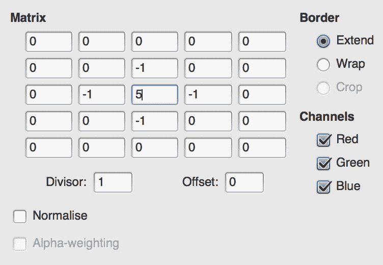

结果是原始图像的锐化版本：

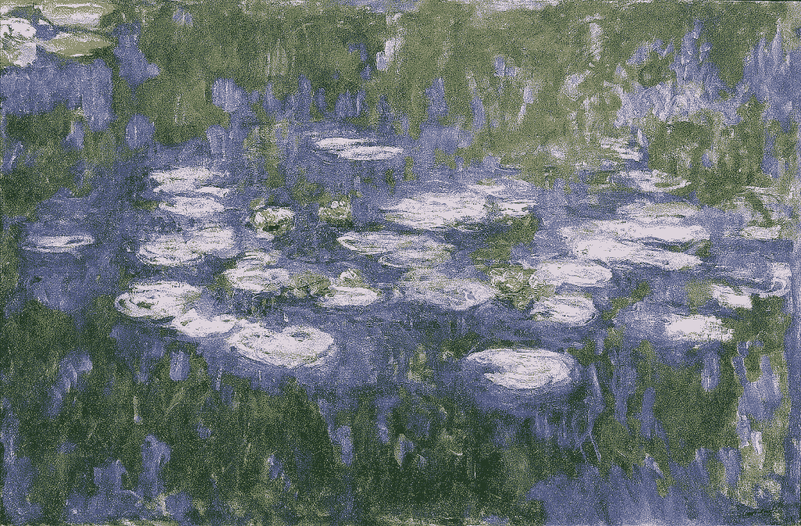

我也可以编写一个使图像模糊的卷积矩阵：

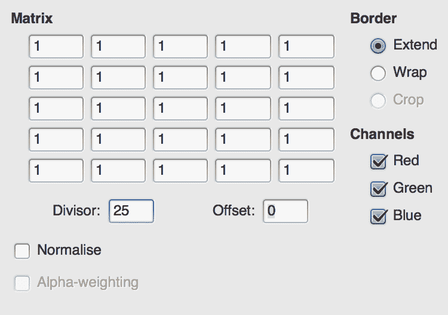

这会产生以下图像。效果微妙，因为油画本身有点模糊，但效果是有的：


卷积也可以用来浮雕或检测边缘：

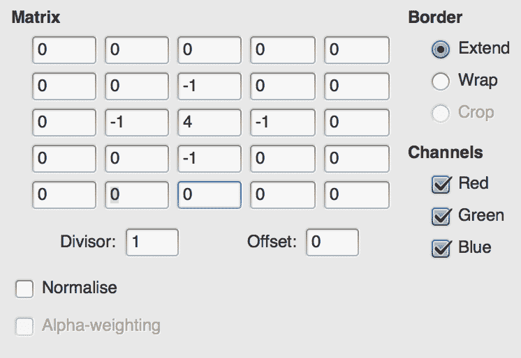

前面的矩阵会产生以下效果：

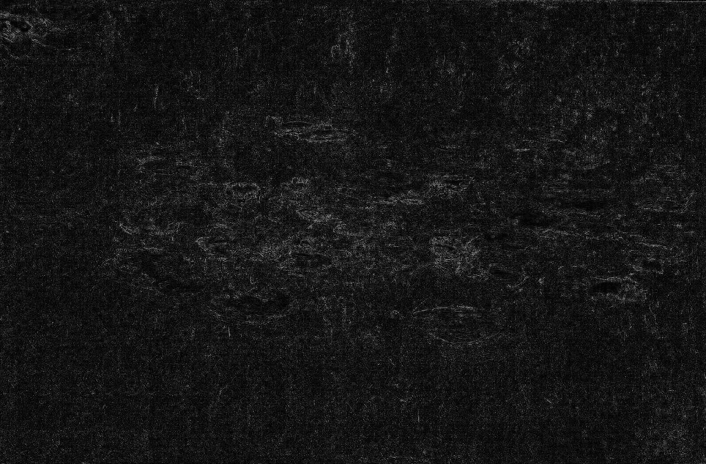

CNN 使用多个卷积层，每个层包含多个卷积过滤器，来构建图像模型。卷积层和卷积过滤器本身是通过反向传播算法进行训练的，网络最终会发现正确的过滤器来增强网络试图识别的特征。与所有学习问题一样，CNN 开发的过滤器类型可能不一定能被人类轻易理解或解释，但在许多情况下，你会发现你的网络开发了许多执行模糊、边缘检测、颜色隔离和梯度检测的卷积过滤器。

除了从图像中提取有用特征外，卷积操作实际上提供了特征的空间和位置独立性。卷积层不是完全连接的，因此能够检查图像的特定区域。这减少了层间权重的维度要求，并有助于我们避免对特征空间位置的依赖。

这些操作中涉及的数据量仍然很大，因此卷积层通常紧接着是池化层，这本质上是对图像进行下采样。最常见的是使用 *2 x 2 最大池化*，这意味着对于源特征中的每个 2 x 2 像素区域，池化层将下采样 2 x 2 区域到一个像素，该像素具有源 2 x 2 区域中最大像素的值。因此，2 x 2 池化层将图像大小减少到原来的四分之一；因为卷积操作（可能也会降低维度）已经发生，这种下采样通常可以减少计算需求而不会丢失太多信息。

在某些情况下，卷积神经网络将使用简单的 ReLU 激活函数直接跟随卷积操作并直接在池化之前；这些 ReLU 函数有助于避免图像或卷积操作产生的特征图过度饱和。

简单卷积神经网络的一个典型架构看起来可能是这样的：

+   输入层，具有宽度 x 高度 x 颜色深度神经元

+   卷积层，具有 M x M 大小的 N 个卷积滤波器

+   最大池化层

+   第二个卷积层

+   第二个最大池化层

+   全连接输出层

CNN 的更复杂架构通常包括更多的卷积和池化层组合，并且可能在达到池化层之前涉及两个连续的卷积层。

网络中每个后续的卷积层在其之前的卷积层之上运行。第一个卷积层只能执行简单的卷积，例如边缘检测、平滑和模糊。然而，下一个卷积层能够将先前卷积的结果组合成更高层次的特征，例如基本形状或颜色模式。第三个卷积层可以进一步结合先前层的信息来检测复杂特征，例如轮子、路标和手提包。最后的全连接层或层则类似于标准的前馈人工神经网络，并根据卷积层所隔离的高层次特征对图像进行实际分类。

现在我们尝试使用 `TensorFlow.js` 在 MNIST 手写数字数据集上实际应用这项技术。

# 示例 - MNIST 手写数字

我们不如从构建一个从第一原理开始的示例，而是通过一个优秀的 `TensorFlow.js` MNIST 示例来逐步了解。此示例的目标是训练一个卷积神经网络（CNN）来对手写数字图像进行分类。更具体地说，此示例的目标是在 MNIST 手写数字数据集上实现高准确率。在本节中，我们将通过在代码上执行实验并观察其结果来了解代码和算法。

当前版本的此示例可以在 `TensorFlow.js` 的 GitHub 上找到：[`github.com/tensorflow/tfjs-examples/tree/master/mnist`](https://github.com/tensorflow/tfjs-examples/tree/master/mnist)。然而，由于在撰写本文后存储库可能已更新，我还在本书的示例存储库中添加了我使用的版本作为 Git 子模块。如果您正在使用本书的存储库并且尚未这样做，请从存储库目录中的命令行运行 `git submodule init`；`git submodule update`。

在终端中，导航到 `Ch5-CNN`。此路径是一个符号链接，因此如果您的系统上不起作用，您可以改用导航到 `tfjs-examples/mnist`。

接下来，从命令行运行 `yarn` 来构建代码，最后运行 `yarn watch`，这将启动一个本地服务器并将您的浏览器打开到 `http://localhost:1234`。如果您有使用该端口的任何其他程序，您必须首先终止它们。

页面将首先从 Google 的服务器下载 MNIST 图像。然后，它将训练一个 CNN 进行 150 个周期，定期更新显示损失和准确性的两个图表。回想一下，损失通常是像均方误差（MSE）这样的指标，而准确率是正确预测的百分比。最后，页面将显示一些示例预测，突出显示正确与错误的预测。

我对这个页面的测试运行产生了一个准确率约为 92% 的 CNN：

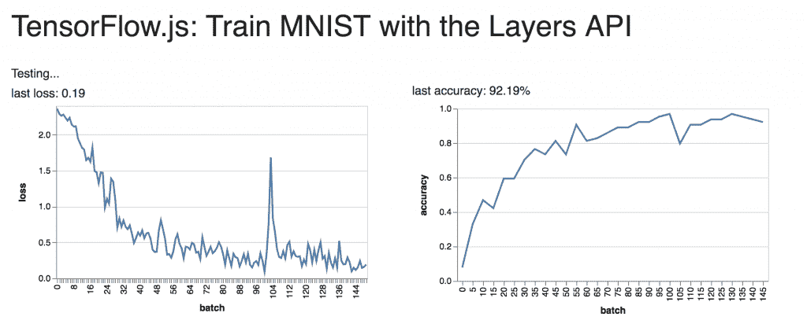

通常，错误的预测是可以理解的。在这个例子中，数字 1 看起来确实有点像数字 2。尽管我遇到过我也会预测错误的例子，但不太可能有人会犯这个特定的错误：

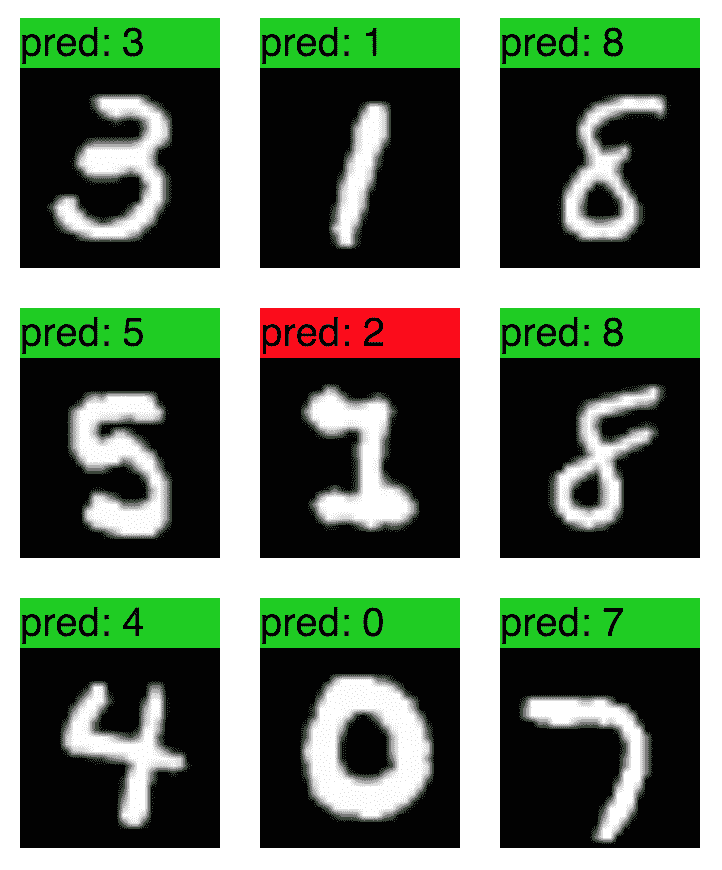

打开 `index.js`，我们可以在文件顶部看到网络的拓扑结构：

```py
model.add(tf.layers.conv2d({
  inputShape: [28, 28, 1],
  kernelSize: 5,
  filters: 8,
  strides: 1,
  activation: 'relu',
  kernelInitializer: 'varianceScaling'
}));
model.add(tf.layers.maxPooling2d({poolSize: [2, 2], strides: [2, 2]}));
model.add(tf.layers.conv2d({
  kernelSize: 5,
  filters: 16,
  strides: 1,
  activation: 'relu',
  kernelInitializer: 'varianceScaling'
}));
model.add(tf.layers.maxPooling2d({poolSize: [2, 2], strides: [2, 2]}));
model.add(tf.layers.flatten());
model.add(tf.layers.dense(
    {units: 10, kernelInitializer: 'varianceScaling', activation: 'softmax'}));
```

这个网络有两个卷积层，每个卷积层后面跟着一个池化层，然后是一个单一的用于预测的全连接层。这两个卷积层都使用`kernelSize`为`5`，这意味着卷积滤波器是一个 5 x 5 的矩阵。第一个卷积层使用八个过滤器，而第二个使用 16 个。这意味着第一层将创建并使用八个不同的卷积滤波器，因此识别图像的八个不同的图形特征。这些特征可能是抽象的，但在第一层中，常见的特征是表示边缘检测、模糊或锐化，或者梯度识别。

第二个卷积层使用 16 个特征，这些特征可能比第一层的特征更高级。这一层可能试图识别直线、圆形、曲线、波浪线等。高级特征比低级特征多，因此第一层使用比第二层少的过滤器是有意义的。

最终的密集层是一个包含 10 个神经元的全连接层，每个神经元代表一个数字。softmax 激活函数确保输出被归一化到 1。这个最终层的输入是第二个池化层的展平版本。数据需要展平，因为卷积和池化层通常是多维的。卷积和池化层使用代表高度、宽度和颜色深度的矩阵，这些矩阵本身又是通过卷积滤波器使用的结果堆叠在一起的。例如，第一个卷积层的输出将是一个体积为[28 x 28 x 1] x 8 大小的体积。括号内的部分是单个卷积操作（即滤波后的图像）的结果，并且已经生成了八个这样的操作。当将此数据连接到向量层，如标准的密集层或全连接层时，它也必须被展平成一个向量。

进入最终密集层的数据比第一层输出的数据小得多。最大池化层的作用是降低图像的尺寸。`poolSize`参数为`[2, 2]`意味着一个 2 x 2 像素窗口将被减少到一个单一值；由于我们使用的是最大池化，这将是在该集合中最大的值（最亮的像素）。`strides`参数意味着池化窗口将以每次两个像素的步长移动。这种池化将图像的高度和宽度都减半，这意味着图像和数据在面积上减少了四倍。第一次池化操作后，图像被减少到 14 x 14，第二次后变为 7 x 7。由于第二个卷积层有 16 个过滤器，这意味着展平层将有*7 * 7 * 16 = 784*个神经元。

让我们看看通过在输出之前添加另一个全连接层，我们是否能从这个模型中挤出更多准确度。在最佳情况下，增加另一个层将使我们能够更好地解释卷积产生的 16 个特征的相互作用。

然而，增加另一个层会增加所需的训练时间，并且它也可能不会提高结果。完全有可能，通过增加另一个层，我们不再能发现更多信息。始终记住，人工神经网络只是构建和导航数学景观，寻找数据中的形状。如果数据不是高度多维的，增加我们能力的一个维度可能只是不必要的。

在代码的最终密集层之前添加以下行：

```py
model.add(tf.layers.dense(
    {units: 100, kernelInitializer: 'varianceScaling', activation: 'sigmoid'}));
```

在上下文中，代码现在应该看起来像这样，新行被突出显示：

```py
model.add(tf.layers.maxPooling2d({poolSize: [2, 2], strides: [2, 2]}));
model.add(tf.layers.flatten());
model.add(tf.layers.dense(
 {units: 100, kernelInitializer: 'varianceScaling', activation: 'sigmoid'}));
model.add(tf.layers.dense(
    {units: 10, kernelInitializer: 'varianceScaling', activation: 'softmax'}));

const LEARNING_RATE = 0.15;
```

由于您已从命令行发出`yarn watch`，代码应自动重建。刷新页面并观察结果：

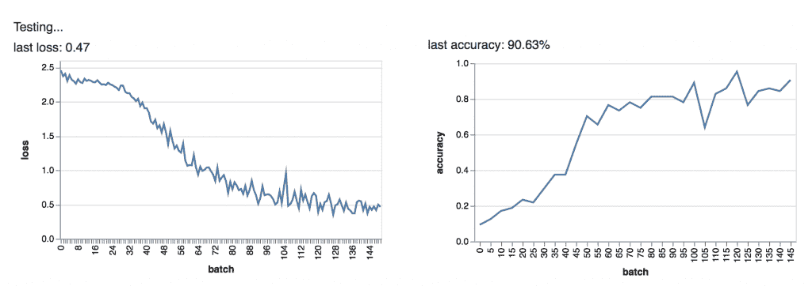

算法的学习速度比原始版本慢，这是预期的，因为我们增加了一个新层，因此增加了模型的复杂性。让我们稍微增加训练限制。

找到`TRAIN_BATCHES`变量并将其更新为`300`。该行现在应如下所示：

```py
const TRAIN_BATCHES = 300;
```

保存文件以触发重建并重新加载页面。让我们看看我们是否能打败基线：

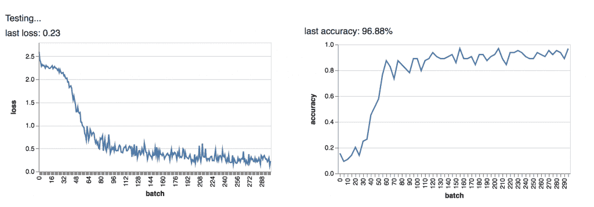

看起来我们确实打败了 92%的基线分数，然而我必须谨慎地提醒，不要过于乐观。有可能我们已经过度训练和过度拟合了模型，并且有可能它在现实生活中表现不佳。此外，由于训练和验证是随机的，这个网络的真正准确度可能与基线相当。确实，92%已经是一个非常好的结果，我不期望任何模型能做得更好。然而，这仍然是一个鼓舞人心的结果，因为新层增加的负担并不大。

在这个阶段，请撤销您的更改，以便您使用文件的原始副本进行工作。让我们进行一个不同的实验。看看我们能否在不损失太多准确度的情况下将网络规模缩小到多小，这将会很有趣。

首先，让我们减少第二个卷积层使用的卷积滤波器数量。我的理由是数字使用相当简单的形状：圆形、线条和曲线。也许我们不需要捕捉 16 种不同的特征。也许 8 个就足够了。在第二个卷积层中，将`filters: 8`更改为`filters: 2`。您的代码现在应该如下所示：

```py
...
model.add(tf.layers.maxPooling2d({poolSize: [2, 2], strides: [2, 2]}));
model.add(tf.layers.conv2d({
  kernelSize: 5,
  filters: 2,
  strides: 1,
  activation: 'relu',
  kernelInitializer: 'varianceScaling'
}));
model.add(tf.layers.maxPooling2d({poolSize: [2, 2], strides: [2, 2]}));
...
```

重新运行代码，我们看到我们仍然得到了相当准确的度，尽管方差略高于基线：

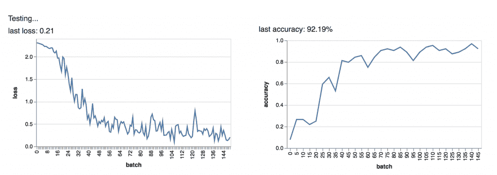

这支持了这样一个总体观点，即使用的形状和特征相对较少。然而，当我们查看测试示例时，我们也发现错误比以前更难以理解。也许我们没有损失很多准确率，但我们的模型变得更加抽象：

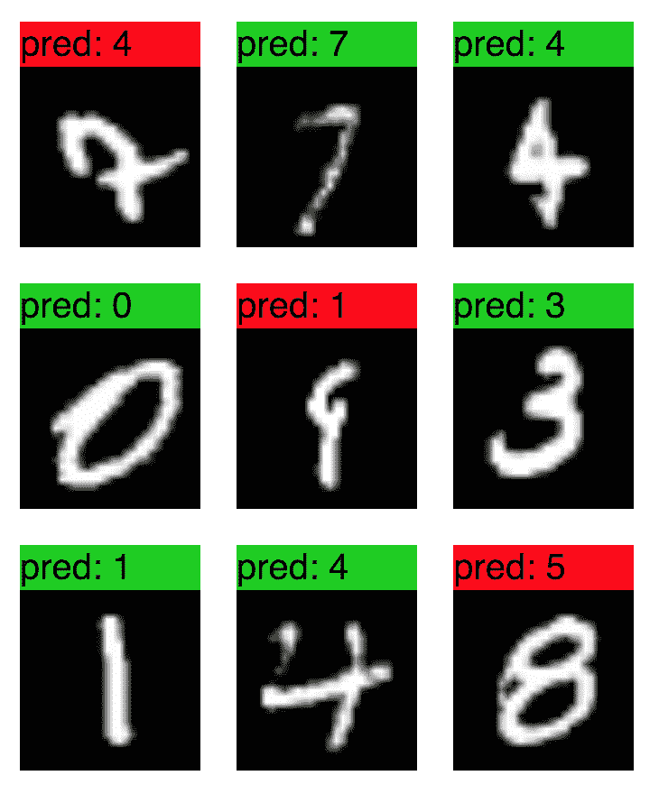

我鼓励你继续探索和实验这个示例，因为通过阅读代码你可以学到很多东西。我想特别指出这个示例的一个方面，那就是`data.js`文件，它负责处理 MNIST 数据集。在你的实际应用中，你可能会需要采用类似的方法，因为你的训练数据不一定总是在本地机器上。这个文件处理从远程源下载数据，将其分为测试集和验证集，并为训练算法维护请求的批次。如果你需要从远程源获取训练数据，这是一个很好的、轻量级的方法。我们将在第十一章深入讨论这个主题，*在实时应用中使用机器学习*。

这里有一些你可以尝试的实验想法：

+   在保持 90%以上准确率的同时，尽可能使网络规模最小化。

+   在保持 85%以上准确率的同时，使网络尽可能小。

+   在少于 50 个 epoch 中将模型训练到 90%以上的准确率。

+   发现实现 90%以上准确率所需的最少训练示例数量（在`data.js`中将`NUM_TRAIN_ELEMENTS`的值减少以使用更少的训练示例）

在下一节中，我们将探讨使用循环神经网络进行序列预测。

# 循环神经网络

在许多情况下，神经网络需要记忆。例如，当建模自然语言上下文很重要时，也就是说，句子中较晚出现的单词的意义受到句子中较早出现的单词的意义的影响。这与朴素贝叶斯分类器使用的做法形成对比，朴素贝叶斯分类器只考虑单词袋，不考虑它们的顺序。同样，时间序列数据可能需要一些记忆才能做出准确的预测，因为未来的值可能与当前或过去的值相关。

RNN 是一组 ANN 拓扑结构，其中信息不一定只在一个方向上流动。与前馈神经网络相比，RNN 允许神经元的输出反向输入到它们的输入中，从而创建一个反馈循环。循环网络几乎总是时间相关的。然而，时间概念是灵活的；句子中的有序单词可以被认为是时间相关的，因为一个单词必须跟在另一个单词之后。RNN 的时间相关性不一定与时钟上实际时间的流逝相关。

在最简单的情况下，对 RNN 的要求仅仅是神经元的输出值需要连接——通常是通过权重或衰减因子——不仅连接到下一层的神经元，而且也连接回自己的输入。如果你熟悉数字信号处理中的**有限脉冲响应**（**FIR**）滤波器，这种类型的神经元可以被视为 FIR 滤波器的一种变体。这种类型的反馈会产生一种记忆，因为之前的激活值部分保留并用作神经元下一个周期的输入。你可以将这想象成神经元产生的回声，变得越来越微弱，直到回声不再可闻。因此，以这种方式设计的网络将具有有限的记忆，因为最终回声会消失得无影无踪。

另一种 RNN 的风格是全循环 RNN，其中每个神经元都与网络中的每个其他神经元相连，无论是正向还是反向。在这种情况下，不仅仅是单个神经元可以听到自己的回声；网络中的每个神经元都可以听到其他每个神经元的回声。

虽然这些类型的网络功能强大，但在许多情况下，网络需要比回声持续更长时间的内存。为了解决长期记忆的问题，发明了一种非常强大、异类的拓扑结构，称为**LSTM**。LSTM 拓扑使用一种称为 LSTM 单元的异类神经元，能够存储所有之前的输入和激活值，并在计算未来激活值时回忆它们。当 LSTM 网络首次推出时，它打破了令人印象深刻的一系列记录，尤其是在语音识别、语言建模和视频处理方面。

在下一节中，我们将简要讨论 TensorFlow.js 提供的三种不同类型的 RNN 拓扑：SimpleRNN（或全循环 RNN）、**门控循环单元**（**GRU**）网络和 LSTM 网络。

# SimpleRNN

`TensorFlow.js`提供的第一个 RNN 层是 SimpleRNN 层类型，它由一个 SimpleRNNCell 神经元组成。这是一种异类的神经元，可以将自己的输出反馈到输入。这种神经元的输入是一个时间依赖值的向量；每个输入值的激活输出被反馈到下一个值的输入，依此类推。可以指定一个介于 0 和 1 之间的*dropout*因子；这个值代表每个回声的强度。以这种方式设计的神经元在许多方面类似于 FIR 滤波器。

实际上，这种 RNN 架构是由数字信号处理领域关于 FIR 滤波器的前期工作所实现的。这种架构的优势在于数学原理已被充分理解。可以**展开**一个 RNN，这意味着可以创建一个多层前馈 ANN，其结果与较少层的 RNN 相同。这是因为神经元反馈的回声是有限的。如果一个神经元已知回声 20 次，那么这个神经元可以被建模为 21 个前馈神经元（包括源神经元）。训练这些网络的初步努力受到了 FIR 滤波器工作的启发，因为分析非常相似。

考虑以下由弗朗索瓦·德洛什（François Deloche）创作的图像（原创作品，CC BY-SA 4.0），它说明了循环神经元的展开：

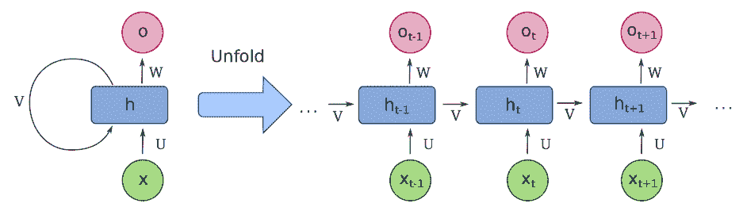

标记为**V**的循环表示神经元的反馈操作。当给神经元提供未来输入值（**X**）时，前一次激活的输出达到输入并成为输入因子。如图所示，这可以建模为一系列简单的神经元的线性序列。

从 TensorFlow 的角度来看，循环层的操作被 TensorFlow 层 API 抽象化。让我们看看 TensorFlow.js 的另一个示例，该示例说明了各种 RNN 架构的可互换性。

从本书的 GitHub 仓库中，导航到`Ch9-RNN`目录，这再次是一个指向`tfjs-examples/addition-rnn`目录的符号链接。（如果你仍然在运行之前的 RNN 示例，你需要在运行 yarn watch 命令的终端中按*Ctrl + C*来停止它。）首先，运行`yarn`命令来构建代码，然后运行`yarn watch`再次启动本地服务器并导航到`http://localhost:1234`。

这个特定的例子旨在通过示例教授 RNN 整数加法。训练数据将是一系列问题，如`24 + 22`或`14 + 54`，以字符串形式表示，网络需要能够解码字符串，将其数值化，学习答案，并将知识扩展到新的示例。

当页面加载时，你会看到以下表单。保持默认设置并点击**Train Model**按钮：

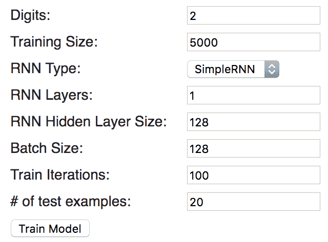

你将看到类似于以下损失和准确度图，这表明在 100 个训练周期后，该模型的准确度为 93.8%：

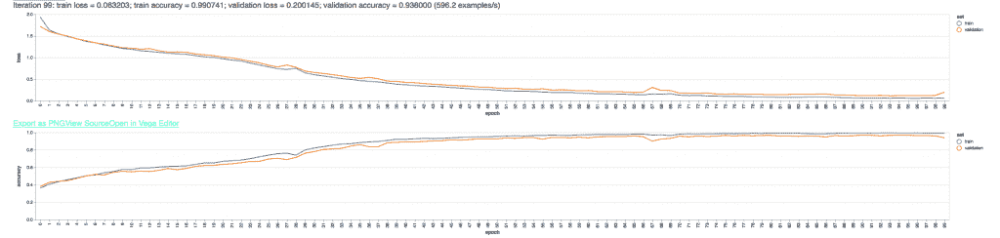

损失和相似度图

你还会看到模型针对随机测试输入的测试结果：

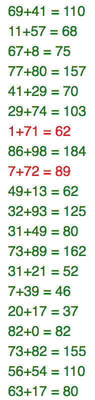

让我们更仔细地看看这是如何在底层工作的。打开 `index.js` 文件并找到 `createAndCompileModel` 函数。我将假设您为这个示例选择了 SimpleRNN 网络类型，并省略了处理 GRU 和 LSTM 架构的 switch/case 语句：

```py
function createAndCompileModel(
    layers, hiddenSize, rnnType, digits, vocabularySize) {
    const maxLen = digits + 1 + digits;

    const model = tf.sequential();
    model.add(tf.layers.simpleRNN({
        units: hiddenSize,
        recurrentInitializer: 'glorotNormal',
        inputShape: [maxLen, vocabularySize]
    }));
    model.add(tf.layers.repeatVector({n: digits + 1}));
    model.add(tf.layers.simpleRNN({
        units: hiddenSize,
        recurrentInitializer: 'glorotNormal',
        returnSequences: true
    }));
    model.add(tf.layers.timeDistributed(
        {layer: tf.layers.dense({units: vocabularySize})}));
    model.add(tf.layers.activation({activation: 'softmax'}));
    model.compile({
        loss: 'categoricalCrossentropy',
        optimizer: 'adam',
        metrics: ['accuracy']
    });
    return model;
}
```

这段代码构建了一个包含两个循环层、一个时间分布的全连接层和输出层的模型。`vocabularySize` 参数表示涉及的总唯一字符数，这些字符是数字 0-9、加号和空格字符。`maxLen` 参数表示输入字符串的最大长度；对于两位数加法问题，`maxLen` 将是五个字符，因为必须包括加号。

在这个例子中，特别值得注意的是 `timeDistributed` 层类型。这是 TensorFlow API 中的一个层包装器，旨在在层中创建一个神经元体积，其中每个切片代表一个时间切片。这与前一个例子中 CNN 使用的体积在精神上相似，其中体积的深度代表一个单独的卷积操作。然而，在这个例子中，体积的深度代表一个时间切片。

`timeDistributed` 包装器允许每个时间切片由一个单独的密集层或全连接层处理，而不是仅用单个神经元向量来尝试解释时间依赖性数据，在这种情况下，时间数据可能会丢失。`timeDistributed` 包装器是必需的，因为之前的 `simpleRNN` 层使用了 `returnSequences: true` 参数，这导致层不仅输出当前时间步，还输出层历史中遇到的所有时间步。

接下来，让我们看看 GRU 架构。

# 门控循环单元

GRU 架构由特殊、异质的神经元组成，这些神经元使用几个内部机制来控制神经元的记忆和反馈。GRU 是一项较新的发明，仅在 2014 年作为 LSTM 神经元的简化版本被开发出来。虽然 GRU 比 LSTM 更新，但我首先介绍它，因为它稍微简单一些。

在 GRU 和 LSTM 神经元中，输入信号被发送到多个激活函数。每个内部激活函数可以被认为是一个标准的 ANN 神经元；这些内部神经元被组合起来，以赋予整体神经元其记忆能力。从外部看，GRU 和 LSTM 神经元都看起来像是能够接收时间依赖性输入的神经元。从内部看，这些异质神经元使用更简单的神经元来控制从前一个激活中衰减或增强多少反馈，以及将多少当前信号存储到内存中。

GRU 和 LSTM 神经元相较于简单的 RNN 神经元有两个主要优势。首先，这些神经元的记忆不会像简单 RNN 神经元的回声那样随时间衰减。其次，记忆是可配置和自学习的，也就是说，神经元可以通过训练学习到特定记忆对当前激活的重要性。

考虑以下插图，也是由 François Deloche（本人作品，CC BY-SA 4.0）提供的：

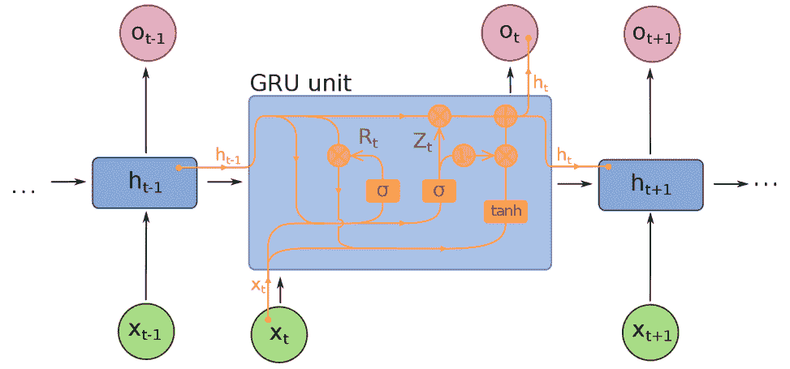

流程图一开始可能有点难以理解。**Z[t]**信号是一个向量，它控制了多少激活被存储到记忆中并传递给未来的值，而**R[t]**信号控制了应该从记忆中遗忘多少先前值。这些信号都连接到标准的激活函数，而这些激活函数又都有自己的权重。从某种意义上说，GRU 本身就是一个微型的神经网络。

在这一点上，可能会有人好奇为什么神经元的记忆不能简单地通过编程来实现，例如，使用神经元可以查询的键/值存储。这些架构之所以被使用，是因为反向传播算法需要数学可微性。即使是像 RNN 这样的异构拓扑，也是通过数学方法如梯度下降进行训练的，因此整个系统必须是数学上可表示的。因此，研究人员需要使用前面的技术来创建一个网络，其中每个组件都是数学上可分析和可微的。

在`http://localhost:1234`的测试页面上，将**RNN 类型**参数更改为 GRU，同时保持所有其他参数不变，然后再次点击**训练模型**。图表将更新，你应该会看到以下内容：

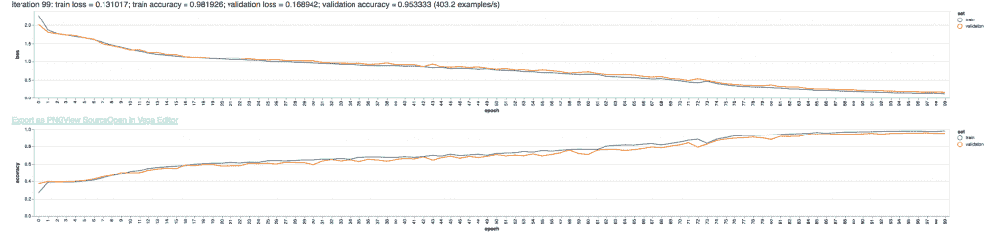

在这种情况下，训练过程花费了更长的时间，但准确性从 SimpleRNN 类型的 92%提高到了 95%。增加的训练时间并不令人惊讶，因为 GRU 架构实际上将网络使用的激活函数数量增加了三倍。

虽然许多因素会影响网络的准确性，但有两个明显的因素脱颖而出。首先，GRU 拓扑具有长期记忆，而 SimpleRNN 最终会忘记先前值，因为它们的回声衰减。其次，GRU 对激活信号输入未来激活以及保留信息的控制更加精确。这些网络的参数是通过反向传播算法训练的，因此神经元的遗忘性本身是通过训练进行优化的。

接下来，让我们看看那个启发 GRU 并开辟了全新研究领域拓扑结构：LSTM。

# 长短期记忆

LSTM 在 1997 年被引入，由于其在解决历史难题方面的出色准确率，在学术人工神经网络社区中引起了轰动。特别是，LSTM 在许多自然语言处理任务、手写识别和语音识别方面表现出色。在许多情况下，LSTM 网络以很大的差距打破了之前的准确率记录。许多处于语音识别和语言建模前沿的系统都使用了 LSTM 网络。很可能是像苹果的 Siri 和谷歌的 Assistant 这样的系统，在它们的语音识别和语言解析模型中都使用了 LSTM 网络。

LSTM 网络之所以得名，是因为它能够长时间保留短期记忆（例如，句子中较早使用过的单词的记忆）。在训练过程中，这避免了被称为“梯度消失”的问题，这是简单 RNN 在先前激活的回声逐渐消失时所遭受的问题。

与 GRU 一样，LSTM 神经元是一种具有复杂内部工作的异类神经元细胞。具体来说，LSTM 神经元有三个内部使用的**门**：一个**输入门**，它控制允许进入神经元的值的量；一个**遗忘门**，它管理神经元的记忆；以及一个**输出门**，它控制允许进入神经元输出的信号的量。门的组合，加上神经元之间都是相互连接的，使得 LSTM 对神经元记住哪些信号以及如何使用这些信号具有非常精细的控制。与 GRU 中的门一样，LSTM 中的门也可以被视为具有自己权重的独立标准神经元。

考虑以下由弗朗索瓦·德洛什（François Deloche）制作的图形（本人作品，CC BY-SA 4.0）：

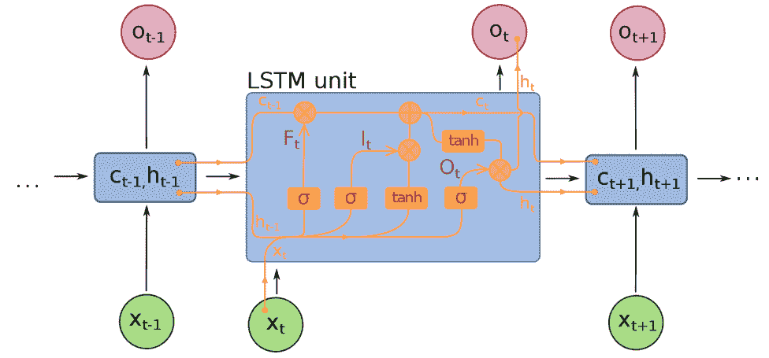

**I[t]**信号控制允许进入细胞的输入信号的比例。**O[t]**信号控制允许从细胞中输出的输出量，而**F[t]**信号控制细胞保留先前值的量。记住，这些都是矢量量，因此输入、输出和记忆可以按元素进行控制。

LSTM 在需要记忆和先前值知识的任务上表现出色，尽管细胞复杂的内部工作（涉及五个不同的激活函数）导致训练时间更长。回到你的浏览器中的测试页面，将**RNN 类型**切换为 LSTM，然后点击**训练模型**：

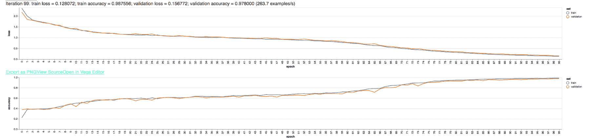

LSTM（长短期记忆网络）的准确率达到了近 98%，超过了 SimpleRNN 和 GRU RNN 拓扑结构。当然，这个网络训练时间比其他两个都要长，因为简单的事实是，需要训练的神经元（在 LSTM 细胞内部）更多。

LSTM 网络有许多最先进的用途。它们在音频分析中非常受欢迎，如语音识别，因为音频高度依赖于时间。单个音频样本本身是没有意义的；只有当数千个音频样本在上下文中一起取用时，音频剪辑才开始有意义。一个用于识别语音的 LSTM 首先会被训练来将短音频剪辑（大约 0.1-0.25 秒）解码成*音素*，即语音声音的文本表示。然后，另一个 LSTM 层会被训练来将音素序列连接起来，以确定最可能说出的短语。第一层 LSTM 依赖于时间依赖性来解释原始音频信号。第二层 LSTM 依赖于时间依赖性为自然语言提供上下文——例如，使用上下文和语法来确定是说了*在哪里*还是*我们在哪里*。

LSTM 的另一个最先进用例是 CNN-LSTM。这种网络拓扑结合了 CNN 和 LSTM；一个典型的应用将是视频剪辑中的动作检测。模型的 CNN 部分分析单个视频帧（就像它们是独立的图像一样），以识别对象及其位置或状态。模型的 LSTM 部分将单个帧组合在一起，并围绕它们生成一个时间依赖的上下文。如果没有 LSTM 部分，模型将无法判断棒球是静止的还是运动的，例如。是 CNN 检测到的对象先前状态的记忆为确定视频中发生的动作提供了上下文。模型的 CNN 部分识别出棒球，然后 LSTM 部分理解球是在移动的，可能被扔出或击中。

CNN-LSTM 的另一种变体用于自动描述图像。可以给 CNN-LSTM 展示一张站在湖边码头上的女人的图像。模型的 CNN 部分会单独识别图像中的女人、码头和湖作为对象。然后，LSTM 部分可以根据 CNN 收集到的信息生成图像的自然语言描述；是 LSTM 部分在语法上编译了描述，“湖边的码头上的女人”。记住，自然语言描述是时间依赖的，因为单词的顺序很重要。

关于 LSTM 网络的一个最后注意事项与 LSTM 单元中使用的*门*有关。虽然输入、遗忘和输出门通常使用标准的激活神经元，但也可以使用整个神经网络作为门本身。以这种方式，LSTM 可以使用*其他*模型作为其知识和记忆的一部分。这种方法的典型用例将是自动语言翻译。例如，单个 LSTM 可以用来模拟英语和法语，而一个整体的 LSTM 可以管理两者之间的翻译。

我个人的信念是，LSTM 网络，或其变体，如 GRU 拓扑结构，将在通往通用人工智能（AGI）的道路上扮演关键角色。在尝试模拟通用人类智能时，拥有强大的记忆能力是一个基本要求，而 LSTM 非常适合这种用例。这些网络拓扑结构是人工神经网络（ANN）研究的前沿，因此预计在未来几年内将看到重大进展。

# 摘要

在本章中，我们讨论了两种高级神经网络拓扑结构：卷积神经网络（CNN）和循环神经网络（RNN）。我们以图像识别的背景讨论了 CNN，特别是手写数字识别的问题。在探索 CNN 的同时，我们还讨论了图像滤波背景下的卷积操作本身。

我们还讨论了如何通过 RNN 架构使神经网络保持记忆。我们了解到 RNN 有许多应用，从时间序列分析到自然语言建模。我们讨论了几种 RNN 架构类型，例如简单的全循环网络和 GRU 网络。最后，我们讨论了最先进的 LSTM 拓扑结构，以及它如何用于语言建模和其他高级问题，如图像标题或视频注释。

在下一章中，我们将探讨一些自然语言处理的实际方法，特别是与机器学习算法最常结合使用的技术。
