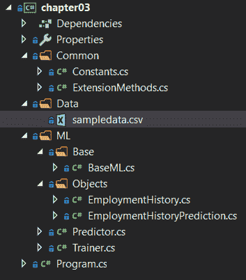
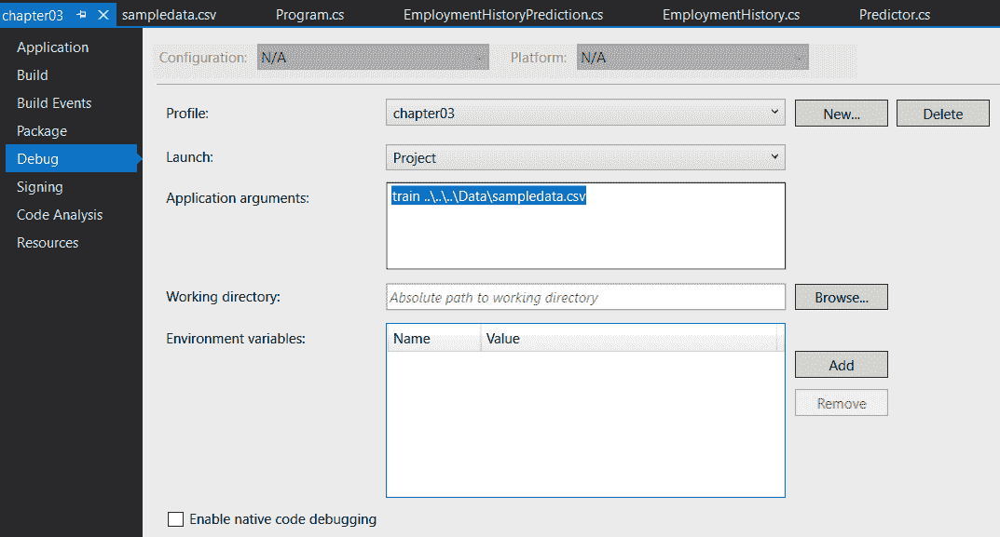
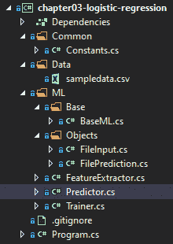
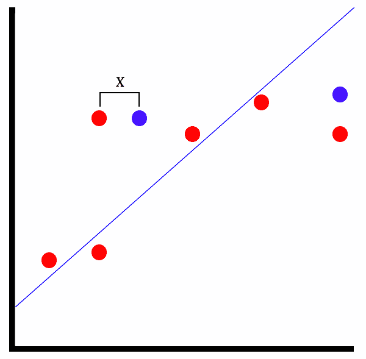

# 第三章：回归模型

在我们的开发环境配置完成并且我们的第一个 ML.NET 应用完成后，现在是时候深入研究回归模型了。在本章中，我们将深入研究回归模型背后的数学原理，以及回归模型的各种应用。我们还将构建两个额外的 ML.NET 应用，一个使用线性回归模型，另一个使用逻辑回归模型。线性回归应用将根据各种员工属性预测员工流失。逻辑回归应用将对文件进行基本静态文件分析，以确定其是恶意还是良性。最后，我们将探讨如何使用 ML.NET 在回归模型中公开的特性来评估回归模型。

在本章中，我们将涵盖以下主题：

+   分解各种回归模型

+   创建线性回归应用

+   创建逻辑回归应用

+   评估回归模型

# 分解回归模型

尽管机器学习生态系统中提供了多种回归模型类型，但主要有两种主要的回归模型组：线性回归和逻辑回归，它们在 ML.NET 中都有丰富的实现。

ML.NET 提供了以下线性回归训练器：

+   `FastTreeRegressionTrainer`

+   `FastTreeTweedieTrainer`

+   `FastForestRegressionTrainer`

+   `GamRegressionTrainer`

+   `LbfgsPoissonRegressionTrainer`

+   `LightGbmRegressionTrainer`

+   `OlsTrainer`

+   `OnlineGradientDescentTrainer`

+   `SdcaRegressionTrainer`

我们将在本章后面创建的员工流失应用将使用线性回归 SDCA 训练器。

此外，ML.NET 还提供了以下二元逻辑回归训练器：

+   `LbfgsLogisticRegressionBinaryTrainer`

+   `SdcaLogisticRegressionBinaryTrainer`

+   `SdcaNonCalibratedBinaryTrainer`

+   `SymbolicSgdLogisticRegressionBinaryTrainer`

对于文件分类应用，我们将使用`SDCALogisticRegressionBinaryTrainer`模型。

# 选择回归模型类型

在所有这些选项中，你如何选择正确的回归模型类型？

你选择的回归模型类型取决于你期望的输出。如果你只希望得到一个布尔值（即，0 或 1），那么应该使用逻辑回归模型，就像我们在本章后面将要编写的文件分类应用中那样。此外，如果你希望返回一个特定的预定义值范围，比如汽车类型，如敞篷车、敞篷车或掀背车，那么逻辑回归模型是正确的选择。

相反，线性回归模型返回一个数值，例如我们在本章后面将要探讨的就业时长示例。

因此，总结如下：

+   如果你的输出是布尔值，请使用逻辑回归模型。

+   如果你的输出由预设的范围类型值组成（类似于枚举），请使用逻辑回归模型。

+   如果你的输出是一个数值未知值，请使用线性回归模型。

# 选择线性回归训练器

当查看 ML.NET 中九个线性回归训练器的列表时，可能会感到有些令人畏惧，不知道哪一个才是最好的。

对于 ML.NET 线性回归训练器来说，总体而言，最受欢迎的是 FastTree 和 LightGBM。三个 FastTree 算法利用邻接和启发式方法快速识别候选连接来构建决策树。LightGBM 是一个非常流行的线性回归算法，它利用 **基于梯度的单边采样**（**GOSS**）来过滤数据实例以找到分割值。这两个训练器都提供了快速的训练和预测时间，同时提供了非常准确的模式性能。此外，这两个算法都有更多的文档、论文和研究资料。

剩下的五个训练器很有用，值得深入实验，但总体来说，你可能会发现 LightGBM 和 FastTree 的效果同样好或更好。

# 选择逻辑回归训练器

在 ML.NET 中提供的四个逻辑回归训练器中，哪一个最适合你的问题？虽然所有四个回归训练器都返回二元分类，但它们针对不同的数据集和工作负载进行了优化。

你是否在寻找一个低内存环境下的训练和预测？如果是这样，考虑到它是为了处理内存受限环境而创建的，L-BFGS 逻辑回归训练器（`LbfgsLogisticRegressionBinaryTrainer`）是一个合理的选择。

基于 SDCA 的两个训练器——`SdcaLogisticRegressionBinaryTrainer` 和 `SdcaNonCalibratedBinaryTrainer`——已经针对训练的可扩展性进行了优化。如果你的训练集很大，并且你在寻找二元分类，那么任一 SDCA 训练器都是一个不错的选择。

`SymbolicSgdLogisticRegressionBinaryTrainer` 模型与其他三个不同，因为它基于随机梯度下降算法。这意味着该算法不是试图最大化误差函数，而是试图最小化误差函数。

如果你好奇想扩展你对 SCDAs 的知识，特别是微软研究如何扩展 SCDAs 的实验，请阅读这篇白皮书：[`www.microsoft.com/en-us/research/wp-content/uploads/2016/06/main-3.pdf`](https://www.microsoft.com/en-us/research/wp-content/uploads/2016/06/main-3.pdf)。

# 创建线性回归应用程序

如前所述，我们将要创建的应用程序是一个员工流失预测器。给定一组与员工相关的属性，我们可以预测他们将在当前工作中停留多久。本例中包含的属性并不是属性的确切列表，也不应直接在生产环境中使用；然而，我们可以将其作为基于多个属性预测单个数值输出的起点。

与 第一章，“使用 ML.NET 开始机器学习”，完成的项目代码、样本数据集和项目文件可以在此处下载：[`github.com/PacktPublishing/Hands-On-Machine-Learning-With-ML.NET/tree/master/chapter03_linear_regression`](https://github.com/PacktPublishing/Hands-On-Machine-Learning-With-ML.NET/tree/master/chapter03_linear_regression)。

# 深入了解训练器

如前所述，对于这个线性回归应用，我们将使用 SDCA 训练器。**SDCA** 代表 **Stochastic Dual Coordinate Ascent**，如果你还记得，我们在 第二章，“设置 ML.NET 环境”的例子中使用了这个训练器的逻辑回归版本。

对于普通读者来说，构成 SDCA 的四个单词可能都是未知的，所以让我们逐一解释每个单词的含义，以便更好地理解当您使用 SDCA 训练器时会发生什么。首先，*Stochastic*，换句话说，就是不可预测性。在机器学习的情况下，这意味着尝试以概率预测误差函数，并将训练集中的随机样本输入到优化器中。使用 *Dual Coordinate* 意味着在训练模型时两个变量是耦合的。正如你可能猜到的，这使得模型变得更加复杂，但不需要任何额外的工作就可以使用。最后，*Ascent* 指的是最大化误差函数的值。

# 探索项目架构

在 第二章，“设置 ML.NET 环境”中创建的项目架构和代码的基础上，这个例子在架构上的主要变化是输入机制。在 第二章，“设置 ML.NET 环境”中，使用简单的字符串通过命令行参数提供情感分析。在这个应用中，有几个属性需要传递给模型；因此，对于这个应用，我们现在使用 JSON 文件来包含我们的输入数据。随着这个添加，我们现在包括流行的 `Newtonsoft.Json` NuGet 包（在撰写本文时，最新版本是 12.0.2，并在包含的示例中使用）。如果您是从头开始构建此项目并且不记得如何添加 NuGet 引用，请参阅 第二章，“设置 ML.NET 环境”。

以下截图显示了项目的 Visual Studio Solution Explorer 视图。解决方案的新增内容是 `ExtensionMethods` 类文件，我们将在下一节中对其进行回顾：



`sampledata.csv` 文件包含 40 行随机数据；您可以随意调整数据以适应自己的观察或调整训练模型。以下是数据的片段：

```py
16,1,1,0,20,38,1,1,1
23,1,1,1,17,36,0,1,0
6,1,1,0,10,30,1,0,1
4,0,1,0,6,26,1,0,1
14,0,0,0,4,27,1,0,1
24,1,1,1,14,30,1,0,1
5,1,1,0,8,31,0,1,1
12,1,1,0,20,50,0,1,1
12,1,1,0,12,50,1,0,1
6,1,1,0,10,52,0,1,1
```

这些每一行都包含新创建的 `EmploymentHistory` 类中属性的值，我们将在本章后面进行回顾。

如果你想使用更大的数据集来训练并扩展此示例，Kaggle 网站提供了由 IBM 数据科学家创建的数据集。此数据集在此处可用：[`www.kaggle.com/pavansubhasht/ibm-hr-analytics-attrition-dataset`](https://www.kaggle.com/pavansubhasht/ibm-hr-analytics-attrition-dataset)。

# 深入代码

正如所述，对于此应用程序，我们是在完成第二章，*设置 ML.NET 环境*的工作基础上构建的。对于这次深入研究，我们将专注于此应用程序更改的代码。

被更改或添加的课程如下：

+   `ExtensionMethods`

+   `EmploymentHistory`

+   `EmploymentHistoryPrediction`

+   `Predictor`

+   `Trainer`

+   `Program`

# `ExtensionMethods` 类

这个新添加的类提供了一个易于使用的扩展方法，可以返回类中除标签外的所有属性。如果你不熟悉扩展方法，这些方法提供了一种非常简单的语法，可以潜在地对单个对象执行复杂操作，就像在这个例子中，我们取一个任意类型并返回它包含的所有属性（除了 `labelName`）：

```py
using System;
using System.Linq;

namespace chapter03.Common
{
    public static class ExtensionMethods
    {
        public static string[] ToPropertyList<T>(this Type objType, string labelName) =>                     objType.GetProperties().Where(a => a.Name != labelName).Select(a =>                             a.Name).ToArray();
    }
}
```

# `EmploymentHistory` 类

`EmploymentHistory` 类是包含预测和训练模型所需数据的容器类。这些列按照先前审查的样本数据顺序映射。如果你开始尝试新的功能并向此列表添加内容，请确保适当地增加数组索引：

```py
using Microsoft.ML.Data;

namespace chapter03.ML.Objects
{
    public class EmploymentHistory
    {
        [LoadColumn(0)]
        public float DurationInMonths { get; set; }

        [LoadColumn(1)]
        public float IsMarried { get; set; }

        [LoadColumn(2)]
        public float BSDegree { get; set; }

        [LoadColumn(3)]
        public float MSDegree { get; set; }

        [LoadColumn(4)]
        public float YearsExperience { get; set; }

        [LoadColumn(5)]
        public float AgeAtHire { get; set; }

        [LoadColumn(6)]
        public float HasKids { get; set; }

        [LoadColumn(7)]
        public float WithinMonthOfVesting { get; set; }

        [LoadColumn(8)]
        public float DeskDecorations { get; set; }

        [LoadColumn(9)]
        public float LongCommute { get; set; }
    }
}
```

# `EmploymentHistoryPrediction` 类

`EmploymentHistoryPrediction` 类仅包含在 `DurationInMonths` 属性中预测的员工预计在其职位上工作多少个月的预测值：

```py
using Microsoft.ML.Data;

namespace chapter03.ML.Objects
{
    public class EmploymentHistoryPrediction
    {
        [ColumnName("Score")]
        public float DurationInMonths;
    }
}
```

# `Predictor` 类

在此类中有一两个更改，用于处理就业预测场景：

1.  首先，在对此文件进行预测之前，验证输入文件是否存在：

```py
if (!File.Exists(inputDataFile))
{
    Console.WriteLine($"Failed to find input data at {inputDataFile}");

    return;
}
```

1.  另一个更改是在预测调用本身。正如你可能猜到的，TSrc 和 TDst 参数需要调整以利用我们创建的两个新类，`EmploymentHistory` 和 `EmploymentHistoryPrediction`：

```py
var predictionEngine = MlContext.Model.CreatePredictionEngine<EmploymentHistory, EmploymentHistoryPrediction>(mlModel);
```

1.  由于我们不再只是传递字符串并在飞行中构建对象，我们需要首先以文本形式读取文件。然后，将 JSON 反序列化为我们的 `EmploymentHistory` 对象：

```py
var json = File.ReadAllText(inputDataFile);

var prediction = predictionEngine.Predict(JsonConvert.DeserializeObject<EmploymentHistory>(json));
```

1.  最后，我们需要调整预测的输出以匹配我们新的 `EmploymentHistoryPrediction` 属性：

```py
Console.WriteLine(
 $"Based on input json:{System.Environment.NewLine}" +
 $"{json}{System.Environment.NewLine}" + 
 $"The employee is predicted to work {prediction.DurationInMonths:#.##} months");
```

# `Trainer` 类

在 `Trainer` 类中，大部分代码被重写，以处理使用的扩展功能，并提供回归算法评估，而不是我们在第二章，*设置 ML.NET 环境*中查看的二分类。

第一个更改是使用逗号分隔数据，而不是我们像在第二章设置 ML.NET 环境中使用的默认制表符：

```py
var trainingDataView = MlContext.Data.LoadFromTextFile<EmploymentHistory>(trainingFileName, ',');
```

下一个更改是在管道创建本身。在我们的第一个应用程序中，我们有一个标签并将其直接输入到管道中。在这个应用程序中，我们有九个特征用于预测 `DurationInMonths` 属性中一个人的就业时长，并使用 C# 6.0 特性 `nameof` 将每个特征附加到管道中。你可能已经注意到在 GitHub 和 MSDN 上的各种代码示例中使用了魔法字符串来将类属性映射到特征；我个人认为，与强类型方法相比，这种方法更容易出错。

对于每个属性，我们调用 `NormalizeMeanVariance` 转换方法，正如其名称所暗示的，该方法在均值和方差上对输入数据进行归一化。ML.NET 通过从输入数据的均值中减去并除以输入数据的方差来计算这一点。这样做背后的目的是消除输入数据中的异常值，以便模型不会偏向处理边缘情况，而不是正常范围。例如，假设就业历史样本数据集有 20 行，其中除了有一行外，其他所有行都有一个有 50 年经验的人。那个不符合的行将被归一化，以便更好地适应模型中输入的值范围。

此外，请注意使用前面提到的扩展方法来帮助简化以下代码，当我们连接所有特征列时：

```py
var dataProcessPipeline = MlContext.Transforms.CopyColumns("Label", nameof(EmploymentHistory.DurationInMonths))
 .Append(MlContext.Transforms.NormalizeMeanVariance(nameof(EmploymentHistory.IsMarried)))
 .Append(MlContext.Transforms.NormalizeMeanVariance(nameof(EmploymentHistory.BSDegree)))
 .Append(MlContext.Transforms.NormalizeMeanVariance(nameof(EmploymentHistory.MSDegree)))
 .Append(MlContext.Transforms.NormalizeMeanVariance(nameof(EmploymentHistory.YearsExperience))
 .Append(MlContext.Transforms.NormalizeMeanVariance(nameof(EmploymentHistory.AgeAtHire)))
 .Append(MlContext.Transforms.NormalizeMeanVariance(nameof(EmploymentHistory.HasKids)))
 .Append(MlContext.Transforms.NormalizeMeanVariance(nameof(EmploymentHistory.WithinMonthOfVesting)))
 .Append(MlContext.Transforms.NormalizeMeanVariance(nameof(EmploymentHistory.DeskDecorations)))
 .Append(MlContext.Transforms.NormalizeMeanVariance(nameof(EmploymentHistory.LongCommute)))
 .Append(MlContext.Transforms.Concatenate("Features",
 typeof(EmploymentHistory).ToPropertyList<EmploymentHistory>(nameof(EmploymentHistory.DurationInMonths)))));
```

我们可以使用默认参数（`"Label"` 和 `"Features"`）创建 `Sdca` 训练器：

```py
var trainer = MlContext.Regression.Trainers.Sdca(labelColumnName: "Label", featureColumnName: "Features");
```

最后，我们调用 `Regression.Evaluate` 方法来提供回归特定的度量，然后通过 `Console.WriteLine` 调用来将这些度量输出到控制台。我们将在本章的最后部分详细介绍这些度量分别代表什么：

```py
var modelMetrics = MlContext.Regression.Evaluate(testSetTransform);

Console.WriteLine($"Loss Function: {modelMetrics.LossFunction:0.##}{Environment.NewLine}" +
 $"Mean Absolute Error: {modelMetrics.MeanAbsoluteError:#.##}{Environment.NewLine}" +
 $"Mean Squared Error: {modelMetrics.MeanSquaredError:#.##}{Environment.NewLine}" +
 $"RSquared: {modelMetrics.RSquared:0.##}{Environment.NewLine}" +
 $"Root Mean Squared Error: {modelMetrics.RootMeanSquaredError:#.##}");
```

# 程序类

`Program` 类的唯一更改是帮助文本，用于指示预测时需要一个文件名而不是字符串：

```py
if (args.Length != 2)
{
    Console.WriteLine($"Invalid arguments passed in, exiting.{Environment.NewLine}                    {Environment.NewLine}Usage:{Environment.NewLine}" +
        $"predict <path to input json file>{Environment.NewLine}" +
        $"or {Environment.NewLine}" +
        $"train <path to training data file>{Environment.NewLine}");

        return;
}
```

# 运行应用程序

运行应用程序的过程几乎与第二章的示例应用程序相同。为了更快地迭代，调试配置自动将包含的 `sampledata.csv` 文件作为命令行参数传入：



由于应用程序的复杂性不断增加，未来的所有示例应用程序都将具有以下预设：

1.  要像在第一章开始使用机器学习和 ML.NET 中那样在命令行上运行训练，只需传递以下命令（假设您正在使用包含的样本数据集）：

```py
PS chapter03\bin\Debug\netcoreapp3.0> .\chapter03.exe train ..\..\..\Data\sampledata.csv 
Loss Function: 324.71
Mean Absolute Error: 12.68
Mean Squared Error: 324.71
RSquared: 0.14
Root Mean Squared Error: 18.02
```

注意扩展的输出包括几个度量数据点——我们将在本章的末尾解释这些数据点各自代表什么。

1.  训练模型后，构建一个示例 JSON 文件并将其保存为 `input.json`：

```py
{
  "durationInMonths": 0.0,
  "isMarried": 0,
  "bsDegree": 1,
  "msDegree": 1,
  "yearsExperience": 2,
  "ageAtHire": 29,
  "hasKids": 0,
  "withinMonthOfVesting": 0,
  "deskDecorations": 1,
  "longCommute": 1
}
```

1.  要使用此文件运行模型，只需将文件名传递给构建的应用程序，预测输出将显示：

```py
PS chapter03\bin\Debug\netcoreapp3.0> .\chapter03.exe predict input.json 
Based on input json:
{
 "durationInMonths": 0.0,
 "isMarried": 0,
 "bsDegree": 1,
 "msDegree": 1,
 "yearsExperience": 2,
 "ageAtHire": 29,
 "hasKids": 0,
 "withinMonthOfVesting": 0,
 "deskDecorations": 1,
 "longCommute": 1
}

The employee is predicted to work 22.82 months
```

随意修改值，看看基于模型训练的数据集，预测如何变化。从这个点开始，一些实验性的区域可能包括以下内容：

+   根据你自己的经验添加一些额外的功能。

+   修改`sampledata.csv`以包含你团队的经验。

+   修改示例应用程序以具有 GUI，使运行预测更容易。

# 创建逻辑回归应用程序

如前所述，我们将创建的应用程序来展示逻辑回归是一个文件分类器。给定一个文件（任何类型），我们从文件中提取字符串。这是一种非常常见的文件分类方法，尽管，就像前面的例子一样，这通常只是文件分类的一个元素，而不是唯一的组成部分。因此，不要期望它能找到下一个零日恶意软件！

完成的项目代码、样本数据集和项目文件可以在此处下载：[ ](https://github.com/PacktPublishing/Hands-On-Machine-Learning-With-ML.NET/tree/master/chapter03_logistic_regression)[`github.com/PacktPublishing/Hands-On-Machine-Learning-With-ML.NET/tree/master/chapter03_logistic_regression`](https://github.com/PacktPublishing/Hands-On-Machine-Learning-With-ML.NET/tree/master/chapter03_logistic_regression)[.](https://github.com/PacktPublishing/Hands-On-Machine-Learning-With-ML.NET/tree/master/chapter03_logistic_regression)

本应用程序中使用的训练器也使用 SDCA，但使用本章前面讨论的逻辑回归变体。

与前面的例子一样，我们将首先探索项目架构，深入代码，然后展示如何运行示例以进行训练和预测。

# 探索项目架构

在前面例子中创建的项目架构和代码的基础上，本例在架构上的主要变化是特征提取。在本例中，我们将在`FeatureExtractor`类中添加新输入和预测类。这样做的原因是回到将事物保持分离和明确定义的想法，如第二章中讨论的，*设置 ML.NET 环境*。对于这个示例应用程序和未来你可能编写的应用程序，它们很可能会有输入文件需要转换为数据行。通过有一个单独的类来处理这个管道的部分，你可以干净地封装这个功能。

以下截图显示了项目的 Visual Studio 解决方案资源管理器视图。解决方案的新增内容是`FeatureExtractor`类文件，我们将在下一节中对其进行审查：



`sampledata.csv` 文件包含八行随机数据。请随意调整数据以适应您的观察或调整训练模型。以下是包含的样本数据：

```py
False !This program cannot be run in DOS mode.L$ SUVWH\$ UVWAVAWH\$ VWAVHWATAUAVAWHA_AA]A\_l$ VWAVHt
False !This program cannot be run in DOS mode.L$ SUVWH\$ VWAVHUVWAVAWHUVWATAUAVAWHA_AA]A\_]UVWAVAWHU
False !This program cannot be run in DOS mode.$7ckw7ckw7ckw>jv$ckw7cjwiv6ckwRich7ckw9A98u6A9xx ATAVA
False !This program cannot be run in DOS mode.EventSetInformationmshelp URL calledLaunchFwLink"mshelp
True !This program cannot be run in DOS mode.Fm;Ld &~_New_ptrt(M4_Alloc_max"uJIif94H3"j?TjV*?invalid
True <</Length 17268/Type/EmbeddedFile/Filter/FlateDecode/Params<</ModDate(D:20191003012641+00'00'/Size
True !This program cannot be run in DOS mode._New_ptr7(_MaskQAlloc_maxtEqx?$xjinvalid argumC:\Program F
True __gmon_startN_easy_cKcxa_amxBZNSt8ios_bEe4IeD1Evxxe6naDtqv_Z<4endlIcgLSaQ6appw3d_ResumeCXXABI_1.3%d
```

每一行包含两列数据。第一列是分类，其中 true 表示恶意，false 表示良性。这些属性映射到我们稍后在本章中将要审查的新创建的 `FileInput` 类中。

# 深入代码

如前所述，对于这个应用程序，我们正在构建本章中之前完成的工作。同样，对于这次深入分析，我们将仅关注为这个应用程序更改的代码。

被更改或添加的类如下：

+   `FeatureExtractor`

+   `FileInput`

+   `FilePrediction`

+   `BaseML`

+   `Predictor`

+   `Trainer`

+   `Program`

# FeatureExtractor 类

这个新添加的类为我们提供了给定文件夹中文件的特性提取**。**提取完成后，分类和字符串数据将被写入到 `sampledata` 文件中：

```py
using System;
using System.IO;

using chapter03_logistic_regression.Common;
using chapter03_logistic_regression.ML.Base;

namespace chapter03_logistic_regression.ML
{
    public class FeatureExtractor : BaseML
    {
        public void Extract(string folderPath)
        {
            var files = Directory.GetFiles(folderPath);

            using (var streamWriter =
                new StreamWriter(Path.Combine(AppContext.BaseDirectory, $"../../../Data/{Constants.SAMPLE_DATA}")))
            {
                foreach (var file in files)
                {
                    var strings = GetStrings(File.ReadAllBytes(file));

                    streamWriter.WriteLine($"{file.ToLower().Contains("malicious")}\t{strings}");
                }
            }

            Console.WriteLine($"Extracted {files.Length} to {Constants.SAMPLE_DATA}");
        }
    }
}
```

# FileInput 类

`FileInput` 类提供了我们提取的训练分类和字符串数据的容器：

```py
using Microsoft.ML.Data;

namespace chapter03_logistic_regression.ML.Objects
{
    public class FileInput
    {
        [LoadColumn(0)]
        public bool Label { get; set; }

        [LoadColumn(1)]
        public string Strings { get; set; }
    }
}
```

# FilePrediction 类

`FilePrediction` 类提供了分类、概率和得分的容器：

```py
using Microsoft.ML.Data;

namespace chapter03_logistic_regression.ML.Objects
{
    public class FilePrediction
    {
        [ColumnName("PredictedLabel")]
        public bool IsMalicious { get; set; }

        public float Probability { get; set; }

        public float Score { get; set; }
    }
}
```

# BaseML 类

对于 `BaseML` 类，我们对它进行了几项增强，从构造函数开始。在构造函数中，我们将 `stringRex` 变量初始化为我们将用于提取字符串的正则表达式。`Encoding.RegisterProvider` 对于使用 Windows-1252 编码至关重要。这种编码是 Windows 可执行文件使用的编码：

```py
private static Regex _stringRex;

protected BaseML()
{
    MlContext = new MLContext(2020);

    Encoding.RegisterProvider(CodePagesEncodingProvider.Instance);

    _stringRex = new Regex(@"[ -~\t]{8,}", RegexOptions.Compiled);
}
```

下一个主要新增功能是 `GetStrings` 方法。该方法接收字节，运行之前创建的编译后的正则表达式，并提取字符串匹配项：

1.  首先，我们定义方法定义并初始化 `stringLines` 变量以保存字符串：

```py
protected string GetStrings(byte[] data)
{
    var stringLines = new StringBuilder();
```

1.  接下来，我们将对输入数据进行合理性检查，确保它不是 null 或空的：

```py
if (data == null || data.Length == 0)
{
    return stringLines.ToString();
}
```

1.  在接下来的代码块中，我们打开一个 `MemoryStream` 对象和一个 `StreamReader` 对象：

```py
 using (var ms = new MemoryStream(data, false))
 {
     using (var streamReader = new StreamReader(ms, Encoding.GetEncoding(1252), false, 2048, false))
     {
```

1.  然后，我们将遍历 `streamReader` 对象，直到达到 `EndOfStream` 条件，逐行读取：

```py
while (!streamReader.EndOfStream)
{
    var line = streamReader.ReadLine();
```

1.  然后，我们将对数据进行一些字符串清理，并优雅地处理行是否为空的情况：

```py
if (string.IsNullOrEmpty(line))
{
    continue;
}

line = line.Replace("^", "").Replace(")", "").Replace("-", "");
```

1.  然后，我们将正则表达式匹配项追加到之前定义的 `stringLines` 变量中：

```py
stringLines.Append(string.Join(string.Empty,
                    _stringRex.Matches(line).Where(a => !string.IsNullOrEmpty(a.Value) && !string.IsNullOrWhiteSpace(a.Value)).ToList()));
```

1.  最后，我们将使用 `string.Join` 方法将 `stringLines` 变量转换为单个字符串：

```py
    return string.Join(string.Empty, stringLines);
}
```

# Predictor 类

`Predictor` 类，就像在线性回归示例中更改的那样，只是进行了修改以支持新模型并返回分类：

1.  我们首先将两个新类 `FileInput` 和 `FilePrediction` 传递给 `CreatePredictionEngine` 方法：

```py
var predictionEngine = MlContext.Model.CreatePredictionEngine<FileInput, FilePrediction>(mlModel);
```

1.  接下来，我们创建 `FileInput` 对象，将 `Strings` 属性设置为之前编写的 `GetStrings` 方法的返回值：

```py
var prediction = predictionEngine.Predict(new FileInput
{
    Strings = GetStrings(File.ReadAllBytes(inputDataFile))
});
```

1.  最后，我们将输出调用更新到 `Console` 对象，包括我们的文件分类和概率：

```py
Console.WriteLine(
                    $"Based on the file ({inputDataFile}) the file is classified as {(prediction.IsMalicious ? "malicious" : "benign")}" + 
                    $" at a confidence level of {prediction.Probability:P0}");
```

# `Trainer` 类

在 `Trainer` 类中，我们将构建一个新的管道来训练我们的模型。`FeaturizeText` 转换从我们之前从文件中提取的字符串数据构建 NGrams。**NGrams** 是一种从字符串创建向量的流行方法，进而将数据输入模型。你可以将 NGrams 视为根据 NGram 参数值将较长的字符串分解为字符范围。例如，一个二元组会将以下句子 *ML.NET is great* 转换为 *ML-.N-ET-is-gr-ea-t*。最后，我们构建了 `SdcaLogisticRegression` 训练器对象：

```py
var dataProcessPipeline = MlContext.Transforms.CopyColumns("Label", nameof(FileInput.Label))
 .Append(MlContext.Transforms.Text.FeaturizeText("NGrams", nameof(FileInput.Strings)))
 .Append(MlContext.Transforms.Concatenate("Features", "NGrams"));

var trainer = MlContext.BinaryClassification.Trainers.SdcaLogisticRegression(labelColumnName: "Label", featureColumnName: "Features");
```

对于想要深入了解 `Transforms` 目录 API 的人来说，请查看微软的以下文档：[`docs.microsoft.com/en-us/dotnet/api/microsoft.ml.transformscatalog?view=ml-dotnet`](https://docs.microsoft.com/en-us/dotnet/api/microsoft.ml.transformscatalog?view=ml-dotnet)。

# `Program` 类

在 `Program` 类中，我们添加了第三个选项来提取特征并创建样本数据 `.tsv` 文件：

1.  首先，我们修改帮助文本以指示新的提取选项，该选项接受训练文件夹的路径：

```py
if (args.Length != 2)
{
    Console.WriteLine($"Invalid arguments passed in, exiting.{Environment.NewLine}{Environment.NewLine}Usage:{Environment.NewLine}" +
                      $"predict <path to input file>{Environment.NewLine}" +
                      $"or {Environment.NewLine}" +
                      $"train <path to training data file>{Environment.NewLine}" + 
                      $"or {Environment.NewLine}" +
                      $"extract <path to folder>{Environment.NewLine}");

    return;
}
```

1.  此外，我们还需要修改主开关/情况以支持 `extract` 参数：

```py
switch (args[0])
{
    case "extract":
        new FeatureExtractor().Extract(args[1]);
        break;
    case "predict":
        new Predictor().Predict(args[1]);
        break;
    case "train":
        new Trainer().Train(args[1]);
        break;
    default:
        Console.WriteLine($"{args[0]} is an invalid option");
        break;
}
```

# 运行应用程序

在我们的管道中添加了特征提取后，我们首先需要对文件执行特征提取：

1.  假设名为 `temp_data` 的文件文件夹存在，请执行以下命令：

```py
PS chapter03-logistic-regression\bin\Debug\netcoreapp3.0> .\chapter03-logistic-regression.exe extract temp_data                                                
Extracted 8 to sampledata.csv
```

输出显示了提取的文件数量和输出样本文件。

1.  要使用包含的 `sampledata.csv` 或你自己训练的数据训练模型，请执行以下命令：

```py
PS chapter03-logistic-regression\bin\Debug\netcoreapp3.0> .\chapter03-logistic-regression.exe train ..\..\..\Data\sampledata.csv
```

完成后，`chapter3.mdl` 模型文件应存在于执行文件夹中。

1.  要运行针对现有文件（如编译的 `chapter3` 可执行文件）的新训练模型，请运行以下命令：

```py
PS chapter03-logistic-regression\bin\Debug\netcoreapp3.0> .\chapter03-logistic-regression.exe predict .\chapter03-logistic-regression.exe                      
Based on the file (.\chapter03-logistic-regression.exe) the file is classified as benign at a confidence level of 8%
```

如果你在寻找示例文件，`c:\Windows` 和 `c:\Windows\System32` 文件夹包含大量的 Windows 可执行文件和 DLL。此外，如果你想要创建看起来恶意但实际上是干净的文件，你可以在 [`cwg.io`](http://cwg.io) 上动态创建各种格式的文件。这是网络安全领域的一个有用工具，在开发机器上测试新功能比在真实环境中引爆零日威胁要安全得多！

# 评估回归模型

如前几章所述，评估模型是整个模型构建过程中的关键部分。一个训练不良的模型只会提供不准确的预测。幸运的是，ML.NET 提供了许多流行的属性，可以根据训练时的测试集计算模型精度，从而让你了解你的模型在生产环境中将如何表现。

在 ML.NET 中，如前所述，线性回归示例应用中有五个属性构成了`RegressionMetrics`类对象。这些包括以下内容：

+   损失函数

+   均方绝对误差

+   均方误差

+   R 平方

+   根号均方误差

在下一节中，我们将分解这些值的计算方法和理想值。

# 损失函数

此属性使用在回归训练器初始化时设置的损失函数。在我们的线性回归示例应用中，我们使用了默认构造函数，对于 SDCA 而言，默认为`SquaredLoss`类。

ML.NET 提供的其他回归损失函数如下：

+   `TweedieLoss`（用于 Tweedie 回归模型）

+   `PoissonLoss`（用于泊松回归模型）

此属性背后的想法是在评估模型时提供一些灵活性，与其他四个使用固定算法进行评估的属性相比。

# 均方误差

**均方误差**，也称为**MSE**，定义为误差平方的平均值。简单来说，请参考以下图表：


点代表我们模型中的数据点，而蓝色线是预测线。红色点与预测线之间的距离是误差。对于 MSE，值是基于这些点和它们到线的距离计算的。从这个值中，计算平均值。对于 MSE，值越小，你的模型拟合得越好，预测越准确。

MSE 最好用于评估模型，当异常值对预测输出至关重要时。

# 均方绝对误差

**均方绝对误差**，也称为**MAE**，与 MSE 相似，关键区别在于它将点与预测线之间的距离求和，而不是计算平均值。需要注意的是，MAE 在计算总和时不考虑方向。例如，如果你有两个等距离于线的点，一个在上面，一个在下面，实际上，这将通过正负值相互抵消。在机器学习中，这被称为平均偏差误差，然而，ML.NET 在撰写本文时并未将其作为`RegressionMetrics`类的一部分提供。

MAE（均方绝对误差）最好用于评估模型，当异常值被视为简单的异常，不应计入评估模型性能时。

# R 平方

R 平方，也称为确定系数，是另一种表示预测相对于测试集准确性的方法。R 平方是通过计算每个数据点到均方距离的总和，然后减去这些距离并平方来计算的。

R-平方值通常在 0 到 1 之间，表示为浮点值。当拟合模型被评估为比平均拟合更差时，可能会出现负值。然而，低数值并不总是反映模型不好。本章中我们查看的基于预测人类行为的预测，通常发现低于 50%。

相反，较高的值并不一定是模型性能的可靠标志，因为这可能是模型过拟合的迹象。这种情况发生在向模型提供大量特征时，使得模型比例如我们在第一章“使用机器学习和 ML.NET 入门”中构建的模型更复杂，或者训练集和测试集的多样性不足。例如，如果所有员工的价值大致相同，并且测试集保留集由相同范围的价值组成，这将被认为是过拟合。

# 均方根误差

**均方根** **误差**，也称为 **RMSE**，鉴于之前的方法，可以说是最容易理解的。以下是一个示例图：



在测试模型的情况下，正如我们之前使用保留集所做的，红色点代表测试集的实际值，而蓝色点代表预测值。图中描绘的 *X* 是预测值和实际值之间的距离。RMSE 简单地取所有这些距离的平均值，然后平方该值，最后取平方根。

低于 180 的值通常被认为是良好的模型。

# 摘要

在本章中，我们探讨了线性回归模型和逻辑回归模型之间的差异。此外，我们还回顾了何时选择线性或逻辑模型以及 ML.NET 提供的培训器。我们还使用 SDCA 和 ML.NET 创建并训练了我们的第一个线性回归应用程序，以预测员工流失。我们还创建了一个逻辑回归应用程序，使用 SDCA 和 ML.NET 提供文件分类。最后，我们还深入探讨了如何评估回归模型以及 ML.NET 提供的各种属性，以正确评估您的回归模型。

在下一章中，我们将深入探讨二元分类算法。
