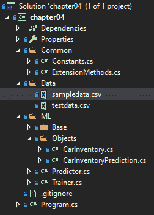
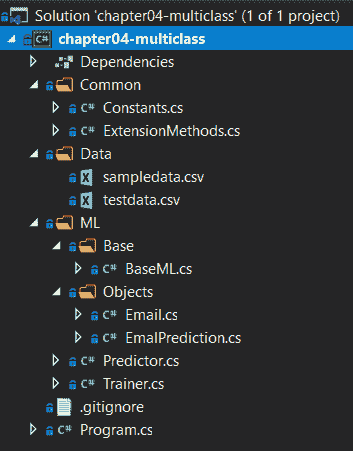

# 分类模型

在我们了解了回归模型之后，现在是时候深入到分类模型中去了。在本章中，我们将探讨分类模型背后的数学原理，以及分类模型的各种应用。此外，我们将构建两个新的 ML.NET 分类应用程序：第一个是一个二元分类示例，它将预测汽车价格是否为好交易，类似于你在汽车购买网站上找到的内容；另一个应用程序是一个多类分类应用程序，用于对电子邮件进行分类。最后，我们将探讨如何使用 ML.NET 在分类模型中公开的特性来评估分类模型。

在本章中，我们将涵盖以下主题：

+   解构分类模型

+   创建一个二元分类应用程序

+   创建一个多类分类应用程序

+   评估分类模型

# 解构分类模型

如第一章中所述，*开始使用机器学习和 ML.NET*，分类被分为两大类——二类和多类。在二类分类器中，也称为二元分类器，预测结果简单地返回 0 或 1。在多类问题中，返回预选的标签范围，例如病毒类型或汽车类型。

在机器学习生态系统中，有几种二元分类模型类型可供选择，如下所示：

+   `AveragedPerceptronTrainer`

+   `SdcaLogisticRegressionBinaryTrainer`

+   `SdcaNonCalibratedBinaryTrainer`

+   `SymbolicSgdLogisticRegressionBinaryTrainer`

+   `LbfgsLogisticRegressionBinaryTrainer`

+   `LightGbmBinaryTrainer`

+   `FastTreeBinaryTrainer`

+   `FastForestBinaryTrainer`

+   `GamBinaryTrainer`

+   `FieldAwareFactorizationMachineTrainer`

+   `PriorTrainer`

+   `LinearSvmTrainer`

我们将在本章后面创建的汽车价值应用程序将使用`FastTreeBinaryTrainer`模型。

ML.NET 还提供了以下多类分类器：

+   `LightGbmMulticlassTrainer`

+   `SdcaMaximumEntropyMulticlassTrainer`

+   `SdcaNonCalibratedMulticlassTrainer`

+   `LbfgsMaximumEntropyMulticlassTrainer`

+   `NaiveBayesMulticlassTrainer`

+   `OneVersusAllTrainer`

+   `PairwiseCouplingTrainer`

对于多类分类器示例应用程序，我们将使用`SdcaMaximumEntropyMulticlassTrainer`模型。这样做的原因是**随机双坐标上升法**（**SDCAs**）可以在不调整的情况下提供良好的默认性能。

# 选择分类训练器

针对两种分类类型，你应该选择哪一种？如本章前面所述，与回归模型相比，你的预测输出类型将决定是二分类还是多分类分类。你的问题仅仅是预测一个真或假的值，还是基于预定义的值集提供更丰富的输出？如果你的答案是前者，你需要使用二分类。如果是后者，你需要使用多分类分类。在本章中，我们将演示这两种模型预测类型。

对于特定的二分类训练器，SDCA、LightGBM 和 FastTree 是最受欢迎的选项，同时也是文档最完善的。

对于特定的多分类分类训练器，LightGBM 和 SDCA 是最受欢迎且文档最完善的选项。

# 创建一个二分类应用

如前所述，我们将创建的应用是一个汽车价值预测器。给定一组与汽车相关的属性，可以预测价格是否为好交易。本例中包含的属性并不是属性列表的最终版本，也不应在生产环境中直接使用。然而，可以用这个作为预测基于几个属性简单真或假答案的起点。

与前几章一样，完整的项目代码、样本数据集和项目文件可以在此处下载：[`github.com/PacktPublishing/Hands-On-Machine-Learning-With-ML.NET/tree/master/chapter04`](https://github.com/PacktPublishing/Hands-On-Machine-Learning-With-ML.NET/tree/master/chapter04)。

# 深入了解训练器

如前所述，对于这个二分类应用，我们将使用 FastTree 训练器。

FastTree 基于**多重加性回归树（MART**）梯度提升算法。梯度提升是一种非常流行的技术，它通过逐步构建一系列树，最终选择最佳树。MART 通过学习使用标量值在其叶子节点上的回归树集合，将这种方法进一步发展。

FastTree 训练器不需要归一化，但要求所有特征列使用`float`变量类型，标签列使用`bool`变量类型。

如果你对 MART 感兴趣，康奈尔大学有一篇 2015 年的论文讨论了该主题：[`arxiv.org/abs/1505.01866`](https://arxiv.org/abs/1505.01866)。

# 探索项目架构

在第三章中创建的项目架构和代码的基础上，即 *回归模型*，在此示例中，主要的架构变化是输入机制。对于此应用程序，由于我们使用的是 FastTree 算法，这需要引用 `Microsoft.ML.FastTree` NuGet 包（在撰写本文时，最新版本为 1.3.1）。如果您从头开始构建此项目并且不记得如何添加 NuGet 引用，请参阅第二章，即 *设置 ML.NET 环境*。

在下面的屏幕截图中，您将找到项目的 Visual Studio 解决方案资源管理器视图。解决方案的新增内容是 `testdata.csv` 文件，我们将在下面进行回顾：



`sampledata.csv` 文件包含 18 行随机数据。您可以随意调整数据以适应您的观察或调整训练好的模型。以下是数据的片段：

```py
0,0,0,4000,0
1,1,1,4500,1
0,1,0,5000,0
0,0,1,4500,0
0,0,0,3000,1
0,1,0,3100,1
0,1,1,3500,1
1,1,1,5500,0
1,1,1,4200,1
```

每一行都包含我们将在此章后面回顾的全新 `CarInventory` 类中属性的值。

此外，在本章中，我们添加了 `testdata.csv` 文件，其中包含额外的数据点，以测试新训练的模型并评估。以下是 `testdata.csv` 内部的数据片段：

```py
0,0,0,2010,1
1,0,0,2600,1
1,0,0,3700,0
1,1,0,3100,1
1,1,0,3600,0
0,1,0,3500,0
0,0,1,3400,1
0,0,1,5100,0
```

# 深入代码

如前节所述，对于此应用程序，我们正在基于第三章中完成的工作构建，即 *回归模型*。对于这次深入研究，我们将专注于此应用程序更改的代码。

以下是被更改或添加的类：

+   `CarInventory`

+   `CarInventoryPrediction`

+   `Predictor`

+   `训练器`

+   `程序`

# CarInventory 类

`CarInventory` 类是包含预测和训练模型所需数据的容器类。这些列按照之前审查的样本数据的顺序映射。如果您开始尝试新的功能并向以下类添加内容，请确保适当地增加数组索引，如下所示：

```py
using Microsoft.ML.Data;

namespace chapter04.ML.Objects
{
    public class CarInventory
    {
        [LoadColumn(0)]
        public float HasSunroof { get; set; }

        [LoadColumn(1)]
        public float HasAC { get; set; }

        [LoadColumn(2)]
        public float HasAutomaticTransmission { get; set; }

        [LoadColumn(3)]
        public float Amount { get; set; }

        [LoadColumn(4)]
        public bool Label { get; set; }
    }
}
```

# CarInventoryPrediction 类

`CarInventoryPrediction` 类包含映射到我们预测输出的属性，以及用于模型评估的 `Score` 和 `Probability` 属性。`PredictedLabel` 属性包含我们的分类结果，而不是像前几章中的标签，如下面的代码块所示：

```py
namespace chapter04.ML.Objects
{
    public class CarInventoryPrediction
    {
        public bool Label { get; set; }

        public bool PredictedLabel { get; set; }

        public float Score { get; set; }

        public float Probability { get; set; }
    }
}
```

# 预测器类

在此类中进行了几处更改以处理就业预测场景，如下所示：

1.  第一个更改是在预测调用本身。正如您可能猜到的，`TSrc` 和 `TDst` 参数需要调整以利用我们创建的两个新类，即 `CarInventory` 和 `CarInventoryPrediction`，如下所示：

```py
var predictionEngine = MlContext.Model.CreatePredictionEngine<CarInventory, CarInventoryPrediction>(mlModel);            
```

1.  由于我们不再只是传递字符串并在运行时构建对象，我们需要首先以文本形式读取文件。然后，我们将 JSON 反序列化到我们的`CarInventory`对象中，如下所示：

```py
var prediction = predictionEngine.Predict(JsonConvert.DeserializeObject<CarInventory>(json));
```

1.  最后，我们需要调整我们的预测输出以匹配新的`CarInventoryPrediction`属性，如下所示：

```py
Console.WriteLine(
    $"Based on input json:{System.Environment.NewLine}" +
    $"{json}{System.Environment.NewLine}" + 
    $"The car price is a {(prediction.PredictedLabel ? "good" : "bad")} deal, with a {prediction.Probability:P0} confidence");
```

# `Trainer`类

在`Trainer`类内部，需要做出一些修改以支持二元分类，如下所示：

1.  第一个更改是检查测试文件名是否存在，如下面的代码块所示：

```py
if (!File.Exists(testFileName))
{
    Console.WriteLine($"Failed to find test data file ({testFileName}");

    return;
}
```

1.  然后，我们使用在第三章中使用的`NormalizeMeanVariance`转换方法构建数据处理管道，该方法用于输入值，如下所示：

```py
IEstimator<ITransformer> dataProcessPipeline = MlContext.Transforms.Concatenate("Features",
 typeof(CarInventory).ToPropertyList<CarInventory>(nameof(CarInventory.Label)))
 .Append(MlContext.Transforms.NormalizeMeanVariance(inputColumnName: "Features",
 outputColumnName: "FeaturesNormalizedByMeanVar"));
```

1.  然后，我们可以使用来自`CarInventory`类的标签和归一化均值方差创建`FastTree`训练器，如下所示：

```py
var trainer = MlContext.BinaryClassification.Trainers.FastTree(
    labelColumnName: nameof(CarInventory.Label),
    featureColumnName: "FeaturesNormalizedByMeanVar",
    numberOfLeaves: 2,
    numberOfTrees: 1000,
    minimumExampleCountPerLeaf: 1,
    learningRate: 0.2);
```

之后，在您运行应用程序之后，考虑调整叶子和树的数量，以查看模型指标和您的预测概率百分比如何变化。

1.  最后，我们调用`Regression.Evaluate`方法提供回归特定的指标，然后通过`Console.WriteLine`调用将这些指标输出到控制台。我们将在本章的最后部分详细说明这些指标的含义，但现在，代码如下所示：

```py
var trainingPipeline = dataProcessPipeline.Append(trainer);

var trainedModel = trainingPipeline.Fit(trainingDataView);

MlContext.Model.Save(trainedModel, trainingDataView.Schema, ModelPath);
```

现在，我们评估我们刚刚训练的模型，如下所示：

```py
var evaluationPipeline = trainedModel.Append(MlContext.Transforms
 .CalculateFeatureContribution(trainedModel.LastTransformer)
 .Fit(dataProcessPipeline.Fit(trainingDataView).Transform(trainingDataView)));

var testDataView = MlContext.Data.LoadFromTextFile<CarInventory>(testFileName, ',', hasHeader: false);

var testSetTransform = evaluationPipeline.Transform(testDataView);

var modelMetrics = MlContext.BinaryClassification.Evaluate(data: testSetTransform,
 labelColumnName: nameof(CarInventory.Label),
 scoreColumnName: "Score");
```

最后，我们输出所有的分类指标。我们将在下一节详细说明每个指标，但现在，代码如下所示：

```py
Console.WriteLine($"Accuracy: {modelMetrics.Accuracy:P2}");
Console.WriteLine($"Area Under Curve: {modelMetrics.AreaUnderRocCurve:P2}");
Console.WriteLine($"Area under Precision recall Curve: {modelMetrics.AreaUnderPrecisionRecallCurve:P2}");
Console.WriteLine($"F1Score: {modelMetrics.F1Score:P2}");
Console.WriteLine($"LogLoss: {modelMetrics.LogLoss:#.##}");
Console.WriteLine($"LogLossReduction: {modelMetrics.LogLossReduction:#.##}");
Console.WriteLine($"PositivePrecision: {modelMetrics.PositivePrecision:#.##}");
Console.WriteLine($"PositiveRecall: {modelMetrics.PositiveRecall:#.##}");
Console.WriteLine($"NegativePrecision: {modelMetrics.NegativePrecision:#.##}");
Console.WriteLine($"NegativeRecall: {modelMetrics.NegativeRecall:P2}");
```

# `Program`类

在`Program`类中唯一的更改是帮助文本，用于指示训练者接受测试文件的使用方法，如下面的代码块所示：

```py
if (args.Length < 2)
{
    Console.WriteLine($"Invalid arguments passed in, exiting.{Environment.NewLine}        {Environment.NewLine}Usage:{Environment.NewLine}" +
 $"predict <path to input json file>{Environment.NewLine}" +
 $"or {Environment.NewLine}" +
 $"train <path to training data file> <path to test data file>{Environment.NewLine}");

    return;
}
```

最后，我们修改`switch`/`case`语句以支持`Train`方法的附加参数，如下所示：

```py
switch (args[0])
{
    case "predict":
        new Predictor().Predict(args[1]);
        break;
    case "train":
        new Trainer().Train(args[1], args[2]);
        break;
    default:
        Console.WriteLine($"{args[0]} is an invalid option");
        break;
}
```

# 运行应用程序

要运行应用程序，过程几乎与第三章中的示例应用程序相同，只是在训练时添加了传递测试数据集，如下所述：

1.  要在命令行上运行训练，就像我们在第一章中做的那样，*开始使用机器学习和 ML.NET*，我们只需传递以下命令（假设您正在使用包含的示例数据集和测试数据集）：

```py
PS chapter04\bin\Debug\netcoreapp3.0> .\chapter04.exe train ..\..\..\Data\sampledata.csv ..\..\..\Data\testdata.csv
Accuracy: 88.89%
Area Under Curve: 100.00%
Area under Precision recall Curve: 100.00%
F1Score: 87.50%
LogLoss: 2.19
LogLossReduction: -1.19
PositivePrecision: 1
PositiveRecall: .78
NegativePrecision: .82
NegativeRecall: 100.00%
```

注意扩展的输出包括几个指标数据点——我们将在本章末尾解释这些数据点各自的意义。

1.  训练模型后，构建一个示例 JSON 文件，并将其保存为`input.json`，如下所示：

```py
{
    "HasSunroof":0,
    "HasAC":0,
    "HasAutomaticTransmission":0,
    "Amount":1300
}
```

1.  要使用此文件运行模型，只需将文件名传递给构建的应用程序，预测输出将如下所示：

```py
PS chapter04\bin\Debug\netcoreapp3.0> .\chapter04.exe predict .\input.json
Based on input json:
{
"HasSunroof":0,"HasAC":0,"HasAutomaticTransmission":0,"Amount":1300
}
The car price is a good deal, with a 100% confidence
```

随意修改这些值，并查看基于模型训练数据集的预测如何变化。从这个点开始，一些实验区域可能如下：

+   根据您自己的购车经验添加一些额外特征

+   修改`sampledata.csv`文件以包含您自己的购车经验

+   修改示例应用程序以具有**图形用户界面**（**GUI**），以便更容易运行预测

# 创建一个多类分类应用程序

如前所述，我们现在将创建一个多类分类应用程序，将电子邮件分类为以下三个类别之一：

+   订单

+   垃圾邮件

+   朋友

将此示例应用于生产应用程序可能会包含更多类别以及更多特征。然而，这是一个很好的起点，用于演示多类分类用例。

与其他示例一样，完整的项目代码、样本数据集和项目文件可以在此处下载：[`github.com/PacktPublishing/Hands-On-Machine-Learning-With-ML.NET/tree/master/chapter04-multiclass`](https://github.com/PacktPublishing/Hands-On-Machine-Learning-With-ML.NET/tree/master/chapter04-multiclass)。

# 深入了解训练器

如前所述，对于这个多类分类应用程序，我们将使用`SdcaMaximumEntropy`训练器。

如其名称所示，`SdcaMaximumEntropy`类基于我们在第三章中深入探讨的 SDCA，即*回归模型*，并使用经验风险最小化，根据训练数据进行优化。这确实留下了异常值或异常对预测性能产生重大影响的潜在可能性。因此，当使用此训练器时，请向训练器提供足够的预期数据样本，以避免过拟合以及在预测数据时可能出现的错误。

与之前的二分类示例不同，`SdcaMaximumEntropy`训练器确实需要归一化。此外，不需要缓存；然而，我们在构建管道时确实使用了缓存。

# 探索项目架构

在本章前面创建的项目架构和代码的基础上，本项目不需要包含任何新的 NuGet 包，因为 SDCA 训练器被视为核心训练器。主要变化在于`Training`管道，我们将在本节后面的部分进一步详细说明。

在下面的屏幕截图中，您将找到项目的 Visual Studio 解决方案资源管理器视图：



`sampledata.csv`文件包含六行随机数据。请随意调整数据以适应您的观察或调整训练模型。以下是数据的片段：

```py
"Order #1234","Thank you for ordering a new CPU","order@cpulandia.com","orders"
"Get Free Free","Click here for everything free","freefree@asasdasd.com","spam"
"Checking in","How is it going?","johndough@gmail.com","friend"
"Order 4444","Thank you for ordering a pizza","order@pizzalandia.com","orders"
"Unlock Free","Click here to unlock your spam","spammer@asasdasd.com","spam"
"Hello","Did you see my last message?","janedough@gmail.com","friend"
```

每一行都包含我们将在本章后面审查的新创建的`Email`类中属性的值。

此外，在本章中，我们添加了包含额外数据点的`testdata.csv`文件，以便对新训练的模型进行测试。以下是数据的片段：

```py
"Order 955","Thank you for ordering a new gpu","order@gpulandia.com","orders"
"Win Free Money","Lottery winner, click here","nowfree@asasdasd.com","spam"
"Yo","Hey man?","john@gmail.com","friend"
```

# 深入代码

对于这个应用，正如之前提到的，我们是在 第三章 完成的作品基础上进行构建的，*回归模型*。对于这次深入探讨，我们将专注于为这个应用更改的代码。

被更改或添加的类如下：

+   `Email`

+   `EmailPrediction`

+   `Predictor`

+   `Trainer`

+   `Program`

# `Email` 类

`Email` 类是包含用于预测和训练模型数据的容器类。这些列按照之前审查的样本数据的顺序映射。如果你开始尝试新的特征并添加到这个列表中，确保适当地增加数组索引，如下面的代码块所示：

```py
using Microsoft.ML.Data;

namespace chapter04_multiclass.ML.Objects
{
    public class Email
    {
        [LoadColumn(0)]
        public string Subject { get; set; }

        [LoadColumn(1)]
        public string Body { get; set; }

        [LoadColumn(2)]
        public string Sender { get; set; }

        [LoadColumn(3)]
        public string Category { get; set; }
    }
}
```

# `EmailPrediction` 类

`EmailPrediction` 类包含映射到预测输出并用于模型评估的属性。在下面的代码块中，我们返回 `Category` 值（字符串值）：

```py
using Microsoft.ML.Data;

namespace chapter04_multiclass.ML.Objects
{
    public class EmalPrediction
    {
        [ColumnName("PredictedLabel")]
        public string Category;
    }
}
```

# `Predictor` 类

在这个类中有一两个更改来处理电子邮件分类预测场景，如下所示：

1.  第一个更改是在预测调用本身。正如你可能猜到的，`TSrc` 和 `TDst` 参数需要调整以利用我们创建的两个新类，`Email` 和 `EmailPrediction`，如下所示：

```py
var predictionEngine = MlContext.Model.CreatePredictionEngine<Email, EmailPrediction>(mlModel);            
```

1.  由于我们不再只是传递字符串并在运行时构建对象，我们首先需要以文本形式读取文件。然后，我们将 JSON 反序列化到我们的 `Email` 对象中，如下所示：

```py
var prediction = predictionEngine.Predict(JsonConvert.DeserializeObject<Email>(json));
```

1.  最后，我们需要调整预测输出的结果以匹配我们新的 `EmailPrediction` 属性，如下所示：

```py
Console.WriteLine(
    $"Based on input json:{System.Environment.NewLine}" +
    $"{json}{System.Environment.NewLine}" + 
    $"The email is predicted to be a {prediction.Category}");
```

# `Trainer` 类

在这个类中有一两个更改来处理电子邮件分类预测场景，如下所示：

1.  首先，我们读取 `trainingFileName` 字符串并将其转换为 `Email` 对象，如下所示：

```py
var trainingDataView = MlContext.Data.LoadFromTextFile<Email>(trainingFileName, ',', hasHeader: false);           
```

1.  接下来，我们将创建我们的管道，将输入属性映射到 `FeaturizeText` 转换，然后再附加我们的 SDCA 训练器，如下所示：

```py
var dataProcessPipeline = MlContext.Transforms.Conversion.MapValueToKey(inputColumnName: nameof(Email.Category), outputColumnName: "Label")
    .Append(MlContext.Transforms.Text.FeaturizeText(inputColumnName: nameof(Email.Subject), outputColumnName: "SubjectFeaturized"))
    .Append(MlContext.Transforms.Text.FeaturizeText(inputColumnName: nameof(Email.Body), outputColumnName: "BodyFeaturized"))
    .Append(MlContext.Transforms.Text.FeaturizeText(inputColumnName: nameof(Email.Sender), outputColumnName: "SenderFeaturized"))
    .Append(MlContext.Transforms.Concatenate("Features", "SubjectFeaturized", "BodyFeaturized", "SenderFeaturized"))
    .AppendCacheCheckpoint(MlContext);

var trainingPipeline = dataProcessPipeline
    .Append(MlContext.MulticlassClassification.Trainers.SdcaMaximumEntropy("Label", "Features"))
    .Append(MlContext.Transforms.Conversion.MapKeyToValue("PredictedLabel"));
```

1.  最后，我们加载测试数据，运行 `MultiClassClassification` 评估，然后输出四个模型评估属性，如下所示：

```py
var testDataView = MlContext.Data.LoadFromTextFile<Email>(testFileName, ',', hasHeader: false);

var modelMetrics = MlContext.MulticlassClassification.Evaluate(trainedModel.Transform(testDataView));

Console.WriteLine($"MicroAccuracy: {modelMetrics.MicroAccuracy:0.###}");
Console.WriteLine($"MacroAccuracy: {modelMetrics.MacroAccuracy:0.###}");
Console.WriteLine($"LogLoss: {modelMetrics.LogLoss:#.###}");
Console.WriteLine($"LogLossReduction: {modelMetrics.LogLossReduction:#.###}");
```

# 运行应用程序

要运行应用程序，过程几乎与 第三章 *回归模型* 中的示例应用程序相同，只是在训练时添加了测试数据集：

1.  要在命令行上运行训练，就像我们在 第一章 *使用机器学习和 ML.NET 入门* 中做的那样，只需传递以下命令（假设你正在使用包含的样本数据集和测试数据集）：

```py
PS chapter04-multiclass\bin\Debug\netcoreapp3.0> .\chapter04-multiclass.exe train ..\..\..\Data\sampledata.csv ..\..\..\Data\testdata.csv
MicroAccuracy: 1
MacroAccuracy: 1
LogLoss: .1
LogLossReduction: .856
```

注意输出已扩展以包含几个指标数据点——我们将在本章末尾解释每个数据点的含义。

1.  在训练好模型后，创建一个示例 JSON 文件并将其保存为 `input.json`，如下所示：

```py
{
    "Subject":"hello",
    "Body":"how is it?",
    "Sender":"joe@gmail.com"
}
```

1.  要使用此文件运行模型，只需将文件名传递给构建的应用程序，预测输出将显示如下：

```py
PS chapter04-multiclass\bin\Debug\netcoreapp3.0> .\chapter04-multiclass.exe predict .\input.json
Based on input json:
{
"Subject":"hello",
"Body":"how is it?",
"Sender":"joe@gmail.com"
}
The email is predicted to be a "friend"
```

随意修改这些值，看看基于模型训练数据集的预测如何变化。从这个点开始，一些实验领域可能包括：

+   根据你自己的电子邮件添加更多样本和测试数据。

+   根据你自己的电子邮件添加更多类别。

+   扩展特征，例如发送日期和发送者的 IP 地址。

# 评估分类模型

如前几章所述，评估模型是整个模型构建过程中的关键部分。一个训练不当的模型只会提供不准确的预测。幸运的是，ML.NET 提供了许多流行的属性来计算模型精度，基于训练时的测试集，以给你一个关于模型在生产环境中表现如何的印象。

在 ML.NET 中，如前所述的示例应用程序中提到的，有几个属性构成了`CalibratedBinaryClassificationMetrics`类对象。在第二章《设置 ML.NET 环境》中，我们回顾了这些属性的一些内容。然而，现在我们有一个更复杂的示例，并且已经学会了如何评估回归模型，让我们深入了解以下属性：

+   精度

+   ROC 曲线下的面积

+   F1 分数

+   精确率-召回率曲线下的面积

此外，我们还将查看在多分类分类应用程序中使用的`MulticlassClassificationMetrics`对象返回的以下四个指标：

+   微精度

+   宏精度

+   对数损失

+   对数损失减少

在下一节中，我们将分解这些值的计算方法，并详细说明要寻找的理想值。

# 精度

精度是测试数据集中正确预测与错误预测的比例。

你希望尽可能接近 100%的值，但不是正好 100%。正如我们在二分类示例中所看到的，我们得到了 88.89%——接近 100%，但并不完全。如果你在实验中看到 100%的分数，你很可能遇到了过拟合的情况。

# ROC 曲线下的面积

罗马曲线下的面积，通常也称为 AUC，是曲线下面积的度量。

与精度一样，接近 100%的值是理想的。如果你看到低于 50%的值，你的模型可能需要更多的特征和/或更多的训练数据。

# F1 分数

F1 分数是精确率和召回率的调和平均值。

值接近或等于 100%更受欢迎。0 的值表示你的精确率完全不准确。正如我们在二分类示例中所看到的，我们得到了 87.50%。

# 精确率-召回率曲线下的面积

精确率-召回率曲线下的面积，通常也称为 AUPRC，是成功预测的衡量标准。当你的数据集不平衡到某一分类时，应检查此值。

与 AUC 和精度一样，更倾向于接近 100%的值，因为这表明你有很高的召回率。正如我们在二分类示例中所看到的，我们得到了 100%的 AUPRC 值。

# 微精度

微精度评估每个样本-类别对是否对准确度指标贡献相等。

值接近或等于 1 更受欢迎。正如我们在示例应用中使用样本和测试数据集所示，达到了 1 的值。

# 宏观准确度

宏观准确度评估每个类别对是否对准确度指标贡献相等。

值接近或等于 1 更受欢迎。正如我们在示例应用中使用样本和测试数据集所示，达到了 1 的值。

# 对数损失

对数损失是描述分类器准确度的评估指标。对数损失考虑了模型预测与实际分类之间的差异。

值接近 0 更受欢迎，因为 0 表示模型在测试集上的预测是完美的。正如我们在示例应用中使用样本和测试数据集所示，达到了 0.1 的值。

# 对数损失降低

对数损失降低是一个简单的评估指标，描述了分类器的准确度与随机预测相比。

值接近或等于 1 更受欢迎，因为随着值的接近 1，模型的相对准确度提高。正如我们在示例应用中使用样本和测试数据集所示，达到了 0.856 的值，这意味着猜测正确答案的概率是 85.6%。

# 摘要

在本章中，我们深入探讨了分类模型。我们还创建并训练了我们的第一个二分类应用，使用 FastTree 和 ML.NET 来预测汽车价格的好坏。我们还创建了我们第一个多分类应用，使用 SDCA 训练器对电子邮件进行分类。最后，我们还深入探讨了如何评估分类模型以及 ML.NET 公开的各种属性，以正确评估您的分类模型。

在下一章中，我们将深入探讨 ML.NET 中的聚类算法以及创建文件类型分类器。
