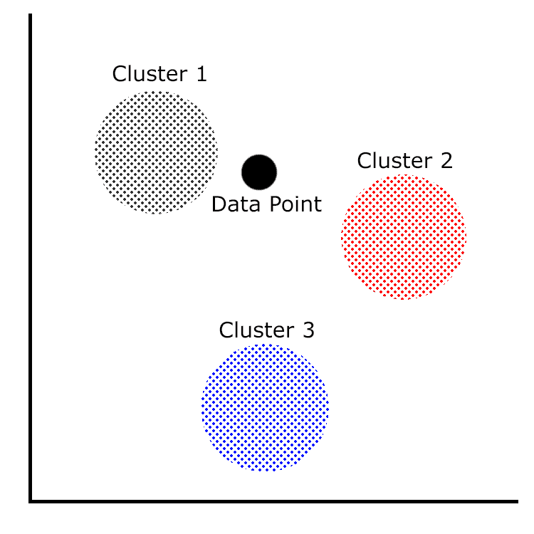
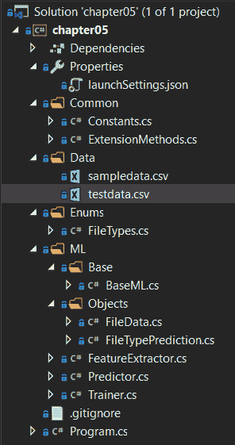

# 聚类模型

在分类模型之后，现在是时候深入探讨聚类模型了。目前，在 ML.NET 中只有一个聚类算法，即 k-means。在本章中，我们将深入探讨 k-means 聚类以及最适合使用聚类算法的各种应用。此外，我们将构建一个新的 ML.NET 聚类应用程序，该程序仅通过查看内容就能确定文件的类型。最后，我们将探讨如何使用 ML.NET 公开的属性来评估 k-means 聚类模型。

在本章中，我们将涵盖以下主题：

+   分析 k-means 算法

+   创建聚类应用程序

+   评估 k-means 模型

# 分析 k-means 算法

如第一章中所述，“使用 ML.NET 开始机器学习之旅”，根据定义，k-means 聚类是一种无监督学习算法。这意味着数据根据提供给模型进行训练的数据被分组到各个簇中。在本节中，我们将深入探讨聚类的多种用例以及 k-means 训练器。

# 聚类的用例

正如你可能开始意识到的，聚类有众多应用，其输出将相似输出分类为相似数据点的组。

它的一些潜在应用包括以下内容：

+   跟踪自然灾害，如地震或飓风，并创建高风险区域的簇

+   根据作者、主题和来源对书籍或文档进行分组

+   将客户数据分组以进行目标市场营销预测

+   搜索结果分组，将其他用户认为有用的相似结果分组在一起

此外，它还有许多其他应用，如预测恶意软件家族或癌症研究的医疗用途。

# 深入了解 k-means 训练器

ML.NET 中使用的 k-means 训练器是基于阴阳方法，而不是经典的 k-means 实现。像我们在前几章中查看的一些训练器一样，所有输入都必须是 Float 类型。此外，所有输入都必须归一化到一个单一的特征向量中。幸运的是，k-means 训练器包含在主要的 ML.NET NuGet 包中；因此，不需要额外的依赖项。

要了解更多关于阴阳实现的信息，微软研究院在此发布了白皮书：[`www.microsoft.com/en-us/research/wp-content/uploads/2016/02/ding15.pdf`](https://www.microsoft.com/en-us/research/wp-content/uploads/2016/02/ding15.pdf)。

看一下以下图表，展示了三个簇和一个数据点：



在聚类中，每个这些簇代表了一组相似数据点的分组。对于 k-means 聚类（以及其他聚类算法），数据点与每个簇之间的距离是模型将返回哪个簇的度量。对于 k-means 聚类特别来说，它使用每个簇的中心点（也称为质心）并计算到数据点的距离。这些值中最小的是预测的簇。

对于 k-means 训练器，它可以以三种方式之一进行初始化。一种方式是使用随机初始化——正如你可能猜到的，这可能导致随机的预测结果。另一种方式是使用 k-means++，它力求产生 O(log K) 的预测。最后，ML.NET 的默认方法 k-means|| 使用并行方法来减少初始化所需的遍历次数。

关于 k-means|| 的更多信息，你可以参考斯坦福大学发表的一篇论文，其中对其进行了详细解释：[`theory.stanford.edu/~sergei/papers/vldb12-kmpar.pdf`](https://theory.stanford.edu/~sergei/papers/vldb12-kmpar.pdf)。

关于 k-means++ 的更多信息，你可以参考斯坦福大学在 2006 年发表的一篇论文，其中对其进行了详细解释：[`ilpubs.stanford.edu:8090/778/1/2006-13.pdf`](http://ilpubs.stanford.edu:8090/778/1/2006-13.pdf)。

我们将在下一节中演示这个训练器。

# 创建聚类应用程序

如前所述，我们将创建的应用程序是一个文件类型分类器。给定从文件中静态提取的一组属性，预测将返回它是一个文档、可执行文件还是脚本。对于那些使用过 Linux `file` 命令的人来说，这是一个简化的版本，但基于机器学习。本例中包含的属性不是属性的确切列表，也不应在生产环境中直接使用；然而，你可以将其用作创建基于机器学习的 Linux `file` 命令替代品的起点。

与前面的章节一样，完整的项目代码、样本数据集和项目文件可以在此处下载：[`github.com/PacktPublishing/Hands-On-Machine-Learning-With-ML.NET/tree/master/chapter05`](https://github.com/PacktPublishing/Hands-On-Machine-Learning-With-ML.NET/tree/master/chapter05)。

# 探索项目架构

在前面章节中创建的项目架构和代码的基础上，主要的架构变化是在训练集和测试集上进行的特征提取。

在这里，你可以找到项目的 Visual Studio Solution Explorer 视图。解决方案中的新增文件是 `FileTypes`、`FileData` 和 `FilePrediction` 文件，我们将在本节稍后进行回顾：



`sampledata.csv` 文件包含了我系统上的 80 行随机文件，包括 30 个 Windows 可执行文件，20 个 PowerShell 脚本和 20 个 Word 文档。请随意调整数据以适应您的观察或调整训练好的模型。以下是数据的一个片段：

```py
0,1,1,0
0,1,1,0
0,1,1,0
2,0,0,0
2,0,0,0
2,0,0,0
2,0,0,0
2,0,0,0
2,0,0,0
2,0,0,0
2,0,0,0
2,0,0,0
2,0,0,0
2,0,0,0
1,1,0,1
1,1,0,1
1,1,0,1
1,1,0,1
```

每一行都包含新创建的 `FileData` 类中属性的值，我们将在本章稍后进行回顾。

此外，我们还添加了 `testdata.csv` 文件，其中包含额外的数据点，用于测试新训练的模型并评估。分布是均匀的，包括 10 个 Windows 可执行文件，10 个 PowerShell 脚本和 10 个 Word 文档。以下是 `testdata.csv` 内部数据的一个片段：

```py
0,1,1,0
0,1,1,0
2,0,0,0
2,0,0,0
2,0,0,0
2,0,0,0
2,0,0,0
2,0,0,0
1,1,0,1
```

# 深入代码

如前节所述，对于这个应用，我们正在构建在 第四章 完成的作品之上，即 *分类模型*。对于这次深入探讨，我们将专注于为这个应用更改的代码。

被更改或添加的类如下：

+   `Constants`

+   `` `BaseML` ``

+   `FileTypes`

+   `FileData`

+   `FileTypePrediction`

+   `FeatureExtractor`

+   `Predictor`

+   `Trainer`

+   `Program`

# `Constants` 类

`Constants` 类已被更改，以将模型保存到 `chapter5.mdl`，同时支持提取特征的 `testdata.csv` 变量。以下代码块反映了这些更改：

```py
namespace chapter05.Common
{
    public class Constants
    {
        public const string MODEL_FILENAME = "chapter5.mdl";

        public const string SAMPLE_DATA = "sampledata.csv";

        public const string TEST_DATA = "testdata.csv";
    }
}
```

# `BaseML` 类

在 `BaseML` 类中唯一的更改是添加了 `FEATURES` 变量。通过在这里使用变量，我们可以移除在 `Trainer` 类中使用魔法字符串的需求（我们将在本节稍后讨论这一点）：

```py
protected const string FEATURES = "Features";
```

# `FileTypes` 枚举

`FileTypes` 枚举包含一个强类型方法，用于映射我们的分类和数值。正如我们在先前的示例中所发现的那样，使用枚举而不是魔法或常量值提供了更好的灵活性，正如这里和剩余类中所示：

```py
namespace chapter05.Enums
{
    public enum FileTypes
    {
        Executable = 0,
        Document = 1,
        Script = 2
    }
}
```

# `FileData` 类

`FileData` 类是包含用于预测和训练我们的模型的数据的容器类：

1.  首先，我们添加了 `True` 和 `False` 的常量值，因为 k-means 需要浮点数值：

```py
public class FileData
{
    private const float TRUE = 1.0f;
    private const float FALSE = 0.0f;
```

1.  接下来，我们创建了一个构造函数，它支持我们的预测和训练。我们可以选择性地传递训练的文件名以提供标签，在这种情况下，对于脚本、可执行文件和文档，分别是 `ps1`、`exe` 和 `doc`。我们还调用辅助方法来确定文件是否为二进制文件，或者它是否以 MZ 或 PK 开头：

```py
public FileData(Span<byte> data, string fileName = null)
{
    // Used for training purposes only
    if (!string.IsNullOrEmpty(fileName))
    {
        if (fileName.Contains("ps1"))
        {
            Label = (float) FileTypes.Script;
        } else if (fileName.Contains("exe"))
        {
            Label = (float) FileTypes.Executable;
        } else if (fileName.Contains("doc"))
        {
            Label = (float) FileTypes.Document;
        }
    }

    IsBinary = HasBinaryContent(data) ? TRUE : FALSE;

    IsMZHeader = HasHeaderBytes(data.Slice(0, 2), "MZ") ? TRUE : FALSE;

    IsPKHeader = HasHeaderBytes(data.Slice(0, 2), "PK") ? TRUE : FALSE;
}
```

MZ 和 PK 被认为是 Windows 可执行文件和现代 Microsoft Office 文件的魔法数字。魔法数字是位于每个文件开头的唯一字节字符串。在这种情况下，两者都是两个字节。在分析文件时，快速确定对于性能至关重要。对于细心的读者，PK 也是 ZIP 的魔法数字。现代 Microsoft Office 文档实际上是 ZIP 存档。为了简化本例，我们使用 PK 而不是执行额外的检测级别。

1.  接下来，我们还添加了一个额外的构造函数来支持值的硬真设置。我们将在本节稍后深入了解此添加的目的：

```py
/// <summary>
/// Used for mapping cluster ids to results only
/// </summary>
/// <param name="fileType"></param>
public FileData(FileTypes fileType)
{
    Label = (float)fileType;

    switch (fileType)
    {
        case FileTypes.Document:
            IsBinary = TRUE;
            IsMZHeader = FALSE;
            IsPKHeader = TRUE;
            break;
        case FileTypes.Executable:
            IsBinary = TRUE;
            IsMZHeader = TRUE;
            IsPKHeader = FALSE;
            break;
        case FileTypes.Script:
            IsBinary = FALSE;
            IsMZHeader = FALSE;
            IsPKHeader = FALSE;
            break;
    }
}
```

1.  接下来，我们实现我们的两个辅助方法。第一个，`HasBinaryContent`，正如其名所示，接受原始二进制数据并搜索非文本字符以确保它是一个二进制文件。其次，我们定义`HasHeaderBytes`；此方法接受一个字节数组，将其转换为`UTF8`字符串，然后检查该字符串是否与传入的字符串匹配：

```py
private static bool HasBinaryContent(Span<byte> fileContent) =>
            System.Text.Encoding.UTF8.GetString(fileContent.ToArray()).Any(a => char.IsControl(a) && a != '\r' && a != '\n');

private static bool HasHeaderBytes(Span<byte> data, string match) => System.Text.Encoding.UTF8.GetString(data) == match;
```

1.  接下来，我们添加用于预测、训练和测试的属性：

```py
[ColumnName("Label")]
public float Label { get; set; }

public float IsBinary { get; set; }

public float IsMZHeader { get; set; }

public float IsPKHeader { get; set; }
```

1.  最后，我们重写`ToString`方法以用于特征提取：

```py
public override string ToString() => $"{Label},{IsBinary},{IsMZHeader},{IsPKHeader}";
```

# `FileTypePrediction`类

`FileTypePrediction`类包含映射到我们的预测输出的属性。在 k-means 聚类中，`PredictedClusterId`属性存储找到的最近簇。此外，`Distances`数组包含数据点到每个簇的距离：

```py
using Microsoft.ML.Data;

namespace chapter05.ML.Objects
{
    public class FileTypePrediction
    {
        [ColumnName("PredictedLabel")]
        public uint PredictedClusterId;

        [ColumnName("Score")]
        public float[] Distances;
    }
}
```

# `FeatureExtractor`类

我们在第三章的“回归模型”示例中使用的`FeatureExtractor`类已被调整以支持测试和训练数据提取：

1.  首先，我们将提取泛化到接受文件夹路径和输出文件。如前所述，我们还传递了文件名，以确保`Labeling`在`FileData`类内部干净地发生：

```py
private void ExtractFolder(string folderPath, string outputFile)
{
    if (!Directory.Exists(folderPath))
    {
        Console.WriteLine($"{folderPath} does not exist");

        return;
    }

    var files = Directory.GetFiles(folderPath);

    using (var streamWriter =
        new StreamWriter(Path.Combine(AppContext.BaseDirectory, $"../../../Data/{outputFile}")))
    {
        foreach (var file in files)
        {
            var extractedData = new FileData(File.ReadAllBytes(file), file);

            streamWriter.WriteLine(extractedData.ToString());
        }
    }

    Console.WriteLine($"Extracted {files.Length} to {outputFile}");
}
```

1.  最后，我们从命令行中获取两个参数（由`Program`类调用）并简单地再次调用前面的方法：

```py
public void Extract(string trainingPath, string testPath)
{
    ExtractFolder(trainingPath, Constants.SAMPLE_DATA);
    ExtractFolder(testPath, Constants.TEST_DATA);
}
```

# `Predictor`类

在此类中有一两个更改来处理文件类型预测场景：

1.  首先，我们添加一个辅助方法`GetClusterToMap`，它将已知值映射到预测簇。注意这里使用`Enum.GetValues`；随着你添加更多文件类型，此方法不需要修改：

```py
private Dictionary<uint, FileTypes> GetClusterToMap(PredictionEngineBase<FileData, FileTypePrediction> predictionEngine)
{
    var map = new Dictionary<uint, FileTypes>();

    var fileTypes = Enum.GetValues(typeof(FileTypes)).Cast<FileTypes>();

    foreach (var fileType in fileTypes)
    {
        var fileData = new FileData(fileType);

        var prediction = predictionEngine.Predict(fileData);

        map.Add(prediction.PredictedClusterId, fileType);
    }

    return map;
}         
```

1.  接下来，我们将`FileData`和`FileTypePrediction`类型传递给`CreatePredictionEngine`方法以创建我们的预测引擎。然后，我们将文件作为二进制文件读取，并在运行预测和映射初始化之前将这些字节传递给`FileData`构造函数：

```py
var predictionEngine = MlContext.Model.CreatePredictionEngine<FileData, FileTypePrediction>(mlModel);

var fileData = new FileData(File.ReadAllBytes(inputDataFile));

var prediction = predictionEngine.Predict(fileData);

var mapping = GetClusterToMap(predictionEngine);
```

1.  最后，我们需要调整输出以匹配 k-means 预测返回的输出，包括欧几里得距离：

```py
Console.WriteLine(
    $"Based on input file: {inputDataFile}{Environment.NewLine}{Environment.NewLine}" +
    $"Feature Extraction: {fileData}{Environment.NewLine}{Environment.NewLine}" +
    $"The file is predicted to be a {mapping[prediction.PredictedClusterId]}{Environment.NewLine}");

Console.WriteLine("Distances from all clusters:");

for (uint x = 0; x < prediction.Distances.Length; x++) { 
    Console.WriteLine($"{mapping[x+1]}: {prediction.Distances[x]}");
}
```

# `Trainer`类

在`Trainer`类内部，需要进行一些修改以支持 k-means 分类：

1.  第一个变化是添加了一个`GetDataView`辅助方法，它从`FileData`类中先前定义的列构建`IDataView`对象：

```py
private IDataView GetDataView(string fileName)
{
    return MlContext.Data.LoadFromTextFile(path: fileName,
        columns: new[]
        {
            new TextLoader.Column(nameof(FileData.Label), DataKind.Single, 0),
            new TextLoader.Column(nameof(FileData.IsBinary), DataKind.Single, 1),
            new TextLoader.Column(nameof(FileData.IsMZHeader), DataKind.Single, 2),
            new TextLoader.Column(nameof(FileData.IsPKHeader), DataKind.Single, 3)
        },
        hasHeader: false,
        separatorChar: ',');
}
```

1.  我们接下来构建数据处理管道，将列转换为一个单独的`Features`列：

```py
var trainingDataView = GetDataView(trainingFileName);

var dataProcessPipeline = MlContext.Transforms.Concatenate(
    FEATURES,
    nameof(FileData.IsBinary),
    nameof(FileData.IsMZHeader),
    nameof(FileData.IsPKHeader));
```

1.  然后，我们可以创建一个具有 3 个聚类的 k-means 训练器并创建模型：

```py
var trainer = MlContext.Clustering.Trainers.KMeans(featureColumnName: FEATURES, numberOfClusters: 3);
var trainingPipeline = dataProcessPipeline.Append(trainer);
var trainedModel = trainingPipeline.Fit(trainingDataView);

MlContext.Model.Save(trainedModel, trainingDataView.Schema, ModelPath);
```

聚类数量的默认值为 5。一个有趣的实验是基于这个数据集或您修改后的数据集，看看通过调整这个值预测结果如何变化。

1.  现在，我们使用测试数据集评估我们刚刚训练的模型：

```py
var testingDataView = GetDataView(testingFileName);

IDataView testDataView = trainedModel.Transform(testingDataView);

ClusteringMetrics modelMetrics = MlContext.Clustering.Evaluate(
    data: testDataView,
    labelColumnName: "Label",
    scoreColumnName: "Score",
    featureColumnName: FEATURES);
```

1.  最后，我们输出所有分类度量，我们将在下一节中详细介绍每个度量。

```py
Console.WriteLine($"Average Distance: {modelMetrics.AverageDistance}");
Console.WriteLine($"Davies Bould Index: {modelMetrics.DaviesBouldinIndex}");
Console.WriteLine($"Normalized Mutual Information: {modelMetrics.NormalizedMutualInformation}");
```

# `Program`类

如前几章所述，`Program`类是我们应用程序的主要入口点。`Program`类中唯一的变化是帮助文本，用于指示如何使用`extract`方法接受提取测试文件夹路径：

```py
if (args.Length < 2)
{
    Console.WriteLine($"Invalid arguments passed in, exiting.{Environment.NewLine}{Environment.NewLine}Usage:{Environment.NewLine}" +
                      $"predict <path to input file>{Environment.NewLine}" +
                      $"or {Environment.NewLine}" +
                      $"train <path to training data file> <path to test data file>{Environment.NewLine}" +
                      $"or {Environment.NewLine}" + $"extract <path to training folder> <path to test folder>{Environment.NewLine}");

    return;
}
```

最后，我们修改`switch`/`case`语句以支持`extract`方法的附加参数，以支持训练和测试数据集：

```py
switch (args[0])
{
    case "extract":
        new FeatureExtractor().Extract(args[1], args[2]);
        break;
    case "predict":
        new Predictor().Predict(args[1]);
        break;
    case "train":
        new Trainer().Train(args[1], args[2]);
        break;
    default:
        Console.WriteLine($"{args[0]} is an invalid option");
        break;
}
```

# 运行应用程序

要运行应用程序，过程几乎与第三章中*回归模型*的示例应用程序相同，只是在训练时传递测试数据集：

1.  要在命令行上运行训练，就像我们在前几章中所做的那样，只需传递以下命令（假设您已添加两组文件；一组用于您的训练集，另一组用于测试集）：

```py
PS chapter05\bin\Debug\netcoreapp3.0> .\chapter05.exe extract ..\..\..\TrainingData\ ..\..\..\TestData\
Extracted 80 to sampledata.csv
Extracted 30 to testdata.csv
```

代码库中包含两个预特征提取文件（`sampledata.csv`和`t`estdata.csv`），以便您可以在不执行自己的特征提取的情况下训练模型。如果您想执行自己的特征提取，创建一个`TestData`和`TrainingData`文件夹。在这些文件夹中填充**PowerShell**（**PS1**）、**Windows 可执行文件**（**EXE**）和**Microsoft Word 文档**（**DOCX**）的样本。

1.  在提取数据后，我们必须通过传递新创建的`sampledata.csv`和`testdata.csv`文件来训练模型：

```py
PS chapter05\bin\Debug\netcoreapp3.0> .\chapter05.exe train ..\..\..\Data\sampledata.csv ..\..\..\Data\testdata.csv 
Average Distance: 0
Davies Bould Index: 0
Normalized Mutual Information: 1
```

1.  要使用此文件运行模型，只需将文件名传递给构建的应用程序（在这种情况下，使用编译的`chapter05.exe`）即可，预测输出将显示：

```py
PS chapter05\bin\Debug\netcoreapp3.0> .\chapter05.exe predict .\chapter05.exe
Based on input file: .\chapter05.exe

Feature Extraction: 0,1,1,0

The file is predicted to be a Executable

Distances from all clusters:
Executable: 0
Script: 2
Document: 2
```

注意输出已扩展以包括几个度量数据点——我们将在本章末尾详细介绍每个数据点的含义。

随意修改值，并查看基于模型训练数据集的预测如何变化。从这个点开始的一些实验领域可能包括以下内容：

+   添加一些额外的功能以提高预测准确性

+   向聚类中添加额外的文件类型，如视频或音频

+   添加新的文件范围以生成新的样本和测试数据

# 评估 k-means 模型

如前几章所述，评估模型是整个模型构建过程中的关键部分。一个训练不当的模型只会提供不准确的预测。幸运的是，ML.NET 提供了许多流行的属性，可以根据训练时的测试集计算模型精度，从而让你了解你的模型在生产环境中将如何表现。

在 ML.NET 中，正如示例应用程序中提到的，有三个属性构成了`ClusteringMetrics`类对象。让我们深入了解`ClusteringMetrics`对象公开的属性：

+   平均距离

+   Davies-Bouldin 指数

+   标准化互信息

在接下来的几节中，我们将分解这些值的计算方法以及理想值。

# 平均距离

也被称为**平均得分**的是簇中心到测试数据的距离。该值，类型为 double，随着簇数量的增加而减小，有效地为边缘情况创建簇。此外，当你的特征创建出独特的簇时，可能存在一个值为 0 的情况，就像我们在示例中看到的那样。这意味着，如果你发现自己看到较差的预测性能，你应该增加簇的数量。

# Davies-Bouldin 指数

Davies-Bouldin 指数是衡量聚类质量的另一个指标。具体来说，Davies-Bouldin 指数衡量簇分离的散布，值范围从 0 到 1（类型为 double），值为 0 是理想的（正如我们的示例所示）。

关于 Davies-Bouldin 指数的更多细节，特别是算法背后的数学，可以在以下资源中找到：[`en.wikipedia.org/wiki/Davies%E2%80%93Bouldin_index`](https://en.wikipedia.org/wiki/Davies%E2%80%93Bouldin_index)。

# 标准化互信息

标准化互信息度量用于衡量特征变量的相互依赖性。

值的范围是从 0 到 1（类型为 double），越接近或等于 1 越理想，类似于本章早期训练的模型。

关于标准化互信息的更多细节以及算法背后的数学，请阅读[`en.wikipedia.org/wiki/Mutual_information#Normalized_variants`](http://en.wikipedia.org/wiki/Mutual_information#Normalized_variants)。

# 摘要

在本章的整个过程中，我们深入探讨了 ML.NET 通过 k-means 聚类算法提供的聚类支持。我们还创建并训练了我们的第一个聚类应用程序，使用 k-means 来预测文件类型。最后，我们探讨了如何评估 k-means 聚类模型以及 ML.NET 公开的各种属性，以实现 k-means 聚类模型的正确评估。

在下一章中，我们将通过创建登录异常预测器来深入探讨 ML.NET 中的异常检测算法。
