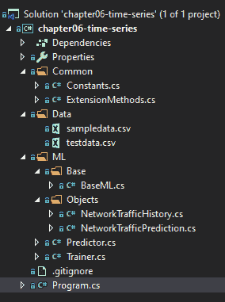
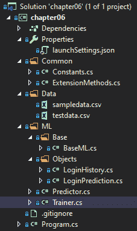
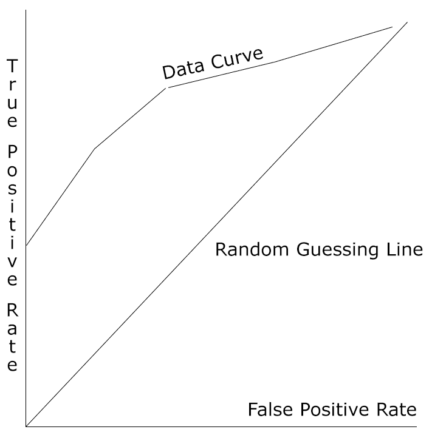

# 第六章：异常检测模型

在我们完成了 k-means 聚类模型之后，现在是时候深入异常检测模型了。异常检测是 ML.NET 中较新的功能之一，特别是时间序列转换。在本章中，我们将深入探讨异常检测及其最适合利用异常检测的各种应用。此外，我们将构建两个新的示例应用程序：一个用于确定登录尝试是否异常的异常检测应用程序，展示了随机 PCA 训练器，另一个演示了在网络安全异常检测应用程序中的时间序列。最后，我们将探讨如何使用 ML.NET 公开的属性来评估异常检测模型。

在本章中，我们将涵盖以下主题：

+   分析异常检测

+   创建时间序列应用程序

+   创建异常检测应用程序

+   评估异常检测模型

# 分析异常检测

如第一章“开始使用机器学习和 ML.NET”中所述，根据定义，异常检测是一种无监督学习算法。这意味着该算法将在数据上训练并寻找不符合正常数据的数据。在本节中，我们将深入了解异常检测的应用案例以及 ML.NET 中可用的各种异常检测训练器。

# 异常检测的应用案例

如您可能已经意识到的，异常检测在数据可用但未知数据中是否存在异常的众多应用中都有。无需进行手动抽查，异常检测算法会在这些数据上训练并确定是否存在任何异常。ML.NET 提供了各种异常检测值，以便在您的应用程序中程序化地查看。我们将在本章后面回顾这些值，以确保任何检测都不是假阳性。

一些最适合用于异常检测的潜在应用包括以下内容：

+   销售预测

+   股市

+   欺诈检测

+   预测设备因各种因素而发生的故障

+   针对远程连接和网络流量登录历史记录的网络安全应用程序，例如我们将在后面深入研究的示例应用程序

# 深入随机 PCA 训练器

随机 PCA 训练器是 ML.NET 在编写时发现的唯一传统异常检测训练器。随机 PCA 训练器需要归一化值；然而，缓存不是必需的，也不需要额外的 NuGet 包来使用训练器。

与其他算法类似，输入是一个已知的`Float`类型向量大小。输出包含两个属性：`Score`和`PredictedLabel`。`Score`的值是`Float`类型，非负且无界。相比之下，`PredictedLabel`属性根据设定的阈值指示一个有效的异常；true 值表示异常，而 false 值表示不是异常。ML.NET 的默认阈值为 0.5，可以通过`ChangeModelThreshold`方法进行调整。实际上，高于阈值的值返回 true，低于阈值的返回 false。

在幕后，该算法使用特征向量来估计包含正常类的子空间，然后计算实际特征向量在该子空间中的投影特征向量之间的归一化差异。简单来说，如果计算出的误差不接近 0，算法会找到边缘情况。如果它发现误差接近 0，则被认为是正常数据点（即非异常）。

我们将在本章后面的第二个示例应用中通过检测登录异常来演示这个训练器。

如果你想要深入了解随机 PCA，以下论文是一个很好的资源：[`web.stanford.edu/group/mmds/slides2010/Martinsson.pdf`](https://web.stanford.edu/group/mmds/slides2010/Martinsson.pdf)。

# 深入了解时间序列转换

与本书中和其他 ML.NET 本身找到的算法不同，时间序列支持是通过一系列应用于你的训练和测试数据的转换来添加的。如前所述，时间序列也是 ML.NET 的新增功能之一，添加于 1.2.0 版本。

在 ML.NET 中，时间序列转换被分组到`TimeSeriesCatalog`类中。这个类内部有六个不同的方法：

+   `DetectAnomalyBySrCnn`：使用 SRCNN 算法检测异常

+   `DetectChangePointBySsa`：使用**奇异谱分析**（**SSA**）算法在变化点检测异常

+   `DetectIidChangePoint`：使用**独立同分布**（**i.i.d**）算法检测变化以预测变化点

+   `DetectIidSpike`：使用 i.i.d 算法检测变化，但预测尖峰而不是变化点

+   `DetectSpikeBySsa`：使用 SSA 算法检测尖峰

+   `ForecastBySsa`：使用 SSA 算法进行基于单一变量（通常称为单变量）的时间序列预测

根据应用的不同，你可能想要寻找数据变化的尖峰或变化点（上升或下降螺旋）。在本章关于时间序列的示例中，我们将利用`DetectSpikeBySsa`寻找网络传输随时间变化的尖峰。

关于使用 SSA 进行预测的更多信息，这里有一个很好的资源：[`arxiv.org/pdf/1206.6910.pdf`](http://arxiv.org/pdf/1206.6910.pdf)。

# 创建时间序列应用

如前所述，我们将创建的应用是一个网络流量异常检测器。给定一组与网络流量量（以字节为单位）相关的属性，该应用将使用这些数据来查找给定检查点的流量异常。与其他应用一样，这并不是为了推动下一个机器学习网络流量异常检测产品的开发；然而，它将向您展示如何在 ML.NET 中使用时间序列，特别是如何使用 SSA 检测峰值。

如前几章所述，完成的项目代码、样本数据集和项目文件可以在此下载：[`github.com/PacktPublishing/Hands-On-Machine-Learning-With-ML.NET/tree/master/chapter06-time-series`](https://github.com/PacktPublishing/Hands-On-Machine-Learning-With-ML.NET/tree/master/chapter06-time-series)。

# 探索项目架构

在前几章中创建的项目架构和代码的基础上，大部分的更改集中在模型的训练上，因为时间序列需要从我们在前几章中回顾的内容进行相当大的范式转变。此外，当使用时间序列转换时，如果您是从零开始创建项目，您需要添加 `Microsoft.ML.TimeSeries` NuGet 包。GitHub 仓库中提供的示例应用已经包含了这个包。

在下面的屏幕截图中，您将找到项目的 Visual Studio 解决方案资源管理器视图。解决方案中的新添加项是 `NetworkTrafficHistory` 和 `NetworkTrafficPrediction` 文件，我们将在本节后面进行回顾：



`sampledata.csv` 文件包含八行网络流量数据。请随意调整数据以适应您的观察或调整训练模型。以下是数据的片段：

```py
laptop,2019-11-14T11:13:23,1500
laptop,2019-11-15T11:13:23,1000
laptop,2019-11-16T11:13:23,1100
laptop,2019-11-17T11:13:23,1600
laptop,2019-11-18T11:13:23,1000
laptop,2019-11-19T11:13:23,1100
laptop,2019-11-20T11:13:23,1000
laptop,2019-11-21T11:13:23,1000
```

每一行都包含新创建的 `NetworkTrafficHistory` 类中属性的值，我们将在本章后面进行回顾。

此外，我们还添加了 `testdata.csv` 文件，其中包含额外的数据点，用于测试新训练的模型并评估。以下是 `testdata.csv` 内的数据片段：

```py
laptop,2019-11-22T11:13:23,1000
laptop,2019-11-23T11:13:23,1100
laptop,2019-11-24T11:13:23,1200
laptop,2019-11-25T11:13:23,1300
laptop,2019-11-26T11:13:23,1400
laptop,2019-11-27T11:13:23,3000
laptop,2019-11-28T11:13:23,1500
laptop,2019-11-29T11:13:23,1600
```

# 深入代码

如前所述，对于这个应用，我们是在第五章，“聚类模型”的基础上进行工作的。对于这次深入研究，我们将专注于为这个应用更改的代码。

被更改或添加的类如下：

+   `NetworkTrafficHistory`

+   `NetworkTrafficPrediction`

+   `Predictor`

+   `Trainer`

+   `Program`

# NetworkTrafficHistory 类

`NetworkTrafficHistory` 类是包含用于预测和训练我们的模型的数据的容器类。如前几章所述，`LoadColumn` 装饰器中的数字映射到 CSV 文件中的索引。如前所述，ML.NET 中的异常检测需要使用单个浮点值；在这种情况下，是 `BytesTransferred` 属性：

```py
using System;

using Microsoft.ML.Data;

namespace chapter06.ML.Objects
{
    public class NetworkTrafficHistory
    {
        [LoadColumn(0)]
        public string HostMachine { get; set; }

        [LoadColumn(1)]
        public DateTime Timestamp { get; set; }

        [LoadColumn(2)] 
        public float BytesTransferred { get; set; }
    }
}
```

# `NetworkTrafficPrediction` 类

`NetworkTrafficPrediction` 类包含映射到我们的预测输出的属性。`VectorType(3)` 函数包含警报、得分和 p 值。我们将在本节稍后回顾这些值：

```py
using Microsoft.ML.Data;

namespace chapter06.ML.Objects
{
    public class NetworkTrafficPrediction
    {
        [VectorType(3)]
        public double[] Prediction { get; set; }
    }
}
```

# `Predictor` 类

为了处理网络流量预测场景，需要对此类进行一些修改：

1.  首先，我们使用 `NetworkTrafficHistory` 和 `NetworkHistoryPrediction` 类型创建我们的预测引擎：

```py
var predictionEngine = MlContext.Model.CreatePredictionEngine<NetworkTrafficHistory, NetworkTrafficPrediction>(mlModel);
```

1.  接下来，我们将输入文件读取到 `IDataView` 变量中（注意使用逗号作为 `separatorChar` 的重写）：

```py
var inputData = MlContext.Data.LoadFromTextFile<NetworkTrafficHistory>(inputDataFile, separatorChar: ',');
```

1.  接下来，我们获取基于新创建的 `IDataView` 变量的可枚举对象：

```py
var rows = MlContext.Data.CreateEnumerable<NetworkTrafficHistory>(inputData, false);
```

1.  1.  最后，我们需要运行预测并输出模型运行的输出结果：

    ```py
    Console.WriteLine($"Based on input file ({inputDataFile}):");

    foreach (var row in rows)
    {
        var prediction = predictionEngine.Predict(row);

        Console.Write($"HOST: {row.HostMachine} TIMESTAMP: {row.Timestamp} TRANSFER: {row.BytesTransferred} ");
        Console.Write($"ALERT: {prediction.Prediction[0]} SCORE: {prediction.Prediction[1]:f2} P-VALUE: {prediction.Prediction[2]:F2}{Environment.NewLine}");
    }
    ```

    由于 `Transform` 只返回三个元素的向量，原始行数据被输出以提供上下文。

    # `Trainer` 类

    在 `Trainer` 类内部，需要做出一些修改以支持时间序列转换。在许多方面，需要简化。执行了评估和测试数据加载的移除：

    1.  首先是向转换发送的四个变量的添加：

    ```py
    private const int PvalueHistoryLength = 3;
    private const int SeasonalityWindowSize = 3;
    private const int TrainingWindowSize = 7;
    private const int Confidence = 98;
    ```

    由于在编写 ML.NET 库时的一个约束，训练窗口大小必须大于 p 值历史长度的两倍。

    1.  然后，我们从 CSV 训练文件构建 `DataView` 对象：

    ```py
    var trainingDataView = GetDataView(trainingFileName);
    ```

    1.  然后，我们可以创建 SSA 脉冲检测：

    ```py
    var trainingPipeLine = MlContext.Transforms.DetectSpikeBySsa(
        nameof(NetworkTrafficPrediction.Prediction),
        nameof(NetworkTrafficHistory.BytesTransferred),
        confidence: Confidence,
        pvalueHistoryLength: PvalueHistoryLength,
        trainingWindowSize: TrainingWindowSize,
        seasonalityWindowSize: SeasonalityWindowSize);
    ```

    1.  现在，我们在训练数据上拟合模型并保存模型：

    ```py
    ITransformer trainedModel = trainingPipeLine.Fit(trainingDataView);

    MlContext.Model.Save(trainedModel, trainingDataView.Schema, ModelPath);

    Console.WriteLine("Model trained");
    ```

    # `Program` 类

    由于训练只需要训练数据，因此需要对 `Program` 类进行一些修改：

    1.  帮助文本需要更新以反映新的用法：

    ```py
    if (args.Length < 2)
    {
        Console.WriteLine($"Invalid arguments passed in, exiting.{Environment.NewLine}{Environment.NewLine}Usage:{Environment.NewLine}" +
                          $"predict <path to input file>{Environment.NewLine}" +
                          $"or {Environment.NewLine}" +
                          $"train <path to training data file>{Environment.NewLine}");

        return;
    }
    ```

    1.  此外，需要更新 switch-case 语句以反映预测传递的单个参数：

    ```py
    switch (args[0])
    {
        case "predict":
            new Predictor().Predict(args[1]);
            break;
        case "train":
            new Trainer().Train(args[1]);
            break;
        default:
            Console.WriteLine($"{args[0]} is an invalid option");
            break;
    }
    ```

    # 运行应用程序

    要运行应用程序，我们使用的流程几乎与 第三章 中“回归模型”的示例应用程序相同：

    1.  准备好数据后，我们必须通过传递新创建的 `sampledata.csv` 文件来训练模型：

    ```py
    PS chapter06-time-series\bin\Debug\netcoreapp3.0> .\chapter06-time-series.exe train ..\..\..\Data\sampledata.csv
    Model trained
    ```

    1.  要使用此文件运行模型，只需将之前提到的 `testdata.csv` 文件传递到新构建的应用程序中，预测输出将显示以下内容：

    ```py
    PS bin\debug\netcoreapp3.0> .\chapter06-time-series.exe predict ..\..\..\Data\testdata.csv
    Based on input file (..\..\..\Data\testdata.csv):
    HOST: laptop TIMESTAMP: 11/22/2019 11:13:23 AM TRANSFER: 1000 ALERT: 0 SCORE: 46.07 P-VALUE: 0.50
    HOST: laptop TIMESTAMP: 11/23/2019 11:13:23 AM TRANSFER: 1100 ALERT: 0 SCORE: 131.36 P-VALUE: 0.00
    HOST: laptop TIMESTAMP: 11/24/2019 11:13:23 AM TRANSFER: 1200 ALERT: 0 SCORE: 180.44 P-VALUE: 0.06
    HOST: laptop TIMESTAMP: 11/25/2019 11:13:23 AM TRANSFER: 1300 ALERT: 0 SCORE: 195.42 P-VALUE: 0.17
    HOST: laptop TIMESTAMP: 11/26/2019 11:13:23 AM TRANSFER: 1400 ALERT: 0 SCORE: 201.15 P-VALUE: 0.22
    HOST: laptop TIMESTAMP: 11/27/2019 11:13:23 AM TRANSFER: 3000 ALERT: 1 SCORE: 1365.42 P-VALUE: 0.00
    HOST: laptop TIMESTAMP: 11/28/2019 11:13:23 AM TRANSFER: 1500 ALERT: 0 SCORE: -324.58 P-VALUE: 0.11
    HOST: laptop TIMESTAMP: 11/29/2019 11:13:23 AM TRANSFER: 1600 ALERT: 0 SCORE: -312.93 P-VALUE: 0.25
    ```

    输出包括三个数据点：`HOST`、`TIMESTAMP`和`TRANSFER`。新增的是`ALERT`、`SCORE`和`P-VALUE`。`ALERT`的值不为零表示存在异常。`SCORE`是异常得分的数值表示；值越高表示峰值越大。`P-VALUE`，介于 0 和 1 之间的值，是当前点与平均点之间的距离。值接近或等于 0 是另一个表示峰值的指示。在评估模型和有效性时，结合这三个数据点可以确保真正的峰值，从而有效减少潜在的误报数量。

    您可以随意修改值，并探索基于模型训练数据集的预测如何变化。从这个点开始，一些实验区域可能包括以下内容：

    +   添加更具体的数据点，如 IP 地址

    +   在训练和测试数据中添加多样化和更多数据点

    # 创建一个异常检测应用

    如前所述，我们将创建的应用是一个登录异常检测器。给定一组与登录相关的属性，该应用将使用这些数据来查找异常，例如不寻常的登录时间。与其他应用一样，这并不是为了推动下一个机器学习登录异常检测产品的开发；然而，它将向您展示如何在 ML.NET 中使用异常检测。

    与前几章一样，完成的项目代码、示例数据集和项目文件可以在此处下载：[`github.com/PacktPublishing/Hands-On-Machine-Learning-With-ML.NET/tree/master/chapter06`](https://github.com/PacktPublishing/Hands-On-Machine-Learning-With-ML.NET/tree/master/chapter06)。

    # 探索项目架构

    在前几章中创建的项目架构和代码的基础上，本例中的大部分更改都在模型的训练上。

    在下面的屏幕截图中，您将找到项目的 Visual Studio 解决方案资源管理器视图。解决方案的新增内容包括`LoginHistory`和`LoginPrediction`文件，我们将在本节后面进行回顾：

    

    `sampledata.csv`文件包含 10 行登录数据。您可以随意调整数据以适应您的观察或调整训练好的模型。以下是数据的一个片段：

    ```py
    0,1,0,1,1,0
    0,1,0,1,1,0
    0,0,1,0,1,0
    0,0,1,0,1,0
    0,0,1,1,0,1
    1,1,0,1,1,0
    1,1,0,1,1,0
    1,0,1,0,1,0
    1,0,1,0,1,1
    1,0,1,1,0,0
    ```

    每一行都包含新创建的`LoginHistory`类中属性的值，我们将在本章后面进行回顾。

    此外，我们还添加了`testdata.csv`文件，其中包含额外的数据点，用于测试新训练的模型并评估。以下是`testdata.csv`中的数据片段：

    ```py
    0,1,0,1,1,0
    0,1,0,1,1,0
    0,0,1,0,1,0
    0,0,1,0,1,0
    0,0,1,1,0,1
    1,1,0,1,1,0
    1,1,0,1,1,0
    1,0,1,0,1,0
    1,0,1,0,1,1
    1,0,1,1,0,0
    ```

    # 深入代码分析

    对于这个应用，正如前文所述，我们是在第五章“聚类模型”的基础上进行工作的。对于这次深入探讨，我们将专注于为这个应用更改的代码。

    已更改或添加的类如下：

    +   `Constants`

    +   `LoginHistory`

    +   `LoginPrediction`

    +   `预测器`

    +   `训练器`

    # `Constants` 类

    `Constants` 类已更改以将模型保存到 `chapter6.mdl`。以下代码块反映了这些更改：

    ```py
    namespace chapter06.Common
    {
        public class Constants
        {
            public const string MODEL_FILENAME = "chapter6.mdl";

            public const string SAMPLE_DATA = "sampledata.csv";

            public const string TEST_DATA = "testdata.csv";
        }
    }
    ```

    # `LoginHistory` 类

    `LoginHistory` 类是包含用于预测和训练我们的模型的数据的容器类。如前几章所述，`LoadColumn` 装饰器中的数字映射到 CSV 文件中的索引。每个属性映射到一个将发送到模型进行异常检测的值：

    ```py
    using Microsoft.ML.Data;

    namespace chapter06.ML.Objects
    {
        public class LoginHistory
        {
            [LoadColumn(0)]
            public float UserID { get; set; }

            [LoadColumn(1)]
            public float CorporateNetwork { get; set; }

            [LoadColumn(2)] 
            public float HomeNetwork { get; set; }

            [LoadColumn(3)] 
            public float WithinWorkHours { get; set; }

            [LoadColumn(4)] 
            public float WorkDay { get; set; }

            [LoadColumn(5)] 
            public float Label { get; set; }
        }
    }
    ```

    # `LoginPrediction` 类

    `LoginPrediction` 类包含映射到我们的预测输出的属性。以下 `PredictedLabel` 属性将保存我们的预测，而 `Label` 和 `Score` 属性用于评估：

    ```py
    namespace chapter06.ML.Objects
    {
        public class LoginPrediction
        {
            public float Label;

            public float Score;

            public bool PredictedLabel;
        }
    }
    ```

    # `预测器` 类

    为了处理 `Login` 异常检测场景，需要对此类进行一些更改：

    1.  首先，我们使用 `LoginHistory` 和 `LoginPrediction` 类型创建我们的预测引擎：

    ```py
    var predictionEngine = MlContext.Model.CreatePredictionEngine<LoginHistory, LoginPrediction>(mlModel);     
    ```

    1.  然后，我们将输入文件读取到一个字符串变量中：

    ```py
    var json = File.ReadAllText(inputDataFile);
    ```

    1.  最后，我们运行预测并输出模型运行的输出结果：

    ```py
    var prediction = predictionEngine.Predict(JsonConvert.DeserializeObject<LoginHistory>(json));

    Console.WriteLine(
                        $"Based on input json:{System.Environment.NewLine}" +
                        $"{json}{System.Environment.NewLine}" + 
                        $"The login history is {(prediction.PredictedLabel ? "abnormal" : "normal")}, with a {prediction.Score:F2} outlier score");
    ```

    # `训练器` 类

    在 `Trainer` 类内部，需要做出一些修改以支持使用随机 PCA 训练器的异常检测分类：

    1.  第一个更改是添加了一个 `GetDataView` 辅助方法，它从 `LoginHistory` 类中先前定义的列构建 `IDataView` 数据视图：

    ```py
    private (IDataView DataView, IEstimator<ITransformer> Transformer) GetDataView(string fileName, bool training = true)
    {
        var trainingDataView = MlContext.Data.LoadFromTextFile<LoginHistory>(fileName, ',');

        if (!training)
        {
            return (trainingDataView, null);
        }

        IEstimator<ITransformer> dataProcessPipeline = MlContext.Transforms.Concatenate(
            FEATURES, 
            typeof(LoginHistory).ToPropertyList<LoginHistory>(nameof(LoginHistory.Label)));

        return (trainingDataView, dataProcessPipeline);
    }
    ```

    1.  然后，我们构建训练数据视图和 `RandomizedPcaTrainer.Options` 对象：

    ```py
    var trainingDataView = GetDataView(trainingFileName);

    var options = new RandomizedPcaTrainer.Options
    {
        FeatureColumnName = FEATURES,
        ExampleWeightColumnName = null,
        Rank = 5,
        Oversampling = 20,
        EnsureZeroMean = true,
        Seed = 1
    };

    ```

    注意，`Rank` 属性必须等于或小于特征数：

    1.  然后，我们可以创建随机 PCA 训练器，将其附加到训练数据视图中，拟合我们的模型，然后保存它：

    ```py
    IEstimator<ITransformer> trainer = MlContext.AnomalyDetection.Trainers.RandomizedPca(options: options);

    EstimatorChain<ITransformer> trainingPipeline = trainingDataView.Transformer.Append(trainer);

    TransformerChain<ITransformer> trainedModel = trainingPipeline.Fit(trainingDataView.DataView);

    MlContext.Model.Save(trainedModel, trainingDataView.DataView.Schema, ModelPath);
    ```

    1.  现在我们使用测试数据集评估我们刚刚训练的模型：

    ```py
    var testingDataView = GetDataView(testingFileName, true);

    var testSetTransform = trainedModel.Transform(testingDataView.DataView);

    var modelMetrics = MlContext.AnomalyDetection.Evaluate(testSetTransform);
    ```

    1.  最后，我们输出所有分类指标。这些将在下一节中详细介绍：

    ```py
    Console.WriteLine($"Area Under Curve: {modelMetrics.AreaUnderRocCurve:P2}{Environment.NewLine}" +
                      $"Detection at FP Count: {modelMetrics.DetectionRateAtFalsePositiveCount}");
    ```

    # 运行应用程序

    要运行应用程序，我们使用的流程几乎与 第三章 中 *回归模型* 的示例应用程序相同，只是在训练时添加了传入测试数据集：

    1.  提取数据后，我们必须通过传入新创建的 `sampledata.csv` 和 `testdata.csv` 文件来训练模型：

    ```py
    PS chapter06\bin\Debug\netcoreapp3.0> .\chapter06.exe train ..\..\..\Data\sampledata.csv ..\..\..\Data\testdata.csv 
    Area Under Curve: 78.12%
    Detection at FP Count: 1
    ```

    1.  要使用此文件运行模型，只需传入一个构造的 JSON 文件（在这种情况下为 `input.json`）和预测输出将显示：

    ```py
    PS chapter06\bin\Debug\netcoreapp3.0> .\chapter06.exe predict input.json 
    Based on input json:
    {
     "UserID": 0, "CorporateNetwork": 1, "HomeNetwork": 0, "WithinWorkHours": 1, "WorkDay": 1
    }
    The login history is normal, with a 0% score
    ```

    注意模型训练输出的扩展，包括两个指标数据点。我们将在本章末尾解释这些数据点的含义：

    随意修改值并探索基于模型训练的数据集，预测如何变化。从这个点开始的一些实验领域可能包括以下内容：

    +   在生产场景中添加一些额外的属性以提高预测精度，例如登录发生的小时：

    +   在训练和测试数据中增加多样性

    # 评估随机 PCA 模型

    如前几章所述，评估模型是整个模型构建过程中的关键部分。一个训练不良的模型只会提供不准确的预测。幸运的是，ML.NET 提供了许多流行的属性，可以根据训练时的测试集计算模型精度，以给你一个关于你的模型在生产环境中表现如何的印象。

    在 ML.NET 中，正如示例应用中提到的，有两个属性构成了`AnomalyDetectionMetrics`类对象。让我们深入了解`AnomalyDetectionMetrics`对象公开的属性：

    +   ROC 曲线下的面积

    +   假阳性计数中的检测率

    在接下来的几节中，我们将分解这些值的计算方法和理想值。

    # ROC 曲线下的面积

    如第三章中提到的 ROC 曲线下的面积，顾名思义，是**接收者操作特征**（**ROC**）曲线下的面积。可能有人会问这样一个问题：这与评估异常检测模型有什么关系？

    这个计算出的面积等于算法（在我们的案例中是随机 PCA）随机选择一个正实例比一个负实例得分更高的概率，这两个实例都是随机选择的，以更好地评估数据。返回的数字越接近 100%是理想值，而如果它接近 0%，你很可能会有显著的假阳性。你可能还记得我们之前的应用示例得到了 78%。这意味着有 22%的假阳性概率；以下概述了一些改进模型的建议，应该会减少这个数字。

    下图直观地反映了随机猜测线和任意数据曲线。随机猜测线之间的数据曲线下的面积是 ROC 曲线数据度量下的面积：

    

    # 假阳性计数中的检测率

    在假阳性计数属性中的检测率是*K*个假阳性的检测率。在异常检测场景中，一个假阳性是将数据点视为异常，而实际上它并不是。这个比率是这样计算的：

    *K 个假阳性的检测率 = X / Y*

    在这里，*X*是根据异常检测示例中先前描述的分数计算出的顶级测试样本（按降序排序）。这些被认为是顶级真实正例（即更有可能是实际异常）。

    *Y* 被计算为测试数据中异常的总数，无论分数值如何（不是过滤看起来可疑或不可疑的点）。从理论上讲，如果训练数据中的假阳性数量很高，这个数字可能会非常高。随着你使用随机 PCA 构建生产模型，确保你的数据尽可能接近生产环境，以避免过度拟合或欠拟合到异常。

    # 摘要

    在本章的整个过程中，我们讨论了 ML.NET 通过随机 PCA 算法提供的异常检测支持。我们还创建并训练了我们的第一个异常检测应用程序，使用随机 PCA 算法来预测异常登录。除此之外，我们还创建了一个时间序列应用程序，观察网络流量并寻找传输数据量的峰值。最后，我们还探讨了如何评估异常检测模型以及 ML.NET 公开的各种属性，以实现异常检测模型的适当评估。

    在下一章中，我们将深入探讨 ML.NET 中的矩阵分解，以创建一个音乐偏好预测器。
