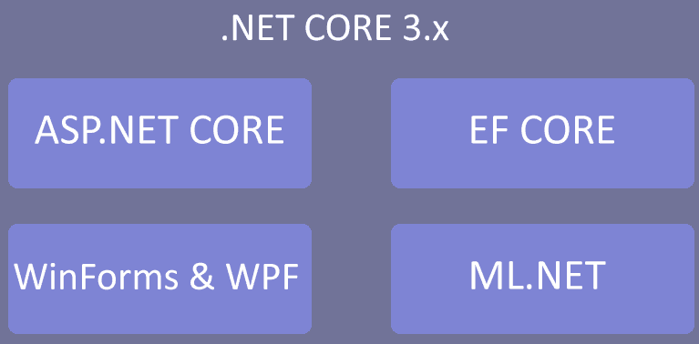
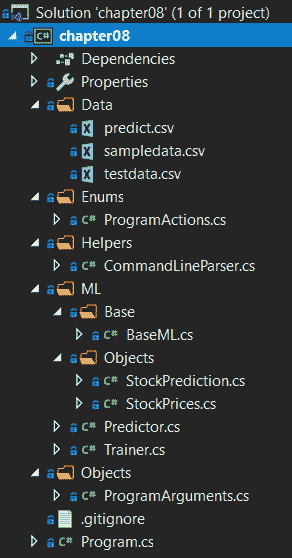

# 在 .NET Core 和预测中使用 ML.NET

现在我们已经深入了解了 ML.NET 提供的各种算法组，接下来我们将开始探索在接下来的几章中将 ML.NET 集成到生产应用程序中。在本章中，我们将深入探讨一个基于前几章定义的结构构建的 .NET Core 控制台应用程序，重点关注加固和错误处理。我们将构建的应用程序使用预测来根据一系列趋势预测股价。到本章结束时，您应该能够熟练地设计和编码一个具有 ML.NET 的生产级 .NET Core 应用程序。

在本章中，我们将涵盖以下主题：

+   分析 .NET Core 应用程序架构

+   创建预测应用程序

+   探索额外的生产应用程序增强功能

# 分析 .NET Core 应用程序架构

如 第一章 中所述，*开始使用机器学习和 ML.NET*，.NET Core 3.x 由于 3.0 版本中的优化，是使用 ML.NET 的首选平台。此外，.NET Core 提供了一个统一的编码框架，以针对 Linux、macOS 和 Windows，如下面的图所示：



# .NET Core 架构

自 2016 年成立以来，.NET Core 的基本目标是为用户提供快速更新和与（之前仅限 Windows 的）Microsoft .NET Framework 的功能一致性。随着时间的推移和版本的更新，通过简单地添加缺失的 API、使用额外的 NuGet 包，差距已经缩小。其中一个例子是 `Microsoft.Windows.Compatibility`，它提供了 20,000 个在 Core 框架中找不到的 API，包括注册表访问、绘图和 Windows 权限模型访问。这种方法保持了框架的轻量级和跨平台性，但确实引入了一些设计模式来帮助您开发特定平台的应用程序。

以一个使用 ML.NET 提供入侵检测系统（**IDS**）的 Windows 桌面应用程序为例。一个简单的方法是将所有代码都写在一个 .NET Core **Windows Presentation Foundation**（**WPF**）应用程序中。然而，这将使您仅限于 Windows 而无法进行重大重构。更好的方法是创建一个包含所有平台无关代码的 .NET Core 类库，然后创建抽象类或接口，在您的平台应用程序中实现特定平台的代码。

# .NET Core 目标

如前所述，.NET Core 提供了一个单一框架来针对 Windows、macOS 和 Linux。然而，这不仅仅适用于我们在这本书中使用的控制台应用程序。.NET Core 3 最近的工作提供了将现有的.NET Framework WPF 和 Windows Forms 应用程序迁移到.NET Core 3 的能力，从而使得依赖于可能已经存在多年的框架的应用程序能够使用最新的.NET Core 进步。此外，之前使用 ASP.NET 的 Web 应用程序也可以迁移到 ASP.NET Core（目前 ASP.NET WebForms 没有迁移路径）。

.NET Core 的目标之一是能够使用`--self-contained`标志进行编译。这个标志编译你的应用程序或库，然后将所有必要的.NET Core 框架文件捆绑在一起。这允许你在安装时无需.NET 先决条件即可部署你的应用程序。这确实会使你的整体构建输出更大，但在客户场景中，大约 100MB 的增加远远超过了先决条件的部署障碍。

# .NET Core 的未来

你可能会想知道.NET Framework、Mono 和.NET Core 的未来是什么。幸运的是，在撰写本文时，微软已经确认所有现有框架都将迁移到一个单一的框架，这个框架简单地被称为.NET 5。在此之前，在决定使用哪个框架时，某些权衡是不可避免的。因此，将每个框架的优点结合起来并首次实现统一，将完全消除这些权衡。例如，Mono 的**即时编译**（**AOT**）或 Xamarin 的跨平台 UI 支持，这些都可以根据已发布的信息在现有的基于.NET Core 3.x 的应用程序中使用。

预计.NET 5 的预览版将在 2020 年上半年发布，正式版将在 2020 年 11 月发布。

# 创建股价估算应用程序

如前所述，我们将要创建的应用程序是一个股价估算器。给定一系列跨越几天、几周或几年的股价，预测算法将内部识别趋势模式。与之前的章节不同，该应用程序将被设计成可以插入到生产流程中。

与前几章一样，完成的项目代码、示例数据集和项目文件可以从以下链接下载：[`github.com/PacktPublishing/Hands-On-Machine-Learning-With-ML.NET/tree/master/chapter08`](https://github.com/PacktPublishing/Hands-On-Machine-Learning-With-ML.NET/tree/master/chapter08)。

# 探索项目架构

在前几章中创建的项目架构和代码的基础上，本章将要探索的架构将进一步增强架构，使其更加结构化，从而更适合最终用户使用。

如同前几章中的一些章节，需要额外的 NuGet 包——`Microsoft.ML.TimeSeries`——来利用 ML.NET 中的预测功能。GitHub 上包含的示例和本章的深入探讨中都使用了 1.3.1 版本。

在下面的屏幕截图中，您将找到项目的 Visual Studio 解决方案资源管理器视图。为了便于我们针对的目标生产用例，解决方案中添加了几个新功能。我们将在本章后面详细审查解决方案屏幕截图中所显示的每个新文件：



`sampledata.csv`文件包含 24 行股票价格。请随意调整数据以适应您的观察或调整训练模型。以下是数据的片段：

```py
33
34
301
33
44
299
40
50
400
60
76
500
```

这些每一行都包含我们将填充到`StockPrices`类对象中的股票价格值，我们将在本章后面进行审查。

此外，我们还添加了包含用于测试新训练模型并评估它的额外数据点的`testdata.csv`文件。以下是`testdata.csv`内部数据的片段：

```py
10
25
444
9
11
333
4
3
500
```

# 深入代码

如前节所述，我们是在前几章完成的工作基础上构建的。然而，对于本章，我们将更改每个文件以支持生产用例。对于从前几章更改的每个文件，我们将审查所做的更改及其背后的原因。

以下是被更改或添加的类和枚举：

+   `ProgramActions`

+   `CommandLineParser`

+   `BaseML`

+   `StockPrediction`

+   `StockPrices`

+   `Predictor`

+   `Trainer`

+   `ProgramArguments`

+   `Program`

# 程序动作枚举

以下`ProgramActions`枚举已被添加到解决方案中，以方便使用强类型和结构化的路径来处理程序执行的各种操作：

```py
namespace chapter08.Enums
{
    public enum ProgramActions
    {
        TRAINING,
        PREDICT
    }
}
```

在本应用的情况下，我们只有两个动作——“训练”和“预测”。然而，如前几章所示，您可能还有一个特征提取步骤或可能提供一个评估步骤。这种设计模式既提供了灵活性，又消除了本章开头提到的“魔法字符串”问题。

# `CommandLineParser`类

`CommandLineParser`类提供了一个程序无关的解析器，用于处理命令行参数。在前几章中，我们手动解析索引并将这些值映射到参数上。另一方面，这种方法创建了一个灵活、易于维护且结构化的响应对象，它将参数直接映射到属性。现在让我们深入了解这个类：

1.  首先，我们定义函数原型：

```py
public static T ParseArguments<T>(string[] args) 
```

使用泛型（即`T`）创建了一种灵活的方法，使此方法不受限于仅此应用。

1.  接下来，我们测试`null`参数：

```py
if (args == null)
{
    throw new ArgumentNullException(nameof(args));
}
```

1.  然后，我们测试空参数，并告知用户将使用默认值而不是失败，如前几章所述：

```py
if (args.Length == 0)
{
    Console.WriteLine("No arguments passed in - using defaults");

    return Activator.CreateInstance<T>();
}
```

1.  在执行空和空检查之后，我们执行多个检查，因为所有参数都是成对的：

```py
if (args.Length % 2 != 0)
{
    throw new ArgumentException($"Arguments must be in pairs, there were {args.Length} passed in");
}
```

1.  继续进行，然后我们使用 `Activator.CreateInstance` 方法创建 `T` 类型的对象：

```py
var argumentObject = Activator.CreateInstance<T>();
```

确保在创建类对象时，构造函数没有参数，因为这个调用如果没有无参构造函数将会抛出异常。如果你创建了一个带有构造函数参数的对象而没有无参构造函数，请使用 `Activator.CreateInstance` 的重载版本并传递所需的参数。

1.  接下来，我们使用反射来获取 `T` 类型的所有属性：

```py
var properties = argumentObject.GetType().GetProperties();
```

1.  现在我们已经创建了通用对象及其属性，然后我们遍历每个参数键/值对，并在对象中设置属性：

```py
for (var x = 0; x < args.Length; x += 2)
{
    var property = properties.FirstOrDefault(a => a.Name.Equals(args[x], StringComparison.CurrentCultureIgnoreCase));

    if (property == null)
    {
        Console.WriteLine($"{args[x]} is an invalid argument");

        continue;
    }

    if (property.PropertyType.IsEnum)
    {
        property.SetValue(argumentObject, Enum.Parse(property.PropertyType, args[x + 1], true));
    }
    else
    {
        property.SetValue(argumentObject, args[x + 1]);
    }
}
```

注意 `IsEnum` 函数的特殊情况，用于处理之前提到的 `ProgramActions` 枚举。由于字符串值不能自动转换为枚举，我们需要使用 `Enum.Parse` 方法专门处理字符串到枚举的转换。按照目前的写法，如果添加更多的枚举到 `T` 类型，枚举处理器是通用的。

# `BaseML` 类

为此应用创建的 `BaseML` 类已经精简，只需实例化 `MLContext` 对象：

```py
using Microsoft.ML;

namespace chapter08.ML.Base
{
    public class BaseML
    {
        protected readonly MLContext MlContext;

        protected BaseML()
        {
            MlContext = new MLContext(2020);
        }
    }
}
```

# `StockPrediction` 类

`StockPrediction` 类是我们预测值的容器，如这里定义的：

```py
namespace chapter08.ML.Objects
{
    public class StockPrediction
    {
        public float[] StockForecast { get; set; }

        public float[] LowerBound { get; set; }

        public float[] UpperBound { get; set; }
    }
}
```

`StockForecast` 属性将保存基于模型训练和提交给预测引擎的预测股票值。`LowerBound` 和 `UpperBound` 值分别保存最低和最高估计值。

# `StockPrices` 类

`StockPrices` 类包含我们的单个浮点值，该值持有股票价格。为了在填充值时保持代码的整洁，添加了一个接受股票价格值的构造函数：

```py
using Microsoft.ML.Data;

namespace chapter08.ML.Objects
{
    public class StockPrices
    {
        [LoadColumn(0)]
        public float StockPrice;

        public StockPrices(float stockPrice)
        {
            StockPrice = stockPrice;
        }
    }
}
```

# `Predictor` 类

与前几章相比，`Predictor` 类已经精简并适应了预测功能：

1.  首先，调整 `Predict` 方法以接受新定义的 `ProgramArguments` 类对象：

```py
public void Predict(ProgramArguments arguments)   
```

1.  接下来，我们更新模型 `file.Exists` 检查以利用 `arguments` 对象：

```py
if (!File.Exists(arguments.ModelFileName))
{
    Console.WriteLine($"Failed to find model at {arguments.ModelFileName}");

    return;
}
```

1.  类似地，我们还更新了预测文件名引用，以利用 `arguments` 对象：

```py
if (!File.Exists(arguments.PredictionFileName))
{
    Console.WriteLine($"Failed to find input data at {arguments.PredictionFileName}");

    return;
}
```

1.  接下来，我们还修改了模型打开调用以利用 `arguments` 对象：

```py
using (var stream = new FileStream(Path.Combine(AppContext.BaseDirectory, arguments.ModelFileName), FileMode.Open, FileAccess.Read, FileShare.Read))
{
    mlModel = MlContext.Model.Load(stream, out _);
}
```

1.  然后，我们使用 `StockPrices` 和 `StockPrediction` 类型创建时间序列引擎对象：

```py
var predictionEngine = mlModel.CreateTimeSeriesEngine<StockPrices, StockPrediction>(MlContext);
```

1.  接下来，我们将股票价格预测文件读入一个字符串数组：

```py
var stockPrices = File.ReadAllLines(arguments.PredictionFileName);
```

1.  最后，我们遍历每个输入，调用预测引擎，并显示估计值：

```py
foreach (var stockPrice in stockPrices)
{
    var prediction = predictionEngine.Predict(new StockPrices(Convert.ToSingle(stockPrice)));

    Console.WriteLine($"Given a stock price of ${stockPrice}, the next 5 values are predicted to be: " +
                      $"{string.Join(", ", prediction.StockForecast.Select(a => $"${Math.Round(a)}"))}");
}
```

# `Trainer` 类

`Trainer` 类，类似于 `Predictor` 类，对 ML.NET 预测算法进行了精简和修改：

1.  首先，更新函数原型以接受 `ProgramArguments` 对象：

```py
public void Train(ProgramArguments arguments)     
```

1.  接下来，我们更新训练文件检查以利用 `argument` 对象：

```py
if (!File.Exists(arguments.TrainingFileName))
{
    Console.WriteLine($"Failed to find training data file ({arguments.TrainingFileName})");

    return;
}
```

1.  同样地，我们随后更新测试文件检查以利用 `argument` 对象：

```py
if (!File.Exists(arguments.TestingFileName))
{
    Console.WriteLine($"Failed to find test data file ({arguments.TestingFileName})");

    return;
}
```

1.  接下来，我们从训练文件中加载 `StockPrices` 值：

```py
var dataView = MlContext.Data.LoadFromTextFile<StockPrices>(arguments.TrainingFileName);
```

1.  然后，我们创建 `Forecasting` 对象并利用 C# 的 `nameof` 特性来避免魔法字符串引用：

```py
var model = MlContext.Forecasting.ForecastBySsa(
    outputColumnName: nameof(StockPrediction.StockForecast),
    inputColumnName: nameof(StockPrices.StockPrice), 
    windowSize: 7, 
    seriesLength: 30, 
    trainSize: 24, 
    horizon: 5,
    confidenceLevel: 0.95f,
    confidenceLowerBoundColumn: nameof(StockPrediction.LowerBound),
    confidenceUpperBoundColumn: nameof(StockPrediction.UpperBound));
```

输入和输出列名引用与我们之前在章节中看到的一样。`windowSize` 属性是训练集中数据点之间的持续时间。对于这个应用程序，我们使用 `7` 来表示一周的持续时间。`seriesLength` 属性表示数据集的总持续时间。`horizon` 属性表示在运行模型时应该计算多少个预测值。在我们的例子中，我们请求 `5` 个预测值。

1.  最后，我们使用训练数据转换模型，调用 `CreateTimeSeriesEngine` 方法，并将模型写入磁盘：

```py
var transformer = model.Fit(dataView);

var forecastEngine = transformer.CreateTimeSeriesEngine<StockPrices, StockPrediction>(MlContext);

forecastEngine.CheckPoint(MlContext, arguments.ModelFileName);

Console.WriteLine($"Wrote model to {arguments.ModelFileName}");
```

# `ProgramArguments` 类

如本节前面所述，这个新类提供了应用程序中参数到属性的一对一映射：

1.  首先，我们定义直接映射到命令行参数的属性：

```py
public ProgramActions Action { get; set; }

public string TrainingFileName { get; set; }

public string TestingFileName { get; set; }

public string PredictionFileName { get; set; }

public string ModelFileName { get; set; }
```

1.  最后，我们为属性填充默认值：

```py
public ProgramArguments()
{
    ModelFileName = "chapter8.mdl";

    PredictionFileName = @"..\..\..\Data\predict.csv";

    TrainingFileName = @"..\..\..\Data\sampledata.csv";

    TestingFileName = @"..\..\..\Data\testdata.csv";
}
```

与前几章不同，如果任何属性没有按预期设置，程序将失败。这对于开发者体验来说是可以接受的；然而，在现实世界中，最终用户更有可能尝试在没有任何参数的情况下运行应用程序。

# `Program` 类

在 `Program` 类中，代码已被简化以利用本章前面讨论的新 `CommandLineParser` 类。使用 `CommandLineParser` 类，所有操作都已切换到使用强类型枚举：

1.  首先，虽然相对简单，清除屏幕上的任何先前运行数据是一个改进的用户体验：

```py
Console.Clear();
```

1.  我们随后使用我们新的 `CommandLineParser` 类及其相关的 `ParseArguments` 方法来创建一个强类型参数对象：

```py
var arguments = CommandLineParser.ParseArguments<ProgramArguments>(args);
```

1.  然后，我们可以使用简化和强类型的 switch case 来处理我们的两个操作：

```py
switch (arguments.Action)
{
    case ProgramActions.PREDICT:
        new Predictor().Predict(arguments);
        break;
    case ProgramActions.TRAINING:
        new Trainer().Train(arguments);
        break;
    default:
        Console.WriteLine($"Unhandled action {arguments.Action}");
        break;
}
```

# 运行应用程序

要运行应用程序，过程几乎与第三章中示例应用程序的“回归模型”相同，只是在训练时传递测试数据集：

1.  在没有参数的情况下运行应用程序以训练模型，我们使用以下步骤：

```py
PS chapter08\bin\Debug\netcoreapp3.0> .\chapter08.exe
No arguments passed in - using defaults
Wrote model to chapter8.mdl
```

1.  基于包含的预测数据运行应用程序以进行预测，我们使用以下步骤：

```py
PS chapter08\bin\Debug\netcoreapp3.0> .\chapter08.exe action predict
Given a stock price of $101, the next 5 values are predicted to be: $128, $925, $140, $145, $1057
Given a stock price of $102, the next 5 values are predicted to be: $924, $138, $136, $1057, $158
Given a stock price of $300, the next 5 values are predicted to be: $136, $134, $852, $156, $150
Given a stock price of $40, the next 5 values are predicted to be: $133, $795, $122, $149, $864
Given a stock price of $30, the next 5 values are predicted to be: $767, $111, $114, $837, $122
Given a stock price of $400, the next 5 values are predicted to be: $105, $102, $676, $116, $108
Given a stock price of $55, the next 5 values are predicted to be: $97, $594, $91, $103, $645
Given a stock price of $69, the next 5 values are predicted to be: $557, $81, $87, $605, $90
Given a stock price of $430, the next 5 values are predicted to be: $76, $78, $515, $84, $85
```

随意修改值并查看基于模型训练数据集的预测如何变化。从这个点开始，一些实验性的区域可能包括以下内容：

+   调整 `Trainer` 类中审查的超参数，如 `windowSize`、`seriesLength` 或 `horizon` 属性，以查看精度如何受到影响。

+   添加显著更多的数据点——这可能需要使用你关注的股票的数据源。

# 探索额外的生产应用程序增强

现在我们已经完成了深入探讨，还有一些额外的元素可能可以进一步增强应用程序。这里讨论了一些想法。

# 日志记录

随着应用程序复杂性的增加，强烈建议使用 NLog([`nlog-project.org/`](https://nlog-project.org/))或类似的开源项目进行日志记录。这将允许你以不同的级别记录到文件、控制台或第三方日志解决方案，如 Loggly。例如，如果你将此应用程序部署给客户，将错误级别至少分解为 Debug、Warning 和 Error，在远程调试问题时将非常有帮助。

# 进一步利用反射

如前所述，为了创建灵活性和适应性，我们使用了`Reflection`来解析命令行参数。你可以更进一步，将`Program`类中的 switch case 语句/标准流程替换为完全基于反射的方法，这意味着对于应用程序中定义的每个操作，它都可以继承自一个抽象的`BaseAction`类，并在运行时根据参数调用适当的类。对于每个新的操作，只需向`ProgramActions`枚举中添加一个新条目，然后定义一个具有该枚举的类即可。

# 利用数据库

在实际场景中，用于运行预测的数据很可能来自数据库。这个数据库，无论是 Postgres、SQL Server 还是 SQLite 数据库（仅举几个例子），可以使用 Microsoft 的 Entity Framework Core 或 ML.NET 内置的数据库加载方法`CreateDatabaseLoader`访问。这个加载器类似于我们如何从可枚举或文本文件中加载数据，只是增加了注入 SQL 查询的额外步骤。

在生产场景中，鉴于 Entity Framework Core 的性能和能够使用 LINQ 而不是 ML.NET 实现（在撰写本文时）的能力，如果使用了数据库源，我建议使用 Entity Framework。

# 摘要

在本章中，我们深入探讨了如何使用前几章的工作作为基础，构建一个生产就绪的.NET Core 应用程序架构。我们还使用 ML.NET 中的预测算法创建了一个全新的股票价格估算器。最后，我们讨论了一些增强.NET Core 应用程序（以及一般的生产应用程序）的方法。

在下一章中，我们将深入探讨使用 ML.NET 的二进制分类和 ASP.NET Core 框架创建一个生产级文件分类 Web 应用程序。
