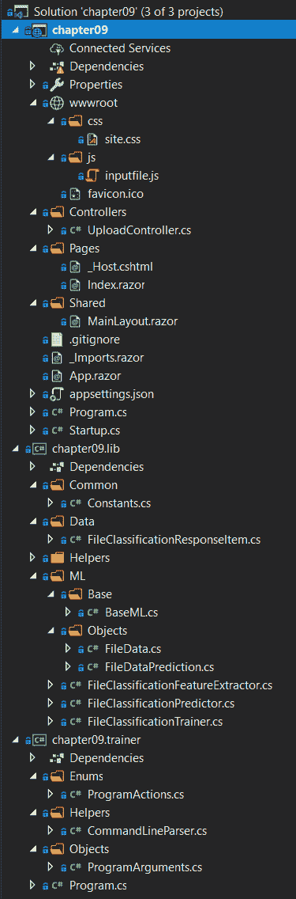
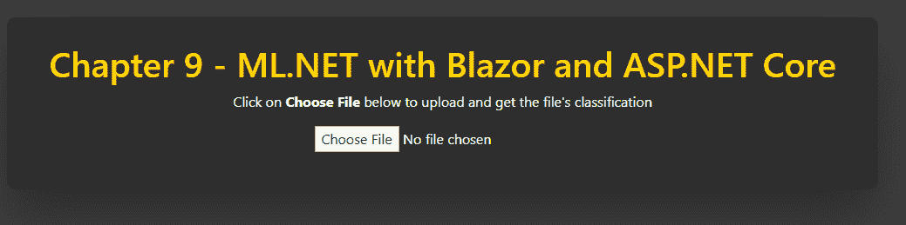
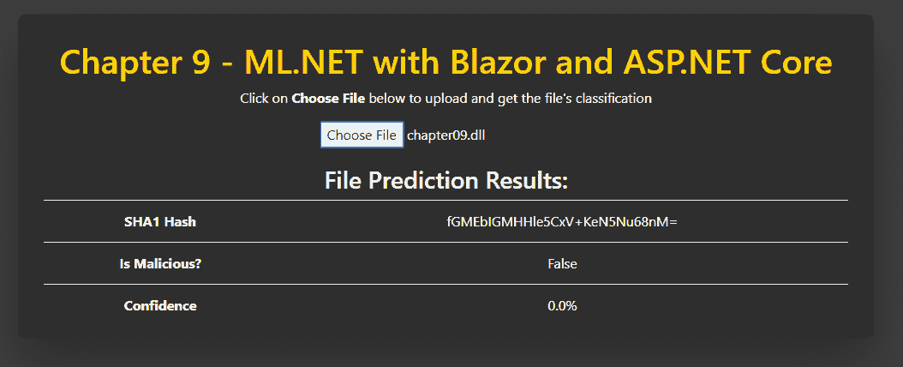

# 在 ASP.NET Core 中使用 ML.NET

现在我们已经了解了如何创建一个生产级别的 .NET Core 控制台应用程序，在本章中，我们将深入探讨创建一个功能齐全的 ASP.NET Core Blazor 网络应用程序。这个应用程序将利用 ML.NET 二元分类模型对 Windows 可执行文件（**可移植可执行文件**（**PE**）文件）进行文件分类，以确定文件本身是干净的还是恶意的。此外，我们将探索将我们的应用程序代码分解为基于组件的架构，使用 .NET Core 库在 web 应用程序和将训练我们的模型的控制台应用程序之间共享。到本章结束时，你应该能够熟练地设计和编码带有 ML.NET 的生产级别 ASP.NET Core Blazor 网络应用程序。

在本章中，我们将涵盖以下主题：

+   拆解 ASP.NET Core

+   创建文件分类网络应用程序

+   探索额外的生产应用增强功能

# 拆解 ASP.NET Core

基于第八章中讨论的相同 .NET Core 技术，*在 .NET Core 和预测中使用 ML.NET*，ASP.NET Core 添加了一个强大的网络框架。这个网络框架包括一个强大的渲染引擎 Razor，以及支持可扩展的 **表示状态转移**（**REST**）服务。本章的示例将使用这项技术来创建我们的文件分类前端。在接下来的两个部分中，我们将深入研究 ASP.NET Core 架构并讨论微软的新网络框架 Blazor。

# 理解 ASP.NET Core 架构

从高层次来看，ASP.NET Core 建立在 .NET Core 之上，提供了一个功能齐全的网络框架。与 .NET Core 一样，ASP.NET Core 在 Windows、Linux 和 macOS 上运行，同时还允许部署到 x86、x64 和 **高级精简指令集机器**（**ARM**）CPU 架构。

一个典型的 ASP.NET Core 应用程序包括以下内容：

+   模型

+   视图

+   控制器

这些组件构成了一个常见的网络架构原则 **模型-视图-控制器**（**MVC**）。

# 控制器

控制器为处理网络应用程序和 REST 服务的业务逻辑提供服务器端代码。控制器可以在同一个控制器中包含 web 和 REST 调用，尽管我建议将它们分开，以确保代码组织得干净整洁。

# 模型

模型为从控制器到视图以及相反方向提供数据容器。例如，考虑一个从数据库中获取数据的列表页面。控制器将返回一个包含该数据的模型，如果相同的数据被用于过滤，它也将序列化为 **JavaScript 对象表示法**（**JSON**）并发送回控制器。

# 视图

视图提供了前端视图的模板，并支持模型绑定。模型绑定允许将绑定到各种**领域对象模型**（**DOM**）对象的属性（如文本框、复选框和下拉列表）干净地映射到和从。这种模型绑定的方法具有支持强类型引用的附加好处，这对于你有一个具有数十个绑定到模型的属性的复杂视图来说非常有用。

使用模型绑定处理表单提供了与我们在第十章“使用 ML.NET 与 UWP”中将要深入探讨的**模型-视图-视图模型**（**MVVM**）方法类似的模型，这是一个**通用 Windows 平台**（**UWP**）应用程序。

如果你想进一步深入了解 ASP.NET，微软的 Channel 9 有一个名为 ASP.NET Core 101 的系列，涵盖了 ASP.NET 的所有主要方面，请访问[`channel9.msdn.com/Series/ASPNET-Core-101`](https://channel9.msdn.com/Series/ASPNET-Core-101)。

# Blazor

建立在 ASP.NET Core 基础设施之上，Blazor 专注于消除复杂 Web 应用程序中最大的障碍之一——**JavaScript**。Blazor 允许你编写 C#代码而不是 JavaScript 代码来处理客户端任务，如表单处理、HTTP 调用和异步加载数据。在底层，Blazor 使用**WebAssembly**（**Wasm**），这是一个由所有当前浏览器（Edge、Safari、Chrome 和 Firefox）支持的高性能 JavaScript 框架。

与其他框架类似，Blazor 也支持并推荐使用模块化组件来促进重用。这些被称为**Blazor 组件**。

此外，在创建 Blazor 应用程序时，有三种项目类型：

+   仅使用 Blazor 客户端，这对于更多静态页面来说非常理想。

+   一个 Blazor（ASP.NET Core 托管）客户端应用程序，它托管在 ASP.NET Core 内部（这是我们将在下一节中要审查的项目类型）。

+   一个 Blazor 服务器端应用程序，用于更新 DOM。这对于与 SignalR（微软的实时 Web 框架，支持聊天、实时股票行情和地图等）一起使用非常理想。

如果你想进一步深入了解 Blazor，微软已经在**微软开发者网络**（**MSDN**）上编写了大量关于 Blazor 的文档，请访问：[`docs.microsoft.com/en-us/aspnet/core/blazor/?view=aspnetcore-3.1`](https://docs.microsoft.com/en-us/aspnet/core/blazor/?view=aspnetcore-3.1)。

# 创建文件分类网络应用程序

如前所述，我们将创建的应用程序是一个文件分类网络应用程序。使用 第四章 中“创建二进制分类应用程序”部分的知识，即 *分类模型*，我们将更进一步，查看在分类之前向文件添加更多属性。此外，我们还将机器学习与 ML.NET 集成到网络应用程序中，用户可以上传文件进行分类，返回清洁或恶意文件，以及预测的置信度。

与前面的章节一样，完整的项目代码、样本数据集和项目文件可以在以下位置下载：[`github.com/PacktPublishing/Hands-On-Machine-Learning-With-ML.NET/tree/master/chapter09`](https://github.com/PacktPublishing/Hands-On-Machine-Learning-With-ML.NET/tree/master/chapter09)。

# 探索项目架构

由于之前的应用都是命令行应用，因此本例的项目架构相当不同。

与一些前面的章节一样，为了在 ML.NET 中使用 `FastTree` 算法，需要额外的 ML.NET NuGet 包——`Microsoft.ML.FastTree`。GitHub 中的示例和本章的深入探讨中都使用了 1.3.1 版本。

在以下屏幕截图中，您将找到示例解决方案的 Visual Studio 解决方案资源管理器视图。鉴于本例包含三个独立的项目（更类似于生产场景），新文件和显著修改的文件数量相当大。我们将在本节末尾运行应用程序之前，在以下部分详细审查以下解决方案屏幕截图中的每个新文件：



`sampledata.csv` 文件包含从 Windows 可执行文件中提取的 14 行特征（我们将在下一节中详细介绍这些特征）。请随意调整数据以适应您的观察或使用不同的样本文件调整训练模型。以下是从 `sampledata.data` 文件中找到的一行示例：

```py
18944 0 7 0 0 4 True "!This program cannot be run in DOS mode.Fm;Ld &~_New_ptrt(M4_Alloc_max"uJIif94H3"j?TjV*?invalid argum_~9%sC:\Program Files (x86\Microsoft Visu Studio\20cl4e\xomory"/Owneby CWGnkno excepti & 0xFF;b?eCErr[E7XE#D%d3kRegO(q/}nKeyExWa!0 S=+,H}Vo\DebugPE.pdbC,j?_info ByteToWidendled=aekQ3V?$buic_g(@1@A8?5/wQAEAAV0;AH@Z?flush@Co12@XcCd{(kIN<7BED!?rdbufPA[Tght_tDB.0J608(:6<?xml version='1.0' encoding='UTF8' standalone='yes'?><assembly xmlns='urn:schemasmicrosoftcom:asm.v1' manifestVersion='1.0'> <trustInfo > <security> <requestedPrivileges> <requestedExecutionLevel level='asInvoker' uiAccess='false' /> </requestedPrivileges> </security> </trustInfo></assembly>KERNEL32.DLLMSVCP140D.dllucrtbased.dllVCRUNTIME140D.dllExitProcessGetProcAddressLoadLibraryAVirtualProtect??1_Lockit@std@@QAE@XZ"
```

此外，我们还添加了 `testdata.data` 文件，其中包含额外的数据点，用于测试新训练的模型并对其进行评估。以下是 `testdata.data` 文件中的数据样本行：

```py
1670144 1 738 0 0 24 False "!This program cannot be run in DOS mode.WATAUAVAWH A_AA]A\_t$ UWAVHx UATAUAVAWHA_AA]A\]UVWATAUAVAWH|$@H!t$0HA_AA]A\_]VWATAVAWHSUVWATAUAVAWH(A_AA]A\_][@USVWATAVAWHA_AA\_[]UVWATAUAVAWHA_AA]A\_]@USVWAVH` UAUAVHWATAUAVAWH A_AA]A\_x ATAVAWHUSVWATAUAVAWHA_AA]A\_[]UVWATAUAVAWHA_AA]A\_]\$ UVWATAUAVAWHA_AA]A\_]x UATAUAVAWHA_AA]A\]@USVWAVHUVWATAUAVAWHA_AA]A\_]UVWATAUAVAWHA_AA]A\_]@USVWATAVAWHA_AA\_[]t$ UWAVH@USVWAVHUVWAVAWHh VWATAVAWHUVWAVAWHUVWATAUAVAWHpA_AA]A\_]WATAUAVAWH0A_AA]A\_L$ UVWATAUAVAWH@A_AA]A\_]UVWATAUAVAWH`A_AA]A\_]UVWATAUAVAWHpA_AA]A\_]@USVWATAVAWHD$0fD9 tA_AA\_[]"
```

由于示例项目的规模，我们将在本节末尾运行应用程序之前，按照以下顺序深入了解每个不同组件的代码：

+   两个应用程序之间的常见代码的 .NET Core 库

+   用于运行预测的 ASP.NET Blazor 网络应用程序

+   用于特征提取和训练的 .NET Core 控制台应用程序

# 深入了解库

以下是被更改或添加的类和枚举：

+   `文件分类响应项`

+   `转换器`

+   `扩展方法`

+   `哈希扩展`

+   `文件数据`

+   `文件数据预测`

+   `FileClassificationFeatureExtractor`

+   `FileClassificationPredictor`

+   `FileClassificationTrainer`

`Constants` 和 `BaseML` 类与第八章 第八章，*使用 ML.NET 与.NET Core 和预测* 中保持未修改。

由于本应用程序和生产应用程序的性质，其中存在多个平台和/或执行共享代码的方式，本章示例应用程序中使用了库。使用库的好处是所有常用代码都可以以便携和无需依赖的方式存在。将此示例应用程序的功能扩展到包括桌面或移动应用程序，将比复制代码或保留在实际应用程序中要容易得多。

# `FileClassificationResponseItem` 类

`FileClassificationResponseItem` 类是包含用于向我们的模型提供属性的共同类，同时也用于在 Web 应用程序中返回给最终用户。

1.  首先，我们定义 `TRUE` 和 `FALSE` 映射到 `1.0f` 和 `0.0f`，如下所示：

```py
private const float TRUE = 1.0f;
private const float FALSE = 0.0f;
```

1.  接下来，我们添加所有要用于向我们的模型提供并显示给 Web 应用程序的最终用户的属性。`FileSize`、`Is64Bit`、`NumImports`、`NumImportFunctions`、`NumExportFunctions`、`IsSigned` 和 `Strings` 属性被专门用作模型中的特征。`SHA1Sum`、`Confidence`、`IsMalicious` 和 `ErrorMessage` 属性用于将我们的分类返回给最终用户，如下面的代码块所示：

```py
public string SHA1Sum { get; set; }

public double Confidence { get; set; }

public bool IsMalicious { get; set; }

public float FileSize { get; set; }

public float Is64Bit { get; set; }

public float NumImports { get; set; }

public float NumImportFunctions { get; set; }

public float NumExportFunctions { get; set; }

public float IsSigned { get; set; }

public string Strings { get; set; }

public string ErrorMessage { get; set; }
```

1.  接下来，我们有构造函数方法。如您所见，构造函数有一个字节数组作为参数。这样做是为了方便两个应用程序中的训练和预测路径，想法是原始文件字节将从 `File.ReadAllBytes` 调用或其他机制进入构造函数，以提供灵活性。从那里，我们使用 `PeNet` NuGet 包。此包提供了一个易于使用的接口，用于从 Windows 可执行文件（也称为 PE 文件）中提取特征。对于本应用程序的范围，选择了一些特征进行提取并存储到相应的属性中，如下面的代码块所示：

```py
public FileClassificationResponseItem(byte[] fileBytes)
{
    SHA1Sum = fileBytes.ToSHA1();
    Confidence = 0.0;
    IsMalicious = false;
    FileSize = fileBytes.Length;

    try
    {
        var peFile = new PeNet.PeFile(fileBytes);

        Is64Bit = peFile.Is64Bit ? TRUE : FALSE;

        try
        {
            NumImports = peFile.ImageImportDescriptors.Length;
        }
        catch
        {
            NumImports = 0.0f;
        }

        NumImportFunctions = peFile.ImportedFunctions.Length;

        if (peFile.ExportedFunctions != null)
        {
            NumExportFunctions = peFile.ExportedFunctions.Length;
        }

        IsSigned = peFile.IsSigned ? TRUE : FALSE;

        Strings = fileBytes.ToStringsExtraction();
    }
    catch (Exception)
    {
        ErrorMessage = $"Invalid file ({SHA1Sum}) - only PE files are supported";
    }
}
```

# `FileData` 类

与之前的预测数据容器一样，`FileData` 类为我们提供必要的字段，以提供文件分类。此外，我们重写了 `ToString` 方法，以便在特征提取步骤中将此数据轻松导出到 **逗号分隔值** (**CSV**) 文件，如下所示：

```py
public class FileData
{
    [LoadColumn(0)]
    public float FileSize { get; set; }

    [LoadColumn(1)]
    public float Is64Bit { get; set; }

    [LoadColumn(2)]
    public float NumberImportFunctions { get; set; }

    [LoadColumn(3)]
    public float NumberExportFunctions { get; set; }

    [LoadColumn(4)]
    public float IsSigned { get; set; }

    [LoadColumn(5)]
    public float NumberImports { get; set; }

    [LoadColumn(6)]
    public bool Label { get; set; }

    [LoadColumn(7)]
    public string Strings { get; set; }

    public override string ToString() => $"{FileSize}\t{Is64Bit}\t{NumberImportFunctions}\t" +
                                         $"{NumberExportFunctions}\t{IsSigned}\t{NumberImports}\t" +
                                         $"{Label}\t\"{Strings}\"";
}
```

# `FileDataPrediction` 类

`FileDataPrediction` 类包含预测的分类和概率属性，以便在我们的 Web 应用程序中返回给最终用户，如下面的代码块所示：

```py
public class FileDataPrediction
{
    public bool Label { get; set; }

    public bool PredictedLabel { get; set; }

    public float Score { get; set; }

    public float Probability { get; set; }
}
```

# `Converters` 类

`Converters` 类提供了一个扩展方法，用于将前面在本节中审查过的 `FileClassificationResponseItem` 类转换为 `FileData` 类。通过创建扩展方法，如以下代码块所示，我们可以快速且干净地在应用程序容器和我们的仅模型容器之间进行转换：

```py
public static class Converters
{
    public static FileData ToFileData(this FileClassificationResponseItem fileClassification)
    {
        return new FileData
        {
            Is64Bit = fileClassification.Is64Bit,
            IsSigned = fileClassification.IsSigned,
            NumberImports = fileClassification.NumImports,
            NumberImportFunctions = fileClassification.NumImportFunctions,
            NumberExportFunctions = fileClassification.NumExportFunctions,
            FileSize = fileClassification.FileSize,
            Strings = fileClassification.Strings
        };
    }
}
```

# `ExtensionMethods` 类

如前几章所示，`ExtensionMethods` 类包含辅助扩展方法。在本例中，我们将添加 `ToStrings` 扩展方法。字符串是在对文件进行分类时非常受欢迎的第一遍扫描，并且易于捕获的特征。让我们深入了解该方法，如下所示：

1.  首先，我们定义了两个新的常量来处理缓冲区大小和编码。如前所述，`1252` 是 Windows 可执行文件所使用的编码，如下面的代码块所示：

```py
private const int BUFFER_SIZE = 2048;
private const int FILE_ENCODING = 1252;
```

1.  下一个更改是添加了 `ToStringsExtraction` 方法本身以及定义我们的正则表达式，如下所示：

```py
public static string ToStringsExtraction(this byte[] data)
{
     var stringRex = new Regex(@"[ -~\t]{8,}", RegexOptions.Compiled);
```

这个正则表达式是我们将用来遍历文件字节的。

1.  接下来，我们初始化 `StringBuilder` 类并检查传入的字节数组是否为空或为空（如果是，我们无法处理它），如下所示：

```py
var stringLines = new StringBuilder();

if (data == null || data.Length == 0)
{
     return stringLines.ToString();
}
```

1.  既然我们已经确认传入的数组中有字节，我们只想取最多 `65536` 字节。这样做的原因是，如果文件是 100 MB，这个操作可能需要很长时间。您可以随意调整这个数字并查看效果。代码如下所示：

```py
var dataToProcess = data.Length > 65536 ? data.Take(65536).ToArray() : data;
```

1.  现在我们有了将要分析的字节，我们将遍历并提取字节中找到的文本行，如下所示：

```py
using (var ms = new MemoryStream(dataToProcess, false))
{
    using (var streamReader = new StreamReader(ms, Encoding.GetEncoding(FILE_ENCODING), false, BUFFER_SIZE, false))
    {
        while (!streamReader.EndOfStream)
        {
            var line = streamReader.ReadLine();

            if (string.IsNullOrEmpty(line))
            {
                continue;
            }

            line = line.Replace("^", "").Replace(")", "").Replace("-", "");

            stringLines.Append(string.Join(string.Empty,
                stringRex.Matches(line).Where(a => !string.IsNullOrEmpty(a.Value) && !string.IsNullOrWhiteSpace(a.Value)).ToList()));
        }
    }
}
```

1.  最后，我们只需将行连接成一个单独的字符串，如下所示：

```py
return string.Join(string.Empty, stringLines);
```

# `HashingExtensions` 类

新的 `HashingExtensions` 类将我们的字节数组转换为 SHA1 字符串。之所以没有将其放在我们的其他扩展方法中，是为了提供一个通用的类，可能包含 SHA256、ssdeep 或其他哈希（特别是鉴于最近的 SHA1 冲突，证明了 SHA1 的不安全性）。

对于这个方法，我们使用内置的 .NET Core `SHA1` 类，然后通过调用 `ToBase64String` 方法将其转换为 Base64 字符串，如下所示：

```py
public static class HashingExtension
{
    public static string ToSHA1(this byte[] data)
    {
        var sha1 = System.Security.Cryptography.SHA1.Create();

        var hash = sha1.ComputeHash(data);

        return Convert.ToBase64String(hash);
    }
}
```

# `FileClassificationFeatureExtractor` 类

`FileClassificationFeatureExtractor` 类包含我们的 `Extract` 和 `ExtractFolder` 方法：

1.  首先，我们的 `ExtractFolder` 方法接收文件夹路径和将包含我们的特征提取的输出文件，如下面的代码块所示：

```py
private void ExtractFolder(string folderPath, string outputFile)
{
    if (!Directory.Exists(folderPath))
    {
        Console.WriteLine($"{folderPath} does not exist");

        return;
    }

    var files = Directory.GetFiles(folderPath);

    using (var streamWriter =
        new StreamWriter(Path.Combine(AppContext.BaseDirectory, $"../../../../{outputFile}")))
    {
        foreach (var file in files)
        {
            var extractedData = new FileClassificationResponseItem(File.ReadAllBytes(file)).ToFileData();

            extractedData.Label = !file.Contains("clean");

            streamWriter.WriteLine(extractedData.ToString());
        }
    }

    Console.WriteLine($"Extracted {files.Length} to {outputFile}");
}     
```

1.  接下来，我们使用 `Extract` 方法调用训练和测试提取，如下所示：

```py
public void Extract(string trainingPath, string testPath)
{
    ExtractFolder(trainingPath, Constants.SAMPLE_DATA);
    ExtractFolder(testPath, Constants.TEST_DATA);
}
```

# `FileClassificationPredictor` 类

`FileClassificationPredictor` 类为我们的命令行和 Web 应用程序提供接口，使用重载的 `Predict` 方法：

1.  第一个 `Predict` 方法是为我们的命令行应用程序准备的，它简单地接收文件名，并在加载字节后调用 *步骤 2* 中的重载，如下所示：

```py
public FileClassificationResponseItem Predict(string fileName)
{
    var bytes = File.ReadAllBytes(fileName);

    return Predict(new FileClassificationResponseItem(bytes));
}
```

1.  第二种实现是为我们的 Web 应用程序，它接收`FileClassificationResponseItem`对象，创建我们的预测引擎，并返回预测数据，如下所示：

```py
public FileClassificationResponseItem Predict(FileClassificationResponseItem file)
{
    if (!File.Exists(Common.Constants.MODEL_PATH))
    {
        file.ErrorMessage = $"Model not found ({Common.Constants.MODEL_PATH}) - please train the model first";

        return file;
    }

    ITransformer mlModel;

    using (var stream = new FileStream(Common.Constants.MODEL_PATH, FileMode.Open, FileAccess.Read, FileShare.Read))
    {
        mlModel = MlContext.Model.Load(stream, out _);
    }

    var predictionEngine = MlContext.Model.CreatePredictionEngine<FileData, FileDataPrediction>(mlModel);

    var prediction = predictionEngine.Predict(file.ToFileData());

    file.Confidence = prediction.Probability;
    file.IsMalicious = prediction.PredictedLabel;

    return file;
}
```

# FileClassificationTrainer 类

在库中最后添加的类是`FileClassificationTrainer`类。此类支持使用`FastTree` ML.NET 训练器，以及利用我们从文件中提取的特征：

1.  第一项更改是使用`FileData`类将 CSV 文件读取到`dataView`属性中，如下面的代码块所示：

```py
var dataView = MlContext.Data.LoadFromTextFile<FileData>(trainingFileName, hasHeader: false);
```

2. 接下来，我们将我们的`FileData`特征映射以创建我们的流水线，如下所示：

```py
var dataProcessPipeline = MlContext.Transforms.NormalizeMeanVariance(nameof(FileData.FileSize))
    .Append(MlContext.Transforms.NormalizeMeanVariance(nameof(FileData.Is64Bit)))
    .Append(MlContext.Transforms.NormalizeMeanVariance(nameof(FileData.IsSigned)))
    .Append(MlContext.Transforms.NormalizeMeanVariance(nameof(FileData.NumberImportFunctions)))
    .Append(MlContext.Transforms.NormalizeMeanVariance(nameof(FileData.NumberExportFunctions)))
    .Append(MlContext.Transforms.NormalizeMeanVariance(nameof(FileData.NumberImports)))
    .Append(MlContext.Transforms.Text.FeaturizeText("FeaturizeText", nameof(FileData.Strings)))
    .Append(MlContext.Transforms.Concatenate(FEATURES, nameof(FileData.FileSize), nameof(FileData.Is64Bit),
        nameof(FileData.IsSigned), nameof(FileData.NumberImportFunctions), nameof(FileData.NumberExportFunctions),
        nameof(FileData.NumberImports), "FeaturizeText"));
```

3. 最后，我们初始化我们的`FastTree`算法，如下所示：

```py
var trainer = MlContext.BinaryClassification.Trainers.FastTree(labelColumnName: nameof(FileData.Label),
    featureColumnName: FEATURES,
    numberOfLeaves: 2,
    numberOfTrees: 1000,
    minimumExampleCountPerLeaf: 1,
    learningRate: 0.2);
```

该方法的其他部分与我们在第五章中讨论的二元分类`Train`方法类似，*聚类模型*。

# 深入 Web 应用程序

在审查了库代码之后，下一个组件是 Web 应用程序。如开篇部分所述，我们的 Web 应用程序是一个 ASP.NET Core Blazor 应用程序。在本例的范围内，我们使用标准方法来处理后端和前端。该应用程序的架构结合了 Blazor 和 ASP.NET Core——具体来说，使用 ASP.NET Core 来处理应用程序的 REST 服务组件。

我们将在本节中深入研究的文件如下：

+   `UploadController`

+   `Startup`

+   `Index.razor`

# UploadController 类

`UploadController`类的目的是处理文件提交后的服务器端处理。对于那些以前使用过 ASP.NET MVC 或 Web API 的人来说，这个控制器看起来应该非常熟悉：

1.  需要注意的第一件事是装饰类的属性标记。`ApiController`属性配置控制器以处理 HTTP API，而`Route`标记表示控制器将监听`/Upload`路径，如下面的代码块所示：

```py
[ApiController]
[Route("[controller]")]
public class UploadController : ControllerBase
```

1.  需要注意的下一件事是在`UploadController`构造函数中使用**依赖注入**（**DI**）传递预测对象。DI 是一种强大的方法，用于提供对单例对象（如`FileClassificationPredictor`或数据库）的访问，如下面的代码块所示：

```py
private readonly FileClassificationPredictor _predictor;

public UploadController(FileClassificationPredictor predictor)
{
    _predictor = predictor;
}
```

1.  接下来，我们创建一个辅助方法来处理从 HTTP POST 中获取`IFormFile`并返回所有字节，如下所示：

```py
private static byte[] GetBytesFromPost(IFormFile file)
{
    using (var ms = new BinaryReader(file.OpenReadStream()))
    {
        return ms.ReadBytes((int)file.Length);
    }
}
```

1.  最后，我们创建`Post`方法。`HttpPost`属性告诉路由引擎仅监听`HttpPost`调用。该方法处理`GetBytesFromPost`方法调用的输出，创建`FileClassificationResponseItem`对象，然后返回预测，如下面的代码块所示：

```py
[HttpPost]
public FileClassificationResponseItem Post(IFormFile file)
{
    if (file == null)
    {
        return null;
    }

    var fileBytes = GetBytesFromPost(file);

    var responseItem = new FileClassificationResponseItem(fileBytes);

    return _predictor.Predict(responseItem);
}
```

# Startup 类

在 ASP.NET Core 和 Blazor 应用程序中，`Startup`类控制 Web 应用程序中使用的各种服务的初始化。对 Visual Studio 附带的`Startup`模板进行了两项主要更改，如下所示：

1.  首个改动发生在 `ConfigureServices` 方法中。因为这是一个同时应用了 ASP.NET Core 和 Blazor 的组合应用程序，我们需要调用 `AddControllers` 方法。此外，我们打算利用依赖注入（DI）并一次性初始化预测器对象，然后再将其作为单例添加，如下面的代码块所示：

```py
public void ConfigureServices(IServiceCollection services)
{
    services.AddRazorPages();
    services.AddControllers();
    services.AddServerSideBlazor();

    services.AddSingleton<FileClassificationPredictor>();
    services.AddSingleton<HttpClient>();
}
```

1.  第二个改动发生在 `Configure` 方法中。首先，我们需要注册 `CodePages` 实例。如果没有这个调用，对 Windows-1252 编码的引用将导致异常（我们将在下一节中将此调用添加到训练应用程序中）。其次，是配置 `MapControllerRoute` 的使用，如下面的代码块所示：

```py
public void Configure(IApplicationBuilder app, IWebHostEnvironment env)
{
    Encoding.RegisterProvider(CodePagesEncodingProvider.Instance);

    if (env.IsDevelopment())
    {
        app.UseDeveloperExceptionPage();
    }
    else
    {
        app.UseExceptionHandler("/Error");
    }

    app.UseStaticFiles();

    app.UseRouting();

    app.UseEndpoints(endpoints =>
    {
        endpoints.MapControllerRoute("default", "{controller=Home}/{action=Index}/{id?}");
        endpoints.MapBlazorHub();
        endpoints.MapFallbackToPage("/_Host");
    });
}
```

# `Index.razor` 文件

`Index.razor` 文件包含我们文件分类 Web 应用程序的前端。此外，它还包含对之前在本节中描述的 `UploadController` 类的 REST 调用。对于这次深入分析，我们将特别查看以下 Blazor 代码块：

1.  首先要注意的是我们 `FileClassificationResponseItem` 类的声明。我们在这个块中定义变量，因为它将允许在整个页面中访问。第二个元素是 `HandleSelection` 方法的声明，如下面的代码块所示：

```py
FileClassificationResponseItem _classificationResponseItem;

async Task HandleSelection(IEnumerable<IFileListEntry> files) {
```

1.  接下来，我们将第一个文件转换为字节数组，并创建 `MultipartFormdataContent` 对象，以便将其 POST 到之前描述的 `Post` 方法，如下所示：

```py
var file = files.FirstOrDefault();

if (file != null)
{
    var ms = new MemoryStream();
    await file.Data.CopyToAsync(ms);

    var content = new MultipartFormDataContent {
        {
            new ByteArrayContent(ms.GetBuffer()), "file", file.Name
        }
    };
```

1.  最后，我们将文件 POST 到我们的 `UploadController` 端点，并异步等待来自 ML.NET 预测的响应，然后将响应分配给我们的响应变量 `_classificationResponseItem`，如下所示：

```py
var response = await client.PostAsync("http://localhost:5000/upload/", content);

var jsonResponse = await response.Content.ReadAsStringAsync();

_classificationResponseItem = JsonSerializer.Deserialize<FileClassificationResponseItem>(jsonResponse, new JsonSerializerOptions
{
    PropertyNameCaseInsensitive = true
});
```

# 深入了解训练应用程序

现在我们已经回顾了共享库和 Web 应用程序，让我们深入到训练应用程序中。

我们将回顾以下文件：

+   `ProgramArguments`

+   `ProgramActions`

+   `Program`

# `ProgramArguments` 类

基于 第八章 中 `ProgramArguments` 类的详细工作，*使用 ML.NET 与 .NET Core 和预测*，我们只对该类进行了一项添加。这次改动为类添加了存储 `Testing` 和 `Training` 文件夹路径的属性，如下面的代码块所示：

```py
public string TestingFolderPath { get; set; }

public string TrainingFolderPath { get; set; }
```

与上一章不同，特征提取基于多个 Windows 可执行文件，而不是仅仅包含一个 CSV 文件。

# `ProgramActions` 枚举

首个改动发生在 `ProgramActions` 枚举中。在 第八章 的 *使用 ML.NET 与 .NET Core 和预测* 中，我们只有训练和预测。然而，正如本章前面提到的，我们现在还有 `FeatureExtraction` 需要执行。为了添加支持，我们只需将 `FEATURE_EXTRACTOR` 添加到枚举中，如下所示：

```py
public enum ProgramActions
{
    FEATURE_EXTRACTOR,
    TRAINING,
    PREDICT
}
```

# `Program` 类

在`Program`类中，与上一章对命令行参数解析的重构相比，只有两个更改，如下所示：

1.  首先，我们需要注册`CodePages`编码器实例，以便正确读取文件中的 Windows-1252 编码，就像我们在 Web 应用程序中所做的那样，如下所示：

```py
Encoding.RegisterProvider(CodePagesEncodingProvider.Instance);
```

1.  我们可以使用一个简化和强类型化的 switch case 来处理我们的三个动作，如下所示：

```py
switch (arguments.Action)
{
    case ProgramActions.FEATURE_EXTRACTOR:
        new FileClassificationFeatureExtractor().Extract(arguments.TrainingFolderPath,
            arguments.TestingFolderPath);
        break;
    case ProgramActions.PREDICT:
        var prediction = new FileClassificationPredictor().Predict(arguments.PredictionFileName);

        Console.WriteLine($"File is {(prediction.IsMalicious ? "malicious" : "clean")} with a {prediction.Confidence:P2}% confidence");
        break;
    case ProgramActions.TRAINING:
        new FileClassificationTrainer().Train(arguments.TrainingFileName, arguments.TestingFileName);
        break;
    default:
        Console.WriteLine($"Unhandled action {arguments.Action}");
        break;
}
```

# 运行训练应用程序

首先，我们需要先运行`chapter09.trainer`应用程序以执行模型的特征提取和训练。要运行训练应用程序，过程几乎与第三章中展示的示例应用程序相同，即*回归模型*，但需要添加在训练时传递测试数据集文件夹路径，我们将遵循以下步骤：

1.  我们将运行训练应用程序，传递训练和测试文件夹的路径以执行特征提取，如下所示：

```py
PS chapter09\chapter09.trainer\bin\Debug\netcoreapp3.1> .\chapter09.trainer.exe trainingfolderpath ..\..\..\..\TrainingData\ testingfolderpath ..\..\..\..\TestData\
Extracted 14 to sampledata.data
Extracted 14 to testdata.data
```

代码仓库中包含两个预特征提取的文件（`sampledata.csv`和`t`estdata.csv），以便您可以在不执行自己的特征提取的情况下训练模型。如果您想执行自己的特征提取，创建一个`TestData`和`TrainingData`文件夹。将这些文件夹填充为**PowerShell**（**PS1**）、**Windows 可执行文件**（**EXE**）和**Microsoft Word 文档**（**DOCX**）的样本。

1.  现在，我们将再次运行应用程序，根据*步骤 1*样本和测试数据导出训练模型。生成的模型（`fileclassification.mdl`）将与可执行文件在同一文件夹中，如下所示：

```py
PS chapter09\chapter09.trainer\bin\Debug\netcoreapp3.1> .\chapter09.trainer.exe action training trainingfilename ..\..\..\..\sampledata.data testingfilename ..\..\..\..\testdata.data
Entropy: 0.5916727785823275
Log Loss: 12.436063032030377
Log Loss Reduction: -20.018480961432264
```

随意修改值，看看基于模型训练数据集的预测如何变化。从这个点开始，一些实验性的区域可能包括以下内容：

+   调整`Trainer`类中审查的超参数——如`numberOfLeaves`、`numberOfTrees`和`learningRate`——以查看精度如何受到影响。

+   向`FileData`类添加新功能，例如特定的导入，而不仅仅是使用计数。

+   向训练和样本集添加更多变化，以获得更好的数据采样。

为了方便，GitHub 仓库包含了`testdata.csv`和`sampledata.csv`两个文件。

# 运行 Web 应用程序

现在我们已经训练了模型，我们可以运行我们的 Web 应用程序并测试文件提交。如果您还没有构建 Web 应用程序，您必须首先构建它。这将创建`bin\debug\netcoreapp3.1`文件夹。构建 Web 应用程序后，复制上一节中训练的模型。此时，启动 Web 应用程序。启动后，您应该在默认浏览器中看到以下内容：



继续点击选择文件按钮，选择一个`.exe`或`.dll`文件，您应该看到我们的模型以下列结果：



随意尝试在您的机器上使用各种文件来查看置信度分数，如果您收到错误阳性结果，可能需要向模型添加更多功能以纠正分类。

# 探索改进的额外想法

现在我们已经完成了深入探讨，还有一些额外的元素可能有助于进一步增强应用程序。下面将讨论一些想法。

# 记录日志

就像我们在上一章深入探讨日志记录时一样，添加日志记录对于远程了解 Web 应用程序上何时发生错误可能是至关重要的。随着应用程序复杂性的增加，强烈建议使用 NLog ([`nlog-project.org/`](https://nlog-project.org/)) 或类似的开源项目进行日志记录。这将允许您以不同的级别将日志记录到文件、控制台或第三方日志解决方案——如 Loggly。

# 利用缓存层

想象一下将此应用程序部署到面向公众的 Web 服务器上，并拥有数百个并发用户。很可能会发生用户上传相同的文件——在内存中缓存结果可以避免每次预测时进行不必要的 CPU 处理。一些缓存选项包括利用 ASP.NET 内存缓存，或外部缓存数据库，如 Redis。这两个都可通过 NuGet 包获得。

# 利用数据库

与缓存建议类似，将结果记录在数据库中可以避免不必要的 CPU 处理。一个合理的选择是使用 NoSQL 数据库，例如 MongoDB。使用 SHA1 哈希作为键，将完整 JSON 响应作为值可以显著提高高流量场景下的性能。MongoDB 在 NuGet 上有一个名为 `MongoDB.Driver` 的 .NET 接口。在撰写本文时，2.10.0 是最新的版本。

# 摘要

在本章的讨论过程中，我们探讨了构建一个生产就绪的 ASP.NET Core Blazor 网络应用程序架构所需的内容，并以前几章的工作为基础。我们还创建了一个全新的文件分类网络应用程序，利用了 ML.NET 的 FastTree 二进制分类器。最后，我们还讨论了一些进一步增强 ASP.NET Core 应用程序（以及一般的生产应用程序）的方法。

在下一章中，我们将深入探讨创建一个生产级网络浏览器，使用网页内容来确定内容是否恶意，利用 ML.NET 的情感分析和 UWP 框架。
