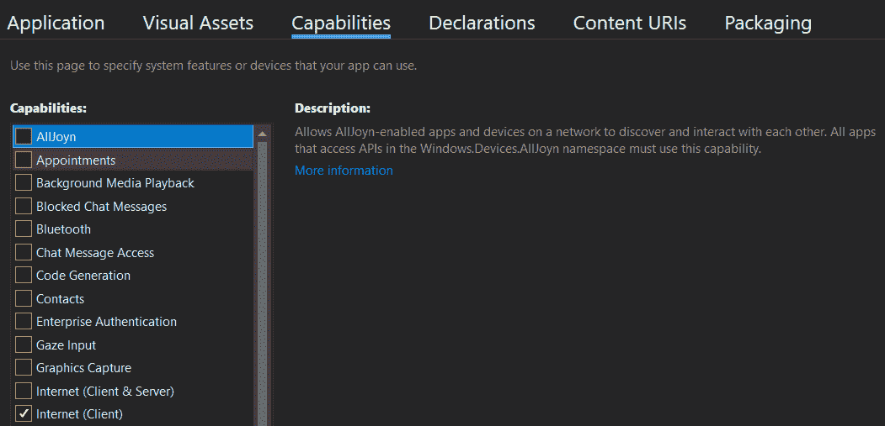
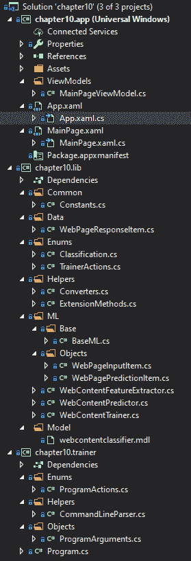
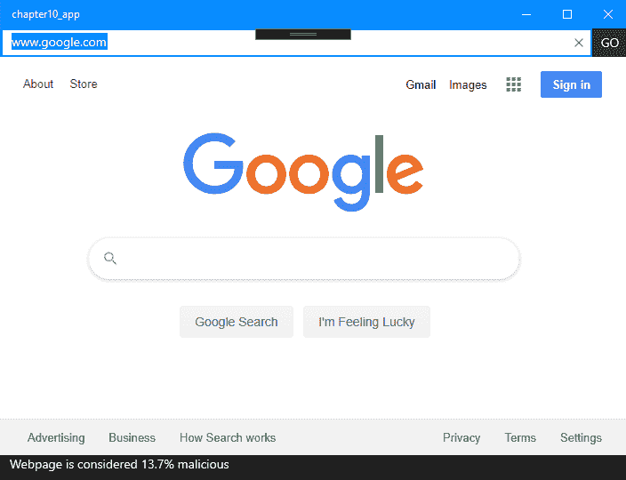
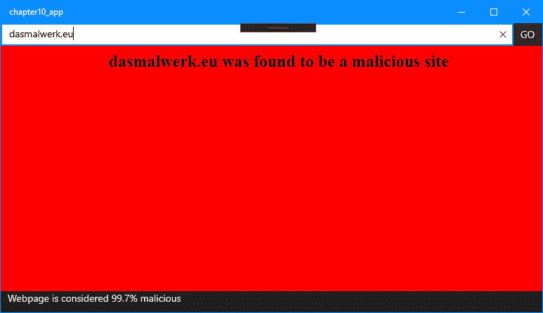

# 在 UWP 中使用 ML.NET

现在我们已经建立了如何创建生产级的 .NET Core 控制台应用程序，在本章中，我们将深入探讨使用 **通用 Windows 平台**（**UWP**）框架创建一个功能齐全的 Windows 10 应用程序。此应用程序将利用 ML.NET 二元分类模型来对网页内容进行分类，以确定内容是良性的还是恶性的。此外，我们将探讨将代码分解为基于组件的架构，使用 .NET Standard 库在桌面应用程序和将训练我们的模型的控制台应用程序之间共享。到本章结束时，您应该能够熟练地设计和编码带有 ML.NET 的生产级 UWP 桌面应用程序。

本章将涵盖以下主题：

+   分析 UWP 应用程序

+   创建网络浏览器分类应用程序

+   探索额外的生产级应用程序增强功能

# 分析 UWP 架构

从高层次来看，UWP 提供了一个易于使用的框架来创建 Windows 10 的丰富桌面应用程序。正如所讨论的，使用 .NET Core，UWP 允许针对 x86、x64 和 **高级精简指令集机器**（**ARM**）。在撰写本文时，ARM 不支持 ML.NET。此外，UWP 应用程序也可以使用 JavaScript 和 HTML 编写。

一个典型的 UWP 桌面应用程序包括以下核心代码元素：

+   视图

+   模型

+   视图模型

这些组件构成了 **模型**-**视图**-**视图模型**（**MVVM**）这一通用应用程序架构原则。除了代码组件外，图像和音频也是常见的，这取决于您应用程序或游戏的本质。

与 Android 和 iOS 平台上的移动应用程序类似，每个应用程序在安装时都会被沙盒化，以特定的权限运行，这些权限由您，即开发者，在安装时请求。因此，在您开发自己的 UWP 应用程序时，只请求您的应用程序绝对需要的访问权限。

对于本章我们将创建的示例应用程序，我们只需要作为客户端访问互联网，正如在标记为“互联网（客户端）”的“功能”选项卡中所示，以下截图所示：



互联网（客户端）和其他权限定义在位于 UWP 应用程序根目录下的 `Package.appxmanifest` 文件中，在“功能”选项卡下。此文件在后续的“探索项目架构”部分中的 Visual Studio 解决方案资源管理器截图中有展示。

为了准备我们深入探讨在 UWP 应用程序中集成 ML.NET，让我们深入了解 UWP 应用程序中发现的三个核心组件。

# 视图

视图，正如我们在上一章的 Blazor 讨论中所定义的，包含了应用程序的用户界面（UI）组件。在 UWP 开发中，如 Windows Presentation Foundation（WPF）和 Xamarin.Forms 中的视图，使用可扩展应用程序标记语言（XAML）语法。那些熟悉使用 Bootstrap 的 Grid 模式进行现代 Web 开发的人，在我们深入本章内容时，将能够迅速看到其中的相似之处。

Web 开发和 UWP 开发之间最大的区别在于，当与 MVVM 原则一起使用时，XAML 视图具有强大的双向绑定功能。正如你将在深入探讨中看到的那样，XAML 绑定消除了在代码后手动设置和获取值的需求，就像你可能在之前的 Windows Forms 或 WebForms 项目中执行的那样。

对于采用 Web 方法的程序，HTML 将定义你的视图，就像我们在第九章使用 ML.NET 与 ASP.NET Core 中提到的 Blazor 项目一样。

# 模型

模型提供了视图和视图模型之间的数据容器。将模型视为纯粹是视图和视图模型之间包含数据的传输工具。例如，如果你有一个电影列表，你的`MovieListingModel`类中将定义一个`List`集合的`MovieItems`。这个容器类将在视图模型中实例化和填充，然后绑定到你的视图中。

# 视图模型

视图模型提供了填充你的模型以及间接地你的视图的业务逻辑层。正如之前提到的，UWP 开发中提供的 MVVM 绑定简化了触发点的管理，以确保你的 UI 层是最新的。这是通过在我们的视图模型中实现`INotifyPropertyChanged`接口来实现的。对于我们要绑定到 UI 的每个属性，我们只需调用`OnPropertyChanged`。其背后的力量在于，你可以在其他属性的设置器中拥有复杂的表单和触发器，而不需要条件语句和无尽的代码来处理复杂性。

如果你想要进一步深入 UWP 开发，微软的 Channel9 有一个名为*Windows 10 Development for Absolute Beginners*的系列，涵盖了 UWP 开发的各个方面：[`channel9.msdn.com/Series/Windows-10-development-for-absolute-beginners`](https://channel9.msdn.com/Series/Windows-10-development-for-absolute-beginners)。

# 创建网络浏览器分类应用程序

如前所述，我们将创建的应用程序是一个网页浏览器分类应用程序。利用逻辑分类章节中获得的知识，我们将使用 `SdcaLogisticRegression` 算法来获取网页的文本内容，对文本进行特征化，并提供恶意程度的置信度。此外，我们将把这个技术集成到一个模拟网页浏览器的 Windows 10 UWP 应用程序中——在导航到页面时运行模型，并判断页面是否恶意。如果发现页面是恶意的，我们将重定向到警告页面。虽然在现实场景中，这可能证明在每个页面上运行太慢，但高度安全的网页浏览器的优势，根据环境要求，可能远远超过运行我们的模型所造成的轻微开销。

与前几章一样，完成的项目代码、样本数据集和项目文件可以从[`github.com/PacktPublishing/Hands-On-Machine-Learning-With-ML.NET/tree/master/chapter10`](https://github.com/PacktPublishing/Hands-On-Machine-Learning-With-ML.NET/tree/master/chapter10)下载。

# 探索项目架构

在本章中，我们将深入探讨一个本地的 Windows 10 桌面应用程序。如本章第一部分所述，我们将使用 UWP 框架来创建我们的应用程序。

对于这个示例应用程序，不需要额外的 ML.NET NuGet 包。然而，我们将使用 `HtmlAgilityPack` NuGet 包提供一个快速的方法来从给定的网页中提取文本。在撰写本文时，版本 1.11.18 是最新版本，也是本例中使用的版本。

在以下屏幕截图中，您将找到解决方案的 Visual Studio 解决方案资源管理器视图。鉴于这个示例包含三个独立的项目（更类似于生产场景），新增和显著修改的文件数量相当大。我们将在本节稍后详细审查解决方案屏幕截图中显示的每个新文件：



`sampledata.csv` 文件（位于代码存储库中的 `Data` 文件夹中）包含从 `trainingURLList.csv` 文件（也位于 `Data` 文件夹中）中找到的 URL 提取的八行文本。您可以随意调整 URL 列表文件以测试您经常访问的网站。以下是此类行的一个样本：

```py
False|BingImagesVideosMapsNewsShoppingMSNOfficeOutlookWordExcelPowerPointOneNoteSwayOneDriveCalendarPeopleSigninRewardsDownloadtoday’simagePlaytoday'squizTheTajMahalinAgraforIndia'sRepublicDay©MicheleFalzone/plainpictureIt'sRepublicDayinIndiaImageofthedayJan26,2020It'sRepublicDayinIndia©MicheleFalzone/plainpictureForIndia's70thRepublicDay
```

除了 `sampledata.csv` 文件外，我们还添加了 `testdata.csv` 文件，其中包含额外的数据点，用于测试新训练的模型并评估。以下是 `testdata.csv` 文件中数据的一个样本行：

```py
True|USATODAY:LatestWorldandUSNews-USATODAY.comSUBSCRIBENOWtogethomedeliveryNewsSportsEntertainmentLifeMoneyTechTravelOpinionWeatherIconHumidityPrecip.WindsOpensettingsSettingsEnterCityNameCancelSetClosesettingsFullForecastCrosswordsInvestigationsAppsBest-SellingBooksCartoons
```

由于示例项目的规模，我们将在本节末尾运行应用程序之前，按照以下顺序深入到每个不同组件的代码中：

+   .NET 标准库，用于两个应用程序之间的通用代码

+   Windows 10 UWP 浏览器应用程序

+   .NET Core console application for feature extraction and training

# Diving into the library

Due to the nature of this application and that of production applications where there are multiple platforms and/or ways to execute shared code, a library is being used in this chapter's example application. The benefit of using a library is that all common code can reside in a portable and dependency-free manner. Expanding the functionality in this sample application to include other platforms such as Linux or Mac applications with Xamarin would be a much easier lift than having the code either duplicated or kept in the actual applications.

Classes and enumerations that were changed or added in the library are as follows:

+   `Constants`

+   `WebPageResponseItem`

+   `Converters`

+   `ExtensionMethods`

+   `WebPageInputItem`

+   `WebPagePredictionItem`

+   `WebContentFeatureExtractor`

+   `WebContentPredictor`

+   `WebContentTrainer`

The `Classification`, `TrainerActions`,and `BaseML `classes remain unmodified from Chapter 9, *Using ML.NET with ASP.NET Core*.

# The Constants class

The `Constants` class, as used in all of our examples to this point, is the common class that contains our constant values used in our library, trainer, and UWP applications. For this chapter, the `MODEL_NAME` and `MALICIOUS_THRESHOLD` properties were added to hold our model's name and an arbitrary threshold for when we should decide to classify our prediction as malicious or not, respectively. If you find your model too sensitive, try adjusting this threshold, like this:

```py
public static class Constants
{
    public const string MODEL_NAME = "webcontentclassifier.mdl";

    public const string SAMPLE_DATA = "sampledata.csv";

    public const string TEST_DATA = "testdata.csv";

    public const double MALICIOUS_THRESHOLD = .5;
}
```

# The WebPageResponseItem class

The `WebPageResponseItem` class is our container class between our predictor and application. This class contains the properties we set after running the predictor and then use to display in our desktop application, as shown in the following code block:

```py
public class WebPageResponseItem
{
    public double Confidence { get; set; }

    public bool IsMalicious { get; set; }

    public string Content { get; set; }

    public string ErrorMessage { get; set; }

    public WebPageResponseItem()
    {
    }

    public WebPageResponseItem(string content)
    {
        Content = content;
    }
}
```

# The Converters class

The `Converters` class has been adjusted to provide an extension method to convert our container class into the type our model expects. In this example, we have the `Content` property, which simply maps to the `HTMLContent` variable in the `WebPageInputItem` class, as follows:

```py
public static WebPageInputItem ToWebPageInputItem(this WebPageResponseItem webPage)
{
    return new WebPageInputItem
    {
        HTMLContent = webPage.Content
    };
}
```

# The ExtensionMethods class

如前所述，在第九章中讨论的`ExtensionMethods`类，已被扩展以包括`ToWebContentString`扩展方法。在这个方法中，我们传入我们想要检索网页内容的 URL。使用之前提到的`HtmlAgilityPack`，我们创建一个`HtmlWeb`对象并调用`Load`方法，在遍历**文档对象模型**（**DOM**）之前。鉴于大多数网站都有大量的脚本和样式表，在这个例子中，我们的目的是检查页面中的文本，因此我们在代码中过滤了脚本和样式节点。一旦节点被遍历并添加到`StringBuilder`对象中，我们就返回该对象的类型转换字符串，如下面的代码块所示：

```py
public static string ToWebContentString(this string url)
{
    var web = new HtmlWeb();

    var htmlDoc = web.Load(url);

    var sb = new StringBuilder();

    htmlDoc.DocumentNode.Descendants().Where(n => n.Name == "script" || n.Name == "style").ToList().ForEach(n => n.Remove());

    foreach (var node in htmlDoc.DocumentNode.SelectNodes("//text()[normalize-space(.) != '']"))
    {
        sb.Append(node.InnerText.Trim().Replace(" ", ""));
    }

    return sb.ToString();
}
```

# `WebPageInputItem`类

`WebPageInputItem`类是我们模型的输入对象，包含我们网页的标签和提取内容，如下面的代码块所示：

```py
public class WebPageInputItem
{
    [LoadColumn(0), ColumnName("Label")]
    public bool Label { get; set; }

    [LoadColumn(1)]
    public string HTMLContent { get; set; }
}
```

# `WebPagePredictionItem`类

`WebPagePredictionItem`类是我们模型的输出对象，包含对网页是否恶意或良性的预测，以及预测准确的概率分数和我们在模型创建评估阶段使用的`Score`值，如下面的代码块所示：

```py
public class WebPagePredictionItem
{
    public bool Prediction { get; set; }

    public float Probability { get; set; }

    public float Score { get; set; }
}
```

# `WebContentFeatureExtractor`类

`WebContentFeatureExtractor`类包含我们的`GetContentFile`和`Extract`方法，它们的工作方式如下：

1.  首先，我们的`GetContentFile`方法接受`inputFile`和`outputFile`值（分别是 URL 列表 CSV 和特征提取 CSV）。然后，它读取每个 URL，获取内容，然后输出到`outputFile`字符串，如下所示：

```py
private static void GetContentFile(string inputFile, string outputFile)
{
    var lines = File.ReadAllLines(inputFile);

    var urlContent = new List<string>();

    foreach (var line in lines)
    {
        var url = line.Split(',')[0];
        var label = Convert.ToBoolean(line.Split(',')[1]);

        Console.WriteLine($"Attempting to pull HTML from {line}");

        try
        {
            var content = url.ToWebContentString();

            content = content.Replace('|', '-');

            urlContent.Add($"{label}|{content}");
        }
        catch (Exception)
        {
            Console.WriteLine($"Failed to pull HTTP Content from {url}");
        }
    }

    File.WriteAllText(Path.Combine(AppContext.BaseDirectory, outputFile), string.Join(Environment.NewLine, urlContent));
}     
```

1.  接下来，我们使用`Extract`方法调用训练和测试提取，传递两个输出文件的名称，如下所示：

```py
public void Extract(string trainingURLList, string testURLList, string trainingOutputFileName, string testingOutputFileName)
{
    GetContentFile(trainingURLList, trainingOutputFileName);

    GetContentFile(testURLList, testingOutputFileName);
}
```

# `WebContentPredictor`类

`WebContentPredictor`类为我们提供命令行和桌面应用程序的接口，使用重载的`Predict`方法，如下所述：

1.  第一个`Predict`方法是为我们的命令行应用程序设计的，它简单地接受 URL 并调用在*步骤 3*中的重载，在调用`ToWebContentString`扩展方法之后，如下所示：

```py
public WebPageResponseItem Predict(string url) => Predict(new WebPageResponseItem(url.ToWebContentString()));
```

1.  然后，我们创建`Initialize`方法，在其中我们从嵌入式资源中加载我们的模型。如果成功，该方法返回`true`；否则，它返回`false`，如下面的代码块所示：

```py
public bool Initialize()
{
    var assembly = typeof(WebContentPredictor).GetTypeInfo().Assembly;

    var resource = assembly.GetManifestResourceStream($"chapter10.lib.Model.{Constants.MODEL_NAME}");

    if (resource == null)
    {
        return false;
    }

    _model = MlContext.Model.Load(resource, out _);

    return true;
}
```

1.  最后，我们调用我们的`Predict`方法来创建预测引擎。然后，我们调用预测器的`Predict`方法，然后更新`Confidence`和`IsMalicious`属性，在返回更新后的`WebPageResponseItem`对象之前，如下所示：

```py
public WebPageResponseItem Predict(WebPageResponseItem webPage)
{
    var predictionEngine = MlContext.Model.CreatePredictionEngine<WebPageInputItem, WebPagePredictionItem>(_model);

    var prediction = predictionEngine.Predict(webPage.ToWebPageInputItem());

    webPage.Confidence = prediction.Probability;
    webPage.IsMalicious = prediction.Prediction;

    return webPage;
}
```

# `WebContentTrainer`类

`WebContentTrainer`类包含所有用于训练和评估我们模型的代码。与之前的示例一样，这个功能包含在一个名为`Train`的方法中：

1.  第一个更改是使用`WebPageInputItem`类将 CSV 读取到以`|`分隔的`dataView`对象中，如下面的代码块所示：

```py
var dataView = MlContext.Data.LoadFromTextFile<WebPageInputItem>(trainingFileName, hasHeader: false, separatorChar: '|');
```

1.  接下来，我们将文件数据特征映射到创建我们的管道。在本例中，我们简单地特征化`HTMLContent`属性，并将其传递给`SdcaLogisticRegression`训练器，如下所示：

```py
var dataProcessPipeline = MlContext.Transforms.Text
    .FeaturizeText(FEATURES, nameof(WebPageInputItem.HTMLContent))
    .Append(MlContext.BinaryClassification.Trainers.SdcaLogisticRegression(labelColumnName: "Label", featureColumnName: FEATURES));
```

1.  然后，我们调整模型，并将模型保存到磁盘，如下所示：

```py
var trainedModel = dataProcessPipeline.Fit(dataView);

MlContext.Model.Save(trainedModel, dataView.Schema, Path.Combine(AppContext.BaseDirectory, modelFileName));
```

1.  最后，我们加载测试文件，并调用`BinaryClassification`评估，如下所示：

```py
var testingDataView = MlContext.Data.LoadFromTextFile<WebPageInputItem>(testingFileName, hasHeader: false, separatorChar: '|');

IDataView testDataView = trainedModel.Transform(testingDataView);

var modelMetrics = MlContext.BinaryClassification.Evaluate(
    data: testDataView);

Console.WriteLine($"Entropy: {modelMetrics.Entropy}");
Console.WriteLine($"Log Loss: {modelMetrics.LogLoss}");
Console.WriteLine($"Log Loss Reduction: {modelMetrics.LogLossReduction}");
```

# 深入 UWP 浏览器应用程序

在审查了库代码之后，下一个组件是桌面应用程序。正如开篇部分所讨论的，我们的桌面应用程序是一个 UWP 应用程序。在本例的范围内，我们使用标准的处理应用程序架构的方法，遵循本章开篇部分讨论的 MVVM 方法。

我们将在本节中深入探讨的文件如下：

+   `MainPageViewModel`

+   `MainPage.xaml`

+   `MainPage.xaml.cs`

UWP 项目内部的其他文件，例如磁贴图像和应用程序类文件，都未从默认的 Visual Studio UWP 应用程序模板中进行修改。

# `MainPageViewModel`类

`MainPageViewModel`类的目的是包含我们的业务逻辑并控制视图：

1.  我们首先实例化之前讨论的`WebContentPredictor`类，用于运行预测，如下所示：

```py
private readonly WebContentPredictor _prediction = new WebContentPredictor();
```

1.  下面的代码块处理了 MVVM 为我们**GO**按钮、web 服务 URL 字段和 web 分类属性提供的功能。对于这些属性中的每一个，我们在值发生变化时调用`OnPropertyChanged`，这会触发视图与任何绑定到这些属性的域的绑定刷新，如下面的代码块所示：

```py
private bool _enableGoButton;

public bool EnableGoButton
{
    get => _enableGoButton;

    private set
    {
        _enableGoButton = value;
        OnPropertyChanged();
    }
}

private string _webServiceURL;

public string WebServiceURL
{
    get => _webServiceURL;

    set
    {
        _webServiceURL = value;

        OnPropertyChanged();

        EnableGoButton = !string.IsNullOrEmpty(value);
    }
}

private string _webPageClassification;

public string WebPageClassification
{
    get => _webPageClassification;

    set
    {
        _webPageClassification = value;
        OnPropertyChanged();
    }
}
```

1.  接下来，我们定义`Initialize`方法，它调用预测器的`Initialize`方法。如果模型无法加载或找到，该方法将返回 false，如下所示：

```py
public bool Initialize() => _prediction.Initialize();
```

1.  然后，我们获取用户通过`WebServiceURL`属性输入的 URL。从这个值中，我们验证是否以`http`或`https`开头。如果没有，则在将其转换为 URI 之前，在 URL 前添加`http://`，如下所示：

```py
public Uri BuildUri()
{
    var webServiceUrl = WebServiceURL;

    if (!webServiceUrl.StartsWith("http://", StringComparison.InvariantCultureIgnoreCase) &&
        !webServiceUrl.StartsWith("https://", StringComparison.InvariantCultureIgnoreCase))
    {
        webServiceUrl = $"http://{webServiceUrl}";
    }

    return new Uri(webServiceUrl);
}
```

1.  现在，让我们看看我们的`Classify`方法，该方法接受用户输入的 URL。此方法调用我们的`Predict`方法，构建状态栏文本，如果发现是恶意内容，则构建发送回`WebView`对象的 HTML 响应，如下所示：

```py
public (Classification ClassificationResult, string BrowserContent) Classify(string url)
{
    var result = _prediction.Predict(url);

    WebPageClassification = $"Webpage is considered {result.Confidence:P1} malicious";

    return result.Confidence < Constants.MALICIOUS_THRESHOLD ? 
        (Classification.BENIGN, string.Empty) : 
        (Classification.MALICIOUS, $"<html><body bgcolor=\"red\"><h2 style=\"text-align: center\">Machine Learning has found {WebServiceURL} to be a malicious site and was blocked automatically</h2></body></html>");
}
```

1.  最后，我们实现了`OnPropertyChanged`事件处理程序和方法，这是`INotifyPropertyChanged`接口的标准实现，正如本章开篇部分所讨论的，并在以下代码块中展示：

```py
public event PropertyChangedEventHandler PropertyChanged;

protected virtual void OnPropertyChanged([CallerMemberName] string propertyName = null)
{
    PropertyChanged?.Invoke(this, new PropertyChangedEventArgs(propertyName));
}
```

# `MainPage.xaml`

如开篇部分所述的 UWP 开发描述，XAML 标记用于定义你的 UI。在本应用的范围内，我们的 UI 相对简单：

1.  我们首先定义的是我们的 `Grid`。在 XAML 中，`Grid` 是一个类似于网络开发中 `div` 元素的容器。然后我们定义我们的行。与 Bootstrap 类似（但在我看来更容易理解），是预先定义每行的长度。将行设置为 `Auto` 将自动调整高度以适应内容的高度，而星号则表示使用基于主要容器高度的所有剩余高度，如下面的代码块所示：

```py
<Grid>
  <Grid.RowDefinitions>
     <RowDefinition Height="Auto" />
     <RowDefinition Height="*" />
     <RowDefinition Height="Auto" />
  </Grid.RowDefinitions>
```

1.  与 *步骤 1* 中的行定义类似，我们预先定义了列。`"Auto"` 和 `"*"` 与行中的用法相同，只是关于宽度而不是高度，如下面的代码块所示：

```py
<Grid.ColumnDefinitions>
    <ColumnDefinition Width="*" />
    <ColumnDefinition Width="Auto" />
</Grid.ColumnDefinitions>
```

1.  我们然后定义我们的 `TextBox` 对象用于 URL 输入。注意 `Text` 值中的 `Binding` 调用。这将文本框的文本字段绑定到视图模型中的 `WebServiceURL` 属性，如下所示：

```py
<TextBox Grid.Row="0" Grid.Column="0" KeyUp="TxtBxUrl_KeyUp" Text="{Binding WebServiceURL, Mode=TwoWay, UpdateSourceTrigger=PropertyChanged}" />
```

1.  然后，我们添加按钮来模拟浏览器的 **GO** 按钮，该按钮触发导航。同时，注意使用 `Binding` 来启用或禁用按钮本身（它基于输入到 URL 文本框中的文本进行绑定），如下面的代码块所示：

```py
<Button Grid.Row="0" Grid.Column="1" Content="GO" Click="BtnGo_Click" IsEnabled="{Binding EnableGoButton}" />
```

1.  我们然后添加了 UWP 中的 `WebView` 控件，如下所示：

```py
<WebView Grid.Row="1" Grid.Column="0" Grid.ColumnSpan="2" x:Name="wvMain" NavigationStarting="WvMain_OnNavigationStarting" />
```

1.  最后，我们添加我们的状态栏网格和 `TextBlock` 控件，以在窗口底部显示分类，如下所示：

```py
<Grid Grid.Column="0" Grid.ColumnSpan="2" Grid.Row="2" Background="#1e1e1e" Height="30">
    <TextBlock Text="{Binding WebPageClassification, Mode=OneWay}" Foreground="White" Margin="10,0,0,0" />
</Grid>
```

# `MainPage.xaml.cs`

`MainPage.xaml.cs` 文件包含之前讨论的 XAML 视图的代码：

1.  我们首先定义的是一个包装属性，围绕基 `Page` 类中内置的 `DataContext` 属性构建，如下所示：

```py
private MainPageViewModel ViewModel => (MainPageViewModel) DataContext;
```

1.  接下来，我们定义 `MainPage` 的构造函数，以便将 `DataContext` 初始化为我们的 `MainPageViewModel` 对象，如下所示：

```py
public MainPage()
{
    InitializeComponent();

    DataContext = new MainPageViewModel();
}
```

1.  我们然后重写基类的 `OnNavigatedTo` 方法来初始化我们的视图模型，并验证模型是否正确加载，如下所示：

```py
protected override async void OnNavigatedTo(NavigationEventArgs e)
{
    var initialization = ViewModel.Initialize();

    if (initialization)
    {
        return;
    }

    await ShowMessage("Failed to initialize model - verify the model has been created");

    Application.Current.Exit();

    base.OnNavigatedTo(e);
}
```

1.  接下来，我们添加我们的 `ShowMessage` 包装器，以提供一个易于在应用程序中调用的单行代码，如下所示：

```py
public async Task<IUICommand> ShowMessage(string message)
{
    var dialog = new MessageDialog(message);

    return await dialog.ShowAsync();
}
```

1.  然后，我们通过调用 `Navigate` 方法来处理 **GO** 按钮的点击，如下所示：

```py
private void BtnGo_Click(object sender, RoutedEventArgs e) => Navigate();
```

1.  然后我们创建我们的 `Navigate` 包装方法，该方法构建 URI 并将其传递给 `WebView` 对象，如下所示：

```py
private void Navigate()
{
    wvMain.Navigate(ViewModel.BuildUri());
}
```

1.  我们还希望处理键盘输入，以便在用户输入 URL 后监听用户按下 *Enter* 键，使用户能够按下 *Enter* 或点击 **GO** 按钮，如下所示：

```py
private void TxtBxUrl_KeyUp(object sender, KeyRoutedEventArgs e)
{
    if (e.Key == VirtualKey.Enter && ViewModel.EnableGoButton)
    {
        Navigate();
    }
}
```

1.  最后，我们通过挂钩到 WebView 的 `OnNavigationStarting` 事件来阻塞导航，直到可以获取分类，如下所示：

```py
private void WvMain_OnNavigationStarting(WebView sender, WebViewNavigationStartingEventArgs args)
{
    if (args.Uri == null)
    {
        return;
    }

    var (classificationResult, browserContent) = ViewModel.Classify(args.Uri.ToString());

    switch (classificationResult)
    {
        case Classification.BENIGN:
            return;
        case Classification.MALICIOUS:
            sender.NavigateToString(browserContent);
            break;
    }
}
```

# 深入到训练应用程序

现在我们已经回顾了共享库和桌面应用程序，让我们深入到训练应用程序。由于在第八章的示例中进行了主要的架构变更，按照设计，训练应用程序只进行了最小变更来处理本章示例中使用的特定类对象。

我们将回顾以下文件：

+   `ProgramArguments`

+   `Program`

# `ProgramArguments` 类

在第九章的`ProgramArguments`类的工作基础上，我们对这个类只做了三个添加。前两个添加是将`Training`和`Testing`输出文件名包括在内，以提供更好的灵活性。此外，`URL`属性包含你可以通过命令行传递给训练应用程序以获取预测的 URL，如下面的代码块所示：

```py
public string TrainingOutputFileName { get; set; }

public string TestingOutputFileName { get; set; }

public string URL { get; set; }
```

# 程序类

在`Program`类内部，我们现在将修改`switch case`语句，以使用来自第十章，“使用 ML.NET 与 UWP”的类/方法，如下所示：

```py
switch (arguments.Action)
{
    case ProgramActions.FEATURE_EXTRACTOR:
        new WebContentFeatureExtractor().Extract(arguments.TrainingFileName, arguments.TestingFileName, 
            arguments.TrainingOutputFileName, arguments.TestingOutputFileName);
        break;
    case ProgramActions.PREDICT:
        var predictor = new WebContentPredictor();

        var initialization = predictor.Initialize();

        if (!initialization)
        {
            Console.WriteLine("Failed to initialize the model");

            return;
        }

        var prediction = predictor.Predict(arguments.URL);

        Console.WriteLine($"URL is {(prediction.IsMalicious ? "malicious" : "clean")} with a {prediction.Confidence:P2}% confidence");
        break;
    case ProgramActions.TRAINING:
        new WebContentTrainer().Train(arguments.TrainingFileName, arguments.TestingFileName, arguments.ModelFileName);
        break;
    default:
        Console.WriteLine($"Unhandled action {arguments.Action}");
        break;
}
```

# 运行训练应用程序

要开始运行训练应用程序，我们首先需要运行`chapter10.trainer`应用程序，在训练我们的模型之前执行特征提取。要运行训练应用程序，过程几乎与第九章的示例应用程序相同，只是在训练时添加了传递测试数据集文件路径：

1.  运行训练应用程序，传递训练和测试 URL 列表 CSV 文件的路径以执行特征提取，如下所示：

```py
PS chapter10\trainer\bin\Debug\netcoreapp3.0> .\chapter10.trainer.exe TrainingFileName ..\..\..\..\Data\trainingURLList.csv TestingFileName ..\..\..\..\Data\testingURLList.csv
Attempting to pull HTML from https://www.google.com, false
Attempting to pull HTML from https://www.bing.com, false
Attempting to pull HTML from https://www.microsoft.com, false
Attempting to pull HTML from https://www8.hp.com/us/en/home.html, false
Attempting to pull HTML from https://dasmalwerk.eu, true
Attempting to pull HTML from http://vxvault.net, true
Attempting to pull HTML from https://www.tmz.com, true
Attempting to pull HTML from http://openmalware.org, true
Failed to pull HTTP Content from http://openmalware.org
Attempting to pull HTML from https://www.dell.com, false
Attempting to pull HTML from https://www.lenovo.com, false
Attempting to pull HTML from https://www.twitter.com, false
Attempting to pull HTML from https://www.reddit.com, false
Attempting to pull HTML from https://www.tmz.com, true
Attempting to pull HTML from https://www.cnn.com, true
Attempting to pull HTML from https://www.usatoday.com, true
```

1.  根据第 1 步的样本和测试数据导出，运行应用程序以训练模型，如下所示：

```py
PS chapter10\trainer\bin\Debug\netcoreapp3.0> .\chapter10.trainer.exe ModelFileName webcontentclassifier.mdl Action TRAINING TrainingFileName ..\..\..\..\Data\sampledata.csv TestingFileName ..\..\..\..\Data\testdata.csv
Entropy: 0.9852281360342516
Log Loss: 0.7992317560011841
Log Loss Reduction: 0.18878508766684401
```

随意修改值并查看预测如何根据模型训练的数据集而变化。从这个点开始，一些实验的领域可能包括：

+   调整在**随机双坐标上升**（**SDCA**）算法的`Trainer`类上审查的超参数，例如`MaximumNumberOfIterations`，以查看精度如何受到影响。

+   除了简单地使用 HTML 内容外，还可以添加新的特征——例如连接类型或脚本数量。

+   在训练和样本集中添加更多变化，以获得良性和恶意内容的更好采样。

为了方便，GitHub 仓库在`Data`文件夹中包含了以下所有数据文件：

+   `testdata.csv`和`sampledata.csv`特征提取的 CSV 文件

+   `testingURLList.csv`和`trainingURLList.csv` URL 列表 CSV 文件

# 运行浏览器应用程序

现在我们已经训练了模型，我们可以运行我们的桌面应用程序并测试模型的功效。要运行示例，确保`chapter10_app`是启动应用程序，然后按*F5*。在启动我们的浏览器应用程序后，输入`www.google.com`，如下面的截图所示：



注意前一个截图下方网页内容下的状态栏，它显示了运行模型后的恶意百分比。接下来，在浏览器中输入`dasmalwerk.eu`（这是一个默认训练 URL 列表预先分类为恶意网站的网站），注意强制重定向，如下面的截图所示：



随意尝试你机器上的各种文件以查看置信度分数，如果你收到一个误报，可能需要向模型添加更多功能以纠正分类。

# 改进想法的额外建议

现在我们已经完成了深入探讨，还有一些额外的元素可能可以进一步增强应用程序。这里讨论了一些想法。

# 单次下载优化

目前，当在`WebView` UWP 控件中输入新 URL 或更改页面时，导航会暂停，直到可以进行分类。当这种情况发生时——正如我们之前详细说明的——使用`HtmlAgilityPack`库，我们会下载并提取文本。如果页面被认为很干净（正如你可能会在大多数情况下遇到的那样），我们实际上会下载内容两次。这里的优化是将文本存储在应用程序的沙盒存储中，一旦完成分类，然后将`WebView`对象指向该存储内容。此外，如果采用这种方法，添加一个清除后台工作线程以删除旧数据，这样你的最终用户就不会最终拥有几个 GB 的网页内容。

# 日志记录

就像我们在上一章深入探讨日志记录时一样，添加日志对于远程了解桌面应用程序发生错误的时间可能是至关重要的。与上一章中的 Web 应用程序不同，你的错误更有可能是服务器端的，并且可以远程访问，而你的桌面应用程序可以安装在 Windows 10 的任何配置上，几乎有无限多的排列组合。正如之前提到的，使用 NLog ([`nlog-project.org/`](https://nlog-project.org/)) 或类似的开源项目进行日志记录，并配合远程日志解决方案如 Loggly，以便你能从用户的机器上获取错误数据。鉴于**通用数据保护条例**（**GDPR**）和最近的**加州消费者隐私法案**（**CCPA**），确保传达这一数据正在离开最终用户的机器的事实，并且不要将这些日志中包含个人信息。

# 利用数据库

用户通常会频繁访问相同的网站，因此将特定网站的 URL 的分类存储在本地数据库中，如 LiteDB ([`www.litedb.org/`](http://www.litedb.org/))，将显著提高最终用户的性能。一种实现方法是将 URL 的 SHA256 哈希值作为键存储在本地，将分类作为值。从长远来看，你可以提供一个 Web URL 声誉数据库，将 URL 的 SHA256 哈希值发送到可扩展的云存储解决方案，如微软的 Cosmos DB。存储 URL 的 SHA256 哈希值可以避免你的最终用户对个人可识别信息和匿名性的任何疑问。

# 摘要

在本章的讨论过程中，我们深入探讨了构建一个生产就绪的 Windows 10 UWP 应用程序架构需要哪些要素，并以前几章的工作为基础。我们还创建了一个全新的网页分类 Windows 10 应用程序，利用了 ML.NET 中的`SdcaLogisticRegression`算法。最后，我们还讨论了一些进一步改进示例应用程序（以及一般的生产应用程序）的方法。

随着本章的结束，现实世界的应用部分也随之结束。本书的下一部分将包括敏捷生产团队中的通用机器学习实践，以及使用 TensorFlow 和**Open Neural Network Exchange**（**ONNX**）模型扩展 ML.NET。在下一章中，我们将重点关注前者。
