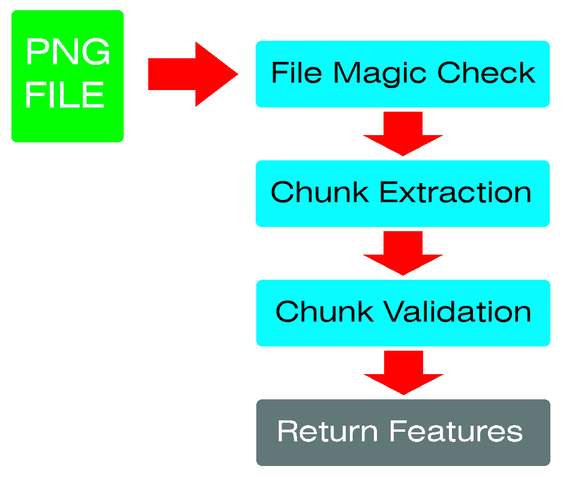
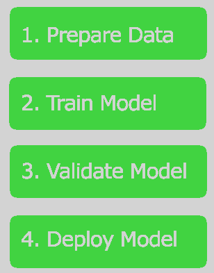
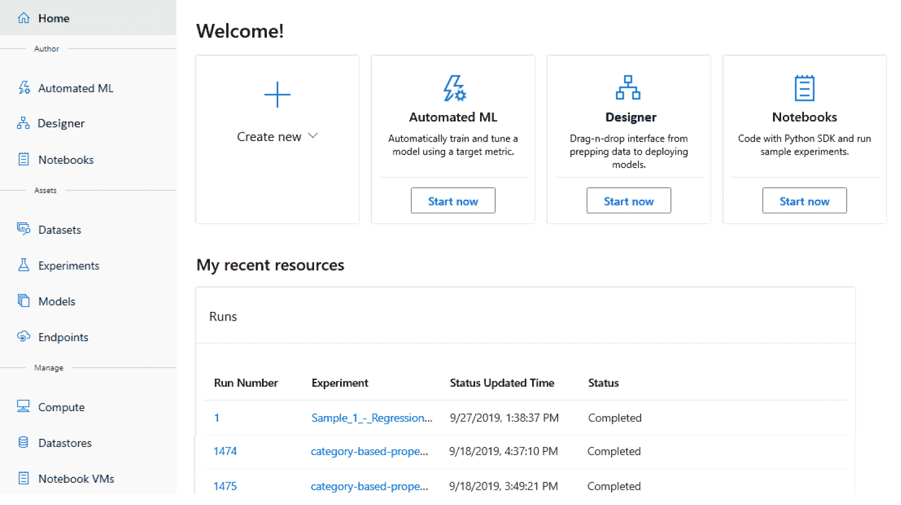
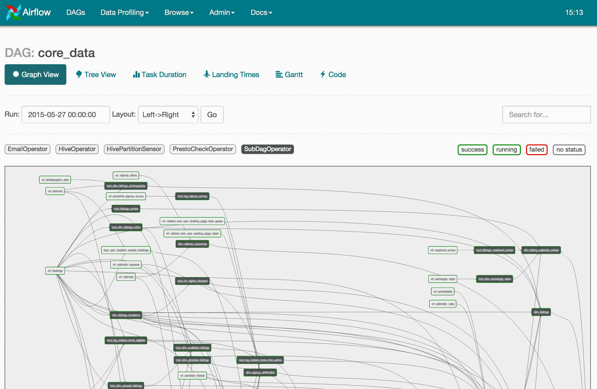
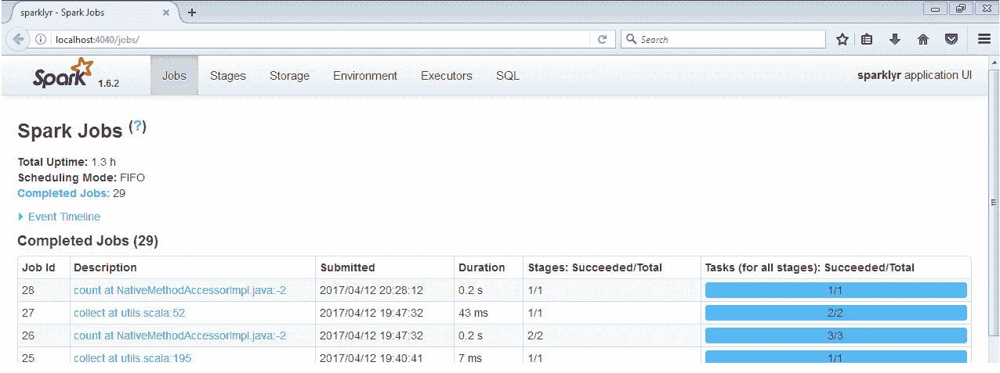

# 第十一章：训练和构建生产模型

随着我们进入本书的最后一部分，本章提供了在生产环境中使用机器学习的概述。在本书的这一部分，你已经学习了 ML.NET 提供的各种算法，并且已经创建了一套三个生产级应用。在积累了所有这些知识之后，你可能会想：我如何立即创建下一个杀手级机器学习应用？在直接回答这个问题之前，本章将帮助你为这一旅程的下一步做好准备。正如在前几章中讨论和使用的，训练模型有三个主要组成部分：特征工程、样本收集和创建训练管道。在本章中，我们将重点关注这三个组成部分，扩展你如何成功创建生产级模型的思考过程，并提供一些建议工具，以便能够通过生产级训练管道重复这一成功。

在本章中，我们将讨论以下内容：

+   调查特征工程

+   获取训练和测试数据集

+   创建你的模型构建管道

# 调查特征工程

正如我们在前几章中讨论的，特征是模型构建过程中最重要的组成部分——客观上也是最重要的组成部分。在处理一个新问题时，出现的主要问题是：你将如何解决这个问题？例如，在网络安全领域的一个常见攻击手段是使用隐写术。隐写术可以追溯到公元前 440 年，是一种在容器中隐藏数据的行为。这个容器包括绘画、填字游戏、音乐、图片等。在网络安全领域，隐写术用于在通常会被忽略的文件中隐藏恶意负载，例如图像、音频和视频文件。

查看以下食物篮子的图像。这张图像——使用在线隐写术工具创建——其中包含一个嵌入的消息；看看你是否能在以下图像中找到任何异常模式：


目前大多数工具都可以在复杂和纯色图像中隐藏内容，以至于作为最终用户的你甚至都不会注意到——正如前一个示例所示。

在这个场景继续进行的情况下，你现在可能需要回答的一个快速问题是：文件中是否包含其他文件格式？另一个需要考虑的因素是问题的范围。尝试回答上述问题可能会导致对每个使用递归解析器分析的文件格式进行耗时深入分析——这并不是一开始就要解决的问题。更好的选择是将问题范围缩小到可能只分析音频文件或图像文件。进一步思考这个思路，让我们将问题范围缩小到特定的图像类型和有效载荷类型。

# 嵌入可执行文件的 PNG 图像文件

让我们深入探讨这个更具体的问题：我们如何在**便携式网络图形**（**PNG**）文件中检测 Windows 可执行文件？对于那些好奇的人来说，选择 PNG 文件的具体原因在于，由于它们具有极高的图像质量与文件大小的比率，PNG 文件是一种非常常见的无损图像格式，被广泛应用于视频游戏和互联网。这种广泛的使用为攻击者提供了一个机会，他们可以在你的机器上获取 PNG 文件，而你作为最终用户甚至不会多想，这与专有格式或 Windows**可执行文件**（**EXE**）不同，这很可能会引起最终用户的警觉。

在下一节中，我们将把 PNG 文件分解成以下步骤：



要进一步深入了解 PNG 文件格式，PNG 的规范可以在以下链接找到：[`libpng.org/pub/png/spec/1.2/PNG-Contents.html`](http://libpng.org/pub/png/spec/1.2/PNG-Contents.html)

# 创建一个 PNG 解析器

现在，让我们深入探讨将 PNG 文件格式分解成特性，以便为检测隐藏的有效载荷驱动潜在的模型。PNG 文件由连续的 chunks 组成。每个 chunk 由一个头部描述字段和一个数据有效载荷组成。PNG 文件所需的 chunks 包括**IHDR**、**IDAT**和**IEND**。根据规范，这些部分必须按此顺序出现。以下将解释每个部分。

在 chunks 之前的第一要素是实施检查，以确保文件实际上是一个 PNG 图像文件。这个检查通常被称为**文件魔数检查**。在我们数字世界的绝大多数文件都有一个独特的签名，这使得这些文件的解析和保存变得更加容易。

对于那些对其他文件格式签名好奇的人来说，一个详尽的列表可以在以下链接找到：[`www.garykessler.net/library/file_sigs.html`](https://www.garykessler.net/library/file_sigs.html)

PNG 文件特别以以下字节开始：

```py
137, 80, 78, 71, 13, 10, 26, 10
```

通过使用这些文件魔数字节，我们可以利用.NET 的`SequenceEqual`方法来比较文件数据的第一序列字节，如下面的代码所示：

```py
using var ms = new MemoryStream(data);

byte[] fileMagic = new byte[FileMagicBytes.Length];

ms.Read(fileMagic, 0, fileMagic.Length);

if (!fileMagic.SequenceEqual(FileMagicBytes))
{
     return (string.Empty, false, null);
}
```

如果`SequenceEqual`方法与`FileMagicBytes`属性比较不匹配，我们返回 false。在这种情况下，该文件不是 PNG 文件，因此我们想要停止进一步解析文件。

从这个点开始，我们现在将遍历文件的块。在任何时候，如果字节没有正确设置，应该注意这一点，因为 Microsoft Paint 或 Adobe PhotoShop 会按照 PNG 文件格式的规范保存文件。另一方面，恶意生成者可能会像这里展示的那样，扭曲遵守 PNG 文件格式规范的规则：

```py
while (ms.Position != data.Length)
{
    byte[] chunkInfo = new byte[ChunkInfoSize];

    ms.Read(chunkInfo, 0, chunkInfo.Length);

    var chunkSize = chunkInfo.ToInt32();

    byte[] chunkIdBytes = new byte[ChunkIdSize];

    ms.Read(chunkIdBytes, 0, ChunkIdSize);

    var chunkId = Encoding.UTF8.GetString(chunkIdBytes);

    byte[] chunk = new byte[chunkSize];

    ms.Read(chunk, 0, chunkSize);

    switch (chunkId)
    {
        case nameof(IHDR):
            var header = new IHDR(chunk);

            // Payload exceeds length
            if (data.Length <= (header.Width * header.Height * MaxByteDepth) + ms.Position)
            {
                break;
            }

            return (FileType, false, new[] { "SUSPICIOUS: Payload is larger than what the size should be" });
        case nameof(IDAT):
            // Build Embedded file from the chunks
            break;
        case nameof(IEND):
            // Note that the PNG had an end
            break;
    }
}
```

对于每个块，我们读取`ChunkInfoSize`变量，它定义为 4 字节。一旦读取了这个`ChunkInfoSize`数组，它就包含了要读取的块的大小。除了确定我们要读取的块类型外，我们还读取了 4 字节的块，用于 4 个字符的字符串（`IHDR`、`IDAT`、`IEND`）。

一旦我们有了块大小和类型，我们就构建每个类的对象表示。在这个代码示例的范围内，我们将只查看 IHDR 类的片段，它包含高级图像属性，如尺寸、位深度和压缩：

```py
public class IHDR
{
    public Int32 Width;

    public Int32 Height;

    public byte BitDepth;

    public byte ColorType;

    public byte Compression;

    public byte FilterMethod;

    public byte Interlace;

    public IHDR(byte[] data)
    {
        Width = data.ToInt32();

        Height = data.ToInt32(4);
    }
}
```

我们只提取`Width`和`Height`属性，它们是前 8 个字节（每个 4 字节）。在这个例子中，我们还使用了一个扩展方法将字节数组转换为**`Int32`**数组。在大多数情况下，`BitConverter`会是理想的选择，然而，在这个代码示例中，我想简化数据的顺序访问，例如在检索前面提到的`Height`属性时偏移 4 字节。

之前提到的 IDAT 块是实际图像数据——以及可能包含嵌入有效载荷的块。IEND，正如其名所示，只是告诉 PNG 解析器文件已完整，也就是说，IEND 块中没有有效载荷。

一旦文件被解析，我们返回文件类型（**PNG**）——无论它是否是一个有效结构的 PNG 文件——并且我们注意任何可疑之处，例如如果文件大小远远大于根据宽度、高度和最大位深度（24）应有的大小。对于这些注释中的每一个，它们都可以在生产模型中与有效/无效标志一起标准化。此外，这些可以用简单的枚举表示数字。

对于那些对完整应用程序的源代码感到好奇的人，请参阅[`github.com/jcapellman/virus-tortoise`](https://github.com/jcapellman/virus-tortoise)，它利用了在第九章“使用 ML.NET 与 ASP.NET Core”部分中展示的*创建文件分类应用程序*中展示的许多相同原则。

将这个例子进一步扩展，迭代包含实际图像数据——以及可能的可执行有效载荷的 IDAT 块，将完成生产应用程序中的提取器。

现在我们已经看到了构建生产级功能所需的工作量，让我们深入探讨构建生产级训练数据集。

# 获取训练和测试数据集

现在我们已经完成了关于特征工程讨论，下一步是获取一个数据集。对于某些问题，这可能非常困难。例如，当试图预测别人没有做过的事情，或者在一个新兴领域时，拥有一个用于训练的训练集会比我们之前的例子中寻找恶意文件更困难。

另一个需要考虑的方面是多样性和数据是如何划分的。例如，考虑您如何使用 ML.NET 提供的异常检测训练器根据行为分析预测恶意 Android 应用程序。当思考构建您的数据集时，我敢说，大多数 Android 用户，他们的应用程序中恶意软件的比例不会超过一半。因此，训练和测试集的恶意和良性（50/50）划分可能会过度拟合恶意应用程序。弄清楚和分析您的目标用户将遇到的实际代表性是至关重要的，否则您的模型可能会倾向于假阳性或假阴性，这两种情况您的最终用户都不会满意。

在训练和测试数据集时需要考虑的最后一个元素是如何获取您的数据集。由于您的模型主要基于训练和测试数据集，因此找到代表您问题集的真实数据集至关重要。以之前的隐写术为例，如果您没有验证就随机抽取 PNG 文件，那么训练一个基于不良数据的模型是有可能的。对此的一种缓解措施是检查 IDAT 块中的隐藏有效载荷。同样，在 PNG 示例中对实际文件进行验证也是至关重要的。当您只针对生产应用中的 PNG 文件运行时，在 PNG 文件中混合训练 JPG、BMP 或 GIF 文件可能会导致假阳性或假阴性，因为其他图像格式的二进制结构不同于 PNG，这种非代表性数据将使训练集偏向于不受支持的格式。

对于网络安全领域的人来说，VirusTotal ([`www.virustotal.com`](https://www.virustotal.com)) 和 Reversing Labs ([`www.reversinglabs.com`](https://www.reversinglabs.com)) 提供了广泛的文件数据库，您可以付费下载，如果难以获取各种文件类型的数据源。

# 创建您的模型构建管道

一旦创建了特征提取器并获取了数据集，接下来要建立的是模型构建管道。模型构建管道的定义可以在以下图中更好地展示：



在下一节中，我们将讨论每个步骤如何与您选择的管道相关联。

# 讨论在管道平台中需要考虑的属性

有很多管道工具可用于本地部署，无论是在云中还是在**SaaS**（**软件即服务**）服务中。我们将审查行业中一些更常用的平台。然而，以下是一些无论你选择哪个平台都需要记住的要点：

+   **速度**对于多个原因来说都很重要。在构建你的初始模型时，迭代的速度非常重要，因为你很可能会调整你的训练集和超参数，以测试各种组合。在流程的另一端，当你处于预生产或生产阶段时，与测试人员或客户（他们正在等待新模型以解决问题或添加功能）迭代的速度在大多数情况下是关键的。

+   **可重复性**同样重要，以确保在给定相同的训练数据集、特征和超参数的情况下，每次都能重建一个完美的模型。尽可能多地利用自动化是避免模型训练中人为错误的一个方法，同时也有助于提高可重复性。下一节将要审查的所有平台都提倡在启动新的训练会话后，无需任何人工输入即可定义流程。

+   **版本控制和比较跟踪**对于确保在做出更改时能够进行比较非常重要。例如，无论是超参数——比如 FastTree 模型中树的深度——还是你添加的额外样本，在迭代过程中跟踪这些变化至关重要。假设你进行了一次文档化的更改，而你的效果显著下降，你总是可以回过头来评估这一变化。如果你没有为比较版本化或记录你的个人更改，这种简单的更改可能很难确定效果下降的原因。跟踪的另一个要素是跟踪一段时间内的进度，比如按季度或按年。这种级别的跟踪可以帮助描绘一幅图景，也可以帮助推动下一步行动或跟踪效果的趋势，以便获取更多样本或添加更多特征。

+   最后，**质量保证**对于多个原因来说都很重要，在几乎所有情况下，对项目的成功或失败都至关重要。想象一下，一个模型直接部署到生产环境中，没有任何由专门的质量保证团队进行的额外检查，包括手动和自动测试。自动测试——就像一组单元测试，确保在发布和进入生产之前，样本在模型之间测试相同或更好——可以是一个好的临时解决方案，而不是一个完整的自动测试套件，该套件具有特定的效果范围，需要保持在其中。

在执行上一节中讨论的模型构建管道的每个步骤时，应考虑这四个要素。交付的最后一步取决于前三个要素的正确完成。实际的交付取决于您的应用程序。例如，如果您正在创建一个 ASP.NET 应用程序，例如我们在第九章中创建的应用程序，*使用 ML.NET 与 ASP.NET Core*，将 ML.NET 模型作为 Jenkins 管道的一部分添加——这样它就会自动与您的部署捆绑在一起——将是一个好的方法。

# 探索机器学习平台

以下是我个人使用过，以及/或者同事使用过以解决各种问题的平台。每个平台都有其优缺点，尤其是在我们试图解决的每个问题的独特性方面。

# Azure Machine Learning

微软的 Azure 云平台提供了一个完整的平台，包括 Kubernetes、虚拟机和数据库，以及提供机器学习平台。该平台提供了直接连接到 Azure SQL 数据库、Azure 文件存储和公共 URL 等，仅举几个例子，用于训练和测试集。在 Visual Studio Community 2019 中提供了一个免费的不具备扩展性的轻量级版本。以下截图显示了完整的用户界面：



此外，还完全支持非.NET 技术，如 TensorFlow、PyTorch 和 scikit-learn。流行的 Jupyter Notebook 和 Azure Notebook 等工具也完全支持。

与 Apache Airflow 类似，在 Azure 机器学习中比较运行历史记录以比较版本也很容易做到。

所有上述模型构建管道的阶段都得到了支持。以下是 Azure 机器学习的优缺点：

**优点：**

+   与多个数据源广泛集成

+   ML.NET 原生支持

+   根据您的需求进行扩展和缩减

+   无需基础设施设置

**缺点：**

+   训练时可能很昂贵

# Apache Airflow

Apache Airflow，一款开源软件，提供了创建几乎无限复杂性的管道的能力。虽然不是原生支持的框架，但.NET Core 应用程序——例如本书中创建的那些——可以在安装.NET Core 运行时或简单地使用自包含标志编译的情况下运行。虽然学习曲线高于微软的 Azure 机器学习平台，但在某些场景下免费，尤其是在仅仅进行实验时，可能更有益。以下截图显示了 Airflow 的用户界面：



与 Azure 机器学习类似，管道的可视化确实使得特定管道的配置比 Apache Spark 更容易。然而，与 Apache Spark 类似，设置和配置（取决于你的技能水平）可能相当令人望而却步，尤其是在 pip 安装之后。一个更容易上手的方法是使用预构建的 Docker 容器，例如 Puckel 的 Docker 容器（[`hub.docker.com/r/puckel/docker-airflow`](https://hub.docker.com/r/puckel/docker-airflow)）。

下面是 Apache Airflow 的一些优缺点：

**优点：**

+   免费且开源

+   提供了 4 年以上的文档和示例

+   在 Windows、Linux 和 macOS 上运行

**缺点：**

+   设置复杂（尤其是使用官方 pip 说明）

+   .NET 不是原生支持的

# Apache Spark

Apache Spark，作为另一个开源工具，虽然通常用于大数据管道，但也可以配置用于特征提取、训练和大规模模型的生成。例如，当内存和 CPU 限制阻碍你构建模型时，比如使用大规模数据集进行训练，我亲眼看到 Apache Spark 可以扩展到利用多个 64C/128T AMD 服务器，并最大化超过 1TB 的 RAM。我发现这个平台比 Apache Airflow 或 Azure 的机器学习平台设置起来更困难，但一旦设置好，它就可以非常强大。以下截图显示了 Apache Spark 的用户界面：



可以在微软的 Apache Spark 页面（[`dotnet.microsoft.com/learn/data/spark-tutorial/intro`](https://dotnet.microsoft.com/learn/data/spark-tutorial/intro)）上找到优秀的分步安装指南，适用于 Windows 和 Linux。这个指南确实消除了许多未知因素，然而，与 Azure 或 Airflow 相比，它仍然远非容易上手。以下是 Apache Spark 的一些优缺点：

**优点：**

+   免费且开源

+   来自微软的.NET 绑定

+   由于其悠久的历史（超过 5 年），有大量的文档

+   在 Windows、macOS 和 Linux 上运行

**缺点：**

+   配置和启动可能比较困难

+   对 IT 基础设施变化敏感

微软为 Apache Spark 编写了.NET 绑定，并将其免费发布：[`dotnet.microsoft.com/apps/data/spark`](https://dotnet.microsoft.com/apps/data/spark)。这些绑定适用于 Windows、macOS 和 Linux。

# 摘要

在本章的整个过程中，我们深入探讨了从原始目的问题到训练模型的生产就绪模型训练所涉及的内容。通过这次深入探讨，我们检查了创建详细特征所需的工作量，这些特征是通过生产思维过程和特征工程实现的。然后，我们回顾了挑战、解决训练的方法以及如何测试数据集问题。最后，我们还深入探讨了实际模型构建管道的重要性，使用完全自动化的流程。

在下一章中，我们将在一个 WPF 应用程序中使用预构建的 TensorFlow 模型来确定提交的图像是否包含某些对象。这次深入探讨将介绍 ML.NET 如何为 TensorFlow 模型提供一个易于使用的接口。
