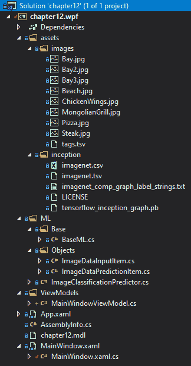
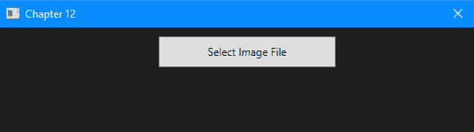
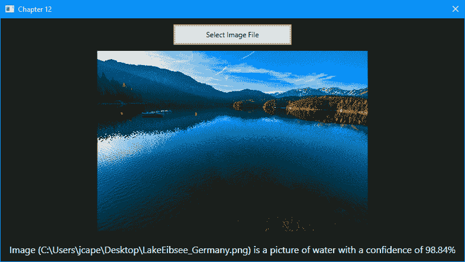

# 第十二章：使用 TensorFlow 与 ML.NET

在本章中，我们将使用预训练的 TensorFlow 模型，特别是 Inception 模型，并将其集成到**Windows Presentation Foundation**（WPF）应用程序中。我们将使用预训练的模型并应用迁移学习，通过添加一些食物和水的图片。在迁移学习完成后，我们允许用户选择他们自己的图片。到本章结束时，你应该对将 TensorFlow 模型集成到你的 ML.NET 应用程序中所需的内容有一个牢固的掌握。

本章将涵盖以下主题：

+   拆解谷歌的 Inception 模型

+   创建图像分类桌面应用程序

+   探索额外的生产应用程序增强功能

# 拆解谷歌的 Inception 模型

谷歌的 Inception 模型([`github.com/google/inception`](https://github.com/google/inception))已经在数百万张图像上进行了训练，以帮助解决我们社会中日益增长的问题之一——我的图像中有什么？想要回答这个问题的应用程序类型范围很广，从匹配人脸、自动检测武器或不希望的对象、游戏图片中的运动品牌（如运动鞋品牌），到为用户提供无需手动标签即可搜索的支持的图像归档器，仅举几例。

这类问题通常用**物体识别**来回答。你可能已经熟悉的一种物体识别应用是**光学字符识别**（OCR）。OCR 是指字符图像可以被解释为文本，例如在微软的 OneNote 手写笔迹到文本功能中，或在读取车牌的收费站中。我们将特别关注的物体识别的特定应用称为**图像分类**。

Inception 模型通过使用深度学习来分类图像来帮助解决这个问题。该模型在数百万张图像上以监督方法进行了训练，输出是一个神经网络。这种方法的优点是，预构建的模型可以通过添加较小子集的图像来增强，这就是我们在本章下一节将要做的。这种添加额外数据和标签的方法称为**迁移学习**。当创建特定于客户模型的时，这种方法也可能很有帮助。

想象一下就像在 GitHub 的 master 分支中创建一个分支；你可能只想添加一个类或修改一个元素，而不必重新创建整个代码库。至于模型，以汽车图像分类器为例。假设你获得了数百万张涵盖美国和外国汽车、卡车、面包车等图片。一位新客户来找你，要求你创建一个模型来帮助监控进入政府设施的车辆。之前的模型不应该被丢弃，也不需要完全重新训练，只需添加更多带有标签的商业（或可能是军事）车辆即可。

对于更深入地了解 Google 的图像分类，一个很好的资源是他们的开发者文档，可以在[`developers.google.com/machine-learning/practica/image-classification/`](https://developers.google.com/machine-learning/practica/image-classification/)找到。

# 创建 WPF 图像分类应用程序

如前所述，我们将要创建的应用程序是一个图像分类应用程序，具体允许用户选择一张图片并确定它是食物还是水。这是通过上述和包含的预训练 TensorFlow Inception 模型实现的。当应用程序第一次运行时，ML.NET 版本的模型使用图片和`tags.tsv`文件（将在下一节中讨论）进行训练。

与前几章一样，完成的项目代码、样本数据集和项目文件可以在此处下载：[`github.com/PacktPublishing/Hands-On-Machine-Learning-With-ML.NET/tree/master/chapter12`](https://github.com/PacktPublishing/Hands-On-Machine-Learning-With-ML.NET/tree/master/chapter12)[.](https://github.com/PacktPublishing/Hands-On-Machine-Learning-With-ML.NET/tree/master/chapter10)

# 探索项目架构

在本章中，我们将深入探讨一个 WPF 桌面应用程序。正如本章第一部分所提到的，我们将使用 WPF 框架来创建我们的应用程序。你可能会问，为什么不使用 UWP 应用程序，比如我们在第十章中创建的浏览器应用程序？至少在撰写本文时，原因在于 TensorFlow 在 UWP 应用程序中，特别是对于图像分类，并不完全受支持。也许在 ML.NET 的未来版本中，这将被添加。对于其他非图像类应用程序，你可能在 UWP 应用程序中使用 TensorFlow。

那些之前进行过 WPF 开发并且仔细观察的人会注意到，该项目使用了.NET Core 3.1。在.NET Core 3.0 中，Microsoft 添加了对 WPF 和 WinForms 的支持，因此，你不再仅限于 Windows 的.NET Framework 进行 GUI 开发。相反，这种支持是通过`Microsoft.WindowsDesktop.App.WPF` NuGet 包添加的。

在这个例子中，我们将使用`Microsoft.ML` (1.3.1) NuGet 包——以及几个额外的 NuGet 包——以便在我们的.NET 应用程序中利用 TensorFlow。以下包括以下内容：

+   `Microsoft.ML.ImageAnalytics` (1.3.1)

+   `Microsoft.ML.TensorFlow` (1.3.1)

+   `SciSharp.TensorFlow.Redist` (1.14.0)

到你阅读这个的时候，可能已经有这些包的新版本，它们应该可以工作，然而，上面提到的版本是我们将在这次深入研究中使用，以及 GitHub 仓库中可用的版本。

在以下屏幕截图中，您将找到解决方案的 Visual Studio Solution Explorer 视图。由于 TensorFlow 对项目类型和 CPU 目标的要求更为严格，我们回到了一个单一的项目，而不是在前面几章中使用过的三个项目架构：



`tags.tsv`文件（位于代码仓库中的`assets\images`文件夹中）包含八行，这些行将包含的图像映射到预分类：

```py
ChickenWings.jpg food
Steak.jpg food
Pizza.jpg food
MongolianGrill.jpg food
Bay.jpg water
Bay2.jpg water
Bay3.jpg water
Beach.jpg water
```

如果你想尝试自己的分类，请删除包含的图像，复制你的图像，并更新`tags.tsv`文件以包含标签。我应该注意的是，所有包含的图像都是我在各种加州度假时拍摄的——请随意使用。

`assets/inception`文件夹中的文件包含所有 Google 预训练文件（以及许可文件）。

# 深入 WPF 图像分类应用程序

如在开头部分所述，我们的桌面应用程序是一个 WPF 应用程序。在本例的范围内，如第十章中所述，使用 ML.NET 与 UWP，我们通过遵循**模型-视图-视图模型**（**MVVM**）设计模式来使用标准方法处理应用程序架构。

在本节中我们将深入研究的文件如下：

+   `MainWindowViewModel`

+   `MainWindow.xaml`

+   `MainWindow.xaml.cs`

+   `BaseML`

+   `ImageDataInputItem`

+   `ImageDataPredictionItem`

+   `ImageClassificationPredictor`

WPF 项目中的其余文件都未从默认的 Visual Studio .NET Core 3.1 WPF 应用程序模板中进行修改；例如，`App.xaml`和`AssemblyInfo.cs`文件。

# `MainWindowViewModel`类

`MainWindowViewModel`类的目的是包含我们的业务逻辑并控制视图，如下所示：

1.  我们首先实例化之前讨论过的`ImageClassificationPredictor`类，以便它可以用于运行预测：

```py
private readonly ImageClassificationPredictor _prediction = new ImageClassificationPredictor();
```

1.  下一个代码块处理了 MVVM 对分类字符串的强大功能，并存储选定的图像。对于这些属性中的每一个，当值发生变化时，我们调用`OnPropertyChanged`，这触发了视图与这些属性绑定的任何字段的绑定刷新：

```py
private string _imageClassification;

public string ImageClassification
{
    get => _imageClassification;

    set
    {
        _imageClassification = value;
        OnPropertyChanged();
    }
}

private ImageSource _imageSource;

public ImageSource SelectedImageSource
{
    get => _imageSource;

    set
    {
        _imageSource = value;
        OnPropertyChanged();
    }
}
```

1.  接下来，我们定义 `Initialize` 方法，它调用预测器的 `Initialize` 方法。该方法将返回一个元组，表示模型无法加载或找不到，以及异常（如果抛出）：

```py
public (bool Success, string Exception) Initialize() => _prediction.Initialize();
```

1.  然后，我们处理用户点击选择图片按钮时会发生什么。该方法打开一个对话框，提示用户选择一个图片。如果用户取消对话框，则方法返回。否则，我们调用两个辅助方法将图片加载到内存中并对图片进行分类：

```py
public void SelectFile()
{
    var ofd = new OpenFileDialog
    {
        Filter = "Image Files(*.BMP;*.JPG;*.PNG)|*.BMP;*.JPG;*.PNG"
    };

    var result = ofd.ShowDialog();

    if (!result.HasValue || !result.Value)
    {
        return;
    }

    LoadImageBytes(ofd.FileName);

    Classify(ofd.FileName);
}
```

1.  `LoadImageBytes` 方法接受文件名并将图片加载到我们的基于 MVVM 的 `ImageSource` 属性中，因此选择后，图片控件会自动更新为所选图片的视图：

```py
private void LoadImageBytes(string fileName)
{
    var image = new BitmapImage();

    var imageData = File.ReadAllBytes(fileName);

    using (var mem = new MemoryStream(imageData))
    {
        mem.Position = 0;

        image.BeginInit();

        image.CreateOptions = BitmapCreateOptions.PreservePixelFormat;
        image.CacheOption = BitmapCacheOption.OnLoad;
        image.UriSource = null;
        image.StreamSource = mem;

        image.EndInit();
    }

    image.Freeze();

    SelectedImageSource = image;
}
```

1.  最后，`Classify` 方法接受路径并将其传递给 `Predictor` 类。在返回预测后，分类和置信度将集成到我们的 MVVM `ImageClassification` 属性中，因此 UI 会自动更新：

```py
public void Classify(string imagePath)
{
 var result = _prediction.Predict(imagePath);

 ImageClassification = $"Image ({imagePath}) is a picture of {result.PredictedLabelValue} with a confidence of {result.Score.Max().ToString("P2")}";
}
```

`MainWindowViewModel` 类的最后一个元素是我们之前在第十章 *使用 ML.NET 与 UWP* 中定义的相同的 `OnPropertyChanged` 方法，它允许 MVVM 魔法发生。定义了我们的 `ViewModel` 类后，让我们继续到 `MainWindow` XAML 文件。

# `MainWindow.xaml` 类

如在第十章 *分解 UWP 架构* 部分的 *使用 ML.NET 与 UWP* 节中所述，当描述开发时，XAML 标记用于定义用户界面。对于本应用程序的范围，我们的 UI 相对简单：`Button`、`Image Control` 和 `TextBlock`。

现在我们来看看代码：

1.  我们首先定义的是我们的网格。在 XAML 中，网格是一个类似于网络开发中的 `<div>` 的容器。然后我们定义我们的行。与 Bootstrap 类似（但在我看来更容易理解），是预先定义每行的高度。将行设置为 `Auto` 将自动调整高度以适应内容的高度，而星号则表示根据主容器的高度使用所有剩余的高度：

```py
<Grid.RowDefinitions>
    <RowDefinition Height="Auto" />
    <RowDefinition Height="*" />
    <RowDefinition Height="Auto" />
</Grid.RowDefinitions>
```

1.  我们首先定义我们的 `Button` 对象，它将在我们的 `ViewModel` 类中触发上述的 `SelectFile` 方法：

```py
<Button Grid.Row="0" Margin="0,10,0,0" Width="200" Height="35" Content="Select Image File" HorizontalAlignment="Center" Click="btnSelectFile_Click" />
```

1.  我们接着定义我们的 `Image` 控件，它绑定到我们之前审查过的 `SelectedImageSource` 属性，该属性位于我们的 `ViewModel` 类中：

```py
<Image Grid.Row="1" Margin="10,10,10,10" Source="{Binding SelectedImageSource}" />
```

1.  我们接着添加将显示我们分类的 `TextBlock` 控件：

```py
<TextBlock Grid.Row="2" Text="{Binding ImageClassification, Mode=OneWay}" TextWrapping="Wrap" Foreground="White" Margin="10,10,10,10" HorizontalAlignment="Center" FontSize="16" />
```

在定义了视图的 XAML 方面之后，现在让我们深入了解 `MainWindow` 类的代码部分。

# `MainWindow.xaml.cs` 文件

`MainWindow.xaml.cs` 文件包含 XAML 视图的代码，相关内容在此讨论：

1.  我们首先定义的是围绕 `DataContext` 属性的包装属性，该属性是基 `Window` 类中内置的：

```py
private MainWindowViewModel ViewModel => (MainWindowViewModel) DataContext;
```

1.  接下来，我们定义`MainWindow`的构造函数，以便将`DataContext`属性初始化为我们的`MainWindowViewModel`对象。如果初始化失败，我们不希望应用程序继续运行。此外，我们需要使用`MessageBox`对象让用户知道为什么它失败了：

```py
public MainWindow()
{
    InitializeComponent();

    DataContext = new MainWindowViewModel();

    var (success, exception) = ViewModel.Initialize();

    if (success)
    {
        return;
    }

    MessageBox.Show($"Failed to initialize model - {exception}");

    Application.Current.Shutdown();
}
```

1.  最后，我们调用 ViewModel 的`SelectFile`方法来处理图像选择和分类：

```py
private void btnSelectFile_Click(object sender, RoutedEventArgs e) => ViewModel.SelectFile();
```

在我们完成了`MainWindow`类的代码之后，这就完成了 WPF 组件。现在让我们专注于示例中的机器学习部分。

# 基础 ML 类

`BaseML`类，在大多数之前的示例中都被使用，暴露了我们的 ML.NET 类的基础类。在这个示例中，由于使用了预训练模型，我们实际上简化了类。现在这个类只是初始化了`MLContext`属性：

```py
public class BaseML
{
    protected MLContext MlContext;

    public BaseML()
    {
        MlContext = new MLContext(2020);
    }
}
```

在审查了简化的`BaseML`类之后，让我们深入到`ImageDataInputItem`类。

# 图像数据输入项类

`ImageDataInputItem`类包含了传递给模型的类；基本属性是`ImagePath`属性：

```py
public class ImageDataInputItem
{
    [LoadColumn(0)]
    public string ImagePath;

    [LoadColumn(1)]
    public string Label;
}
```

尽管比我们的大多数输入类小，Inception 模型只需要两个属性。现在，让我们深入到被称为`ImageDataPredictionItem`的输出类。

# 图像数据预测项类

`ImageDataPredictionItem`类包含了预测响应，包括预测值字符串的置信度（在包含的图像中包含`Water`或`Food`）：

```py
public class ImageDataPredictionItem : ImageDataInputItem
{
    public float[] Score;

    public string PredictedLabelValue;
}
```

与输入类类似，输出类也只有两个属性，类似于之前的示例。在处理完输入和输出类之后，让我们深入到使用这些类进行迁移学习和预测的`ImageClassificationPredictor`类。

# 图像分类预测器类

`ImageClassificationPredictor`类包含了加载和针对 Inception TensorFlow 模型进行预测所需的所有代码：

1.  首先，我们需要定义几个辅助变量来访问图像和`.tsv`文件：

```py
// Training Variables
private static readonly string _assetsPath = Path.Combine(Environment.CurrentDirectory, "assets");
private static readonly string _imagesFolder = Path.Combine(_assetsPath, "images");
private readonly string _trainTagsTsv = Path.Combine(_imagesFolder, "tags.tsv");
private readonly string _inceptionTensorFlowModel = Path.Combine(_assetsPath, "inception", "tensorflow_inception_graph.pb");

private const string TF_SOFTMAX = "softmax2_pre_activation";
private const string INPUT = "input";

private static readonly string ML_NET_MODEL = Path.Combine(Environment.CurrentDirectory, "chapter12.mdl");
```

1.  接下来，我们定义预训练的 Inception 模型所需的设置：

```py
private struct InceptionSettings
{
    public const int ImageHeight = 224;
    public const int ImageWidth = 224;
    public const float Mean = 117;
    public const float Scale = 1;
    public const bool ChannelsLast = true;
}
```

1.  接下来，我们创建我们的`Predict`方法，并重载它，它简单地接受图像文件路径。像之前的示例一样，我们通过调用我们的`MLContext`对象创建`PredictionEngine`，传入我们的输入类（`ImageDataInputItem`）和输出类（`ImageDataPredictionItem`），然后调用`Predict`方法来获取我们的模型预测：

```py
public ImageDataPredictionItem Predict(string filePath) => 
    Predict(new ImageDataInputItem 
        {
            ImagePath = filePath 
        }
    );

public ImageDataPredictionItem Predict(ImageDataInputItem image)
{
    var predictor = MlContext.Model.CreatePredictionEngine<ImageDataInputItem, ImageDataPredictionItem>(_model);

    return predictor.Predict(image);
}
```

最后，我们使用自己的样本初始化并扩展我们的预训练模型：

```py
public (bool Success, string Exception) Initialize()
{
    try
    {
        if (File.Exists(ML_NET_MODEL))
        {
            _model = MlContext.Model.Load(ML_NET_MODEL, out DataViewSchema modelSchema);

            return (true, string.Empty);
        }

       ...
    }
    catch (Exception ex)
    {
        return (false, ex.ToString());
    }
} 
```

对于完整代码，请参阅以下 GitHub 仓库链接：[`github.com/PacktPublishing/Hands-On-Machine-Learning-With-ML.NET/blob/master/chapter12/chapter12.wpf/ML/ImageClassificationPredictor.cs`](https://github.com/PacktPublishing/Hands-On-Machine-Learning-With-ML.NET/blob/master/chapter12/chapter12.wpf/ML/ImageClassificationPredictor.cs)。完成 `Initialize` 方法后，代码深入探讨就结束了。现在让我们运行应用程序！

# 运行图像分类应用程序

由于我们使用的是预训练模型，因此可以直接从 Visual Studio 运行应用程序。运行应用程序后，您将看到一个几乎为空窗口：



点击“选择图像文件”按钮并选择一个图像文件将触发模型运行。在我的情况下，我选择了一张最近去德国度假的照片，置信度得分为 98.84%：



随意尝试您机器上的各种文件以查看置信度得分和分类——如果您开始注意到问题，请按照前面章节所述，向图像文件夹和 `tags.tsv` 文件中添加更多样本。在做出这些更改之前，请务必删除 `chapter12.mdl` 文件。

# 改进建议的额外想法

现在我们已经完成了深入探讨，还有一些额外的元素可能会进一步增强应用程序。这里讨论了一些想法。

# 基于最终用户输入的自训练

如本章开头所述，其中一个优点是能够在动态应用中利用迁移学习。与本书中已审查的先前示例应用不同，此应用实际上允许最终用户选择一系列（或文件夹）图像，并且只需进行少量代码更改，就可以构建新的 `.tsv` 文件并训练新的模型。对于 Web 应用或商业产品，这将提供很高的价值，同时也会减轻您获取各种类型图像的负担——这是一个令人畏惧的、很可能徒劳的目标。

# 日志记录

如第十章中提到的使用 ML.NET 与 UWP 的*日志记录*部分所述，桌面应用程序有其优点和缺点。最大的缺点是需要日志记录，因为您的桌面应用程序可以安装在从 Windows 7 到 Windows 10 的任何配置上，几乎有无限多的排列组合。如前所述，强烈建议使用 NLog ([`nlog-project.org/`](https://nlog-project.org/))或类似的开源项目进行日志记录，并结合远程日志解决方案，如 Loggly，以便从用户的机器上获取错误数据。鉴于 GDPR 和最近的 CCPA，我们需要确保离开最终用户机器的数据得到传达，并且这些日志不包含个人数据（或通过日志记录机制上传到远程服务器的实际图像）。

# 使用数据库

与第十章中性能优化建议使用 ML.NET 与 UWP 类似，如果用户多次选择相同的图像，尤其是在这个应用程序被用于自助终端或转换为 Web 应用程序的情况下，存储分类的性能优势可能相当显著。实现这一点的快速简单方法可能是对图像执行 SHA256 哈希，并检查该哈希值与数据库。根据用户数量以及他们是否将并发，我建议两种选择之一：

+   如果用户逐个使用，并且应用程序将保持为 WPF 应用程序，那么推荐使用之前提到的轻量级数据库——LiteDB ([`www.litedb.org/`](http://www.litedb.org/))。

+   如果您正在使用生产环境启动大型 Web 应用程序，那么为了确保数据库查找不会比重新执行模型预测慢，建议使用 MongoDB 或水平可扩展的数据库，如微软的 CosmosDB。

# 摘要

在本章的整个过程中，我们深入探讨了如何使用预训练的 TensorFlow 模型创建一个 WPF 应用程序。我们还回顾并仔细研究了谷歌的图像分类 Inception 模型。此外，我们学习了如何将这个模型集成到应用程序中，以便对用户选择的图像进行图像分类。最后，我们还讨论了一些进一步改进示例应用程序的方法。

在下一章和最后一章中，我们将专注于在 WPF 应用程序中使用预训练的 ONNX 模型进行目标检测。
