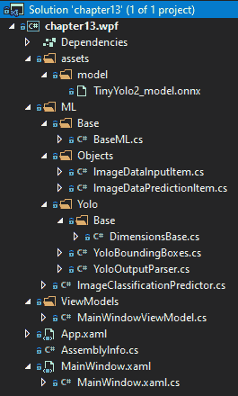
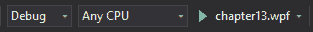
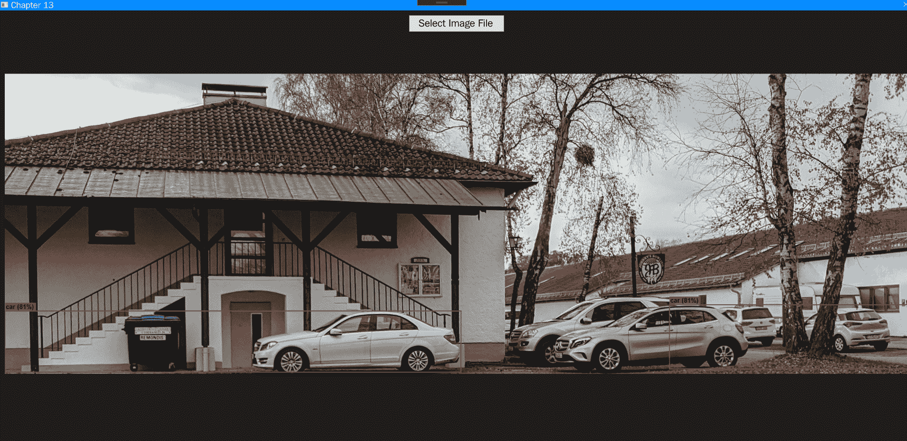

# 第十三章：使用 ML.NET 与 ONNX

现在我们已经完成了使用 TensorFlow 和 ML.NET 的深入探索，现在是时候深入使用 **Open Neural Network eXchange**（**ONNX**）与 ML.NET 的结合了。具体来说，在本章的最后一部分，我们将回顾 ONNX 是什么，以及创建一个名为 **YOLO** 的预训练 ONNX 模型的新示例应用程序。这个应用程序将基于上一章的内容，并显示模型检测到的对象的边界框。此外，我们将在本章结束时提出改进示例的建议，使其成为生产级应用程序或集成到生产应用程序中。

在本章中，我们将涵盖以下主题：

+   解构 ONNX 和 YOLO

+   创建 ONNX 物体检测应用程序

+   探索额外的生产应用增强功能

# 解构 ONNX 和 YOLO

如 第一章 中所述，*使用 ML.NET 开始机器学习之旅*，ONNX 标准在业界被广泛认为是一个真正通用的格式，适用于各种机器学习框架。在接下来的两节中，我们将回顾 ONNX 提供的内容，以及将在本章示例中驱动的 YOLO 模型。

# 介绍 ONNX

**ONNX** 的创建是为了在处理预训练模型或跨框架训练模型时提供一个更开放和自由流动的过程。通过为框架提供一个开放的导出格式，ONNX 允许互操作性，从而促进了由于几乎每个框架中使用的专有格式的性质而可能难以进行的实验。

目前，支持的平台包括 TensorFlow、XGBoost 和 PyTorch——当然，还包括 ML.NET。

如果你想进一步深入了解 ONNX，请访问他们的网站：[`onnx.ai/index.h`](https://onnx.ai/index.html)[tml](https://onnx.ai/index.html)。

# YOLO ONNX 模型

基于 第十二章 中进行的操作，*使用 ML.NET 的 TensorFlow*，其中我们使用了预训练的 Inception 模型，在本章中，我们将使用预训练的 YOLO 模型。这个模型提供了非常快速和准确的对象检测，这意味着它可以在图像中找到多个对象，并具有一定的置信度。这与上一章提供的纯图像分类模型不同，例如水或食物。

为了帮助可视化两种模型之间的差异，可以将上一章的 TensorFlow 模型（用于分类水）与本章的汽车对象检测进行比较，如下面的截图所示：


由于互联网上图像数量的显著增加以及安全需求，图像（和视频）中的目标检测需求不断增加。想象一下拥挤的环境，比如足球场，尤其是前门附近。保安巡逻并监控这个区域；然而，就像你一样，他们也是凡人，只能以一定程度的准确性瞥见那么多人。将机器学习中的目标检测实时应用于检测武器或大包，然后可以用来提醒保安追捕嫌疑人。

YOLO 模型本身有两种主要形式——小型和完整模型。在本例的范围内，我们将使用较小的模型（约 60 MB），它可以对图像中发现的 20 个对象进行分类。小型模型由九个卷积层和六个最大池化层组成。完整模型可以分类数千个对象，并且，在适当的硬件（特别是**图形处理单元**（**GPU**））的支持下，可以比实时运行得更快。

以下图表展示了 YOLO 模型的工作原理（以及在一定程度上，神经网络）：


实际上，图像（或图像）被转换为 3 x 416 x 416 的图像。3 个组件代表**红-绿-蓝**（**RGB**）值。416 个值代表调整大小后的图像的宽度和高度。这个输入层随后被输入到模型的隐藏层。对于我们在本章中使用的 Tiny YOLO v2 模型，在输出层之前共有 15 层。

要深入了解 YOLO 模型，请阅读这篇论文：[`arxiv.org/pdf/1612.08242.pdf`](https://arxiv.org/pdf/1612.08242.pdf)。

# 创建 ONNX 目标检测应用程序

如前所述，我们将创建的应用程序是一个使用预训练 ONNX 模型的目标检测应用程序。以我们在第十二章中开发的应用程序为起点，即*使用 ML.NET 与 TensorFlow*，我们将添加对模型分类已知对象时图像上叠加的边界框的支持。这种对公众的实用性在于图像目标检测提供的各种应用。想象一下，你正在为警察或情报社区的项目工作，他们有图像或视频，并希望检测武器。正如我们将展示的，利用 YOLO 模型与 ML.NET 将使这个过程变得非常简单。

与前几章一样，完整的项目代码、预训练模型和项目文件可以在此处下载：[`github.com/PacktPublishing/Hands-On-Machine-Learning-With-ML.NET/tree/master/chapter13`](https://github.com/PacktPublishing/Hands-On-Machine-Learning-With-ML.NET/tree/master/chapter13)。

# 探索项目架构

在前几章中创建的项目架构和代码的基础上，我们将审查的架构得到了增强，使其更加结构化和便于最终用户使用。

如同一些前几章一样，如果您想利用 ONNX 模型进行对象检测，以下两个额外的 NuGet 包是必需的：

+   `Microsoft.ML.ImageAnalytics`

+   `Microsoft.ML.OnnxTransformer`

这些 NuGet 包已在包含的示例代码中引用。这些包的 1.3.1 版本在 GitHub 中的示例和本章的深入探讨中均使用。

在下面的屏幕截图中，您将找到项目的 Visual Studio 解决方案资源管理器视图。解决方案中添加了几个新内容，以方便我们针对的生产用例。我们将在本章后面的部分详细审查以下解决方案截图中的每个新文件：



由于当前 ML.NET 的限制，截至本文撰写时，ONNX 支持仅限于使用预存模型进行评分。本例中包含的预训练模型可在 `assets/model` 文件夹中找到。

# 深入代码

如前所述，对于这个应用程序，我们正在构建在 第十二章 完成的作品之上，*使用 TensorFlow 与 ML.NET*。虽然 **用户界面**（**UI**） 没有太大变化，但运行 ONNX 模型的底层代码已经改变。对于每个更改的文件——就像前几章一样——我们将审查所做的更改及其背后的原因。

已更改或添加的类如下：

+   `DimensionsBase`

+   `BoundingBoxDimensions`

+   `YoloBoundingBox`

+   `MainWindow.xaml`

+   `ImageClassificationPredictor`

+   `MainWindowViewModel`

还有一个额外的文件，其中包含 `YoloOutputParser` 类。这个类是从 **麻省理工学院**（**MIT**）许可的接口派生出来的，用于 `TinyYOLO` ONNX 模型。由于这个类的长度，我们不会对其进行审查；然而，代码易于阅读，如果您想逐步进行预测，流程将很容易跟随。

# `DimensionsBase` 类

`DimensionsBase` 类包含坐标以及 `Height` 和 `Width` 属性，如下面的代码块所示：

```py
public class DimensionsBase
{
    public float X { get; set; }

    public float Y { get; set; }

    public float Height { get; set; }

    public float Width { get; set; }
}
```

这个基类被 `YoloOutputParser` 和 `BoundingBoxDimensions` 类使用，以减少代码重复。

# YoloBoundingBox 类

`YoloBoundingBox` 类提供了用于在生成叠加时填充边界框的容器类，如下面的代码块所示：

```py
public class YoloBoundingBox
{
    public BoundingBoxDimensions Dimensions { get; set; }

    public string Label { get; set; }

    public float Confidence { get; set; }

    public RectangleF Rect => new RectangleF(Dimensions.X, Dimensions.Y, Dimensions.Width, Dimensions.Height);

    public Color BoxColor { get; set; }
}
```

此外，在同一个类文件中定义了我们的 `BoundingBoxDimensions` 类，如下面的代码块所示：

```py
public class BoundingBoxDimensions : DimensionsBase { }
```

再次强调，这种继承用于减少代码重复。

# MainWindow.xaml 文件

我们应用程序的**可扩展应用程序标记语言**（**XAML**）视图已被简化为仅包含按钮和图像控件，如下面的代码块所示：

```py
<Grid>
    <Grid.RowDefinitions>
        <RowDefinition Height="Auto" />
        <RowDefinition Height="*" />
    </Grid.RowDefinitions>

    <Button Grid.Row="0" Margin="0,10,0,0" Width="200" Height="35" Content="Select Image File" HorizontalAlignment="Center" Click="btnSelectFile_Click" />

    <Image Grid.Row="1" Margin="10,10,10,10" Source="{Binding SelectedImageSource}" />
</Grid>
```

此外，由于所选定的外接矩形和图像的性质，窗口默认设置为`最大化`，如下面的代码块所示：

```py
<Window x:Class="chapter13.wpf.MainWindow"

        mc:Ignorable="d"
        ResizeMode="NoResize"
        WindowStyle="SingleBorderWindow"
        WindowState="Maximized"
        WindowStartupLocation="CenterScreen"
        Background="#1e1e1e"
        Title="Chapter 13" Height="450" Width="800">
```

在 XAML 更改完成后，现在让我们深入探讨修订后的`ImageClassificationPredictor`类。

# ImageClassificationPredictor 类

`ImageClassificationPredictor`类，与第十二章中提到的类似，即*使用 ML.NET 与 TensorFlow 结合使用*，其中包含了运行图像预测的方法。在本章中，我们需要创建几个额外的类对象来支持 ONNX 模型的运行，具体如下：

1.  首先，我们定义`ImageNetSettings`结构体，它定义了网络的宽度和高度。YOLO 模型需要使用 416 像素×416 像素，如下面的代码块所示：

```py
public struct ImageNetSettings
{
    public const int imageHeight = 416;
    public const int imageWidth = 416;
}   
```

1.  接下来，我们定义`TinyYoloModelSettings`结构体，用于与 ONNX 模型一起使用，如下所示：

```py
public struct TinyYoloModelSettings
{
    public const string ModelInput = "image";

    public const string ModelOutput = "grid";
}
```

1.  与前一章不同，在前一章中，TensorFlow 模型在第一次运行时被导入并导出为 ML.NET 模型，但截至本文写作时，ONNX 不支持该路径。因此，我们必须在`Initialize`方法中每次都加载 ONNX 模型，如下面的代码块所示：

```py
public (bool Success, string Exception) Initialize()
{
    try
    {
        if (File.Exists(ML_NET_MODEL))
        {
            var data = MlContext.Data.LoadFromEnumerable(new List<ImageDataInputItem>());

            var pipeline = MlContext.Transforms.LoadImages(outputColumnName: "image", imageFolder: "", 
                    inputColumnName: nameof(ImageDataInputItem.ImagePath))
                .Append(MlContext.Transforms.ResizeImages(outputColumnName: "image", 
                    imageWidth: ImageNetSettings.imageWidth, 
                    imageHeight: ImageNetSettings.imageHeight, 
                    inputColumnName: "image"))
                .Append(MlContext.Transforms.ExtractPixels(outputColumnName: "image"))
                .Append(MlContext.Transforms.ApplyOnnxModel(modelFile: ML_NET_MODEL, 
                    outputColumnNames: new[] { TinyYoloModelSettings.ModelOutput }, 
                    inputColumnNames: new[] { TinyYoloModelSettings.ModelInput }));

            _model = pipeline.Fit(data);

            return (true, string.Empty);
        }

        return (false, string.Empty);
    }
    catch (Exception ex)
    {
        return (false, ex.ToString());
    }
}
```

1.  接下来，我们广泛修改`Predict`方法以支持`YoloParser`调用，调用`DrawBoundingBox`方法来叠加外接矩形，然后返回更新后的图像的字节，如下所示：

```py
public byte[] Predict(string fileName)
{
    var imageDataView = MlContext.Data.LoadFromEnumerable(new List<ImageDataInputItem> { new ImageDataInputItem { ImagePath = fileName } });

    var scoredData = _model.Transform(imageDataView);

    var probabilities = scoredData.GetColumn<float[]>(TinyYoloModelSettings.ModelOutput);

    var parser = new YoloOutputParser();

    var boundingBoxes =
        probabilities
            .Select(probability => parser.ParseOutputs(probability))
            .Select(boxes => parser.FilterBoundingBoxes(boxes, 5, .5F));

    return DrawBoundingBox(fileName, boundingBoxes.FirstOrDefault());
}
```

为了简洁起见，这里没有展示`DrawBoundingBox`方法。从高层次来看，原始图像被加载到内存中，然后模型的外接矩形被绘制在图像上，包括标签和置信度。然后，这个更新后的图像被转换为字节数组并返回。

# MainWindowViewModel 类

在`MainWindowViewModel`类内部，由于示例的性质，需要进行一些更改。我们在这里看看它们：

1.  首先，`LoadImageBytes`方法现在只需将解析后的图像字节转换为`Image`对象，如下所示：

```py
private void LoadImageBytes(byte[] parsedImageBytes)
{
    var image = new BitmapImage();

    using (var mem = new MemoryStream(parsedImageBytes))
    {
        mem.Position = 0;

        image.BeginInit();

        image.CreateOptions = BitmapCreateOptions.PreservePixelFormat;
        image.CacheOption = BitmapCacheOption.OnLoad;
        image.UriSource = null;
        image.StreamSource = mem;

        image.EndInit();
    }

    image.Freeze();

    SelectedImageSource = image;
}
```

1.  最后，我们修改`Classify`方法，在成功运行模型后调用`LoadImageBytes`方法，如下所示：

```py
public void Classify(string imagePath)
{
    var result = _prediction.Predict(imagePath);

    LoadImageBytes(result);
}
```

针对`Classify`方法的更改已经实施，这标志着本章示例所需的代码更改已经完成。现在，让我们运行应用程序吧！

# 运行应用程序

运行应用程序的过程与第十二章中的示例应用程序相同，即*使用 ML.NET 与 TensorFlow 结合使用*。要从 Visual Studio 内部运行应用程序，只需单击工具栏中的*播放*图标，如图下所示：



启动应用程序后，就像在第十二章使用 TensorFlow 与 ML.NET 中一样，选择一个图像文件，模型就会运行。例如，我选择了一张我在德国度假时拍摄的图片（注意汽车边界框），如下面的截图所示：



随意尝试选择您硬盘上的图像，以查看检测的置信水平和边界框围绕对象的形成情况。

# 探索额外的生产应用增强

现在我们已经完成了深入探讨，还有一些额外的元素可以进一步增强应用程序。一些想法将在接下来的章节中讨论。

# 日志记录

如前所述，在桌面应用程序中强调日志记录的重要性是至关重要的。随着应用程序复杂性的增加，强烈建议使用 NLog ([`nlog-project.org/`](https://nlog-project.org/))或类似的开源项目进行日志记录。这将允许您以不同的级别将日志记录到文件、控制台或第三方日志解决方案，如 Loggly。例如，如果您将此应用程序部署给客户，将错误级别至少分解为调试、警告和错误，将有助于远程调试问题。

# 图像缩放

如您可能已注意到，对于相当大的图像（那些超出您的屏幕分辨率），在图像预览中对边界框进行文本标注和调整大小并不像 640 x 480 这样的图像那样容易阅读。在此方面的一个改进点可能是提供悬停功能，将图像调整到窗口的尺寸或动态增加字体大小。

# 利用完整的 YOLO 模型

此外，对于此示例的另一个改进点是在应用程序中使用完整的 YOLO 模型。正如之前在示例应用程序中使用的 Tiny YOLO 模型一样，只提供了 20 个标签。在生产应用程序或您希望构建的应用程序中，使用更大、更复杂的模型是一个不错的选择。

您可以在此处下载完整的 YOLO 模型：[`github.com/onnx/models/tree/master/vision/object_detection_segmentation/yolov3`](https://github.com/onnx/models/tree/master/vision/object_detection_segmentation/yolov3)。

# 摘要

在本章的整个过程中，我们深入探讨了 ONNX 格式的内容以及它为社区提供的功能。此外，我们还使用 ML.NET 中的预训练 Tiny YOLO 模型创建了一个全新的检测引擎。

伴随着这一点，您对 ML.NET 的深入研究也就此结束。从这本书的第一页到这一页，您可能已经逐渐了解到 ML.NET 提供的非常直接且功能丰富的抽象能力。由于 ML.NET（就像 .NET 一样）不断进化，ML.NET 的功能集和部署目标的发展也将毫无疑问，从嵌入式 **物联网**（**IoT**）设备到移动设备。我希望这本书对您深入理解 ML.NET 和机器学习有所帮助。此外，我希望在您未来遇到问题时，您首先会考虑这个问题是否可以通过利用 ML.NET 来更高效甚至更好地解决问题。鉴于世界上的数据持续以指数级增长，使用非暴力/传统方法的需求只会继续增长，因此，从这本书中获得的知识和技能将帮助您多年。
