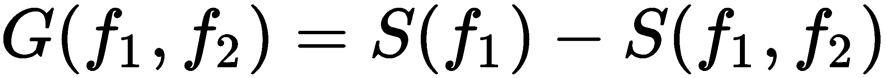

# 机器学习模型的实战示例

监督学习是教授模型关于世界如何看的最简单方式。展示给定输入变量的组合如何导致某个输出，即使用标记数据，使得计算机能够预测另一个类似数据集的输出，即使它从未见过这个数据集。无监督学习涉及从非标记数据中寻找模式和有用的见解。

我们将研究不同类型的机器学习模型，试图理解其细节并实际执行必要的计算，以便这些模型的内部工作原理清晰且可重复。

在本章中，将涵盖以下主题：

+   使用多元线性回归理解监督学习

+   使用决策树理解监督学习

+   使用聚类理解无监督学习

# 技术要求

本章没有技术要求。我们只需要在 Excel 表中输入每个部分表中显示的值，以便紧密跟随解释。

# 使用多元线性回归理解监督学习

在上一章中，我们通过使用两个变量的线性回归示例。有趣的是，我们可以看到如何将回归应用于超过两个变量（称为**多元线性回归**）并从结果中提取有用信息。

假设你被要求测试一家公司是否存在性别歧视的隐藏政策。你可能是在一家领导该公司诉讼案的事务所工作，他们需要基于数据的证据来支持他们的主张。

你可以从抽取公司的工资单样本开始，包括描述每位员工及其最近一次工资增长额的几个变量。以下截图显示了在 Excel 工作表中输入这些值后的值集：

数据集中有四个数值特征：

+   `ID`：员工识别码，与我们的分析无关

+   `Score`：最后一名员工的绩效评估结果

+   `Years in company`：员工在公司工作的年数

+   `Salary increase`：最近一次工资增长的金额（美元）

剩下的两个是分类的：

+   `Gender`：男性（`M`）或女性（`F`）

+   `Division`：员工在公司工作的部门

分类值在使用模型之前需要编码。最终的数据表如下：

通过应用标准的 Excel 函数，可以轻松获得独热编码。假设*B2*是包含性别分类的第一个单元格，我们可以在*B21*单元格中输入*=IF(B2="F";1;0)*，并将此值复制到*B37*单元格以下的所有单元格。

根据 Windows 列表分隔符选项中定义的字符，你应在公式中使用逗号（*，*）或分号（*；*）。

为了对员工部门进行编码，我们使用独热编码（有关详细说明，请参阅第一章，*实现机器学习算法*）并创建三个新变量：`IsProduction?`、`IsResearch?`和`IsSales?`。如果*E2*是包含`Division`数据的第一个行，那么我们可以使用单元格*E21*、*F21*和*G21*中的函数*=IF(E2="Production";1;0)*、*=IF(E2="Research";1;0)*和*=IF(E2="Sales";1;0)*，然后将它们按列复制到单元格*E37*、*F37*和*G37*。

在尝试对整个数据集进行回归之前，我们可以尝试一些特征工程。让我们看看我们能够根据每个员工所在的哪个部门来预测薪资增长的效果。这将给我们一个关于“薪资增长”目标变量与“部门”之间相关性的概念（关于变量之间相关性的更多细节将在第五章，*相关性与变量的重要性*中介绍）。

让我们遵循一些简单的步骤来使用内置的回归工具：

1.  导航到数据。

1.  点击数据分析，如下面的截图所示：

1.  选择回归，如下面的截图所示：

1.  作为输入 Y 范围，选择“薪资”数据，作为输入 X 范围，选择三个“部门”列：

结果显示 *R² = 0.1*，这意味着只有 10%的薪资增长与员工属于某个特定部门有关或可以由此解释。因此，我们可以丢弃这些列作为输入，并专注于其余部分。

我们重复进行回归，这次选择 X 值为列“性别”、“得分”和“在公司工作年限”。

结果现在大不相同，R²接近 0.85，这意味着 85%的薪资增长值可以通过所选变量来解释。

“性别”的重要性如何？通过查看 Excel 给出的 P 值系数，如下表所示，我们可以看到，根据与输入变量相关的 P 值，最重要的是性别，其次是得分和公司工作年限。因此，很明显，性别在决定薪资增长时起着重要作用，我们有证据证明公司政策并非性别中立：

|  | **系数** | **P 值** |
| --- | --- | --- |
| **截距** | 141.72775 | 0.083481944 |
| **性别** | -221.9209346 | 6.47796E-05 |
| **得分** | 2.697512241 | 0.004201513 |
| **在公司工作年限** | 8.118352407 | 0.332588988 |

回归分析的结果告诉我们我们能够多好地解释数据样本，但不能给我们一个准确的度量，即模型将如何预测薪资增长。为了探索这一点，我们应该做以下事情：

+   获取工资单的不同样本（在我们的例子中，我们可以手动生成新数据）

+   使用前表中列出的系数构建一个表达式，并计算给定输入变量的预测薪资增长

+   使用如第一章中所述的均方根误差来比较预测值和实际值，*实现机器学习算法*

让我们看看你是否能完成这个练习；我希望能提供的基本信息帮助你完成这项任务已经理解。

我们已经展示了如何在数据中执行多重线性回归以从中提取有趣的见解。让我们继续探讨另一个重要的机器学习模型：决策树。

# 通过决策树理解监督学习

决策树算法使用决策的树形模型。其名称来源于分割记录的级联过程的图形表示。算法选择更好的输入变量来将数据集分割成更纯的子集，从目标变量的角度来看，理想情况下是一个只包含该变量一个值的子集。决策树是一些最广泛使用且易于理解的分类算法。

树算法计算的结果是一组简单的规则，这些规则解释了哪些输入值的值或区间可以更好地分割原始数据。结果和得到这些结果所遵循的路径可以清晰地展示出来，这使得决策树在与其他算法相比时具有优势。"可解释性"是某些机器学习和人工智能系统的一个严重问题——这些系统大多被用作黑盒——并且本身就是一个研究课题。

在复杂问题中，我们需要决定何时停止树的发展。大量的特征可能导致一个非常大且复杂的树，因此树的分支数量和长度通常由用户限制。

熵是决策树中一个非常重要的概念，以及量化每个子样本纯度的方法。它衡量树中每个叶子的信息量。熵越低，信息量越大。零熵意味着一个子集只包含目标变量的一个值，而值为一表示一个子集包含相同数量的两个值。这个概念将在后面的例子中解释。

熵是衡量你的数据混乱程度的一个指标。

使用在每一步计算的熵，算法选择最佳变量来分割数据，并递归地重复相同的程序。用户可以决定何时停止计算，要么当所有子集的熵为零，要么没有更多特征可以分割，或者达到一个最小熵水平。

在决策树中使用最适合的特征是分类特征。在连续的数值变量情况下，应首先将其转换为类别，通过将其分为范围来实现；例如，A > 0.5 将是 A1，A ≤ 0.5 将是 A2。

让我们来看一个解释决策树算法概念的例子。

# 根据天气决定是否在户外训练

假设我们有一组关于经验足球教练关于是否带球队在户外（健身房外）训练的历史数据，包括在做出决策的日子上的天气条件。

一个典型的数据集可能如下所示：

该数据集是专门为这个例子创建的，当然可能不代表任何真实的决策。

在这个例子中，目标变量是`Train outside`，其余变量是模型特征。

根据数据表，可能的一个决策树如下所示：

我们选择根据**展望**特征的值来开始分割数据。我们可以看到，如果值是**多云**，那么训练在户外的决定总是**是**，并且不依赖于其他特征的值。**晴天**和**雨天**可以进一步分割以得到答案。

我们如何决定首先使用哪个特征以及如何继续？我们将使用熵*值*来衡量考虑不同输入特征时其值的变化程度。

# 目标变量的熵

当查看单个属性时，熵的定义如下：

在这里，*c*是特征*f*的可能值的总数，*p[i]*是每个值的概率，*log*[*2*]*(p[i])*是相同概率的以 2 为底的对数。计算细节如下：

1.  我们需要在数据集中计算是和否决策的数量。在我们的简单例子中，它们可以手动计算，但如果数据集更大，我们可以使用 Excel 函数：

*COUNTIF(F2:F15;"Yes")* 和 *COUNTIF(F2:F15;"No")*

然后，我们得到计算结果，*是 = 9* 和 *否 = 5*。

1.  当将熵公式应用于目标变量时，我们得到以下结果：

在这里，概率是计算为 *是* (*9*) 或 *否* (*5*) 占总数 (*14*) 的比例。

此计算也可以很容易地在 Excel 表中使用 *I3/(I3+J3)*LOG(I3/(I3+J3);2)-J3/(I3+J3)*LOG(J3/(I3+J3);2)* 来执行，其中 *I3=9* 和 *J3=5*。

# 各个特征相对于目标变量的熵

两个变量*f[1]*和*f[2]*的熵定义为以下：

在这里，*v*代表*f[2]*的每个可能值，*P(v)*是每个值的概率，*S(v)*在之前的方程中定义。

# 频率表

让我们构建一个频率表，这是计算变量之间组合总数通常的方法。在我们的例子中，我们用它来决定哪个变量选择会导致熵的更大减少：

1.  计算特征值的各种组合，将每个特征与`Train outside`目标变量进行比较。在这个特定例子中，您可以手动计数，但如果我们处理更大的数据集，有一个一般的方法来做这件事是有用的。

1.  要计算特征组合的数量，我们首先将数据表中的值成对连接。例如，*CONCATENATE(B2;"_";F2)* 给我们 `Hot_No`。

1.  如果我们将公式向下复制以完成总行数，我们将得到`Temperature`和`Train outside`变量的所有可能组合。

1.  如果我们用其余的特征重复相同的计算，结果将如下所示：

1.  创建交叉表来计算每列中唯一值的数量，即唯一组合的数量。这可以通过选择列中的整个范围，在所选区域的任何位置右键单击，然后左键单击快速分析来完成。以下对话框将弹出：

1.  选择 表格 | 交叉表创建如下表格：

1.  对所有列重复相同的程序，构建所有频率表和双变量熵。结果表和熵计算在以下小节中展示。

# 熵计算

Outlook-户外训练组合的频率表如下：

| **晴朗** | **户外训练** |
| --- | --- |
|  | 是 | 否 |
| 晴朗 | 3 | 2 |
| 阴天 | 4 | 0 |
| 雨天 | 2 | 3 |

使用这些值，我们得到两个变量的熵，如下所示：

*p(Sunny).S(Sunny)+p(Overcast).S(Overcast)+p(Rainy)*S(Rainy)=*

*5/14*(-3/5*log2(3/5)-2/5*log2(2/5)) +*

*4/14*(-4/4*log2(4/4)-0/4*log2(0/4))+*

*5/14*(-2/5*log2(2/5)-3/5*log2(3/5))=*

*0.693*

在这里，*p(Sunny) = (#Yes+#No)/Total entries = (2+3)/14, p(Overcast) = (#Yes+#No)/Total entries = (4+0)/14, p(Rainy) = (#Yes+#No)/Total entries = (2+3)/14*. 熵值 *S(v)* 是使用相应的概率计算的，即 *#Yes* 或 *#No* 除以总 *#Yes+#No*。

温度-户外训练组合的频率表如下：

| **温度** |  | **户外训练** |
| --- | --- | --- |
|  | **是** | **否** |
| **热** | 2 | 2 |
| **温和** | 4 | 2 |
| **凉爽** | 3 | 1 |

使用这些值和类似的计算，熵的详细情况如下所示：

*p(Hot).S(Hot)+p(Mild).S(Mild)+p(Cool)*S(Cool)=*

*4/14*(-2/4*log2-2/4*log2) +*

*6/14*(-4/6*log2-2/6*log2)+*

*4/14*(-3/4*log2-1/4*log2) =*

*0,911*

组合 Humidity-Train outside 的频率表如下：

| **Humidity** |  | **Train Outside** |
| --- | --- | --- |
| **Yes** | **No** |
| **High** | 3 | 4 |
| **Normal** | 6 | 1 |

使用这些值，我们得到以下熵：

*p(High).S(High)+p(Normal).S(Normal)=*

*7/14*(-3/7*log2-4/7*log2) +*

*7/14*(-6/7*log2-1/7*log2)=*

*0,788*

Windy-Train outside 组合的频率表如下：

| **Windy** |  | **Train Outside** |
| --- | --- | --- |
|  | **Yes** | **No** |
| **TRUE** | 6 | 2 |
| **FALSE** | 3 | 3 |

使用这些值，我们得到以下熵：

*p(True).S(True)+p(False).S(False)=*

*8/14*(-6/8*log2-2/8*log2) +*

*6/14*(-3/6*log2-3/6*log2)*

*=0,892*

# 比较熵差（信息增益）

要知道选择哪个变量作为第一次分割，我们计算从原始数据到相应子集的信息增益*G*，即熵值之差：

这里，*S(f[1])*是目标变量的熵，而*S(f[1],f2)*是每个特征相对于目标变量的熵。熵值已在之前的子节中计算，因此我们在此使用它们：

+   如果我们选择*Outlook*作为第一次分割树的变量，信息增益如下：

*G(Train outside,Outlook) = S(Train outside) - S(Train outside,Outlook)* *                                                 = 0.94-0.693=0.247*

+   如果我们选择*Temperature*，信息增益如下：

*G(Train outside,Temperature) = S(Train outside) - S(Train outside,Temperature)* *                                                           = 0.94-0.911=0.029*

+   如果我们选择*Humidity*，信息增益如下：

*G(Train outside,Humidity) = S(Train outside) - S(Train outside,Humidity)* *                                                     = 0.94-0.788=0.152*

+   最后，选择*Windy*给出以下信息增益：

*G(Train outside,Windy) = S(Train outside) - S(Train outside,Windy)*

= 0.94-0.892=0.048*

所有这些计算都可以使用 Excel 公式在电子表格中轻松完成。

树第一次分割时选择的变量是显示最大信息增益的变量，即*Outlook*。如果我们这样做，我们会注意到分割后产生的其中一个子集具有零熵，因此我们不需要进一步分割它。

要继续按照类似程序构建树，需要采取的步骤如下：

1.  计算*S(Sunny)*, *S(Sunny,Temperature)*, *S(Sunny,Humidity)*, 和 *S(Sunny,Windy)*。

1.  计算*G**(Sunny,Temperature)*, *G(Sunny,Humidity)*, 和 *G(Sunny,Windy)*。

1.  较大的值将告诉我们使用哪个特征来分割*Sunny*。

1.  使用*S(Rainy)*, *S(Rainy,Temperature)*, *S(Rainy,Humidity)*, 和 *S(Rainy,Windy)*来计算其他增益。

1.  较大的值将告诉我们使用哪个特征来分割*Rainy*。

1.  继续迭代，直到没有可用的特征为止。

正如我们将在本书后面看到的那样，树永远不会手工构建。理解它们的工作原理和涉及的计算非常重要。使用 Excel，可以轻松地跟随整个流程和每一步。遵循同样的原则，我们将在下一节中通过一个无监督学习示例进行操作。

# 通过聚类理解无监督学习

聚类是一种统计方法，试图根据距离度量将数据集中的点分组，通常是欧几里得距离，它计算一对点坐标之间平方差的平方根。简单来说，那些被分类在同一聚类内的点，在定义的距离意义上彼此更近，比属于其他聚类的点更近。同时，两个聚类之间的距离越大，我们就能更好地区分它们。这类似于说，我们试图构建成员之间更相似、与其他群体成员差异更大的群体。

很明显，聚类算法最重要的部分是定义和计算两个给定点之间的距离，并迭代地将点分配到定义的聚类中，直到聚类组成没有变化。

在尝试聚类分析之前，有几个要点需要考虑。并非每种类型的数据都适合聚类。例如，我们不能使用二进制数据，因为无法定义距离。值要么是`1`，要么是`0`，中间没有值。这排除了由 one-hot 编码生成的那种类型的数据。只有显示某种顺序或尺度的数据对聚类有用。即使数据值是真实的（例如，例如客户的支出金额或年收入），最好将它们分组在范围尺度上。

聚类用例的几个例子如下：

+   自动分组 IT 警报以分配优先级并相应地解决它们

+   通过不同渠道分析客户沟通（按时间段细分）

+   犯罪画像

+   城市流动性分析

+   欺诈检测（寻找异常值）

+   运动员表现分析

+   地理犯罪分析

+   配送物流

+   文档分类

现在，让我们通过一些例子来解释聚类算法的概念。

# 按月购买金额分组客户

现在，我们将跟随从客户数据生成聚类的全部计算和分析。这是一个典型的聚类算法的简化版本，展示了所有步骤但减少了迭代次数以便理解。聚类通常自动进行，但理解计算背后的逻辑很重要。

要使用的数据集包含 20 个不同客户在一个网店中每月花费的总金额，对应于给定年份的`五月`、`六月`和`七月`。一旦在 Excel 表中输入，数据看起来是这样的：

对于每个月，我们可以计算描述数据的几个主要参数：最小值、最大值、中位数和平均值：

|  | **五月** | **六月** | **七月** |
| --- | --- | --- | --- |
| **最小值** | 316.89 | 500.66 | 185.63 |
| **最大值** | 11889.66 | 12214.41 | 11982.64 |
| **中位数** | 8388.63 | 8156.16 | 7708.27 |
| **平均值** | 6182.20 | 6229.24 | 6227.81 |

我们简单地使用 Excel 内置函数 *MIN()*, *MAX()*, *MEDIAN()*, 和 *AVERAGE()*，包括每个列的完整范围。

在聚类分析中，对数据集进行*归一化*是有用的，也就是说，将所有值转换为落在区间 [0,1] 内。这有助于我们处理那些与大多数点值差异很大的**异常值**，这些值可能会影响簇的定义。归一化后，这些点与其他点之间的距离就不那么远了，并且可以很容易地分组。显然，如果聚类分析的目标是找到这些异常值，那么保持数据集原样并突出异常值与数据集其他部分之间的差异是一个更好的主意。

归一化数据的最简单方法是将每个值除以对应列的最大值。为此，请按照以下步骤操作：

1.  在单元格 *G2* 中，输入 `=B2/$B$24`。 我们假设 *B2* 是`五月`列的第一个值，并且最大值在 *B24*。

1.  将此公式复制到整个列中。记住，在 Excel 中，在单元格 ID 前添加 *$* 可以在复制内容到另一个单元格时固定该值。归一化后的表格如下所示：

让我们花点时间可视化数据并更深入地理解它。如果我们成对地考虑列，那么可以生成散点图，并按照以下步骤尝试通过视觉方式找到簇：

1.  选择`五月`和`六月`数据。

1.  点击 插入 | 散点图。

生成的图表如下所示：

可以识别出三个簇，并在前面的屏幕截图中被圈出。它们对应于每月花费相似金额的客户群体。

1.  用相同的方法处理`五月`和`七月`，我们得到以下图表：

在这种情况下，我们可以说有两个大簇，或者其中一个簇可以进一步分为两个。分离并不那么清晰，选择将取决于其他变量（记住，最好的模型总是最适合业务需求的模型）。

1.  最后，我们绘制了`六月`和`七月`的数据：

在这里，簇的划分似乎更加清晰，我们可以圈出三组点。

如果我们想同时考虑三个月怎么办？有一个迭代过程可以完成这个任务，这是称为**K-means**的聚类算法的基础。让我们详细遵循这个算法的步骤：

1.  决定你想要将数据分成多少个簇。这通常不是一个容易的决定。它将强烈依赖于数据集，在某些情况下，可能需要测试不同的值，直到你得到一个能够对数据提供有用见解的簇数。

1.  考虑到之前的视觉分析，我们决定选择三个作为簇的数量。

1.  以任意三个点作为簇的中心。起始点的选择并不重要，因为我们将会重复整个过程，直到结果簇成员没有变化。然后我们选择列表中的前三个点，如下表所示：

|  | **May** | **June** | **July** |
| --- | --- | --- | --- |
| **Random1** | 0.055568104 | 0.043735522 | 0.15581034 |
| **Random2** | 0.07079235 | 0.067065974 | 0.079319396 |
| **Random3** | 0.026652635 | 0.040988882 | 0.171590079 |

1.  找到离它们更近的点，计算所有其他点到这些簇中心的距离。两点之间的欧几里得距离，*P[1] =(x[1],y[1]**,z[1])* 和 *P[2] = (x[2],y[2]**,z[2]),* 定义如下：

使用 Excel 的内置 *SUMXMY2([array1];array2})* 函数计算每个点到簇中心的 *(DE)²*。

1.  对于每个数据点，你将得到三个距离值。选择最小的一个来决定点属于哪个簇。例如，对于客户 ID = 4，我们得到以下信息：

| **D1** | **D2** | **D3** | **Cluster** |
| --- | --- | --- | --- |
| 0.019689391 | 0.004847815 | 0.025218271 | 2 |

在这里，*D1*，*D1*，和 *D3* 是点到相应簇中心的距离。最小的距离告诉我们这个点属于第二个簇。例如，对于客户 ID = 4 的 *D1* 计算如下 *=SUMXMY2(B5:D5;$B$23:$D$23)*，假设 Random1 的`五月`和 Random1 的`六月`分别位于单元格*$B$23*和*$D$23*。

1.  完整的结果数据表如下：

1.  使用 *MEAN()* 函数计算每个月每个聚类的平均值。你应该得到以下表格中显示的相同结果：

|  | **五月** | **六月** | **七月** |
| --- | --- | --- | --- |
| **Mean1** | 0.618762809 | 0.605805489 | 0.618056642 |
| **Mean2** | 0.157477363 | 0.155314048 | 0.111411008 |
| **Mean3** | 0.026652635 | 0.040988882 | 0.171590079 |

例如，对应于 `五月` 的 **Mean1** 是通过 *AVERAGE(B2:B17)* 计算得出的。

1.  使用与之前相同的公式，并计算所有其他点到平均值之间的距离，你会得到一个类似于这个表格的表格：

在第二次迭代后，一些点被移动到从聚类一移开的位置，现在它们属于聚类二和三。

1.  再进行一次计算。根据前面的表格，新的平均值如下：

|  | **五月** | **六月** | **七月** |
| --- | --- | --- | --- |
| **Mean1** | 0.843481911 | 0.832289469 | 0.810799822 |
| **Mean2** | 0.292624962 | 0.280240044 | 0.310753303 |
| **Mean3** | 0.052180197 | 0.048870976 | 0.105552835 |

1.  可以将包含距离和聚类编号的表格表示如下：

在第三次迭代后，只有一个点改变了聚类，从二变为三；因此，我们正在接近最终结果。你应该能够再进行一次迭代，按照相同的步骤，证明它不会改变聚类标签，这意味着计算收敛到了一个稳定的聚类数量。

现实生活中的数据集可能不会那么快收敛。我们展示的是一个简化的例子，足以展示迭代的每一步，理解它们，并得到一个合理的结果。聚类通常不是手动计算的，而是通过预构建的算法执行。

在下一章中，你将学习如何将数据从不同的来源导入 Excel，这样你就不需要手动输入值。这将为你分析真实数据提供一个起点，通常比本章中展示的例子包含更多的变量和值。

# 摘要

在本章中，我们描述了将监督学习和无监督机器学习模型应用于解决问题的实际例子。我们涵盖了多元回归、决策树和聚类。我们还展示了如何选择和转换模型要摄入的输入变量或特征。

本章仅展示了每个算法的基本原理。在现实数据分析和预测中使用机器学习时，模型已经编程，可以用作黑盒。因此，了解每个模型的基本原理并知道我们是否正确使用它非常重要。

在接下来的章节中，我们将关注如何从不同的来源提取数据，根据我们的需求对其进行转换，并使用先前构建的模型进行分析。

# 问题

1.  为什么对分类特征进行编码很重要？

1.  有哪些不同的方法可以停止决策树计算？

1.  在示例中，`Temperature_hot` 的熵值为一。为什么？

1.  按照第 *Understanding supervised learning with decision trees* 节开始处的决策树图，决定是否进行外部训练的路径是什么？可以考虑使用 `IF` 语句。

1.  如果我们选择不同的起始点，聚类分布会改变吗？你可以阅读推荐的文章了解这一点。

1.  通过迭代分析获得的聚类与通过视觉确定的聚类是否相同？为什么？

# 进一步阅读

+   *如何解释回归分析结果：P 值和系数*：[`blog.minitab.com/blog/adventures-in-statistics-2/how-to-interpret-regression-analysis-results-p-values-and-coefficients`](http://blog.minitab.com/blog/adventures-in-statistics-2/how-to-interpret-regression-analysis-results-p-values-and-coefficients)

+   *使用 Microsoft Excel 教学决策树分类*，发表于《INFORMS Transactions on Education》第 11 卷第 3 期，第 123–131 页，作者：Kaan Ataman, George Kulick, Thaddeus Sim: [`pubsonline.informs.org/doi/10.1287/ited.1100.0060`](https://pubsonline.informs.org/doi/10.1287/ited.1100.0060)

+   *K 均值算法综述*，发表于《International Journal of Engineering Trends and Technology (IJETT)》第 4 卷第 7 期，2013 年 7 月：[`www.ijettjournal.org/volume-4/issue-7/IJETT-V4I7P139.pdf`](http://www.ijettjournal.org/volume-4/issue-7/IJETT-V4I7P139.pdf)
