# 数据清洗和初步数据分析

在获取到正确数据后，最困难且耗时的工作是将其准备好进行分析。在可以使用任何模型之前，了解给定数据集可以做什么和不能做什么是第一步。本章演示了如何使用 Excel 函数搜索和替换模式，以及如何找到错误的数据类型和缺失数据。它还包含一些有用的图表，以便我们可以从数据中获得洞察力并理解不同的变量。

在本章中，我们将涵盖以下主题：

+   数据清洗

+   可视化数据以进行初步分析

+   理解不平衡数据集

# 技术要求

您需要从 GitHub 仓库[`github.com/PacktPublishing/Hands-On-Machine-Learning-with-Microsoft-Excel-2019/tree/master/Chapter04`](https://github.com/PacktPublishing/Hands-On-Machine-Learning-with-Microsoft-Excel-2019/tree/master/Chapter04)下载`titanic.xls`文件。

# 数据清洗

数据永远不会干净——它总是包含缺失值、错误、不正确的格式和其他问题，这些问题使得在没有预处理的情况下无法将其提供给机器学习模型。这就是数据清洗的全部内容——在开始真正的分析之前纠正所有这些问题。

作为如何清洗数据集的示例，我们将使用泰坦尼克号乘客数据集。我们将重复上一章中“从另一个 Excel 工作簿导入数据”部分所描述的程序，以从 Excel 工作簿中导入数据。我们将使用泰坦尼克号乘客的实时数据，并演示如何为分析准备它。

要清洗数据集，执行以下必要步骤：

1.  导航到数据 | 从文件 | 从工作簿，如下面的截图所示：

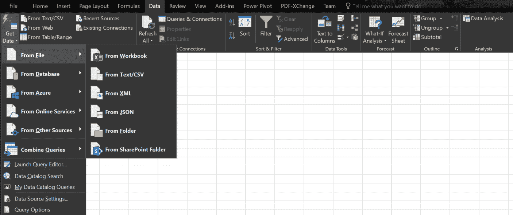

1.  在选择`titanic.xlsx`文件和`Passenger data`工作表后，我们预览了文件的内容，如下面的截图所示：

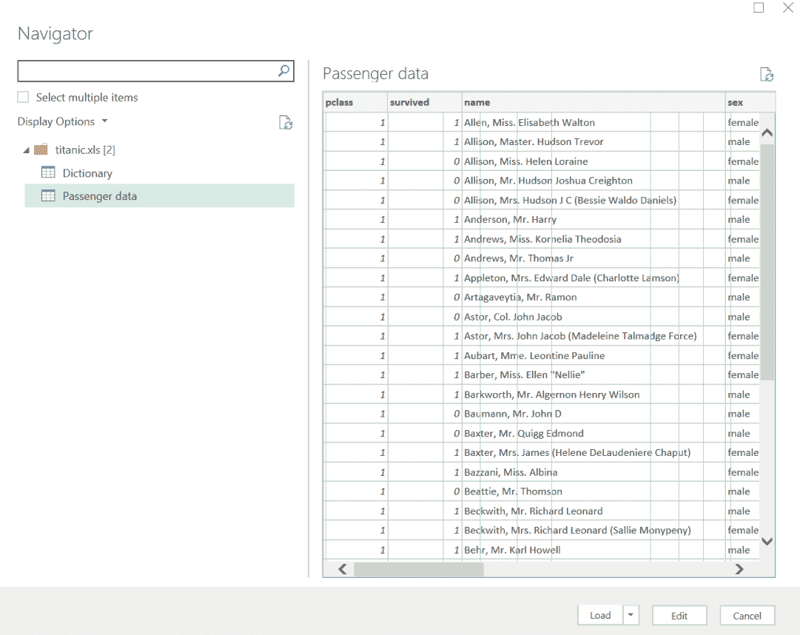

1.  点击“编辑”并开始数据清洗过程。我们首先注意到我们不需要包含乘客姓名的列；它对我们的分析没有提供任何有用的信息。实际上，在大多数情况下，我们会被要求从我们的数据中删除个人信息，这是由于隐私政策的要求。

1.  选择`name`列。

1.  点击“移除列*；*”后的表格将如下所示：

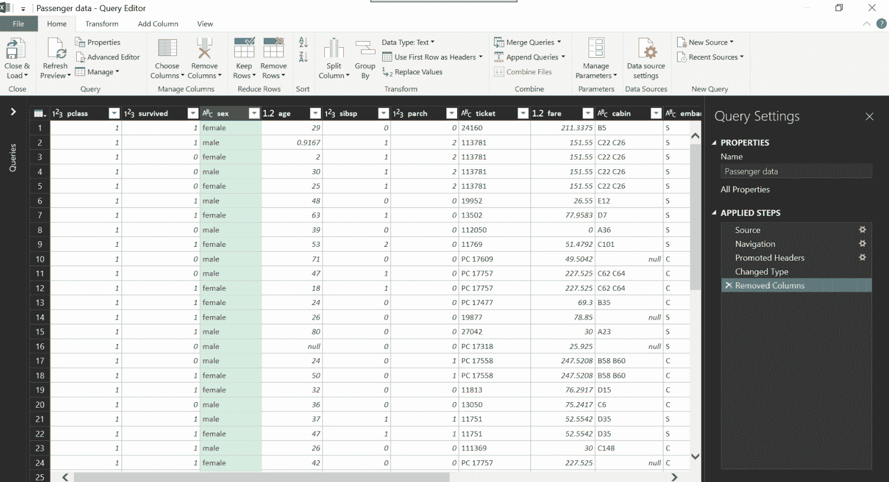

1.  将`cabin`列中的所有`nulls`替换为`unknown`：

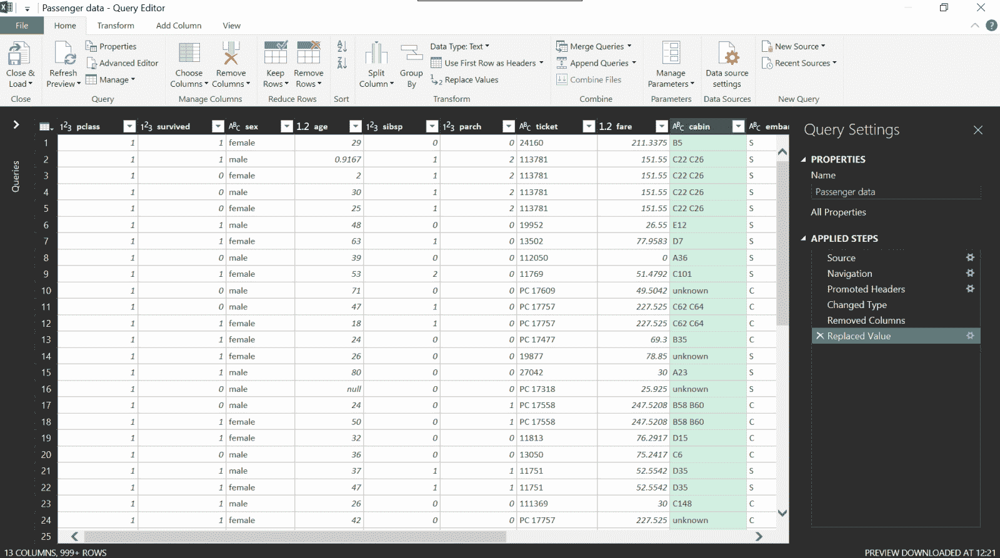

还有两列包含缺失值：`boat` 和 `body`。根据数据字典，它们告诉我们乘客所在的救生艇（如果他们幸存），以及他们死亡时分配给其身体的 ID。存在缺失值，但也有一些情况下我们无法获得值；显然，已故乘客没有使用救生艇，幸存者的身体 ID 未识别。我们将使用一些函数来处理这些选项。

1.  在查询编辑器中，选择“添加列”选项卡。

1.  选择自定义列。

1.  对话框显示我们可以命名新列并定义其内容。在文本框中输入 `boat_corrected`。

1.  定义一个函数来计算列的内容，如下所示：

*if [survived]=1 and [boat] = null then "unknown" else [boat]*

这意味着如果乘客幸存且船名缺失，我们将值设置为 `unknown`。否则，我们只需将值复制到原始列中，如下面的截图所示：

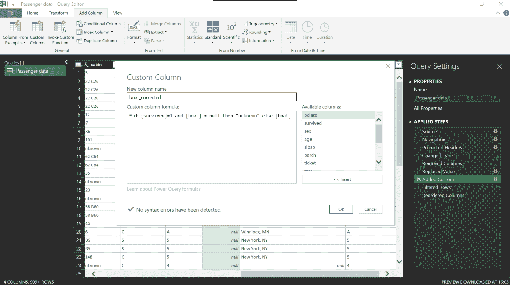

1.  添加另一个新列，以纠正 `body` 中的值，并为该列定义不同的值：

*if [survived]=0 and [body] = null then "not recovered" else [body]*

在这种情况下，我们想说的是，如果乘客在船难中没有幸存，并且没有身体 ID，那么他们可能没有被从水中打捞上来。

重新排序列后的结果是以下内容：

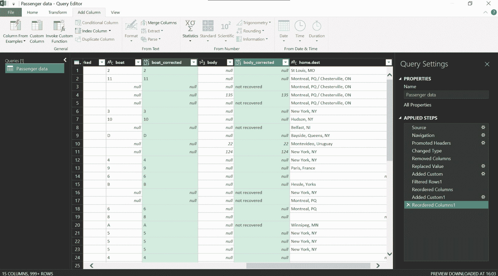

新列中仍有 `null` 值；它们对应于前面的情况（即没有救生艇的已故乘客，或没有身体 ID 的幸存者）。将这些值替换为 `N/A`；结果表格如下所示：

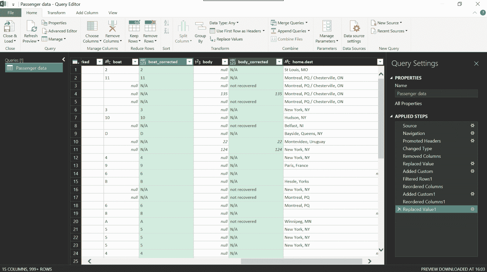

最后要修改的列是 `age`。我们将通过将乘客分组到年龄范围来简化这一点，并用缺失值替换。

1.  将所有缺失值（`null`）替换为 `-1`。我们可以通过选择列并点击“替换值”来完成此操作。

1.  导航到“添加列”选项卡。

1.  点击“条件列”并定义几个组，具体取决于年龄范围，如下面的截图所示：

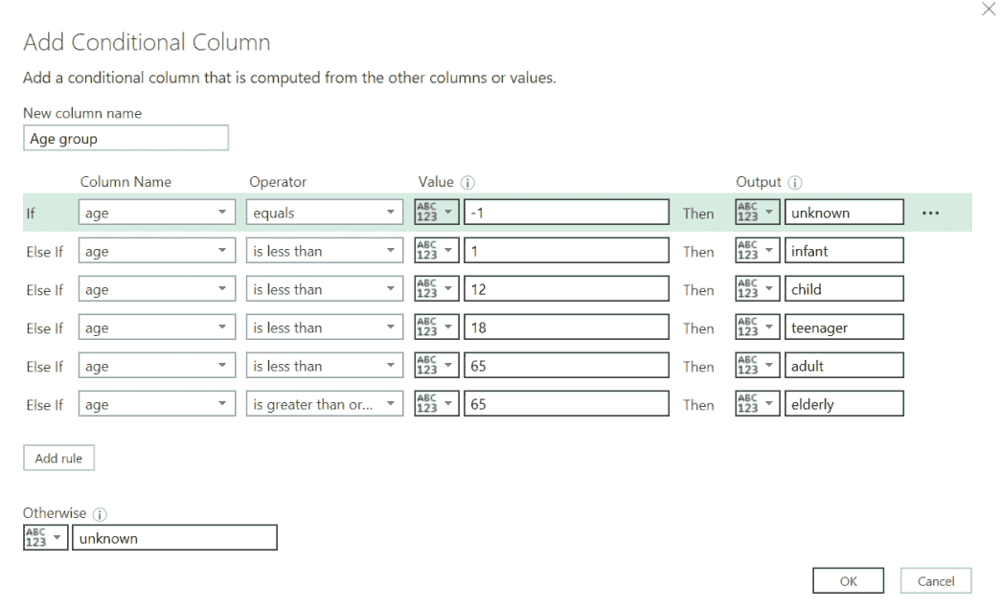

结果是一个新的列（`Age group`），它包含不同的年龄组而不是年龄值，并用 `unknown` 替换 `null` 值。结果表格如下：

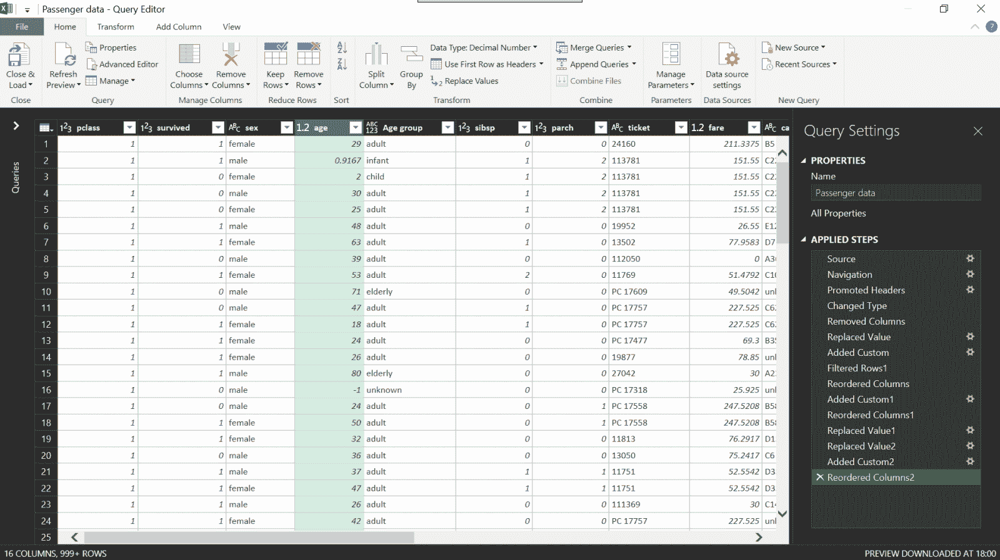

我们的数据集现在已清理完毕，准备进行一些初步分析，我们将在下一节中展示。

# 可视化数据以进行初步分析

在清理数据集之后，总是建议对其进行可视化。这有助于我们了解不同的变量，它们值的分布情况以及它们之间的相关性（我们将在下一章中更详细地探讨相关性）。我们可以确定哪些变量对我们的分析很重要，哪些变量提供了更多信息，以及哪些变量因为冗余可以被舍弃。

我们将首先查看几个条形图，我们将要么计数每个值的出现次数（使用直方图），要么显示每个值相对于总数的百分比（使用条形图）。为了实现这一点，请执行以下步骤：

1.  在表格中的任何单元格上右键单击以访问快速分析选项：

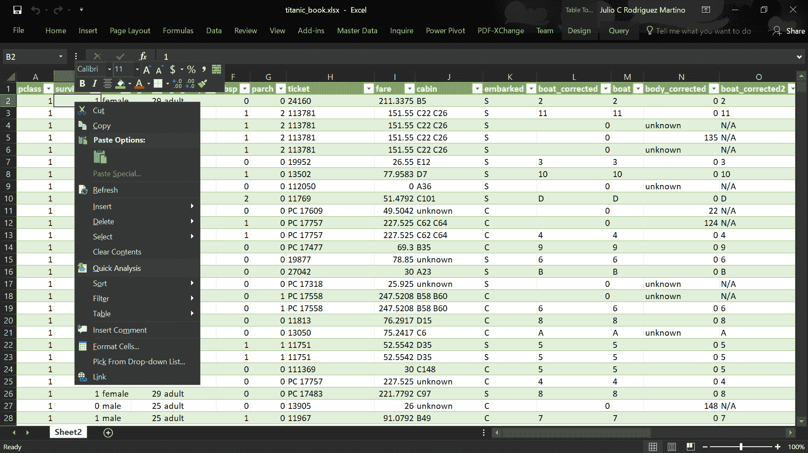

1.  在弹出窗口中，我们可以选择图表类型。选择簇状柱形图，如图所示：

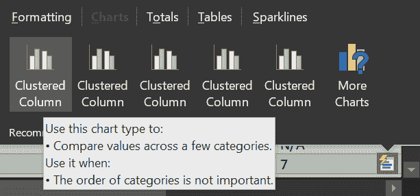

默认情况下，Excel 创建了一个显示一些变量的数据透视表；我们需要更改变量和分组操作，以反映我们的需求。

1.  在右下角，我们将看到一个标记为Σ的窗口。在里面，我们可以点击变量并显示菜单，如图所示：

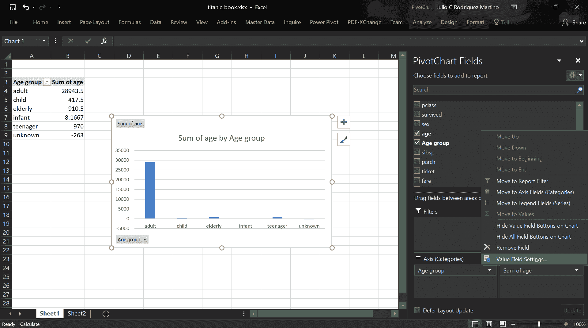

1.  点击值字段设置；您将看到一个弹出窗口，类似于以下截图，您可以在其中将总和更改为计数，因为我们想计数值，然后计算它们的总和：

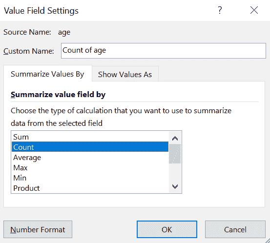

我们将`Age`变量转换为`Age group`，因此这是我们现在想要使用的变量。也就是说，我们想要计算给定年龄组中有多少乘客。

1.  将数据透视表字段的选择更改为`Age group`。

1.  现在，更改图表标题并移动它，使其看起来类似于以下截图：

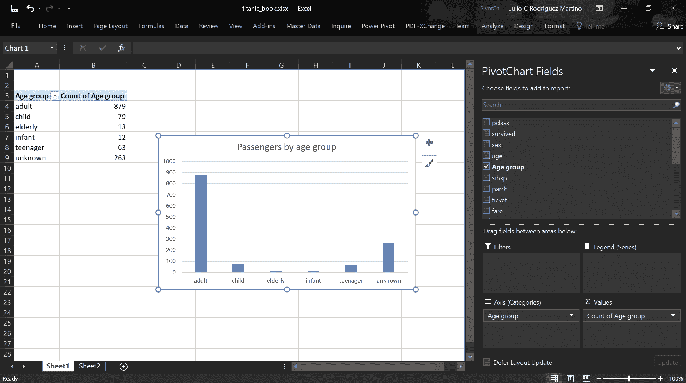

我们可以看到，列表中的大多数乘客都是成年人。我们对列表中的许多乘客有缺失信息，其余的群体共享少量乘客。图表中使用的表格可以在左上角看到。

一个有趣的问题是要问，*不同年龄组的生存概率是否有差异？* 为了回答这个问题，我们需要将`survived`变量添加到轴（类别）窗口中，该窗口位于工作表的右下角。我们通过从数据透视表字段窗口拖动变量并将其放入轴来实现这一点。生成的图表如下：

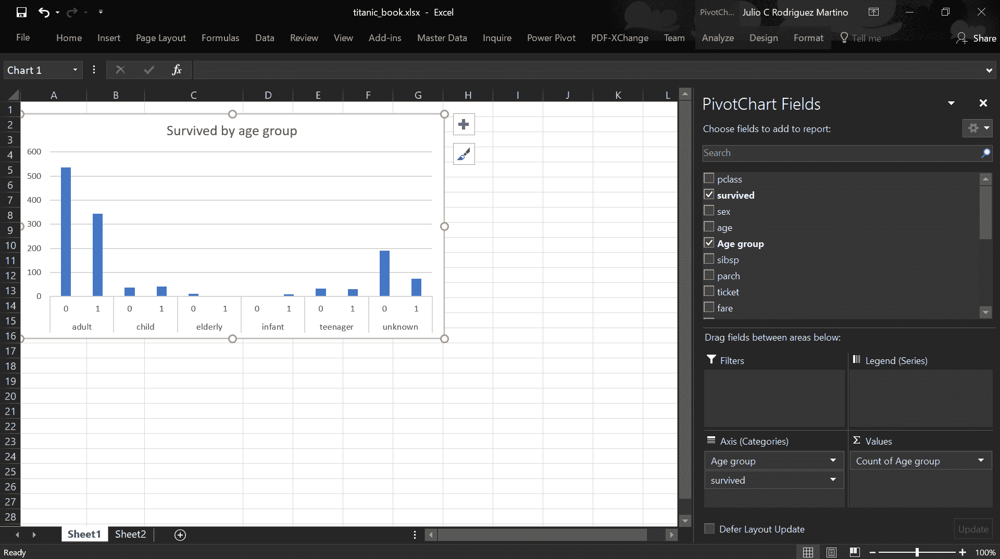

这个图表有一个显著的问题——我们无法轻易地比较年龄组，因为它们的成员数量差异很大。解决方案是将所有内容都参照每个年龄组的总乘客数，并显示百分比。查看之前的图表，我们可以看到数据首先按`年龄组`分组，然后按`生还情况`分组。第一个是父变量。重复我们之前描述的步骤，导航到值字段设置菜单；你将看到一个类似于以下截图中的弹出窗口：

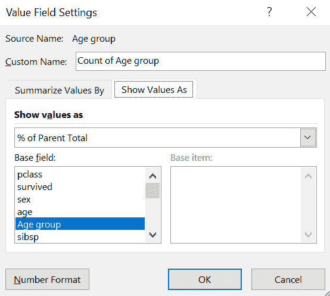

1.  点击显示值方式标签页，如前述截图所示。

1.  选择父总百分比选项，并将`年龄组`字段作为父变量；结果如下截图所示：

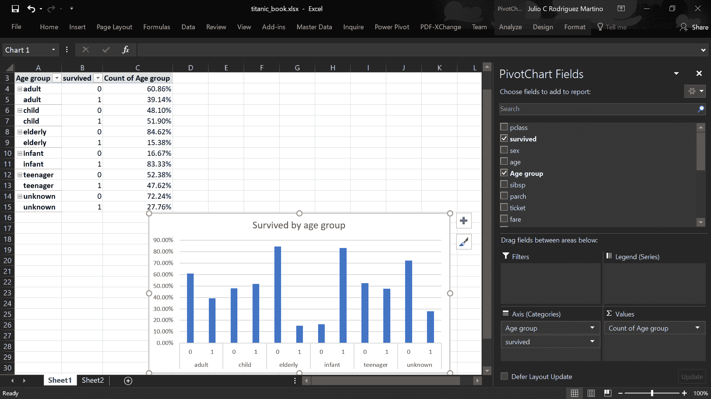

百分比是相对于每个年龄组内乘客总数的，现在比较起来更容易。老年组的大多数人没有在沉船中幸存，大多数成年人遭遇了同样的命运，儿童和青少年的数字似乎很均匀。很明显，大多数婴儿都幸存了，可能是因为他们在登船时被优先考虑。

重复相同的步骤，我们可以假设头等舱的乘客比其他乘客更有可能生还；考虑以下图表：

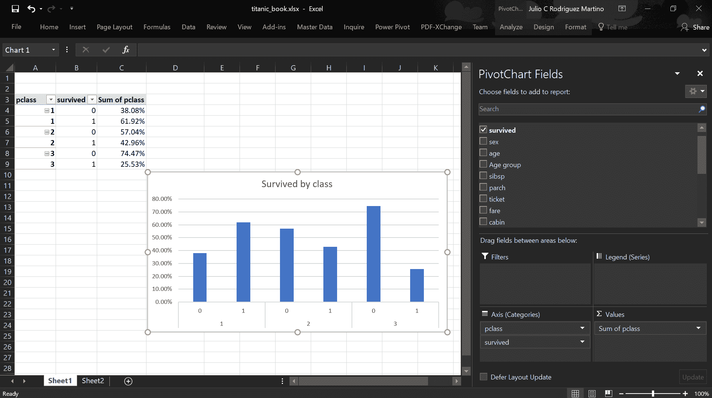

是的，如果你是头等舱乘客，比在三等舱更容易生还。这是泰坦尼克号悲剧的一个已知事实，我们可以在数据中看到它的反映。不同舱位的旅行条件以及安全措施都大不相同。

那么，关于性别呢？乘客是男性还是女性有关系吗？让我们构建一个男性和女性生还人数的直方图，并使用它来回答我们的问题。结果图表如下截图所示：

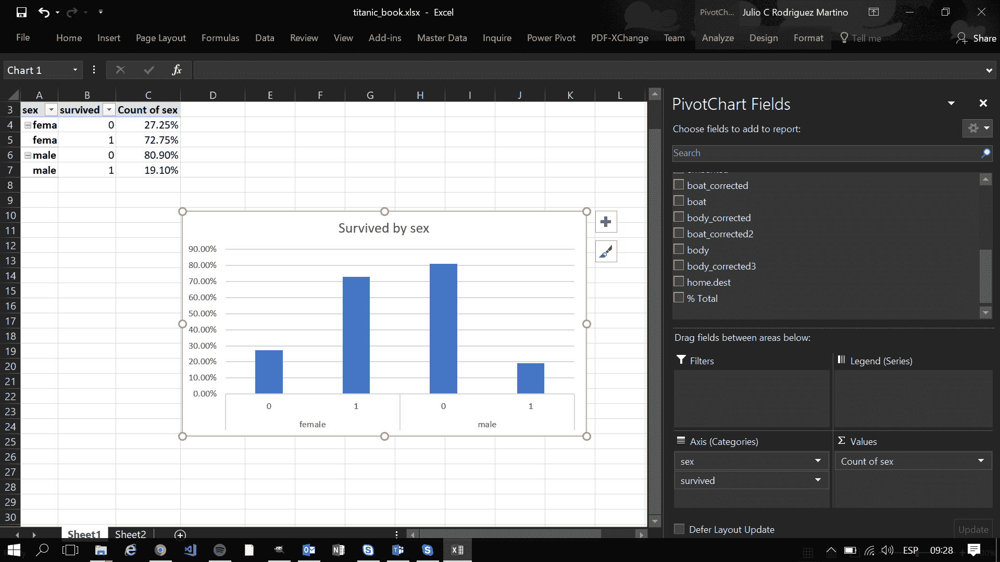

如你所见，性别显然很重要。女性生还者的概率比男性高，至少在一般意义上是这样。这其中的原因可能是因为女性在登船时被优先考虑，而男性，尤其是年轻人，被延迟以帮助其他乘客，因此他们没有及时到达救生艇。

我们结合了我们对数据集的先前知识和数据信息，以更好地理解我们可以和不能做什么。我们鼓励你为其他变量和组合创建图表，并尝试理解结果。为了理解我们从机器学习模型中获得的结果是否合理，理解数据集的基本细节至关重要。

# 理解不平衡数据集

为了能够比较不同变量的结果，我们需要考虑每个类别的样本数量不同。假设我们想要训练一个机器学习模型来预测给定乘客是否会幸存，基于年龄组、性别和舱位。如果我们绘制`survived`变量值的分布，我们会看到以下情况：

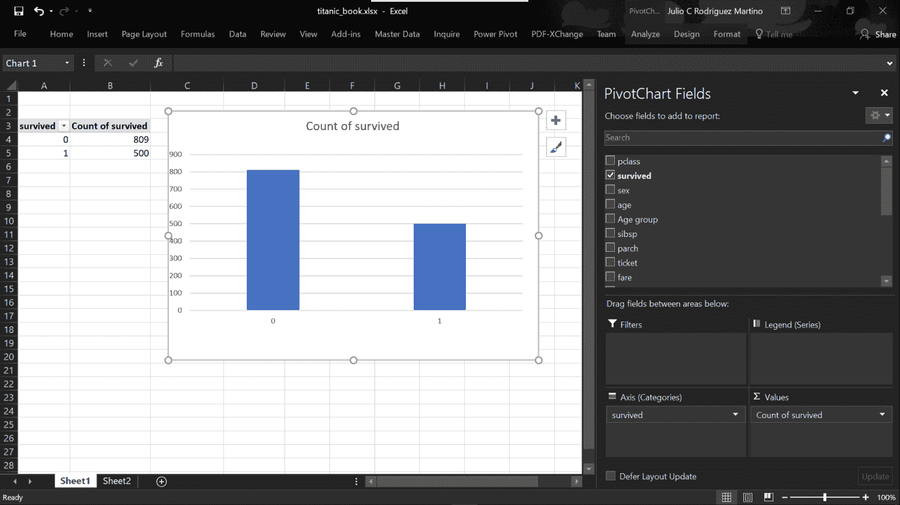

从前面的图表和表格中可以清楚地看出，非幸存者的人数几乎是幸存者的两倍。如果我们直接使用这个数据集，我们会在数据集中引入一个偏差，这将影响结果。预测生存变量为`0`的概率将大约是预测为`1`的两倍。这个陈述的例外是决策树及其相关的预测模型（如随机森林和 XGBoost），它们可以正确处理不平衡的数据集。其他模型，尤其是神经网络，对不均匀的数据集非常敏感。算法中的种族、性别和其他偏差引发了关于**人工智能**（**AI**）在所有级别上广泛应用的担忧。当将 AI 应用于现实生活时，这是一个严重的问题，防止这种情况的可能的解决方案仍在研究中。

给定足够的数据条目，平衡数据集的一个简单方法是从多数类别随机选择与少数类别数量相等的条目。在这种情况下，我们可能从显示`survivor`为`0`的行中选择 500 行。让我们使用以下步骤来完成：

1.  按照以下截图所示筛选条目：

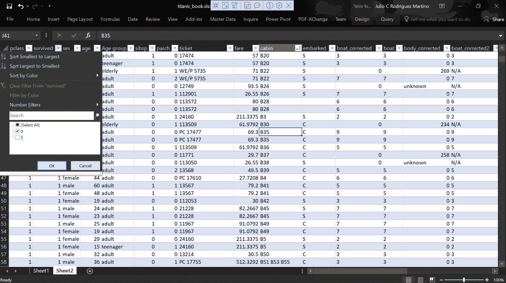

1.  复制条目并将它们粘贴到一个新的工作表中。

1.  在开头插入一个新列，命名为`ID`。

1.  将数据转换成表格（插入 | 表格，保留第一行作为标题）。

1.  在第一个单元格中输入以下公式，并将其复制到该列的其余部分：

*=RAND()*

1.  确保自动计算已关闭。为此，导航到公式 | 计算选项并勾选手动。这将防止随机数自动更改：

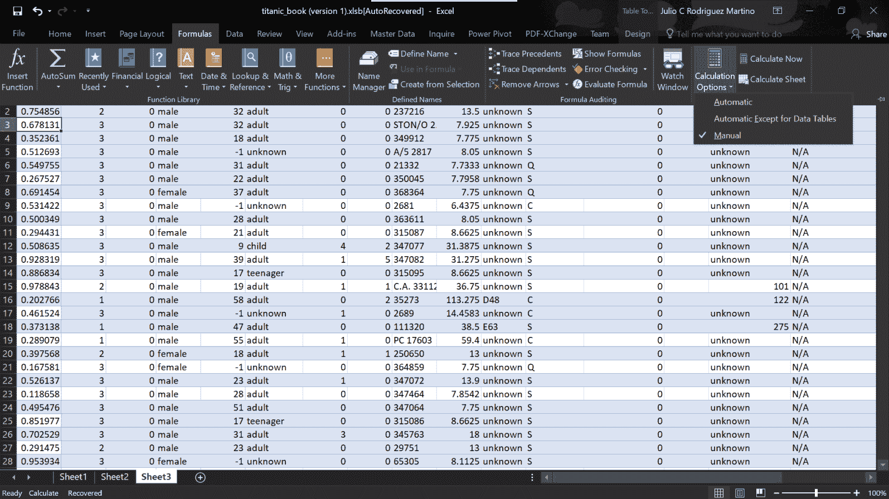

1.  按 ID 排序数据（你可以选择升序或降序，这没有关系）。

1.  选择前 500 行作为你的随机样本。

1.  将这些行复制到新工作表中。

1.  添加 500 行，其中`survived`为`1`。

现在，你有一个包含 1,000 个条目的完美平衡数据集，你可以用它来训练你的机器学习模型。

# 摘要

在本章中，我们探讨了处理缺失数据的不同方法，并学习了如何对其进行分组或汇总。我们向您展示了在数据清洗后可视化数据的重要性，以便能够理解和解释从基本到更高级模型预测的结果。这是任何特征工程的开端，因为我们根据特征值进行转换和/或丢弃特征。过多的缺失值将意味着我们无法使用该变量（或特征），或者高度相关性将意味着我们可以丢弃相关变量中的一个。我们将在下一章中更深入地探讨相关性，向您展示如何使用不同的方法进行定量测量。

初步数据可视化对于理解数据属性和解释我们获得的结果至关重要，即使在应用机器学习模型之后。

# 问题

1.  回顾上一章所解释的内容，使用`class`（类别）、`gender`（性别）和`Age group`（年龄组）作为特征，`survived`（幸存）作为目标变量，构建一个决策树。你应该能够为乘客生存定义一些条件。

1.  你认为数据集中哪些变量高度相关？

1.  假设数据集包含一个只有少数缺失值的数值变量。是否可以用数值替换这些缺失值？你会使用什么值？

1.  解释偏差的含义以及为什么需要避免它。

1.  还有哪些类型的图表可以用于初步数据分析？在给定的数据集中尝试一些。

# 进一步阅读

+   *《数据清洗最佳实践：收集数据前后的完整指南》，第一版，作者 Jason W. Osborn*

+   *《使用 Microsoft Excel 2013 和基于 Web 的工具的数据可视化技术入门》，作者 Tufts Data Lab*

+   *《分析多类别不平衡数据集的分类：预处理和成本敏感学习的二值化技术和临时方法》，作者 A. Fernández, V. López, M. Galar, M.J. del Jesus 和 F. Herrera*
