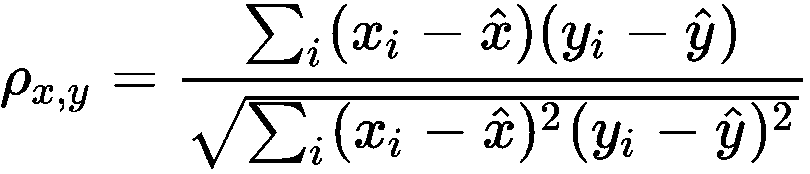

# 变量之间的相关性及其重要性

变量之间的相关性通常意味着一个变量的变化会反映在另一个变量上。但这并不意味着一个变量的变化是由相关变量的变化*引起*的。例如，产品的销售价格与制造成本相关，但价格的增加并不完全由它引起，因为还有其他因素如运输和通货膨胀需要考虑。

并非数据集中每个变量或特征都对我们的分析有用，有时其中许多是冗余的。变量对之间的强相关性告诉我们哪些可以被丢弃，哪些对于预测或解释目标变量是重要的。

在 Excel 中可以执行不同的相关性计算，并用于确定输入特征的相对重要性。我们将在本章中展示其中的一些，以及图形方法。

本章所使用的数据集是从 Carnegie Mellon 大学维护的 StatLib 库中获取的，它将汽车的不同变量与其燃油消耗相关联。

本章我们将涵盖以下主题：

+   建立散点图

+   计算协方差

+   计算皮尔逊相关系数

+   研究斯皮尔曼相关系数

+   理解最小二乘法

+   专注于特征选择

# 技术要求

您需要从 GitHub 仓库[`github.com/PacktPublishing/Hands-On-Machine-Learning-with-Microsoft-Excel-2019/tree/master/Chapter05`](https://github.com/PacktPublishing/Hands-On-Machine-Learning-with-Microsoft-Excel-2019/tree/master/Chapter05)下载`auto-mpg.xlsx`文件[.]。

# 建立散点图

首先，加载`auto-mpg.xlsx`文件。我们将使用其中的数据来展示本章的不同方面。变量的含义在 Excel 文件及其参考中描述。

评估变量之间相关性的最简单方法是创建一个散点图，将所有特征成对展示。例如，如果我们把`Cylinders`变量放在*x*轴上，与*y*轴上的`Displacement`变量作图，我们会看到一个*正相关*（即，气缸数量越多，排量值越高）。这是可以预料的，因为发动机排量的计算（这里以立方英寸表示）与气缸数量呈线性相关。

散点图可以在以下图表中看到：

如果我们观察燃油消耗与汽车重量之间的关系，图表将类似于以下：

在这种情况下，汽车的重量和每加仑燃油行驶的英里数之间存在负相关性（也就是说，汽车越重，每加仑燃油能行驶的英里数就越少）。我们还注意到，这种相关性是非线性的，这意味着直线不能描述这些变量之间的关系。

那么，如果我们绘制两个不相关的变量会怎样呢？例如，发动机的气缸数和汽车制造的年份之间是否存在任何相关性？让我们看一下下面的图表：

在这里，我们注意到，在分析的时间段内，**3**或**5**气缸的汽车并不常见，因为它们的例子很少。**78**到**80**年似乎是**5**气缸发动机的时期，但除了这些事实之外，还有**4**、**6**和**8**气缸发动机在数据集中的每一年都在生产。这两个变量之间没有明显的相关性，其中一个变量不能给我们关于另一个变量的任何信息。

如果我们只有几个变量，这种在散点图中寻找相关性的方法是好的，但图表的数量需要快速增加。事实上，如果变量的数量是*N[v]*，那么查看所有相关性的组合数量如下：

*N[v ]* (N[v ]-1)*

即使像我们这样的小数据集，要包含 8 个数值变量，我们也需要 28 个图表来覆盖所有可能的组合。如果我们有数百个变量，那么通过肉眼找到相关变量的任务将变得简单不可能。在下一节中，我们将描述自动计算相关性的方法，使其能够处理大数据集和大量特征。

# 计算协方差

我们需要定义一种统计方法，定量地衡量两个特征之间的关联程度。两个变量的协方差正是这样做的，那么让我们看看它是如何计算的。如果有两个变量，*x*和*y*，我们首先将它们的值围绕它们的平均值进行中心化，和；然后，我们乘以新的值并取乘积的平均值：

这种定义意味着如果两个变量同时增加或减少，那么协方差是正的，而如果它们朝相反的方向移动，那么协方差是负的。如果没有相关性，协方差值将很小，即接近零。

从定义中也很清楚，由于变量保持了它们的尺度，比较具有非常不同平均值的特征很困难，比较两个协方差也是不可能的。

在 Excel 中，通过使用数据分析插件（我们将在附录中解释如何激活它）可以轻松计算协方差。

要计算协方差，请执行以下步骤：

1.  打开数据文件。

1.  导航到数据 | 数据分析。

1.  在弹出窗口中，选择协方差，如图下所示：

1.  选择数据范围；在这种情况下，它是除了最后一列之外的全部表格，最后一列包含汽车名称，是非数值的：

结果如下表所示：

我们可以看到`位移`和`汽缸数`之间存在正协方差值，而`重量`和`mpg`之间存在负值。由于我们之前解释过，比较这些值是不可能的，所以我们不能说更多。这里的大变化是我们同时计算了所有这些值，所以我们不需要逐个查看图表。矩阵是对称的，所以只显示了其中一半。

有一种方法可以量化相关性并比较它们，这是卡尔·皮尔逊在 19 世纪 80 年代开发的。让我们在下一节中更详细地探讨它。

# 计算皮尔逊相关系数

皮尔逊系数在比较两个变量时最常用，它通过测量它们之间的线性关系来工作。皮尔逊给出的原始定义如下：

分子与协方差成正比，分母是中心变量的标准差（σ）的乘积。这种归一化确保了*ρ*可能值的范围在*-1*和*1*之间。

我们可以通过重复在*计算协方差*部分中概述的步骤，通过在弹出窗口中选择相关性来在 Excel 中计算皮尔逊相关系数。

结果表如下所示：

包含值为`1`的单元格表示自身与每个变量之间的线性关系。负相关性再次表明一个变量增加而另一个变量减少，而正相关性表明两个变量在同一方向上变化。

皮尔逊系数非常适合比较特征关系。例如，我们可以看到`汽缸数`和`位移`比`重量`和`mpg`更线性相关（根据位移的定义，实际上），即使第二对中的那些相关。

皮尔逊系数的另一个定义如下：

在这里，*b*是最佳拟合线性回归的斜率，该回归拟合*x*与*y*，而*σ[i]*是*x*和*y*的标准差。这个定义清楚地表明，系数衡量关系的线性程度，同时衡量两个特征可以变化的程度。

那么，如果关系不是线性的会怎样？在下一节中，我们可以讨论另一个系数，它将帮助我们计算非线性相关性。

# 研究 Spearman 相关系数

要计算 Spearman 系数，我们首先需要为每个变量的值进行排名，即从最高到最低排序时的值顺序。一旦我们有了新的表格，我们将在其上计算皮尔逊的ρ。

在一个新的工作表中，我们在一个单元格中定义以下公式：

*=RANK.AVG(Data!A2;auto_mpg[mpg])*

在这里，我们要求 Excel 在单元格中写入与我们数据表中`mpg`列的第一个单元格相对应的排名，考虑到该列的全范围。我们将公式复制到右侧的单元格中，直到完成数据表列数（8 列）。即使你复制公式到额外的单元格，也不会影响结果——你只会得到一个错误信息，因为你超出了数据表的范围。以类似的方式，我们可以将公式复制到剩余的行中，直到我们到达第**399**行（数据表的垂直范围）。我们甚至可以使用以下公式为新列添加标题：

*=CONCAT("Rank_";auto_mpg[[#Headers];[mpg]])*

然后，我们将它复制到第一行的所有单元格中。

我们获得表格的一个样本如下：

因为`horsepower`缺失一些值，它们无法排名，因此显示为`#N/A`*.* 由于这些值很少，我们可以手动删除它们。这将避免在计算下一步的皮尔逊系数时出错，正如我们之前所做的那样；结果是如下：

我们得到与皮尔逊系数相似的结果，但在非线性但相关性强的情形下，它们会略高一些。

当相关系数单调递增或递减时，Spearman 系数才接近**1**。这可以在以下屏幕截图中更好地展示：

在第一个图表中，皮尔逊系数较高，因为关系可以通过直线调整，即使它不是最佳拟合。Spearman 系数为**1**，因为存在关系且它是单调递增的。第二个图表显示了具有突然变化的关系，两个系数都给出了较小的值。第三个图表显示了变量之间的二次关系，它既不是线性的也不是单调的。通过观察这三个例子，我们可以理解系数并不总是提供关于变量之间相关性的所有必要信息，但它们对于获得一个总体概念是有用的。

# 理解最小二乘法

在某些情况下，我们可能想要证明两个变量之间存在函数关系，因此只需在我们的模型中使用其中一个变量——因为另一个可以通过一个表达式轻松近似。在这种情况下，使用最小二乘法是有用的。给定一组点 (*x[i],y[i]*) 和一个函数，如 *y'[i] = f(x[i])*，这种方法最小化 *y'[i]* 和 *y[i]* 之间的差的平方。我们正在计算的优化的一般表达式如下：

我们将使用数据表中的两列，即“重量”和`mpg`：

1.  在新工作表中创建一个新的表格。

1.  复制“重量”和`mpg`列的值。

1.  按照重量值对行进行排序；结果表格如下：

1.  插入一个折线图来查看函数关系看起来像什么，如下所示：

假设我们假设 *mpg = A*weight^(-b)* 并尝试找到常数 *a* 和 *b*。

1.  使用以下公式创建一个新的列，名为“预测”：

*=$H$2*POWER([@weight];$H$3)*

结果表格如下：

1.  为了填充表格，我们选择 *a = 60*（在单元格 *H2* 中）和 *b = -0.5*（在单元格 *H3* 中）的初始值。这些将是最小二乘法的起点。

1.  要最小化的量是误差平方和。为了计算它，我们创建一个新的列，名为“平方误差”，使用以下公式：

*=([@mpg]-[@prediction])²*

1.  然后，使用以下公式在一个单元格中对该列的所有值进行求和：

*=SUM(Table9[Squared error])*

1.  导航到“数据”|“求解器”；如果您看不到此选项，请参阅附录中如何激活求解器的说明。您将在屏幕上看到一个以下窗口弹出：

1.  “设置目标”选项填写了我们计算平方误差和的单元格 ID，而“通过更改变量单元格”选项填写了包含 *a* 和 *b* 值的两个单元格的 ID。我们可以将其他参数保留为默认值设置。

1.  点击“求解”；如果回归收敛，你将看到以下窗口：

1.  选择“保持求解器解决方案”以用计算出的值替换 *a* 和 *b*，并获取所有预测的新值。

如果我们将实际值和预测值放在同一个图表中，你应该会看到以下截图类似的内容：

因此，数据点的调整函数大约为 *mpg = 68564/重量*。

由于 y 变量的大分散性，这种调整并不精确，但考虑到汽车重量，它可以作为燃油消耗的快速估算。

我们已经探索了多种寻找相关变量的方法。这有助于理解哪些是相关的，哪些是冗余的。下一节将解释如何使用这些知识来简化机器学习模型的输入。

# 专注于特征选择

如我们之前提到的，这些描述的方法本身都不能精确地告诉我们如何选择输入特征。确实，在某些特定情况下，如果相关性足够强，我们可以丢弃一个或多个特征，只保留那些通过相关性代表它们的特征。通常，特征工程是一个漫长且耗时的工作，在机器学习领域几乎成为了一个独立的研究领域。

存在自动技术来执行特征工程，这是通常被称为**自动机器学习**（**AutoML**）的一部分。该方法包括让计算机尝试不同的特征集，包括它们的组合，并测试结果，直到找到最佳集。尽管如此，没有通用的特征选择配方，每个问题都需要分析——特别是找到导致更好的模型训练和预测能力的特征集。

# 摘要

在本章中，我们描述了建立变量之间相关性的最广泛使用的方法，这些方法将后来用作机器学习模型中的特征。这是一个漫长且困难的任务，但它是良好预测模型的基础。

没有一种方法可以单独用来确定哪些特征是重要的，哪些可以被丢弃。结合方法以及对该数据集的深入了解是完成此任务的基础。

在下一章中，我们将结束初步任务，开始关注机器学习模型的实际应用案例。

# 问题

1.  哪种方法更适合寻找数值变量和分类变量之间的相关性？

1.  在一对变量之间构建一些其他图表，并研究它们之间的相关性及其背后的逻辑。

1.  负的皮尔逊系数值是否意味着其中一个变量具有负值？

1.  皮尔逊相关系数表可以通过着色或添加条形来更好地比较不同值。在快速分析 | 格式化中探索这些选项。

1.  最小二乘回归的质量通常通过 R²值来衡量。计算调整后的`mpg`列与`weight`数据值对应的函数的此值（提示：你只需要计算一个额外的值总和 - 参考文献以获取更多信息）。

1.  在上一个问题中计算出的值应该接近 0.7，这不足以证明函数很好地复制了数据。尝试不同的函数并查看结果。

# 进一步阅读

+   *《统计学：温和的介绍》*，由 Frederick L. Coolidge 撰写（参考第六章及其参考文献）
