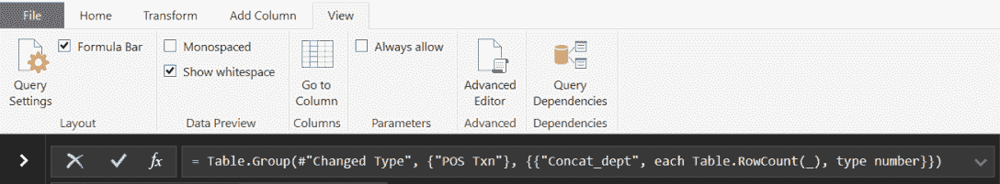

# Excel 中的数据挖掘模型实战示例

数据挖掘是关于在数据中寻找隐藏的模式和关联。如果数据量小，那么在合理的时间内只能由人类完成的大量分析，计算机可以在极短的时间内完成。在 Excel 2016 之前，可以安装一个名为**数据挖掘**的插件，它包含了许多可以用于获取洞察力和发现任何数据集中信息的方法和模型，通常作为黑盒使用。随后，微软改变了其政策，开始将这项功能迁移到云端，首先是 Office 365，最近则是 Azure。在 Excel 中，还可以使用内置函数甚至通过在**Visual Basic 应用程序**（**VBA**）中编写的宏来计算许多事情。在这里，我们将展示两个案例，说明数据挖掘如何帮助我们找到数据中隐藏的重要信息。

在本章中，我们将涵盖以下主题：

+   通过示例学习：市场篮子分析

+   通过示例学习：客户群体分析

市场篮子分析研究哪些产品/服务的组合经常被客户一起购买。客户群体分析分析在给定时间后仍然购买产品/服务的客户，以及哪些客户*流失*。

# 技术要求

为了完成本节，读者需要从 GitHub 仓库[`github.com/PacktPublishing/Hands-On-Machine-Learning-with-Microsoft-Excel-2019/tree/master/Chapter06`](https://github.com/PacktPublishing/Hands-On-Machine-Learning-with-Microsoft-Excel-2019/tree/master/Chapter06)下载`transactions_by_dept.csv`和`cohort_input_data.csv`文件。

# 通过示例学习 – 市场篮子分析

我们几乎在每一个在线商店都读过这句话：“购买此产品的顾客还购买了...”。这一切始于 20 世纪 90 年代的亚马逊，如今已经非常普遍。同样的原则甚至正在实体店中进行测试，顾客可以根据他们的购物历史和与其他产品的相似性获得个性化的购买建议。这些技术通常被称为交叉销售，它们很有用，因为通常向现有客户销售附加产品比获取新客户更容易。

在本节中，我们将展示市场篮子分析的简化示例，这是这些推荐系统背后的数据挖掘技术类型。结果可能不如更先进的方法准确，但仍然有助于解释该方法并教授如何提升它。

我们将使用从[`data.world/`](https://data.world/)下载的商业交易列表。首先，按照常规方式加载`transactions_by_dept.csv`文件。导航到数据 | 从文本/CSV，并选择该文件。

您需要编辑 Power Query 中的表格，将第一列的数据类型更改为文本，因为它包含交易 ID，Excel 可能会将其解释为数字并截断。

结果表看起来像这样：


在这个特定的例子中，我们将只关注前两列。`POS Txn`包含交易 ID，而`Dept`显示交易发生的部门描述。我们的目标是找出同一个客户在一次交易中在不同部门购物的频率。

在我们的发现中，我们将看到明显的、无趣的组合；可以解释和利用的意外组合（例如，在相关部门购物时提供该部门销售的产品），以及我们无法解释的组合（可能偶然发生或需要进一步调查）。

为了开始我们的分析，我们需要做以下事情：

1.  按交易编号分组所有交易。

1.  构建一个包含每次特定购买中访问的所有部门的列表。

要执行这些任务，我们将使用 Power Query 功能，按照以下步骤进行：

1.  导航到数据 | 从表/范围。

1.  在继续之前，请确保`POS Txn`列的数据类型设置为文本。

1.  点击“分组”*.* 您将看到以下弹出窗口：


1.  选择按`POS Txn`分组，将新列的名称改为有意义的名称，例如`Concat_dept`（因为我们正在尝试将一次购买中访问的所有部门连接成一个字符串），并选择任何操作*.* 点击窗口右下角的“确定”按钮，类似于前面截图所示。

1.  手动更改计算公式以获取我们想要的数据转换。导航到视图并确保公式栏被选中。如果没有，请选中它，您将看到以下公式：

*= Table.Group(#"Changed Type", {"POS Txn"}, {{"Concat_dept", each Table.RowCount(_), type number}})*

以下截图显示了前面的公式：



1.  必须将公式替换为以下内容：

*= Table.Group(#"Changed Type", {"POS Txn"}, {{"Concat_dept", each Text.Combine([Dept]," | "), type text}})*

不同之处在于，我们不是在表中计数行（*Table.RowCount*），而是使用*"|"*作为分隔符进行连接（*Text.Combine*）。我们还更改了输出类型为*text*。输出应类似于以下内容：


对于每个交易 ID，我们现在有一个表示涉及部门的字符串列表。我们将使用这个表来计算部门的组合，但首先，我们将它转换为范围：

1.  在表格中的任何单元格上右键单击，然后转到 表格 | 转换为范围。

1.  将工作表重命名为`Concat depts`（使用相同的名称，以确保未来函数中的引用正确）。

在实际生活中，我们可能需要限制我们分析的时间段以减少所需的计算量并清理数据，排除异常交易（异常值）。在我们的案例中，我们将限制研究的组合数量。我们可以按对、三元组或更大的数字来选择部门。问题是组合的数量会随着部门数量的增加而迅速增加。实际上，这个数字可以按以下方式计算：


在这里，`*m*`是元素的总数，`*n*`是每个组合中的元素数量。这个计算考虑到了元素不能重复（与自己比较没有意义），并且顺序无关紧要。

我们将根据交易数量选出前 10 个部门，并使用 Excel 函数计算组合。为了做到这一点，请执行以下步骤：

1.  创建一个如图所示的 PivotTable：


1.  按交易数量排序行以获取前 10 名：

```py
0982:SPIRITS
0973:CANDY
0962:BEVERAGES
0597:HEALTH AIDS
0983:WINE
0991:TOBACCO
0836:HOUSEHOLD CLEANING
0604:PERSONAL CARE
0603:BEAUTY CARE
0984:BEER
```

我们如何轻松构建两个部门的所有可能组合？如果我们正确定义单元格内容并使用 Excel 内置的复制功能，这很简单。

假设有 10 个部门列在单元格*A1:A10*中。然后按照以下步骤操作：

1.  创建两个新的列，你可以将其标记为`X`和`Y`。

1.  将列`X`的第一个单元格定义为`*=$A$1*`，将列`Y`的第一个单元格定义为`*=A2.*`

1.  选择这两个单元格并将它们复制到`Y`列显示空值之前。记住，`*$*`符号在复制时固定单元格值。

1.  你将得到一个如图所示的列表，包含所有可能的部门`X-Y`对：


1.  在此列表中的最后一个单元格之后，将`X`定义为`*= $A$2*`，将`Y`定义为`*= A3*`。

1.  重复复制操作。如果你继续复制，直到将`X`定义为`*= $A$9*`和`Y`定义为`*= A10*`，你将得到完整的组合列表。

1.  元素的总数应如下所示：


返回到我们的`Concat depts`工作表，我们需要计算每个对在相同交易（`X`和`Y`）中出现的交易数量以及每个部门出现的次数。我们将定义两个函数：

1.  在这里，我们假设连接后的部门名称位于`Concat depts`工作表的列*B*中（这就是为什么需要这样命名的原因；如果你理解了函数，你可以更改名称），列*C*和*D*分别包含`X`和`Y`列表。两个`COUNTIF`函数考虑到了部门名称可能以不同的顺序出现，如下面的公式所示：

*X&Y = =COUNTIF('Concat depts'!$B$2:$B$2065;"*"&C2&"*"&D2&"*")+COUNTIF('Concat depts'!$B$2:$B$2065;"*"&D2&"*"&C2&"*")*

1.  我们将复制以下公式，直到达到最后一个元素，即数字`45`：

*X = COUNTIF('Concat depts'!$B$2:$B$2065;"*"&C2&"*")*

1.  我们将计算以下内容：

*支持 = X&Y/N*

*自信 = X&Y/X*

在这里，*N*是交易的总数。*支持*表示规则（部门组合）在数据中的频率，而*置信度*是对涉及`X`和`Y`部门同时进行的交易的条件概率的估计。将这两个列相加，我们得到以下截图所示的表格，显示了计算结果：


我们刚刚进行的计算是 Apriori 算法的基础，该算法由 R. Agrawal 和 R. Srikant 于 1994 年发表，用于在数据集中寻找频繁项集的布尔关联规则，之所以命名为 Apriori 算法，是因为它使用了频繁项集属性的先验知识。Apriori 算法在挖掘频繁项集和相关的关联规则方面也非常有用。通常，这个算法用于操作包含大量交易的数据库，例如顾客在超市购买的商品。它帮助顾客轻松地进行购买，并提高了商店的销售业绩。重要的是要注意，商品之间的相关性并不一定意味着因果关系；例如，购买一个商品会导致某人购买另一个商品。

在现实场景中，我们会选择支持度和置信度超过一定阈值的组合，并研究这些见解。除了明显的规则，例如在同一笔购买中在酒水和葡萄酒部门购物的规则之外，我们还会发现我们没有预料到的其他组合。主要目的是找到可操作的见解；也就是说，我们可以采取行动的见解。我们可以提供新产品，将它们组合在促销活动中，并在不同的地方进行广告。

有大量的可能性。重要的是，机器已经学会了隐藏的关联，并为我们提供了关于我们自己的业务的有用信息。极其重要的是，不仅机器学习专家是这些分析的一部分，而且参与业务的人也应该提供他们的看法，并利用他们的经验和知识将此信息转化为经济利益。

是否可以在 Excel 中完成全面分析？如果我们无法访问更高级的工具，我们应该限制自己使用玩具模型吗？当然不是！Excel 功能极其强大，能够用于高级分析，但我们需要知道如何在宏中编写一点 VBA 代码。

现在应该已经清楚市场篮子分析的概念了，我们可以继续到另一个客户行为分析的例子。

# 通过实例学习 - 客户群体分析

对一个公司的客户及其行为获得洞察的一个极好方式是进行分段分析。这些分段是具有相同特征的客户组，通常被称为 **队列**。它们的定义在很大程度上取决于我们正在处理的企业类型。

我们将分析的数据集包含客户 ID 列表、他们首次从我们这里购买东西的日期、他们离开我们的日期以及每月平均花费金额。在这个上下文中，“离开我们”是什么意思？这主要是一个定义问题。例如，如果我们指的是信用卡，我们可能会认为客户在取消卡片时离开，或者我们可能想更进一步，如果客户连续两三个月没有花费任何钱，我们认为他们已经离开了。

然后，我们的分组将基于开始日期。我们将研究在给定时间段内有多少客户 **流失**，或者放弃了我们。

**客户终身价值**（**LTV**）通常指的是客户在我们这里整个期间产生的毛利润。这两个分析一起帮助我们决定哪些客户我们必须保留，以及哪些行动在获取更多有价值客户（就每月支出和忠诚度而言）方面更有效。

分析包括以下步骤：

1.  读取 `cohort_input_data.csv` 输入文件，导航到数据 | 从文本/CSV，并选择它。

1.  如果我们选择 *month-year* 格式，两个日期列 `Date in` 和 `Date out` 会看起来更好，也更易于理解。选择这些列，右键单击它们，然后点击格式单元格。会出现一个弹出窗口，如下面的截图所示：


1.  添加两列：`Cohort`，在这种情况下等于 `Date in`，以及 `Active months`，我们可以按以下方式计算：

*=DATEDIF(B2;C2;"m")*

这假设列 *B* 包含 `Data in` 值，列 *C* 包含 `Data out` 值。

1.  将此公式复制到剩余的单元格中。按 `Date in` 排序的结果表格如下：


1.  将此工作表重命名为 `Customer data` 以便将来参考。

首先，我们将研究在给定队列的生命周期内我们保留客户的情况如何。每个组都会告诉我们哪些行动需要重复，哪些需要避免以防止客户流失。我们将使用 *COUNTIFS* Excel 函数来计算每个队列每月活跃客户的数量：

1.  创建一个包含 48 行的矩阵，从零到我们数据集中月份的最大差异（48 个月），以及每月一列，从 `Feb-15` 到 `Jan-19`。以下截图展示了此矩阵的一个示例：


1.  在表格末尾添加一行，使用以下公式计算每个队列中客户总数：

*=COUNTIF('Customer* data'!$E$2:$E$751;"="&C$1)

这是因为`Customer data`工作表的*C*列包含队列列表，而矩阵的第一行包含我们的矩阵中的队列列表。

1.  将单元格内容复制到表格右侧的所有单元格中，由于行是固定的，因此每个列的正确值都会被计算出来，如下截图所示：


1.  在矩阵的第一个单元格中，输入以下公式：

*=COUNTIFS('Customer data'!$E$2:$E$751;"="&C$1;'Customer data'!$C$2:$C$751;">"&EOMONTH(C$1;$B1))/C$52*

让我们详细看看这意味着什么：

+   +   我们只计算如果*C1*（`Feb-15`，当前队列）的内容是`Customer data`工作表*C*列中队列列表的一部分。

    +   我们计算`Date out`（`Customer data`工作表的*C*列）是否大于当前队列加上*B*列中的月份数。我们使用*EOMONTH*函数来处理可能作为输入的完整日期，而不仅仅是月份和年份。请在 Excel 帮助中查看此函数的定义。

    +   我们最后将这个值除以客户总数，得到一个百分比。

1.  将公式复制到整个矩阵。

1.  将单元格格式化为百分比。

1.  使用三色刻度条件格式化单元格。结果如下截图所示：


例如，我们可以看到在 20 个月后，`Feb-15`获得的客户中只有 19%仍然存在。颜色刻度还显示，某些队列的流失速度比其他队列快。现在，业务专家需要评估在每个时间段采取了哪些行动，并重复或更改它们。

我们现在知道我们能够保留多少客户，但他们的价值是多少？他们的消费金额并不相同，因此我们需要将这个变量包含在分析中。按照以下步骤操作：

1.  创建一个类似的矩阵，包含月份和队列，但现在我们将使用不同的公式：

*=SUMIFS('Customer* data'!$D$2:$D$751;'Customer data'!$E$2:$E$751;"="&C$1;'Customer data'!$C$2:$C$751;">"&EOMONTH(C$1;$B1))

这个公式意味着，只有当以下两个条件都满足时，我们才会在`Customer data`工作表的`D`列上对值进行求和：

+   +   如果总和值对应于*C1*队列

    +   如果`Date out`大于当前队列，即客户仍然在我们这里，那么：

1.  将单元格值复制到整个矩阵。

1.  以与之前类似的方式格式化表格，以得到一个彩色矩阵，如下截图所示：


在这种情况下，我们可以看到每个队列随时间变化的消费金额，这与原始客户数量略有不同。

# 摘要

在本章中，我们学习了两种数据挖掘技术：市场篮子分析和顾客群体分析。第一种技术基于顾客行为告诉我们店铺部门或产品之间的隐藏关系。第二种技术显示了顾客数量的时间演变，揭示了不同顾客细分市场或群体之间的差异。

有大量数据挖掘分析可以帮助我们深入挖掘数据集，找到隐藏信息，这对于我们理解业务和做出正确决策至关重要。

在下一章中，我们将详细研究一种特殊的数据集：时间序列。我们将看到它需要不同类型的建模和分析。

# 问题

1.  在市场篮子分析中，如何避免无法解释的随机关联？

1.  如果我们在某个店铺中找到两种产品或两个部门之间的相关性，这种相关性能否推广到其他地方？

1.  群体矩阵中的一些列从某个特定日期开始显示零。这在当前数据集的背景下意味着什么？

1.  群体矩阵的最后几行持续显示零。这在当前数据集的背景下意味着什么？

1.  随着时间的推移，你如何最大化顾客的消费金额？

# 进一步阅读

+   《*数据库营销：分析和管理顾客*》由 Robert C. Blattberg，Byung-Do Kim，Scott A Neslin 著

+   《*数据科学商业应用：你需要了解的数据挖掘和数据分析思维，第 1 版*》，由 Foster Provost，Tom Fawcett 著
