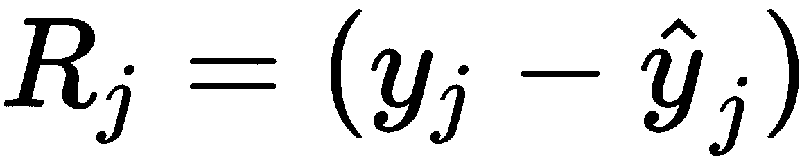
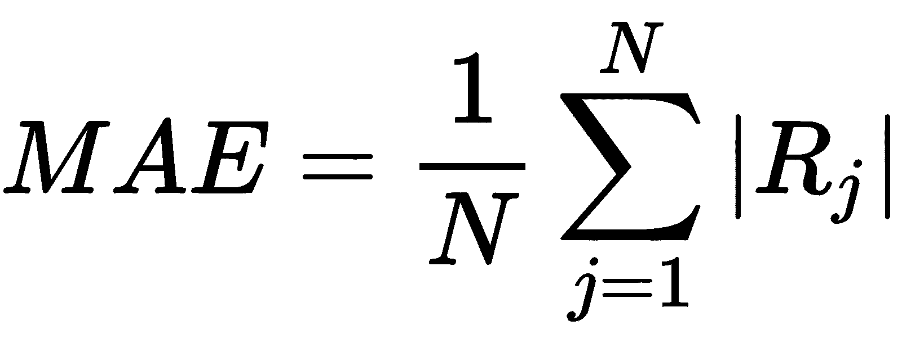
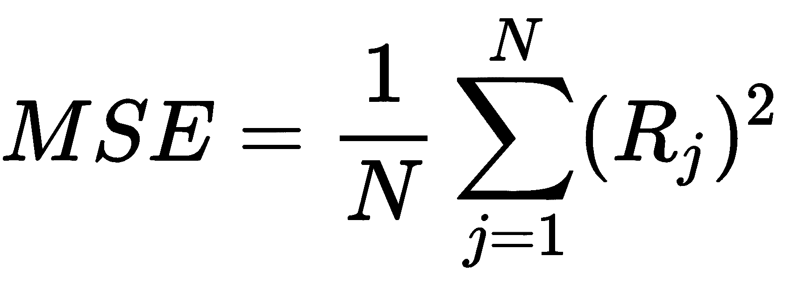
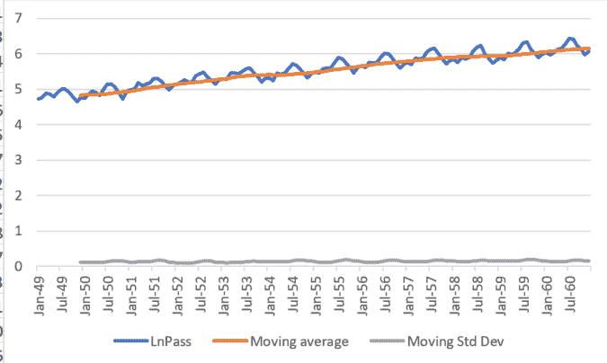

# 评估

# 第一章，实现机器学习算法

1.  在传统的编程中，在计算机上开发和运行的代码是一系列逐步的指令，告诉计算机做什么以及如何处理不同的选项。机器学习是向计算机展示数据示例，要么通过示例教会它做什么，要么让它学习数据中隐藏的信息。

1.  机器学习模型可以是回归（如果目标变量是数值且连续）或分类（如果目标变量是分类或离散）。

1.  通过示例学习，在标记数据上训练的模型被称为监督机器学习模型。相比之下，那些在未标记数据中寻找信息的模型被称为无监督机器学习模型。

1.  创建和使用机器学习模型时需要遵循的主要步骤如下：

    1.  获取数据并合并不同的数据源

    1.  清洗数据

    1.  初步分析和特征工程

    1.  尝试不同的模型和每个模型的参数，使用完整数据集的一部分进行训练，并使用剩余部分进行测试

    1.  将模型部署，以便可以在连续的分析流程中使用，而不仅仅是进行小规模的、孤立的测试

    1.  预测新输入数据的值

1.  R[j]残差是数据点 j 的 y 值与为该点拟合的回归线的值之间的差异：

**平均绝对误差**（**MAE**）定义为以下：

**均方误差**（**MSE**）定义为以下：

1.  欠拟合是指一个无法表示数据集特征的模型。即使这看起来是正确的，它完全缺乏泛化能力。过拟合是指一个与训练数据拟合得太好的模型，它缺乏泛化能力，并且在对不同的数据集进行测试时是错误的。

1.  需要将它们首先编码为二进制变量。

# 第二章，机器学习模型的实战示例

1.  编码将准备分类特征，以便将它们输入到机器学习模型中，并且不假设编码值之间有任何先前的相关性。

1.  通过设置树长度的限制或定义一个最小的熵值。

1.  `Temperature_hot`均匀分布；两个值以`Train_outside` = yes 结尾，两个值以`Train_outside` = no 结尾。这代表了最大熵值，其中没有关于温度热时应该做什么的明确信息。

1.  在决定是否在户外训练时，会考虑以下`IF`语句：

    +   如果天气晴朗且无风，那么可以在户外训练。

    +   如果天气是晴朗且风大，那么不要在户外训练。

    +   如果天气是阴天，那么在户外训练。

    +   如果天气是雨天且湿度高，那么不要在户外训练。

    +   如果天气是雨天且湿度正常，那么就在外面训练。

应该清楚，这个图表只是一个示例，并不涵盖从数据表中可以得出的所有可能性。

1.  聚类的分布将取决于初始质心的选择。有更高级的构建聚类的方法，以避免这个问题。

1.  视觉聚类基于二维图表，它只显示两个变量之间的关系。数值分析考虑了数据中的所有维度。

# 第四章，从不同数据源导入数据到 Excel

1.  任何不会与文件内容混淆的字符。

1.  机器学习模型的输出将受到缺失或不正确数据条目的影响，并且应使用正确的格式。

1.  导入 Excel 文件将打开 Power Query 界面以预处理数据。

1.  以表格形式呈现的数据。

1.  可以在[`gist.github.com/gelisam/13d04ac5a54b577b2492785c1084281f`](https://gist.github.com/gelisam/13d04ac5a54b577b2492785c1084281f)找到详尽的列表。

1.  可以在[`stackoverflow.com/questions/38120895/database-vs-file-system-storage`](https://stackoverflow.com/questions/38120895/database-vs-file-system-storage)找到示例。

# 第四章，数据清洗和初步数据分析

1.  与手动构建决策树相比，深入研究 Azure Machine Learning Studio 中内置的示例可能会更有趣，该示例在第十章，*Azure 和 Excel - 云端机器学习*中展示过。

1.  `cabin`和`fare`，`pclass`和`fare`，`home.dest`和`fare`是一些例子。

1.  缺失值可以用变量的平均值来替换。

1.  数据集中的任何不平衡都被称为偏差。这会影响任何机器学习模型的结果，因为模型将找到更多给定类别的示例或对特定目标值的某种倾向。

1.  例如，你可以尝试使用散点图查看变量之间的相关性。

# 第五章，相关性及变量的重要性

1.  例如，你可以在*x*轴上构建一个包含分类值的图表，在*y*轴上构建一个包含数值的图表；任何相关性都会从这个图表中清晰可见。

1.  应该很容易让读者构建图表并理解变量之间的关系。

1.  不。这意味着当一个变量增加时，另一个变量会减少。

1.  这种格式在第六章，*Excel 中的数据挖掘模型实战示例*中使用过。

1.  我们计算了**平方误差**（**SSE**）为*([@mpg]-[@prediction])²*。我们还需要计算的另一个和是*SST = ([@mpg]-average([@prediction]))²*。然后，我们计算*R² = 1-SSE/SST*。

1.  你可以尝试使用指数函数（*EXP()*)或形状相似的其他函数。由于数据分散度非常高，R²值可能仍然远低于 1。

# 第六章，Excel 中的数据挖掘模型实战示例

1.  使用之前对业务的了解来排除这些关联。

1.  不一定。这类分析通常依赖于业务领域，甚至是我们执行它们的特定地点。这意味着某些结果可以推广，但通常并非所有结果都可以。

1.  这意味着没有客户在列出的时间开始购买产品，并且在行所示的时间段后继续购买。

1.  没有这样的老客户（从客户时间来看）。

1.  例如，关注那些停止购买的用户，并针对他们进行广告活动。

# 第七章，实现时间序列

1.  通过将`increasing(TravelDate)`设置为计算中的移动平均值，并遵循相同的步骤。

1.  如果季节性与数据中的真实值差异太大，那么预测的准确性将降低。如果我们增加置信区间，那么误差也会增加。

1.  使用 Excel 中的`COVARIANCE.P`函数。

1.  应用对数变换后，时间序列图将看起来像以下截图：

趋势仍在上升，但标准差看起来很平坦，并且不依赖于时间。

# 第八章，在图表、直方图和地图中可视化数据

1.  很难区分不同的饼图部分。

1.  多行图表。

1.  您可以从[`openaddresses.io/`](https://openaddresses.io/)获取数据，并遵循本文中的说明：[`www.roguegeographer.com/create-your-own-maps-using-excel-3d-maps/`](https://www.roguegeographer.com/create-your-own-maps-using-excel-3d-maps/)。

1.  虽然可以这样做并得到结果，但准确性会很差。选举的结果主要取决于数据未考虑到的外部因素，而不是过去选举的历史结果。

# 第九章，人工神经网络

1.  结果将取决于人工神经网络训练。您可以在第一章的*评估模型*子节中找到逐步说明，*实现机器学习算法*。

1.  数据集不平衡，这会影响结果。

# 第十章，Azure 和 Excel - 云端机器学习

1.  成本、速度、全球规模、生产力、性能和安全。

1.  云计算对许多不同的应用程序都很有用，实际上可以取代所有在本地构建的东西，从数据库到可视化。

1.  网络服务是托管在互联网上的应用程序，可以通过预定义的协议和数据格式与其他应用程序进行通信。使用网络服务的优势在于它们易于共享，并且独立于操作系统和编程语言。

1.  Azure 机器学习工作室需要输入数据格式，这来自输入数据模块。

1.  使用训练流程来训练模型并保存它。然后，在单独的流程中使用相同的模型进行预测，无需每次使用时都重新训练模型。

# 第十一章，机器学习的未来

1.  模型训练和测试被数据挖掘所取代，它通过尝试从数据中获取有用信息来工作。

1.  新数据持续包含到数据流中，并且在将其输入到机器学习模型之前必须完成整个循环。

1.  在开始学习过程之前设置超参数值，并定义模型的某些特性（例如，人工神经网络训练模型中的周期数）。

1.  以下步骤可以通过 AutoML 自动执行：

    +   数据预处理

    +   特征工程

    +   模型选择

    +   模型超参数优化

    +   模型结果分析
