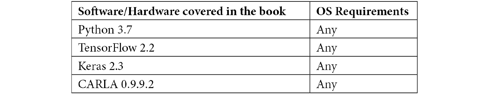

# 前言

自动驾驶汽车很快就会出现在我们身边。这个领域的进步可以说是非凡的。我第一次听说自动驾驶汽车是在 2010 年，当时我在东京的丰田展销厅试驾了一辆。这次行程的费用大约是一美元。汽车行驶得非常慢，显然依赖于道路中嵌入的传感器。

快进几年，激光雷达和计算机视觉以及深度学习的发展使这项技术看起来原始且不必要地侵入和昂贵。

在本书的进程中，我们将使用 OpenCV 来完成各种任务，包括行人检测和车道检测；你将发现深度学习，并学习如何利用它进行图像分类、目标检测和语义分割，使用它来识别行人、汽车、道路、人行道和红绿灯，同时了解一些最有影响力的神经网络。

你将熟悉使用 CARLA 模拟器，你将使用它通过行为克隆和 PID 控制器来控制汽车；你将了解网络协议、传感器、摄像头，以及如何使用激光雷达来绘制你周围的世界并找到你的位置。

在深入探讨这些令人惊叹的技术之前，请花一点时间，尝试想象 20 年后的未来。汽车会是什么样子？它们可以自动驾驶。但它们也能飞行吗？是否还有红绿灯？这些汽车的速度、重量和价格如何？我们如何使用它们，使用频率如何？自动驾驶的公交车和卡车又如何？

我们无法预知未来，但可以想象自动驾驶汽车以及一般意义上的自动驾驶事物将以新的和令人兴奋的方式塑造我们的日常生活和城市。

你想在这个未来中扮演一个积极的角色吗？如果是这样，请继续阅读。这本书可能是你旅程的第一步。

# 这本书面向的对象

本书涵盖了构建自动驾驶汽车所需的多方面内容，旨在为任何编程语言（最好是 Python）有基本知识的程序员编写。不需要深度学习方面的先前经验；然而，为了完全理解最先进的章节，查看一些推荐的阅读材料可能会有所帮助。与*第十一章*，*绘制我们的环境*相关的可选源代码是用 C++编写的。

# 这本书涵盖的内容

*第一章*，*OpenCV 基础和相机标定*，是 OpenCV 和 NumPy 的介绍；你将学习如何操作图像和视频，以及如何使用 OpenCV 检测行人；此外，它还解释了相机的工作原理以及如何使用 OpenCV 对其进行标定。

*第二章*，*理解和处理信号*，描述了不同类型的信号：串行、并行、数字、模拟、单端和差分，并解释了一些非常重要的协议：CAN、以太网、TCP 和 UDP。

*第三章*，*车道检测*，教你如何使用 OpenCV 检测道路上的车道。它涵盖了颜色空间、透视校正、边缘检测、直方图、滑动窗口技术和获取最佳检测所需的过滤。

*第四章*，*使用神经网络的深度学习*，是神经网络的实用介绍，旨在快速教授如何编写神经网络。它描述了神经网络的一般原理，特别是卷积神经网络。它介绍了 Keras，一个深度学习模块，并展示了如何使用它来检测手写数字和分类一些图像。

*第五章*，*深度学习工作流程*，理想情况下与*第四章*，*使用神经网络的深度学习*相辅相成，因为它描述了神经网络的原理以及在典型工作流程中所需的步骤：获取或创建数据集，将其分为训练集、验证集和测试集，数据增强，分类器中使用的主体层，以及如何训练、推理和重新训练。本章还涵盖了欠拟合和过拟合，并解释了如何可视化卷积层的激活。

*第六章*，*改进你的神经网络*，解释了如何优化神经网络，减少其参数，以及如何使用批量归一化、早停、数据增强和 dropout 来提高其准确性。

*第七章*，*检测行人和交通灯*，向您介绍 CARLA，一个自动驾驶汽车模拟器，我们将用它来创建交通灯数据集。使用名为 SSD 的预训练神经网络，我们将检测行人、汽车和交通灯，并使用称为迁移学习的高级技术来训练神经网络，以根据颜色对交通灯进行分类。

*第八章*，*行为克隆*，解释了如何训练一个神经网络来驾驶 CARLA。它解释了什么是行为克隆，如何使用 CARLA 构建驾驶数据集，如何创建适合此任务的网络，以及如何训练它。我们将使用显著性图来了解网络正在学习的内容，并将其与 CARLA 集成以帮助它实现自动驾驶！

第九章，“语义分割”，是关于深度学习的最后一章，也是最高级的一章，它解释了什么是语义分割。它详细介绍了一个非常有趣的架构 DenseNet，并展示了如何将其应用于语义分割。

第十章，“转向、油门和制动控制”，是关于控制自动驾驶汽车的内容。它解释了控制器是什么，重点介绍了 PID 控制器，并涵盖了 MPC 控制器的基础知识。最后，我们将在 CARLA 中实现 PID 控制器。

第十一章，“映射我们的环境”，是最后一章。它讨论了地图、定位和激光雷达，并描述了一些开源的地图工具。您将了解什么是同时定位与地图构建（SLAM），以及如何使用 Ouster 激光雷达和 Google Cartographer 来实现它。

# 为了充分利用这本书

我们假设您具备基本的 Python 知识，并且熟悉您操作系统的 shell。您应该安装 Python，并可能使用虚拟环境来匹配书中使用的软件版本。建议使用 GPU，因为没有 GPU 时训练可能会非常耗时。Docker 将有助于第十一章，“映射我们的环境”。

请参考以下表格了解书中使用的软件：



如果您使用的是这本书的数字版，我们建议您亲自输入代码或通过 GitHub 仓库（下一节中提供链接）访问代码。这样做将帮助您避免与代码复制粘贴相关的任何潜在错误。

# 下载示例代码文件

您可以从 GitHub（[`github.com/PacktPublishing/Hands-On-Vision-and-Behavior-for-Self-Driving-Cars`](https://github.com/PacktPublishing/Hands-On-Vision-and-Behavior-for-Self-Driving-Cars)）下载本书的示例代码文件。如果代码有更新，它将在现有的 GitHub 仓库中更新。

我们还有其他来自我们丰富的图书和视频目录的代码包，可在[`github.com/PacktPublishing/`](https://github.com/PacktPublishing/)找到。查看它们吧！

# 代码实战

本书的相关代码实战视频可在[`bit.ly/2FeZ5dQ`](https://bit.ly/2FeZ5dQ)查看。

# 下载彩色图片

我们还提供了一份包含书中使用的截图/图表的彩色图片 PDF 文件。您可以从这里下载：

[`static.packt-cdn.com/downloads/9781800203587_ColorImages.pdf`](https://static.packt-cdn.com/downloads/9781800203587_ColorImages.pdf)

# 使用的约定

本书使用了多种文本约定。

`文本中的代码`: 表示文本中的代码单词、数据库表名、文件夹名、文件名、文件扩展名、路径名、虚拟 URL、用户输入和 Twitter 昵称。以下是一个示例：“Keras 在模型中提供了一个获取概率的方法，`predict()`，以及一个获取标签的方法，`predict_classes()`。”

代码块设置如下：

```py
img_threshold = np.zeros_like(channel)
img_threshold [(channel >= 180)] = 255
```

当我们希望您注意代码块中的特定部分时，相关的行或项目将被设置为粗体：

```py
[default]
exten => s,1,Dial(Zap/1|30)
exten => s,2,Voicemail(u100)
exten => s,102,Voicemail(b100)
exten => i,1,Voicemail(s0)
```

任何命令行输入或输出都应如下编写：

```py
/opt/carla-simulator/
```

**粗体**: 表示新术语、重要单词或您在屏幕上看到的单词。例如，菜单或对话框中的单词在文本中显示如下。以下是一个示例：“**参考轨迹**是受控变量的期望轨迹；例如，车辆在车道中的横向位置。”

小贴士或重要注意事项

看起来像这样。

# 联系我们

我们欢迎读者的反馈。

**一般反馈**: 如果您对这本书的任何方面有疑问，请在邮件主题中提及书名，并将邮件发送至 customercare@packtpub.com。

**勘误**: 尽管我们已经尽最大努力确保内容的准确性，但错误仍然可能发生。如果您在这本书中发现了错误，如果您能向我们报告，我们将不胜感激。请访问 [www.packtpub.com/support/errata](http://www.packtpub.com/support/errata)，选择您的书籍，点击勘误提交表单链接，并输入详细信息。

**盗版**: 如果您在互联网上以任何形式发现我们作品的非法副本，如果您能提供位置地址或网站名称，我们将不胜感激。请通过版权@packtpub.com 与我们联系，并提供材料的链接。

**如果您有兴趣成为作者**: 如果您在某个领域有专业知识，并且您有兴趣撰写或为书籍做出贡献，请访问 [authors.packtpub.com](http://authors.packtpub.com)。

# 评论

请留下评论。一旦您阅读并使用了这本书，为何不在您购买它的网站上留下评论呢？潜在读者可以查看并使用您的客观意见来做出购买决定，Packt 公司可以了解您对我们产品的看法，我们的作者也可以看到他们对书籍的反馈。谢谢！

有关 Packt 的更多信息，请访问 [packt.com](http://packt.com)。
