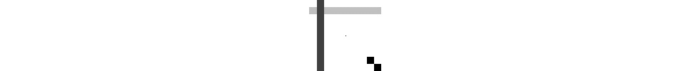

# *第一章*：OpenCV 基础和相机标定

本章是关于 OpenCV 的介绍，以及如何在自动驾驶汽车管道的初期阶段使用它，以摄取视频流并为其下一阶段做准备。我们将从自动驾驶汽车的角度讨论摄像头的特性，以及如何提高我们从中获得的质量。我们还将研究如何操作视频，并尝试 OpenCV 最著名的功能之一，即目标检测，我们将用它来检测行人。

通过本章，您将建立如何使用 OpenCV 和 NumPy 的坚实基础，这在以后将非常有用。

在本章中，我们将涵盖以下主题：

+   OpenCV 和 NumPy 基础知识

+   读取、操作和保存图像

+   读取、操作和保存视频

+   操作图像

+   如何使用 HOG 检测行人

+   摄像头的特性

+   如何进行相机标定

# 技术要求

对于本章中的说明和代码，您需要以下内容：

+   Python 3.7

+   opencv-Python 模块

+   NumPy 模块

本章的代码可以在以下位置找到：

[`github.com/PacktPublishing/Hands-On-Vision-and-Behavior-for-Self-Driving-Cars/tree/master/Chapter1`](https://github.com/PacktPublishing/Hands-On-Vision-and-Behavior-for-Self-Driving-Cars/tree/master/Chapter1)

本章的“代码在行动”视频可以在以下位置找到：

[`bit.ly/2TdfsL7`](https://bit.ly/2TdfsL7)

# OpenCV 和 NumPy 简介

OpenCV 是一个计算机视觉和机器学习库，它已经发展了 20 多年，提供了令人印象深刻的众多功能。尽管 API 中存在一些不一致，但其简单性和实现的算法数量惊人，使其成为极其流行的库，并且在许多情况下都是最佳选择。

OpenCV 是用 C++编写的，但提供了 Python、Java 和 Android 的绑定。

在这本书中，我们将专注于 Python 的 OpenCV，所有代码都使用 OpenCV 4.2 进行测试。

Python 中的 OpenCV 由`opencv-python`提供，可以使用以下命令安装：

```py
pip install opencv-python
```

OpenCV 可以利用硬件加速，但要获得最佳性能，您可能需要从源代码构建它，使用与默认值不同的标志，以针对您的目标硬件进行优化。

## OpenCV 和 NumPy

Python 绑定使用 NumPy，这增加了灵活性，并使其与许多其他库兼容。由于 OpenCV 图像是 NumPy 数组，您可以使用正常的 NumPy 操作来获取有关图像的信息。对 NumPy 的良好理解可以提高性能并缩短您的代码长度。

让我们直接通过一些 NumPy 在 OpenCV 中的快速示例来深入了解。

## 图像大小

可以使用`shape`属性检索图像的大小：

```py
print("Image size: ", image.shape)
```

对于 50x50 的灰度图像，`image.shape()`会返回元组(50, 50)，而对于 RGB 图像，结果将是(50, 50, 3)。

拼音错误

在 NumPy 中，`size`属性是数组的字节数；对于一个 50x50 的灰度图像，它将是 2,500，而对于相同的 RGB 图像，它将是 7,500。`shape`属性包含图像的大小——分别是(50, 50)和(50, 50, 3)。

## 灰度图像

灰度图像由一个二维 NumPy 数组表示。第一个索引影响行(*y*坐标)和第二个索引影响列(*x*坐标)。*y*坐标的起点在图像的顶部角落，而*x*坐标的起点在图像的左上角。

使用`np.zeros()`可以创建一个黑色图像，它将所有像素初始化为 0：

```py
black = np.zeros([100,100],dtype=np.uint8)  # Creates a black image
```

之前的代码创建了一个大小为(100, 100)的灰度图像，由 10,000 个无符号字节组成(`dtype=np.uint8`)。

要创建一个像素值不为 0 的图像，你可以使用`full()`方法：

```py
white = np.full([50, 50], 255, dtype=np.uint8)
```

要一次性改变所有像素的颜色，可以使用`[:]`表示法：

```py
img[:] = 64        # Change the pixels color to dark gray
```

要只影响某些行，只需要在第一个索引中提供一个行范围：

```py
img[10:20] = 192   # Paints 10 rows with light gray
```

之前的代码改变了第 10-20 行的颜色，包括第 10 行，但不包括第 20 行。

同样的机制也适用于列；你只需要在第二个索引中指定范围。要指示 NumPy 包含一个完整的索引，我们使用之前遇到的`[:]`表示法：

```py
img[:, 10:20] = 64 # Paints 10 columns with dark gray
```

你也可以组合行和列的操作，选择一个矩形区域：

```py
img[90:100, 90:100] = 0  # Paints a 10x10 area with black
```

当然，可以操作单个像素，就像在普通数组中做的那样：

```py
img[50, 50] = 0  # Paints one pixel with black
```

使用 NumPy 选择图像的一部分，也称为**感兴趣区域**(**ROI**)是可能的。例如，以下代码从位置(90, 90)复制一个 10x10 的**ROI**到位置(80, 80)：

```py
roi = img[90:100, 90:100]
img[80:90, 80:90] = roi 
```

以下为之前操作的结果：



图 1.1 – 使用 NumPy 切片对图像进行的一些操作

要复制一张图片，你可以简单地使用`copy()`方法：

```py
image2 = image.copy()
```

## RGB 图像

RGB 图像与灰度图像不同，因为它们是三维的，第三个索引代表三个通道。请注意，OpenCV 以 BGR 格式存储图像，而不是 RGB，所以通道 0 是蓝色，通道 1 是绿色，通道 2 是红色。

重要提示

OpenCV 将图像存储为 BGR，而不是 RGB。在本书的其余部分，当谈到 RGB 图像时，它仅意味着它是一个 24 位彩色图像，但内部表示通常是 BGR。

要创建一个 RGB 图像，我们需要提供三个尺寸：

```py
rgb = np.zeros([100, 100, 3],dtype=np.uint8)  
```

如果你打算用之前在灰度图像上运行的相同代码来运行新的 RGB 图像（跳过第三个索引），你会得到相同的结果。这是因为 NumPy 会将相同的颜色应用到所有三个通道上，这会导致灰色。

要选择一个颜色，只需要提供第三个索引：

```py
rgb[:, :, 2] = 255       # Makes the image red
```

在 NumPy 中，也可以选择非连续的行、列或通道。您可以通过提供一个包含所需索引的元组来完成此操作。要将图像设置为洋红色，需要将蓝色和红色通道设置为`255`，这可以通过以下代码实现：

```py
rgb[:, :, (0, 2)] = 255  # Makes the image magenta
```

您可以使用`cvtColor()`将 RGB 图像转换为灰度图像：

```py
gray = cv2.cvtColor(original, cv2.COLOR_BGR2GRAY)
```

# 处理图像文件

OpenCV 提供了一个非常简单的方式来加载图像，使用`imread()`：

```py
import cv2
image = cv2.imread('test.jpg')
```

要显示图像，可以使用`imshow()`，它接受两个参数：

+   要写在显示图像的窗口标题上的名称

+   要显示的图像

不幸的是，它的行为不符合直觉，因为它不会显示图像，除非后面跟着对`waitKey()`的调用：

```py
cv2.imshow("Image", image)cv2.waitKey(0)
```

在`imshow()`之后调用`waitKey()`将有两个效果：

+   它实际上允许 OpenCV 显示`imshow()`提供的图像。

+   它将等待指定的毫秒数，或者如果经过的毫秒数`<=0`，则等待直到按键。它将无限期等待。

可以使用`imwrite()`方法将图像保存到磁盘上，该方法接受三个参数：

+   文件名

+   该图像

+   一个可选的格式相关参数：

```py
cv2.imwrite("out.jpg", image)
```

有时，将多张图片并排放置非常有用。本书中的一些示例将广泛使用此功能来比较图像。

OpenCV 为此提供了两种方法：`hconcat()`用于水平拼接图片，`vconcat()`用于垂直拼接图片，两者都接受一个图像列表作为参数。以下是一个示例：

```py
black = np.zeros([50, 50], dtype=np.uint8)white = np.full([50, 50], 255, dtype=np.uint8)cv2.imwrite("horizontal.jpg", cv2.hconcat([white, black]))cv2.imwrite("vertical.jpg", cv2.vconcat([white, black]))
```

这里是结果：


图 1.2 – 使用 hconcat()进行水平拼接和 vconcat()进行垂直拼接

我们可以使用这两个方法来创建棋盘图案：

```py
row1 = cv2.hconcat([white, black])row2 = cv2.hconcat([black, white])cv2.imwrite("chess.jpg", cv2.vconcat([row1, row2]))
```

您将看到以下棋盘图案：


图 1.3 – 使用 hconcat()结合 vconcat()创建的棋盘图案

在处理完图像后，我们就可以开始处理视频了。

# 处理视频文件

在 OpenCV 中使用视频非常简单；实际上，每一帧都是一个图像，可以使用我们已分析的方法进行操作。

要在 OpenCV 中打开视频，需要调用`VideoCapture()`方法：

```py
cap = cv2.VideoCapture("video.mp4")
```

之后，您可以通过调用`read()`（通常在一个循环中），来检索单个帧。该方法返回一个包含两个值的元组：

+   当视频结束时为 false 的布尔值

+   下一帧：

```py
ret, frame = cap.read()
```

要保存视频，有`VideoWriter`对象；其构造函数接受四个参数：

+   文件名

+   视频编码的四字符代码（FOURCC）

+   每秒帧数

+   分辨率

以下是一个示例：

```py
mp4 = cv2.VideoWriter_fourcc(*'MP4V')writer = cv2.VideoWriter('video-out.mp4', mp4, 15, (640, 480))
```

一旦创建了`VideoWriter`对象，就可以使用`write()`方法将一帧添加到视频文件中：

```py
writer.write(image)
```

当你完成使用 `VideoCapture` 和 `VideoWriter` 对象后，你应该调用它们的释放方法：

```py
cap.release()
writer.release()
```

## 使用网络摄像头

在 OpenCV 中，网络摄像头被处理得类似于视频；你只需要为 `VideoCapture` 提供一个不同的参数，即表示网络摄像头的 0 基索引：

```py
cap = cv2.VideoCapture(0)
```

之前的代码打开了第一个网络摄像头；如果你需要使用不同的一个，你可以指定一个不同的索引。

现在，让我们尝试操作一些图像。

# 操作图像

作为自动驾驶汽车计算机视觉管道的一部分，无论是否使用深度学习，你可能需要处理视频流，以便其他算法作为预处理步骤更好地工作。

本节将为你提供一个坚实的基础，以预处理任何视频流。

## 翻转图像

OpenCV 提供了 `flip()` 方法来翻转图像，它接受两个参数：

+   图像

+   一个可以是 1（水平翻转）、0（垂直翻转）或 -1（水平和垂直翻转）的数字

让我们看看一个示例代码：

```py
flipH = cv2.flip(img, 1)flipV = cv2.flip(img, 0)flip = cv2.flip(img, -1)
```

这将产生以下结果：


图 1.4 – 原始图像，水平翻转，垂直翻转，以及两者都翻转

正如你所见，第一幅图像是我们的原始图像，它被水平翻转和垂直翻转，然后两者同时翻转。

## 模糊图像

有时，图像可能太嘈杂，可能是因为你执行的一些处理步骤。OpenCV 提供了多种模糊图像的方法，这有助于这些情况。你很可能不仅要考虑模糊的质量，还要考虑执行的速率。

最简单的方法是 `blur()`，它对图像应用低通滤波器，并且至少需要两个参数：

+   图像

+   核心大小（更大的核心意味着更多的模糊）：

```py
blurred = cv2.blur(image, (15, 15))
```

另一个选项是使用 `GaussianBlur()`，它提供了更多的控制，并且至少需要三个参数：

+   图像

+   核心大小

+   `sigmaX`，它是 X 轴上的标准差

建议指定 `sigmaX` 和 `sigmaY`（Y 轴上的标准差，第四个参数）：

```py
gaussian = cv2.GaussianBlur(image, (15, 15), sigmaX=15, sigmaY=15)
```

一个有趣的模糊方法是 `medianBlur()`，它计算中值，因此具有只发出图像中存在的颜色像素（这不一定发生在前一种方法中）的特征。它有效地减少了“盐和胡椒”噪声，并且有两个强制参数：

+   图像

+   核心大小（一个大于 1 的奇数整数）：

```py
median = cv2.medianBlur(image, 15)
```

此外，还有一个更复杂的过滤器 `bilateralFilter()`，它在去除噪声的同时保持边缘清晰。这是最慢的过滤器，并且至少需要四个参数：

+   图像

+   每个像素邻域的直径

+   `sigmaColor`：在颜色空间中过滤 sigma，影响像素邻域内不同颜色混合的程度

+   `sigmaSpace`：在坐标空间中过滤 sigma，影响颜色比 `sigmaColor` 更接近的像素如何相互影响：

```py
bilateral = cv2.bilateralFilter(image, 15, 50, 50)
```

选择最佳过滤器可能需要一些实验。你可能还需要考虑速度。以下是基于我的测试结果和一些基于参数的性能依赖性的大致估计，请注意：

+   `blur()` 是最快的。

+   `GaussianBlur()` 类似，但它可能比 blur() 慢 2 倍。

+   `medianBlur()` 可能会比 `blur()` 慢 20 倍。

+   `BilateralFilter()` 是最慢的，可能比 `blur()` 慢 45 倍。

下面是结果图像：


图 1.5 – 原图、blur()、GaussianBlur()、medianBlur() 和 BilateralFilter()，以及代码示例中使用的参数

## 改变对比度、亮度和伽玛

一个非常有用的函数是 `convertScaleAbs()`，它会对数组的所有值执行多个操作：

+   它们乘以缩放参数，`alpha`。

+   它们加上增量参数，`beta`。

+   如果结果是 255 以上，则将其设置为 255。

+   结果被转换为无符号 8 位整型。

该函数接受四个参数：

+   源图像

+   目标（可选）

+   用于缩放的 `alpha` 参数

+   `beta` 增量参数

`convertScaleAbs()` 可以用来影响对比度，因为大于 1 的 `alpha` 缩放因子会增加对比度（放大像素之间的颜色差异），而小于 1 的缩放因子会减少对比度（减少像素之间的颜色差异）：

```py
cv2.convertScaleAbs(image, more_contrast, 2, 0)cv2.convertScaleAbs(image, less_contrast, 0.5, 0)
```

它也可以用来影响亮度，因为 `beta` 增量因子可以用来增加所有像素的值（增加亮度）或减少它们（减少亮度）：

```py
cv2.convertScaleAbs(image, more_brightness, 1, 64)
cv2.convertScaleAbs(image, less_brightness, 1, -64)
```

让我们看看结果图像：


图 1.6 – 原图、更高对比度（2x）、更低对比度（0.5x）、更高亮度（+64）和更低亮度（-64）

改变亮度的一种更复杂的方法是应用伽玛校正。这可以通过使用 NumPy 进行简单计算来完成。伽玛值大于 1 会增加亮度，而伽玛值小于 1 会减少亮度：

```py
Gamma = 1.5
g_1_5 = np.array(255 * (image / 255) ** (1 / Gamma), dtype='uint8')
Gamma = 0.7
g_0_7 = np.array(255 * (image / 255) ** (1 / Gamma), dtype='uint8')
```

将产生以下图像：


图 1.7 – 原图、更高伽玛（1.5）和更低伽玛（0.7）

你可以在中间和右边的图像中看到不同伽玛值的效果。

## 绘制矩形和文本

在处理目标检测任务时，突出显示一个区域以查看检测到的内容是一个常见需求。OpenCV 提供了 `rectangle()` 函数，它至少接受以下参数：

+   图像

+   矩形的左上角

+   矩形的右下角

+   应用的颜色

+   （可选）线条粗细：

```py
cv2.rectangle(image, (x, y), (x + w, y + h), (255, 255, 255), 2)
```

要在图像中写入一些文本，你可以使用`putText()`方法，至少需要接受六个参数：

+   图像

+   要打印的文本

+   左下角的坐标

+   字体样式

+   缩放因子，用于改变大小

+   颜色：

```py
cv2.putText(image, 'Text', (x, y), cv2.FONT_HERSHEY_PLAIN, 2, clr)
```

# 使用 HOG 进行行人检测

**方向梯度直方图（HOG**）是 OpenCV 实现的一种目标检测技术。在简单情况下，它可以用来判断图像中是否存在某个特定对象，它在哪里，有多大。

OpenCV 包含一个针对行人训练的检测器，你将使用它。它可能不足以应对现实生活中的情况，但学习如何使用它是很有用的。你也可以用更多图像训练另一个检测器，看看它的表现是否更好。在本书的后面部分，你将看到如何使用深度学习来检测不仅行人，还有汽车和交通灯。

## 滑动窗口

OpenCV 中的 HOG 行人检测器使用的是 48x96 像素的模型，因此它无法检测比这更小的对象（或者，更好的说法是，它可以，但检测框将是 48x96）。

HOG 检测器的核心有一个机制，可以判断给定的 48x96 像素图像是否为行人。由于这并不特别有用，OpenCV 实现了一个滑动窗口机制，其中检测器被多次应用于略微不同的位置；考虑的“图像窗口”稍微滑动一下。一旦分析完整个图像，图像窗口就会增加大小（缩放），然后再次应用检测器，以便能够检测更大的对象。因此，检测器对每个图像应用数百次甚至数千次，这可能会很慢。

## 使用 OpenCV 的 HOG

首先，你需要初始化检测器并指定你想要使用该检测器进行行人检测：

```py
hog = cv2.HOGDescriptor()det = cv2.HOGDescriptor_getDefaultPeopleDetector()
hog.setSVMDetector(det)
```

然后，只需调用`detectMultiScale()`函数：

```py
(boxes, weights) = hog.detectMultiScale(image, winStride=(1, 1), padding=(0, 0), scale=1.05)
```

我们使用的参数需要一些解释，如下所示：

+   图像

+   `winStride`，窗口步长，指定每次滑动窗口移动的距离

+   填充，可以在图像边界的周围添加一些填充像素（对于检测靠近边界的行人很有用）

+   缩放，指定每次增加窗口图像的大小

你应该考虑`winSize`可以提升准确性（因为考虑了更多位置），但它对性能有较大影响。例如，步长为（4，4）可以比步长为（1，1）快 16 倍，尽管在实际应用中，性能差异要小一些，可能只有 10 倍。

通常，**减小缩放**可以提高精度并降低性能，尽管影响并不显著。

提高精度意味着检测到更多行人，但这也可能增加误报。`detectMultiScale()`有几个高级参数可以用于此：

+   `hitThreshold`，它改变了从**支持向量机**（**SVM**）平面所需距离。阈值越高，意味着检测器对结果越有信心。

+   `finalThreshold`，它与同一区域内的检测数量相关。

调整这些参数需要一些实验，但一般来说，较高的`hitThreshold`值（通常在 0–1.0 的范围内）应该会减少误报。

较高的`finalThreshold`值（例如 10）也会减少误报。

我们将在由 Carla 生成的行人图像上使用`detectMultiScale()`。


图 1.8 – HOG 检测，winStride=(1, 2)，scale=1.05，padding=(0, 0) 左：hitThreshold = 0，finalThreshold = 1；中：hitThreshold = 0，inalThreshold = 3；右：hitThreshold = 0.2，finalThreshold = 1

如你所见，我们在图像中检测到了行人。使用较低的 hit 阈值和 final 阈值可能导致误报，如左图所示。你的目标是找到正确的平衡点，检测行人，同时避免有太多的误报。

## 相机简介

相机可能是我们现代世界中最普遍的传感器之一。它们在我们的手机、笔记本电脑、监控系统以及当然，摄影中都被广泛应用。它们提供了丰富的、高分辨率的图像，包含关于环境的广泛信息，包括空间、颜色和时间信息。

没有什么奇怪的，它们在自动驾驶技术中被广泛使用。相机之所以如此受欢迎，其中一个原因就是它反映了人眼的功能。正因为如此，我们非常习惯于使用它们，因为我们与它们的功能、局限性和优点在深层次上建立了联系。

在本节中，你将学习以下内容：

+   相机术语

+   相机的组成部分

+   优缺点

+   选择适合自动驾驶的相机

让我们逐一详细讨论。

## 相机术语

在学习相机的组成部分及其优缺点之前，你需要了解一些基本术语。这些术语在评估和最终选择你的自动驾驶应用中的相机时将非常重要。

### 视场（FoV）

这是环境（场景）中传感器可见的垂直和水平角部分。在自动驾驶汽车中，你通常希望平衡视场与传感器的分辨率，以确保我们尽可能多地看到环境，同时使用最少的相机。视场存在一个权衡空间。较大的视场通常意味着更多的镜头畸变，你需要在相机校准中进行补偿（参见相机校准部分）：


图 1.9 – 视场，来源：[`www.researchgate.net/figure/Illustration-of-camera-lenss-field-of-view-FOV_fig4_335011596`](https://www.researchgate.net/figure/Illustration-of-camera-lenss-field-of-view-FOV_fig4_335011596)

### 分辨率

这是传感器在水平和垂直方向上的像素总数。这个参数通常使用**百万像素**（**MP**）这个术语来讨论。例如，一个 5 MP 的相机，如 FLIR Blackfly，其传感器有 2448 × 2048 像素，相当于 5,013,504 像素。

更高的分辨率允许你使用具有更宽视场角（FoV）的镜头，同时仍然提供运行你的计算机视觉算法所需的细节。这意味着你可以使用更少的相机来覆盖环境，从而降低成本。

Blackfly，以其各种不同的版本，由于成本、小型化、可靠性、鲁棒性和易于集成，是自动驾驶汽车中常用的相机：


图 1.10 – 像素分辨率

### 焦距

这是从镜头光学中心到传感器的长度。焦距最好理解为相机的变焦。较长的焦距意味着你将更靠近环境中的物体进行放大。在你的自动驾驶汽车中，你可能需要根据你在环境中的需求选择不同的焦距。例如，你可能选择一个相对较长的 100 毫米焦距，以确保你的分类器算法能够检测到足够远的交通信号，以便汽车能够平稳、安全地停车：


图 1.11 – 焦距，来源：[`photographylife.com/what-is-focal-length-in-photography`](https://photographylife.com/what-is-focal-length-in-photography)

### 光圈和光圈值

这是光线通过以照亮传感器的开口。通常用来描述开口大小的单位是光圈，它指的是焦距与开口大小的比率。例如，一个焦距为 50 毫米、光圈直径为 35 毫米的镜头将等于 f/1.4 的光圈。以下图示展示了不同光圈直径及其在 50 毫米焦距镜头上的光圈值。光圈大小对你的自动驾驶汽车非常重要，因为它与**景深**（**DoF**）直接相关。大光圈还允许相机对镜头上的遮挡物（例如，虫子）具有容忍性：更大的光圈允许光线绕过虫子并仍然到达传感器：


图 1.12 – 光圈，来源：[`en.wikipedia.org/wiki/Aperture#/media/File:Lenses_with_different_apertures.jpg`](https://en.wikipedia.org/wiki/Aperture#/media/File:Lenses_with_different_apertures.jpg)

### 景深（DoF）

这是环境中将要聚焦的距离范围。这直接关联到光圈的大小。通常情况下，在自动驾驶汽车中，你希望有较深的景深，以便你的计算机视觉算法能够聚焦视野中的所有物体。问题是，深景深是通过小光圈实现的，这意味着传感器接收到的光线较少。因此，你需要平衡景深、动态范围和 ISO，以确保你能看到环境中所需看到的一切。

以下图示展示了景深与光圈之间的关系：


图 1.13 – 景深与光圈对比，来源：[`thumbs.dreamstime.com/z/aperture-infographic-explaining-depth-field-corresponding-values-their-effect-blur-light-75823732.jpg`](https://thumbs.dreamstime.com/z/aperture-infographic-explaining-depth-field-corresponding-values-their-effect-blur-light-75823732.jpg)

### 动态范围

这是传感器的一个属性，表示其对比度或它能解析的最亮与最暗主题之间的比率。这可能会用 dB（例如，78 dB）或对比度（例如，2,000,000/1）来表示。

自动驾驶汽车需要在白天和夜晚运行。这意味着传感器需要在黑暗条件下提供有用的细节，同时不会在明亮阳光下过度饱和。**高动态范围**（HDR）的另一个原因是当太阳在地平线较低时驾驶的情况。我相信你在早上开车上班时一定有过这样的经历，太阳正对着你的脸，你几乎看不到前面的环境，因为它已经让你的眼睛饱和了。HDR 意味着即使在直射阳光下，传感器也能看到环境。以下图示说明了这些条件：


图 1.14 – HDR 示例，来源：[`petapixel.com/2011/05/02/use-iso-numbers-that-are-multiples-of-160-when-shooting-dslr-video/`](https://petapixel.com/2011/05/02/use-iso-numbers-that-are-multiples-of-160-when-shooting-dslr-video/)

你的梦想动态范围

如果你可以许愿，并且在你的传感器中拥有你想要的任何动态范围，那会是什么？

### 国际标准化组织（ISO）灵敏度

这是像素对入射光子的敏感度。

*等一下*，你说，*你的缩写搞混了吗*？看起来是这样，但国际标准化组织决定连它们的缩写也要标准化，因为否则每种语言都会不同。谢谢，ISO！

标准化的 ISO 值可以从 100 到超过 10,000。较低的 ISO 值对应于传感器较低的灵敏度。现在你可能要问，“为什么我不想要最高的灵敏度？”好吧，灵敏度是有代价的……噪声。ISO 值越高，你会在图像中看到更多的噪声。这种额外的噪声可能会在尝试对物体进行分类时给你的计算机视觉算法带来麻烦。在下面的图中，你可以看到较高 ISO 值对图像噪声的影响。这些图像都是在镜头盖盖上（完全黑暗）的情况下拍摄的。随着 ISO 值的增加，随机噪声开始渗入：


图 1.15 – 暗室中的 ISO 值示例和噪声

### 帧率（FPS）

这是传感器获取连续图像的速率，通常以 Hz 或**每秒帧数**（FPS）表示。一般来说，你希望有最快的帧率，这样快速移动的物体在你的场景中就不会模糊。这里的主要权衡是延迟：从真实事件发生到你的计算机视觉算法检测到它的时间。必须处理的帧率越高，延迟就越高。在下面的图中，你可以看到帧率对运动模糊的影响。

模糊并不是选择更高帧率的唯一原因。根据你的车辆速度，你需要一个帧率，以便车辆能够在物体突然出现在其视场（FoV）中时做出反应。如果你的帧率太慢，当车辆看到某物时，可能已经太晚做出反应了：


图 1.16 – 120 Hz 与 60 Hz 帧率对比，来源：[`gadgetstouse.com/blog/2020/03/18/difference-between-60hz-90hz-120hz-displays/`](https://gadgetstouse.com/blog/2020/03/18/difference-between-60hz-90hz-120hz-displays/)

### 镜头眩光

这些是来自物体的光线在传感器上产生的伪影，这些伪影与物体在环境中的位置不相关。你可能在夜间驾驶时遇到过这种情况，当时你会看到迎面而来的车灯。那种星光效果是由于你的眼睛（或相机）的镜头中散射的光线，由于不完美，导致一些光子撞击了“像素”，而这些像素与光子来自的地方不相关——也就是说，是车灯。以下图示显示了这种效果。你可以看到星光效果使得实际物体，即汽车，非常难以看清！


图 1.17 – 迎面车灯产生的镜头眩光，来源：[`s.blogcdn.com/cars.aol.co.uk/media/2011/02/headlights-450-a-g.jpg`](https://s.blogcdn.com/cars.aol.co.uk/media/2011/02/headlights-450-a-g.jpg)

### 镜头畸变

这是直线或真实场景与你的相机图像所看到场景之间的区别。如果你曾经看过动作相机的视频，你可能已经注意到了“鱼眼”镜头效果。以下图示显示了广角镜头的极端畸变示例。你将学会如何使用 OpenCV 来纠正这种畸变：


图 1.18 – 镜头畸变，来源：[`www.slacker.xyz/post/what-lens-should-i-get`](https://www.slacker.xyz/post/what-lens-should-i-get)

## 相机的组成部分

就像眼睛一样，相机由光敏感阵列、光圈和镜头组成。

### 光敏感阵列 – CMOS 传感器（相机的视网膜）

在大多数消费级相机中，光敏感阵列被称为 CMOS 有源像素传感器（或简称传感器）。其基本功能是将入射光子转换为电信号，该信号可以根据光子的颜色波长进行数字化。

### 光圈（相机的光圈）

相机的光圈或瞳孔是光线通往传感器的通道。这可以是可变的或固定的，具体取决于你使用的相机类型。光圈用于控制诸如景深和到达传感器的光线量等参数。

### 镜头（相机的镜头）

镜头或光学元件是相机将环境中的光线聚焦到传感器上的组成部分。镜头主要通过其焦距决定相机的**视场角（FoV）**。在自动驾驶应用中，视场角非常重要，因为它决定了汽车单次使用一个摄像头可以看到多少环境。相机的光学元件通常是成本最高的部分之一，并对图像质量和镜头眩光有重大影响。

## 选择相机的考虑因素

现在你已经了解了摄像头的基本知识和相关术语，是时候学习如何为自动驾驶应用选择摄像头了。以下是在选择摄像头时你需要权衡的主要因素列表：

+   分辨率

+   视场角（FoV）

+   动态范围

+   成本

+   尺寸

+   防护等级（IP 等级）

    完美的摄像头

    如果你能设计出理想的摄像头，那会是什么样子？

我理想的自动驾驶摄像头将能够从所有方向（球形视场角，360º HFoV x 360º VFoV）看到。它将具有无限的分辨率和动态范围，因此你可以在任何距离和任何光照条件下以数字方式解析物体。它的大小将和一粒米一样，完全防水防尘，并且只需 5 美元！显然，这是不可能的。因此，我们必须对我们所需的东西做出一些谨慎的权衡。

从你的摄像头预算开始是最好的起点。这将给你一个关于要寻找哪些型号和规格的想法。

接下来，考虑你的应用需要看到什么：

+   当你以 100 km/h 的速度行驶时，你是否需要从 200 米外看到孩子？

+   你需要覆盖车辆周围多大的范围，你能否容忍车辆侧面的盲点？

+   你需要在夜间和白天都能看到吗？

最后，考虑你有多少空间来集成这些摄像头。你可能不希望你的车辆看起来像这样：


图 1.19 – 摄像头艺术，来源：[`www.flickr.com/photos/laughingsquid/1645856255/`](https://www.flickr.com/photos/laughingsquid/1645856255/)

这可能非常令人不知所措，但在思考如何设计你的计算机视觉系统时，这一点非常重要。一个很好的起点是 FLIR Blackfly S 系列，它非常受欢迎，在分辨率、帧率（FPS）和成本之间取得了极佳的平衡。接下来，搭配一个满足你视场角（FoV）需求的镜头。互联网上有一些有用的视场角计算器，例如来自[`www.bobatkins.com/photography/technical/field_of_view.html`](http://www.bobatkins.com/photography/technical/field_of_view.html)的计算器。

## 摄像头的优缺点

现在，没有任何传感器是完美的，即使是你的心头好摄像头也会有它的优点和缺点。让我们现在就来看看它们。

让我们先看看它的优势：

+   **高分辨率**：与其他传感器类型（如雷达、激光雷达和声纳）相比，摄像头在场景中识别物体时具有出色的分辨率。你很容易就能以相当低的价格找到具有 500 万像素分辨率的摄像头。

+   **纹理、颜色和对比度信息**：摄像头提供了其他传感器类型无法比拟的关于环境的丰富信息。这是因为摄像头能够感知多种波长的光。

+   **成本**：摄像头是你能找到的性价比最高的传感器之一，尤其是考虑到它们提供的数据质量。

+   **尺寸**：CMOS 技术和现代 ASIC 技术使得相机变得非常小，许多小于 30 立方毫米。

+   **范围**：这主要归功于高分辨率和传感器的被动性质。

接下来，这里有一些弱点：

+   **大量数据处理用于物体检测**：随着分辨率的提高，数据量也随之增加。这就是我们为了如此精确和详细的图像所付出的代价。

+   **被动**：相机需要一个外部照明源，如太阳、车头灯等。

+   **遮蔽物（如昆虫、雨滴、浓雾、灰尘或雪）**：相机在穿透大雨、雾、灰尘或雪方面并不特别擅长。雷达通常更适合这项任务。

+   **缺乏原生深度/速度信息**：仅凭相机图像本身无法提供关于物体速度或距离的任何信息。

    测绘学正在帮助弥补这一弱点，但代价是宝贵的处理资源（GPU、CPU、延迟等）。它也比雷达或激光雷达传感器产生的信息准确性低。

现在您已经很好地理解了相机的工作原理，以及其基本部分和术语，是时候动手使用 OpenCV 校准相机了。

# 使用 OpenCV 进行相机校准

在本节中，您将学习如何使用已知模式的物体，并使用 OpenCV 来纠正镜头扭曲。

记得我们在上一节中提到的镜头扭曲吗？您需要纠正这一点，以确保您能够准确地定位物体相对于车辆的位置。如果您不知道物体是在您前面还是旁边，那么看到物体对您没有任何好处。即使是好的镜头也可能扭曲图像，这尤其适用于广角镜头。幸运的是，OpenCV 提供了一个检测这种扭曲并纠正它的机制！

策略是拍摄棋盘的图片，这样 OpenCV 就可以使用这种高对比度图案来检测点的位置，并根据预期图像与记录图像之间的差异来计算扭曲。

您需要提供几张不同方向的图片。可能需要一些实验来找到一组好的图片，但 10 到 20 张图片应该足够了。如果您使用的是打印的棋盘，请确保纸张尽可能平整，以免影响测量：


图 1.20 – 一些可用于校准的图片示例

如您所见，中心图像清楚地显示了某些桶形扭曲。

## 扭曲检测

OpenCV 试图将一系列三维点映射到相机的二维坐标。然后，OpenCV 将使用这些信息来纠正扭曲。

首件事是初始化一些结构：

```py
image_points = []   # 2D points object_points = []  # 3D points coords = np.zeros((1, nX * nY, 3), np.float32)coords[0,:,:2] = np.mgrid[0:nY, 0:nX].T.reshape(-1, 2)
```

请注意`nX`和`nY`，它们分别是`x`和`y`轴上棋盘上要找到的点数。在实践中，这是方格数减 1。

然后，我们需要调用`findChessboardCorners()`：

```py
found, corners = cv2.findChessboardCorners(image, (nY, nX), None)
```

如果 OpenCV 找到了点，则`found`为真，`corners`将包含找到的点。

在我们的代码中，我们将假设图像已经被转换为灰度图，但您也可以使用 RGB 图片进行校准。

OpenCV 提供了一个很好的图像，展示了找到的角点，确保算法正在正常工作：

```py
out = cv2.drawChessboardCorners(image, (nY, nX), corners, True)object_points.append(coords)   # Save 3d points image_points.append(corners)   # Save corresponding 2d points
```

让我们看看结果图像：


图 1.21 – OpenCV 找到的校准图像的角点

## 校准

在几幅图像中找到角点后，我们最终可以使用`calibrateCamera()`生成校准数据。

```py
ret, mtx, dist, rvecs, tvecs = cv2.calibrateCamera(object_points, image_points, shape[::-1], None, None)
```

现在，我们准备使用`undistort()`校正我们的图像：

```py
dst = cv2.undistort(image, mtx, dist, None, mtx)
```

让我们看看结果：


图 1.22 – 原始图像和校准图像

我们可以看到，第二张图像的桶形畸变较少，但并不理想。我们可能需要更多和更好的校准样本。

但我们也可以通过在`findChessboardCorners()`之后寻找`cornerSubPix()`来尝试从相同的校准图像中获得更高的精度：

```py
corners = cv2.cornerSubPix(image, corners, (11, 11), (-1, -1), (cv2.TERM_CRITERIA_EPS + cv2.TERM_CRITERIA_MAX_ITER, 30, 0.001))
```

以下是为结果图像：


图 1.23 – 使用亚像素精度校准的图像

由于完整的代码有点长，我建议您在 GitHub 上查看完整的源代码。

# 摘要

嗯，你在通往制作真正自动驾驶汽车的计算机视觉之旅中已经取得了很好的开端。

你了解了一个非常有用的工具集，称为 OpenCV，它为 Python 和 NumPy 提供了绑定。有了这些工具，你现在可以使用`imread()`、`imshow()`、`hconcat()`和`vconcat()`等方法创建和导入图像。你学会了如何导入和创建视频文件，以及使用`VideoCapture()`和`VideoWriter()`方法从摄像头捕获视频。小心，斯皮尔伯格，镇上来了一个新的电影制作人！

能够导入图像是件好事，但如何开始操作它们以帮助你的计算机视觉算法学习哪些特征很重要呢？你通过`flip()`、`blur()`、`GaussianBlur()`、`medianBlur()`、`bilateralFilter()`和`convertScaleAbs()`等方法学会了如何这样做。然后，你学会了如何使用`rectangle()`和`putText()`等方法为人类消费标注图像。

然后，真正的魔法出现了，你学会了如何使用 HOG 检测行人来处理图像并完成你的第一个真正的计算机视觉项目。你学会了如何使用`detectMultiScale()`方法在图像上以不同大小的窗口滑动窗口来扫描检测器，使用参数如`winStride`、`padding`、`scale`、`hitThreshold`和`finalThreshold`。

你在使用图像处理的新工具时玩得很开心。但似乎还缺少了什么。我该如何将这些图像应用到我的自动驾驶汽车上？为了回答这个问题，你学习了关于相机及其基本术语，例如**分辨率**、**视场角**、**焦距**、**光圈**、**景深**、**动态范围**、**ISO**、**帧率**、**镜头眩光**，以及最后的**镜头畸变**。然后，你学习了组成相机的基本组件，即镜头、光圈和光敏阵列。有了这些基础知识，你继续学习如何根据相机的优缺点来选择适合你应用的相机。

带着这些知识，你勇敢地开始使用在 OpenCV 中学习的畸变校正工具来消除这些弱点之一，即镜头畸变。你使用了`findChessboardCorners()`、`calibrateCamera()`、`undistort()`和`cornerSubPix()`等方法来完成这项工作。

哇，你真的在朝着能够在自动驾驶应用中感知世界的方向前进。你应该花点时间为自己到目前为止所学到的感到自豪。也许你可以通过自拍来庆祝，并应用一些你所学的知识！

在下一章中，你将学习一些基本信号类型和协议，这些类型和协议在你尝试将传感器集成到自动驾驶应用中时可能会遇到。

# 问题

1.  OpenCV 能否利用硬件加速？

1.  如果 CPU 性能不是问题，最好的模糊方法是什么？

1.  哪个检测器可以用来在图像中找到行人？

1.  你该如何从网络摄像头中读取视频流？

1.  光圈和景深之间的权衡是什么？

1.  在什么情况下你需要高 ISO？

1.  为相机校准计算亚像素精度值得吗？
