# *第二章*：理解和处理信号

本章，你将了解你可能在集成你为项目选择的各种传感器时遇到的不同信号类型。你还将了解各种信号架构，本章将帮助你选择最适合你应用的一个。每个都有其陷阱、协议和规定。

本章我们将涵盖以下主题：

+   信号类型

+   模拟与数字

+   串行数据

+   CAN

+   UDP

+   TCP

到本章结束时，你将能够应用你对每个协议的理解。你将能够手动解码各种协议的串行数据以帮助调试信号。最重要的是，你将拥有应用开源工具为你做繁重工作的知识。

# 技术要求

要执行本章中的指令，你需要以下条件：

+   基本电气电路知识（关于电压、电流和电阻）

+   二进制、十六进制和 ASCII 编程知识

+   使用示波器探测传感器信号的经验

本章的代码可以在以下位置找到：

[`github.com/PacktPublishing/Hands-On-Vision-and-Behavior-for-Self-Driving-Cars/tree/master/Chapter2`](https://github.com/PacktPublishing/Hands-On-Vision-and-Behavior-for-Self-Driving-Cars/tree/master/Chapter2)

本章的“代码实战”视频可以在以下位置找到：

[`bit.ly/2HpFqZa`](https://bit.ly/2HpFqZa)

# 理解信号类型

当你集成自动驾驶汽车的传感器、执行器和控制器时，你会遇到许多不同的信号类型。你需要了解每种类型的优缺点，以帮助你选择正确的设备进行集成。接下来的几节将涵盖每种信号类型的所有细节，并为你提供做出正确选择的知识。

这里是你在机器人和自动驾驶汽车中会遇到的基本信号类型：

+   串行

+   并行

+   模拟

+   数字

+   单端

+   差分

在下一节中，你将学习模拟信号和数字信号之间的区别。

# 模拟与数字

首先要记住的是，我们生活在一个模拟的世界。没有什么是一瞬间发生的，一切都是连续的。这也是我们无法瞬间移动的原因，遗憾的是！

同样，模拟信号是连续且不断变化的；它们不会瞬间跳跃，而是平滑地从一种状态过渡到另一种状态。一个典型的模拟信号例子是古老的**调幅**（**AM**）收音机。你可以在下面的图中看到，平滑的数据信号是如何调制到平滑的载波上以创建平滑的 AM 信号。在这里，音调由振幅变化的快慢表示，音量由振幅的大小表示：

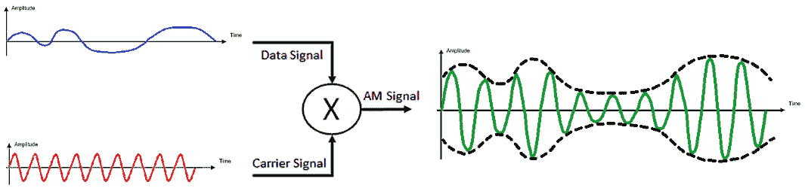

图 2.1 – 模拟信号示例

相比之下，数字信号是在已知的时间点采样的。当信号被采样时，它会检查是否高于或低于某个阈值，这将决定它是逻辑`0`还是`1`。你可以在下面的图中看到这个例子：

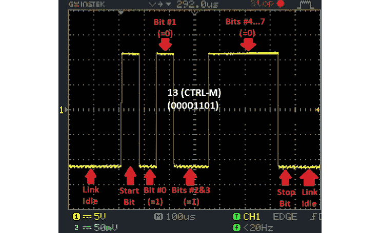

图 2.2 – 数字信号示例

模拟隐藏在数字中

尽管我们谈论数字是从一种状态跳到另一种状态，但实际上并不是。它只是非常快速地变化，但以模拟的方式。我们只是选择在脉冲中间采样它。世界总是模拟的，但有时我们以数字的方式解释它。

如果你仔细观察下面的图，你会看到隐藏在角落中的模拟特性！

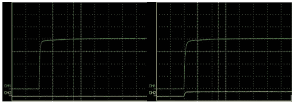

图 2.3 – 数字信号示波器 – 信号运行前后

你看到了吗？尽管这应该是电压之间的尖锐过渡，但你可以看到本应是方形角落的圆润。这是因为自然界中没有什么是瞬间的，一切都是从一种状态平滑过渡到另一种状态。

在下一节中，你将学习串行和并行数据传输之间的区别。

# 串行与并行

串行数据可能是最普遍的数据传输类型。这是我们人类习惯于沟通的方式。你现在就在这样做，当你阅读这段文字时。串行通信简单来说就是数据一次传输和接收一个单元（与并行传输多个数据单元相对）。

在阅读这本书的情况下，你的眼睛通过从左到右扫描每一行文本来逐字处理，然后回到下一行的开头并继续。你正在处理一个用于传达某些思想和观点的单词序列流。相反，想象一下如果你一次能读几行。这将被认为是并行数据传输，那将是非常棒的！

计算机中使用的单位是位，它是对开或关的二进制表示，更常见的是 1 或 0。

并行数据传输在计算机的早期年份很受欢迎，因为它允许通过多个（通常是 8 个）电线同时传输位，这大大提高了数据传输速度。这种速度是以几个代价为代价的。更多的电线意味着更多的重量、成本和噪音。由于这些多根电线通常相邻，你会在相邻的电线中产生大量的噪声，这被称为串扰。这种噪声导致传输距离缩短。以下图示了 8 位是串行传输还是并行传输：

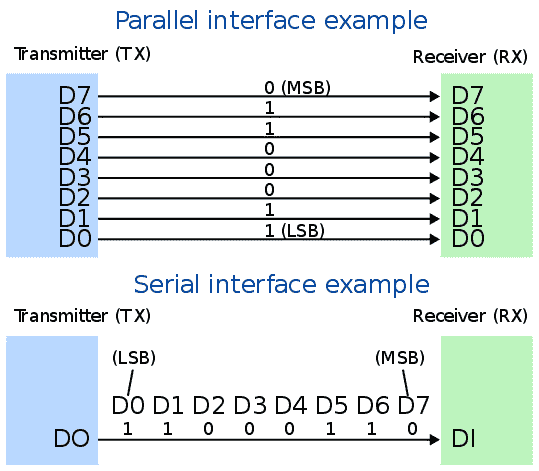

图 2.4 – 串行与并行

现在，你可以看到每根线都专门用于每个位。在早期计算中，当发送 8 位时，这没问题，但你可以想象，当考虑 32 位和 64 位数据时，这会变得多么难以管理。幸运的是，随着协议速度的提高，很明显串行传输要便宜得多，也更容易集成。这并不是说并行数据传输不存在；它确实存在于速度至关重要的应用中。

有几种类型的串行数据协议，如 UART、I2C、SPI、以太网和 CAN。在接下来的几节中，你将了解它们的介绍。

## 通用异步接收和发送（UART）

UART 是一个非常常见的协议，得益于其简单性和成本效益。许多低数据速率的应用程序会使用它来传输和接收数据。在自动驾驶应用中，你将看到 UART 的一个常见应用是时间同步到 GPS。一个包含所有位置和时间信息的 GPS 接收器消息将被发送到激光雷达、摄像头、雷达或其他传感器，以将它们同步到**协调世界时**（**UTC**）。

抱歉，我想你的缩写搞混了。

法国人英语人无法就缩写达成一致，所以与其在英语中使用 CUT 或法语中使用**TUC**（**Temps Universel Coordonné**），他们决定两者都混用，以不偏袒任何一种语言。如果我不能按照我的方式来，你也不能！就这样，UTC 诞生了！

好吧，那么 UART 看起来是什么样子？首先你需要理解的是，该协议是异步的，这意味着不需要时钟信号（线）。相反，两个设备各自必须拥有相当好的内部时钟来为自己计时。对，所以不需要时钟线；但你需要什么线？你只需要两根线：一根用于传输，一根用于接收。因此，在开始游戏之前，两个设备需要就一些基本规则达成一致：

1.  **波特率**：这设置了设备之间每秒交换的位数。换句话说，它是位计数的时间长度。常见的波特率有 9,600、19,200、38,400、57,600、115,200、128,000 和 256,000。

1.  **数据位**：这设置了数据帧中用于有效载荷（数据）的位数。

1.  **奇偶校验位**：这决定了数据包中是否会有奇偶校验位。这可以用来验证接收到的消息的完整性。这是通过计算数据帧中 1 的数量来完成的，如果 1 的数量是偶数，则将奇偶校验位设置为 0，如果是奇数，则设置为 1。

1.  **停止位**：这设置了表示数据包结束的停止位数。

1.  **流量控制**：这设置了你是否会使用硬件流量控制。这并不常见，因为它需要额外的两根线用于**准备发送**（**RTS**）和**清除发送**（**CTS**）。

很好，我们已经有了基本规则。现在让我们看看数据包的样子，然后再解码一个。

以下图示说明了 UART 消息数据包的结构。你可以看到我们从一个精确的起始比特（低电平）开始，然后是 5 到 9 个数据比特，如果规则中有奇偶校验位，则跟随奇偶校验位，最后是停止比特（1 到 2 个，高电平）。空闲状态通常是高电压状态，表示一个 `1`，而活动状态通常是低电平，表示一个 `0`。这是一个正常极性。如果需要，你可以反转极性，只要事先设定好规则：

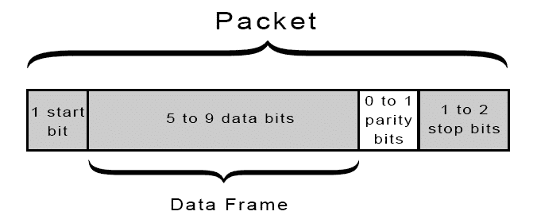

图 2.5 – UART 数据包结构

以下是一个示例信号波形，展示了如何使用八个数据比特、无奇偶校验和一个停止比特来解码比特。我们从空闲（高电平）状态开始，然后数据包以低电压位开始。这意味着接下来的八个比特是数据。接下来，我们看到五个高电压计数，表示五个 1 比特，然后是三个低电压计数，表示三个 0 比特。你应该知道 UART 消息是以最低有效位首先发送的，意味着最低的二进制值或 20 位，然后是 21 位，然后是 22 位，依此类推。所以，如果你将它们重新排列成人类可读的格式，你的数据消息是 0 0 0 1 1 1 1 1；转换成十进制，那将是 31 或十六进制的 1F。有关不同基数系统（如二进制、十进制和十六进制）的丰富资源，请参阅 [`www.mathsisfun.com/binary-decimal-hexadecimal.html`](https://www.mathsisfun.com/binary-decimal-hexadecimal.html)。还有另一个方便的资源，用于从二进制解码 ASCII 字符 [`www.asciitable.com/`](http://www.asciitable.com/)：

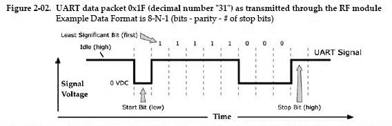

图 2.6 – UART 示例比特

蛋白质

拿出你的解码环。现在是学习生命、宇宙和万物意义的时候了...

太棒了，现在你知道如何解码 UART 串行消息了。

好吧，所以你可能想知道，*UART 如此简单，我为什么要使用其他任何东西呢？* 让我们来看看 UART 的优缺点。

优点如下：

+   便宜

+   全双工（同时发送和接收）

+   异步（没有时钟线）

+   简单，每个设备之间只有两根线

+   奇偶校验用于错误检查

+   广泛使用

缺点如下：

+   每个数据包的最大比特数为九比特。

+   设备时钟必须在彼此的 10% 以内。

+   按照现代标准，它的速度较慢，标准波特率从每秒 9,600 到 230,400 比特不等。

+   需要在每个设备之间建立直接连接，而不是总线架构。

+   起始和停止比特有一些开销，需要复杂的硬件来发送和接收。

如果你想通过 Python 获得 UART 的经验，你可以测试 UART 通信的最简单设备是 Arduino。如果你有，太好了！然后你可以直接跳转到 PySerial 的文档，开始与你的 Arduino 进行通信。如果你没有 Arduino，你可以在本书的仓库中找到一个示例模拟器代码，在`第二章`文件夹中：

[`github.com/PacktPublishing/Hands-On-Vision-and-Behavior-for-Self-Driving-Cars/tree/master/Chapter2`](https://github.com/PacktPublishing/Hands-On-Vision-and-Behavior-for-Self-Driving-Cars/tree/master/Chapter2)

接下来，你将了解使用 UART 消息的两种不同标准。

## 差分与单端

UART 信号可以通过几种不同的方式传输。最常见的是**推荐标准 232**（**RS-232**）和**推荐标准 422**（**RS-422**）。

RS-232 是一种单端信号，意味着它的电压直接与系统的电气地（0 V）比较。以下图显示了单端信号：

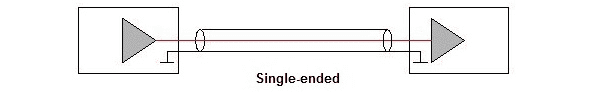

图 2.7 – 单端线

相比之下，RS-422 是一种差分信号，意味着电压是在系统电气地（地线）独立比较的：

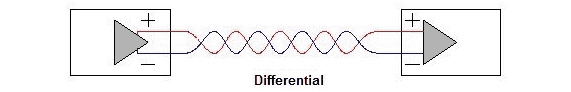

图 2.8 – 差分线

现在是故事时间...

从前，信号诞生了，它有一个使命：将发送者的信息传递到接收者居住的遥远之地。世界上充满了鬼怪，它们正在密谋对付我们的英雄信号。这些鬼怪和幽灵绊倒并扭曲了我们可怜的朋友信号。信号在旅途中行进得越远，这些坏蛋就越能偷偷潜入并造成破坏。一般来说，在短途旅行中，信号不受影响，相对无干扰地穿过魔法森林。然而，旅程越长，信号就越需要找到技巧、朋友和守护者，才能安全地到达接收器。

那么，这些鬼怪和幽灵是谁呢？它们是电磁场和感应电流。你看，每当一个幽灵电磁场靠近信号的路径（电线）时，它就会在路径上产生一个鬼怪（电流）。这个鬼怪随后使用它的魔法力量拉伸和收缩信号的臂，直到它到达目的地，接收器看到的信号的臂比它们应有的要短或长。

但不必害怕——技巧、朋友和守护者都在这里！信号有一个很好的小技巧来挫败鬼怪，但首先它必须产生一个双胞胎：我们可以称之为 langis（这是*信号*的倒写）。langis 和信号在前往接收器的路上相互缠绕。这使鬼怪困惑，导致它们产生两个相等但相反的鬼怪，它们无意中撞在一起并消失，在它们能够使用魔法力量之前。

另一个技巧是 langis 和信号都承诺无论遇到什么小妖精，他们都会始终手牵手一起旅行。所以，当他们到达目的地时，接收器只需测量 langis 和信号之间的距离来获取信息！

好吧，那么这个童话在现实生活中是什么样子呢？你不会只有一个传输线，而是使用两条线。然后你将一条线设置为高电压（V+），另一条线设置为低电压（V-）。现在当比较接收端的信号时，你测量 V+和 V-之间的电压差以确定你是否有高或低信号。以下图显示了单端信号（1a）和差分信号（1b）：

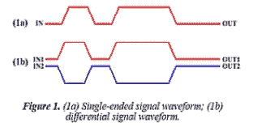

图 2.9 – 单端信号与差分信号

这有一个美妙的效果，即任何感应噪声都会以相同的方式影响 V+和 V-，所以当你测量 V+和 V-之间的差异时，它不会改变它发送时的状态。以下图展示了这种情况：

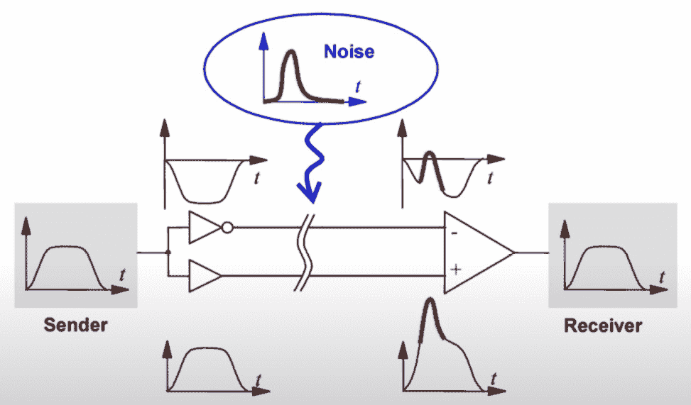

图 2.10 – 差分线的噪声

另一个技巧是将差分对的两个线绕在一起。这会抵消线中任何感应电流。以下插图显示了直通电缆和绞合对电缆电流之间的差异。你可以看到，在每次绞合时，线会交换位置，因此噪声电流在每次绞合时交替，从而有效地相互抵消：

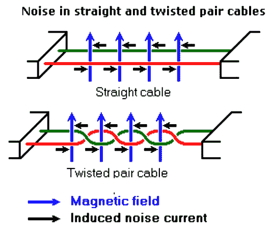

图 2.11 – 差分绞合对电缆的噪声消除

那么，当你选择单端和差分时，这一切对你意味着什么呢？

这里有一个比较表以供参考：

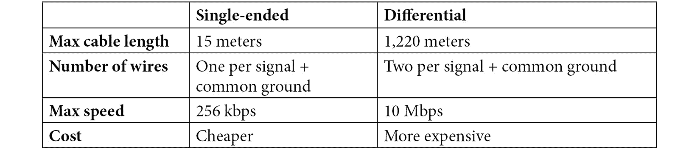

表 2.1

在下一节中，你将了解另一种形式的串行通信，它可以使事情加快一些，还有一些非常实用的好处。

## I2C

**I2C**，或称 I2C，代表**互集成电路**，是另一种具有一些酷炫新特性的串行数据传输协议。更多关于这些内容稍后介绍。I2C 通常用于在单个**印刷电路板**（**PCB**）上的组件之间进行通信。它声称数据传输速率为 100-400 kHz，这通常得到支持，规范甚至为高达 5 MHz 的通信留有空间，尽管这在许多设备上并不常见得到支持。

你可能会问，“为什么使用 I2C？UART 已经非常简单和容易了。” 好吧，I2C 添加了一些非常酷的特性，这些特性在 UART 中是没有的。回想一下，UART 需要在每个设备之间连接两根线，这意味着你需要为每个你想与之通信的设备准备一个连接器。当你想要连接多个设备时，这会迅速变成一个难以管理的线网。此外，在 UART 中，也没有主从设备的概念，因为设备直接在各自的 Tx 和 Rx 线上相互交谈。以下图示将展示一个完全连接的 UART 架构的例子：

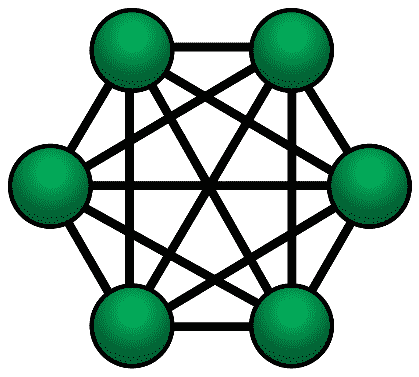

图 2.12 – 完全连接的 UART 网络

I2C 来拯救！I2C 也只使用两根线：一根**串行时钟线**（**SCL**）和一根**串行数据线**（**SDA**）——稍后我们将详细介绍这些是如何工作的。它使用这两根线来在设备之间设置一个新的架构，即总线。总线简单地说是一组共享的线，将信号传输到所有连接到它们的设备。以下插图将帮助我们更好地理解这一点：

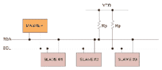

图 2.13 – I2C 总线架构

这允许多个设备之间相互交谈，而不需要每个设备到它需要与之交谈的每个其他设备的专用线路。

你可能正在想，*大家怎么能都在同一条线上说话并且理解任何东西呢？* I2C 协议实现了主从设备的概念。主设备通过向所有人宣布来控制通信流程，*嘿，大家注意了，我在和 RasPi1 说话，请确认你在那里，然后发送数据给我！* 然后，主设备将控制权交给 RasPi1，它迅速喊道，*我在这里，已经理解了请求！这是你请求的数据；请确认你已收到*。然后主设备说，*收到了！* 然后这个过程重新开始。以下是一个 I2C 交换的时序图：

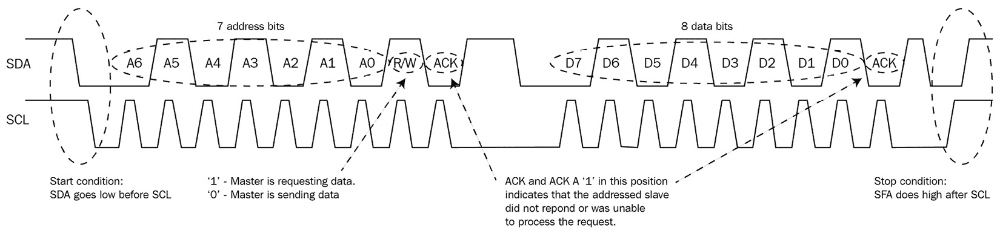

图 2.14 – I2C 时序图

让我们通过一个通信序列来了解一下。这个序列从主设备将 SDA 线拉低，然后是 SCL 线拉低开始。这标志着开始条件。接下来的 7-10 位（取决于你的设置）是正在交谈的从设备的地址。下一个位，R/W 位，指示从设备要么写入（逻辑 0）要么从（逻辑 1）其内存寄存器读取。R/W 位之后的位是确认（ACK）位。如果被寻址的从设备听到了、理解了、确认了，并且将响应请求，那么它就会设置这个位。然后主设备将在 SCL 线上继续生成脉冲，同时从设备或主设备开始将数据放置在 SDA 上的八个数据位上。

大位在前

与 UART 相反，I2C 中的位是先传输 MSB（最高有效位）。

例如，如果 R/W 位被设置为 0，从设备将接收放置在 SDA 上的数据并将其写入内存。紧随八位数据之后，从设备将 SDA 线拉低一个时钟周期以确认它已接收数据、存储数据并准备好将 SDA 线的控制权交还给主设备。此时，主设备将 SDA 线拉低。最后，为了停止序列，主设备将释放 SCL，然后是 SDA。

当这么多设备可以同时通过总线进行通信时，有一些规则来确保不会发生冲突是很重要的。I2C 通过使用*开漏*系统来实现这一点，这仅仅意味着任何主设备或从设备都只能将线路拉到地。SCL 和 SDA 的空闲状态通过上拉电阻保持在高电压状态。这可以在*图 2.13*中看到，电阻连接到 VDD。当主设备或从设备想要发送数据时，它们将线路拉到地（或打开漏极）。这确保了你永远不会有一个设备驱动线路高电平，而另一个设备驱动低电平。

I2C 协议的另一个有趣特性是，总线不仅可以有多个从设备，还可以有多个主设备。在这里，你会问，“等等，你说主设备控制流量。我们将如何知道谁在控制？”这个架构的精髓在于每个设备都连接到相同的线路（总线），因此它们都可以在任何给定时间看到正在发生的事情。所以，如果有两个主设备几乎同时尝试控制总线，第一个将 SDA 线拉低的设备获胜！另一个主设备退让并成为临时从设备。有一种情况是两个主设备同时将 SDA 线拉低，此时不清楚谁有控制权。在这种情况下，将开始仲裁。第一个释放 SDA 线到高电平的主设备将失去仲裁权并成为从设备。

复活节彩蛋

如果一只半的母鸡在一天半的时间里下了一只半的蛋，那么半打母鸡在半打天里会下多少蛋？解码以下信号以获取答案！

这里是 I2C 的优缺点总结。

这些是优点：

+   多主多从架构，最多支持 1,024 个设备在 10 位地址模式下。

+   基于总线的，只需要两条线（SCL 和 SDA）

+   速度高达 5 MHz

+   价格低廉

+   消息确认

这些是缺点：

+   半双工，不能同时发送和接收。

+   开始、停止和确认条件的开销降低了吞吐量。

+   拉上电阻限制了时钟速度，消耗了 PCB 空间，并增加了功耗。

+   短的最大线缆长度（1 cm–2 m）取决于电容、电阻和速度。

你已经学到了很多关于 I2C 的知识，这使你拥有了更多关于处理串行数据的知识。在下一节中，你将学习另一种带有更多活力的串行通信协议，但为此牺牲了其他一些东西。

## SPI

**串行外设接口**（**SPI**）是一种主要用于微控制器的串行传输链路，用于连接外围设备，如 USB、内存和板载传感器。它的主要优势是速度和实现的简单性。SPI 不常用于你在自动驾驶汽车应用中使用的传感器，但如果你遇到它，了解一些相关信息是有价值的。它是一个全双工链路，使用四根线：SCLK、MOSI、MISO 和 SS。以下插图将有助于我们讨论它们的功能：

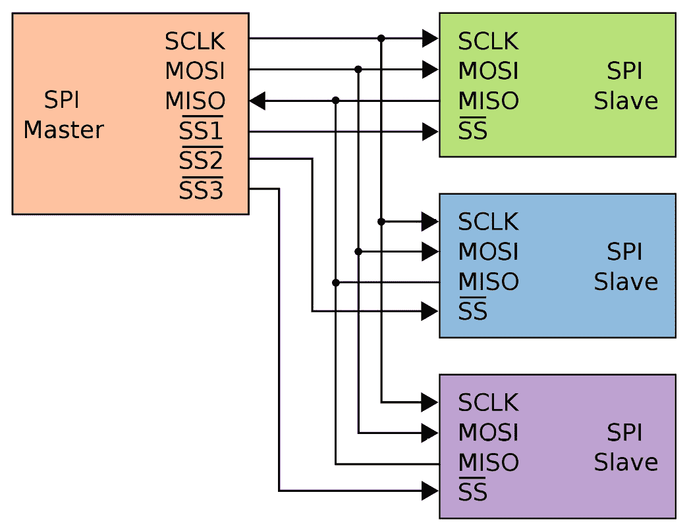

图 2.15 – SPI 连接图

SPI 是一个同步串行链路，使用主时钟信号（SCLK），这与你在 I2C 中学到的类似。时钟速率通常在 6-12.5 MHz 之间，这也是它的比特率。数据在 **主设备输出从设备输入**（**MOSI**）和 **主设备输入从设备输出**（**MISO**）线上传递。MOSI、MISO 和 SCLK 可以用作总线架构，就像 I2C 一样。最后一根线是 **从机选择**（**SS**）线。这条线被拉低以通知连接到它的从机，它应该监听即将到来的消息。

这与 I2C 相比，I2C 会发送从机地址以及要监听哪个从机的信息。正如你在 *图 2.15* 中可以看到的，必须为系统添加的每个从机分配一条单独的线和引脚（图中用 *SS1*、*SS2* 和 *SS3* 表示）。用于实现 SPI 的硬件相当简单，通常依赖于移位寄存器。你可能会问：“什么是移位寄存器？” 好吧，这是一个简单的内存寄存器，可以存储一定数量的位，比如八位。每次从一侧引入一个新位时，另一侧就会推出一个位。以下图示说明了这在 SPI 中的工作原理：

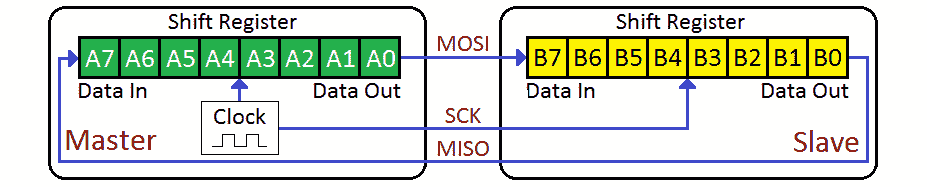

图 2.16 – SPI 移位寄存器

由于总线上只允许有一个主设备，SPI 数据传输非常简单。以下图示有助于说明如何使用 SCK、MOSI、MISO 和 SS 来进行全双工数据传输：

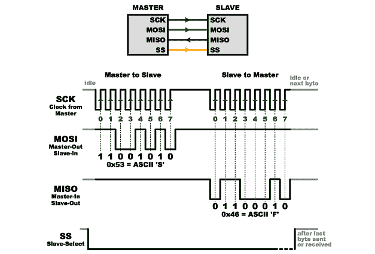

图 2.17 – SPI 时序图

主设备将 SS 线拉低，这样目标从机就会知道：“嘿，SS1，这条消息是给你的，请准备好接收。” 然后，主设备在 SCK 线上发送时钟脉冲，告诉从机何时应该采样 MOSI 上传来的数据。如果已经预定从机需要发送一些信息，主设备随后会跟随 SCK 脉冲，告诉从机何时应该在 MISO 线上发送数据。由于有两条线，MISO 和 MOSI，这两个事务可以使用移位寄存器格式同时发生。

SPI 在协议方面不像 UART 或 I2C 那样标准化。因此，你需要查阅你想要连接的设备的接口控制文档，以确定操作该设备所需的特定命令、寄存器大小、时钟模式等。

你可以看到，与 UART 和 I2C 相比，SPI 中没有开销。没有起始位、地址、停止位、确认位或其他开销。它是纯粹、甜美、高速的数据。另一方面，在两个设备之间进行通信需要更多的编程和预先安排的设置。SPI 还可以在数据线上驱动高低电平，允许更快地从 `0` 到 `1` 的转换，这导致了之前讨论的更快传输速率。

因此，让我们总结一下优缺点。

这些是优点：

+   6-12.5 MHz 的快速数据速率

+   全双工通信

+   可以使用简单的移位寄存器硬件

+   多个从设备

+   总线架构

这些是缺点：

+   单个主设备

+   需要 4 根线，每增加一个从设备还需要一个从设备选择线。

+   传输长度短，取决于速度、阻抗和电容，最大估计为 3 米

在下一节中，我们将讨论一种在几乎所有道路上行驶的车辆中都使用的非常常见的协议！发动引擎吧！

# 基于帧的串行协议

到目前为止，我们一直在讨论那些在 8-10 位范围内的消息大小相对较小的协议。如果你想要发送更多的消息呢？在接下来的几节中，你将了解到支持更大消息大小并将它们打包成帧或数据包的协议。

你将了解到以下协议：

+   CAN

+   以太网：UDP 和 TCP

## 理解 CAN

**控制器局域网络** (**CAN**) 是一种基于消息的协议，由博世公司开发，旨在减少连接车辆中不断增长的微控制器和 **电子控制单元** (**ECUs**) 所需的线缆数量。

这是一个基于总线的协议，由两根作为差分对的线组成，即 CAN-HI 和 CAN-LO。你在 *单端与差分* 部分学习了差分对。

幽灵和鬼怪

你还记得我们用来为 langis 和信号提供安全通道的那个技巧吗？这个故事中有一个真正的 *转折*。

CAN 是一个功能丰富的协议，非常健壮、可靠且快速。以下是该协议的一些特性：

+   分散式多主通信

+   优先级消息

+   总线仲裁

+   远程终端请求

+   使用循环冗余校验的数据完整性

+   灵活可扩展的网络

+   集中式诊断和配置

+   通过扭绞差分对抑制电磁干扰噪声

CAN 总线架构非常简单，如下图所示：

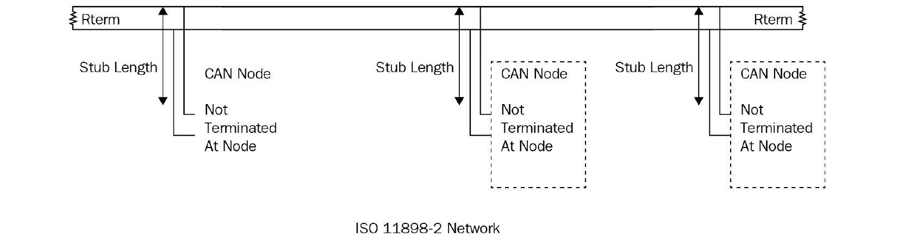

图 2.18 – CAN 总线架构

你可以看到节点可以添加在总线内部的任何位置，包括在总线终端 Rterm 内部。连接节点时需要考虑的是未终止的引线长度，标准建议将其保持在 0.3 米以下。

现在我们来看看位是如何在 CAN HI 和 CAN LO 差分双绞线上传输的。以下图说明了 CAN 协议的主导和隐含电压：

从零到英雄

`0` 以其主导的差分电压上升至最小阈值以上来统治总线。

一劳永逸

`1` 以其隐含的差分电压在总线上休眠，该电压低于最小阈值。

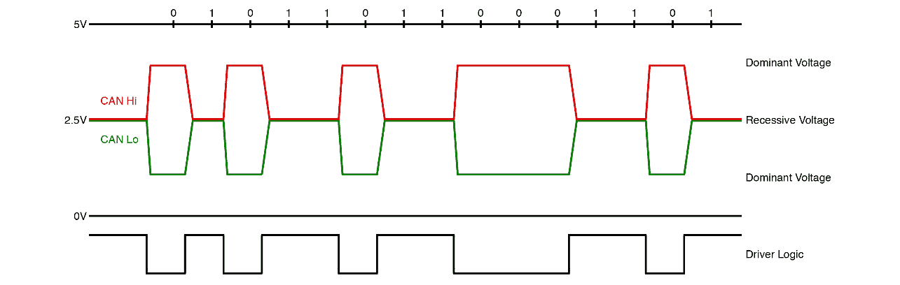

图 2.19 – CAN 主导和隐含电压

通过 EE JRW – ow[n work, CC BY-SA 4.0, https://commons.wikimedia.org/w/in](https://commons.wikimedia.org/w/index.php?curid=55237229)dex.php?curid=55237229

现在你已经看到了位是如何放置在总线上的，让我们来看看 CAN 帧结构。如果你发现自己正在调试或读取 CAN 总线流量，这将很有用。以下图显示了 CAN 帧的各个部分：

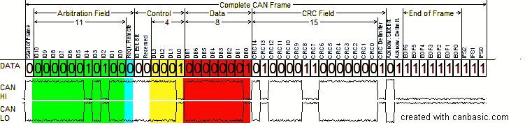

图 2.20 – CAN 消息格式

CAN 帧以`0`开始，这是主导的差分电压。这听起来可能有点类似于你在 UART 通信中学到的，UART 也是以逻辑`0`开始的。与 UART 类似，CAN 中的 SOF 位是从空闲状态到活动状态的转换。然而，与 UART 不同的是，活动状态和主导状态是高电压状态。

在 SOF 位之后是仲裁字段。这可以被认为是 ECU 的功能地址（例如，转向模块、氧传感器、激光雷达传感器等）。

少即是多

在仲裁字段中地址较小的 ECU 在 CAN 协议中被认为是优先级较高的。当两个或多个设备同时开始传输时，较小的地址将赢得仲裁。

下一个位是`1`，隐含状态。

接下来的六位是帧的**数据长度码**（**DLC**）部分，它说明了即将到来的数据字段将有多长。CAN 消息的数据长度可以是 0 到 8 字节。

紧接着 DLC 的是数据，其长度可以是 0-64 位（0-8 字节）。

位顺序

CAN 以 MSB（最高有效位）优先发送其信息。

接下来是**循环冗余校验**（**CRC**）字段，长度为 15 位，用于检查消息中的错误。发送 ECU 对数据字段进行校验和计算，并将其放置在 CRC 字段中。一旦接收 ECU 接收到帧，它将在数据字段上运行相同的校验和计算，并验证它是否与接收帧中的 CRC 字段匹配。CRC 字段紧随其后的是 CRC 定界符字段，以将其与 ACK 位分开。

`1`位是隐性的，这样任何接收 ECU 都可以在位间隔期间确认接收到无错误的数据。ACK 位后面跟着 ACK 定界符，以允许任何超出 ACK 位的时序差异。

最后，`1`位，表示 – 您猜对了 – 帧的结束。

好吧，还有一件事：存在一个**帧间空间**（**IFS**），它由系统的 CAN 控制器定义。

好吧，这已经很长了。不过不用担心；CAN 是一个非常受支持的协议，您可以找到大量的软件和硬件模块来为您做繁重的工作。您可能只有在事情不正常时才需要翻出老式的示波器来探测 CAN 总线并验证消息是否正确传输。

让我们回顾一下 CAN 总线协议的优缺点。

这些是优点：

+   去中心化多主通信

+   优先级消息

+   总线仲裁

+   RTR

+   使用 CRC 进行数据完整性

+   灵活、可扩展的网络

+   集中式诊断和配置

+   通过双绞差分对抑制 EMI 噪声

+   最大电缆长度为 40 米

这实际上只有一个缺点：

+   需要仔细注意布线总线端子和跳线长度。

在下一节中，您将了解现代汽车和家庭中使用的最普遍的网络协议。

## 以太网和互联网协议

以太网是一个由协议和层组成的框架，在现代网络中被用于几乎与您互动的每个应用中。以太网存在于您的家中，您乘坐的火车上，您乘坐的飞机上，当然也包括您的自动驾驶汽车中。它包括基于网络的通信的物理和协议标准。一切始于不同层的**开放系统互连**（**OSI**）模型。以下图示说明了 OSI 模型的七层及其每一层的任务：

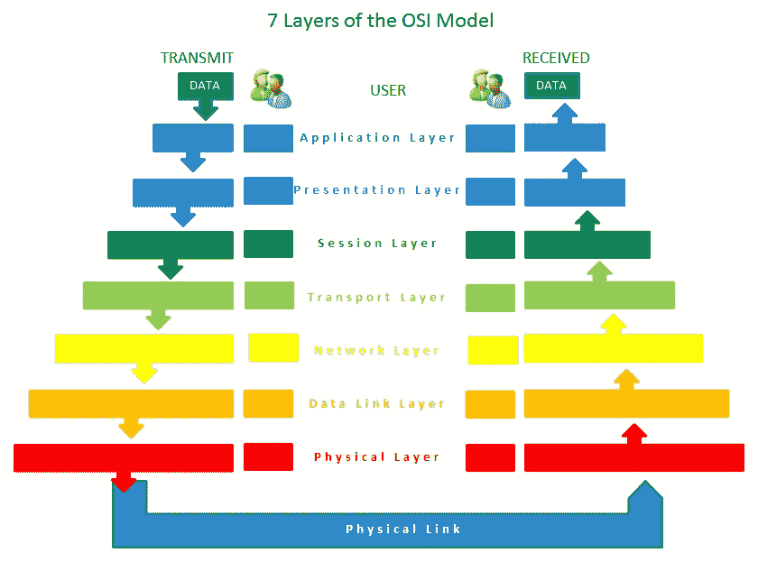

图 2.21 – OSI 模型的七层

每一层都有自己的协议来处理数据。一切始于应用层的原始数据或比特。数据在每一层被处理，以便传递到下一层。每一层将前一层的帧包装成一个新的帧，这就是为什么模型显示了帧越来越大。以下图示说明了每一层的协议：

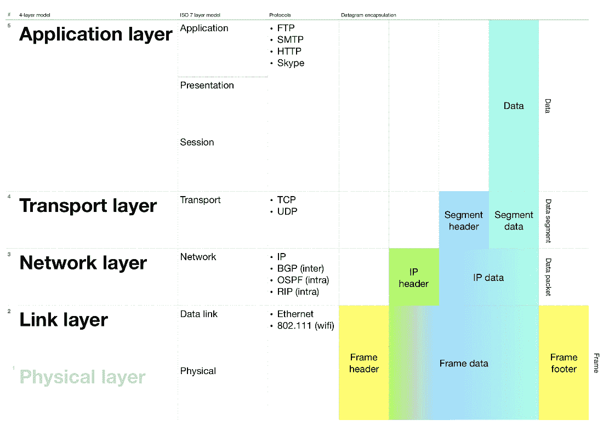

图 2.22 – OSI 模型的协议

我们可以花整整一本书的时间来讨论每一层和协议的细节。相反，我们将专注于您在自动驾驶汽车中与传感器和执行器一起工作时将遇到的两种协议（UDP 和 TCP）。

## 理解 UDP

**用户数据报协议**（**UDP**）是激光雷达、摄像头和雷达等传感器非常流行的协议。它是一个无连接协议。*等等——如果它是无连接的，它是如何发送数据的？* 在这个意义上，无连接只是意味着在发送数据之前，该协议不会验证它是否能够到达目的地。UDP 存在于 OSI 模型的传输层。你可以在以下图中看到，传输层是第一个添加头部的一层：

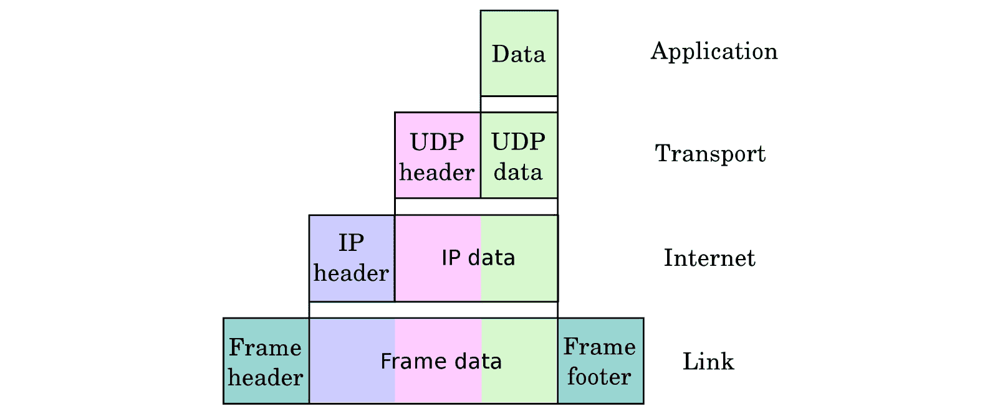

图 2.23 – 传输层上的 UDP

如果你要给某人送礼物，你希望他们知道关于礼物的哪些信息，以便他们可以确信礼物是给他们的，而不是被换成别人的礼物？你可能会说些像，“Tenretni Olleh，我正在给你发送一套大号奢华彩虹睡衣，希望它们合身。请试穿一下。”这正是 UDP 头部的作用。它存储源端口、目的端口、包括头部在内的数据长度，最后是一个校验和。校验和只是一个在发送数据之前用算法创建的数字，以确保当它被接收时，数据是完整的且未被损坏。这是通过在接收数据上运行相同的算法，并将生成的数字与校验和值进行比较来完成的。这就像给 Tenretni 发送所发送睡衣的图片，这样他们就知道他们收到了正确的礼物。

以下图示展示了 UDP 头部内的字段以及实际的消息本身：

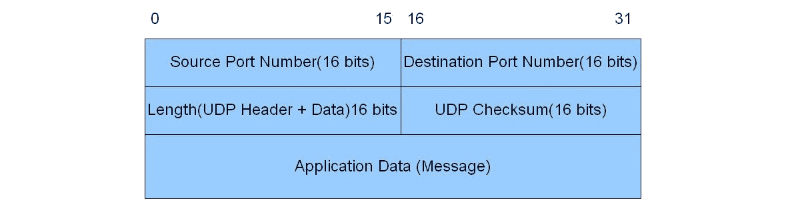

图 2.24 – UDP 头部字段

端口、插头和插座

在以太网协议中，一个端口可以类比为墙上的电源插座。你将不同的设备插入插座，例如灯具和电视。每个插座一旦连接，就为特定的设备提供电源。同样，端口是创建用于特定设备或协议发送和/或接收数据的一个数字插座。

UDP 头部始终是 8 字节（64 位），而数据（消息）的长度可以达到 65,507 字节。以下图示是一个相关示例，展示了来自一个流行的超高分辨率激光雷达传感器系列的 UDP 数据包的数据（消息）字段大小：

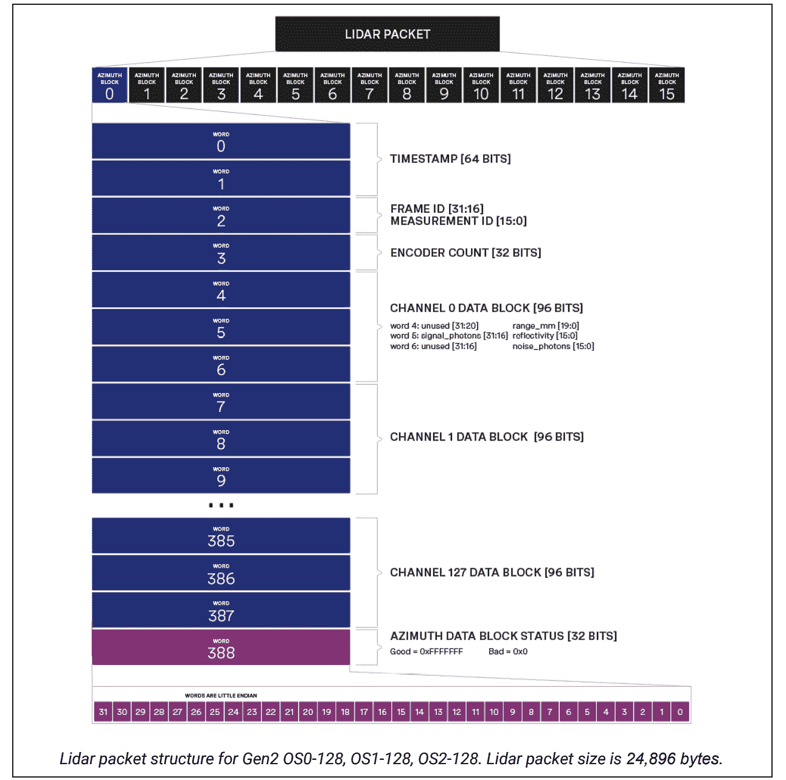

图 2.25 – Ouster 激光雷达 UDP 数据结构

从这里你可以看到，如果你仔细地将所有字节相乘，你会得到 389 个单词 * 4 字节/单词 * 16 个方位/数据包 = 24,896 字节/数据包。这完全在 UDP 数据包的数据限制大小范围内，65,507 字节。为了通过 UDP 发送这些数据，激光雷达传感器需要附加什么数据？你已经猜到了——需要有一个包含源、目的、数据长度和校验和信息的 UDP 头部。

UDP 通常用于流式设备，如激光雷达传感器、摄像头和雷达，因为如果数据没有收到，重新发送数据是没有意义的。想象一下，在激光雷达传感器示例中，你没有收到几个方位角。你会希望重新发送那些数据给你吗？可能不会，因为激光反射的任何东西现在都过去了，并且可能处于不同的位置。使用 UDP 的另一个原因是，由于数据速率高，如果需要重新发送丢失或损坏的数据，这将极大地减慢速度。

在下一节中，我们将讨论一个协议，该协议将解决你可能想要确保每个数据包都进行三次握手的情况。

## 理解 TCP

如果你打算发送一个命令来转动自动驾驶汽车的转向盘，你会不会对命令从未到达、错误或损坏的情况感到满意？你会对不知道转向执行器是否收到命令的情况感到满意吗？可能不会！

这就是**传输控制协议**（**TCP**）能为你服务的地方！TCP 的操作方式类似于 UDP...实际上，它完全不同。与 UDP 不同，TCP 是一种基于连接的协议。这意味着每次你想发送数据时，你都需要进行三次握手。这是通过一个称为 SYN-SYN/ACK-ACK 的过程来完成的。让我们将其分解以更好地理解：

+   SYN – 客户端发送一个带有随机选择的初始序列号（`x`）的 SYN（同步）数据包，该序列号用于计算发送的字节数。它还将 SYN 位标志设置为`1`（稍后会有更多介绍）。

+   SYN/ACK – 服务器接收到 SYN 数据包：

1.  它将`x`增加 1。这成为确认（ACK）编号（`x+1`），这是它期望接收的下一个字节的编号。

1.  然后它向客户端发送一个带有 ACK 编号以及服务器自己随机选择的序列号（`y`）的 SYN/ACK 数据包。

    +   ACK – 客户端接收到带有 ACK 编号（`x+1`）和服务器序列号（`y`）的 SYN/ACK 数据包：

    1.  它将服务器的初始序列号增加到`y+1`。

    1.  它向服务器发送一个带有 ACK 编号（`y+1`）和 ACK 位标志设置为`1`的 ACK 数据包以建立连接。

以下图表说明了连接序列：

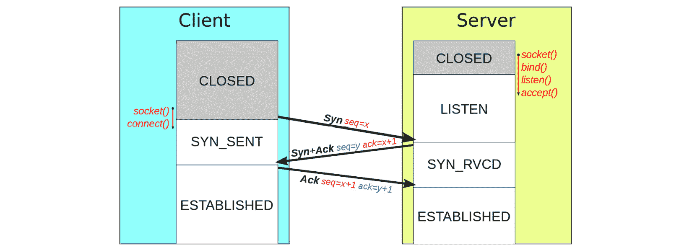

图 2.26 – TCP 连接序列图

现在连接已经建立，数据可以开始流动。每个发送的数据包都将跟随一个 ACK 数据包，其中包含接收到的字节数加 1，表示数据包已完整接收，并指出它期望接收的下一个字节编号。对于 SYN 和 SYN/ACK 数据包，序列号增加 1，对于 ACK 数据包，增加接收到的有效载荷字节数。

你已经可以看到，为了完成所有这些，头部将需要比 UDP 更多的字段。以下图表说明了 TCP 头部的字段：

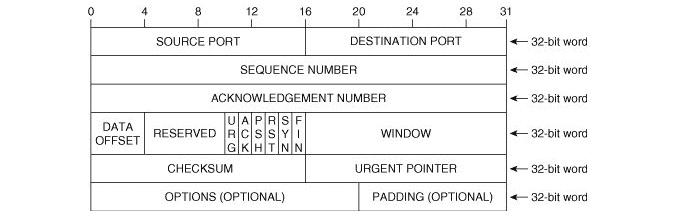

图 2.27 – TCP 头字段

让我们逐个字段及其用途进行解析：

+   **源端口**：这是数据包发送的端口。这通常是一个随机分配的端口号。

+   `22`。可以在以下链接找到知名端口的列表：[`www.iana.org/assignments/service-names-port-numbers/service-names-port-numbers.xhtml.`](https://www.iana.org/assignments/service-names-port-numbers/service-names-port-numbers.xhtml)

+   **序列号**：这是有效载荷中第一个发送的字节的编号；对于 SYN 和 SYN/ACK 数据包，它是随机选择的初始序列号。

+   **确认号**：这是已接收的字节数加一，表示预期的下一个字节编号。

+   **数据偏移**：这是 TCP 头的长度，即有效载荷之前的偏移量。

+   **保留**：这些是未使用但为未来协议改进预留的位。

+   (`0` 或 `1`)。这用于标记数据包为紧急。

+   `ACK` 位标志，当发送有效的确认号时设置为 `1`。

+   当数据应立即推送到应用程序时设置为 `1`。

+   当连接需要重置时设置为 `1`。

+   当初始化 SYN-SYN/ACK 连接建立过程时设置为 `1`。它表示序列号字段中有一个有效的序列号。

+   当所有数据发送后应关闭连接时设置为 `1`。

+   **窗口**：这是接收端在丢失数据之前可以接受的缓冲区大小。

+   `payload+header` 用于验证接收到的数据是否有效且未更改。

+   `URG` 位标志设置为 `1`。

TCP 使用所有这些头部信息来确保所有数据都被接收、验证和确认。如果数据丢失，可以使用最后一个有效的序列号重新发送数据。现在您可以自信地通过以太网发送转向命令，知道您不会冲下悬崖！

汽车主要使用 CAN...

虽然我们在这里以转向为例说明了 TCP，但您通常会发现在工厂中，车辆控制命令是通过以太网总线从 CAN 总线发送的。然而，越来越多的自动驾驶汽车创造者正依赖以太网，因为它具有更高的数据吞吐量和安全性。未来，人们讨论将工厂车辆迁移到以太网总线。军用飞机已经开始了这样的行动！

好吧——天哪，这有很多东西要理解。不过，不用担心：现在您已经看了一次并理解了，您就可以依赖开源工具在将来解析这些信息了。您会发现这很有用，当事情开始出错并且您需要调试数据流时。

说到这个，Wireshark 是一款用于在您的网络上**嗅探**以太网数据包并查看信息流以进行调试和测试的出色工具。您可以在 [`www.wireshark.org/`](https://www.wireshark.org/) 找到有关安装和使用的所有信息。

如你所见，TCP 是一种强大的基于连接的、高度可靠且安全的协议。现在，出去开始使用本章末尾列出的开源工具使用以太网协议吧！

# 摘要

恭喜你，你已经和你的新朋友——langis 和信号一起完成了你的任务！你经历了一段相当刺激的冒险！你与以电磁波和感应电流形式出现的鬼怪战斗。在旅途中，你学到了很多关于串行与并行数据传输；数字与模拟信号；以及 UART、I2C、SPI、CAN、UDP 和 TCP 等协议及其秘密解码环的知识！你现在拥有了将传感器和执行器集成到你的真实自动驾驶汽车中所需的知识。

在下一章中，你将学习如何使用 OpenCV 检测道路上的车道，这是确保你的自动驾驶汽车安全合法运行的重要技能！

# 问题

在阅读本章后，你应该能够回答以下问题：

1.  每个协议需要多少根线，它们的名称是什么？

1.  有哪些方法可以减少信号中的噪声？

1.  串行和并行数据传输有什么区别？

1.  哪些协议使用总线架构？

1.  哪些协议包含时钟信号？

1.  哪个协议被广泛用于将 GPS 信息发送到其他传感器？

# 进一步阅读

+   德州仪器公司控制器局域网物理层要求（[`www.ti.com/lit/an/slla270/slla270.pdf?HQS=slla270-aaj&ts=1589256007656`](http://www.ti.com/lit/an/slla270/slla270.pdf?HQS=slla270-aaj&ts=1589256007656)）

+   德州仪器公司关于控制器局域网（CAN）的介绍（[`www.ti.com/lit/an/sloa101b/sloa101b.pdf`](http://www.ti.com/lit/an/sloa101b/sloa101b.pdf)）

+   通用异步接收器/发送器（UART）([`ieeexplore.ieee.org/document/7586376`](https://ieeexplore.ieee.org/document/7586376)）

+   理解 I2C 总线（[`www.ti.com/lit/an/slva704/slva704.pdf?&ts=1589265769229`](http://www.ti.com/lit/an/slva704/slva704.pdf?&ts=1589265769229)）

## 开源协议工具

你还可以参考以下资源，了解更多关于使用这些协议进行编程的工具：

+   `PySerial` ([`pypi.org/project/pyserial/`](https://pypi.org/project/pyserial/)) 用于 UART（RS-232、RS-422、RS-485）

+   `python-periphery` ([`python-periphery.readthedocs.io/en/latest/index.html`](https://python-periphery.readthedocs.io/en/latest/index.html)) 用于 UART、I2C、SPI 等

+   `smbus2` ([`pypi.org/project/smbus2/`](https://pypi.org/project/smbus2/)) 用于 I2C

+   `spidev` ([`pypi.org/project/spidev/`](https://pypi.org/project/spidev/)) 用于 SPI

+   `python-can` ([`pypi.org/project/python-can/`](https://pypi.org/project/python-can/)) 用于 CAN

+   `socket` ([`docs.python.org/3/library/socket.html`](https://docs.python.org/3/library/socket.html)) 用于以太网 TCP、UDP 等
