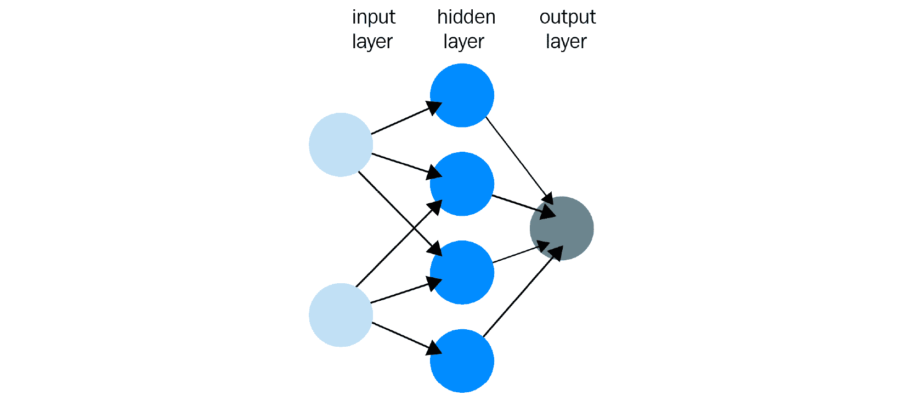
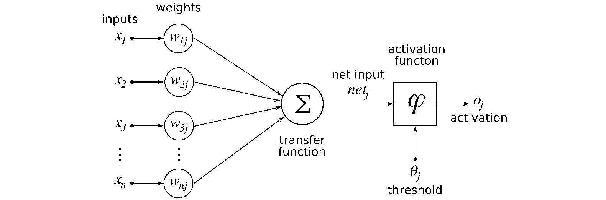
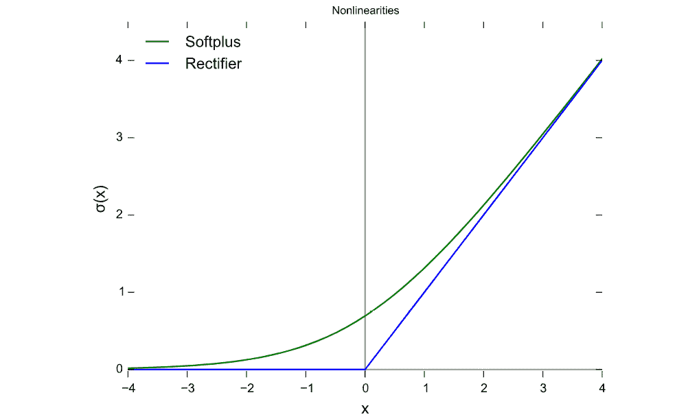
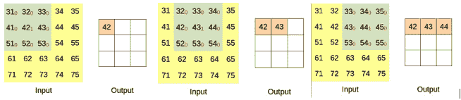
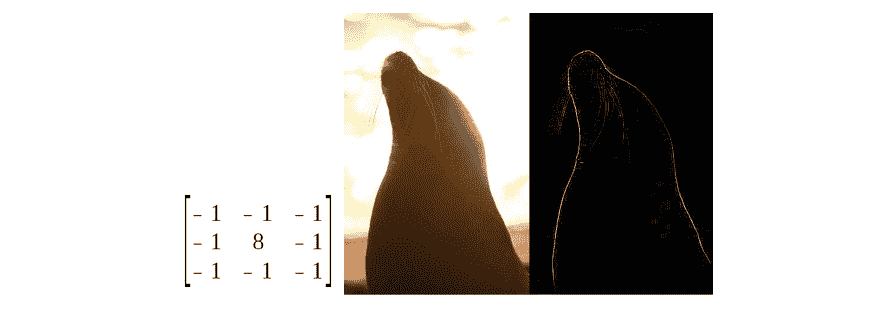
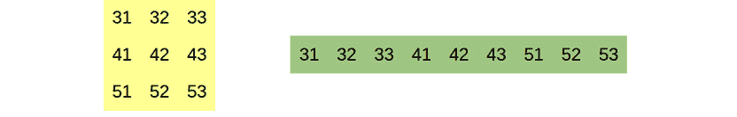
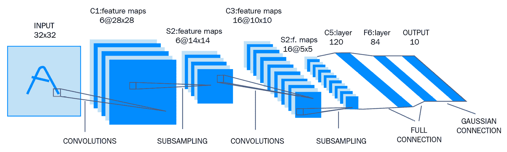
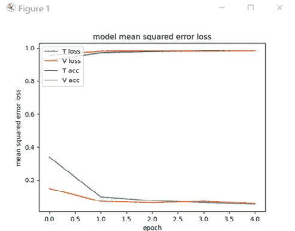
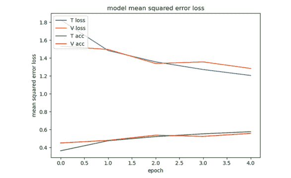
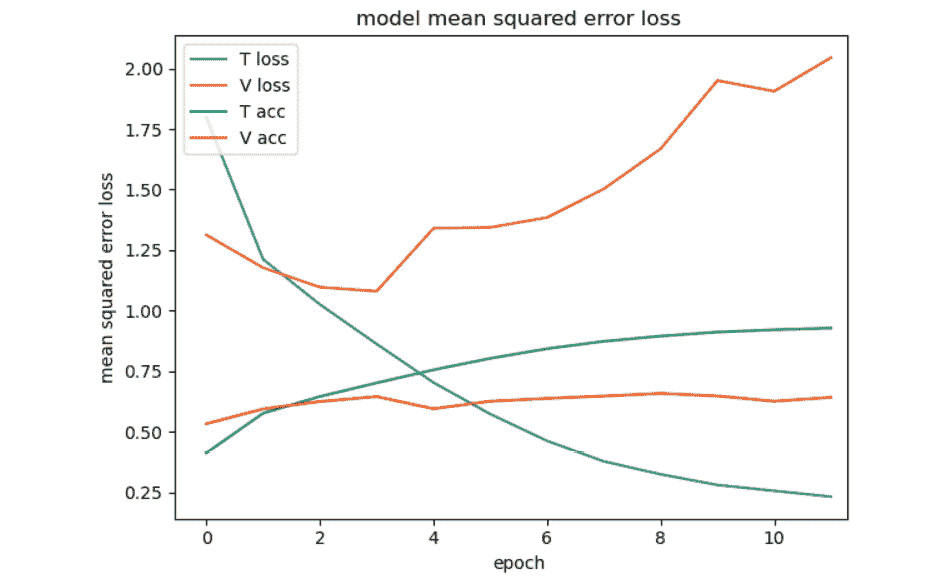

# *第四章*：使用神经网络的深度学习

本章是使用 Keras 介绍神经网络。如果你已经使用过 MNIST 或 CIFAR-10 图像分类数据集，可以自由跳过。但如果你从未训练过神经网络，本章可能对你来说有一些惊喜。

本章非常实用，旨在让你很快就能玩起来，我们将尽可能跳过理论，学习如何以高精度识别由单个数字组成的手写数字。我们在这里所做以及更多内容的理论将在下一章中介绍。

我们将涵盖以下主题：

+   机器学习

+   神经网络及其参数

+   卷积神经网络

+   Keras，一个深度学习框架

+   MNIST 数据集

+   如何构建和训练神经网络

+   CIFAR-10 数据集

# 技术要求

对于本章中的说明和代码，你需要以下内容：

+   Python 3.7

+   NumPy

+   Matplotlib

+   TensorFlow

+   Keras

+   OpenCV-Python 模块

+   一个 GPU（推荐）

本书代码可以在以下位置找到：

[`github.com/PacktPublishing/Hands-On-Vision-and-Behavior-for-Self-Driving-Cars/tree/master/Chapter4`](https://github.com/PacktPublishing/Hands-On-Vision-and-Behavior-for-Self-Driving-Cars/tree/master/Chapter4)

本章的“代码实战”视频可以在以下位置找到：

[`bit.ly/3jfOoWi`](https://bit.ly/3jfOoWi)

# 理解机器学习和神经网络

根据维基百科，**机器学习**是“*通过经验自动改进的计算机算法的研究*。”

实际上，至少对我们来说，这意味着算法本身的重要性只是适度的，而关键的是我们提供给这个算法的数据，以便它能够学习：我们需要**训练**我们的算法。换一种说法，只要我们为当前任务提供适当的数据，我们就可以在许多不同的情况下使用相同的算法。

例如，在本章中，我们将开发一个能够识别 0 到 9 之间手写数字的神经网络；很可能，完全相同的神经网络可以用来识别 10 个字母，并且通过微小的修改，它可以识别所有字母或甚至不同的对象。实际上，我们将基本上以原样重用它来识别 10 个对象。

这与*常规编程*完全不同，在常规编程中，不同的任务通常需要不同的代码；为了改进结果，我们需要改进代码，而且我们可能根本不需要数据来使算法可用（使用真实数据）。

话虽如此，这并不意味着只要输入好的数据，神经网络的结果就总是好的：困难的任务需要更高级的神经网络才能表现良好。

为了明确起见，虽然算法（即神经网络模型）在传统编程中不如代码重要，但如果想要获得非常好的结果，它仍然很重要。事实上，如果架构错误，你的神经网络可能根本无法学习。

神经网络只是你可以用来开发机器学习模型的各种工具之一，但这是我们将会关注的。深度学习的准确性通常相当高，你可能会发现，在那些使用不太精确的机器学习技术的应用中，数据量和处理成本有很大的限制。

**深度学习**可以被认为是机器学习的一个子集，其中的计算由多个计算层执行，这是名称中的“深度”部分。从实际的角度来看，深度学习是通过神经网络实现的。

这引出了一个问题：神经网络究竟是什么？

## 神经网络

神经网络在一定程度上受到我们大脑的启发：我们大脑中的神经元是一个“计算节点”，它连接到其他神经元。在执行计算时，我们大脑中的每个神经元“感知”它所连接的神经元的兴奋状态，并使用这些外部状态来计算它自己的状态。神经网络中的神经元（感知器）基本上做的是同样的，但这里的相似之处到此为止。为了明确起见，感知器不是神经元的模拟，但它只是受到了启发。

以下是一个小型神经网络，其中包含其神经元：



图 4.1 – 一个神经网络

第一层是输入（例如，图像的像素）和输出层是结果（例如，分类）。隐藏层是计算发生的地方。通常，你会有更多的隐藏层，而不仅仅是单个。每个输入也可以称为特征，在 RGB 图像的情况下，特征通常是像素的单个通道。

在前馈神经网络中，一个层的神经元只与前一层的神经元和下一层的神经元连接：


图 4.2 – 一个神经网络

但神经元究竟是什么？

## 神经元

神经元是一个计算节点，它根据某些输入产生输出。至于这些输入和输出是什么——嗯，这取决于。我们稍后会回到这个点。

以下是一个神经网络中典型神经元的表示：



图 4.3 – 神经网络中单个神经元的示意图。©2016 Wikimedia Commons

这需要一些解释。神经元执行的计算可以分为两部分：

+   转换函数计算每个输入乘以其权重的总和（只是一个数字）；这意味着神经元的状况取决于其输入神经元的状况，但不同的神经元提供不同的贡献。这仅仅是一个线性操作：


+   激活函数应用于转换函数的结果，并且它应该是一个**非线性**操作，通常有一个阈值。由于性能出色，我们将经常使用的一个函数被称为**修正线性单元（ReLU）**。



图 4.4 – 两种激活函数：Softplus 和 ReLU

通常还有一个**偏差**，这是一个用于移动激活函数的值。

线性函数与非线性函数的组合是非线性的，而两个线性函数的组合仍然是线性的。这一点非常重要，因为它意味着如果激活是线性的，那么神经元的输出将是线性的，不同层的组合也将是线性的。因此，整个神经网络将是线性的，因此等同于单层。

在激活函数中引入非线性操作，使得网络能够计算越来越复杂的非线性函数，随着层数的增加，这些函数变得越来越复杂。这是最复杂的神经网络实际上可以有数百层的原因之一。

## 参数

偏差和权重被称为**参数**，因为它们不是固定的，需要根据任务进行调整。我们在**训练**阶段进行这一操作。为了明确起见，训练阶段的整个目的就是为我们的任务找到这些参数的最佳可能值。

这具有深远的影响，因为它意味着同一个神经网络，具有不同的参数，可以解决不同的问题——非常不同的问题。当然，技巧是找到这些参数的最佳值（或一个近似值）。如果你想知道一个典型的神经网络可以有多少参数，答案是数百万。幸运的是，这个过程，即训练，可以自动化。

想象神经网络的一个替代方法是将其视为一个庞大的方程组系统，而训练阶段则是一个尝试找到其近似解的过程。

## 深度学习的成功

你可能已经注意到，深度学习在过去几年中经历了爆炸性的增长，但神经网络实际上并不是什么新鲜事物。我记得在阅读了一本关于神经网络的书之后，我尝试编写一个神经网络（并且失败得很惨！）那是在 20 多年前。事实上，它们可以追溯到 1965 年，有些理论甚至比那还要早 20 年。

多年前，它们基本上被当作一种好奇心，因为它们计算量太大，不实用。

然而，快进几十年，深度学习成为了新的热门领域，这得益于一些关键性的进步：

+   计算机运行得更快，并且有更多的 RAM 可用。

+   可以使用 GPU 来使计算更快。

+   现在互联网上有许多数据集可以轻松用于训练神经网络。

+   现在互联网上有许多教程和在线课程专门介绍深度学习。

+   现在有多个优秀的开源库用于神经网络。

+   架构已经变得更加优秀和高效。

这正是使神经网络更具吸引力的完美风暴，而且有许多应用似乎都在等待深度学习，例如语音助手和当然，自动驾驶汽车。

有一种特殊的神经网络特别擅长理解图像内容，我们将特别关注它们：卷积神经网络。

# 学习卷积神经网络

如果你观察一个经典的神经网络，你可以看到第一层由输入组成，它们排列成一行。这不仅是一个图形表示：对于一个经典神经网络来说，输入是输入，它应该独立于其他输入。如果你试图根据大小、ZIP 代码和楼层号预测公寓的价格，这可能没问题，但对于图像来说，像素有邻居，保持这种邻近信息似乎很直观。

**卷积神经网络**（**CNNs**）正好解决了这个问题，结果发现它们不仅能够高效地处理图像，而且还可以成功应用于自然语言处理。

CNN 是一种至少包含一个卷积层的神经网络，它受到动物视觉皮层的启发，其中单个神经元只对视野中一个小区域内的刺激做出反应。让我们看看卷积究竟是什么。

## 卷积

卷积基于**核**的概念，这是一个应用于某些像素以得到单个新像素的矩阵。核可以用于边缘检测或对图像应用过滤器，并且如果你愿意，你通常可以在图像处理程序中定义你的核。以下是一个 3x3 的单位核，它以原样复制图像，并且我们正在将其应用于一个小图像：


图 4.5 – 图像的一部分、一个 3x3 的单位核以及结果

想象一下，在每个核的元素后面放置一个像素，并将它们相乘，然后将结果相加以得到新像素的值；显然，除了中央像素外，其他所有像素都会得到零，中央像素保持不变。这个核保留了中间像素的值，丢弃了所有其他像素。如果你将这个卷积核在整个图片上滑动，你会得到原始图像：



图 4.6 – 单位卷积 – 只复制图像

你可以看到，当卷积核在图像上滑动时，像素保持不变地复制。你还可以看到分辨率降低了，因为我们使用了 *valid* 填充。

这是另一个例子：


图 4.7 – 图像的一部分、3x3 的核和结果

其他核可能比恒等核更有趣。下面的核（在左侧）可以检测边缘，如右侧所示：



图 4.8 – 核检测边缘

如果你对核感兴趣，请继续使用 OpenCV 并享受乐趣：

```py
img = cv2.imread("test.jpg")kernel = np.array(([-1, -1, -1], [-1, 8, -1], [-1, -1, -1]))dst = cv2.filter2D(img,-1,kernel)cv2.imshow("Kernel", cv2.hconcat([img, dst]))cv2.waitKey(0)
```

核不需要是 3x3 的；它们可以更大。

如果你想象从图像的第一个像素开始，你可能会问那时会发生什么，因为上面或左边没有像素。如果你将核的左上角放在图像的左上像素上，图像的每一边都会丢失一个像素，因为你可以将它想象成核从中心发射出一个像素。这并不总是一个问题，因为在设计神经网络时，你可能希望图像在每一层之后都变得越来越小。

另一个选择是使用填充 – 例如，假装图像周围有黑色像素。

好消息是，你不需要找到核的值；CNN 会在训练阶段为你找到它们。

## 为什么卷积如此出色？

卷积有一些显著的优势。正如我们之前所说，它们保留了像素的邻近性：



图 4.9 – 黄色的卷积层与绿色的密集层

如前图所示，卷积知道图像的拓扑结构，例如，它可以知道像素 43 正好位于像素 42 的旁边，位于像素 33 的下方，位于像素 53 的上方。同一图中的密集层没有这个信息，可能会认为像素 43 和像素 51 相近。不仅如此，它甚至不知道分辨率是 3x3、9x1 还是 1x9。直观地了解像素的拓扑结构是一个优势。

另一个重要的优势是它们在计算上效率很高。

卷积的另一个显著特点是它们非常擅长识别模式，例如对角线或圆形。你可能会说它们只能在较小的尺度上做到这一点，这是真的，但你可以组合多个卷积来检测不同尺度的模式，并且它们在这方面可以出奇地好。

它们也能够检测图像不同部分的模式。

所有这些特性使它们非常适合处理图像，并且它们在目标检测中被广泛使用并不令人惊讶。

现在理论部分就到这里。让我们动手写我们的第一个神经网络。

# 开始使用 Keras 和 TensorFlow

有许多库专门用于深度学习，我们将使用 Keras，这是一个使用多个后端的 Python 库；我们将使用 TensorFlow 作为后端。虽然代码是针对 Keras 的，但原则可以应用于任何其他库。

## 要求

在开始之前，你需要至少安装 TensorFlow 和 Keras，使用`pip`：

```py
pip install tensorflow
pip install keras
```

我们正在使用 TensorFlow 2.2，它集成了 GPU 支持，但如果你使用的是 TensorFlow 版本 1.15 或更早版本，你需要安装一个单独的包来利用 GPU：

```py
pip install tensorflow-gpu
```

我建议使用 TensorFlow 和 Keras 的最新版本。

在开始之前，让我们确保一切就绪。你可能想使用 GPU 来加速训练。不幸的是，让 TensorFlow 使用你的 GPU 并不一定简单；例如，它对 CUDA 的版本非常挑剔：如果它说 CUDA 10.1，那么它确实意味着它——它不会与 10.0 或 10.2 兼容。希望这不会对你的游戏造成太大影响。

要打印 TensorFlow 的版本，可以使用以下代码：

```py
import tensorflow as tf
print("TensorFlow:", tf.__version__)
print("TensorFlow Git:", tf.version.GIT_VERSION)
```

在我的电脑上，它会打印出以下内容：

```py
TensorFlow: 2.1.0
TensorFlow Git: v2.1.0-rc2-17-ge5bf8de410
```

要检查 GPU 支持，可以使用以下代码：

```py
print("CUDA ON" if tf.test.is_built_with_cuda() else "CUDA OFF")print("GPU ON" if tf.test.is_gpu_available() else "GPU OFF")
```

如果一切正常，你应该看到`CUDA ON`，这意味着你的 TensorFlow 版本已经集成了 CUDA 支持，以及`GPU ON`，这意味着 TensorFlow 能够使用你的 GPU。

如果你的 GPU 不是 NVIDIA，可能需要更多的工作，但应该可以配置 TensorFlow 在 AMD 显卡上运行，使用 ROCm。

现在你已经正确安装了所有软件，是时候在我们的第一个神经网络上使用了。我们的第一个任务将是使用名为 MNIST 的数据集来识别手写数字。

# 检测 MNIST 手写数字

当你设计神经网络时，你通常从一个你想要解决的问题开始，你可能从一个已知在类似任务上表现良好的设计开始。你需要一个数据集，基本上是你能得到的尽可能大的数据集。在这方面没有真正的规则，但我们可以这样说，训练你自己的神经网络可能至少需要大约 3000 张图片，但如今，世界级的 CNNs 是使用数百万张图片进行训练的。

我们的首要任务是检测手写数字，这是 CNNs 的经典任务。为此有一个数据集，即 MNIST 数据集（版权属于 Yann LeCun 和 Corinna Cortes），并且它方便地存在于 Keras 中。MNIST 检测是一个简单的任务，因此我们将取得良好的结果。

加载数据集很容易：

```py
from keras.datasets import mnist
(x_train, y_train), (x_test, y_test) = mnist.load_data()
x_train = np.reshape(x_train, np.append(x_train.shape, (1)))
x_test = np.reshape(x_test, np.append(x_test.shape, (1)))
```

`reshape`只是将形状从(60000, 28, 28)重新解释为(60000, 28, 28, 1)，因为 Keras 需要四个维度。

## 我们刚刚加载了什么？

`load_data()`方法返回四个东西：

+   `x_train`：用于训练的图像

+   `y_train`：用于训练的标签（即每个手写数字的正确数字）

+   `x_test`：用于测试的图像

+   `y_test`：用于测试的标签（即每个手写数字的正确数字）

## 训练样本和标签

让我们打印训练样本（`x`）和标签（`y`）的维度：

```py
print('X Train', x_train.shape, ' - X Test', x_test.shape)print('Y Train', y_train.shape, ' - Y Test', y_test.shape)
```

应该打印出类似以下内容：

```py
X Train (60000, 28, 28, 1)  - X Test (10000, 28, 28, 1)Y Train (60000,)  - Y Test (10000,)
```

x 变量代表 CNN 的输入，这意味着 x 包含所有我们的图像，分为两个集合，一个用于训练，一个用于测试：

+   `x_train` 包含 60,000 张用于训练的图像，每张图像有 28x28 像素，为灰度图（一个通道）。

+   `x_test` 包含 10,000 张用于测试的图像，每张图像有 28x28 像素，为灰度图（一个通道）。

如你所见，训练和测试图像具有相同的分辨率和相同数量的通道。

`y` 变量代表 CNN 的预期输出，也称为标签。对于许多数据集，有人手动标记所有图像以说明它们是什么。如果数据集是人工的，标记可能是自动化的：

+   `y_train` 由 60,000 个属于 10 个类别的数字组成，从 0 到 9。

+   `y_test` 由 10,000 个属于 10 个类别的数字组成，从 0 到 9。

对于每张图像，我们都有一个标签。

通常来说，一个神经网络可以有多个输出，每个输出都是一个数字。在分类任务的情况下，例如 MNIST，输出是一个单独的整数。在这种情况下，我们特别幸运，因为输出值实际上是我们感兴趣的数字（例如，0 表示数字 0，1 表示数字 1）。通常，你需要将数字转换为标签（例如，0 -> 猫，1 -> 狗，2 -> 鸭）。

严格来说，我们的 CNN 不会输出一个从 0 到 9 的整数结果，而是 10 个浮点数，最高值的位置将是标签（例如，如果位置 3 的输出是最高值，则输出将是 3）。我们将在下一章中进一步讨论这个问题。

为了更好地理解 MNIST，让我们看看训练数据集和测试数据集的五个样本：


图 4.10 – MNIST 训练和测试数据集样本。版权属于 Yann LeCun 和 Corinna Cortes

如你所料，这些图像的对应标签如下：

+   训练样本（`y_train`）包括 5、0、4、1 和 9。

+   测试样本（`y_test`）包括 7、2、1、0 和 4。

我们还应该调整样本的大小，使其范围从 0-255 变为 0-1，因为这有助于神经网络获得更好的结果：

```py
x_train = x_train.astype('float32')x_test = x_test.astype('float32')x_train /= 255 x_test /= 255
```

## 一维编码

标签不能直接使用，需要使用*one-hot encoding*将其转换为向量。正如其名所示，你得到一个向量，其中只有一个元素是热的（例如，其值为`1`），而所有其他元素都是冷的（例如，它们的值为`0`）。热的元素代表标签的位置，在一个包含所有可能位置的向量中。一个例子应该会使理解更容易。

在 MINST 的情况下，你有 10 个标签：0、1、2、3、4、5、6、7、8 和 9。因此，one-hot encoding 将使用 10 个项目。这是前三个项目的编码：

+   `0 ==> 1 0 0 0 0 0 0 0 0 0`

+   `1 ==> 0 1 0 0 0 0 0 0 0 0`

+   `2 ==> 0 0 1 0 0 0 0 0 0 0`

如果你有三个标签，狗、猫和鱼，你的 one-hot encoding 将如下所示：

+   `Dog ==> 1 0 0`

+   `Cat ==> 0 1 0`

+   `Fish ==> 0 0 1`

Keras 提供了一个方便的函数来处理这个问题，`to_categorical()`，它接受要转换的标签列表和标签总数：

```py
print("One hot encoding: ", keras.utils.to_categorical([0, 1, 2], 10))
```

如果你的标签不是数字，你可以使用`index()`来获取指定标签的索引，并使用它来调用`to_categorical()`：

```py
labels = ['Dog', 'Cat', 'Fish']
print("One hot encoding 'Cat': ", keras.utils.to_categorical(labels.index('Cat'), 10))
```

## 训练和测试数据集

`x`变量包含图像，但为什么我们既有`x_train`又有`x_test`？

我们将在下一章中详细解释一切，但到目前为止，我们只能说 Keras 需要两个数据集：一个用于训练神经网络，另一个用于调整超参数以及评估神经网络的性能。

这有点像有一个老师先向你解释事情，然后质问你，分析你的答案来更好地解释你没有理解的部分。

# 定义神经网络模型

现在我们想编写我们的神经网络，我们可以称之为我们的模型，并对其进行训练。我们知道它应该使用卷积，但我们对此了解不多。让我们从一位古老但非常有影响力的 CNN：**LeNet**中汲取灵感。

## LeNet

LeNet 是第一个 CNN 之一。追溯到 1998 年，对于今天的标准来说，它相当小且简单。但对于这个任务来说已经足够了。

这是它的架构：



图 4.11 – LeNet

LeNet 接受 32x32 像素的图像，并具有以下层：

+   第一层由六个 5x5 卷积组成，输出 28x28 像素的图像。

+   第二层对图像进行子采样（例如，计算四个像素的平均值），输出 14x14 像素的图像。

+   第三层由 16 个 5x5 卷积组成，输出 10x10 像素的图像。

+   第四层对图像进行子采样（例如，计算四个像素的平均值），输出 5x5 像素的图像。

+   第五层是一个包含 120 个神经元的全连接密集层（即，前一层中的所有神经元都连接到这一层的所有神经元）。

+   第六层是一个包含 84 个神经元的全连接密集层。

+   第七个也是最后一个层是输出，一个包含 10 个神经元的完全连接的密集层，因为我们需要将图像分类为 10 个类别，对应于 10 个数字。

我们并不是试图精确地重现 LeNet，我们的输入图像略小一些，但我们会将其作为参考。

## 代码

第一步是定义我们正在创建哪种类型的神经网络，在 Keras 中通常是`Sequential`：

```py
model = Sequential()
```

现在我们可以添加第一个卷积层：

```py
model.add(Conv2D(filters=6, kernel_size=(5, 5),
   activation='relu', padding='same',
   input_shape=x_train.shape[1:]))
```

它接受以下参数：

+   六个过滤器，因此我们将得到六个核，这意味着六个卷积。

+   核大小 5x5。

+   ReLU 激活。

+   使用`same`填充（例如，在图像周围使用黑色像素），以避免过早地大幅度减小图像大小，并更接近 LeNet。

+   `input_shape`包含图像的形状。

然后，我们添加了使用`最大池化（默认大小=2x2）`的子采样，它输出具有最大**激活**（例如，最大值）的像素值：

```py
model.add(MaxPooling2D())
```

然后，我们可以添加下一个卷积层和下一个最大池化层：

```py
model.add(Conv2D(filters=16, kernel_size=(5,5), activation='relu'))
model.add(MaxPooling2D())
```

然后我们可以添加密集层：

```py
model.add(Flatten())model.add(Dense(units=120, activation='relu'))model.add(Dense(units=84, activation='relu'))model.add(Dense(units=num_classes, activation='softmax'))
```

`Flatten()`用于将卷积层的 2D 输出展平为单行输出（1D），这是密集层所需的。为了清楚起见，对于我们的用例，卷积滤波器的输入是一个灰度图像，输出也是另一个灰度图像。

最后的激活，`softmax`，将预测转换为概率，以便方便起见，并且具有最高概率的输出将代表神经网络与图像关联的标签。

就这样：仅仅几行代码就能构建一个能够识别手写数字的 CNN。我挑战你不用机器学习来做同样的事情！

## 架构

即使我们的模型定义非常直接，可视化它并查看例如维度是否符合预期也是有用的。

Keras 有一个非常有用的函数用于此目的——`summary()`：

```py
model.summary()
```

这是结果：

```py
_______________________________________________________________
Layer (type)                 Output Shape              Param #   
===============================================================
conv2d_1 (Conv2D)            (None, 28, 28, 6)         156       
_______________________________________________________________
max_pooling2d_1 (MaxPooling2 (None, 14, 14, 6)         0         
_______________________________________________________________
conv2d_2 (Conv2D)            (None, 10, 10, 16)        2416      
_______________________________________________________________
max_pooling2d_2 (MaxPooling2 (None, 5, 5, 16)          0         
_______________________________________________________________
flatten_1 (Flatten)          (None, 400)               0         
_______________________________________________________________
dense_1 (Dense)              (None, 120)               48120     
_______________________________________________________________
dense_2 (Dense)              (None, 84)                10164     
_______________________________________________________________
dense_3 (Dense)              (None, 10)                850       
===============================================================
Total params: 61,706
Trainable params: 61,706
Non-trainable params: 0
```

这非常有趣。首先，我们可以看到卷积层的输出维度与 LeNet 相同：28x28 和 10x10。这并不一定很重要；它只是意味着网络的设计符合我们的预期。

我们还可以看到层的顺序是正确的。有趣的是每行的第三个值：参数数量。参数是神经网络需要确定以实际学习某些东西的变量。它们是我们庞大方程系统中的变量。

在全连接密集层的情况下，参数的数量是通过将前一层神经元的数量乘以一，再加上当前层神经元的数量来获得的。如果您还记得神经元的图像，每个神经元都有一个与之相连的权重，所以对于每个神经元都是一个可训练的参数来说，这是很直观的。此外，还有一个用于激活阈值（偏置）的参数。因此，在最后一层，我们有以下内容：

+   84 个输入 ==> 84 个权重 + 1 个偏置 ==> 85 个参数

+   10 个输出

+   85 x 10 ==> 850 个参数

在卷积层的情况下，参数的数量由核的面积加一以及激活的偏置给出。在第一层，我们有以下内容：

+   5x5 核 ==> 25 + 1 个偏置 ==> 26 个参数

+   6 个过滤器

+   26 x 6 ==> 156 个参数

如您所见，我们的网络有 61,706 个参数。虽然这看起来可能很多，但对于神经网络来说，拥有数百万个参数并不罕见。它们如何影响训练？作为一个初步的近似，我们可以这样说，拥有更多的参数使我们的网络能够学习更多的事物，但同时也减慢了它的速度，增加了模型的大小以及它使用的内存量。不要对参数的数量过于着迷，因为并非所有参数都是相同的，但要注意它们，以防某些层使用了过多的参数。您可以看到，密集层倾向于使用许多参数，在我们的例子中，它们占据了超过 95%的参数。

## 训练神经网络

现在我们已经拥有了我们的神经网络，我们需要对其进行训练。我们将在下一章中更多地讨论训练，但正如其名所示，训练是神经网络*学习*训练数据集并真正学习它的阶段。至于它学习得有多好——这取决于。

为了快速解释概念，我们将与学生试图为了考试学习一本书的不当比较：

+   这本书是学生需要学习的学习数据集。

+   每次学生阅读整本书都称为一个 epoch。学生可能想要多次阅读这本书，对于神经网络来说，做同样的事情并训练超过一个 epoch 是非常常见的。

+   优化器就像一个人从练习册（验证数据集；尽管在我们的例子中，我们将使用测试数据集进行验证）中提问学生，以查看学生学习得有多好。一个关键的区别是，神经网络不会从验证数据集中学习。我们将在下一章中看到为什么这是非常好的。

+   为了跟踪他们的进度并在更短的时间内学习，学生可以要求优化器在阅读一定数量的页面后提问；这个页数就是批大小。

首件事是配置模型，使用`compile()`：

```py
model.compile(loss=categorical_crossentropy, optimizer=Adam(),    metrics=['accuracy'])
```

Keras 有多种损失函数可供使用。`loss`基本上是衡量你的模型结果与理想输出之间距离的度量。对于分类任务，我们可以使用`categorical_crossentropy`作为损失函数。`optimizer`是用于训练神经网络的算法。如果你把神经网络想象成一个巨大的方程组系统，那么优化器就是那个找出如何改变参数以改进结果的人。我们将使用`metrics`，这只是训练期间计算的一些值，但它们不是由优化器使用的；它们只是作为参考提供给你。

我们现在可以开始训练，这可能需要几分钟，并且会打印出正在进行的进度：

```py
history = model.fit(x_train, y_train, batch_size=16,    epochs=5, validation_data=(x_test, y_test), shuffle=True)
```

我们需要提供几个参数：

+   `x_train`：训练图像。

+   `y_train`：训练标签。

+   `batch_size`：默认值是 32，通常尝试从 16 到 256 的 2 的幂次方是值得的；批处理大小会影响速度和准确性。

+   `epochs`：CNN 将遍历数据集的次数。

+   `validation_data`：正如我们之前所说的，我们正在使用测试数据集进行验证。

+   `shuffle`：如果我们想在每个 epoch 之前打乱训练数据，这通常是我们想要的。

训练的结果是`history`，它包含了很多有用的信息：

```py
print("Min Loss:", min(history.history['loss']))
print("Min Val. Loss:", min(history.history['val_loss']))
print("Max Accuracy:", max(history.history['accuracy']))
print("Max Val. Accuracy:", max(history.history['val_accuracy']))
```

我们在讨论最小值和最大值，因为这些值是在每个 epoch 期间测量的，并不一定总是朝着改进的方向前进。

让我们来看看我们这里有什么：

+   最小损失是衡量我们接近训练数据集中理想输出的程度，或者神经网络学习训练数据集的好坏的度量。一般来说，我们希望这个值尽可能小。

+   最小验证损失是我们接近验证数据集中理想输出的程度，或者神经网络在训练后使用验证数据集所能做到的多好。这可能是最重要的值，因为这是我们试图最小化的，所以我们希望这个值尽可能小。

+   最大准确率是我们 CNN 使用训练数据集所能给出的最大正确答案（预测）百分比。对于之前的学生示例，它将告诉他们他们记住了书本的程度。仅仅记住书本本身并不坏——实际上这是可取的——但目标不是记住书本，而是从中学习。虽然我们希望这个值尽可能高，但它可能会误导。

+   最大验证准确率是我们 CNN 使用验证数据集所能给出的最大正确答案（预测）百分比。对于之前的学生示例，它将告诉他们他们实际上学到了书本内容的程度，以便他们可以回答书中可能没有的问题。这将是我们神经网络在实际生活中表现如何的一个指标。

这是我们的 CNN 的结果：

```py
Min Loss: 0.054635716760404344
Min Validation Loss: 0.05480437679834067
Max Accuracy: 0.9842833
Max Validation Accuracy: 0.9835000038146973
```

在你的电脑上，它可能略有不同，实际上每次运行时都应该有所变化。

我们可以看到损失接近零，这是好的。准确率和验证准确率几乎都是 98.5%，这在一般情况下是非常好的。

我们还可以绘制这些参数随时间演变的图表：

```py
plt.plot(history_object.history['loss'])
plt.plot(history_object.history['val_loss'])
plt.plot(history_object.history['accuracy'])
plt.plot(history_object.history['val_accuracy'])
plt.title('model mean squared error loss')
plt.ylabel('mean squared error loss')
plt.xlabel('epoch')
plt.legend(['T loss', 'V loss', 'T acc', 'V acc'], loc='upper left')
plt.show()
```

这是结果：



图 4.12 – MNIST 随时间变化的验证和准确率图

在第一个 epoch 之后，准确率和损失都非常良好，并且持续改进。

到目前为止一切顺利。也许你认为这很简单。但 MNIST 是一个简单的数据集。让我们尝试 CIFAR-10。

## CIFAR-10

要使用 CIFAR-10，我们只需请求 Keras 使用不同的数据集：

```py
(x_train, y_train), (x_test, y_test) = cifar10.load_data()
```

CIFAR-10 是一个更困难的数据集。它包含 32x32 的 RGB 图像，包含 10 种类型的对象：

```py
X Train (50000, 32, 32, 3)  - X Test (10000, 32, 32, 3)
Y Train (50000, 1)  - Y Test (10000, 1)
```

它看起来与 MNIST 相似。

在 GitHub 上的代码中，要使用 CIFAR 10，你只需将`use_mnist`变量更改为`False`：

```py
use_mnist = False
```

你不需要在代码中做任何其他更改，除了移除`reshape()`调用，因为 CIFAR-10 使用 RGB 图像，因此它已经具有三个维度：宽度、高度和通道。Keras 将适应不同的维度和通道，神经网络将学习一个新的数据集！

让我们看看新的模型：

```py
_______________________________________________________________
Layer (type)                 Output Shape              Param #   
===============================================================
conv2d_1 (Conv2D)            (None, 32, 32, 6)         456       
_______________________________________________________________
max_pooling2d_1 (MaxPooling2 (None, 16, 16, 6)         0         
_______________________________________________________________
conv2d_2 (Conv2D)            (None, 12, 12, 16)        2416      
_______________________________________________________________
max_pooling2d_2 (MaxPooling2 (None, 6, 6, 16)          0         
_______________________________________________________________
flatten_1 (Flatten)          (None, 576)               0         
_______________________________________________________________
dense_1 (Dense)              (None, 120)               69240     
_______________________________________________________________
dense_2 (Dense)              (None, 84)                10164     
_______________________________________________________________
dense_3 (Dense)              (None, 10)                850       
===============================================================
Total params: 83,126
Trainable params: 83,126
Non-trainable params: 0
```

模型稍微大一些，因为图像稍微大一些，并且是 RGB 格式。让我们看看它的表现：

```py
Min Loss: 1.2048443819999695
Min Validation Loss: 1.2831668125152589
Max Accuracy: 0.57608
Max Validation Accuracy: 0.5572999715805054
```

这不是很好：损失很高，验证准确率只有大约 55%。

下一个图表非常重要，你将多次看到它，所以请花些时间熟悉一下。下面的图表显示了我们的模型在时间上每个 epoch 的损失（我们使用均方误差）和准确率的演变。在*X*轴上，你可以看到 epoch 的数量，然后有四条线：

+   `T loss`: 训练损失

+   `V loss`: 验证损失

+   `T acc`: 训练准确率

+   `V acc`: 验证准确率：



图 4.13 – CIFAR-10 随时间变化的验证和准确率图

我们可以看到损失正在下降，但还没有达到最小值，所以这可能意味着更多的 epochs 会有所帮助。准确率很低，并且保持低水平，可能是因为模型参数不足。

让我们看看 12 个 epochs 的结果：

```py
Min Loss: 1.011266466407776
Min Validation Loss: 1.3062725918769837
Max Accuracy: 0.6473
Max Validation Accuracy: 0.5583999752998352
```

好消息：损失下降了，准确率提高了。坏消息：验证损失和验证准确率没有提高。在实践中，我们的网络已经通过心算学习了训练数据集，但它不能泛化，因此它在验证数据集上的表现不佳。

让我们尝试显著增加网络的大小：

```py
model.add(Conv2D(filters=64, kernel_size=(3, 3), activation='relu', input_shape=x_train.shape[1:]))
model.add(AveragePooling2D())
model.add(Conv2D(filters=256, kernel_size=(3, 3), activation='relu'))
model.add(AveragePooling2D())
model.add(Flatten())
model.add(Dense(units=512, activation='relu'))
model.add(Dense(units=256, activation='relu'))
model.add(Dense(units=num_classes, activation = 'softmax'))
```

这给我们带来了这个新的模型：

```py
_______________________________________________________________
Layer (type)                 Output Shape              Param #   
===============================================================
conv2d_1 (Conv2D)            (None, 30, 30, 64)        1792      
_______________________________________________________________
average_pooling2d_1 (Average (None, 15, 15, 64)        0         
_______________________________________________________________
conv2d_2 (Conv2D)            (None, 13, 13, 256)       147712    
_______________________________________________________________
average_pooling2d_2 (Average (None, 6, 6, 256)         0         
_______________________________________________________________
flatten_1 (Flatten)          (None, 9216)              0         
_______________________________________________________________
dense_1 (Dense)              (None, 512)               4719104   
_______________________________________________________________
dense_2 (Dense)              (None, 256)               131328    
_______________________________________________________________
dense_3 (Dense)              (None, 10)                2570      
===============================================================
Total params: 5,002,506
Trainable params: 5,002,506
Non-trainable params: 0
```

哇：我们从 83,000 个参数跳到了 5,000,000 个参数！第一个密集层变得很大...

让我们看看是否可以看到一些改进：

```py
Min Loss: 0.23179266978245228
Min Validation Loss: 1.0802633233070373
Max Accuracy: 0.92804
Max Validation Accuracy: 0.65829998254776
```

现在所有值都有所提高；然而，尽管训练准确率现在超过了 90%，但验证准确率仅为 65%：



图 4.14 – CIFAR-10 验证和准确率随时间的变化图

我们看到一些令人担忧的情况：虽然训练损失随时间下降，但验证损失上升。这种情况被称为过拟合，这意味着网络不擅长泛化。这也意味着我们使用了过多的 epoch 而没有效果。

不仅于此，如果我们最后保存了模型，我们也不会保存最佳模型。如果你想知道是否有保存最佳模型（例如，只有当验证损失降低时才保存）的方法，那么答案是肯定的——Keras 可以做到：

```py
checkpoint = ModelCheckpoint('cifar-10.h5', monitor='val_loss', mode='min', verbose=1, save_best_only=True)
```

这里我们告诉 Keras 执行以下操作：

+   将模型以名称`'cifar-10.h5'`保存。

+   监控验证损失。

+   根据最小损失选择模型（例如，只有当验证损失降低时才保存）。

+   只保存最佳模型。

你可以将`checkpoint`对象传递给`model.fit()`：

```py
history_object = model.fit(x_train, y_train, batch_size=batch_size, epochs=epochs, validation_data=(x_test, y_test), shuffle=True, callbacks=[checkpoint])
```

这有所帮助，但模型还不够好。我们需要一个根本性的改进。

在下一章中，我们将学习许多有望帮助我们获得更好结果的东西。此外，在*第六章*，*提高你的神经网络*中，我们将应用这些知识，以及更多，来提高结果。现在，如果你愿意，你可以花些时间尝试调整和改进网络：你可以改变其大小，添加滤波器和层，并看看它的表现如何。

# 摘要

这已经是一个内容丰富的章节！我们讨论了机器学习的一般概念和深度学习的特别之处。我们谈论了神经网络以及如何利用像素邻近的知识来使用卷积来创建更快、更准确的神经网络。我们学习了权重、偏差和参数，以及训练阶段的目标是优化所有这些参数以学习当前的任务。

在验证了 Keras 和 TensorFlow 的安装后，我们介绍了 MNIST，并指导 Keras 构建一个类似于 LeNet 的网络，以在数据集上实现超过 98%的准确率，这意味着我们现在可以轻松地识别手写数字。然后，我们看到同样的模型在 CIFAR-10 上表现不佳，尽管增加了 epoch 的数量和网络的大小。

在下一章中，我们将深入研究我们在这里介绍的大多数概念，最终目标是完成*第六章*，*提高你的神经网络*，学习如何训练神经网络。

# 问题

在阅读本章后，你应该能够回答以下问题：

1.  什么是感知器？

1.  你能说出一个在许多任务中表现良好的优化器吗？

1.  什么是卷积？

1.  什么是 CNN？

1.  什么是密集层？

1.  `Flatten()`层做什么？

1.  我们一直使用哪个后端进行 Keras 开发？

1.  第一批卷积神经网络（CNN）的名字是什么？

# 进一步阅读

+   LeNet 原始论文：[`yann.lecun.com/exdb/publis/pdf/lecun-01a.pdf`](http://yann.lecun.com/exdb/publis/pdf/lecun-01a.pdf)

+   MNIST: [`yann.lecun.com/exdb/mnist/`](http://yann.lecun.com/exdb/mnist/)

+   CNNs: [`towardsdatascience.com/a-comprehensive-guide-to-convolutional-neural-networks-the-eli5-way-3bd2b1164a53`](https://towardsdatascience.com/a-comprehensive-guide-to-convolutional-neural-networks-the-eli5-way-3bd2b1164a53)
